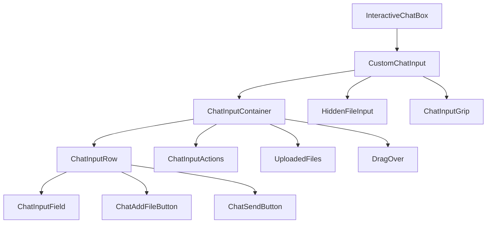
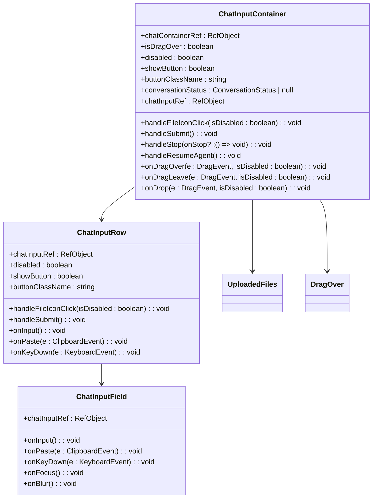
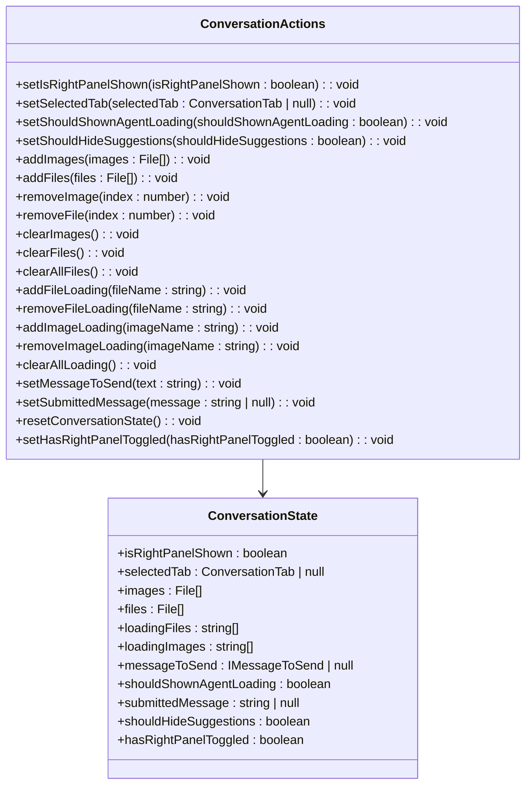
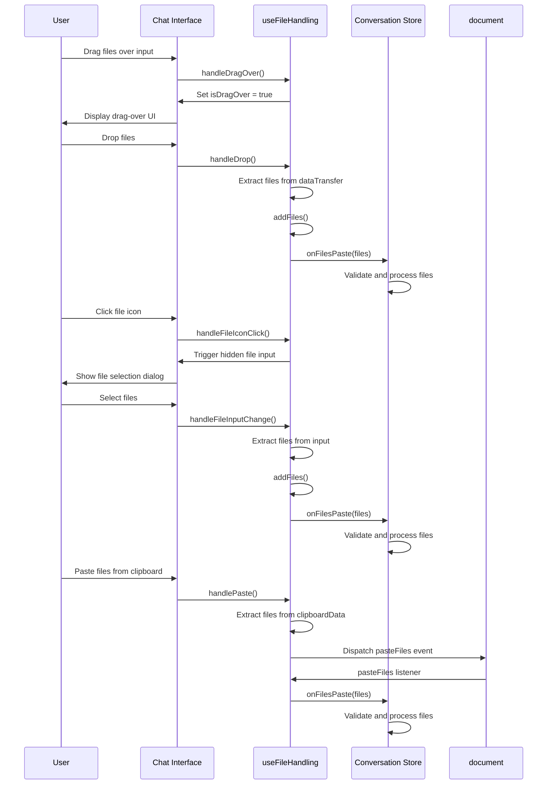
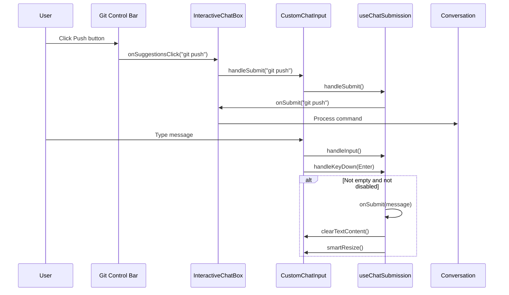
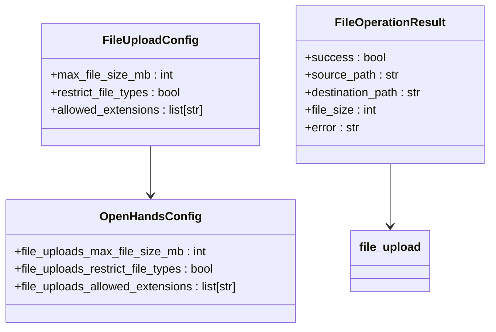
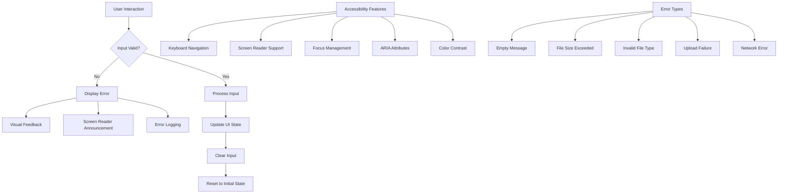

# Input Controls and Interaction

<cite>
**Referenced Files in This Document**   
- [custom-chat-input.tsx](file://frontend/src/components/features/chat/custom-chat-input.tsx)
- [interactive-chat-box.tsx](file://frontend/src/components/features/chat/interactive-chat-box.tsx)
- [chat-input-container.tsx](file://frontend/src/components/features/chat/components/chat-input-container.tsx)
- [chat-input-row.tsx](file://frontend/src/components/features/chat/components/chat-input-row.tsx)
- [chat-input-field.tsx](file://frontend/src/components/features/chat/components/chat-input-field.tsx)
- [use-chat-submission.ts](file://frontend/src/hooks/chat/use-chat-submission.ts)
- [use-file-handling.ts](file://frontend/src/hooks/chat/use-file-handling.ts)
- [use-chat-input-events.ts](file://frontend/src/hooks/chat/use-chat-input-events.ts)
- [use-grip-resize.ts](file://frontend/src/hooks/chat/use-grip-resize.ts)
- [conversation-store.ts](file://frontend/src/state/conversation-store.ts)
- [file-validation.ts](file://frontend/src/utils/file-validation.ts)
- [chat-input.utils.ts](file://frontend/src/components/features/chat/utils/chat-input.utils.ts)
- [file_config.py](file://openhands/server/file_config.py)
- [async_remote_workspace.py](file://openhands/app_server/utils/async_remote_workspace.py)
</cite>

## Table of Contents
1. [Introduction](#introduction)
2. [Input System Architecture](#input-system-architecture)
3. [Interactive Chat Input Components](#interactive-chat-input-components)
4. [State Management and Data Flow](#state-management-and-data-flow)
5. [File Upload and Drag-and-Drop Implementation](#file-upload-and-drag-and-drop-implementation)
6. [Command Suggestion and Interaction Triggers](#command-suggestion-and-interaction-triggers)
7. [Server-Side File Configuration](#server-side-file-configuration)
8. [Accessibility and Error Handling](#accessibility-and-error-handling)
9. [Conclusion](#conclusion)

## Introduction

The OpenHands interactive chat input system provides a comprehensive interface for user interaction with the AI agent. This system enables users to input text messages, upload files through multiple methods, and trigger commands through various interaction patterns. The implementation follows a component-based architecture with clear separation of concerns, leveraging React hooks for reusable logic and Zustand for state management.

The input system is designed to be intuitive and accessible, supporting both keyboard and mouse interactions, touch devices, and assistive technologies. It includes features such as resizable input fields, drag-and-drop file uploads, clipboard file pasting, and command suggestions through Git control bar buttons. The system also implements robust validation and error handling to ensure a smooth user experience.

**Section sources**
- [interactive-chat-box.tsx](file://frontend/src/components/features/chat/interactive-chat-box.tsx#L1-L157)
- [custom-chat-input.tsx](file://frontend/src/components/features/chat/custom-chat-input.tsx#L1-L161)

## Input System Architecture

The interactive chat input system follows a hierarchical component structure that separates concerns and promotes reusability. At the highest level, the `InteractiveChatBox` component serves as the container for the entire input system, coordinating between the chat input and additional controls like the Git control bar.

**Diagram sources**
- [interactive-chat-box.tsx](file://frontend/src/components/features/chat/interactive-chat-box.tsx#L17-L157)
- [custom-chat-input.tsx](file://frontend/src/components/features/chat/custom-chat-input.tsx#L26-L161)
- [chat-input-container.tsx](file://frontend/src/components/features/chat/components/chat-input-container.tsx#L31-L88)

The architecture implements a unidirectional data flow pattern where state is managed at higher levels and passed down to child components through props. The `CustomChatInput` component acts as a controller, orchestrating the various input elements and handling the integration between them. It uses several custom hooks to encapsulate specific functionality:

- `useChatInputLogic`: Manages the content and state of the input field
- `useFileHandling`: Handles file operations including drag-and-drop and file selection
- `useGripResize`: Manages the resize functionality of the input field
- `useChatInputEvents`: Handles user interaction events on the input field
- `useChatSubmission`: Handles message submission logic

This modular approach allows for better code organization, easier testing, and improved maintainability.

**Section sources**
- [custom-chat-input.tsx](file://frontend/src/components/features/chat/custom-chat-input.tsx#L38-L161)
- [chat-input-container.tsx](file://frontend/src/components/features/chat/components/chat-input-container.tsx#L31-L88)

## Interactive Chat Input Components

The interactive chat input system is composed of several specialized components that work together to provide a rich user experience. The core component is `ChatInputField`, which implements a content-editable div that serves as the primary text input area.

**Diagram sources**
- [chat-input-field.tsx](file://frontend/src/components/features/chat/components/chat-input-field.tsx#L13-L44)
- [chat-input-row.tsx](file://frontend/src/components/features/chat/components/chat-input-row.tsx#L21-L62)
- [chat-input-container.tsx](file://frontend/src/components/features/chat/components/chat-input-container.tsx#L31-L88)

The `ChatInputField` component implements a content-editable div with several important features:

- **Placeholder text**: Displays "What would you like to build?" when empty, implemented using the `data-placeholder` attribute and internationalization
- **Text formatting preservation**: Uses CSS properties like `whitespace-pre-wrap` and `text-wrap-mode:inherit` to preserve formatting
- **Accessibility**: Includes proper ARIA attributes and keyboard navigation support
- **Event handling**: Manages input, paste, keydown, focus, and blur events

The `ChatInputRow` component arranges the input field and action buttons horizontally, providing the main interface for user interaction. It contains the `ChatInputField` and the `ChatAddFileButton` on the left side, with the `ChatSendButton` on the right. This layout ensures that the input field can expand to fill available space while keeping action buttons accessible.

The `ChatInputContainer` serves as the outer wrapper that contains all input elements and handles drag-and-drop events. It displays visual feedback when files are being dragged over the input area and manages the overall styling and layout of the input system.

**Section sources**
- [chat-input-field.tsx](file://frontend/src/components/features/chat/components/chat-input-field.tsx#L13-L44)
- [chat-input-row.tsx](file://frontend/src/components/features/chat/components/chat-input-row.tsx#L21-L62)
- [chat-input-container.tsx](file://frontend/src/components/features/chat/components/chat-input-container.tsx#L31-L88)

## State Management and Data Flow

The input system relies on a centralized state management approach using Zustand to coordinate data across components. The `conversation-store.ts` file defines the state store that manages all aspects of the chat input state, including user messages, file uploads, and UI state.

**Diagram sources**
- [conversation-store.ts](file://frontend/src/state/conversation-store.ts#L17-L218)

The state management system tracks several key pieces of information:

- **File state**: Arrays of `images` and `files` that have been selected for upload
- **Loading state**: Arrays of `loadingFiles` and `loadingImages` that are currently being processed
- **Message state**: The current `messageToSend` and `submittedMessage` for coordinating message submission
- **UI state**: Flags like `shouldHideSuggestions` that control the visibility of UI elements based on input state

The data flow follows a clear pattern where user interactions update the state, and state changes trigger UI updates. For example, when a user types in the input field, the `handleInput` event updates the DOM, which triggers the `onInput` event that calls `smartResize` to adjust the input height. When the user submits a message, the `handleSubmit` function reads the current text content, calls the `onSubmit` callback passed from the parent, and then clears the input field.

The system also implements persistence for certain state values. The `isRightPanelShown` state is stored in localStorage, allowing the UI to remember the user's preference between sessions. This is implemented in the `getInitialRightPanelState` helper function that reads from localStorage when the store is initialized.

**Section sources**
- [conversation-store.ts](file://frontend/src/state/conversation-store.ts#L1-L218)
- [custom-chat-input.tsx](file://frontend/src/components/features/chat/custom-chat-input.tsx#L39-L43)

## File Upload and Drag-and-Drop Implementation

The file upload system implements multiple methods for users to add files to their messages, including drag-and-drop, file selection, and clipboard pasting. The implementation is centered around the `useFileHandling` custom hook, which encapsulates all file-related functionality.

**Diagram sources**
- [use-file-handling.ts](file://frontend/src/hooks/chat/use-file-handling.ts#L1-L122)
- [use-chat-input-events.ts](file://frontend/src/hooks/chat/use-chat-input-events.ts#L34-L62)
- [interactive-chat-box.tsx](file://frontend/src/components/features/chat/interactive-chat-box.tsx#L99-L127)

The drag-and-drop functionality is implemented using the HTML5 Drag and Drop API. When files are dragged over the input container, the `handleDragOver` function prevents the default browser behavior and sets the `isDragOver` state to true, which triggers the display of visual feedback. When files are dropped, the `handleDrop` function extracts the files from the `dataTransfer.files` property and passes them to the `addFiles` function.

The file selection functionality uses a hidden file input element that is triggered when the user clicks the file attachment icon. This approach provides a consistent user experience across browsers while allowing for custom styling of the file attachment button. The `HiddenFileInput` component is rendered with `display: none` and is programmatically clicked when the user interacts with the visible file attachment button.

Clipboard file pasting is implemented by listening for paste events and checking if the clipboard contains files. When files are detected in the clipboard, a custom `pasteFiles` event is dispatched, which the file handling system listens for and processes. This allows users to copy files from their file explorer and paste them directly into the chat interface.

File validation is performed both client-side and server-side. Client-side validation checks file size limits and type restrictions before files are processed. The `validateFiles` utility function enforces a 3MB limit on individual files and the total size of all files. Server-side validation is handled by the `load_file_upload_config` function in the backend, which can restrict file types and sizes based on configuration.

**Section sources**
- [use-file-handling.ts](file://frontend/src/hooks/chat/use-file-handling.ts#L1-L122)
- [file-validation.ts](file://frontend/src/utils/file-validation.ts#L1-L53)
- [file_config.py](file://openhands/server/file_config.py#L31-L85)

## Command Suggestion and Interaction Triggers

The input system includes several mechanisms for triggering commands and suggestions, providing users with multiple ways to interact with the system. The primary method is through the Git control bar, which contains buttons for common Git operations that generate appropriate command suggestions.

**Diagram sources**
- [git-control-bar.tsx](file://frontend/src/components/features/chat/git-control-bar.tsx#L16-L93)
- [interactive-chat-box.tsx](file://frontend/src/components/features/chat/interactive-chat-box.tsx#L130-L137)
- [use-chat-submission.ts](file://frontend/src/hooks/chat/use-chat-submission.ts#L18-L37)

The Git control bar contains several buttons that trigger specific commands:
- **Repository selection**: Allows users to select a repository to work with
- **Branch selection**: Enables switching between Git branches
- **Pull**: Generates a suggestion to pull changes from the remote repository
- **Push**: Generates a suggestion to push local changes to the remote repository
- **Pull Request**: Generates a suggestion to create a pull request

When a user clicks one of these buttons, the `onSuggestionsClick` callback is triggered with the appropriate command text. This callback is passed down from the `InteractiveChatBox` component to the `CustomChatInput` component, where it triggers message submission. This pattern allows the Git control bar to remain decoupled from the input system while still being able to trigger actions.

The input field itself supports several interaction triggers:
- **Enter key**: Submits the message when pressed (except on mobile devices or when Shift is held)
- **Shift+Enter**: Inserts a new line without submitting the message
- **Resize grip**: Allows users to manually adjust the height of the input field
- **File attachment button**: Opens the file selection dialog

The `useChatSubmission` hook handles the message submission logic, including form validation (checking for empty messages), calling the `onSubmit` callback, and resetting the input state. It also handles the "resume agent" functionality, which sends a "continue" message when the agent is paused.

The input field also implements smart resizing behavior through the `useGripResize` and `useAutoResize` hooks. The input automatically expands as the user types to accommodate more content, up to a maximum height of 400px. Users can also manually resize the input using the resize grip at the top of the input container. When the input exceeds a threshold height (100px), command suggestions are automatically hidden to prevent layout issues.

**Section sources**
- [git-control-bar.tsx](file://frontend/src/components/features/chat/git-control-bar.tsx#L16-L93)
- [use-chat-submission.ts](file://frontend/src/hooks/chat/use-chat-submission.ts#L18-L67)
- [use-grip-resize.ts](file://frontend/src/hooks/chat/use-grip-resize.ts#L12-L82)

## Server-Side File Configuration

The file upload system includes server-side configuration that controls file upload behavior and security. The `load_file_upload_config` function in the backend retrieves configuration settings from the global config object and applies them to the file upload process.

**Diagram sources**
- [file_config.py](file://openhands/server/file_config.py#L31-L85)
- [async_remote_workspace.py](file://openhands/app_server/utils/async_remote_workspace.py#L143-L199)

The server-side configuration includes three main settings:
- **Maximum file size**: Controlled by `file_uploads_max_file_size_mb`, which sets the maximum size for uploaded files in megabytes. A value of 0 means no limit.
- **File type restrictions**: Controlled by `file_uploads_restrict_file_types`, which determines whether file type restrictions are enforced.
- **Allowed extensions**: Controlled by `file_uploads_allowed_extensions`, which specifies the file extensions that are allowed for upload.

The `load_file_upload_config` function performs sanity checks on these values to ensure they are valid and safe. If the maximum file size is invalid or negative, it defaults to 0 (no limit). If the allowed extensions list is invalid or empty, it defaults to `['.*']` (all file types). If file type restrictions are disabled, it also allows all file types regardless of the allowed extensions list.

When files are uploaded, they are sent to the remote system via an HTTP API endpoint `/api/files/upload`. The `file_upload` method in the `AsyncRemoteWorkspace` class handles this process, reading the local file content and sending it as a multipart form request with the destination path. The method includes error handling to catch and report any issues that occur during the upload process.

The server also performs additional validation on uploaded files, including checking file size limits and type restrictions based on the configuration. This multi-layered approach to validation ensures that files are checked both on the client and server sides, providing robust protection against invalid or potentially harmful file uploads.

**Section sources**
- [file_config.py](file://openhands/server/file_config.py#L31-L85)
- [async_remote_workspace.py](file://openhands/app_server/utils/async_remote_workspace.py#L143-L199)

## Accessibility and Error Handling

The input system implements comprehensive accessibility features and error handling to ensure a robust user experience. The components are designed to be usable with keyboard navigation, screen readers, and other assistive technologies.

**Diagram sources**
- [chat-input-field.tsx](file://frontend/src/components/features/chat/components/chat-input-field.tsx#L30-L40)
- [file-validation.ts](file://frontend/src/utils/file-validation.ts#L1-L53)
- [use-chat-submission.ts](file://frontend/src/hooks/chat/use-chat-submission.ts#L22-L24)

The system implements several accessibility features:
- **Keyboard navigation**: All interactive elements are accessible via keyboard, with proper focus management
- **Screen reader support**: Elements include appropriate ARIA attributes and labels
- **Focus management**: The input field maintains focus appropriately during interactions
- **Color contrast**: Sufficient contrast between text and background colors
- **Visual indicators**: Clear visual feedback for interactive elements

Error handling is implemented at multiple levels:
- **Client-side validation**: Immediate feedback for invalid inputs, such as empty messages or files that exceed size limits
- **Server-side validation**: Additional validation on the server to ensure data integrity
- **Error display**: Clear error messages displayed to users when issues occur
- **Error logging**: Errors are logged for debugging and monitoring purposes

When validation fails, the system provides specific error messages to help users understand and correct the issue. For example, if a user attempts to upload a file that exceeds the size limit, they receive a message indicating which files are too large. If multiple files would exceed the total size limit, they receive a message indicating the total size and the limit.

The system also handles edge cases gracefully. For example, when the conversation is stopped, the input field is disabled to prevent users from sending messages. When the agent is loading or awaiting user confirmation, the input is also disabled to prevent conflicting actions.

Error states are communicated through multiple channels:
- **Visual feedback**: Error messages displayed in the UI
- **Screen reader announcements**: ARIA live regions announce errors to screen reader users
- **Console logging**: Errors are logged to the console for debugging
- **Analytics**: Errors may be tracked for monitoring and improvement

**Section sources**
- [use-chat-submission.ts](file://frontend/src/hooks/chat/use-chat-submission.ts#L22-L24)
- [file-validation.ts](file://frontend/src/utils/file-validation.ts#L1-L53)
- [chat-input-field.tsx](file://frontend/src/components/features/chat/components/chat-input-field.tsx#L30-L40)

## Conclusion

The OpenHands interactive chat input system provides a comprehensive and user-friendly interface for interacting with the AI agent. Through a well-structured component hierarchy and effective state management, the system enables users to input text messages, upload files, and trigger commands with ease.

The implementation demonstrates several best practices in frontend development:
- **Component-based architecture**: Clear separation of concerns with reusable components
- **Custom hooks**: Encapsulation of reusable logic for better maintainability
- **Centralized state management**: Zustand store for coordinating state across components
- **Accessibility**: Support for keyboard navigation, screen readers, and other assistive technologies
- **Error handling**: Comprehensive validation and error reporting at both client and server levels

The system's support for multiple file upload methods (drag-and-drop, file selection, and clipboard pasting) provides flexibility for users with different preferences and workflows. The integration with the Git control bar enables quick access to common commands, enhancing productivity.

Future improvements could include:
- **Enhanced file preview**: Providing previews for uploaded files before submission
- **Batch operations**: Allowing users to perform actions on multiple selected files
- **Improved mobile experience**: Optimizing the interface for touch devices
- **Advanced command suggestions**: Context-aware suggestions based on the current conversation

Overall, the input system effectively balances functionality, usability, and robustness, providing a solid foundation for user interaction with the OpenHands platform.

**Section sources**
- [interactive-chat-box.tsx](file://frontend/src/components/features/chat/interactive-chat-box.tsx#L1-L157)
- [custom-chat-input.tsx](file://frontend/src/components/features/chat/custom-chat-input.tsx#L1-L161)
- [conversation-store.ts](file://frontend/src/state/conversation-store.ts#L1-L218)