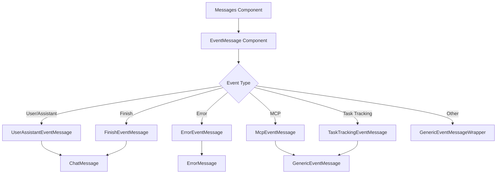
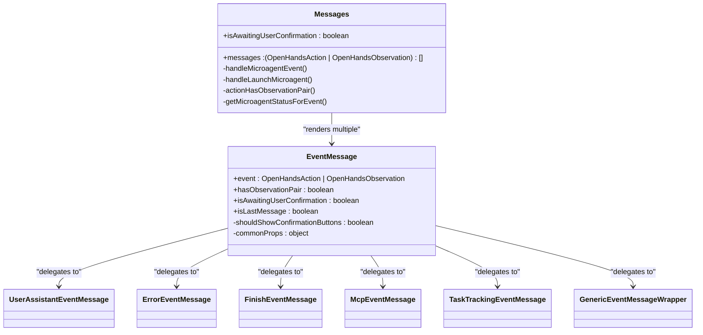
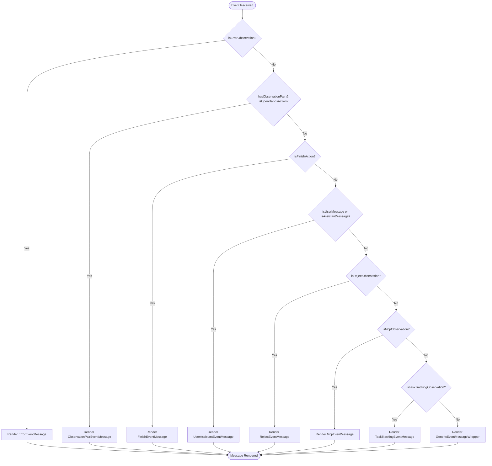
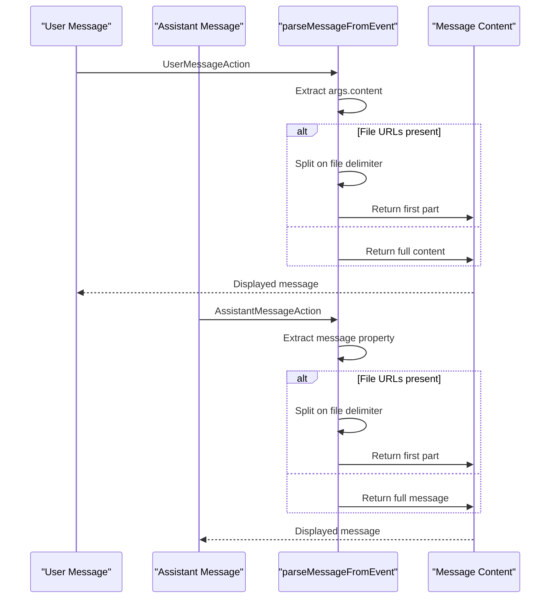
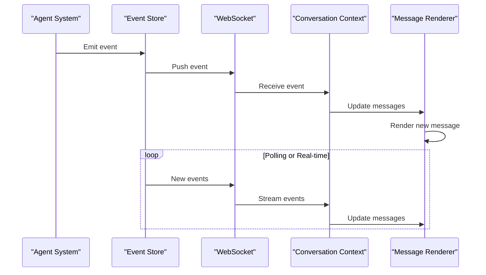
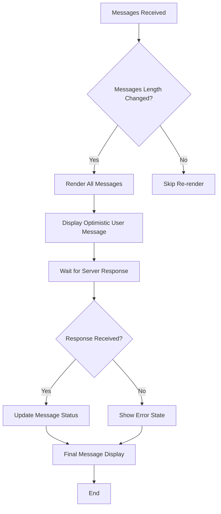
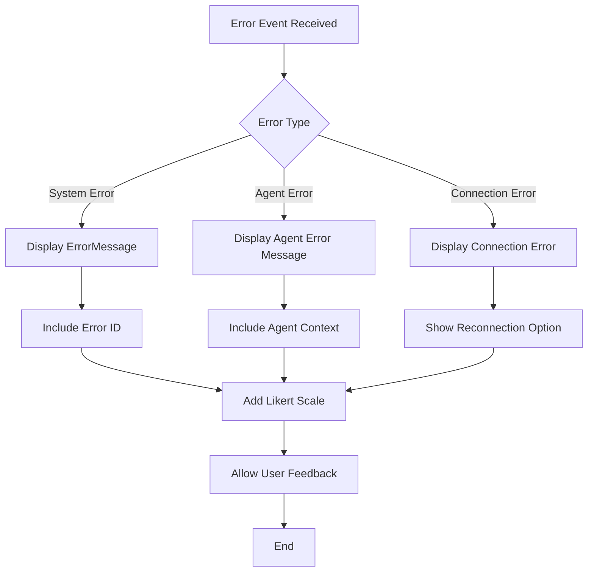

# Message Rendering System

<cite>
**Referenced Files in This Document**   
- [messages.tsx](file://frontend/src/components/features/chat/messages.tsx)
- [event-message.tsx](file://frontend/src/components/features/chat/event-message.tsx)
- [event-message-components/index.ts](file://frontend/src/components/features/chat/event-message-components/index.ts)
- [user-assistant-event-message.tsx](file://frontend/src/components/features/chat/event-message-components/user-assistant-event-message.tsx)
- [error-event-message.tsx](file://frontend/src/components/features/chat/event-message-components/error-event-message.tsx)
- [finish-event-message.tsx](file://frontend/src/components/features/chat/event-message-components/finish-event-message.tsx)
- [mcp-event-message.tsx](file://frontend/src/components/features/chat/event-message-components/mcp-event-message.tsx)
- [task-tracking-event-message.tsx](file://frontend/src/components/features/chat/event-message-components/task-tracking-event-message.tsx)
- [chat-message.tsx](file://frontend/src/components/features/chat/chat-message.tsx)
- [parse-message-from-event.ts](file://frontend/src/components/features/chat/event-content-helpers/parse-message-from-event.ts)
- [get-observation-result.ts](file://frontend/src/components/features/chat/event-content-helpers/get-observation-result.ts)
- [types/core/guards.ts](file://frontend/src/types/core/guards.ts)
- [types/core/actions.ts](file://frontend/src/types/core/actions.ts)
- [types/core/observations.ts](file://frontend/src/types/core/observations.ts)
- [conversation-subscriptions-provider.tsx](file://frontend/src/context/conversation-subscriptions-provider.tsx)
</cite>

## Table of Contents
1. [Introduction](#introduction)
2. [Message Rendering Architecture](#message-rendering-architecture)
3. [Core Components](#core-components)
4. [Event Message Processing](#event-message-processing)
5. [Event Message Components](#event-message-components)
6. [Message Content Parsing](#message-content-parsing)
7. [Relationship with Event Store](#relationship-with-event-store)
8. [Message Ordering and Loading States](#message-ordering-and-loading-states)
9. [Error Handling](#error-handling)
10. [Conclusion](#conclusion)

## Introduction

The Message Rendering System in OpenHands is responsible for processing and displaying messages from the agent system in the user interface. This system handles various event types and renders them appropriately based on their content and context. The architecture is designed to be extensible, allowing for different message types to be handled by specialized components while maintaining a consistent user experience.

The system's primary responsibility is to transform raw events from the agent system into visually meaningful representations in the chat interface. It accomplishes this through a hierarchical component structure that delegates rendering responsibilities based on event type, ensuring that each message type is displayed with the appropriate formatting, actions, and interactive elements.

**Section sources**
- [messages.tsx](file://frontend/src/components/features/chat/messages.tsx)
- [event-message.tsx](file://frontend/src/components/features/chat/event-message.tsx)

## Message Rendering Architecture

The Message Rendering System follows a component-based architecture with a clear separation of concerns. At the highest level, the `Messages` component serves as the main container that receives a collection of events and renders them in sequence. This component coordinates the rendering process and provides context to individual message components.

The architecture employs a delegation pattern where the main `Messages` component passes each event to the `EventMessage` component, which then determines the appropriate specialized component to render based on the event type. This design allows for easy extension of the system with new message types without modifying the core rendering logic.



**Diagram sources**
- [messages.tsx](file://frontend/src/components/features/chat/messages.tsx)
- [event-message.tsx](file://frontend/src/components/features/chat/event-message.tsx)

**Section sources**
- [messages.tsx](file://frontend/src/components/features/chat/messages.tsx)
- [event-message.tsx](file://frontend/src/components/features/chat/event-message.tsx)

## Core Components

The Message Rendering System consists of several core components that work together to display messages in the chat interface. The `Messages` component is the main container that receives the collection of events and renders them in sequence. It handles message ordering, loading states, and provides context to individual message components.

The `EventMessage` component acts as a router that determines which specialized component should render a given event based on its type. This component uses type guards to identify the event type and delegates rendering to the appropriate specialized component. It also manages shared functionality such as confirmation buttons and microagent status indicators.



**Diagram sources**
- [messages.tsx](file://frontend/src/components/features/chat/messages.tsx)
- [event-message.tsx](file://frontend/src/components/features/chat/event-message.tsx)

**Section sources**
- [messages.tsx](file://frontend/src/components/features/chat/messages.tsx)
- [event-message.tsx](file://frontend/src/components/features/chat/event-message.tsx)

## Event Message Processing

The Event Message Processing system uses type guards to determine how to render each event. These type guards are defined in the `types/core/guards.ts` file and provide type-safe functions to identify different event types. The system uses these guards to route events to the appropriate rendering components.

When an event is processed, the `EventMessage` component first checks if it's an error observation using the `isErrorObservation` guard. If not, it checks for observation pairs with OpenHands actions using `isOpenHandsAction`. The component then proceeds through a series of type checks for finish actions, user and assistant messages, reject observations, MCP observations, and task tracking observations.



**Diagram sources**
- [event-message.tsx](file://frontend/src/components/features/chat/event-message.tsx)
- [types/core/guards.ts](file://frontend/src/types/core/guards.ts)

**Section sources**
- [event-message.tsx](file://frontend/src/components/features/chat/event-message.tsx)
- [types/core/guards.ts](file://frontend/src/types/core/guards.ts)

## Event Message Components

The Event Message Components directory contains specialized components for rendering different types of messages. Each component is responsible for a specific event type and handles the unique rendering requirements for that type. The components are exported through the `index.ts` file, which serves as a centralized import point.

The `UserAssistantEventMessage` component handles both user and assistant messages, displaying the message content along with any associated images or files. It also includes confirmation buttons when appropriate and renders microagent status indicators and Likert scale feedback components for assistant messages.

The `ErrorEventMessage` component renders error observations with specific error formatting and includes the Likert scale feedback component. The `FinishEventMessage` component handles finish actions and displays the final thoughts from the agent. The `McpEventMessage` and `TaskTrackingEventMessage` components handle MCP (Model Context Protocol) observations and task tracking observations respectively, using the `GenericEventMessage` component for consistent styling.

```mermaid
classDiagram
class UserAssistantEventMessage {
+event : OpenHandsAction
+shouldShowConfirmationButtons : boolean
+microagentStatus : MicroagentStatus | null
+microagentConversationId : string
+microagentPRUrl : string
+actions : Array<{icon, onClick, tooltip}>
+isLastMessage : boolean
+isInLast10Actions : boolean
+config : {APP_MODE? : string} | null
+isCheckingFeedback : boolean
+feedbackData : {exists, rating, reason}
-message : string
}
class ErrorEventMessage {
+event : OpenHandsObservation
+microagentStatus : MicroagentStatus | null
+microagentConversationId : string
+microagentPRUrl : string
+actions : Array<{icon, onClick, tooltip}>
+isLastMessage : boolean
+isInLast10Actions : boolean
+config : {APP_MODE? : string} | null
+isCheckingFeedback : boolean
+feedbackData : {exists, rating, reason}
}
class FinishEventMessage {
+event : OpenHandsAction
+microagentStatus : MicroagentStatus | null
+microagentConversationId : string
+microagentPRUrl : string
+actions : Array<{icon, onClick, tooltip}>
+isLastMessage : boolean
+isInLast10Actions : boolean
+config : {APP_MODE? : string} | null
+isCheckingFeedback : boolean
+feedbackData : {exists, rating, reason}
}
class McpEventMessage {
+event : OpenHandsObservation
+shouldShowConfirmationButtons : boolean
}
class TaskTrackingEventMessage {
+event : OpenHandsObservation
+shouldShowConfirmationButtons : boolean
}
UserAssistantEventMessage --> ChatMessage : "uses"
UserAssistantEventMessage --> ImageCarousel : "uses"
UserAssistantEventMessage --> FileList : "uses"
UserAssistantEventMessage --> ConfirmationButtons : "uses"
UserAssistantEventMessage --> MicroagentStatusWrapper : "uses"
UserAssistantEventMessage --> LikertScaleWrapper : "uses"
ErrorEventMessage --> ErrorMessage : "uses"
ErrorEventMessage --> MicroagentStatusWrapper : "uses"
ErrorEventMessage --> LikertScaleWrapper : "uses"
FinishEventMessage --> ChatMessage : "uses"
FinishEventMessage --> MicroagentStatusWrapper : "uses"
FinishEventMessage --> LikertScaleWrapper : "uses"
McpEventMessage --> GenericEventMessage : "uses"
McpEventMessage --> MCPObservationContent : "uses"
McpEventMessage --> ConfirmationButtons : "uses"
TaskTrackingEventMessage --> GenericEventMessage : "uses"
TaskTrackingEventMessage --> TaskTrackingObservationContent : "uses"
TaskTrackingEventMessage --> ConfirmationButtons : "uses"
```

**Diagram sources**
- [event-message-components/index.ts](file://frontend/src/components/features/chat/event-message-components/index.ts)
- [user-assistant-event-message.tsx](file://frontend/src/components/features/chat/event-message-components/user-assistant-event-message.tsx)
- [error-event-message.tsx](file://frontend/src/components/features/chat/event-message-components/error-event-message.tsx)
- [finish-event-message.tsx](file://frontend/src/components/features/chat/event-message-components/finish-event-message.tsx)
- [mcp-event-message.tsx](file://frontend/src/components/features/chat/event-message-components/mcp-event-message.tsx)
- [task-tracking-event-message.tsx](file://frontend/src/components/features/chat/event-message-components/task-tracking-event-message.tsx)

**Section sources**
- [event-message-components/index.ts](file://frontend/src/components/features/chat/event-message-components/index.ts)
- [user-assistant-event-message.tsx](file://frontend/src/components/features/chat/event-message-components/user-assistant-event-message.tsx)
- [error-event-message.tsx](file://frontend/src/components/features/chat/event-message-components/error-event-message.tsx)
- [finish-event-message.tsx](file://frontend/src/components/features/chat/event-message-components/finish-event-message.tsx)
- [mcp-event-message.tsx](file://frontend/src/components/features/chat/event-message-components/mcp-event-message.tsx)
- [task-tracking-event-message.tsx](file://frontend/src/components/features/chat/event-message-components/task-tracking-event-message.tsx)

## Message Content Parsing

The Message Content Parsing system handles the extraction and formatting of message content from events. The `parseMessageFromEvent` function is responsible for extracting the message content from user and assistant messages, handling cases where file URLs are present in the message.

For user messages, the function extracts the content from the `args.content` property, while for assistant messages it uses the `message` property directly. When file URLs are present, the function splits the message content to remove the file augmentation prompt, ensuring that only the core message content is displayed.

The system also includes the `getObservationResult` function, which determines the success status of observation events based on their content and metadata. This function handles different observation types differently, using exit codes for command observations and content analysis for other observation types.



**Diagram sources**
- [parse-message-from-event.ts](file://frontend/src/components/features/chat/event-content-helpers/parse-message-from-event.ts)
- [get-observation-result.ts](file://frontend/src/components/features/chat/event-content-helpers/get-observation-result.ts)

**Section sources**
- [parse-message-from-event.ts](file://frontend/src/components/features/chat/event-content-helpers/parse-message-from-event.ts)
- [get-observation-result.ts](file://frontend/src/components/features/chat/event-content-helpers/get-observation-result.ts)

## Relationship with Event Store

The Message Rendering System is closely integrated with the event store, which serves as the source of truth for all messages in a conversation. The `Messages` component receives events from the conversation context, which are ultimately sourced from the event store. This integration ensures that messages are displayed in the correct order and that new messages are rendered as they are added to the store.

The system uses the `ConversationSubscriptionsProvider` to manage WebSocket connections to the backend, receiving events in real-time as they are generated by the agent system. When a new event is received, it is added to the event store and then rendered by the message system. This real-time update mechanism ensures that users see messages as soon as they are available.

The event store also handles message ordering, ensuring that events are presented in chronological order based on their timestamps. The message rendering system respects this ordering, displaying messages in the sequence they are received from the store.



**Diagram sources**
- [messages.tsx](file://frontend/src/components/features/chat/messages.tsx)
- [conversation-subscriptions-provider.tsx](file://frontend/src/context/conversation-subscriptions-provider.tsx)

**Section sources**
- [messages.tsx](file://frontend/src/components/features/chat/messages.tsx)
- [conversation-subscriptions-provider.tsx](file://frontend/src/context/conversation-subscriptions-provider.tsx)

## Message Ordering and Loading States

The Message Rendering System handles message ordering and loading states to ensure a smooth user experience. Messages are displayed in chronological order based on their sequence in the events array, which is maintained by the event store. The system uses React's `map` function to iterate through the messages array, rendering each message in sequence.

For loading states, the system includes support for optimistic user messages, which are displayed immediately when a user sends a message, before receiving confirmation from the server. This creates a responsive interface that doesn't require users to wait for network responses before seeing their input.

The `Messages` component also implements a memoization strategy to prevent unnecessary re-renders when the message count hasn't changed. This optimization improves performance, especially in conversations with many messages. The component only re-renders when the number of messages changes, reducing the computational overhead of updating the UI.



**Diagram sources**
- [messages.tsx](file://frontend/src/components/features/chat/messages.tsx)

**Section sources**
- [messages.tsx](file://frontend/src/components/features/chat/messages.tsx)

## Error Handling

The Message Rendering System includes comprehensive error handling to ensure that issues are communicated clearly to users. When an error event is received, it is rendered using the `ErrorEventMessage` component, which displays the error message and any associated error ID. This component also includes the Likert scale feedback component, allowing users to provide feedback on error experiences.

The system handles errors at multiple levels. At the rendering level, type guards ensure that components only attempt to render events they are designed to handle, preventing runtime errors from invalid data. At the connection level, the `ConversationSubscriptionsProvider` monitors WebSocket connections and handles disconnection events gracefully.

For agent errors, the system displays specific error messages and provides context about what went wrong. The error handling is integrated with the microagent system, allowing users to launch microagents to address issues or continue tasks despite errors.



**Diagram sources**
- [error-event-message.tsx](file://frontend/src/components/features/chat/event-message-components/error-event-message.tsx)
- [conversation-subscriptions-provider.tsx](file://frontend/src/context/conversation-subscriptions-provider.tsx)

**Section sources**
- [error-event-message.tsx](file://frontend/src/components/features/chat/event-message-components/error-event-message.tsx)
- [conversation-subscriptions-provider.tsx](file://frontend/src/context/conversation-subscriptions-provider.tsx)

## Conclusion

The Message Rendering System in OpenHands provides a robust and extensible framework for displaying agent system events in the user interface. By using a component-based architecture with specialized rendering components for different event types, the system ensures that messages are displayed appropriately while maintaining code organization and ease of extension.

The system's integration with the event store ensures that messages are ordered correctly and updated in real-time as new events are generated. The use of type guards and component delegation allows for type-safe rendering of different message types, while the inclusion of features like optimistic messaging and error handling creates a responsive and user-friendly experience.

For developers, the system's modular design makes it easy to add support for new message types by creating specialized components and updating the routing logic in the `EventMessage` component. The clear separation of concerns between message processing, content parsing, and visual rendering makes the codebase maintainable and understandable.