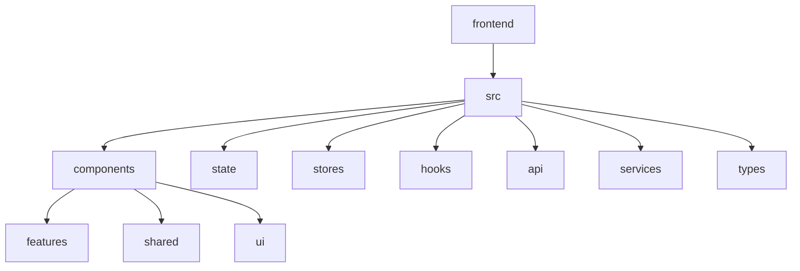
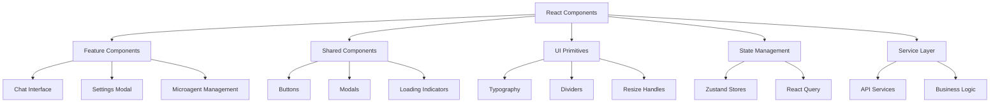
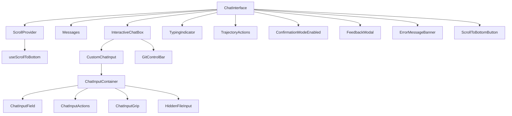
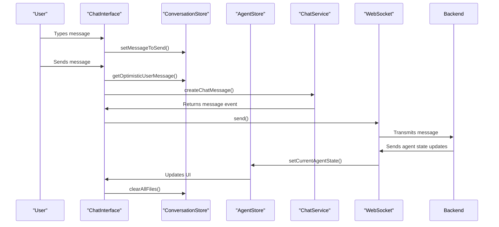
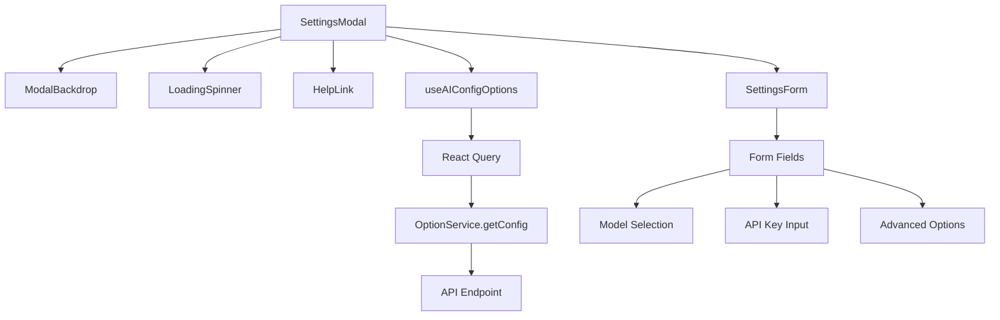
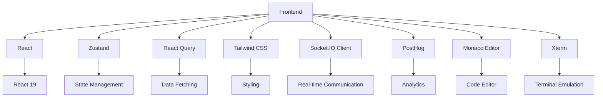

# Component Architecture

<cite>
**Referenced Files in This Document**   
- [chat-interface.tsx](file://frontend/src/components/features/chat/chat-interface.tsx)
- [interactive-chat-box.tsx](file://frontend/src/components/features/chat/interactive-chat-box.tsx)
- [conversation-store.ts](file://frontend/src/state/conversation-store.ts)
- [agent-store.ts](file://frontend/src/stores/agent-store.ts)
- [settings-modal.tsx](file://frontend/src/components/shared/modals/settings/settings-modal.tsx)
- [use-config.ts](file://frontend/src/hooks/query/use-config.ts)
- [chat-service.ts](file://frontend/src/services/chat-service.ts)
- [tailwind.config.js](file://frontend/tailwind.config.js)
- [package.json](file://frontend/package.json)
</cite>

## Table of Contents
1. [Introduction](#introduction)
2. [Project Structure](#project-structure)
3. [Core Components](#core-components)
4. [Architecture Overview](#architecture-overview)
5. [Detailed Component Analysis](#detailed-component-analysis)
6. [Dependency Analysis](#dependency-analysis)
7. [Performance Considerations](#performance-considerations)
8. [Troubleshooting Guide](#troubleshooting-guide)
9. [Conclusion](#conclusion)

## Introduction
This document provides a comprehensive analysis of the frontend component architecture for the OpenHands application. The architecture is built on React with a strong emphasis on reusable UI components and effective composition patterns. The system leverages modern frontend technologies including React Query for data fetching, Zustand for state management, and Tailwind CSS for styling. The component structure is organized into three main categories: features, shared components, and UI primitives, enabling a scalable and maintainable codebase.

## Project Structure

**Diagram sources**
- [frontend/src/components](file://frontend/src/components)
- [frontend/src/state](file://frontend/src/state)
- [frontend/src/stores](file://frontend/src/stores)

**Section sources**
- [frontend/src](file://frontend/src)

## Core Components

The frontend architecture is organized around three primary component categories: feature components, shared components, and UI primitives. Feature components represent major application functionality like the chat interface, conversation panel, and settings modals. Shared components are reusable elements used across multiple features, while UI primitives provide basic building blocks for the user interface.

**Section sources**
- [frontend/src/components/features](file://frontend/src/components/features)
- [frontend/src/components/shared](file://frontend/src/components/shared)
- [frontend/src/components/ui](file://frontend/src/components/ui)

## Architecture Overview

**Diagram sources**
- [frontend/src/components/features](file://frontend/src/components/features)
- [frontend/src/components/shared](file://frontend/src/components/shared)
- [frontend/src/components/ui](file://frontend/src/components/ui)
- [frontend/src/state](file://frontend/src/state)
- [frontend/src/stores](file://frontend/src/stores)
- [frontend/src/services](file://frontend/src/services)

## Detailed Component Analysis

### Chat Interface Analysis

The chat interface component serves as the central communication hub of the application, integrating multiple subcomponents and state management systems to provide a seamless user experience.

#### Component Composition

**Diagram sources**
- [frontend/src/components/features/chat/chat-interface.tsx](file://frontend/src/components/features/chat/chat-interface.tsx)
- [frontend/src/components/features/chat/interactive-chat-box.tsx](file://frontend/src/components/features/chat/interactive-chat-box.tsx)
- [frontend/src/components/features/chat/components](file://frontend/src/components/features/chat/components)

**Section sources**
- [frontend/src/components/features/chat/chat-interface.tsx](file://frontend/src/components/features/chat/chat-interface.tsx)
- [frontend/src/components/features/chat/interactive-chat-box.tsx](file://frontend/src/components/features/chat/interactive-chat-box.tsx)

### State Management Architecture

The application employs a hybrid state management approach combining Zustand for global state and React Query for server state management.

#### State Management Flow

**Diagram sources**
- [frontend/src/state/conversation-store.ts](file://frontend/src/state/conversation-store.ts)
- [frontend/src/stores/agent-store.ts](file://frontend/src/stores/agent-store.ts)
- [frontend/src/services/chat-service.ts](file://frontend/src/services/chat-service.ts)
- [frontend/src/components/features/chat/chat-interface.tsx](file://frontend/src/components/features/chat/chat-interface.tsx)

**Section sources**
- [frontend/src/state/conversation-store.ts](file://frontend/src/state/conversation-store.ts)
- [frontend/src/stores/agent-store.ts](file://frontend/src/stores/agent-store.ts)
- [frontend/src/services/chat-service.ts](file://frontend/src/services/chat-service.ts)

### Settings Modal Implementation

The settings modal component demonstrates the application's approach to form management and API integration.

#### Settings Modal Structure

**Diagram sources**
- [frontend/src/components/shared/modals/settings/settings-modal.tsx](file://frontend/src/components/shared/modals/settings/settings-modal.tsx)
- [frontend/src/hooks/query/use-ai-config-options.ts](file://frontend/src/hooks/query/use-ai-config-options.ts)
- [frontend/src/api/option-service/option-service.api.ts](file://frontend/src/api/option-service/option-service.api.ts)

**Section sources**
- [frontend/src/components/shared/modals/settings/settings-modal.tsx](file://frontend/src/components/shared/modals/settings/settings-modal.tsx)

## Dependency Analysis

**Diagram sources**
- [frontend/package.json](file://frontend/package.json)

**Section sources**
- [frontend/package.json](file://frontend/package.json)

## Performance Considerations

The component architecture incorporates several performance optimizations:

1. **Code Splitting**: Components are organized to enable lazy loading of feature modules
2. **Memoization**: React.memo and useMemo are used to prevent unnecessary re-renders
3. **Virtual Scrolling**: Implemented for message lists to handle large conversations efficiently
4. **Debounced State Updates**: State changes are batched to minimize re-renders
5. **Image Optimization**: Images are converted to base64 and processed asynchronously
6. **File Validation**: Client-side validation prevents unnecessary network requests for invalid files

The architecture also implements efficient data fetching patterns with React Query, including stale time and garbage collection configurations to balance fresh data with performance.

**Section sources**
- [frontend/src/components/features/chat/chat-interface.tsx](file://frontend/src/components/features/chat/chat-interface.tsx)
- [frontend/src/hooks/query/use-config.ts](file://frontend/src/hooks/query/use-config.ts)
- [frontend/src/utils/file-validation.ts](file://frontend/src/utils/file-validation.ts)

## Troubleshooting Guide

Common issues and their solutions in the component architecture:

1. **WebSocket Connection Issues**: Ensure the WebSocket client is properly initialized and reconnection logic is in place
2. **State Synchronization Problems**: Verify that Zustand store updates are properly triggered and subscribed to
3. **File Upload Failures**: Check file size limits and type validation in the file processing pipeline
4. **Performance Degradation with Large Conversations**: Implement message batching and virtual scrolling optimizations
5. **Memory Leaks in Event Listeners**: Ensure proper cleanup of WebSocket event listeners in useEffect cleanup functions
6. **Zustand Store Persistence Issues**: Verify localStorage integration for persistent state

The architecture includes comprehensive error handling through toast notifications and error boundary components to provide user feedback during failures.

**Section sources**
- [frontend/src/components/features/chat/chat-interface.tsx](file://frontend/src/components/features/chat/chat-interface.tsx)
- [frontend/src/components/features/chat/interactive-chat-box.tsx](file://frontend/src/components/features/chat/interactive-chat-box.tsx)
- [frontend/src/utils/custom-toast-handlers.ts](file://frontend/src/utils/custom-toast-handlers.ts)

## Conclusion

The OpenHands frontend component architecture demonstrates a well-structured React application with clear separation of concerns, reusable components, and effective state management. The architecture successfully integrates modern frontend technologies to create a responsive and scalable user interface. Key strengths include the modular component organization, efficient state management with Zustand and React Query, and robust integration with backend services through WebSocket and REST APIs. The use of Tailwind CSS enables consistent theming and responsive design across all components. This architecture provides a solid foundation for future enhancements and feature additions.