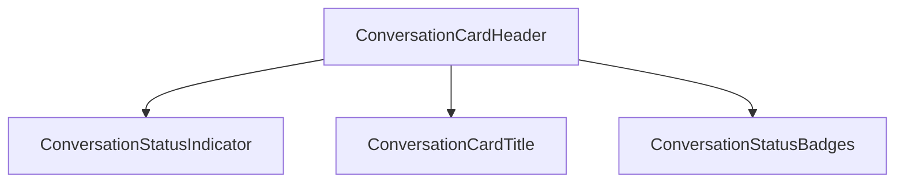
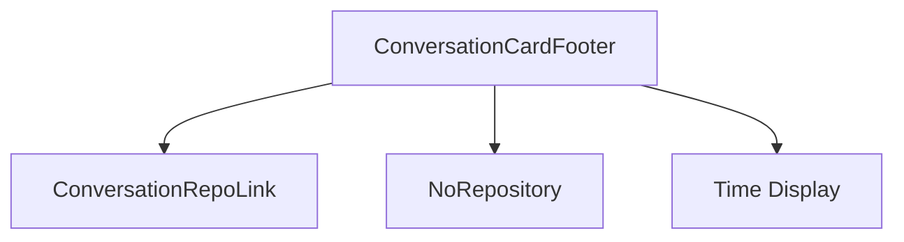
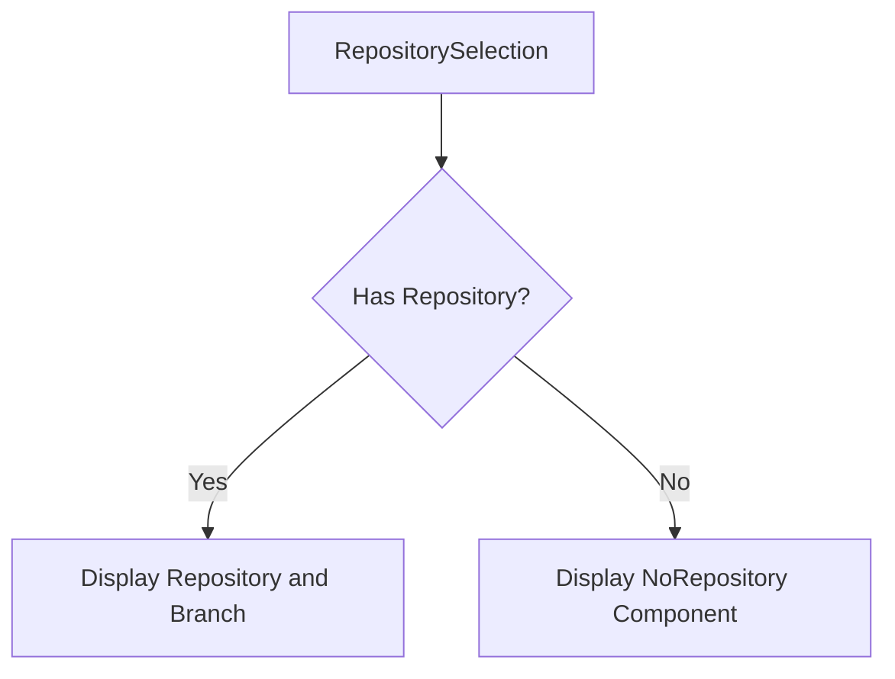
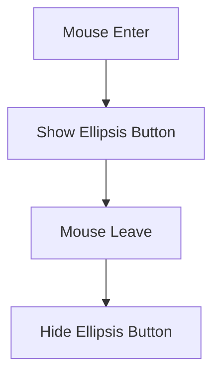
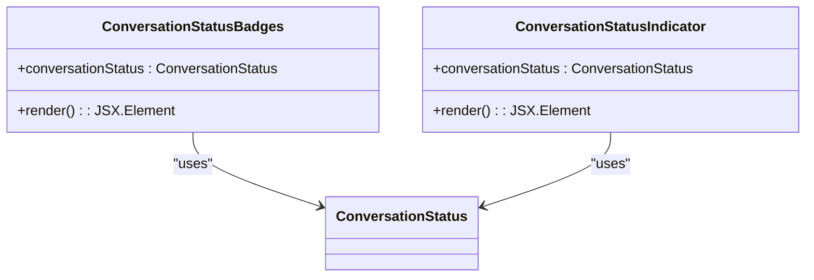
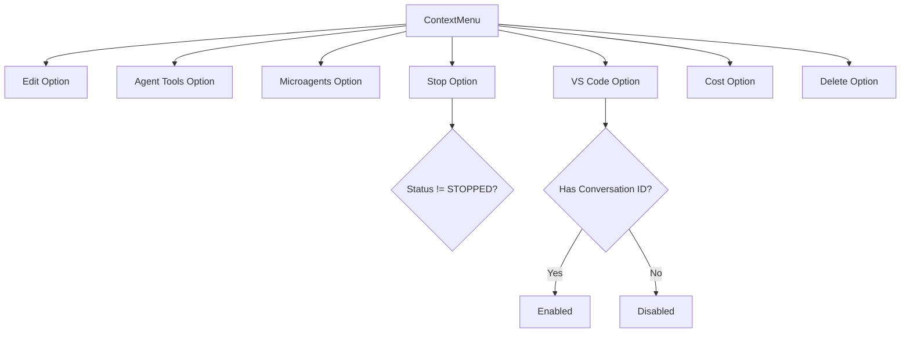
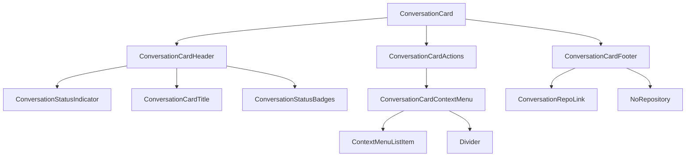

# Conversation Card Component

<cite>
**Referenced Files in This Document**   
- [conversation-card.tsx](file://frontend/src/components/features/conversation-panel/conversation-card/conversation-card.tsx)
- [conversation-card-header.tsx](file://frontend/src/components/features/conversation-panel/conversation-card/conversation-card-header.tsx)
- [conversation-card-footer.tsx](file://frontend/src/components/features/conversation-panel/conversation-card/conversation-card-footer.tsx)
- [conversation-card-title.tsx](file://frontend/src/components/features/conversation-panel/conversation-card/conversation-card-title.tsx)
- [conversation-card-actions.tsx](file://frontend/src/components/features/conversation-panel/conversation-card/conversation-card-actions.tsx)
- [conversation-card-context-menu.tsx](file://frontend/src/components/features/conversation-panel/conversation-card/conversation-card-context-menu.tsx)
- [conversation-status-indicator.tsx](file://frontend/src/components/features/home/recent-conversations/conversation-status-indicator.tsx)
- [conversation-status-badges.tsx](file://frontend/src/components/features/conversation-panel/conversation-card/conversation-status-badges.tsx)
- [conversation-repo-link.tsx](file://frontend/src/components/features/conversation-panel/conversation-card/conversation-repo-link.tsx)
- [no-repository.tsx](file://frontend/src/components/features/conversation-panel/conversation-card/no-repository.tsx)
- [conversation-status.ts](file://frontend/src/types/conversation-status.ts)
</cite>

## Table of Contents
1. [Introduction](#introduction)
2. [Core Components](#core-components)
3. [Data Display Logic](#data-display-logic)
4. [Interaction Patterns](#interaction-patterns)
5. [Status Indicators](#status-indicators)
6. [Context Menu Implementation](#context-menu-implementation)
7. [Component Hierarchy](#component-hierarchy)
8. [State Management](#state-management)
9. [Accessibility and Internationalization](#accessibility-and-internationalization)
10. [Integration with Conversation Management System](#integration-with-conversation-management-system)

## Introduction
The Conversation Card Component is a UI element designed to display conversation summaries in both list and grid layouts within the OpenHands application. It serves as a primary interface for users to view and interact with their conversations, providing essential metadata and interaction controls. The component is implemented as a modular React component with several subcomponents that handle specific aspects of the card's functionality and appearance.

**Section sources**
- [conversation-card.tsx](file://frontend/src/components/features/conversation-panel/conversation-card/conversation-card.tsx)

## Core Components
The Conversation Card Component is composed of several subcomponents that work together to create a cohesive user interface. These include the header, footer, title, actions, and context menu components, each responsible for a specific aspect of the card's functionality.

### Header Component
The header component contains the conversation title, status indicator, and status badges. It is implemented in `conversation-card-header.tsx` and serves as the primary visual identifier for each conversation.

**Diagram sources**
- [conversation-card-header.tsx](file://frontend/src/components/features/conversation-panel/conversation-card/conversation-card-header.tsx)
- [conversation-status-indicator.tsx](file://frontend/src/components/features/home/recent-conversations/conversation-status-indicator.tsx)
- [conversation-card-title.tsx](file://frontend/src/components/features/conversation-panel/conversation-card/conversation-card-title.tsx)
- [conversation-status-badges.tsx](file://frontend/src/components/features/conversation-panel/conversation-card/conversation-status-badges.tsx)

**Section sources**
- [conversation-card-header.tsx](file://frontend/src/components/features/conversation-panel/conversation-card/conversation-card-header.tsx)

### Footer Component
The footer component displays repository information and timestamp data. It shows the selected repository and branch, along with the relative time since the conversation was last updated or created.

**Diagram sources**
- [conversation-card-footer.tsx](file://frontend/src/components/features/conversation-panel/conversation-card/conversation-card-footer.tsx)
- [conversation-repo-link.tsx](file://frontend/src/components/features/conversation-panel/conversation-card/conversation-repo-link.tsx)
- [no-repository.tsx](file://frontend/src/components/features/conversation-panel/conversation-card/no-repository.tsx)

**Section sources**
- [conversation-card-footer.tsx](file://frontend/src/components/features/conversation-panel/conversation-card/conversation-card-footer.tsx)

## Data Display Logic
The Conversation Card Component implements specific logic for displaying conversation metadata in a user-friendly format.

### Conversation Title Display
The title component supports both view and edit modes, allowing users to view the conversation name or edit it inline. In view mode, the title is displayed as a truncated text element, while in edit mode, it becomes an input field.

**Section sources**
- [conversation-card-title.tsx](file://frontend/src/components/features/conversation-panel/conversation-card/conversation-card-title.tsx)

### Repository Information Display
The component displays repository information including the repository name and branch. When no repository is selected, it shows a "No Repository" state with an appropriate icon and message.

**Diagram sources**
- [conversation-repo-link.tsx](file://frontend/src/components/features/conversation-panel/conversation-card/conversation-repo-link.tsx)
- [no-repository.tsx](file://frontend/src/components/features/conversation-panel/conversation-card/no-repository.tsx)

**Section sources**
- [conversation-repo-link.tsx](file://frontend/src/components/features/conversation-panel/conversation-card/conversation-repo-link.tsx)
- [no-repository.tsx](file://frontend/src/components/features/conversation-panel/conversation-card/no-repository.tsx)

### Timestamp Display
The component displays the creation or last update time of the conversation in a human-readable format using the `formatTimeDelta` utility function. The time is displayed as a relative duration (e.g., "2 hours ago").

**Section sources**
- [conversation-card-footer.tsx](file://frontend/src/components/features/conversation-panel/conversation-card/conversation-card-footer.tsx)

## Interaction Patterns
The Conversation Card Component implements several interaction patterns to enhance user experience.

### Card Selection
Clicking on the conversation card triggers the `onClick` callback, which typically navigates to the conversation details or opens the conversation. The entire card area is clickable, providing a large target for user interaction.

**Section sources**
- [conversation-card.tsx](file://frontend/src/components/features/conversation-panel/conversation-card/conversation-card.tsx)

### Hover States
The component implements hover states that reveal the context menu button (ellipsis icon) when the user hovers over the card. This provides a clean interface that reveals controls only when needed.

**Diagram sources**
- [conversation-card-actions.tsx](file://frontend/src/components/features/conversation-panel/conversation-card/conversation-card-actions.tsx)

**Section sources**
- [conversation-card-actions.tsx](file://frontend/src/components/features/conversation-panel/conversation-card/conversation-card-actions.tsx)

## Status Indicators
The component displays conversation status through both visual indicators and badges.

### Status Indicator
A small colored dot appears in the header to indicate the current status of the conversation. The color coding follows a specific scheme:
- Green: RUNNING
- Yellow: STARTING
- Grey: STOPPED
- Red: ERROR

The indicator includes a tooltip that displays the full status name when hovered.

**Section sources**
- [conversation-status-indicator.tsx](file://frontend/src/components/features/home/recent-conversations/conversation-status-indicator.tsx)

### Status Badges
Additional status information is displayed as badges to the right of the title. These badges provide more prominent visual indicators for special states:
- ARCHIVED: Displayed with an archive icon and grey background
- ERROR: Displayed with an error icon and red background

**Diagram sources**
- [conversation-status-badges.tsx](file://frontend/src/components/features/conversation-panel/conversation-card/conversation-status-badges.tsx)
- [conversation-status-indicator.tsx](file://frontend/src/components/features/home/recent-conversations/conversation-status-indicator.tsx)
- [conversation-status.ts](file://frontend/src/types/conversation-status.ts)

**Section sources**
- [conversation-status-badges.tsx](file://frontend/src/components/features/conversation-panel/conversation-card/conversation-status-badges.tsx)

## Context Menu Implementation
The context menu provides additional actions that can be performed on a conversation.

### Menu Trigger
The context menu is triggered by clicking the ellipsis button that appears on hover or when the menu is programmatically opened. The button toggles the menu's visibility state.

**Section sources**
- [conversation-card-actions.tsx](file://frontend/src/components/features/conversation-panel/conversation-card/conversation-card-actions.tsx)

### Menu Items
The context menu displays different options based on the conversation's state and available actions:
- Edit/Rename: Allows changing the conversation title
- Show Agent Tools: Displays agent tools and metadata
- Show Microagents: Displays microagents information
- Close Conversation: Stops the conversation runtime
- Download via VS Code: Opens the conversation in VS Code
- Display Cost: Shows cost information
- Delete Conversation: Removes the conversation

**Diagram sources**
- [conversation-card-context-menu.tsx](file://frontend/src/components/features/conversation-panel/conversation-card/conversation-card-context-menu.tsx)

**Section sources**
- [conversation-card-context-menu.tsx](file://frontend/src/components/features/conversation-panel/conversation-card/conversation-card-context-menu.tsx)

## Component Hierarchy
The Conversation Card Component follows a hierarchical structure with the main card component composing several subcomponents.

**Diagram sources**
- [conversation-card.tsx](file://frontend/src/components/features/conversation-panel/conversation-card/conversation-card.tsx)
- [conversation-card-header.tsx](file://frontend/src/components/features/conversation-panel/conversation-card/conversation-card-header.tsx)
- [conversation-card-footer.tsx](file://frontend/src/components/features/conversation-panel/conversation-card/conversation-card-footer.tsx)
- [conversation-card-actions.tsx](file://frontend/src/components/features/conversation-panel/conversation-card/conversation-card-actions.tsx)

**Section sources**
- [conversation-card.tsx](file://frontend/src/components/features/conversation-panel/conversation-card/conversation-card.tsx)

## State Management
The component manages several states internally and through props.

### Internal State
The component maintains a `titleMode` state that tracks whether the title is in "view" or "edit" mode. This state is used to determine which version of the title component to render.

### Prop-Driven State
The component receives several props that determine its appearance and behavior:
- `conversationStatus`: Determines the status indicator and available actions
- `selectedRepository`: Controls repository information display
- `contextMenuOpen`: Controls the visibility of the context menu
- `showOptions`: Determines whether certain menu items are available

**Section sources**
- [conversation-card.tsx](file://frontend/src/components/features/conversation-panel/conversation-card/conversation-card.tsx)

## Accessibility and Internationalization
The component implements accessibility features and supports internationalization.

### Accessibility
The component includes appropriate ARIA labels, keyboard navigation support, and semantic HTML elements to ensure accessibility for all users.

### Internationalization
Text content is localized using the `react-i18next` library, with all strings referenced through the `I18nKey` type. This allows the component to support multiple languages.

**Section sources**
- [conversation-card-context-menu.tsx](file://frontend/src/components/features/conversation-panel/conversation-card/conversation-card-context-menu.tsx)
- [conversation-card-footer.tsx](file://frontend/src/components/features/conversation-panel/conversation-card/conversation-card-footer.tsx)

## Integration with Conversation Management System
The Conversation Card Component integrates with the broader conversation management system through several mechanisms.

### API Integration
The component interacts with the `ConversationService` API to fetch data such as the VS Code URL when the user chooses to open a conversation in VS Code.

### Event Handling
The component supports various callbacks that allow it to integrate with the parent component's state management:
- `onClick`: Triggered when the card is clicked
- `onDelete`: Triggered when the user chooses to delete the conversation
- `onStop`: Triggered when the user stops the conversation
- `onChangeTitle`: Triggered when the conversation title is changed

### Analytics
The component includes PostHog analytics tracking for certain actions, such as clicking the "Download via VS Code" button, to help understand user behavior.

**Section sources**
- [conversation-card.tsx](file://frontend/src/components/features/conversation-panel/conversation-card/conversation-card.tsx)
- [conversation-card-context-menu.tsx](file://frontend/src/components/features/conversation-panel/conversation-card/conversation-card-context-menu.tsx)