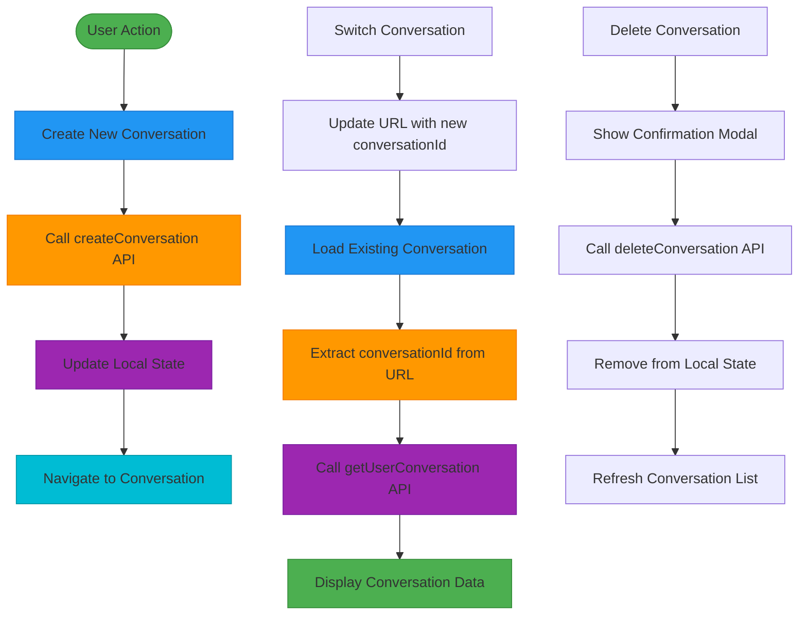
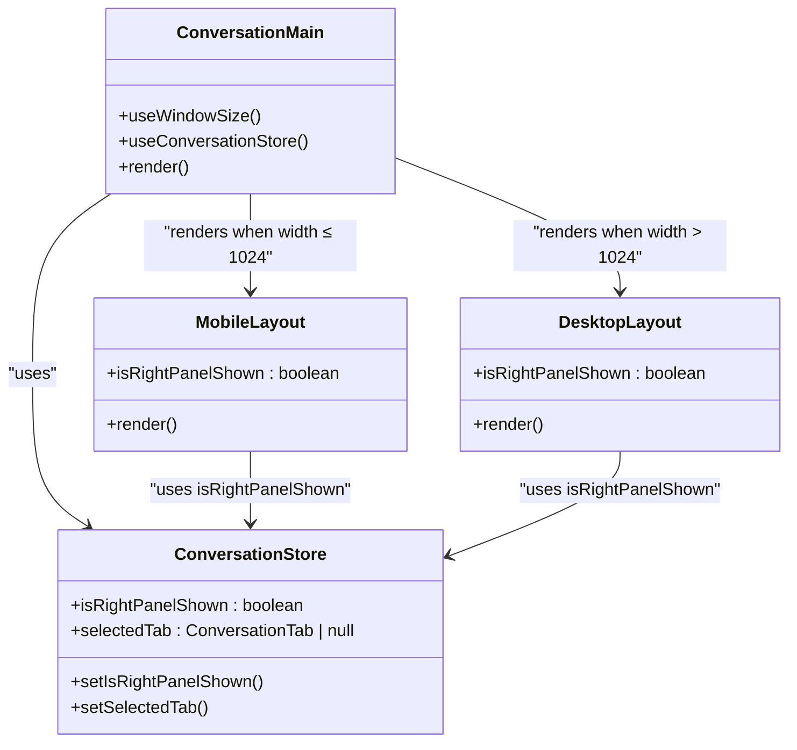
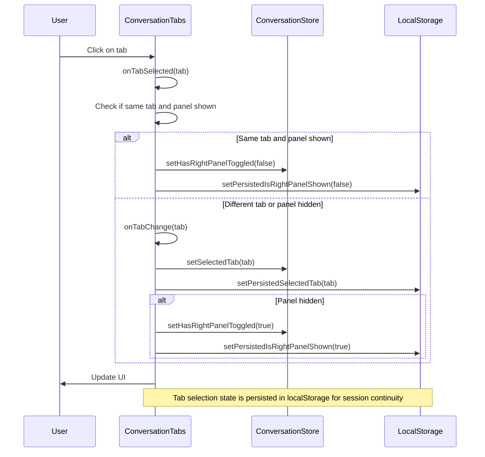
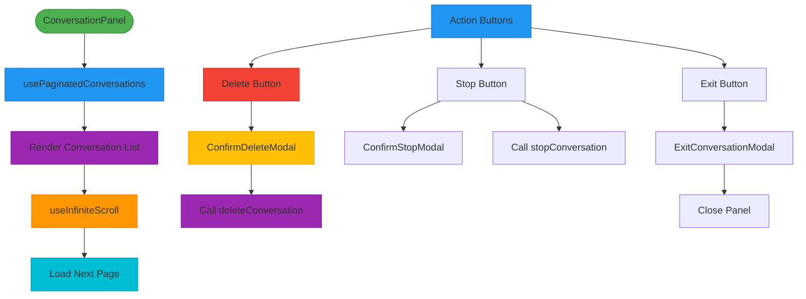
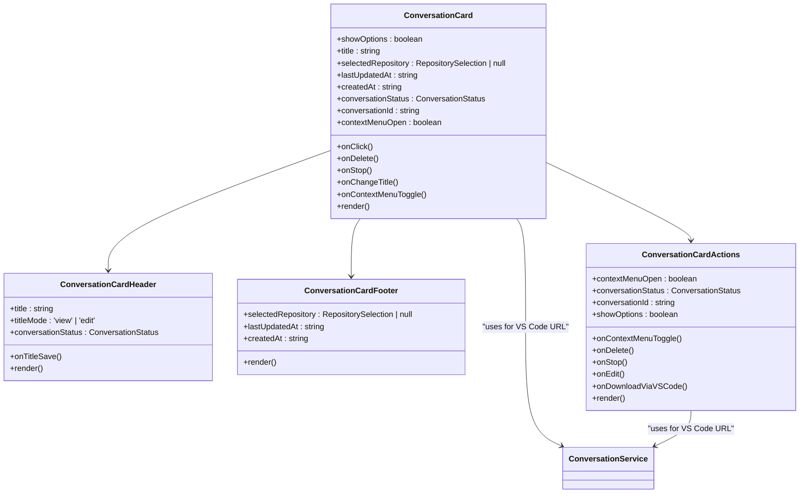
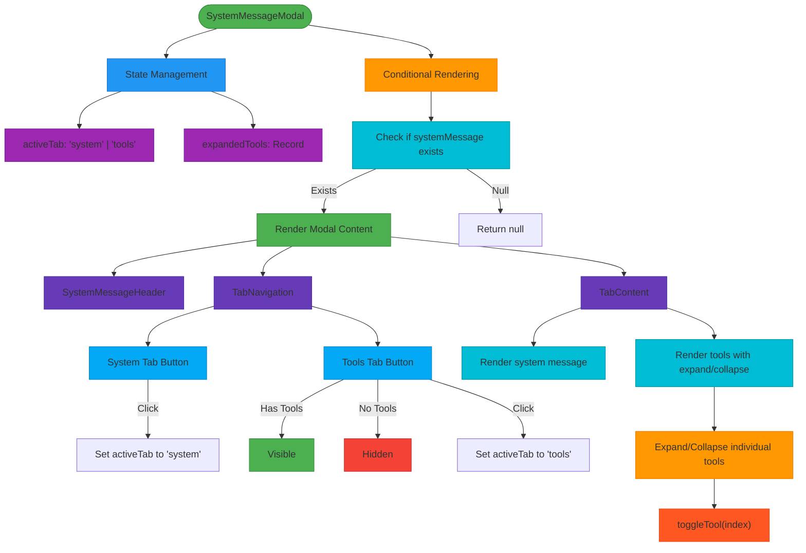
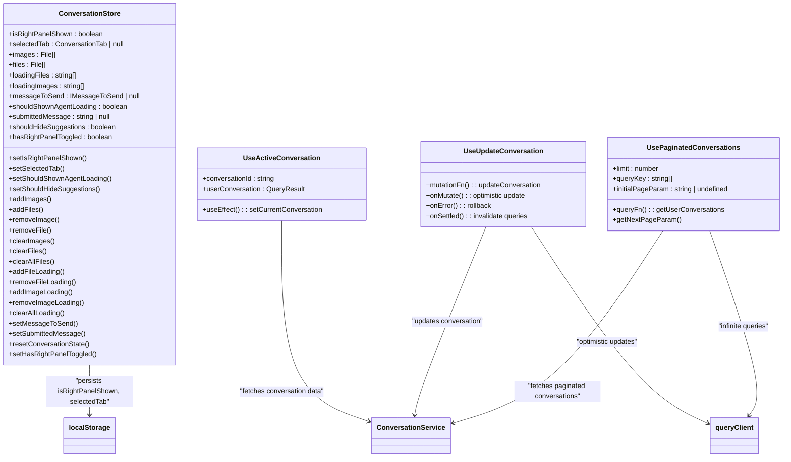

# Conversation Management Components

<cite>
**Referenced Files in This Document**   
- [conversation-main.tsx](file://frontend/src/components/features/conversation/conversation-main/conversation-main.tsx)
- [conversation-store.ts](file://frontend/src/state/conversation-store.ts)
- [conversation-tabs.tsx](file://frontend/src/components/features/conversation/conversation-tabs/conversation-tabs.tsx)
- [conversation-tab-content.tsx](file://frontend/src/components/features/conversation/conversation-tabs/conversation-tab-content/conversation-tab-content.tsx)
- [conversation-panel.tsx](file://frontend/src/components/features/conversation-panel/conversation-panel.tsx)
- [conversation-card.tsx](file://frontend/src/components/features/conversation-panel/conversation-card/conversation-card.tsx)
- [system-message-modal.tsx](file://frontend/src/components/features/conversation-panel/system-message-modal.tsx)
- [use-active-conversation.ts](file://frontend/src/hooks/query/use-active-conversation.ts)
- [use-update-conversation.ts](file://frontend/src/hooks/mutation/use-update-conversation.ts)
- [use-paginated-conversations.ts](file://frontend/src/hooks/query/use-paginated-conversations.ts)
- [budget-display.tsx](file://frontend/src/components/features/conversation-panel/budget-display.tsx)
- [microagents-modal.tsx](file://frontend/src/components/features/conversation-panel/microagents-modal.tsx)
- [desktop-layout.tsx](file://frontend/src/components/features/conversation/conversation-main/desktop-layout.tsx)
- [mobile-layout.tsx](file://frontend/src/components/features/conversation/conversation-main/mobile-layout.tsx)
</cite>

## Table of Contents
1. [Introduction](#introduction)
2. [Conversation Lifecycle Management](#conversation-lifecycle-management)
3. [Conversation Main Component](#conversation-main-component)
4. [Conversation Tabs System](#conversation-tabs-system)
5. [Conversation Panel](#conversation-panel)
6. [Conversation Card Component](#conversation-card-component)
7. [System Message Modal](#system-message-modal)
8. [State Management Patterns](#state-management-patterns)
9. [Architecture Overview](#architecture-overview)

## Introduction
The Conversation Management Components in OpenHands provide a comprehensive system for managing AI-assisted development conversations. This documentation details the implementation of conversation lifecycle management, including creation, loading, switching, and deletion. The system features a primary container for active conversations, a tab-based navigation system for managing multiple concurrent conversations, and specialized components for displaying conversation history with budget tracking, status indicators, and microagent integration.

## Conversation Lifecycle Management

The conversation lifecycle management system handles the creation, loading, switching, and deletion of conversations through a combination of frontend components and backend services. The system uses React Query for data fetching and mutation operations, ensuring consistent state management across the application.

Conversation creation is initiated through the `useCreateConversation` hook, which manages the mutation process and handles loading states. When a user creates a new conversation, the system communicates with the backend to initialize a new conversation session and then navigates to the newly created conversation.

Conversation loading is handled by the `useActiveConversation` hook, which fetches conversation data based on the current conversation ID in the URL. The hook implements polling behavior with different intervals depending on the conversation status, checking every 3 seconds when the conversation is starting and every 30 seconds otherwise to update the conversation title and status.

**Diagram sources**
- [use-active-conversation.ts](file://frontend/src/hooks/query/use-active-conversation.ts)
- [use-create-conversation.ts](file://frontend/src/hooks/mutation/use-create-conversation.ts)

**Section sources**
- [use-active-conversation.ts](file://frontend/src/hooks/query/use-active-conversation.ts)
- [use-create-conversation.ts](file://frontend/src/hooks/mutation/use-create-conversation.ts)

## Conversation Main Component

The `ConversationMain` component serves as the primary container for active conversations, providing the main layout structure that adapts to different screen sizes. It acts as a switch between desktop and mobile layouts based on the current viewport width.

The component uses the `useWindowSize` hook to detect the current screen width and determines whether to render the desktop or mobile layout. When the width is 1024 pixels or less, it renders the `MobileLayout` component; otherwise, it renders the `DesktopLayout` component. This responsive design ensures optimal user experience across different devices.

The component also integrates with the `useConversationStore` hook to access the state of the right panel (conversation panel), which determines whether the right panel is shown or hidden. This state is passed down to both layout components to maintain consistency in the UI.

**Diagram sources**
- [conversation-main.tsx](file://frontend/src/components/features/conversation/conversation-main/conversation-main.tsx)
- [conversation-store.ts](file://frontend/src/state/conversation-store.ts)

**Section sources**
- [conversation-main.tsx](file://frontend/src/components/features/conversation/conversation-main/conversation-main.tsx)

## Conversation Tabs System

The conversation tabs system provides a mechanism for managing multiple concurrent conversations within different contexts such as editor, browser, Jupyter, served applications, VS Code, and terminal. The system consists of several components that work together to provide tab navigation, title display, and context management.

The `ConversationTabs` component manages the state of the selected tab and handles tab switching. It uses localStorage to persist the selected tab and right panel visibility state across sessions. When a tab is selected, it updates the state and handles the visibility of the right panel. If the right panel is closed, selecting a tab will open it; if the same tab is clicked while the panel is open, it will close the panel.

The `ConversationTabContent` component renders the content for the currently active tab. It defines a list of available tabs with their corresponding components and active states. The component uses memoization to optimize performance by only recalculating the tab title when relevant state changes occur.

**Diagram sources**
- [conversation-tabs.tsx](file://frontend/src/components/features/conversation/conversation-tabs/conversation-tabs.tsx)
- [conversation-tab-content.tsx](file://frontend/src/components/features/conversation/conversation-tabs/conversation-tab-content/conversation-tab-content.tsx)

**Section sources**
- [conversation-tabs.tsx](file://frontend/src/components/features/conversation/conversation-tabs/conversation-tabs.tsx)
- [conversation-tab-content.tsx](file://frontend/src/components/features/conversation/conversation-tabs/conversation-tab-content/conversation-tab-content.tsx)

## Conversation Panel

The `ConversationPanel` component displays conversation history and provides access to various conversation management features. It serves as a sidebar that can be toggled open or closed, showing a list of conversations with their metadata and actions.

The panel uses the `usePaginatedConversations` hook to fetch conversations in a paginated manner, improving performance when dealing with large numbers of conversations. It implements infinite scrolling through the `useInfiniteScroll` hook, automatically loading more conversations as the user scrolls to the bottom of the list.

The panel includes several modals for different actions:
- `ConfirmDeleteModal` for confirming conversation deletion
- `ConfirmStopModal` for confirming conversation stopping
- `ExitConversationModal` for confirming exit from the current conversation

These modals are conditionally rendered based on the state of their respective visibility flags, ensuring they only appear when needed.

**Diagram sources**
- [conversation-panel.tsx](file://frontend/src/components/features/conversation-panel/conversation-panel.tsx)
- [use-paginated-conversations.ts](file://frontend/src/hooks/query/use-paginated-conversations.ts)

**Section sources**
- [conversation-panel.tsx](file://frontend/src/components/features/conversation-panel/conversation-panel.tsx)

## Conversation Card Component

The `ConversationCard` component is used for displaying conversations in lists, showing metadata such as title, repository, timestamps, and status. It provides actions for managing conversations, including deletion, stopping, editing, and downloading via VS Code.

The component accepts several props to customize its behavior:
- `onClick`: Handler for when the card is clicked
- `onDelete`: Handler for deleting the conversation
- `onStop`: Handler for stopping the conversation
- `onChangeTitle`: Handler for changing the conversation title
- `showOptions`: Flag to show additional options
- `title`: The conversation title
- `selectedRepository`: The repository associated with the conversation
- `lastUpdatedAt`: Timestamp of the last update
- `createdAt`: Timestamp of creation
- `conversationStatus`: Current status of the conversation
- `conversationId`: ID of the conversation

The card implements context menu functionality through the `ConversationCardActions` component, which provides a dropdown menu with various actions. When an action is selected, it prevents the event from propagating to avoid triggering the card's click handler.

**Diagram sources**
- [conversation-card.tsx](file://frontend/src/components/features/conversation-panel/conversation-card/conversation-card.tsx)

**Section sources**
- [conversation-card.tsx](file://frontend/src/components/features/conversation-panel/conversation-card/conversation-card.tsx)

## System Message Modal

The `SystemMessageModal` component handles agent configuration and tool selection, providing a detailed view of the system message that defines the agent's behavior and available tools. The modal displays information about the agent class and OpenHands version, and allows users to view the system message content and tools configuration.

The modal implements a tabbed interface with two tabs: "System" and "Tools". The "System" tab displays the system message content, while the "Tools" tab displays the available tools. The visibility of the "Tools" tab depends on whether the conversation has any tools configured.

The component manages its own internal state for the active tab and expanded tools, allowing users to expand and collapse individual tool definitions for better readability. When the modal is opened, it checks if a system message is available and only renders the modal content if data exists.

**Diagram sources**
- [system-message-modal.tsx](file://frontend/src/components/features/conversation-panel/system-message-modal.tsx)

**Section sources**
- [system-message-modal.tsx](file://frontend/src/components/features/conversation-panel/system-message-modal.tsx)

## State Management Patterns

The conversation management system employs several state management patterns to coordinate data across components. The primary pattern uses Zustand for global state management, complemented by React Query for server state and React's useState for local component state.

The `useConversationStore` is a Zustand store that manages global conversation state, including:
- `isRightPanelShown`: Whether the right panel is visible
- `selectedTab`: The currently selected conversation tab
- `images` and `files`: Files being uploaded
- `loadingFiles` and `loadingImages`: Files currently being processed
- `messageToSend`: The current message being composed
- `shouldShownAgentLoading`: Whether to show the agent loading indicator

The store persists certain state values in localStorage, such as the right panel visibility and selected tab, ensuring continuity across sessions. The initial state is retrieved from localStorage, with default values provided if no stored state exists.

For server state management, the system uses React Query with several custom hooks:
- `useActiveConversation`: Manages the current conversation data
- `useUpdateConversation`: Handles conversation updates with optimistic updates
- `usePaginatedConversations`: Manages paginated conversation lists

The `useUpdateConversation` hook implements an optimistic update pattern, immediately updating the local state when a mutation is triggered and rolling back if the mutation fails. This provides a responsive user experience while maintaining data consistency.

**Diagram sources**
- [conversation-store.ts](file://frontend/src/state/conversation-store.ts)
- [use-active-conversation.ts](file://frontend/src/hooks/query/use-active-conversation.ts)
- [use-update-conversation.ts](file://frontend/src/hooks/mutation/use-update-conversation.ts)
- [use-paginated-conversations.ts](file://frontend/src/hooks/query/use-paginated-conversations.ts)

**Section sources**
- [conversation-store.ts](file://frontend/src/state/conversation-store.ts)
- [use-active-conversation.ts](file://frontend/src/hooks/query/use-active-conversation.ts)
- [use-update-conversation.ts](file://frontend/src/hooks/mutation/use-update-conversation.ts)
- [use-paginated-conversations.ts](file://frontend/src/hooks/query/use-paginated-conversations.ts)

## Architecture Overview

The conversation management system follows a component-based architecture with clear separation of concerns. The system is organized into several feature directories, each containing related components and hooks.

The main entry point is the `ConversationMain` component, which serves as the container for active conversations. It dynamically selects between desktop and mobile layouts based on screen size, ensuring responsive design across devices.

The conversation panel provides a sidebar interface for managing multiple conversations, with the `ConversationCard` component displaying individual conversations in a list. Each card shows metadata and provides actions for managing the conversation.

The tabs system allows users to switch between different contexts within a conversation, such as editor, browser, Jupyter, and terminal. The system maintains state for the selected tab and panel visibility, persisting these values in localStorage for session continuity.

State management is handled through a combination of Zustand for global state, React Query for server state, and React's built-in state hooks for local component state. This layered approach ensures efficient state management while maintaining a responsive user interface.

```mermaid
graph TD
A[ConversationMain] --> B[MobileLayout]
A --> C[DesktopLayout]
A --> D[ConversationStore]
E[ConversationPanel] --> F[ConversationCard]
E --> G[usePaginatedConversations]
E --> H[useInfiniteScroll]
I[ConversationTabs] --> J[ConversationTabContent]
I --> K[ConversationTabNav]
I --> L[ConversationTabTitle]
M[SystemMessageModal] --> N[SystemMessageHeader]
M --> O[TabNavigation]
M --> P[TabContent]
D --> Q[localStorage]
G --> R[ConversationService]
F --> R
J --> S[EditorTab]
J --> T[BrowserTab]
J --> U[JupyterTab]
J --> V[ServedTab]
J --> W[VSCodeTab]
J --> X[Terminal]
style A fill:#4CAF50,stroke:#388E3C
style B fill:#2196F3,stroke:#1976D2
style C fill:#2196F3,stroke:#1976D2
style D fill:#9C27B0,stroke:#7B1FA2
style E fill:#FF9800,stroke:#F57C00
style F fill:#00BCD4,stroke:#0097A7
style G fill:#03A9F4,stroke:#0288D1
style H fill:#03A9F4,stroke:#0288D1
style I fill:#4CAF50,stroke:#388E3C
style J fill:#2196F3,stroke:#1976D2
style K fill:#2196F3,stroke:#1976D2
style L fill:#2196F3,stroke:#1976D2
style M fill:#9C27B0,stroke:#7B1FA2
style N fill:#673AB7,stroke:#512DA8
style O fill:#673AB7,stroke:#512DA8
style P fill:#673AB7,stroke:#512DA8
style Q fill:#FFC107,stroke:#FFA000
style R fill:#9C27B0,stroke:#7B1FA2
style S fill:#00BCD4,stroke:#0097A7
style T fill:#00BCD4,stroke:#0097A7
style U fill:#00BCD4,stroke:#0097A7
style V fill:#00BCD4,stroke:#0097A7
style W fill:#00BCD4,stroke:#0097A7
style X fill:#00BCD4,stroke:#0097A7
```

**Diagram sources**
- [conversation-main.tsx](file://frontend/src/components/features/conversation/conversation-main/conversation-main.tsx)
- [conversation-panel.tsx](file://frontend/src/components/features/conversation-panel/conversation-panel.tsx)
- [conversation-tabs.tsx](file://frontend/src/components/features/conversation/conversation-tabs/conversation-tabs.tsx)
- [system-message-modal.tsx](file://frontend/src/components/features/conversation-panel/system-message-modal.tsx)

**Section sources**
- [conversation-main.tsx](file://frontend/src/components/features/conversation/conversation-main/conversation-main.tsx)
- [conversation-panel.tsx](file://frontend/src/components/features/conversation-panel/conversation-panel.tsx)
- [conversation-tabs.tsx](file://frontend/src/components/features/conversation/conversation-tabs/conversation-tabs.tsx)
- [system-message-modal.tsx](file://frontend/src/components/features/conversation-panel/system-message-modal.tsx)