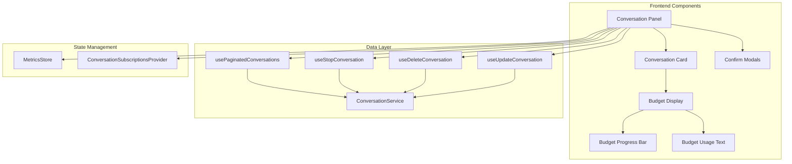
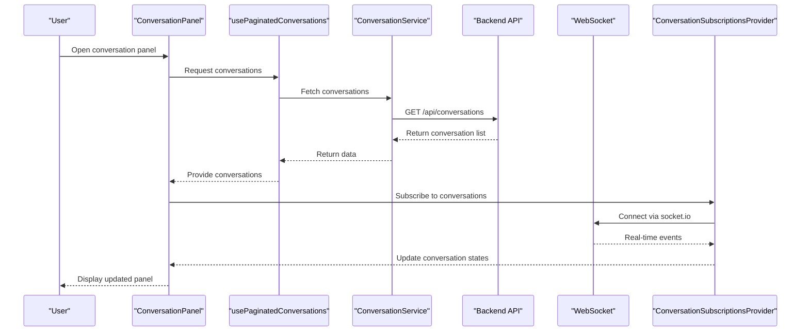
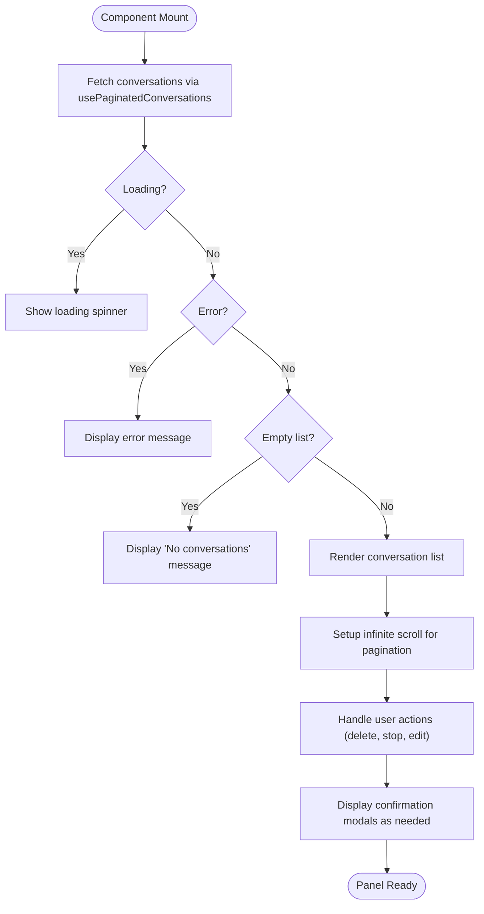
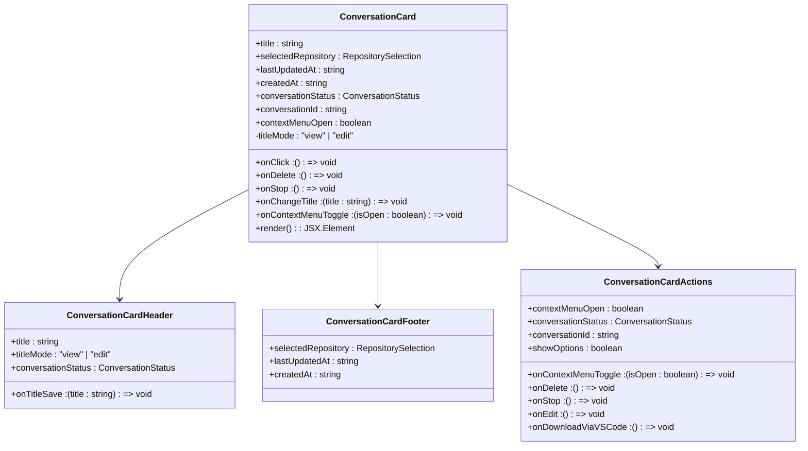
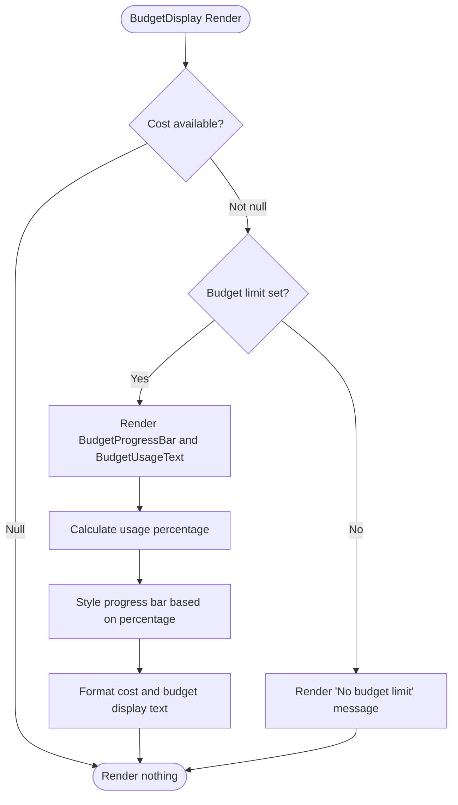
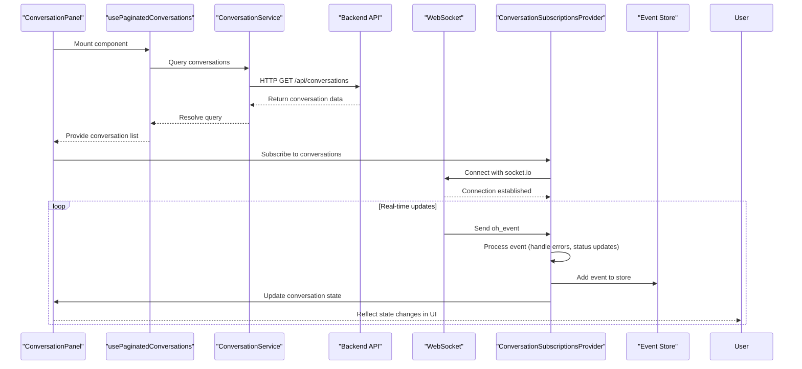
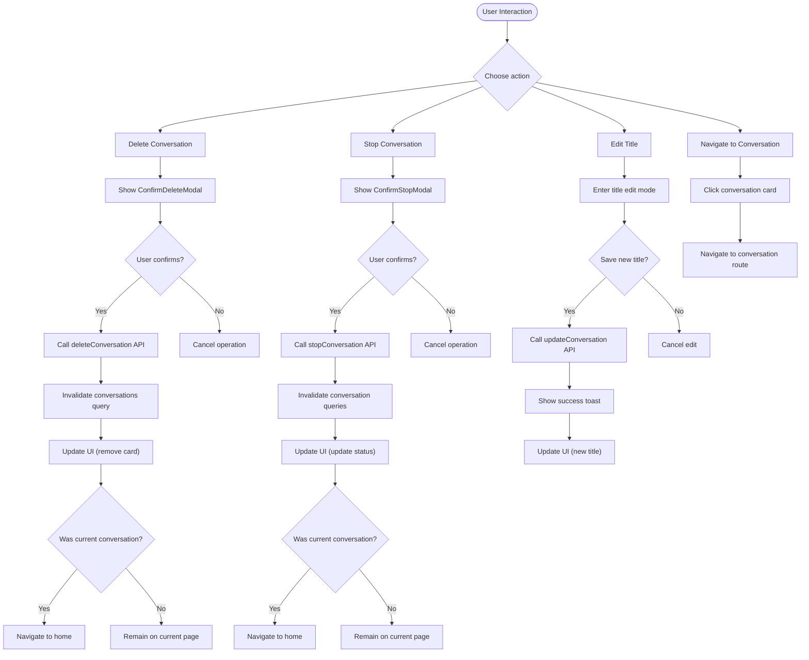
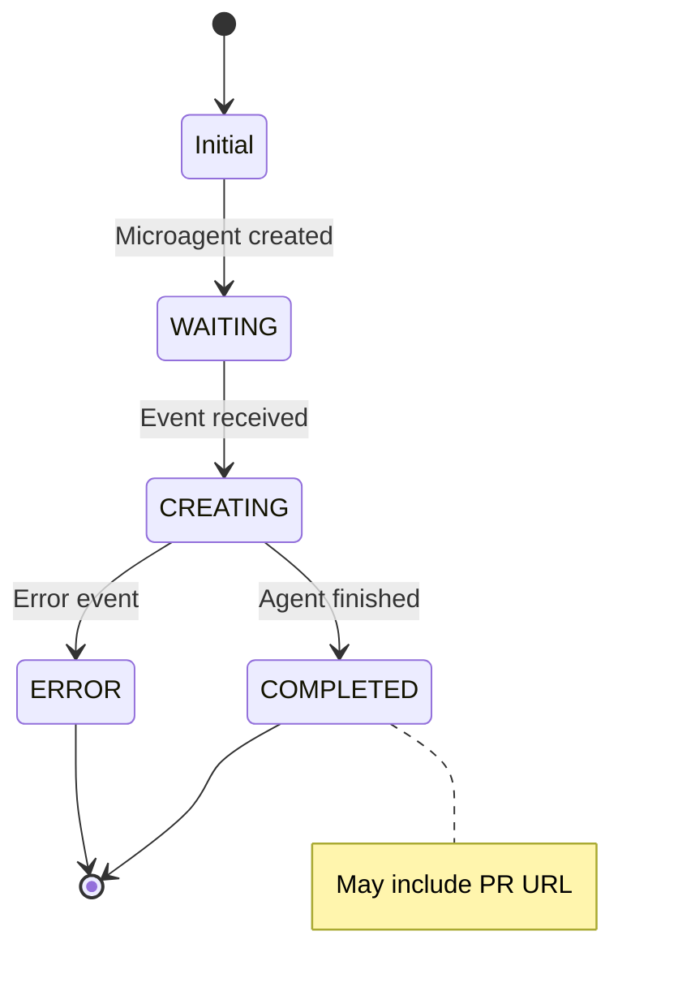
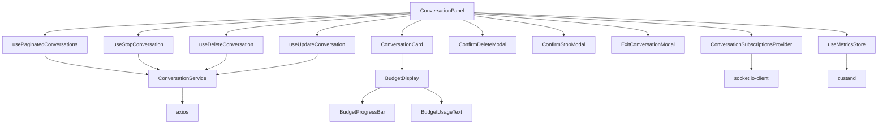

# Conversation Panel Management

<cite>
**Referenced Files in This Document**   
- [conversation-panel.tsx](file://frontend/src/components/features/conversation-panel/conversation-panel.tsx)
- [conversation-card.tsx](file://frontend/src/components/features/conversation-panel/conversation-card/conversation-card.tsx)
- [budget-display.tsx](file://frontend/src/components/features/conversation-panel/budget-display.tsx)
- [use-paginated-conversations.ts](file://frontend/src/hooks/query/use-paginated-conversations.ts)
- [conversation-service.api.ts](file://frontend/src/api/conversation-service/conversation-service.api.ts)
- [metrics-store.ts](file://frontend/src/stores/metrics-store.ts)
- [use-stop-conversation.ts](file://frontend/src/hooks/mutation/use-stop-conversation.ts)
- [use-delete-conversation.ts](file://frontend/src/hooks/mutation/use-delete-conversation.ts)
- [use-start-conversation.ts](file://frontend/src/hooks/mutation/use-start-conversation.ts)
- [conversation-status.ts](file://frontend/src/types/conversation-status.ts)
- [microagent-status.ts](file://frontend/src/types/microagent-status.ts)
- [conversation-subscriptions-provider.tsx](file://frontend/src/context/conversation-subscriptions-provider.tsx)
- [use-create-conversation-and-subscribe-multiple.ts](file://frontend/src/hooks/use-create-conversation-and-subscribe-multiple.ts)
</cite>

## Table of Contents
1. [Introduction](#introduction)
2. [Project Structure](#project-structure)
3. [Core Components](#core-components)
4. [Architecture Overview](#architecture-overview)
5. [Detailed Component Analysis](#detailed-component-analysis)
6. [Dependency Analysis](#dependency-analysis)
7. [Performance Considerations](#performance-considerations)
8. [Troubleshooting Guide](#troubleshooting-guide)
9. [Conclusion](#conclusion)

## Introduction
The Conversation Panel Management system provides a comprehensive interface for users to manage their AI-assisted conversations. This documentation details the implementation of the conversation-panel component that displays conversation history and metadata, including budget tracking components that show cost and token usage, status indicators for conversation state, and microagent integration points. The system handles data flow from the backend API to the panel display with real-time updates, and supports user interactions for starting, stopping, and deleting conversations through the panel interface.

## Project Structure
The conversation panel functionality is primarily implemented in the frontend/src/components/features/conversation-panel directory, with supporting components in related directories. The system follows a modular architecture with clear separation between UI components, data fetching hooks, and state management.

**Diagram sources**
- [conversation-panel.tsx](file://frontend/src/components/features/conversation-panel/conversation-panel.tsx)
- [conversation-card.tsx](file://frontend/src/components/features/conversation-panel/conversation-card/conversation-card.tsx)
- [budget-display.tsx](file://frontend/src/components/features/conversation-panel/budget-display.tsx)
- [use-paginated-conversations.ts](file://frontend/src/hooks/query/use-paginated-conversations.ts)
- [conversation-service.api.ts](file://frontend/src/api/conversation-service/conversation-service.api.ts)
- [metrics-store.ts](file://frontend/src/stores/metrics-store.ts)
- [conversation-subscriptions-provider.tsx](file://frontend/src/context/conversation-subscriptions-provider.tsx)

**Section sources**
- [conversation-panel.tsx](file://frontend/src/components/features/conversation-panel/conversation-panel.tsx)
- [conversation-card.tsx](file://frontend/src/components/features/conversation-panel/conversation-card/conversation-card.tsx)
- [budget-display.tsx](file://frontend/src/components/features/conversation-panel/budget-display.tsx)

## Core Components
The conversation panel system consists of several core components that work together to provide a comprehensive conversation management interface. The main ConversationPanel component displays a list of conversations with metadata, while the ConversationCard component renders individual conversation entries with status indicators and action controls. The budget tracking system includes BudgetDisplay, BudgetProgressBar, and BudgetUsageText components that visualize cost and token usage metrics. The system also includes confirmation modals for destructive actions like stopping and deleting conversations.

**Section sources**
- [conversation-panel.tsx](file://frontend/src/components/features/conversation-panel/conversation-panel.tsx)
- [conversation-card.tsx](file://frontend/src/components/features/conversation-panel/conversation-card/conversation-card.tsx)
- [budget-display.tsx](file://frontend/src/components/features/conversation-panel/budget-display.tsx)

## Architecture Overview
The conversation panel system follows a React-based component architecture with separation of concerns between presentation, data fetching, and state management. The system uses React Query for data fetching and caching, with custom hooks abstracting API interactions. Real-time updates are handled through WebSocket connections managed by the ConversationSubscriptionsProvider. The UI components are designed to be reusable and composable, with clear props interfaces and minimal internal state.

**Diagram sources**
- [conversation-panel.tsx](file://frontend/src/components/features/conversation-panel/conversation-panel.tsx)
- [use-paginated-conversations.ts](file://frontend/src/hooks/query/use-paginated-conversations.ts)
- [conversation-service.api.ts](file://frontend/src/api/conversation-service/conversation-service.api.ts)
- [conversation-subscriptions-provider.tsx](file://frontend/src/context/conversation-subscriptions-provider.tsx)

## Detailed Component Analysis

### Conversation Panel Analysis
The ConversationPanel component serves as the main interface for managing conversations. It displays a scrollable list of conversations with infinite loading, allowing users to navigate through their conversation history. The component handles user interactions for deleting and stopping conversations through confirmation modals, and supports title editing for conversations.

**Diagram sources**
- [conversation-panel.tsx](file://frontend/src/components/features/conversation-panel/conversation-panel.tsx)
- [use-paginated-conversations.ts](file://frontend/src/hooks/query/use-paginated-conversations.ts)

**Section sources**
- [conversation-panel.tsx](file://frontend/src/components/features/conversation-panel/conversation-panel.tsx)
- [use-paginated-conversations.ts](file://frontend/src/hooks/query/use-paginated-conversations.ts)

### Conversation Card Analysis
The ConversationCard component renders individual conversation entries in the panel. Each card displays conversation metadata including title, repository information, and timestamps. The component includes status indicators that reflect the current state of the conversation (STARTING, RUNNING, STOPPED, ARCHIVED, ERROR). Users can access context menus to perform actions like deleting, stopping, or editing the conversation title.

**Diagram sources**
- [conversation-card.tsx](file://frontend/src/components/features/conversation-panel/conversation-card/conversation-card.tsx)

**Section sources**
- [conversation-card.tsx](file://frontend/src/components/features/conversation-panel/conversation-card/conversation-card.tsx)

### Budget Tracking Analysis
The budget tracking system provides visual feedback on cost and token usage for conversations. The BudgetDisplay component conditionally renders either a progress bar with usage text when a budget limit is set, or a message indicating no budget limit. The BudgetProgressBar shows a visual representation of current cost against the maximum budget, while the BudgetUsageText displays the exact figures and percentage used.

**Diagram sources**
- [budget-display.tsx](file://frontend/src/components/features/conversation-panel/budget-display.tsx)
- [budget-progress-bar.tsx](file://frontend/src/components/features/conversation-panel/budget-progress-bar.tsx)
- [budget-usage-text.tsx](file://frontend/src/components/features/conversation-panel/budget-usage-text.tsx)

**Section sources**
- [budget-display.tsx](file://frontend/src/components/features/conversation-panel/budget-display.tsx)

### Data Flow and Real-time Updates
The system implements a robust data flow from the backend API to the panel display, with real-time updates handled through WebSocket connections. When the conversation panel is opened, it fetches the list of conversations via the usePaginatedConversations hook, which uses React Query to handle caching and pagination. For real-time updates, the ConversationSubscriptionsProvider establishes WebSocket connections to receive events about conversation state changes.

**Diagram sources**
- [conversation-panel.tsx](file://frontend/src/components/features/conversation-panel/conversation-panel.tsx)
- [use-paginated-conversations.ts](file://frontend/src/hooks/query/use-paginated-conversations.ts)
- [conversation-service.api.ts](file://frontend/src/api/conversation-service/conversation-service.api.ts)
- [conversation-subscriptions-provider.tsx](file://frontend/src/context/conversation-subscriptions-provider.tsx)
- [use-create-conversation-and-subscribe-multiple.ts](file://frontend/src/hooks/use-create-conversation-and-subscribe-multiple.ts)

**Section sources**
- [conversation-panel.tsx](file://frontend/src/components/features/conversation-panel/conversation-panel.tsx)
- [use-paginated-conversations.ts](file://frontend/src/hooks/query/use-paginated-conversations.ts)
- [conversation-service.api.ts](file://frontend/src/api/conversation-service/conversation-service.api.ts)
- [conversation-subscriptions-provider.tsx](file://frontend/src/context/conversation-subscriptions-provider.tsx)

### User Interaction Patterns
The conversation panel implements several user interaction patterns for managing conversations. Users can start new conversations through separate mechanisms, while the panel focuses on managing existing conversations. The system provides confirmation modals for destructive actions like stopping and deleting conversations to prevent accidental data loss. When a user stops a conversation, the system invalidates relevant queries to ensure the UI reflects the updated state.

**Diagram sources**
- [conversation-panel.tsx](file://frontend/src/components/features/conversation-panel/conversation-panel.tsx)
- [use-stop-conversation.ts](file://frontend/src/hooks/mutation/use-stop-conversation.ts)
- [use-delete-conversation.ts](file://frontend/src/hooks/mutation/use-delete-conversation.ts)
- [use-update-conversation.ts](file://frontend/src/hooks/mutation/use-update-conversation.ts)

**Section sources**
- [conversation-panel.tsx](file://frontend/src/components/features/conversation-panel/conversation-panel.tsx)
- [use-stop-conversation.ts](file://frontend/src/hooks/mutation/use-stop-conversation.ts)
- [use-delete-conversation.ts](file://frontend/src/hooks/mutation/use-delete-conversation.ts)

### Microagent Integration
The system includes integration points for microagents, which are specialized AI agents that can perform specific tasks. The microagent status is tracked through the MicroagentStatus enum, which includes states like WAITING, CREATING, COMPLETED, and ERROR. The system handles microagent events through the conversation WebSocket, updating the UI based on the microagent's state and any associated PR URLs.

**Diagram sources**
- [microagent-status.ts](file://frontend/src/types/microagent-status.ts)
- [messages.tsx](file://frontend/src/components/features/chat/messages.tsx)

**Section sources**
- [microagent-status.ts](file://frontend/src/types/microagent-status.ts)

## Dependency Analysis
The conversation panel system has a well-defined dependency structure with clear separation between components. The main ConversationPanel component depends on several custom hooks for data fetching and mutation operations, as well as UI components for rendering. The system uses React Query for data fetching and caching, with the ConversationService class abstracting API interactions. State management is handled through Zustand stores for metrics and context providers for WebSocket subscriptions.

**Diagram sources**
- [conversation-panel.tsx](file://frontend/src/components/features/conversation-panel/conversation-panel.tsx)
- [conversation-service.api.ts](file://frontend/src/api/conversation-service/conversation-service.api.ts)
- [metrics-store.ts](file://frontend/src/stores/metrics-store.ts)
- [conversation-subscriptions-provider.tsx](file://frontend/src/context/conversation-subscriptions-provider.tsx)

**Section sources**
- [conversation-panel.tsx](file://frontend/src/components/features/conversation-panel/conversation-panel.tsx)
- [conversation-service.api.ts](file://frontend/src/api/conversation-service/conversation-service.api.ts)

## Performance Considerations
The conversation panel system implements several performance optimizations to ensure a smooth user experience. The use of React Query provides automatic caching and background refetching, reducing unnecessary API calls. The infinite scrolling implementation with useInfiniteScroll ensures that only visible conversations are rendered, improving performance with large conversation lists. The system also implements optimistic updates for mutation operations, providing immediate feedback to users while the backend operation completes.

## Troubleshooting Guide
When troubleshooting issues with the conversation panel, consider the following common scenarios:

1. **Conversations not loading**: Check network connectivity and API endpoint availability. Verify that the user is authenticated and has permission to access conversations.

2. **Real-time updates not working**: Ensure WebSocket connections are established properly. Check browser console for connection errors and verify that the socket.io server is running.

3. **Budget metrics not displaying**: Verify that cost and token usage data is being sent from the backend. Check that the metrics store is properly updated with incoming data.

4. **Confirmation modals not appearing**: Ensure that state variables for modal visibility are properly updated. Check for any errors in the event handlers.

5. **Conversation actions failing**: Examine network requests to identify API errors. Verify that proper error handling is implemented in the mutation hooks.

**Section sources**
- [conversation-panel.tsx](file://frontend/src/components/features/conversation-panel/conversation-panel.tsx)
- [use-stop-conversation.ts](file://frontend/src/hooks/mutation/use-stop-conversation.ts)
- [use-delete-conversation.ts](file://frontend/src/hooks/mutation/use-delete-conversation.ts)
- [conversation-subscriptions-provider.tsx](file://frontend/src/context/conversation-subscriptions-provider.tsx)

## Conclusion
The Conversation Panel Management system provides a comprehensive interface for managing AI-assisted conversations with robust features for displaying conversation history, tracking budget and token usage, and handling user interactions. The system's modular architecture with clear separation of concerns makes it maintainable and extensible. The implementation of real-time updates through WebSocket connections ensures that users always have an accurate view of their conversation states. The user interaction patterns with confirmation modals provide a safe and intuitive experience for managing conversations.