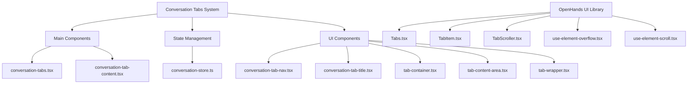
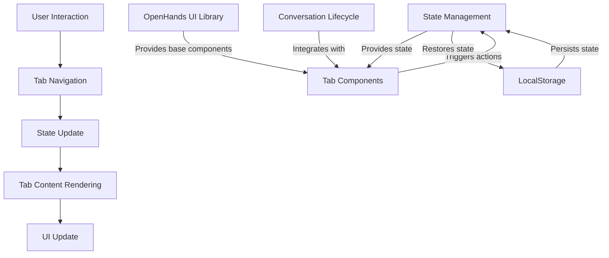
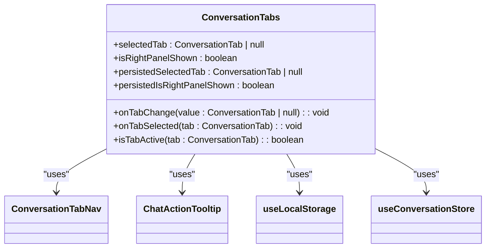
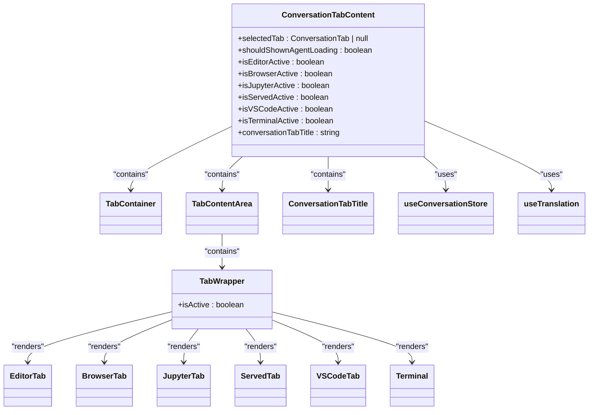
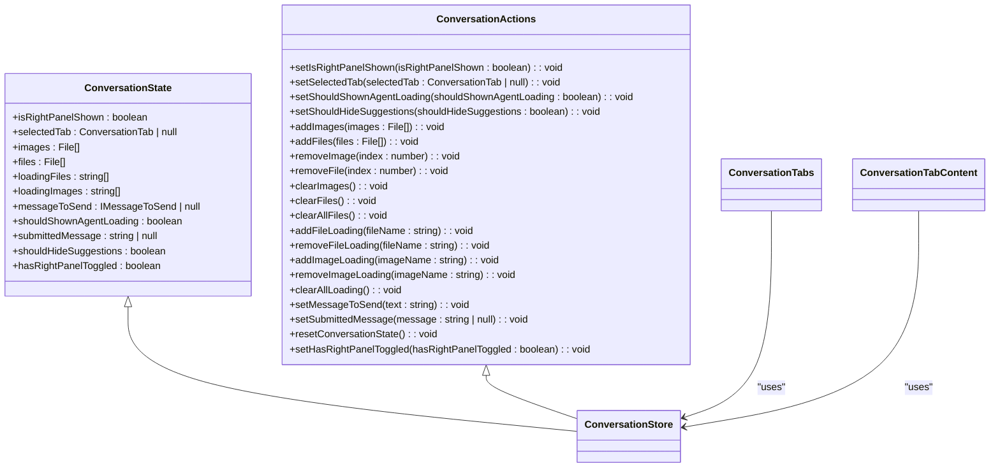
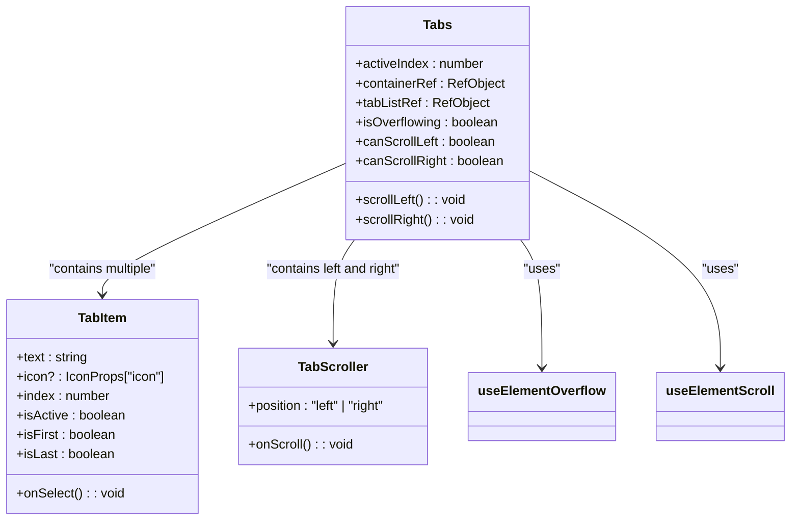

# Conversation Tabs System

<cite>
**Referenced Files in This Document**   
- [conversation-tabs.tsx](file://frontend/src/components/features/conversation/conversation-tabs/conversation-tabs.tsx)
- [conversation-tab-content.tsx](file://frontend/src/components/features/conversation/conversation-tabs/conversation-tab-content/conversation-tab-content.tsx)
- [conversation-tab-nav.tsx](file://frontend/src/components/features/conversation/conversation-tabs/conversation-tab-nav.tsx)
- [conversation-tab-title.tsx](file://frontend/src/components/features/conversation/conversation-tabs/conversation-tab-title.tsx)
- [tab-container.tsx](file://frontend/src/components/features/conversation/conversation-tabs/conversation-tab-content/tab-container.tsx)
- [tab-content-area.tsx](file://frontend/src/components/features/conversation/conversation-tabs/conversation-tab-content/tab-content-area.tsx)
- [tab-wrapper.tsx](file://frontend/src/components/features/conversation/conversation-tabs/conversation-tab-content/tab-wrapper.tsx)
- [conversation-store.ts](file://frontend/src/state/conversation-store.ts)
- [Tabs.tsx](file://openhands-ui/components/tabs/Tabs.tsx)
- [TabItem.tsx](file://openhands-ui/components/tabs/components/TabItem.tsx)
- [TabScroller.tsx](file://openhands-ui/components/tabs/components/TabScroller.tsx)
- [use-element-overflow.tsx](file://openhands-ui/components/tabs/hooks/use-element-overflow.tsx)
- [use-element-scroll.tsx](file://openhands-ui/components/tabs/hooks/use-element-scroll.tsx)
</cite>

## Table of Contents
1. [Introduction](#introduction)
2. [Project Structure](#project-structure)
3. [Core Components](#core-components)
4. [Architecture Overview](#architecture-overview)
5. [Detailed Component Analysis](#detailed-component-analysis)
6. [Dependency Analysis](#dependency-analysis)
7. [Performance Considerations](#performance-considerations)
8. [Troubleshooting Guide](#troubleshooting-guide)
9. [Conclusion](#conclusion)

## Introduction
The Conversation Tabs System in OpenHands provides a tab-based interface that allows users to manage multiple concurrent conversations and view different aspects of a conversation through dedicated tabs. This system enables users to switch between various views such as code editing, terminal access, browser interaction, Jupyter notebooks, and served applications within a single conversation context. The implementation focuses on providing a seamless user experience with proper state management, responsive design, and accessibility features.

## Project Structure
The Conversation Tabs System is implemented primarily in the frontend component of the OpenHands application, with key files organized in a feature-based structure. The main components are located in the `frontend/src/components/features/conversation/conversation-tabs/` directory, which contains the core tab functionality and subcomponents.



**Diagram sources**
- [conversation-tabs.tsx](file://frontend/src/components/features/conversation/conversation-tabs/conversation-tabs.tsx)
- [Tabs.tsx](file://openhands-ui/components/tabs/Tabs.tsx)

**Section sources**
- [conversation-tabs.tsx](file://frontend/src/components/features/conversation/conversation-tabs/conversation-tabs.tsx)
- [Tabs.tsx](file://openhands-ui/components/tabs/Tabs.tsx)

## Core Components
The Conversation Tabs System consists of several core components that work together to provide a comprehensive tab management interface. The system is built on a combination of custom components and reusable UI components from the OpenHands UI library. The main components include the tab navigation system, tab content rendering, and state management for tracking active tabs and preserving tab state.

The implementation uses React with TypeScript, leveraging hooks for state management and side effects. The system integrates with the conversation lifecycle management to handle tab creation, closing, and reordering operations. The tab interface is designed to be responsive, adapting to different screen sizes and handling edge cases such as tab overflow.

**Section sources**
- [conversation-tabs.tsx](file://frontend/src/components/features/conversation/conversation-tabs/conversation-tabs.tsx)
- [conversation-tab-content.tsx](file://frontend/src/components/features/conversation/conversation-tabs/conversation-tab-content/conversation-tab-content.tsx)
- [conversation-store.ts](file://frontend/src/state/conversation-store.ts)

## Architecture Overview
The Conversation Tabs System follows a component-based architecture with clear separation of concerns. The system is organized into presentation components, state management, and utility hooks. The architecture is designed to be modular, allowing for easy extension and maintenance.



**Diagram sources**
- [conversation-tabs.tsx](file://frontend/src/components/features/conversation/conversation-tabs/conversation-tabs.tsx)
- [conversation-store.ts](file://frontend/src/state/conversation-store.ts)

## Detailed Component Analysis

### Conversation Tabs Component
The main `ConversationTabs` component serves as the container for all tab navigation elements. It manages the tab state and handles user interactions with the tab interface.



**Diagram sources**
- [conversation-tabs.tsx](file://frontend/src/components/features/conversation/conversation-tabs/conversation-tabs.tsx)

**Section sources**
- [conversation-tabs.tsx](file://frontend/src/components/features/conversation/conversation-tabs/conversation-tabs.tsx)

### Tab Content System
The tab content system is responsible for rendering the content of the active tab and managing the visibility of different tab views. It uses a wrapper pattern to conditionally render tab content based on the active state.



**Diagram sources**
- [conversation-tab-content.tsx](file://frontend/src/components/features/conversation/conversation-tabs/conversation-tab-content/conversation-tab-content.tsx)
- [tab-wrapper.tsx](file://frontend/src/components/features/conversation/conversation-tabs/conversation-tab-content/tab-wrapper.tsx)
- [tab-container.tsx](file://frontend/src/components/features/conversation/conversation-tabs/conversation-tab-content/tab-container.tsx)
- [tab-content-area.tsx](file://frontend/src/components/features/conversation/conversation-tabs/conversation-tab-content/tab-content-area.tsx)

**Section sources**
- [conversation-tab-content.tsx](file://frontend/src/components/features/conversation/conversation-tabs/conversation-tab-content/conversation-tab-content.tsx)
- [tab-wrapper.tsx](file://frontend/src/components/features/conversation/conversation-tabs/conversation-tab-content/tab-wrapper.tsx)

### Tab Navigation and Title Components
The tab navigation and title components provide the visual elements for interacting with tabs. These components handle user input and display the current tab state.

```mermaid
classDiagram
class ConversationTabNav {
+icon : ComponentType<{ className : string }>
+onClick() : void
+isActive? : boolean
}
class ConversationTabTitle {
+title : string
}
ConversationTabs --> ConversationTabNav : "uses multiple"
ConversationTabContent --> ConversationTabTitle : "uses"
```

**Diagram sources**
- [conversation-tab-nav.tsx](file://frontend/src/components/features/conversation/conversation-tabs/conversation-tab-nav.tsx)
- [conversation-tab-title.tsx](file://frontend/src/components/features/conversation/conversation-tabs/conversation-tab-title.tsx)

**Section sources**
- [conversation-tab-nav.tsx](file://frontend/src/components/features/conversation/conversation-tabs/conversation-tab-nav.tsx)
- [conversation-tab-title.tsx](file://frontend/src/components/features/conversation/conversation-tabs/conversation-tab-title.tsx)

### State Management
The state management system for the Conversation Tabs is implemented using Zustand, a lightweight state management solution for React. The system persists state to localStorage to maintain user preferences across sessions.



**Diagram sources**
- [conversation-store.ts](file://frontend/src/state/conversation-store.ts)

**Section sources**
- [conversation-store.ts](file://frontend/src/state/conversation-store.ts)

### OpenHands UI Tabs Components
The system leverages the OpenHands UI library components for additional tab functionality, particularly for handling overflow and scrolling in constrained spaces.



**Diagram sources**
- [Tabs.tsx](file://openhands-ui/components/tabs/Tabs.tsx)
- [TabItem.tsx](file://openhands-ui/components/tabs/components/TabItem.tsx)
- [TabScroller.tsx](file://openhands-ui/components/tabs/components/TabScroller.tsx)
- [use-element-overflow.tsx](file://openhands-ui/components/tabs/hooks/use-element-overflow.tsx)
- [use-element-scroll.tsx](file://openhands-ui/components/tabs/hooks/use-element-scroll.tsx)

**Section sources**
- [Tabs.tsx](file://openhands-ui/components/tabs/Tabs.tsx)
- [TabItem.tsx](file://openhands-ui/components/tabs/components/TabItem.tsx)

## Dependency Analysis
The Conversation Tabs System has dependencies on several key modules and libraries within the OpenHands application. These dependencies enable the system to function effectively and integrate with the broader application architecture.

```mermaid
graph TD
A[Conversation Tabs System] --> B[Zustand]
A --> C[React]
A --> D[React Router]
A --> E[Tailwind CSS]
A --> F[OpenHands UI Library]
A --> G[React I18next]
A --> H[@uidotdev/usehooks]
B --> |State Management| A
C --> |Component Framework| A
D --> |Routing| A
E --> |Styling| A
F --> |UI Components| A
G --> |Internationalization| A
H --> |Custom Hooks| A
```

**Diagram sources**
- [conversation-tabs.tsx](file://frontend/src/components/features/conversation/conversation-tabs/conversation-tabs.tsx)
- [conversation-store.ts](file://frontend/src/state/conversation-store.ts)

**Section sources**
- [conversation-tabs.tsx](file://frontend/src/components/features/conversation/conversation-tabs/conversation-tabs.tsx)
- [conversation-store.ts](file://frontend/src/state/conversation-store.ts)

## Performance Considerations
The Conversation Tabs System implements several performance optimizations to ensure a smooth user experience:

1. **Lazy Loading**: Tab components are lazy-loaded using React's `lazy` function to reduce initial bundle size and improve load times.
2. **Memoization**: The `useMemo` hook is used to memoize computed values like tab titles, preventing unnecessary recalculations during re-renders.
3. **Conditional Rendering**: Only the active tab content is rendered, with inactive tabs hidden using CSS classes to minimize DOM operations.
4. **State Optimization**: The Zustand store is configured with the devtools middleware for debugging, but this can be optimized for production builds.
5. **Event Handling**: Event handlers are properly cleaned up using React's useEffect cleanup mechanism to prevent memory leaks.

The system also handles agent loading states efficiently by displaying a loading spinner when necessary, providing visual feedback to users during potentially long operations.

## Troubleshooting Guide
When encountering issues with the Conversation Tabs System, consider the following common problems and solutions:

**Section sources**
- [conversation-tabs.tsx](file://frontend/src/components/features/conversation/conversation-tabs/conversation-tabs.tsx)
- [conversation-tab-content.tsx](file://frontend/src/components/features/conversation/conversation-tabs/conversation-tab-content/conversation-tab-content.tsx)
- [conversation-store.ts](file://frontend/src/state/conversation-store.ts)

## Conclusion
The Conversation Tabs System in OpenHands provides a robust and flexible interface for managing multiple conversation views within a single application context. The system's architecture combines custom components with reusable UI elements to create a cohesive user experience. Key features include state persistence, responsive design, and integration with the conversation lifecycle management system.

The implementation demonstrates best practices in React development, including proper state management, component composition, and performance optimization. The system is designed to be extensible, allowing for the addition of new tab types and functionality as needed. By leveraging the OpenHands UI library components, the system also ensures consistency with the overall application design language.