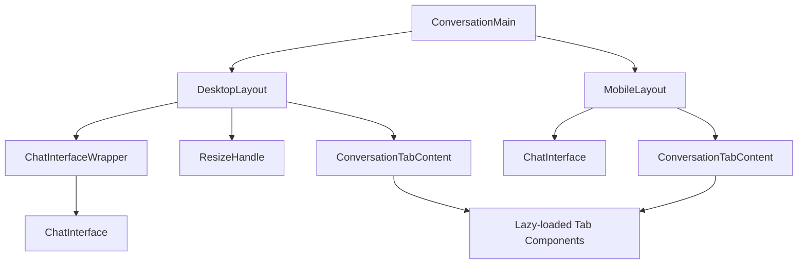
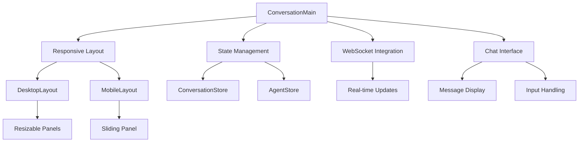
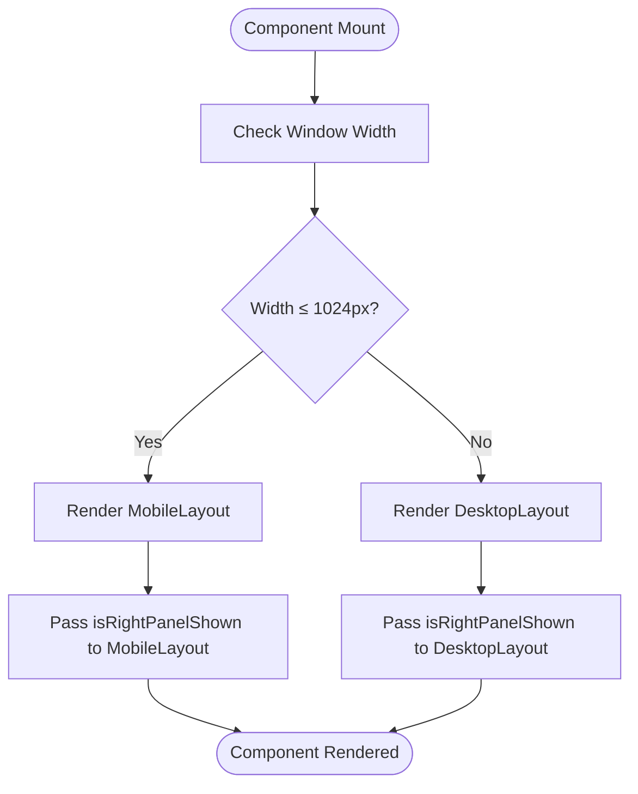
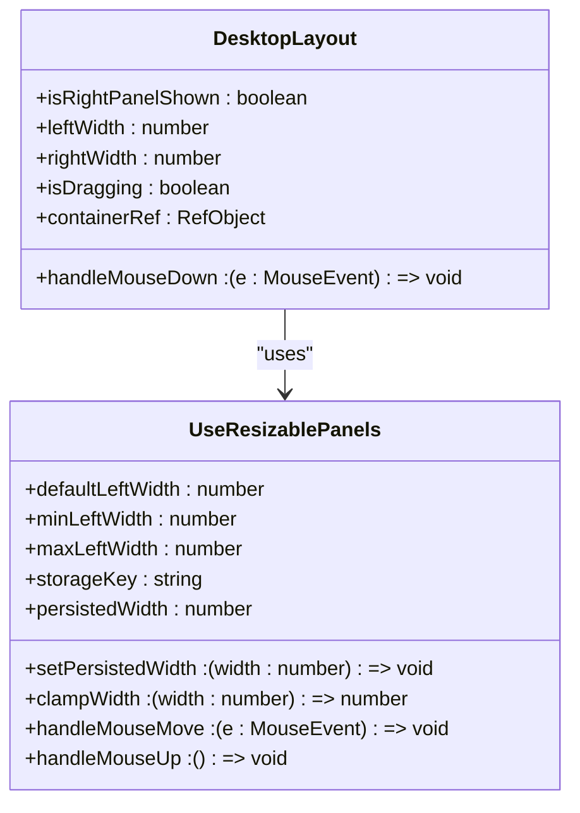
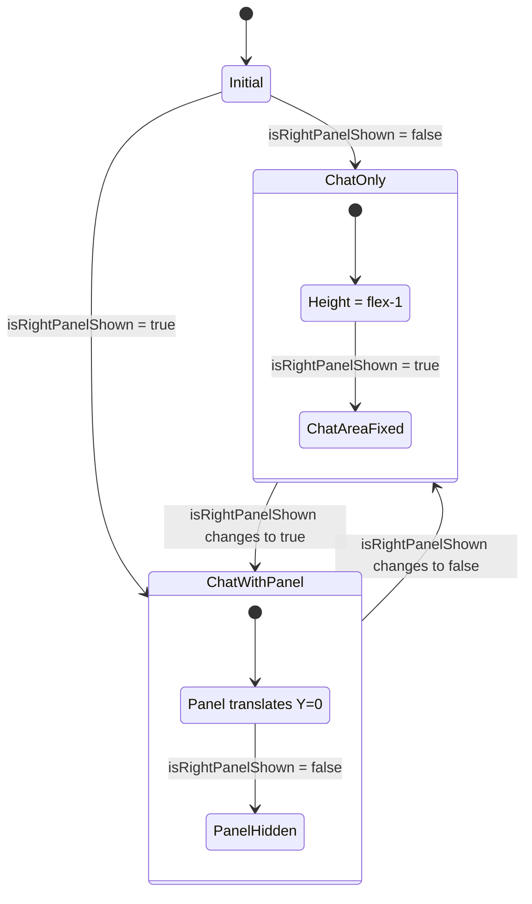
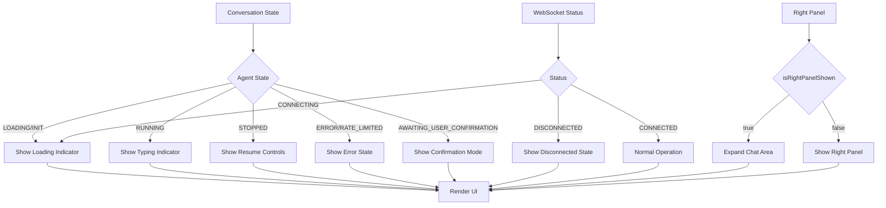

# Main Conversation View

<cite>
**Referenced Files in This Document**   
- [conversation-main.tsx](file://frontend/src/components/features/conversation/conversation-main/conversation-main.tsx)
- [desktop-layout.tsx](file://frontend/src/components/features/conversation/conversation-main/desktop-layout.tsx)
- [mobile-layout.tsx](file://frontend/src/components/features/conversation/conversation-main/mobile-layout.tsx)
- [chat-interface-wrapper.tsx](file://frontend/src/components/features/conversation/conversation-main/chat-interface-wrapper.tsx)
- [conversation-store.ts](file://frontend/src/state/conversation-store.ts)
- [chat-interface.tsx](file://frontend/src/components/features/chat/chat-interface.tsx)
- [use-resizable-panels.ts](file://frontend/src/hooks/use-resizable-panels.ts)
- [agent-store.ts](file://frontend/src/stores/agent-store.ts)
- [conversation-tab-content.tsx](file://frontend/src/components/features/conversation/conversation-tabs/conversation-tab-content/conversation-tab-content.tsx)
- [conversation.tsx](file://frontend/src/routes/conversation.tsx)
</cite>

## Table of Contents
1. [Introduction](#introduction)
2. [Project Structure](#project-structure)
3. [Core Components](#core-components)
4. [Architecture Overview](#architecture-overview)
5. [Detailed Component Analysis](#detailed-component-analysis)
6. [Dependency Analysis](#dependency-analysis)
7. [Performance Considerations](#performance-considerations)
8. [Troubleshooting Guide](#troubleshooting-guide)
9. [Conclusion](#conclusion)

## Introduction
The Main Conversation View component serves as the primary container for active agent conversations in the OpenHands application. It provides a responsive layout system that adapts to both desktop and mobile interfaces, ensuring optimal user experience across different devices. This documentation details the implementation of the conversation-main component, its integration with chat interface wrappers and layout components, state management patterns, rendering logic for different conversation states, and responsive behavior for window resizing and viewport changes.

## Project Structure
The Main Conversation View component is located in the frontend/src/components/features/conversation/conversation-main directory. It consists of several key files that work together to provide the conversation interface:

- conversation-main.tsx: The main component that determines which layout to render based on screen size
- desktop-layout.tsx: The layout component for desktop interfaces with resizable panels
- mobile-layout.tsx: The layout component for mobile interfaces with a sliding panel
- chat-interface-wrapper.tsx: A wrapper component for the chat interface that adjusts width based on panel state

The component integrates with various state management stores and hooks to manage conversation data, agent status, and user interactions.



**Diagram sources**
- [conversation-main.tsx](file://frontend/src/components/features/conversation/conversation-main/conversation-main.tsx)
- [desktop-layout.tsx](file://frontend/src/components/features/conversation/conversation-main/desktop-layout.tsx)
- [mobile-layout.tsx](file://frontend/src/components/features/conversation/conversation-main/mobile-layout.tsx)

**Section sources**
- [conversation-main.tsx](file://frontend/src/components/features/conversation/conversation-main/conversation-main.tsx)
- [desktop-layout.tsx](file://frontend/src/components/features/conversation/conversation-main/desktop-layout.tsx)
- [mobile-layout.tsx](file://frontend/src/components/features/conversation/conversation-main/mobile-layout.tsx)

## Core Components
The Main Conversation View component is composed of several core components that work together to provide a seamless conversation experience. The primary component, ConversationMain, acts as a container that determines which layout to render based on the screen size. It uses the useWindowSize hook to detect the current viewport width and renders either the DesktopLayout or MobileLayout component accordingly.

The DesktopLayout component provides a split-pane interface with a resizable divider between the chat area and the right panel. It uses the useResizablePanels hook to manage the panel widths and persist user preferences in localStorage. The MobileLayout component provides a compact interface suitable for smaller screens, with the right panel sliding up from the bottom when activated.

Both layouts integrate with the ChatInterface component through the ChatInterfaceWrapper, which adjusts the maximum width of the chat area based on whether the right panel is visible.

**Section sources**
- [conversation-main.tsx](file://frontend/src/components/features/conversation/conversation-main/conversation-main.tsx)
- [desktop-layout.tsx](file://frontend/src/components/features/conversation/conversation-main/desktop-layout.tsx)
- [mobile-layout.tsx](file://frontend/src/components/features/conversation/conversation-main/mobile-layout.tsx)
- [chat-interface-wrapper.tsx](file://frontend/src/components/features/conversation/conversation-main/chat-interface-wrapper.tsx)

## Architecture Overview
The Main Conversation View follows a component-based architecture with clear separation of concerns. The top-level ConversationMain component serves as the entry point, determining which layout to render based on screen size. This responsive design pattern ensures optimal user experience across different devices.

The architecture incorporates state management through Zustand stores, with the conversation-store managing UI state related to the conversation interface and the agent-store managing the agent's operational state. The component integrates with WebSocket connections through the ws-client-provider context, enabling real-time communication with the backend.



**Diagram sources**
- [conversation-main.tsx](file://frontend/src/components/features/conversation/conversation-main/conversation-main.tsx)
- [conversation-store.ts](file://frontend/src/state/conversation-store.ts)
- [agent-store.ts](file://frontend/src/stores/agent-store.ts)

## Detailed Component Analysis

### ConversationMain Component Analysis
The ConversationMain component serves as the primary container for the conversation interface. It uses the useWindowSize hook to detect the current viewport width and determines whether to render the desktop or mobile layout based on a 1024px breakpoint. This responsive design ensures optimal user experience across different devices.

The component subscribes to the conversation store to monitor the isRightPanelShown state, which controls the visibility of the right panel containing additional conversation information. When the screen width is 1024px or less, it renders the MobileLayout component; otherwise, it renders the DesktopLayout component.



**Diagram sources**
- [conversation-main.tsx](file://frontend/src/components/features/conversation/conversation-main/conversation-main.tsx)

**Section sources**
- [conversation-main.tsx](file://frontend/src/components/features/conversation/conversation-main/conversation-main.tsx)

### DesktopLayout Component Analysis
The DesktopLayout component provides a split-pane interface for desktop users, featuring a resizable divider between the chat area and the right panel. It uses the useResizablePanels hook to manage the panel widths, allowing users to customize the layout according to their preferences.

The component maintains the left panel width in localStorage using the "desktop-layout-panel-width" key, ensuring that user preferences persist across sessions. The resize handle between panels captures mouse events and updates the panel widths in real-time, with smooth transitions for a polished user experience.



**Diagram sources**
- [desktop-layout.tsx](file://frontend/src/components/features/conversation/conversation-main/desktop-layout.tsx)
- [use-resizable-panels.ts](file://frontend/src/hooks/use-resizable-panels.ts)

**Section sources**
- [desktop-layout.tsx](file://frontend/src/components/features/conversation/conversation-main/desktop-layout.tsx)
- [use-resizable-panels.ts](file://frontend/src/hooks/use-resizable-panels.ts)

### MobileLayout Component Analysis
The MobileLayout component provides a compact interface optimized for mobile devices. It features a sliding panel pattern where the right panel containing additional conversation information slides up from the bottom when activated.

The component uses CSS transitions to animate the panel's entrance and exit, providing visual feedback to users. When the isRightPanelShown flag is true, the chat area is reduced to a fixed height (160px) to make room for the sliding panel; otherwise, it expands to fill the available space.



**Diagram sources**
- [mobile-layout.tsx](file://frontend/src/components/features/conversation/conversation-main/mobile-layout.tsx)

**Section sources**
- [mobile-layout.tsx](file://frontend/src/components/features/conversation/conversation-main/mobile-layout.tsx)

### State Management Analysis
The Main Conversation View component relies on several state management patterns to coordinate conversation data, agent status, and user interactions. The primary state store is the conversation-store, which manages UI state related to the conversation interface using Zustand.

The store maintains various states including isRightPanelShown (controls right panel visibility), selectedTab (tracks the active tab in the right panel), files and images (manages uploaded files), and messageToSend (stores the current message being composed). It also persists the right panel state in localStorage to maintain user preferences across sessions.

```mermaid
erDiagram
CONVERSATION_STORE {
boolean isRightPanelShown
string selectedTab
File[] files
File[] images
string[] loadingFiles
string[] loadingImages
object messageToSend
boolean shouldShownAgentLoading
string submittedMessage
boolean shouldHideSuggestions
boolean hasRightPanelToggled
}
AGENT_STORE {
string curAgentState
}
CONVERSATION_STORE ||--o{ AGENT_STORE : "references"
class CONVERSATION_STORE "Zustand Store"
class AGENT_STORE "Zustand Store"
```

**Diagram sources**
- [conversation-store.ts](file://frontend/src/state/conversation-store.ts)
- [agent-store.ts](file://frontend/src/stores/agent-store.ts)

**Section sources**
- [conversation-store.ts](file://frontend/src/state/conversation-store.ts)
- [agent-store.ts](file://frontend/src/stores/agent-store.ts)

### Conversation State Rendering
The Main Conversation View component handles different conversation states (active, loading, stopped) through integration with various state stores and conditional rendering. The rendering logic is coordinated through the conversation-store and agent-store, which track the current state of the conversation and agent.

When the agent is in a loading state (INIT or LOADING) or the WebSocket connection is connecting, the component displays a loading indicator. When the agent is running, it shows a typing indicator. When stopped, it displays appropriate controls to resume the conversation. The ConversationTabContent component also handles the loading state by rendering a ConversationLoading component when shouldShownAgentLoading is true.



**Diagram sources**
- [conversation-tab-content.tsx](file://frontend/src/components/features/conversation/conversation-tabs/conversation-tab-content/conversation-tab-content.tsx)
- [agent-status.tsx](file://frontend/src/components/features/controls/agent-status.tsx)
- [conversation-store.ts](file://frontend/src/state/conversation-store.ts)

**Section sources**
- [conversation-tab-content.tsx](file://frontend/src/components/features/conversation/conversation-tabs/conversation-tab-content/conversation-tab-content.tsx)
- [agent-status.tsx](file://frontend/src/components/features/controls/agent-status.tsx)
- [conversation-store.ts](file://frontend/src/state/conversation-store.ts)

## Dependency Analysis
The Main Conversation View component has several key dependencies that enable its functionality. It relies on the @uidotdev/usehooks library for the useWindowSize hook to detect screen size changes. It uses Zustand for state management, with specific stores for conversation state and agent state.

The component depends on React Router for navigation and URL parameter handling. It integrates with WebSocket connections through a custom ws-client-provider context. The UI components use Tailwind CSS for styling, with utility functions from the #/utils/utils module for conditional class names.

```mermaid
graph TD
A[ConversationMain] --> B[@uidotdev/usehooks]
A --> C[Zustand]
A --> D[React Router]
A --> E[WebSocket]
A --> F[Tailwind CSS]
A --> G[Lucide React]
B --> H[useWindowSize]
C --> I[conversation-store]
C --> J[agent-store]
D --> K[useParams]
E --> L[ws-client-provider]
F --> M[cn utility]
G --> N[LoaderCircle]
I --> O[isRightPanelShown]
I --> P[selectedTab]
I --> Q[files/images]
J --> R[curAgentState]
```

**Diagram sources**
- [conversation-main.tsx](file://frontend/src/components/features/conversation/conversation-main/conversation-main.tsx)
- [conversation-store.ts](file://frontend/src/state/conversation-store.ts)
- [agent-store.ts](file://frontend/src/stores/agent-store.ts)

**Section sources**
- [conversation-main.tsx](file://frontend/src/components/features/conversation/conversation-main/conversation-main.tsx)
- [conversation-store.ts](file://frontend/src/state/conversation-store.ts)
- [agent-store.ts](file://frontend/src/stores/agent-store.ts)

## Performance Considerations
The Main Conversation View component implements several performance optimizations to ensure smooth operation. The use of React.memo and useCallback helps prevent unnecessary re-renders. The lazy loading of tab components in ConversationTabContent reduces initial bundle size and improves load times.

The resizable panels implementation uses requestAnimationFrame for smooth dragging performance and minimizes re-renders during drag operations by using the isDragging flag to conditionally disable transitions. The component also implements proper cleanup of event listeners to prevent memory leaks.

For mobile devices, the component optimizes touch event handling by using passive event listeners and proper event delegation. The use of CSS transforms for animations (translateY) instead of changing layout properties ensures smooth 60fps animations.

## Troubleshooting Guide
When troubleshooting issues with the Main Conversation View component, consider the following common problems and solutions:

1. **Right panel not persisting state**: Check that localStorage is available and not blocked by browser settings. Verify that the "conversation-right-panel-shown" key is being properly set and retrieved.

2. **Resize handle not working**: Ensure that mouse events are not being captured by other elements. Check that the containerRef is properly attached to the parent div.

3. **Layout jumping on mobile**: Verify that the viewport meta tag is properly configured in the HTML head. Check for any CSS that might be interfering with the transform animations.

4. **State not updating**: Confirm that the Zustand store actions are being called correctly. Check for any stale closures that might be preventing state updates.

5. **Performance issues during resize**: Verify that the isDragging flag is properly controlling transition properties. Check for any unnecessary re-renders during drag operations.

**Section sources**
- [conversation-main.tsx](file://frontend/src/components/features/conversation/conversation-main/conversation-main.tsx)
- [desktop-layout.tsx](file://frontend/src/components/features/conversation/conversation-main/desktop-layout.tsx)
- [mobile-layout.tsx](file://frontend/src/components/features/conversation/conversation-main/mobile-layout.tsx)
- [conversation-store.ts](file://frontend/src/state/conversation-store.ts)

## Conclusion
The Main Conversation View component provides a robust and responsive interface for interacting with AI agents in the OpenHands application. Its adaptive layout system ensures optimal user experience across desktop and mobile devices, while its sophisticated state management enables seamless coordination between conversation data, agent status, and user interactions.

The component's architecture follows modern React patterns with clear separation of concerns, making it maintainable and extensible. Its integration with WebSocket connections enables real-time communication, while its responsive design ensures accessibility across different devices and screen sizes.

By leveraging React hooks, Zustand for state management, and CSS transitions for smooth animations, the component delivers a polished user experience that balances functionality with performance.