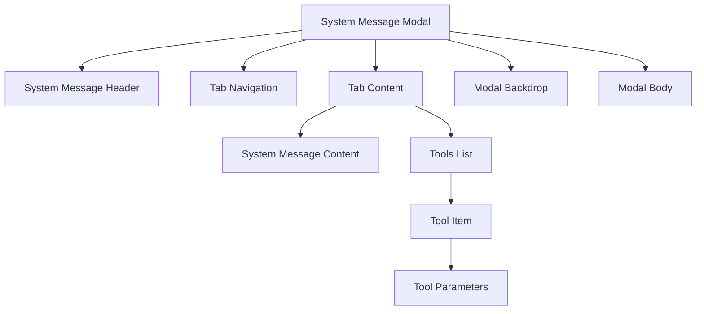
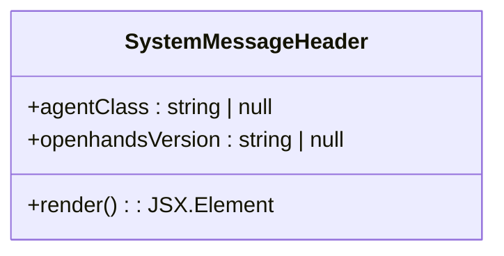
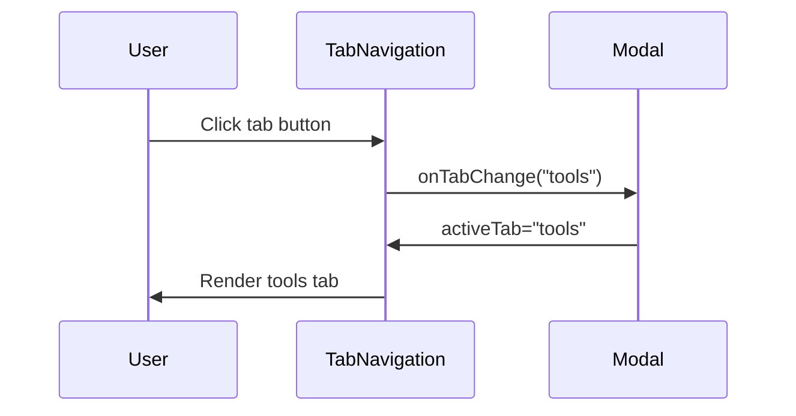
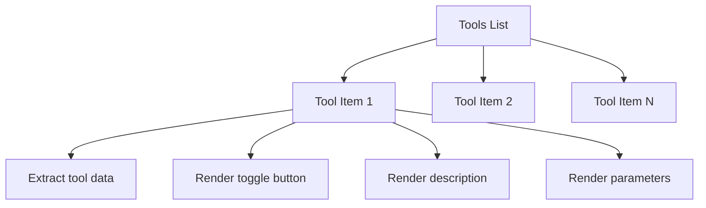
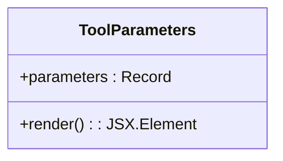
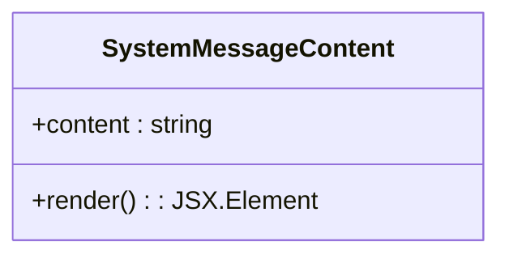
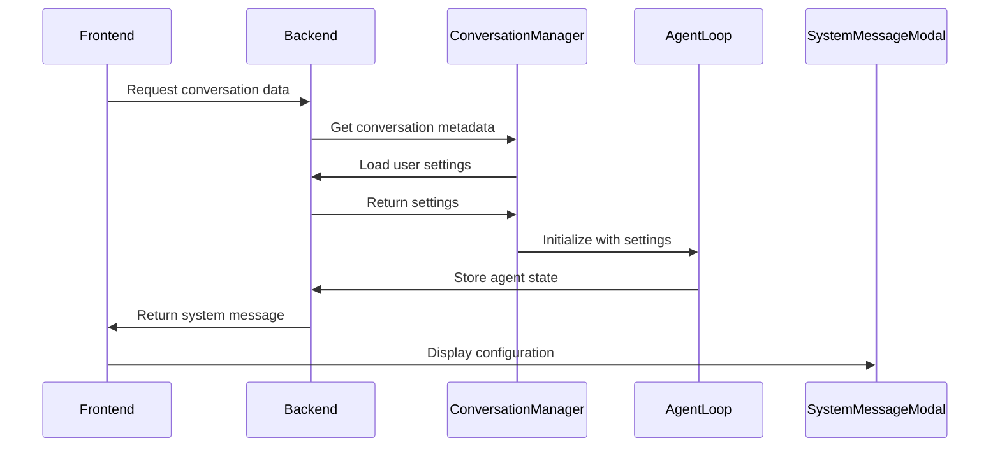
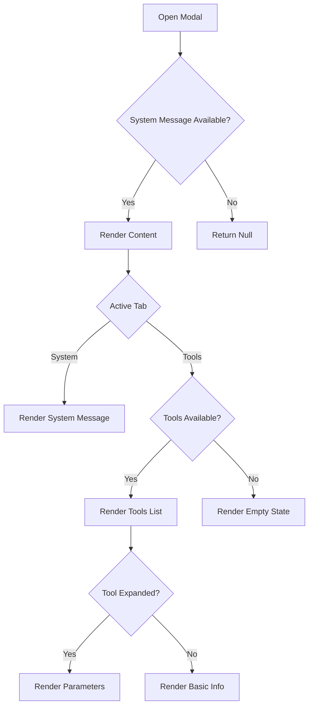

# System Message Modal

<cite>
**Referenced Files in This Document**   
- [system-message-modal.tsx](file://frontend/src/components/features/conversation-panel/system-message-modal.tsx)
- [system-message-header.tsx](file://frontend/src/components/features/conversation-panel/system-message-modal/system-message-header.tsx)
- [tab-navigation.tsx](file://frontend/src/components/features/conversation-panel/system-message-modal/tab-navigation.tsx)
- [tab-content.tsx](file://frontend/src/components/features/conversation-panel/system-message-modal/tab-content.tsx)
- [tools-list.tsx](file://frontend/src/components/features/conversation-panel/system-message-modal/tools-list.tsx)
- [tool-item.tsx](file://frontend/src/components/features/conversation-panel/system-message-modal/tool-item.tsx)
- [tool-parameters.tsx](file://frontend/src/components/features/conversation-panel/system-message-modal/tool-parameters.tsx)
- [system-message-content.tsx](file://frontend/src/components/features/conversation-panel/system-message-modal/system-message-content.tsx)
- [use-conversation-name-context-menu.ts](file://frontend/src/hooks/use-conversation-name-context-menu.ts)
- [manage_conversations.py](file://openhands/server/routes/manage_conversations.py)
- [conversation_manager.py](file://openhands/server/conversation_manager/conversation_manager.py)
- [agent_loop_info.py](file://openhands/server/data_models/agent_loop_info.py)
</cite>

## Table of Contents
1. [Introduction](#introduction)
2. [Core Components](#core-components)
3. [Architecture Overview](#architecture-overview)
4. [Detailed Component Analysis](#detailed-component-analysis)
5. [Data Flow and Integration](#data-flow-and-integration)
6. [User Interaction Patterns](#user-interaction-patterns)
7. [Validation and Error Handling](#validation-and-error-handling)
8. [Conclusion](#conclusion)

## Introduction
The System Message Modal is a critical interface component in the OpenHands application that enables users to configure agent behavior and manage available tools. This modal provides a comprehensive view of the system message that defines the agent's instructions and capabilities, allowing users to inspect and understand the configuration of their AI agents. The modal serves as a central hub for agent configuration, displaying essential information such as the agent class, OpenHands version, system message content, and available tools with their parameters. It plays a vital role in the conversation lifecycle by providing transparency into the agent's setup and enabling users to make informed decisions about their interactions.

**Section sources**
- [system-message-modal.tsx](file://frontend/src/components/features/conversation-panel/system-message-modal.tsx)

## Core Components
The System Message Modal is composed of several interconnected components that work together to provide a comprehensive configuration interface. The main container component manages the modal state and coordinates between different subcomponents, including the header, tab navigation, and content display. The modal implements a tabbed interface that separates system message content from tool configuration, allowing users to focus on specific aspects of the agent configuration. Each tool is displayed with its name, description, and parameters in a collapsible format, enabling users to explore complex tool configurations without overwhelming the interface. The component structure follows a modular design pattern, with each subcomponent responsible for a specific aspect of the modal's functionality.

**Section sources**
- [system-message-modal.tsx](file://frontend/src/components/features/conversation-panel/system-message-modal.tsx)
- [system-message-header.tsx](file://frontend/src/components/features/conversation-panel/system-message-modal/system-message-header.tsx)
- [tab-navigation.tsx](file://frontend/src/components/features/conversation-panel/system-message-modal/tab-navigation.tsx)

## Architecture Overview
The System Message Modal follows a component-based architecture with a clear separation of concerns. The modal is triggered from the conversation controls and receives system message data through props, which is then distributed to specialized subcomponents for rendering. The architecture implements a state management pattern where the main modal component maintains the active tab state and tool expansion states, while subcomponents handle their specific rendering logic. The modal integrates with the application's internationalization system to support multiple languages and uses a responsive design approach to ensure usability across different screen sizes.

**Diagram sources**
- [system-message-modal.tsx](file://frontend/src/components/features/conversation-panel/system-message-modal.tsx)
- [system-message-header.tsx](file://frontend/src/components/features/conversation-panel/system-message-modal/system-message-header.tsx)
- [tab-navigation.tsx](file://frontend/src/components/features/conversation-panel/system-message-modal/tab-navigation.tsx)
- [tab-content.tsx](file://frontend/src/components/features/conversation-panel/system-message-modal/tab-content.tsx)

## Detailed Component Analysis

### Modal Structure and State Management
The System Message Modal component manages several states to control the user experience, including the active tab (system or tools) and the expansion state of individual tools. The component uses React hooks to maintain these states and provides callback functions to child components for state updates. The modal is conditionally rendered based on the isOpen prop and the availability of system message data, ensuring that it only displays when relevant information is available. The component structure follows a composition pattern, where the main modal assembles various subcomponents to create the complete interface.

**Section sources**
- [system-message-modal.tsx](file://frontend/src/components/features/conversation-panel/system-message-modal.tsx)

### Header Component
The System Message Header component displays metadata about the agent configuration, including the agent class and OpenHands version. This information provides context for users to understand which agent implementation is being used and its version. The header uses internationalized text for the modal title and labels, ensuring accessibility across different language settings. The component renders this information in a structured format that emphasizes readability and clarity.

**Diagram sources**
- [system-message-header.tsx](file://frontend/src/components/features/conversation-panel/system-message-modal/system-message-header.tsx)

### Tab Navigation System
The Tab Navigation component implements a tabbed interface that allows users to switch between viewing the system message content and the available tools. The component conditionally renders the tools tab only when tools are available in the system message, providing a dynamic interface that adapts to the current configuration. The active tab state is controlled by the parent modal component, which passes the current state and callback function as props. This design enables seamless switching between different views of the agent configuration.

**Diagram sources**
- [tab-navigation.tsx](file://frontend/src/components/features/conversation-panel/system-message-modal/tab-navigation.tsx)
- [system-message-modal.tsx](file://frontend/src/components/features/conversation-panel/system-message-modal.tsx)

### Tools List and Item Components
The Tools List component renders a collection of Tool Item components, each representing a specific tool available to the agent. The list is displayed with proper spacing and visual separation to enhance readability. Each Tool Item implements a collapsible interface that reveals detailed information about the tool when expanded. The component extracts tool information from a potentially nested data structure, handling different formats of tool definitions to ensure consistent rendering. The expansion state of each tool is managed by the parent modal component, allowing for independent control of each tool's visibility.

**Diagram sources**
- [tools-list.tsx](file://frontend/src/components/features/conversation-panel/system-message-modal/tools-list.tsx)
- [tool-item.tsx](file://frontend/src/components/features/conversation-panel/system-message-modal/tool-item.tsx)

### Tool Parameters Display
The Tool Parameters component renders the parameters of a tool in a structured format using a JSON viewer component. This allows users to inspect complex parameter structures with proper formatting and syntax highlighting. The component displays a label indicating that the content represents parameters and renders the parameter data in a scrollable container with a maximum height to prevent excessive vertical space usage. The JSON viewer is configured with a specific theme to match the application's visual design.

**Diagram sources**
- [tool-parameters.tsx](file://frontend/src/components/features/conversation-panel/system-message-modal/tool-parameters.tsx)

### System Message Content Display
The System Message Content component renders the system message text in a code block format, preserving formatting and whitespace. This presentation style emphasizes that the system message is a structured instruction set for the agent rather than casual text. The component uses a monospace font and syntax highlighting to enhance readability and distinguish the content from other text in the application. The content is displayed with padding and a shadow effect to create visual separation from surrounding elements.

**Diagram sources**
- [system-message-content.tsx](file://frontend/src/components/features/conversation-panel/system-message-modal/system-message-content.tsx)

## Data Flow and Integration
The System Message Modal integrates with the conversation lifecycle through a well-defined data flow. The system message data is extracted from the conversation's event stream by the use-conversation-name-context-menu hook, which identifies the system message event among other conversation events. This data is then passed to the modal component as a prop, enabling the display of current agent configuration. When a conversation is initiated or resumed, the backend system loads the agent configuration settings and initializes the agent loop with the appropriate parameters. The conversation manager coordinates between the frontend interface and backend services, ensuring that configuration changes are properly applied to active conversations.

**Diagram sources**
- [use-conversation-name-context-menu.ts](file://frontend/src/hooks/use-conversation-name-context-menu.ts)
- [manage_conversations.py](file://openhands/server/routes/manage_conversations.py)
- [conversation_manager.py](file://openhands/server/conversation_manager/conversation_manager.py)
- [agent_loop_info.py](file://openhands/server/data_models/agent_loop_info.py)

## User Interaction Patterns
Users interact with the System Message Modal through a series of intuitive patterns. The modal is accessed via the tools control in the conversation interface, which opens the modal when clicked. Users can navigate between the system message and tools tabs to focus on different aspects of the agent configuration. Individual tools can be expanded or collapsed by clicking on their toggle buttons, allowing users to explore specific tool details without overwhelming the interface. The modal provides a read-only view of the configuration, emphasizing transparency and understanding rather than direct editing. Users can close the modal by clicking outside the content area or using the close button, returning to the main conversation interface.

**Section sources**
- [system-message-modal.tsx](file://frontend/src/components/features/conversation-panel/system-message-modal.tsx)
- [use-conversation-name-context-menu.ts](file://frontend/src/hooks/use-conversation-name-context-menu.ts)

## Validation and Error Handling
The System Message Modal implements several validation and error handling mechanisms to ensure robust operation. The modal performs null checks on the system message data before rendering, preventing errors when the data is unavailable. The tool parameter extraction logic handles potentially missing or malformed data fields, providing default values when necessary to maintain interface stability. The JSON viewer component used for displaying tool parameters includes built-in error handling for invalid JSON structures. The modal's integration with the conversation system includes error handling for cases where conversation metadata cannot be loaded or agent state information is unavailable.

**Diagram sources**
- [system-message-modal.tsx](file://frontend/src/components/features/conversation-panel/system-message-modal.tsx)
- [tab-content.tsx](file://frontend/src/components/features/conversation-panel/system-message-modal/tab-content.tsx)
- [tool-item.tsx](file://frontend/src/components/features/conversation-panel/system-message-modal/tool-item.tsx)

## Conclusion
The System Message Modal serves as a crucial transparency and configuration interface in the OpenHands application, providing users with insight into agent behavior and available tools. Its component-based architecture enables modular development and maintenance, while its integration with the conversation lifecycle ensures that users can always access up-to-date configuration information. The modal's design prioritizes clarity and usability, presenting complex tool parameters in an accessible format while maintaining a clean and organized interface. By providing a comprehensive view of the agent's setup, the modal empowers users to understand and trust the AI system they are interacting with, ultimately enhancing the overall user experience.