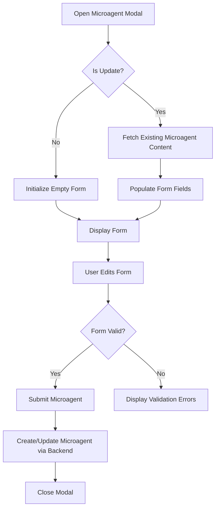
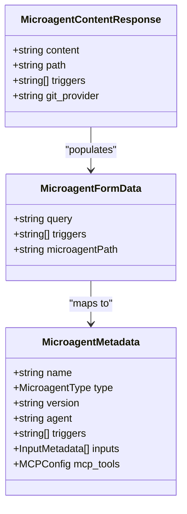
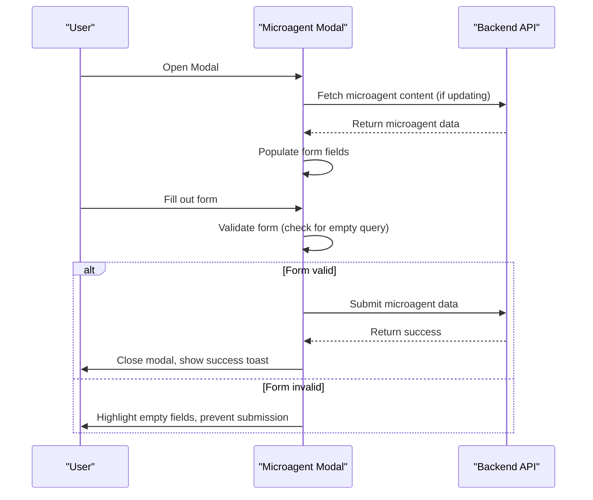
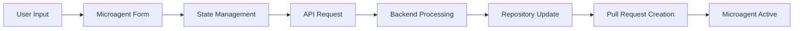

# Microagent Creation Interface

<cite>
**Referenced Files in This Document**   
- [microagent-management-upsert-microagent-modal.tsx](file://frontend/src/components/features/microagent-management/microagent-management-upsert-microagent-modal.tsx)
- [microagent-management-content.tsx](file://frontend/src/components/features/microagent-management/microagent-management-content.tsx)
- [microagent-management-store.ts](file://frontend/src/state/microagent-management-store.ts)
- [use-repository-microagent-content.ts](file://frontend/src/hooks/query/use-repository-microagent-content.ts)
- [git-service.api.ts](file://frontend/src/api/git-service/git-service.api.ts)
- [types.py](file://openhands/microagent/types.py)
</cite>

## Table of Contents
1. [Introduction](#introduction)
2. [Microagent Creation Modal Implementation](#microagent-creation-modal-implementation)
3. [Form Fields and Configuration Options](#form-fields-and-configuration-options)
4. [Validation Logic and Error Handling](#validation-logic-and-error-handling)
5. [Backend Integration for Microagent Persistence](#backend-integration-for-microagent-persistence)
6. [Common Microagent Creation Patterns](#common-microagent-creation-patterns)
7. [Best Practices for Microagent Configuration](#best-practices-for-microagent-configuration)

## Introduction

The Microagent Creation Interface in OpenHands provides a user-friendly way to create and manage microagents that can automate various tasks within repositories. Microagents are specialized AI assistants that can be triggered by specific keywords or conditions to perform predefined actions. This documentation details the implementation of the upsert modal component that handles both creation and editing of microagents, covering form fields, validation logic, and backend integration.

**Section sources**
- [microagent-management-upsert-microagent-modal.tsx](file://frontend/src/components/features/microagent-management/microagent-management-upsert-microagent-modal.tsx)
- [microagent-management-content.tsx](file://frontend/src/components/features/microagent-management/microagent-management-content.tsx)

## Microagent Creation Modal Implementation

The Microagent Creation Interface is implemented as an upsert modal component that handles both creation and editing of microagents. The modal is implemented as the `MicroagentManagementUpsertMicroagentModal` component in the frontend codebase.

The modal is designed to be flexible, adapting its behavior based on whether a user is creating a new microagent or updating an existing one. When updating an existing microagent, the component fetches the current microagent content using the `useRepositoryMicroagentContent` hook and populates the form fields with the existing data.

The modal's title and description are dynamically generated based on the operation mode (create or update) and the selected repository. This provides clear context to users about the action they are performing. The modal includes a help icon that links to documentation about microagents, providing users with additional resources.

**Diagram sources**
- [microagent-management-upsert-microagent-modal.tsx](file://frontend/src/components/features/microagent-management/microagent-management-upsert-microagent-modal.tsx)
- [microagent-management-content.tsx](file://frontend/src/components/features/microagent-management/microagent-management-content.tsx)

**Section sources**
- [microagent-management-upsert-microagent-modal.tsx](file://frontend/src/components/features/microagent-management/microagent-management-upsert-microagent-modal.tsx)

## Form Fields and Configuration Options

The microagent creation form includes several key fields that allow users to configure the behavior and triggers of their microagents.

### Repository Selection
When creating a microagent, users must first select a repository where the microagent will be deployed. This selection is managed through the `useMicroagentManagementStore` state management system, which maintains the currently selected repository. The repository selection determines where the microagent configuration will be stored and where it will be active.

### Behavior Settings
The primary behavior setting is the "What to do" field, which is a required textarea where users describe the task the microagent should perform. This description serves as the core instruction for the microagent and determines its functionality. The field includes a placeholder prompting users to describe the desired behavior.

### Trigger Conditions
Microagents can be configured with trigger conditions that determine when they should activate. The form includes a badge input field for adding triggers, which are keywords or phrases that will activate the microagent when detected in conversation. Users can add multiple triggers, and each is displayed as a badge for easy management. The interface provides guidance on valid triggers through helper text below the input field.

**Diagram sources**
- [types.py](file://openhands/microagent/types.py)
- [microagent-management-upsert-microagent-modal.tsx](file://frontend/src/components/features/microagent-management/microagent-management-upsert-microagent-modal.tsx)

**Section sources**
- [microagent-management-upsert-microagent-modal.tsx](file://frontend/src/components/features/microagent-management/microagent-management-upsert-microagent-modal.tsx)
- [types.py](file://openhands/microagent/types.py)

## Validation Logic and Error Handling

The microagent creation interface implements several layers of validation to ensure data integrity and provide a smooth user experience.

### Client-Side Validation
The form includes required field validation, ensuring that the "What to do" field cannot be empty when submitting the form. This validation is implemented in the `onSubmit` and `handleConfirm` functions, which check if the query field has content before proceeding. If the field is empty, the submission is prevented.

The submit button is also disabled when the form is in a loading state or when required data is being fetched (such as when updating an existing microagent). This prevents users from submitting the form multiple times or before all necessary data is loaded.

### Error Handling
The interface handles errors through a combination of UI feedback and toast notifications. When an error occurs during microagent creation or update, a toast notification is displayed to inform the user of the failure. This is implemented in the `handleMicroagentEvent` function, which listens for error events and displays appropriate messages.

For update operations, the interface handles loading states by disabling the submit button while fetching existing microagent content. This prevents race conditions and ensures users don't submit incomplete data.

**Diagram sources**
- [microagent-management-upsert-microagent-modal.tsx](file://frontend/src/components/features/microagent-management/microagent-management-upsert-microagent-modal.tsx)
- [microagent-management-content.tsx](file://frontend/src/components/features/microagent-management/microagent-management-content.tsx)

**Section sources**
- [microagent-management-upsert-microagent-modal.tsx](file://frontend/src/components/features/microagent-management/microagent-management-upsert-microagent-modal.tsx)
- [microagent-management-content.tsx](file://frontend/src/components/features/microagent-management/microagent-management-content.tsx)

## Backend Integration for Microagent Persistence

The microagent creation interface integrates with backend services to persist microagent configurations in repositories.

### API Endpoints
The interface communicates with the backend through several API endpoints:
- `GET /api/user/repository/{owner}/{repo}/microagents` - Retrieves the list of available microagents for a repository
- `GET /api/user/repository/{owner}/{repo}/microagents/content` - Retrieves the content of a specific microagent
- The microagent creation/update is handled through the conversation creation endpoint, which generates the appropriate instructions to create or update the microagent file in the repository

### Data Flow
When a user submits a microagent configuration, the interface constructs a conversation instruction that guides the AI agent to create or update the microagent file in the specified repository. The instruction includes steps to:
1. Create or update a markdown file in the `.openhands/microagents` folder
2. Create a new branch for the changes
3. Push the changes and create a pull request

The `handleUpsertMicroagent` function in the `microagent-management-content.tsx` file orchestrates this process, creating the appropriate conversation instructions based on whether the operation is a creation or update.

### State Management
The interface uses Zustand for state management, with the `useMicroagentManagementStore` hook providing access to the current state. This includes the selected repository, modal visibility states, and the currently selected microagent item. The state is updated through a set of actions that follow the Flux pattern.

**Diagram sources**
- [microagent-management-content.tsx](file://frontend/src/components/features/microagent-management/microagent-management-content.tsx)
- [git-service.api.ts](file://frontend/src/api/git-service/git-service.api.ts)

**Section sources**
- [microagent-management-content.tsx](file://frontend/src/components/features/microagent-management/microagent-management-content.tsx)
- [git-service.api.ts](file://frontend/src/api/git-service/git-service.api.ts)

## Common Microagent Creation Patterns

Based on the implementation and design of the microagent creation interface, several common patterns emerge for creating effective microagents.

### Documentation Microagents
These microagents are created to help users understand codebases or specific components. They typically have descriptive names and are triggered by keywords related to the documentation topic. For example, a microagent might be created with the instruction "Explain the authentication system in this repository" with triggers like "auth", "authentication", and "login".

### Task Automation Microagents
These microagents automate repetitive tasks within a repository. They are often created with specific, actionable instructions like "Generate API documentation for all endpoints" or "Create unit tests for new functions". These microagents may not have triggers if they are meant to be manually invoked.

### Code Quality Microagents
These microagents focus on maintaining code quality standards. Examples include microagents that "Identify and fix code style issues" or "Ensure all functions have proper documentation". These often have triggers related to code review processes.

## Best Practices for Microagent Configuration

To create effective microagents, consider the following best practices:

### Clear and Specific Instructions
Provide clear, specific instructions in the "What to do" field. Instead of vague instructions like "Help with coding", use specific instructions like "Refactor the user service to use dependency injection" or "Add input validation to the registration form".

### Relevant Trigger Selection
Choose triggers that are relevant to the microagent's purpose but not too generic. For example, a microagent that helps with database migrations might use triggers like "migration", "database", and "schema" rather than broader terms like "code" or "help".

### Repository-Specific Configuration
Consider the specific context of the repository when creating microagents. A microagent created for a frontend repository might focus on UI components and styling, while one for a backend repository might focus on API design and database interactions.

### Iterative Improvement
Use the update functionality to iteratively improve microagents. Start with a basic version and refine the instructions and triggers based on usage patterns and effectiveness.