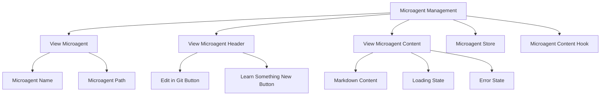
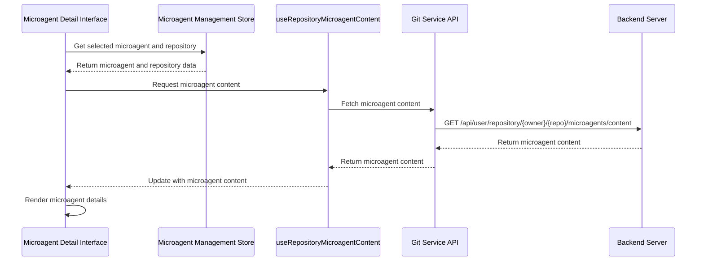
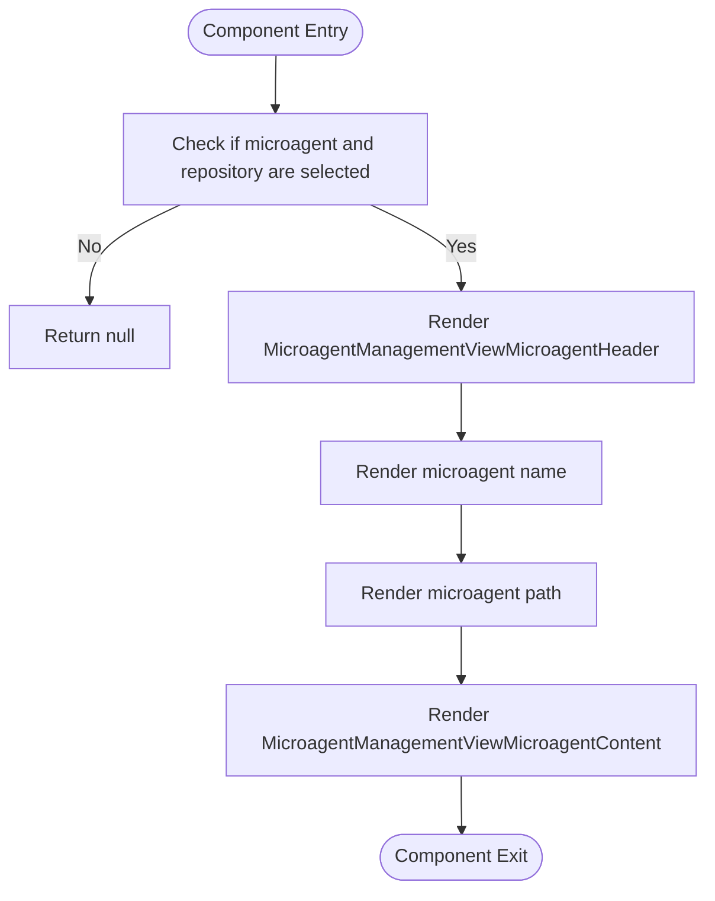
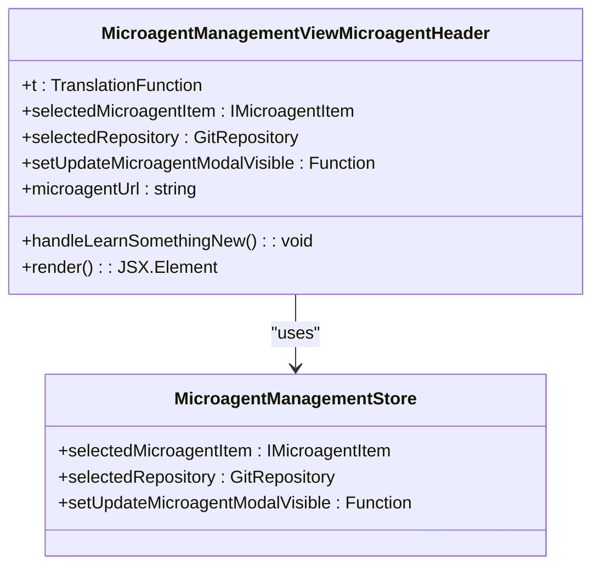
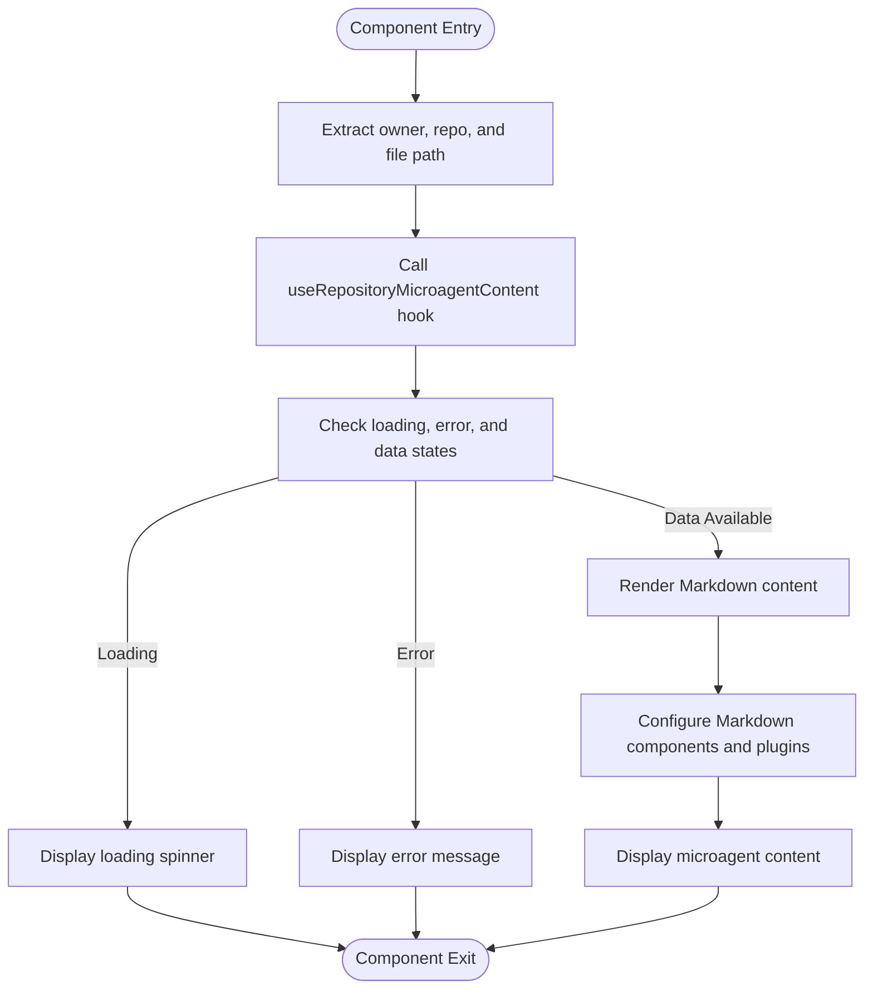
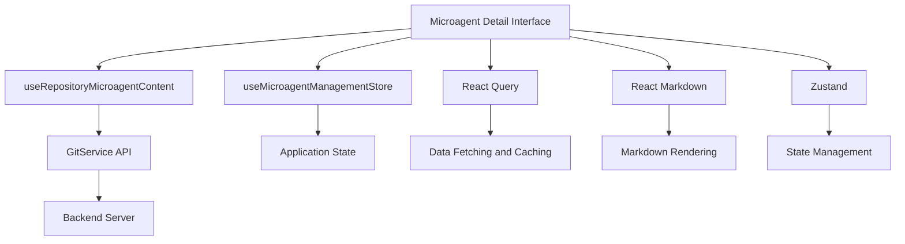

# Microagent Detail Interface

<cite>
**Referenced Files in This Document**   
- [microagent-management-view-microagent.tsx](file://frontend/src/components/features/microagent-management/microagent-management-view-microagent.tsx)
- [microagent-management-view-microagent-header.tsx](file://frontend/src/components/features/microagent-management/microagent-management-view-microagent-header.tsx)
- [microagent-management-view-microagent-content.tsx](file://frontend/src/components/features/microagent-management/microagent-management-view-microagent-content.tsx)
- [use-repository-microagent-content.ts](file://frontend/src/hooks/query/use-repository-microagent-content.ts)
- [git-service.api.ts](file://frontend/src/api/git-service/git-service.api.ts)
- [microagent-management-store.ts](file://frontend/src/state/microagent-management-store.ts)
- [microagent-management-main.tsx](file://frontend/src/components/features/microagent-management/microagent-management-main.tsx)
- [microagent-management-content.tsx](file://frontend/src/components/features/microagent-management/microagent-management-content.tsx)
- [microagent-status-indicator.tsx](file://frontend/src/components/features/chat/microagent/microagent-status-indicator.tsx)
- [microagent-status.ts](file://frontend/src/types/microagent-status.ts)
- [microagent-management.tsx](file://frontend/src/routes/microagent-management.tsx)
</cite>

## Table of Contents
1. [Introduction](#introduction)
2. [Project Structure](#project-structure)
3. [Core Components](#core-components)
4. [Architecture Overview](#architecture-overview)
5. [Detailed Component Analysis](#detailed-component-analysis)
6. [Dependency Analysis](#dependency-analysis)
7. [Performance Considerations](#performance-considerations)
8. [Troubleshooting Guide](#troubleshooting-guide)
9. [Conclusion](#conclusion)

## Introduction
The Microagent Detail Interface provides a comprehensive view for managing and interacting with microagents in the OpenHands system. This interface allows users to view detailed information about a specific microagent, including its configuration, activity history, and performance metrics. The interface is designed to support interaction patterns for editing, deleting, and controlling microagent execution, with robust data fetching mechanisms for retrieving microagent details from the backend.

## Project Structure
The Microagent Detail Interface is implemented within the frontend/src/components/features/microagent-management directory, following a modular component-based architecture. The interface consists of several key components that work together to provide a seamless user experience for managing microagents.

**Diagram sources**
- [microagent-management-view-microagent.tsx](file://frontend/src/components/features/microagent-management/microagent-management-view-microagent.tsx)
- [microagent-management-view-microagent-header.tsx](file://frontend/src/components/features/microagent-management/microagent-management-view-microagent-header.tsx)
- [microagent-management-view-microagent-content.tsx](file://frontend/src/components/features/microagent-management/microagent-management-view-microagent-content.tsx)

**Section sources**
- [microagent-management-view-microagent.tsx](file://frontend/src/components/features/microagent-management/microagent-management-view-microagent.tsx)
- [microagent-management-view-microagent-header.tsx](file://frontend/src/components/features/microagent-management/microagent-management-view-microagent-header.tsx)
- [microagent-management-view-microagent-content.tsx](file://frontend/src/components/features/microagent-management/microagent-management-view-microagent-content.tsx)

## Core Components
The Microagent Detail Interface consists of several core components that work together to provide a comprehensive view of microagent details. The main component is MicroagentManagementViewMicroagent, which serves as the container for the entire interface. This component renders the header section, microagent name and path, and the content area that displays the microagent's configuration details, activity history, and performance metrics.

The interface uses a state management store (useMicroagentManagementStore) to manage the application state, including the selected microagent, repository, and modal visibility states. The store provides actions for updating the state, such as setting the selected microagent item and controlling modal visibility.

**Section sources**
- [microagent-management-view-microagent.tsx](file://frontend/src/components/features/microagent-management/microagent-management-view-microagent.tsx)
- [microagent-management-store.ts](file://frontend/src/state/microagent-management-store.ts)

## Architecture Overview
The Microagent Detail Interface follows a component-based architecture with clear separation of concerns. The interface is built using React components that are organized into a hierarchical structure, with the MicroagentManagementViewMicroagent component serving as the parent component that orchestrates the rendering of child components.

The architecture leverages React Query for data fetching and caching, with the useRepositoryMicroagentContent hook responsible for retrieving microagent content from the backend API. The interface uses Zustand for state management, with the useMicroagentManagementStore providing a centralized store for managing application state.

**Diagram sources**
- [microagent-management-view-microagent.tsx](file://frontend/src/components/features/microagent-management/microagent-management-view-microagent.tsx)
- [use-repository-microagent-content.ts](file://frontend/src/hooks/query/use-repository-microagent-content.ts)
- [git-service.api.ts](file://frontend/src/api/git-service/git-service.api.ts)

## Detailed Component Analysis

### Microagent View Component Analysis
The MicroagentManagementViewMicroagent component serves as the main container for the microagent detail interface. It renders the header section, microagent name and path, and the content area that displays the microagent's configuration details, activity history, and performance metrics.

The component uses the useMicroagentManagementStore hook to access the selected microagent and repository from the application state. It conditionally renders the interface only when both a microagent and repository are selected, ensuring that the interface displays relevant information.

**Diagram sources**
- [microagent-management-view-microagent.tsx](file://frontend/src/components/features/microagent-management/microagent-management-view-microagent.tsx)

**Section sources**
- [microagent-management-view-microagent.tsx](file://frontend/src/components/features/microagent-management/microagent-management-view-microagent.tsx)

### Microagent Header Component Analysis
The MicroagentManagementViewMicroagentHeader component displays the header section of the microagent detail interface, including the repository name and action buttons for editing and learning. The component provides a "Learn Something New" button that allows users to update the microagent's knowledge and an "Edit in Git" button that opens the microagent's source file in the repository.

The component constructs the microagent URL using the repository's git provider, full name, and microagent path, enabling users to directly access the microagent's source file in the repository. The header also displays the repository name, providing context for the microagent being viewed.

**Diagram sources**
- [microagent-management-view-microagent-header.tsx](file://frontend/src/components/features/microagent-management/microagent-management-view-microagent-header.tsx)
- [microagent-management-store.ts](file://frontend/src/state/microagent-management-store.ts)

**Section sources**
- [microagent-management-view-microagent-header.tsx](file://frontend/src/components/features/microagent-management/microagent-management-view-microagent-header.tsx)

### Microagent Content Component Analysis
The MicroagentManagementViewMicroagentContent component displays the main content area of the microagent detail interface, rendering the microagent's configuration details, activity history, and performance metrics in Markdown format. The component uses the useRepositoryMicroagentContent hook to fetch the microagent's content from the backend API, with built-in loading and error states to provide feedback to users.

The component implements a caching strategy with a stale time of 5 minutes and garbage collection time of 15 minutes, balancing performance with data freshness. When the cache is disabled, the component fetches fresh data on each render, ensuring that users see the most up-to-date information.

**Diagram sources**
- [microagent-management-view-microagent-content.tsx](file://frontend/src/components/features/microagent-management/microagent-management-view-microagent-content.tsx)
- [use-repository-microagent-content.ts](file://frontend/src/hooks/query/use-repository-microagent-content.ts)

**Section sources**
- [microagent-management-view-microagent-content.tsx](file://frontend/src/components/features/microagent-management/microagent-management-view-microagent-content.tsx)
- [use-repository-microagent-content.ts](file://frontend/src/hooks/query/use-repository-microagent-content.ts)

## Dependency Analysis
The Microagent Detail Interface has several key dependencies that enable its functionality. The interface depends on the useMicroagentManagementStore for state management, which provides access to the selected microagent and repository. It also depends on the useRepositoryMicroagentContent hook for data fetching, which in turn depends on the GitService API for communicating with the backend.

The interface has dependencies on several third-party libraries, including React Query for data fetching and caching, React Markdown for rendering Markdown content, and Zustand for state management. These dependencies are essential for providing a responsive and user-friendly interface.

**Diagram sources**
- [microagent-management-store.ts](file://frontend/src/state/microagent-management-store.ts)
- [use-repository-microagent-content.ts](file://frontend/src/hooks/query/use-repository-microagent-content.ts)
- [git-service.api.ts](file://frontend/src/api/git-service/git-service.api.ts)

**Section sources**
- [microagent-management-store.ts](file://frontend/src/state/microagent-management-store.ts)
- [use-repository-microagent-content.ts](file://frontend/src/hooks/query/use-repository-microagent-content.ts)
- [git-service.api.ts](file://frontend/src/api/git-service/git-service.api.ts)

## Performance Considerations
The Microagent Detail Interface implements several performance optimizations to ensure a responsive user experience. The use of React Query for data fetching includes built-in caching with a stale time of 5 minutes and garbage collection time of 15 minutes, reducing the number of network requests and improving load times.

The interface also implements conditional rendering, only rendering the microagent detail view when both a microagent and repository are selected. This prevents unnecessary rendering and improves performance when the interface is not in use.

The use of React's memoization features, such as useMemo and useCallback, helps to prevent unnecessary re-renders and improves the overall performance of the interface.

## Troubleshooting Guide
When the Microagent Detail Interface fails to display microagent content, there are several potential causes to investigate. First, verify that a microagent and repository are selected in the application state. The interface will not render if either of these values is missing.

If the interface displays a loading spinner indefinitely, check the network requests in the browser's developer tools to ensure that the API request to fetch microagent content is being made and completing successfully. If the request is failing, check the backend server logs for any errors.

If the interface displays an error message, verify that the microagent file exists in the repository and that the user has the necessary permissions to access it. Also check that the repository owner, name, and file path are correctly formatted and passed to the API.

**Section sources**
- [microagent-management-view-microagent-content.tsx](file://frontend/src/components/features/microagent-management/microagent-management-view-microagent-content.tsx)
- [use-repository-microagent-content.ts](file://frontend/src/hooks/query/use-repository-microagent-content.ts)
- [git-service.api.ts](file://frontend/src/api/git-service/git-service.api.ts)

## Conclusion
The Microagent Detail Interface provides a comprehensive and user-friendly way to view and manage microagents in the OpenHands system. The interface's component-based architecture, with clear separation of concerns, makes it easy to maintain and extend. The use of React Query for data fetching and caching, combined with Zustand for state management, provides a responsive and performant user experience.

The interface's robust error handling and loading states ensure that users are always informed about the status of their requests, while the caching strategy balances performance with data freshness. The interface's modular design makes it easy to add new features and functionality in the future, ensuring that it can evolve to meet the changing needs of users.