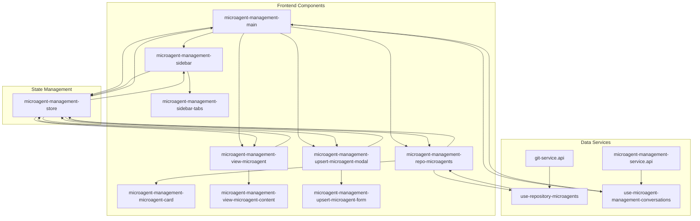
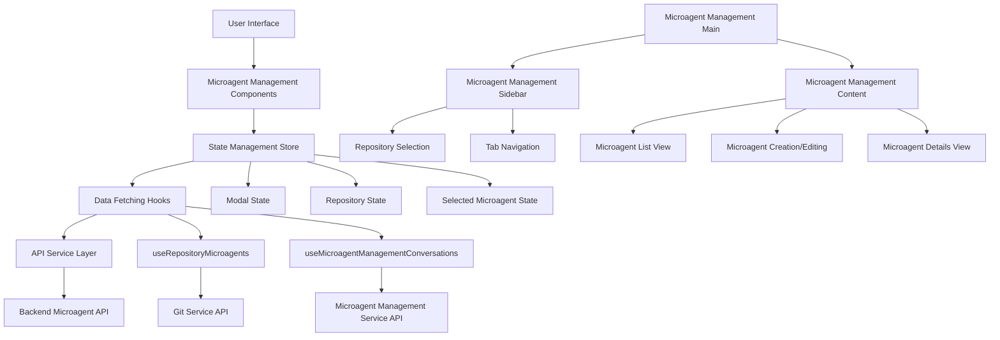
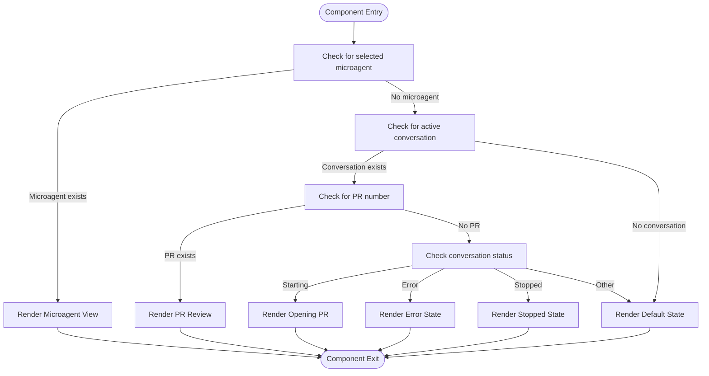
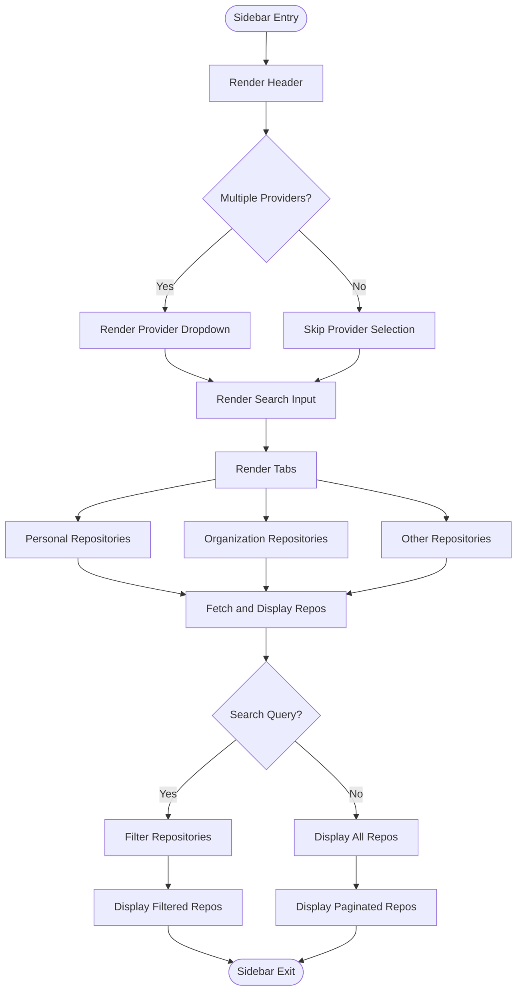
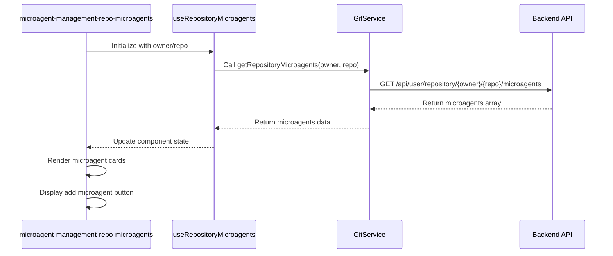
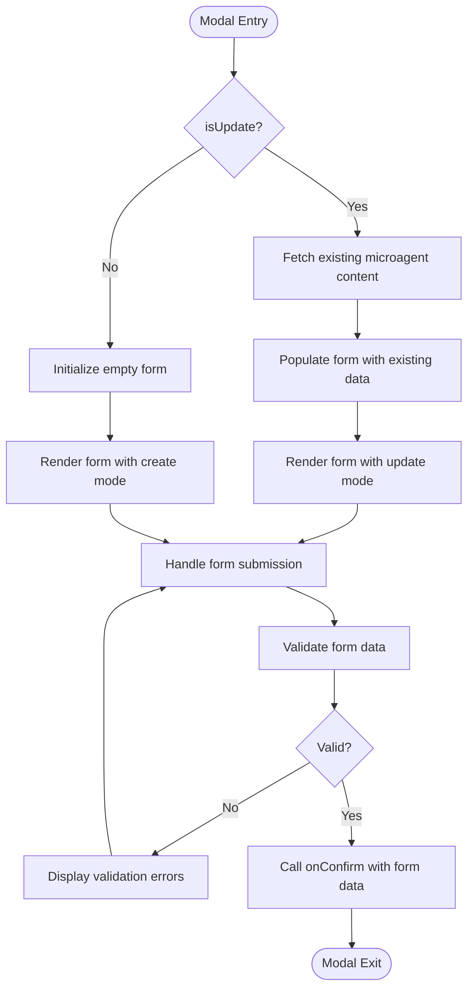
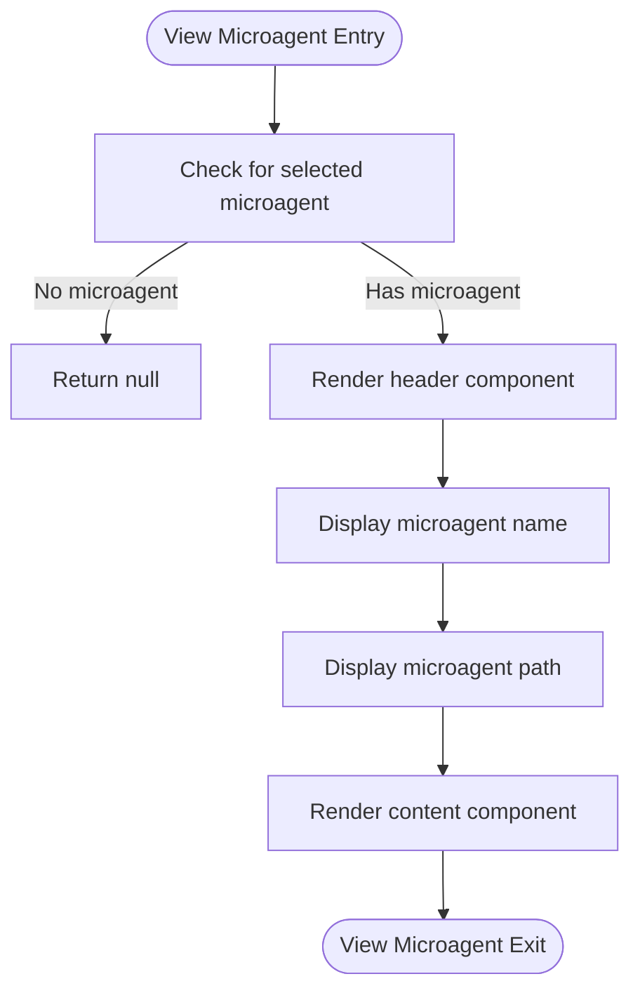
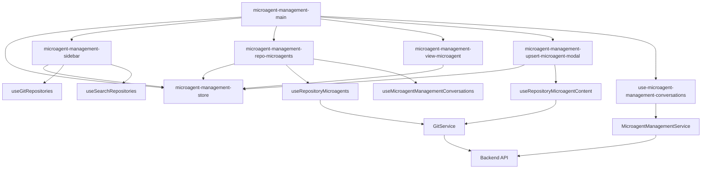

# Microagent Management Components

<cite>
**Referenced Files in This Document**   
- [microagent-management-main.tsx](file://frontend/src/components/features/microagent-management/microagent-management-main.tsx)
- [microagent-management-sidebar.tsx](file://frontend/src/components/features/microagent-management/microagent-management-sidebar.tsx)
- [microagent-management-repo-microagents.tsx](file://frontend/src/components/features/microagent-management/microagent-management-repo-microagents.tsx)
- [microagent-management-upsert-microagent-modal.tsx](file://frontend/src/components/features/microagent-management/microagent-management-upsert-microagent-modal.tsx)
- [microagent-management-view-microagent.tsx](file://frontend/src/components/features/microagent-management/microagent-management-view-microagent.tsx)
- [microagent-management-store.ts](file://frontend/src/state/microagent-management-store.ts)
- [use-repository-microagents.ts](file://frontend/src/hooks/query/use-repository-microagents.ts)
- [git-service.api.ts](file://frontend/src/api/git-service/git-service.api.ts)
- [microagent-management-service.api.ts](file://frontend/src/ui/microagent-management-service/microagent-management-service.api.ts)
- [use-microagent-management-conversations.ts](file://frontend/src/hooks/query/use-microagent-management-conversations.ts)
</cite>

## Table of Contents
1. [Introduction](#introduction)
2. [Project Structure](#project-structure)
3. [Core Components](#core-components)
4. [Architecture Overview](#architecture-overview)
5. [Detailed Component Analysis](#detailed-component-analysis)
6. [Dependency Analysis](#dependency-analysis)
7. [Performance Considerations](#performance-considerations)
8. [Troubleshooting Guide](#troubleshooting-guide)
9. [Conclusion](#conclusion)

## Introduction
The Microagent Management system provides a comprehensive interface for creating, configuring, and managing specialized AI agents for specific repositories and tasks. This documentation details the implementation of the microagent system, focusing on the key components that enable users to interact with and manage microagents through a structured interface. The system integrates frontend components with backend services to provide a seamless experience for microagent creation, editing, and monitoring.

## Project Structure
The microagent management components are organized within the frontend/src/components/features/microagent-management directory, following a modular structure that separates concerns and promotes reusability. The system utilizes React components, Zustand for state management, and React Query for data fetching, creating a robust architecture for managing microagent operations.

**Diagram sources**
- [microagent-management-main.tsx](file://frontend/src/components/features/microagent-management/microagent-management-main.tsx)
- [microagent-management-sidebar.tsx](file://frontend/src/components/features/microagent-management/microagent-management-sidebar.tsx)
- [microagent-management-repo-microagents.tsx](file://frontend/src/components/features/microagent-management/microagent-management-repo-microagents.tsx)
- [microagent-management-store.ts](file://frontend/src/state/microagent-management-store.ts)
- [use-repository-microagents.ts](file://frontend/src/hooks/query/use-repository-microagents.ts)
- [git-service.api.ts](file://frontend/src/api/git-service/git-service.api.ts)
- [microagent-management-service.api.ts](file://frontend/src/ui/microagent-management-service/microagent-management-service.api.ts)
- [use-microagent-management-conversations.ts](file://frontend/src/hooks/query/use-microagent-management-conversations.ts)

**Section sources**
- [microagent-management-main.tsx](file://frontend/src/components/features/microagent-management/microagent-management-main.tsx)
- [microagent-management-sidebar.tsx](file://frontend/src/components/features/microagent-management/microagent-management-sidebar.tsx)
- [microagent-management-repo-microagents.tsx](file://frontend/src/components/features/microagent-management/microagent-management-repo-microagents.tsx)
- [microagent-management-store.ts](file://frontend/src/state/microagent-management-store.ts)

## Core Components
The microagent management system consists of several core components that work together to provide a comprehensive interface for managing microagents. The microagent-management-main component serves as the entry point and container for the microagent interface, orchestrating the display of different views based on the current state. The sidebar navigation and tab system organize microagent operations, allowing users to browse repositories and manage microagents efficiently. Repository-specific microagent management is handled by the microagent-management-repo-microagents component, which displays microagents associated with a specific repository. The upsert modal enables users to create and edit microagents with configuration options, while the view microagent interface displays detailed information about a selected microagent.

**Section sources**
- [microagent-management-main.tsx](file://frontend/src/components/features/microagent-management/microagent-management-main.tsx)
- [microagent-management-repo-microagents.tsx](file://frontend/src/components/features/microagent-management/microagent-management-repo-microagents.tsx)
- [microagent-management-upsert-microagent-modal.tsx](file://frontend/src/components/features/microagent-management/microagent-management-upsert-microagent-modal.tsx)
- [microagent-management-view-microagent.tsx](file://frontend/src/components/features/microagent-management/microagent-management-view-microagent.tsx)

## Architecture Overview
The microagent management system follows a component-based architecture with clear separation of concerns. The system is built on React with TypeScript, utilizing Zustand for global state management and React Query for data fetching and caching. The architecture consists of presentation components, state management, data services, and integration layers that connect to backend APIs.

**Diagram sources**
- [microagent-management-main.tsx](file://frontend/src/components/features/microagent-management/microagent-management-main.tsx)
- [microagent-management-sidebar.tsx](file://frontend/src/components/features/microagent-management/microagent-management-sidebar.tsx)
- [microagent-management-store.ts](file://frontend/src/state/microagent-management-store.ts)
- [use-repository-microagents.ts](file://frontend/src/hooks/query/use-repository-microagents.ts)
- [git-service.api.ts](file://frontend/src/api/git-service/git-service.api.ts)
- [microagent-management-service.api.ts](file://frontend/src/ui/microagent-management-service/microagent-management-service.api.ts)

## Detailed Component Analysis

### Microagent Management Main Component
The microagent-management-main component serves as the central container for the microagent interface, determining which view to display based on the current state. It uses the microagent-management-store to access the selected microagent and conversation state, rendering different components depending on whether a microagent is selected, a conversation is in progress, or no specific item is selected.

**Diagram sources**
- [microagent-management-main.tsx](file://frontend/src/components/features/microagent-management/microagent-management-main.tsx)

**Section sources**
- [microagent-management-main.tsx](file://frontend/src/components/features/microagent-management/microagent-management-main.tsx)

### Microagent Management Sidebar
The microagent-management-sidebar component provides navigation and repository selection functionality. It displays a header with documentation links, a provider selection dropdown (when multiple providers are available), a search input for filtering repositories, and tabs for organizing repositories. The sidebar manages repository state and selection, updating the global store when a repository is selected.

**Diagram sources**
- [microagent-management-sidebar.tsx](file://frontend/src/components/features/microagent-management/microagent-management-sidebar.tsx)

**Section sources**
- [microagent-management-sidebar.tsx](file://frontend/src/components/features/microagent-management/microagent-management-sidebar.tsx)

### Repository Microagents Component
The microagent-management-repo-microagents component displays the list of microagents for a specific repository. It fetches microagent data using the useRepositoryMicroagents hook, which queries the backend API for microagents associated with the specified repository. The component renders microagent cards and provides functionality for adding new microagents to the repository.

**Diagram sources**
- [microagent-management-repo-microagents.tsx](file://frontend/src/components/features/microagent-management/microagent-management-repo-microagents.tsx)
- [use-repository-microagents.ts](file://frontend/src/hooks/query/use-repository-microagents.ts)
- [git-service.api.ts](file://frontend/src/api/git-service/git-service.api.ts)

**Section sources**
- [microagent-management-repo-microagents.tsx](file://frontend/src/components/features/microagent-management/microagent-management-repo-microagents.tsx)
- [use-repository-microagents.ts](file://frontend/src/hooks/query/use-repository-microagents.ts)

### Upsert Microagent Modal
The microagent-management-upsert-microagent-modal component provides a form interface for creating and editing microagents. When updating an existing microagent, it fetches the current microagent content using the useRepositoryMicroagentContent hook. The modal supports both creation and update operations, with the mode determined by the isUpdate prop.

**Diagram sources**
- [microagent-management-upsert-microagent-modal.tsx](file://frontend/src/components/features/microagent-management/microagent-management-upsert-microagent-modal.tsx)

**Section sources**
- [microagent-management-upsert-microagent-modal.tsx](file://frontend/src/components/features/microagent-management/microagent-management-upsert-microagent-modal.tsx)

### View Microagent Interface
The microagent-management-view-microagent component displays detailed information about a selected microagent. It shows the microagent's name and path, and includes a header component with action buttons for editing the microagent. The main content area is handled by the microagent-management-view-microagent-content component.

**Diagram sources**
- [microagent-management-view-microagent.tsx](file://frontend/src/components/features/microagent-management/microagent-management-view-microagent.tsx)

**Section sources**
- [microagent-management-view-microagent.tsx](file://frontend/src/components/features/microagent-management/microagent-management-view-microagent.tsx)

## Dependency Analysis
The microagent management components have a well-defined dependency structure that follows the principles of separation of concerns and single responsibility. The components depend on the microagent-management-store for shared state, various hooks for data fetching, and service APIs for backend communication.

**Diagram sources**
- [microagent-management-main.tsx](file://frontend/src/components/features/microagent-management/microagent-management-main.tsx)
- [microagent-management-sidebar.tsx](file://frontend/src/components/features/microagent-management/microagent-management-sidebar.tsx)
- [microagent-management-repo-microagents.tsx](file://frontend/src/components/features/microagent-management/microagent-management-repo-microagents.tsx)
- [microagent-management-store.ts](file://frontend/src/state/microagent-management-store.ts)
- [use-repository-microagents.ts](file://frontend/src/hooks/query/use-repository-microagents.ts)
- [use-microagent-management-conversations.ts](file://frontend/src/hooks/query/use-microagent-management-conversations.ts)
- [git-service.api.ts](file://frontend/src/api/git-service/git-service.api.ts)
- [microagent-management-service.api.ts](file://frontend/src/ui/microagent-management-service/microagent-management-service.api.ts)

**Section sources**
- [microagent-management-main.tsx](file://frontend/src/components/features/microagent-management/microagent-management-main.tsx)
- [microagent-management-sidebar.tsx](file://frontend/src/components/features/microagent-management/microagent-management-sidebar.tsx)
- [microagent-management-repo-microagents.tsx](file://frontend/src/components/features/microagent-management/microagent-management-repo-microagents.tsx)
- [microagent-management-store.ts](file://frontend/src/state/microagent-management-store.ts)
- [use-repository-microagents.ts](file://frontend/src/hooks/query/use-repository-microagents.ts)
- [use-microagent-management-conversations.ts](file://frontend/src/hooks/query/use-microagent-management-conversations.ts)

## Performance Considerations
The microagent management system implements several performance optimizations to ensure a responsive user experience. Data fetching is handled by React Query, which provides built-in caching, background refetching, and request deduplication. The system uses pagination for repository lists to prevent loading large amounts of data at once, and implements debounced search to reduce the frequency of API calls during user input. The Zustand store is optimized to minimize unnecessary re-renders by using selective state subscriptions.

## Troubleshooting Guide
When encountering issues with the microagent management system, consider the following common problems and solutions:

1. **Microagents not appearing in the list**: Verify that the repository has microagents in the .openhands/microagents directory and that the user has appropriate permissions to access the repository.

2. **Repository search not returning results**: Check that the selected provider is correctly configured and that the user has repositories on that provider. Ensure the search query is not too restrictive.

3. **Microagent creation/update failing**: Verify that the backend API endpoints are accessible and that the user has write permissions to the repository. Check the browser console for any JavaScript errors.

4. **Slow performance with large repository lists**: The system implements pagination to handle large numbers of repositories. If performance is still an issue, consider optimizing the backend API response time or implementing more aggressive client-side filtering.

**Section sources**
- [microagent-management-sidebar.tsx](file://frontend/src/components/features/microagent-management/microagent-management-sidebar.tsx)
- [microagent-management-repo-microagents.tsx](file://frontend/src/components/features/microagent-management/microagent-management-repo-microagents.tsx)
- [microagent-management-upsert-microagent-modal.tsx](file://frontend/src/components/features/microagent-management/microagent-management-upsert-microagent-modal.tsx)

## Conclusion
The Microagent Management system provides a comprehensive interface for creating, configuring, and managing specialized AI agents for specific repositories and tasks. The system's modular architecture, with clear separation of concerns between components, state management, and data services, enables efficient development and maintenance. The integration between frontend components and backend services ensures that microagent operations are persisted and executed reliably. The system's design prioritizes user experience with intuitive navigation, responsive interactions, and clear visual feedback, making it easy for users to manage their microagents effectively.