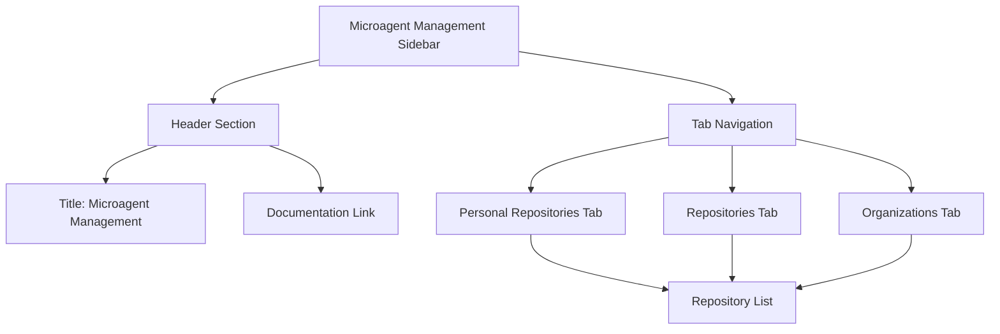
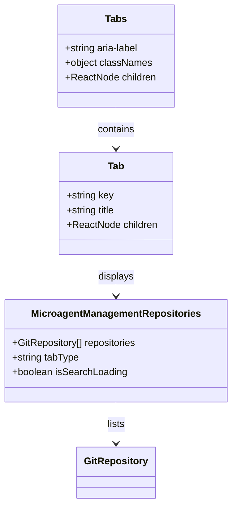
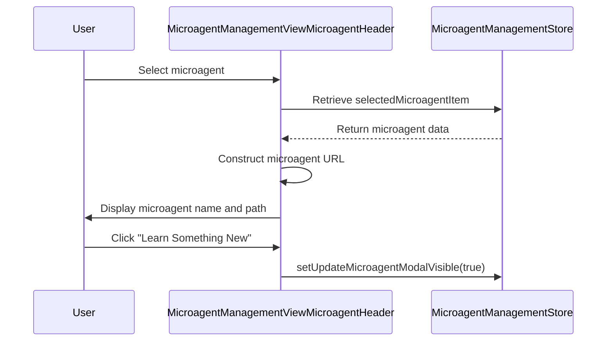
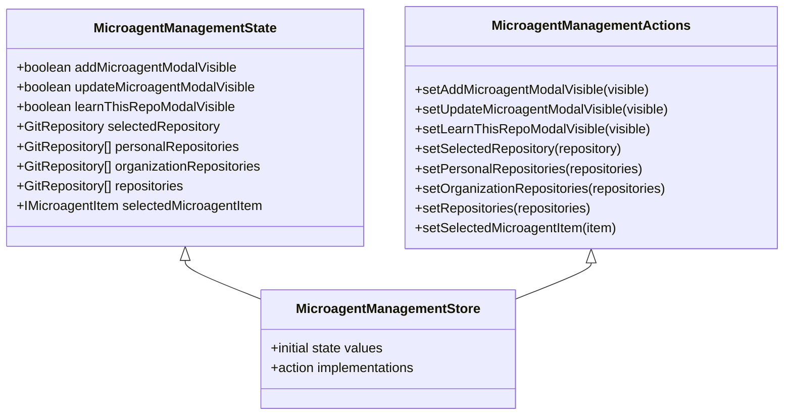
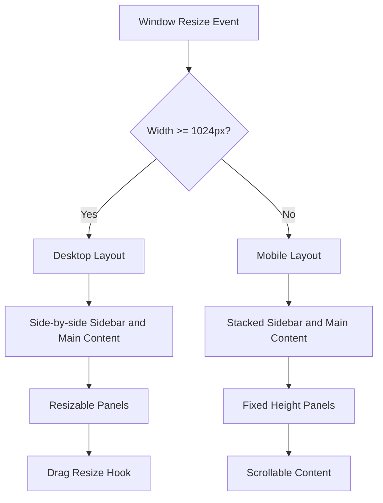
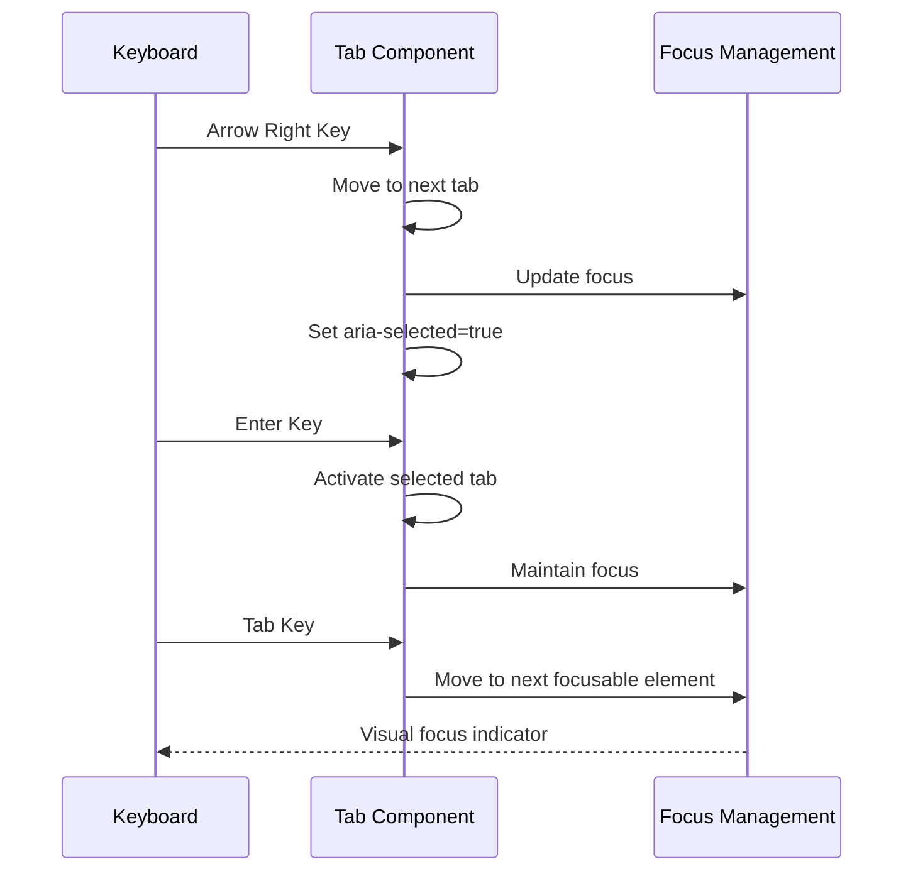

# Microagent Navigation System

<cite>
**Referenced Files in This Document**   
- [microagent-management-sidebar.tsx](file://frontend/src/components/features/microagent-management/microagent-management-sidebar.tsx)
- [microagent-management-sidebar-tabs.tsx](file://frontend/src/components/features/microagent-management/microagent-management-sidebar-tabs.tsx)
- [microagent-management-sidebar-header.tsx](file://frontend/src/components/features/microagent-management/microagent-management-sidebar-header.tsx)
- [microagent-management-view-microagent.tsx](file://frontend/src/components/features/microagent-management/microagent-management-view-microagent.tsx)
- [microagent-management-view-microagent-header.tsx](file://frontend/src/components/features/microagent-management/microagent-management-view-microagent-header.tsx)
- [microagent-management-content.tsx](file://frontend/src/components/features/microagent-management/microagent-management-content.tsx)
- [microagent-management-main.tsx](file://frontend/src/components/features/microagent-management/microagent-management-main.tsx)
- [microagent-management-repositories.tsx](file://frontend/src/components/features/microagent-management/microagent-management-repositories.tsx)
- [microagent-management-upsert-microagent-modal.tsx](file://frontend/src/components/features/microagent-management/microagent-management-upsert-microagent-modal.tsx)
- [microagent-management-learn-this-repo-modal.tsx](file://frontend/src/components/features/microagent-management/microagent-management-learn-this-repo-modal.tsx)
- [microagent-management-store.ts](file://frontend/src/state/microagent-management-store.ts)
- [root-layout.tsx](file://frontend/src/routes/root-layout.tsx)
- [microagent-management.tsx](file://frontend/src/routes/microagent-management.tsx)
- [sidebar.tsx](file://frontend/src/components/features/sidebar/sidebar.tsx)
- [microagent-management-button.tsx](file://frontend/src/components/shared/buttons/microagent-management-button.tsx)
- [Tabs.tsx](file://openhands-ui/components/tabs/Tabs.tsx)
- [TabItem.tsx](file://openhands-ui/components/tabs/components/TabItem.tsx)
- [use-drag-resize.ts](file://frontend/src/hooks/use-drag-resize.ts)
- [conversation-main.tsx](file://frontend/src/components/features/conversation/conversation-main/conversation-main.tsx)
- [mobile-layout.tsx](file://frontend/src/components/features/conversation/conversation-main/mobile-layout.tsx)
</cite>

## Table of Contents
1. [Introduction](#introduction)
2. [Sidebar Implementation](#sidebar-implementation)
3. [Tab-Based Organization](#tab-based-organization)
4. [Header Component](#header-component)
5. [State Management](#state-management)
6. [Responsive Design](#responsive-design)
7. [Accessibility Features](#accessibility-features)
8. [Conclusion](#conclusion)

## Introduction

The Microagent Navigation System provides a comprehensive interface for managing microagents within the OpenHands platform. This system enables users to organize, configure, and monitor microagents through an intuitive navigation structure. The interface consists of a sidebar for primary navigation, tab-based organization for different microagent functionalities, and a header component for system status and user information. The navigation system is designed with responsive considerations for various screen sizes and includes accessibility features for keyboard navigation.

**Section sources**
- [microagent-management-sidebar.tsx](file://frontend/src/components/features/microagent-management/microagent-management-sidebar.tsx)
- [microagent-management-content.tsx](file://frontend/src/components/features/microagent-management/microagent-management-content.tsx)

## Sidebar Implementation

The sidebar implementation serves as the primary navigation interface for microagent management operations. It is accessed through a dedicated button in the main application sidebar and provides a structured view of available repositories and microagent configurations.

The sidebar is implemented as a responsive component that adapts to different screen sizes. On desktop views, it appears as a side panel, while on mobile devices, it transforms into a stacked layout. The sidebar contains a header section with the microagent management title and a documentation link, followed by tabbed navigation for organizing repositories.

**Diagram sources**
- [microagent-management-sidebar.tsx](file://frontend/src/components/features/microagent-management/microagent-management-sidebar.tsx)
- [microagent-management-sidebar-header.tsx](file://frontend/src/components/features/microagent-management/microagent-management-sidebar-header.tsx)
- [microagent-management-sidebar-tabs.tsx](file://frontend/src/components/features/microagent-management/microagent-management-sidebar-tabs.tsx)

**Section sources**
- [microagent-management-sidebar.tsx](file://frontend/src/components/features/microagent-management/microagent-management-sidebar.tsx)
- [microagent-management-sidebar-header.tsx](file://frontend/src/components/features/microagent-management/microagent-management-sidebar-header.tsx)
- [microagent-management-sidebar-tabs.tsx](file://frontend/src/components/features/microagent-management/microagent-management-sidebar-tabs.tsx)

## Tab-Based Organization

The microagent functionality is organized through a tab-based system that categorizes repositories into three distinct sections: personal repositories, repositories, and organizations. This tabbed interface allows users to easily navigate between different repository types and manage microagents accordingly.

The tab implementation uses a custom Tabs component from the openhands-ui library, which provides accessibility features and responsive behavior. Each tab displays a list of repositories relevant to its category, enabling users to select a repository and proceed with microagent operations.

**Diagram sources**
- [microagent-management-sidebar-tabs.tsx](file://frontend/src/components/features/microagent-management/microagent-management-sidebar-tabs.tsx)
- [Tabs.tsx](file://openhands-ui/components/tabs/Tabs.tsx)
- [TabItem.tsx](file://openhands-ui/components/tabs/components/TabItem.tsx)

**Section sources**
- [microagent-management-sidebar-tabs.tsx](file://frontend/src/components/features/microagent-management/microagent-management-sidebar-tabs.tsx)
- [Tabs.tsx](file://openhands-ui/components/tabs/Tabs.tsx)
- [TabItem.tsx](file://openhands-ui/components/tabs/components/TabItem.tsx)

## Header Component

The header component within the microagent management system displays essential information about the currently selected microagent and provides access to key actions. When a microagent is selected, the header shows the microagent's name and path, along with action buttons for updating the microagent configuration.

The header implementation includes functionality to construct the microagent URL based on the selected repository and microagent path. It also handles user interactions, such as opening the update modal when the user clicks the "Learn Something New" button.

**Diagram sources**
- [microagent-management-view-microagent-header.tsx](file://frontend/src/components/features/microagent-management/microagent-management-view-microagent-header.tsx)
- [microagent-management-store.ts](file://frontend/src/state/microagent-management-store.ts)

**Section sources**
- [microagent-management-view-microagent-header.tsx](file://frontend/src/components/features/microagent-management/microagent-management-view-microagent-header.tsx)
- [microagent-management-store.ts](file://frontend/src/state/microagent-management-store.ts)

## State Management

State management for the Microagent Navigation System is implemented using Zustand, a lightweight state management solution for React applications. The system maintains state for modal visibility, repository selection, and microagent selection through a centralized store.

The microagent management store contains state variables for tracking which modal is visible (add, update, or learn), the currently selected repository, and the selected microagent item. It also provides action functions to update these state values, ensuring consistent state management across the application.

**Diagram sources**
- [microagent-management-store.ts](file://frontend/src/state/microagent-management-store.ts)

**Section sources**
- [microagent-management-store.ts](file://frontend/src/state/microagent-management-store.ts)

## Responsive Design

The Microagent Navigation System incorporates responsive design principles to ensure optimal user experience across different screen sizes. The system adapts its layout based on the viewport width, providing appropriate interfaces for both desktop and mobile devices.

On desktop views (width ≥ 1024px), the interface displays the sidebar and main content panel side by side, maximizing screen real estate. On mobile devices (width < 1024px), the layout transforms into a stacked design with the sidebar and main content panel displayed as separate sections.

The responsive behavior is implemented through a combination of CSS media queries and JavaScript logic that detects window size changes. The system also includes a drag resize hook that enables users to manually adjust panel sizes on larger screens.

**Diagram sources**
- [microagent-management-content.tsx](file://frontend/src/components/features/microagent-management/microagent-management-content.tsx)
- [use-drag-resize.ts](file://frontend/src/hooks/use-drag-resize.ts)
- [conversation-main.tsx](file://frontend/src/components/features/conversation/conversation-main/conversation-main.tsx)
- [mobile-layout.tsx](file://frontend/src/components/features/conversation/conversation-main/mobile-layout.tsx)

**Section sources**
- [microagent-management-content.tsx](file://frontend/src/components/features/microagent-management/microagent-management-content.tsx)
- [use-drag-resize.ts](file://frontend/src/hooks/use-drag-resize.ts)
- [conversation-main.tsx](file://frontend/src/components/features/conversation/conversation-main/conversation-main.tsx)
- [mobile-layout.tsx](file://frontend/src/components/features/conversation/conversation-main/mobile-layout.tsx)

## Accessibility Features

The Microagent Navigation System includes several accessibility features to support keyboard navigation and ensure compliance with accessibility standards. The tabbed interface implements proper ARIA attributes, including role="tablist", role="tab", and aria-selected to indicate the active tab.

Each tab button includes keyboard event handling to allow navigation using arrow keys, Enter, and Space keys. The system also implements focus management to ensure that keyboard focus is properly maintained within interactive elements.

The sidebar navigation is accessible through keyboard shortcuts, and all interactive elements have appropriate focus states. The system also includes screen reader support through descriptive labels and semantic HTML structure.

**Diagram sources**
- [Tabs.tsx](file://openhands-ui/components/tabs/Tabs.tsx)
- [TabItem.tsx](file://openhands-ui/components/tabs/components/TabItem.tsx)

**Section sources**
- [Tabs.tsx](file://openhands-ui/components/tabs/Tabs.tsx)
- [TabItem.tsx](file://openhands-ui/components/tabs/components/TabItem.tsx)

## Conclusion

The Microagent Navigation System provides a comprehensive and user-friendly interface for managing microagents within the OpenHands platform. Through its well-structured sidebar implementation, tab-based organization, and responsive design, the system enables efficient navigation and management of microagent operations.

The system's state management approach using Zustand ensures consistent state across components, while accessibility features support keyboard navigation and screen reader compatibility. The responsive design adapts to different screen sizes, providing an optimal user experience on both desktop and mobile devices.

Overall, the Microagent Navigation System demonstrates a thoughtful approach to user interface design, balancing functionality with usability and accessibility considerations.