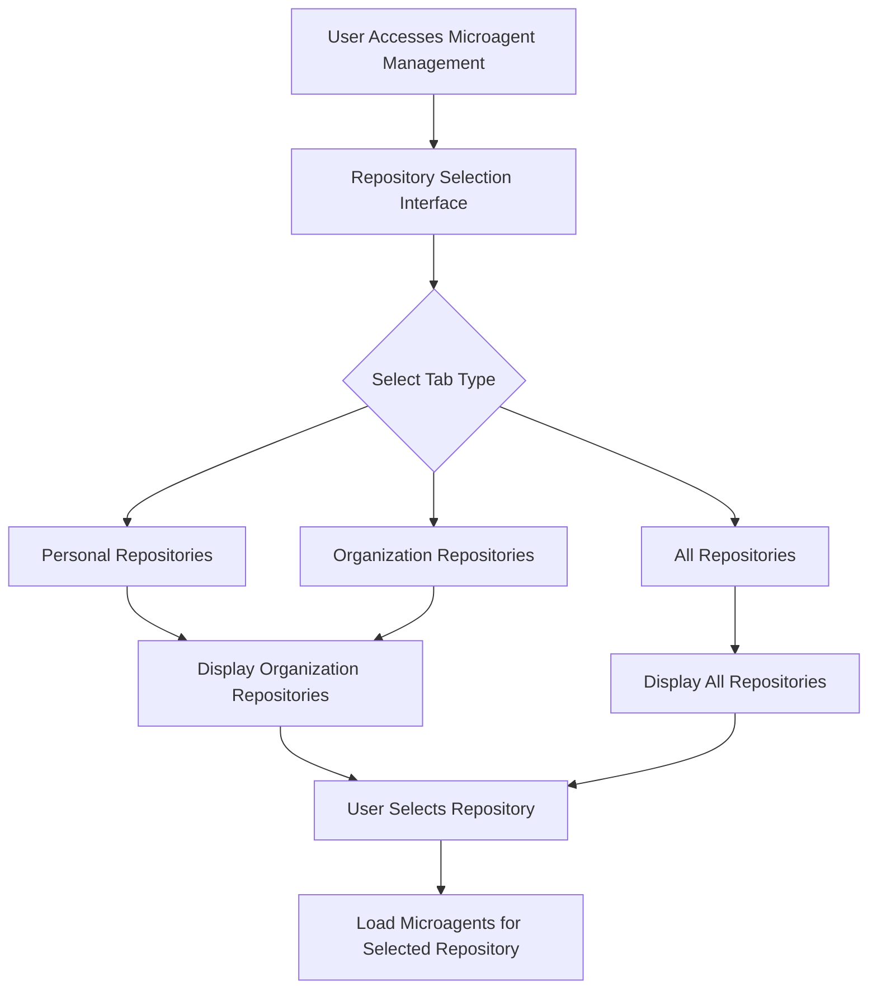
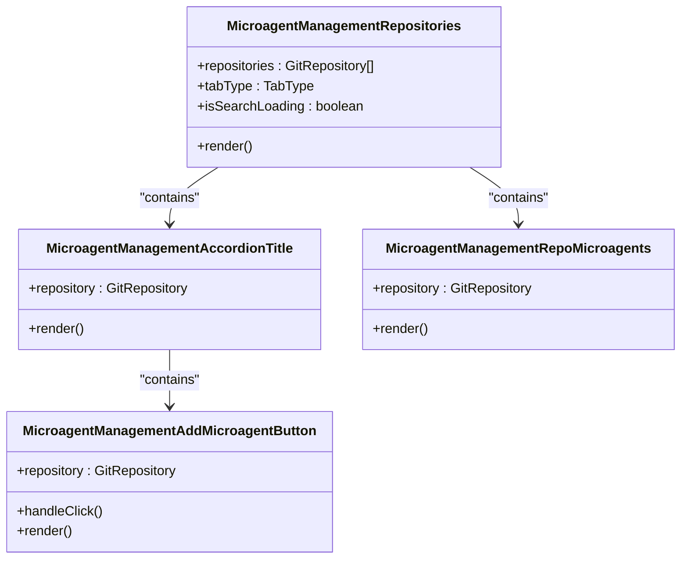
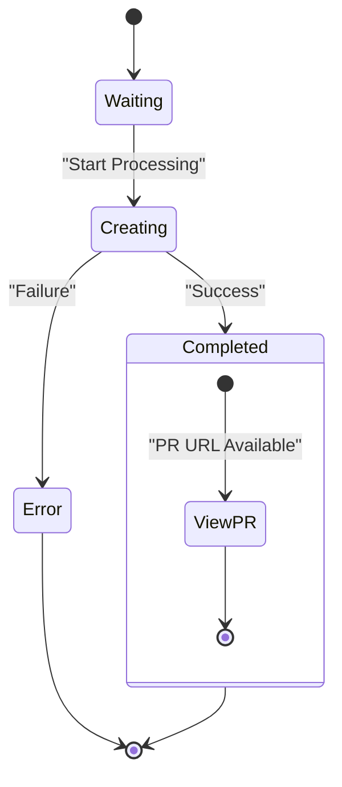
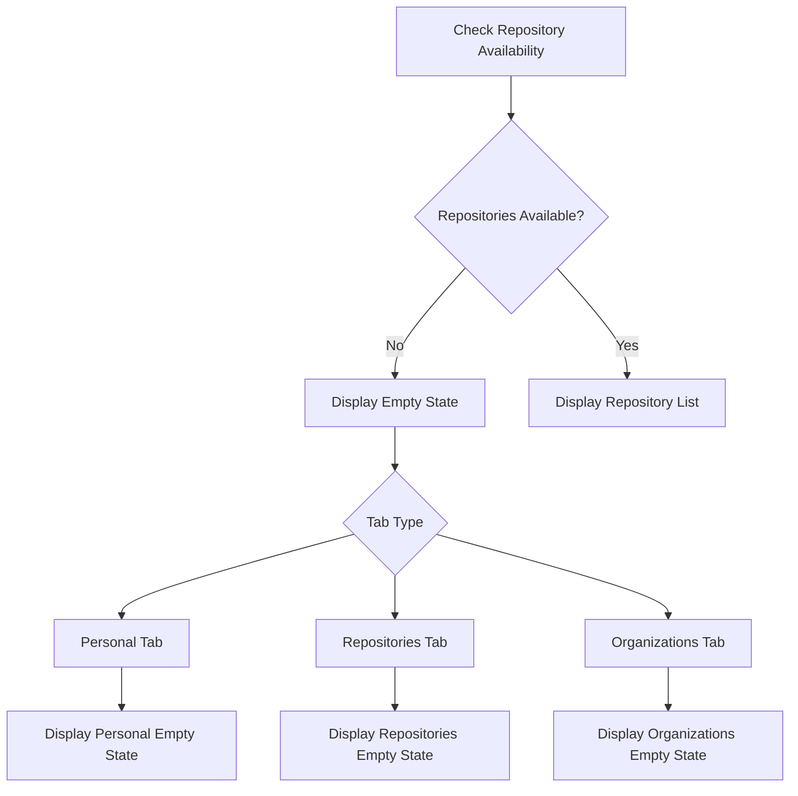
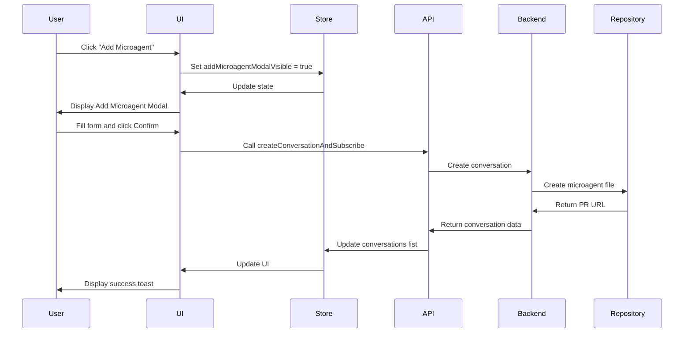
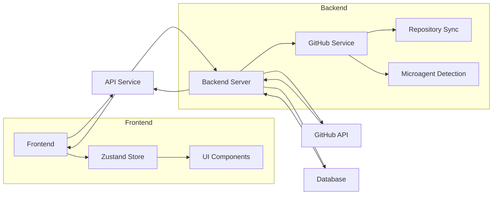
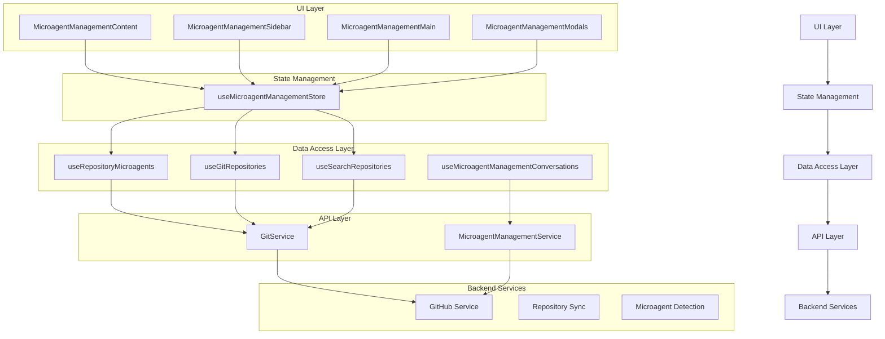

# Repository Microagent Management

<cite>
**Referenced Files in This Document**   
- [microagent-management-store.ts](file://frontend/src/state/microagent-management-store.ts)
- [microagent-management-sidebar.tsx](file://frontend/src/components/features/microagent-management/microagent-management-sidebar.tsx)
- [microagent-management-repositories.tsx](file://frontend/src/components/features/microagent-management/microagent-management-repositories.tsx)
- [microagent-management-repo-microagents.tsx](file://frontend/src/components/features/microagent-management/microagent-management-repo-microagents.tsx)
- [microagent-management-microagent-card.tsx](file://frontend/src/components/features/microagent-management/microagent-management-microagent-card.tsx)
- [microagent-management-add-microagent-button.tsx](file://frontend/src/components/features/microagent-management/microagent-management-add-microagent-button.tsx)
- [microagent-management-learn-this-repo.tsx](file://frontend/src/components/features/microagent-management/microagent-management-learn-this-repo.tsx)
- [microagent-management-no-repositories.tsx](file://frontend/src/components/features/microagent-management/microagent-management-no-repositories.tsx)
- [microagent-management-view-microagent.tsx](file://frontend/src/components/features/microagent-management/microagent-management-view-microagent.tsx)
- [microagent-management-main.tsx](file://frontend/src/components/features/microagent-management/microagent-management-main.tsx)
- [microagent-status-indicator.tsx](file://frontend/src/components/features/chat/microagent/microagent-status-indicator.tsx)
- [use-repository-microagents.ts](file://frontend/src/hooks/query/use-repository-microagents.ts)
- [use-git-repositories.ts](file://frontend/src/hooks/query/use-git-repositories.ts)
- [use-search-repositories.ts](file://frontend/src/hooks/query/use-search-repositories.ts)
- [git-service.api.ts](file://frontend/src/api/git-service/git-service.api.ts)
- [microagent-management-service.api.ts](file://frontend/src/ui/microagent-management-service/microagent-management-service.api.ts)
- [microagent-management.tsx](file://frontend/src/routes/microagent-management.tsx)
- [microagent-management-content.tsx](file://frontend/src/components/features/microagent-management/microagent-management-content.tsx)
- [microagent-management-upsert-microagent-modal.tsx](file://frontend/src/components/features/microagent-management/microagent-management-upsert-microagent-modal.tsx)
- [microagent-management-learn-this-repo-modal.tsx](file://frontend/src/components/features/microagent-management/microagent-management-learn-this-repo-modal.tsx)
- [microagent-status.ts](file://frontend/src/types/microagent-status.ts)
- [microagent-management.tsx](file://frontend/src/types/microagent-management.tsx)
- [github_service.py](file://enterprise/integrations/github/github_service.py)
</cite>

## Table of Contents
1. [Introduction](#introduction)
2. [Repository Selection Mechanism](#repository-selection-mechanism)
3. [Microagent Interface Implementation](#microagent-interface-implementation)
4. [Visual Representation of Microagent Status](#visual-representation-of-microagent-status)
5. [Empty State Handling](#empty-state-handling)
6. [Interaction Patterns for Managing Microagents](#interaction-patterns-for-managing-microagents)
7. [Backend Data Synchronization](#backend-data-synchronization)
8. [Architecture Overview](#architecture-overview)

## Introduction

The Repository Microagent Management system provides a comprehensive interface for managing microagents associated with specific repositories. This documentation details the implementation of the repository-focused microagent interface, including the repository selection mechanism, filtering logic, visual representation of microagent status and activity, empty state handling, and interaction patterns for managing multiple microagents across different repositories.

The system enables users to view, create, update, and manage microagents for their repositories, with a focus on providing clear visual feedback about the status of each microagent. The interface is designed to handle various states including loading, error conditions, and empty states when no repositories are available.

**Section sources**
- [microagent-management-store.ts](file://frontend/src/state/microagent-management-store.ts#L1-L76)
- [microagent-management-content.tsx](file://frontend/src/components/features/microagent-management/microagent-management-content.tsx#L1-L350)
- [microagent-management.tsx](file://frontend/src/routes/microagent-management.tsx#L1-L28)

## Repository Selection Mechanism

The repository selection mechanism in the Repository Microagent Management system provides a comprehensive way for users to browse and select repositories across different providers and organizational contexts. The system implements a tabbed interface that categorizes repositories into three distinct types: personal, repositories, and organizations.

The selection process begins with the `MicroagentManagementSidebar` component, which renders a tabbed interface allowing users to switch between different repository categories. Each tab displays repositories from the corresponding category, with the personal tab showing repositories owned by the user, the repositories tab showing all accessible repositories, and the organizations tab showing repositories from organizations the user is part of.

**Diagram sources**
- [microagent-management-sidebar.tsx](file://frontend/src/components/features/microagent-management/microagent-management-sidebar.tsx#L1-L162)
- [microagent-management-sidebar-tabs.tsx](file://frontend/src/components/features/microagent-management/microagent-management-sidebar-tabs.tsx#L1-L57)

The system supports both paginated loading and server-side search functionality. When a user selects a provider, the system fetches repositories in pages of 30 items to support infinite scrolling. For search functionality, the system performs server-side searches with a larger page size of 500 to retrieve all matching results, which are then filtered client-side for exact matches.

The repository selection state is managed through the `useMicroagentManagementStore` Zustand store, which maintains the currently selected repository and updates it when a user selects a different repository. This store also manages the state for personal, organization, and other repositories, ensuring that the UI reflects the current selection context.

**Section sources**
- [microagent-management-sidebar.tsx](file://frontend/src/components/features/microagent-management/microagent-management-sidebar.tsx#L1-L162)
- [microagent-management-store.ts](file://frontend/src/state/microagent-management-store.ts#L1-L76)
- [use-git-repositories.ts](file://frontend/src/hooks/query/use-git-repositories.ts#L1-L57)
- [use-search-repositories.ts](file://frontend/src/hooks/query/use-search-repositories.ts#L1-L23)

## Microagent Interface Implementation

The microagent interface implementation provides a structured way to display all microagents associated with specific repositories. The system uses an accordion-based design to organize repositories and their associated microagents, with each repository represented as an accordion item that can be expanded to view its microagents.

The core component of the interface is the `MicroagentManagementRepositories` component, which renders the accordion structure containing all repositories. Each repository is displayed with its name and a Git provider icon, and includes an "Add Microagent" button that allows users to create new microagents for that repository.

**Diagram sources**
- [microagent-management-repositories.tsx](file://frontend/src/components/features/microagent-management/microagent-management-repositories.tsx#L1-L99)
- [microagent-management-accordion-title.tsx](file://frontend/src/components/features/microagent-management/microagent-management-accordion-title.tsx#L1-L30)
- [microagent-management-add-microagent-button.tsx](file://frontend/src/components/features/microagent-management/microagent-management-add-microagent-button.tsx#L1-L39)
- [microagent-management-repo-microagents.tsx](file://frontend/src/components/features/microagent-management/microagent-management-repo-microagents.tsx#L1-L146)

The `MicroagentManagementRepoMicroagents` component is responsible for displaying the microagents and in-progress conversations for a specific repository. It fetches two types of data: existing microagents (stored as markdown files in the repository) and in-progress conversations (microagents being created or updated). These are displayed in separate sections labeled "Existing Microagents" and "In Progress" respectively.

Each microagent or conversation is represented by a `MicroagentManagementMicroagentCard` component, which displays the microagent name, path, and status. Clicking on a card selects that microagent or conversation, updating the main content area to show detailed information about the selected item.

The interface also includes a "Learn This Repo" feature, which appears when a repository has no microagents. This feature allows users to initiate a conversation to help them understand the repository structure and potentially create microagents based on that understanding.

**Section sources**
- [microagent-management-repositories.tsx](file://frontend/src/components/features/microagent-management/microagent-management-repositories.tsx#L1-L99)
- [microagent-management-repo-microagents.tsx](file://frontend/src/components/features/microagent-management/microagent-management-repo-microagents.tsx#L1-L146)
- [microagent-management-microagent-card.tsx](file://frontend/src/components/features/microagent-management/microagent-management-microagent-card.tsx#L1-L119)
- [microagent-management-learn-this-repo.tsx](file://frontend/src/components/features/microagent-management/microagent-management-learn-this-repo.tsx#L1-L34)

## Visual Representation of Microagent Status

The system provides a comprehensive visual representation of microagent status and activity through multiple components and status indicators. The status system is designed to provide clear feedback about the current state of microagents, whether they are existing microagents or in-progress conversations.

The primary status indicator is implemented in the `MicroagentStatusIndicator` component, which displays different text and visual states based on the microagent's current status. The system defines four main status states:

- **Waiting**: The microagent is queued and waiting to be processed
- **Creating**: The microagent is being created or updated
- **Completed**: The microagent creation is complete, with an optional PR URL for viewing
- **Error**: An error occurred during microagent creation or update

**Diagram sources**
- [microagent-status-indicator.tsx](file://frontend/src/components/features/chat/microagent/microagent-status-indicator.tsx#L1-L37)
- [microagent-status-wrapper.tsx](file://frontend/src/components/features/chat/event-message-components/microagent-status-wrapper.tsx#L1-L33)
- [microagent-status.ts](file://frontend/src/types/microagent-status.ts#L1-L13)

The status is visually represented in multiple places within the interface. In the microagent card, the status appears as a colored badge above the microagent name. The color and text of the badge change based on the current status:

- **Ready for Review**: Displayed when a PR has been created (green badge)
- **Starting**: Displayed when the conversation or runtime is starting (yellow badge)
- **Stopped**: Displayed when the conversation or runtime has stopped (gray badge)
- **Error**: Displayed when an error occurs (red badge)
- **Opening PR**: Displayed when the system is creating a PR (blue badge)

The status text is localized using the i18n system, ensuring that status messages are displayed in the user's preferred language. The system also provides special handling for completed microagents that have an associated PR URL, displaying "View your PR" instead of the generic "Completed" message to encourage users to review their changes.

In the main content area, when a microagent is selected, additional status information is displayed, including the microagent name and path. The system also provides toast notifications for key events such as when a PR is being opened or when an error occurs during microagent creation.

**Section sources**
- [microagent-status-indicator.tsx](file://frontend/src/components/features/chat/microagent/microagent-status-indicator.tsx#L1-L37)
- [microagent-management-microagent-card.tsx](file://frontend/src/components/features/microagent-management/microagent-management-microagent-card.tsx#L1-L119)
- [microagent-management-content.tsx](file://frontend/src/components/features/microagent-management/microagent-management-content.tsx#L1-L350)

## Empty State Handling

The system implements comprehensive empty state handling to provide a helpful user experience when no repositories or microagents are available. The empty state system is designed to guide users through the process of setting up microagents and understanding the repository structure.

When no repositories are available, the system displays the `MicroagentManagementNoRepositories` component, which shows a message specific to the current tab type (personal, repositories, or organizations). Each message includes a link to relevant documentation to help users understand how to set up microagents.

**Diagram sources**
- [microagent-management-no-repositories.tsx](file://frontend/src/components/features/microagent-management/microagent-management-no-repositories.tsx#L1-L22)
- [microagent-management-repositories.tsx](file://frontend/src/components/features/microagent-management/microagent-management-repositories.tsx#L1-L99)

For repositories that exist but have no microagents, the system displays the `MicroagentManagementLearnThisRepo` component, which prompts the user to "Learn This Repo". This component serves as both an empty state indicator and a call-to-action, encouraging users to explore their repository and potentially create microagents.

The empty state handling also includes loading states, with a spinner displayed when repositories or microagents are being fetched. This provides visual feedback during data retrieval operations, preventing confusion about whether the system is working or if there are genuinely no items to display.

The system differentiates between different types of empty states:
- No repositories available across all providers
- No repositories available for a specific provider
- No microagents for a specific repository
- Error states when fetching repositories or microagents

Each of these states has appropriate messaging and guidance to help users understand the current situation and take appropriate actions.

**Section sources**
- [microagent-management-no-repositories.tsx](file://frontend/src/components/features/microagent-management/microagent-management-no-repositories.tsx#L1-L22)
- [microagent-management-repositories.tsx](file://frontend/src/components/features/microagent-management/microagent-management-repositories.tsx#L1-L99)
- [microagent-management-learn-this-repo.tsx](file://frontend/src/components/features/microagent-management/microagent-management-learn-this-repo.tsx#L1-L34)

## Interaction Patterns for Managing Microagents

The system implements several interaction patterns for managing microagents across different repositories. These patterns are designed to be intuitive and consistent, allowing users to create, update, and manage microagents efficiently.

The primary interaction pattern is the modal-based workflow for creating and updating microagents. When a user clicks the "Add Microagent" button on a repository, a modal appears allowing them to specify the microagent details, including the task description and triggers. Similarly, when updating an existing microagent, a modal pre-populated with the current microagent content appears.

**Diagram sources**
- [microagent-management-upsert-microagent-modal.tsx](file://frontend/src/components/features/microagent-management/microagent-management-upsert-microagent-modal.tsx#L1-L77)
- [microagent-management-content.tsx](file://frontend/src/components/features/microagent-management/microagent-management-content.tsx#L1-L350)
- [microagent-management-store.ts](file://frontend/src/state/microagent-management-store.ts#L1-L76)

The system uses a store pattern with Zustand to manage the state of microagent management. The `useMicroagentManagementStore` hook provides a centralized state management solution that tracks:
- The currently selected repository
- The list of personal, organization, and other repositories
- The currently selected microagent or conversation
- The visibility state of various modals (add, update, learn this repo)

When a user selects a microagent or conversation, the system updates the `selectedMicroagentItem` in the store, which triggers a re-render of the main content area to display detailed information about the selected item. This pattern ensures that the UI remains synchronized with the current selection state.

The system also implements a conversation subscription pattern, where users can subscribe to real-time updates for microagent creation processes. This allows the UI to update automatically as the microagent creation progresses, showing status changes from "Starting" to "Opening PR" to "Ready for Review" as appropriate.

For managing multiple microagents across different repositories, the system uses a tabbed interface that allows users to switch between personal, all, and organization repositories. This pattern enables users to organize their microagents by context and easily navigate between different sets of repositories.

**Section sources**
- [microagent-management-upsert-microagent-modal.tsx](file://frontend/src/components/features/microagent-management/microagent-management-upsert-microagent-modal.tsx#L1-L77)
- [microagent-management-learn-this-repo-modal.tsx](file://frontend/src/components/features/microagent-management/microagent-management-learn-this-repo-modal.tsx#L1-L52)
- [microagent-management-content.tsx](file://frontend/src/components/features/microagent-management/microagent-management-content.tsx#L1-L350)
- [microagent-management-store.ts](file://frontend/src/state/microagent-management-store.ts#L1-L76)

## Backend Data Synchronization

The system implements a robust backend data synchronization mechanism to ensure that the frontend UI remains up-to-date with the latest repository and microagent information. The synchronization process involves multiple API endpoints and data fetching strategies to provide a responsive and accurate user experience.

The primary data synchronization occurs through several key API endpoints:

- **Repository listing**: `/api/user/repositories` - Retrieves paginated lists of repositories for a specific provider and installation
- **Microagents listing**: `/api/user/repository/{owner}/{repo}/microagents` - Retrieves the list of microagents for a specific repository
- **Microagent content**: `/api/user/repository/{owner}/{repo}/microagents/content` - Retrieves the content of a specific microagent file
- **Conversations listing**: `/api/microagent-management/conversations` - Retrieves in-progress conversations for microagent management

**Diagram sources**
- [git-service.api.ts](file://frontend/src/api/git-service/git-service.api.ts#L71-L205)
- [microagent-management-service.api.ts](file://frontend/src/ui/microagent-management-service/microagent-management-service.api.ts#L1-L34)
- [github_service.py](file://enterprise/integrations/github/github_service.py#L112-L143)

The system uses React Query for data fetching and caching, with configured stale times of 5 minutes and garbage collection times of 15 minutes. This ensures that data is refreshed periodically while maintaining good performance by avoiding unnecessary network requests.

When a user performs actions that modify data (such as creating a new microagent), the system uses mutation queries with success callbacks that invalidate the relevant query caches. This triggers automatic refetching of the updated data, ensuring that the UI reflects the latest state.

The backend implementation includes background tasks to store repository information in the database whenever repositories are fetched. This is implemented in the `github_service.py` file, where the `get_paginated_repos` and `get_all_repositories` methods create asynchronous tasks to store repository data, ensuring that repository information is persisted and available for future queries.

The synchronization process also includes error handling and retry mechanisms. If a data fetch fails, the system displays appropriate error states and provides options for retrying the operation. The system also handles network interruptions gracefully, maintaining the current state until connectivity is restored.

**Section sources**
- [git-service.api.ts](file://frontend/src/api/git-service/git-service.api.ts#L71-L205)
- [microagent-management-service.api.ts](file://frontend/src/ui/microagent-management-service/microagent-management-service.api.ts#L1-L34)
- [use-repository-microagents.ts](file://frontend/src/hooks/query/use-repository-microagents.ts#L1-L15)
- [use-git-repositories.ts](file://frontend/src/hooks/query/use-git-repositories.ts#L1-L57)
- [github_service.py](file://enterprise/integrations/github/github_service.py#L112-L143)

## Architecture Overview

The Repository Microagent Management system follows a clean architectural pattern with well-defined layers and components. The architecture is designed to separate concerns, promote reusability, and ensure maintainability.

**Diagram sources**
- [microagent-management-content.tsx](file://frontend/src/components/features/microagent-management/microagent-management-content.tsx#L1-L350)
- [microagent-management-store.ts](file://frontend/src/state/microagent-management-store.ts#L1-L76)
- [use-repository-microagents.ts](file://frontend/src/hooks/query/use-repository-microagents.ts#L1-L15)
- [use-git-repositories.ts](file://frontend/src/hooks/query/use-git-repositories.ts#L1-L57)
- [git-service.api.ts](file://frontend/src/api/git-service/git-service.api.ts#L71-L205)
- [microagent-management-service.api.ts](file://frontend/src/ui/microagent-management-service/microagent-management-service.api.ts#L1-L34)

The architecture follows a unidirectional data flow pattern, where user interactions trigger state changes that propagate through the system and result in UI updates. The state management layer (Zustand store) acts as the single source of truth for microagent management state, ensuring consistency across different components.

The data access layer uses React Query hooks to abstract data fetching operations, providing a consistent interface for retrieving repositories, microagents, and conversations. These hooks handle loading states, error states, and caching automatically, reducing the complexity in the UI components.

The API layer provides a thin wrapper around HTTP requests, with dedicated service classes for different API endpoints. This separation allows for easy testing and mocking of API interactions.

The backend services handle the business logic for repository synchronization and microagent detection, interfacing with external APIs like GitHub and internal database storage.

This architectural approach ensures that the system is modular, testable, and maintainable, with clear boundaries between different concerns and responsibilities.

**Section sources**
- [microagent-management-content.tsx](file://frontend/src/components/features/microagent-management/microagent-management-content.tsx#L1-L350)
- [microagent-management-store.ts](file://frontend/src/state/microagent-management-store.ts#L1-L76)
- [use-repository-microagents.ts](file://frontend/src/hooks/query/use-repository-microagents.ts#L1-L15)
- [use-git-repositories.ts](file://frontend/src/hooks/query/use-git-repositories.ts#L1-L57)
- [git-service.api.ts](file://frontend/src/api/git-service/git-service.api.ts#L71-L205)
- [microagent-management-service.api.ts](file://frontend/src/ui/microagent-management-service/microagent-management-service.api.ts#L1-L34)