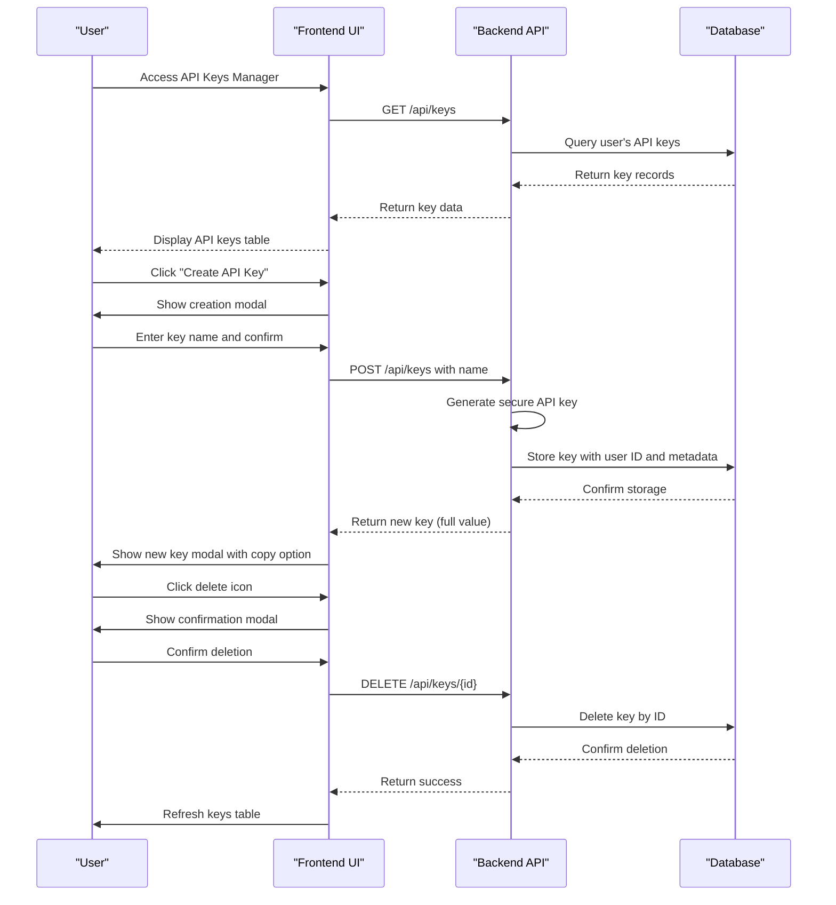
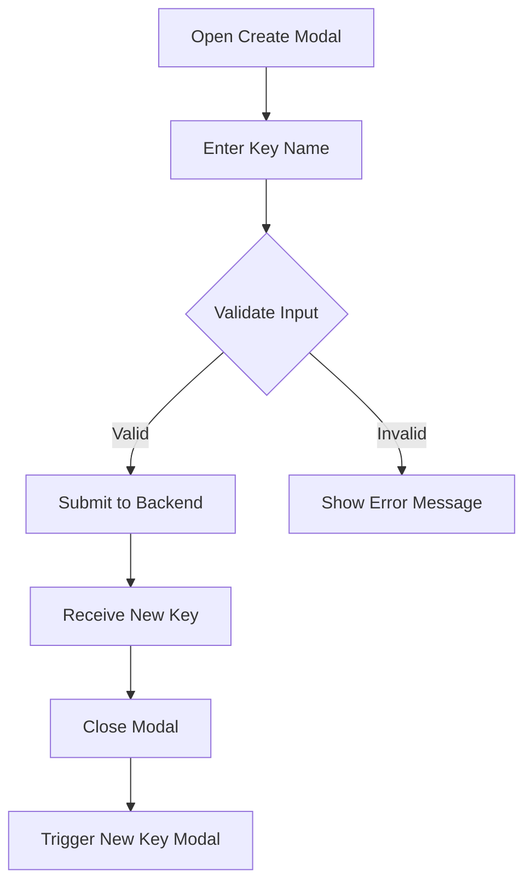
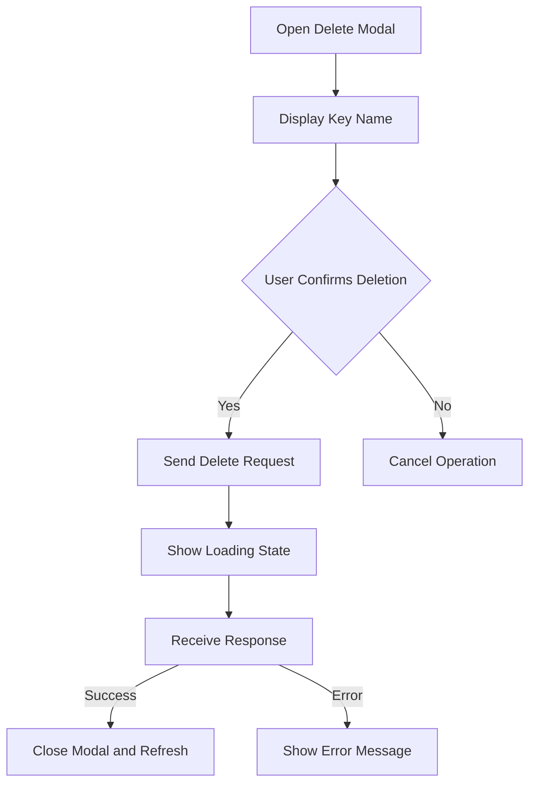
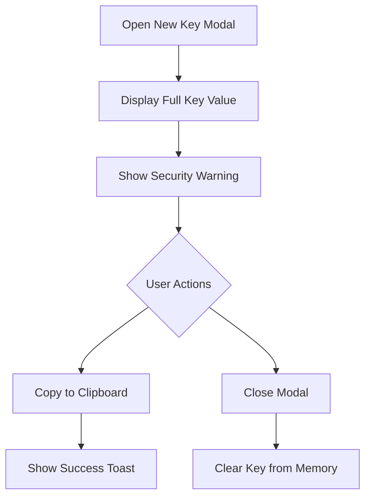
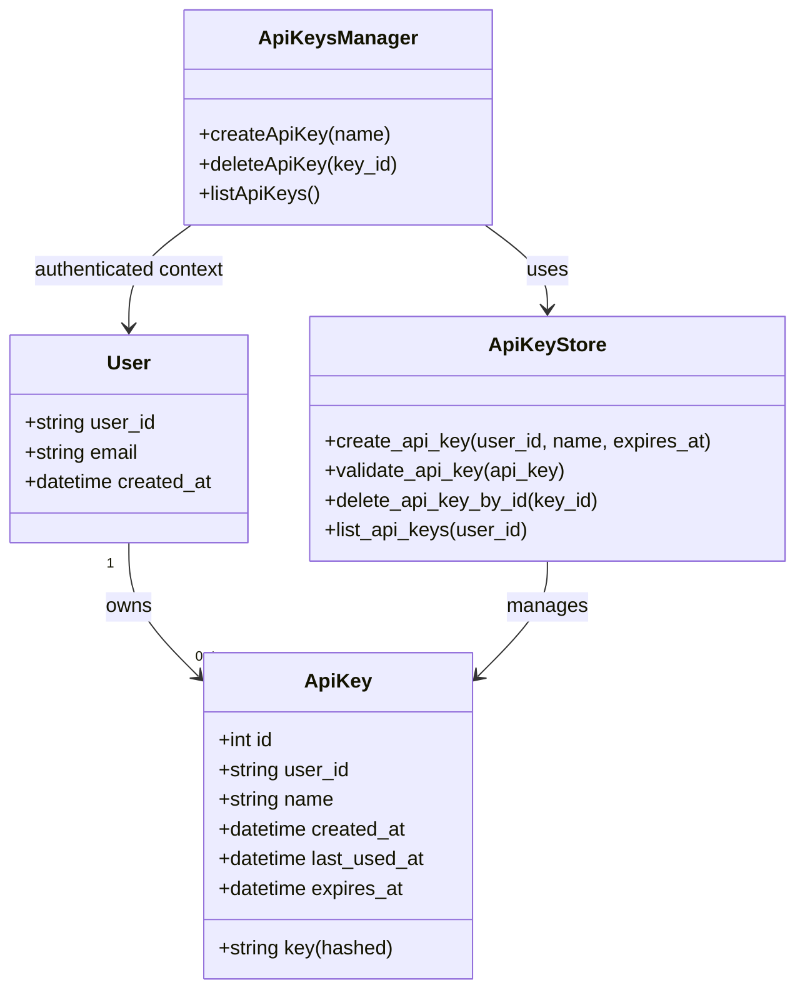
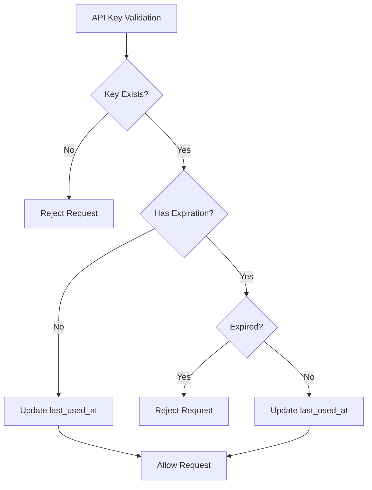
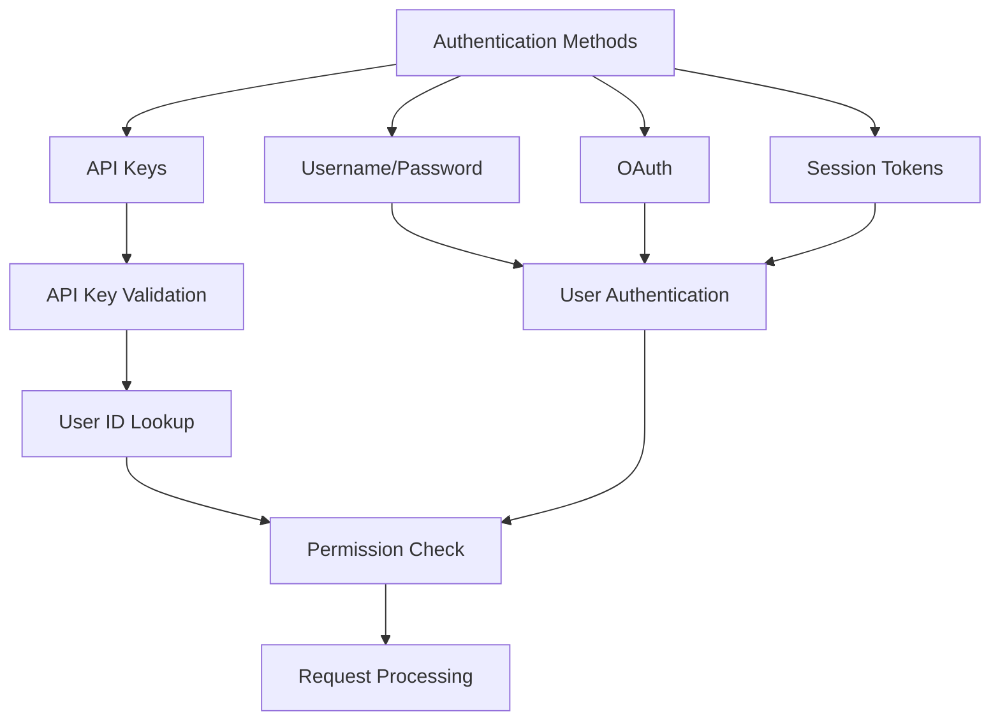

# API Keys Manager

<cite>
**Referenced Files in This Document**   
- [api_keys.py](file://frontend/src/api/api-keys.ts)
- [api-keys-manager.tsx](file://frontend/src/components/features/settings/api-keys-manager.tsx)
- [create-api-key-modal.tsx](file://frontend/src/components/features/settings/create-api-key-modal.tsx)
- [delete-api-key-modal.tsx](file://frontend/src/components/features/settings/delete-api-key-modal.tsx)
- [new-api-key-modal.tsx](file://frontend/src/components/features/settings/new-api-key-modal.tsx)
- [use-api-keys.ts](file://frontend/src/hooks/query/use-api-keys.ts)
- [use-create-api-key.ts](file://frontend/src/hooks/mutation/use-create-api-key.ts)
- [use-delete-api-key.ts](file://frontend/src/hooks/mutation/use-delete-api-key.ts)
- [api_key.py](file://enterprise/storage/api_key.py)
- [api_key_store.py](file://enterprise/storage/api_key_store.py)
- [test_api_key_store.py](file://enterprise/tests/unit/test_api_key_store.py)
- [api_keys.py](file://enterprise/server/routes/api_keys.py)
- [middleware.py](file://enterprise/server/middleware.py)
</cite>

## Table of Contents
1. [Introduction](#introduction)
2. [API Key Management Workflow](#api-key-management-workflow)
3. [Modal Components](#modal-components)
4. [Permission Model and Access Control](#permission-model-and-access-control)
5. [Key Rotation and Expiration Policies](#key-rotation-and-expiration-policies)
6. [Audit Logging](#audit-logging)
7. [API Key Usage for Programmatic Access](#api-key-usage-for-programmatic-access)
8. [Relationship to User Authentication and Authorization](#relationship-to-user-authentication-and-authorization)
9. [Security Considerations](#security-considerations)

## Introduction
The API Keys Manager component provides a comprehensive system for managing API keys within the OpenHands platform. This documentation details the complete workflow for creating, viewing, and deleting API keys, along with the implementation of modal components, permission model, key rotation policies, and security considerations. The system enables users to generate API keys for programmatic access to platform services while maintaining robust security controls and audit capabilities.

**Section sources**
- [api-keys-manager.tsx](file://frontend/src/components/features/settings/api-keys-manager.tsx#L208-L320)

## API Key Management Workflow
The API Key Management Workflow consists of three primary operations: creation, viewing, and deletion of API keys. The workflow is implemented through a combination of frontend components and backend API endpoints that interact with the database to manage API key records.

The process begins with the user accessing the API Keys Manager interface, where they can view existing keys and initiate the creation of new ones. When creating a new API key, the user provides a descriptive name, which is then sent to the backend service. The backend generates a cryptographically secure random key and stores it in the database with the associated user ID, name, creation timestamp, and optional expiration date.

For viewing API keys, the system retrieves all keys associated with the authenticated user from the database and displays them in a table format showing the key name, creation date, and last used date. The deletion process requires user confirmation through a modal dialog before permanently removing the key from the database.

**Diagram sources**
- [api_keys.py](file://enterprise/server/routes/api_keys.py#L177-L272)
- [api_key_store.py](file://enterprise/storage/api_key_store.py#L25-L47)
- [api-keys-manager.tsx](file://frontend/src/components/features/settings/api-keys-manager.tsx#L208-L320)

**Section sources**
- [api_keys.py](file://enterprise/server/routes/api_keys.py#L177-L272)
- [api_key_store.py](file://enterprise/storage/api_key_store.py#L25-L85)
- [api-keys-manager.tsx](file://frontend/src/components/features/settings/api-keys-manager.tsx#L208-L320)

## Modal Components
The API Keys Manager implements three specialized modal components to handle different aspects of API key operations: creation, deletion, and display of newly created keys. These modals provide a focused user interface for each operation while maintaining consistency in design and interaction patterns.

### Create API Key Modal
The Create API Key Modal allows users to generate new API keys by providing a descriptive name. The modal includes input validation to ensure the name is not empty before submission. Upon successful creation, the modal closes and triggers the display of the New API Key Modal to show the generated key value.

**Diagram sources**
- [create-api-key-modal.tsx](file://frontend/src/components/features/settings/create-api-key-modal.tsx#L21-L101)
- [use-create-api-key.ts](file://frontend/src/hooks/mutation/use-create-api-key.ts#L5-L15)

**Section sources**
- [create-api-key-modal.tsx](file://frontend/src/components/features/settings/create-api-key-modal.tsx#L21-L101)

### Delete API Key Modal
The Delete API Key Modal provides a confirmation interface before permanently removing an API key. It displays the name of the key to be deleted and requires explicit user confirmation to prevent accidental deletions. The modal includes appropriate loading states during the deletion process and provides feedback upon completion.

**Diagram sources**
- [delete-api-key-modal.tsx](file://frontend/src/components/features/settings/delete-api-key-modal.tsx#L20-L84)
- [use-delete-api-key.ts](file://frontend/src/hooks/mutation/use-delete-api-key.ts#L5-L16)

**Section sources**
- [delete-api-key-modal.tsx](file://frontend/src/components/features/settings/delete-api-key-modal.tsx#L20-L84)

### New API Key Modal
The New API Key Modal displays the full value of a newly created API key, which is only shown once immediately after creation. This modal emphasizes security by providing a copy-to-clipboard function and includes a warning about the importance of securely storing the key. The key value is never displayed again after this modal is closed.

**Diagram sources**
- [new-api-key-modal.tsx](file://frontend/src/components/features/settings/new-api-key-modal.tsx#L15-L61)

**Section sources**
- [new-api-key-modal.tsx](file://frontend/src/components/features/settings/new-api-key-modal.tsx#L15-L61)

## Permission Model and Access Control
The API Keys Manager implements a robust permission model that ensures users can only manage their own API keys. The access control system is enforced at both the frontend and backend levels, with the backend serving as the authoritative source of truth for authorization decisions.

The permission model follows a user-isolation pattern where each API key is associated with a specific user ID. When performing operations on API keys, the system verifies that the requesting user owns the key being accessed. This prevents users from viewing, modifying, or deleting API keys belonging to other users, even if they know the key ID.

At the backend level, the `get_user_id` dependency ensures that all API key operations are performed in the context of an authenticated user. Before any operation is executed, the system validates that the user has the necessary permissions by checking the ownership of the API key. For example, when deleting a key, the system first verifies that the key belongs to the authenticated user before proceeding with the deletion.

The frontend also implements permission controls by only displaying API keys that belong to the currently logged-in user. The UI components are designed to prevent users from even attempting operations on keys they don't own, providing both security and a better user experience.

**Diagram sources**
- [api_keys.py](file://enterprise/server/routes/api_keys.py#L177-L272)
- [api_key_store.py](file://enterprise/storage/api_key_store.py#L17-L132)
- [api_key.py](file://enterprise/storage/api_key.py#L5-L20)

**Section sources**
- [api_keys.py](file://enterprise/server/routes/api_keys.py#L177-L272)
- [middleware.py](file://enterprise/server/middleware.py#L99-L134)

## Key Rotation and Expiration Policies
The API Keys Manager supports both key rotation and expiration policies to enhance security and maintain compliance with best practices. These features allow users and administrators to manage the lifecycle of API keys effectively.

Key rotation is implemented through the ability to delete existing keys and create new ones. While the system doesn't automatically rotate keys on a schedule, it provides the necessary tools for users to manually rotate their keys when needed. The LLM API key for BYOR (Bring Your Own Runtime) includes a dedicated refresh functionality that generates a new key and invalidates the old one in a single operation.

Expiration policies are implemented at the database level with an optional `expires_at` field in the API key record. When creating a new API key, users can specify an expiration date after which the key will no longer be valid. The system automatically checks the expiration status when validating API keys, rejecting any requests that use expired keys.

The validation process includes checking both the existence of the key and its expiration status. If a key has an expiration date that is in the past, the validation fails and the key cannot be used. This ensures that time-limited keys are automatically disabled without requiring manual intervention.

**Diagram sources**
- [api_key_store.py](file://enterprise/storage/api_key_store.py#L49-L72)
- [api_keys.py](file://enterprise/server/routes/api_keys.py#L150-L158)

**Section sources**
- [api_key_store.py](file://enterprise/storage/api_key_store.py#L49-L72)
- [api_keys.py](file://enterprise/server/routes/api_keys.py#L150-L158)

## Audit Logging
The API Keys Manager includes comprehensive audit logging capabilities that track all key-related operations for security and compliance purposes. The logging system records key creation, deletion, and usage events, providing a complete audit trail for API key activities.

When an API key is used to authenticate a request, the system updates the `last_used_at` timestamp in the database, creating a record of when the key was last active. This information is displayed in the API keys table, allowing users to monitor the usage patterns of their keys and identify any potentially compromised keys that are being used unexpectedly.

Key creation and deletion operations are also logged with appropriate severity levels. The system logs successful key creation with an info level, while failed validation attempts (such as using an invalid or expired key) are logged with appropriate warning or error levels. These logs include the user ID and key ID (but not the full key value) to maintain security while providing sufficient information for auditing.

The audit logs are integrated with the platform's centralized logging system, ensuring that all API key activities are captured and can be analyzed for security incidents or compliance reporting. The logging implementation includes safeguards to prevent sensitive information like the full API key value from being written to logs.

**Section sources**
- [api_key_store.py](file://enterprise/storage/api_key_store.py#L64-L70)
- [test_api_key_store.py](file://enterprise/tests/unit/test_api_key_store.py#L51-L90)

## API Key Usage for Programmatic Access
API keys in the OpenHands platform are used for programmatic access to various services, enabling automation, integration with external systems, and headless operation of platform features. The keys serve as bearer tokens that authenticate requests without requiring interactive user login.

To use an API key for programmatic access, clients include the key in the Authorization header of HTTP requests using the Bearer scheme. For example: `Authorization: Bearer <api_key_value>`. The backend middleware intercepts these requests, validates the API key, and associates the request with the corresponding user account.

The API keys provide the same level of access as the user who owns them, subject to the user's permissions and roles within the system. This means that API keys can be used to perform any action that the user is authorized to do through the regular UI, but through automated scripts or integrations.

Different types of API keys serve specific purposes within the system. The standard API keys are used for general platform access, while specialized keys like the LLM API key for BYOR are used for specific services. The system distinguishes between these key types and enforces appropriate usage policies for each.

**Section sources**
- [api_keys.py](file://enterprise/server/routes/api_keys.py#L177-L272)
- [middleware.py](file://enterprise/server/middleware.py#L104-L110)

## Relationship to User Authentication and Authorization
The API Keys Manager is tightly integrated with the platform's user authentication and authorization system, serving as an alternative authentication method to traditional username/password or OAuth flows. API keys are linked to user accounts and inherit the permissions of the associated user.

When a request is authenticated with an API key, the system maps the key to a user ID and establishes a session with the same privileges as if the user had logged in directly. This integration ensures consistent authorization across both interactive and programmatic access methods.

The authorization model follows a least-privilege principle, where API keys only have the permissions explicitly granted to their owner. The system does not provide a mechanism to create API keys with elevated privileges beyond what the user possesses, preventing privilege escalation through API key usage.

The relationship between API keys and user authentication is maintained through the user ID field in the API key record, which creates a direct link between the key and the user account. This linkage enables features like key revocation when a user account is deactivated and ensures that API key usage is subject to the same security policies as interactive sessions.

**Diagram sources**
- [middleware.py](file://enterprise/server/middleware.py#L99-L134)
- [api_key_store.py](file://enterprise/storage/api_key_store.py#L49-L72)

**Section sources**
- [middleware.py](file://enterprise/server/middleware.py#L99-L134)
- [api_key_store.py](file://enterprise/storage/api_key_store.py#L49-L72)

## Security Considerations
The API Keys Manager implements multiple security measures to protect against common threats and ensure the confidentiality, integrity, and availability of API keys. These considerations span the entire lifecycle of API keys from creation to deletion.

Key generation uses cryptographically secure random number generation through Python's `secrets` module, ensuring that API keys are unpredictable and resistant to brute force attacks. The keys are 32 characters long and composed of alphanumeric characters, providing sufficient entropy to prevent guessing attacks.

At rest, API keys are stored in the database with appropriate protections, including unique constraints to prevent duplication and indexing for efficient lookup. The system never logs the full API key value, and sensitive operations are logged with appropriate severity levels to detect potential abuse.

During transmission, API keys are protected by HTTPS encryption, preventing interception by unauthorized parties. The system validates the presence of proper authentication headers and rejects requests that attempt to use API keys over unencrypted connections.

The UI implementation includes security features such as only displaying the full key value once after creation and providing a secure copy-to-clipboard function. The system also updates the last used timestamp with each successful authentication, allowing users to monitor key usage and detect potential unauthorized access.

Additional security measures include automatic invalidation of expired keys, protection against timing attacks in key validation, and comprehensive error handling that doesn't leak sensitive information. The system also includes safeguards against denial of service attacks by limiting the rate of key creation and validation operations.

**Section sources**
- [api_key_store.py](file://enterprise/storage/api_key_store.py#L20-L23)
- [api_keys.py](file://enterprise/server/routes/api_keys.py#L177-L272)
- [new-api-key-modal.tsx](file://frontend/src/components/features/settings/new-api-key-modal.tsx#L15-L61)