# App Settings

<cite>
**Referenced Files in This Document**   
- [app-settings.tsx](file://frontend/src/routes/app-settings.tsx)
- [settings-service.api.ts](file://frontend/src/settings-service/settings-service.api.ts)
- [use-settings.ts](file://frontend/src/hooks/query/use-settings.ts)
- [use-save-settings.ts](file://frontend/src/hooks/mutation/use-save-settings.ts)
- [settings.types.ts](file://frontend/src/settings-service/settings.types.ts)
- [settings.ts](file://frontend/src/services/settings.ts)
- [language-input.tsx](file://frontend/src/components/features/settings/app-settings/language-input.tsx)
- [settings-dropdown-input.tsx](file://frontend/src/components/features/settings/settings-dropdown-input.tsx)
- [settings-input.tsx](file://frontend/src/components/features/settings/settings-input.tsx)
- [settings-switch.tsx](file://frontend/src/components/features/settings/settings-switch.tsx)
- [app-settings-inputs-skeleton.tsx](file://frontend/src/components/features/settings/app-settings/app-settings-inputs-skeleton.tsx)
- [user_settings.py](file://enterprise/storage/user_settings.py)
- [settings.py](file://containers/runtime/code/openhands/server/settings.py)
</cite>

## Table of Contents
1. [Introduction](#introduction)
2. [Architecture Overview](#architecture-overview)
3. [Core Components](#core-components)
4. [Settings State Management](#settings-state-management)
5. [Form Input Components](#form-input-components)
6. [Loading States and Skeleton Components](#loading-states-and-skeleton-components)
7. [Backend Settings Storage and Synchronization](#backend-settings-storage-and-synchronization)
8. [Input Validation and Error Handling](#input-validation-and-error-handling)
9. [Responsive Design and Accessibility](#responsive-design-and-accessibility)
10. [Conclusion](#conclusion)

## Introduction

The App Settings component in OpenHands provides a comprehensive interface for users to configure their application preferences. This documentation details the implementation of user preferences configuration, including language selection and general application settings. The component architecture includes specialized input components, form state management, and synchronization with backend APIs. The settings interface supports responsive design and accessibility features while providing loading states through skeleton components. User preferences are stored persistently and synchronized with the backend to ensure consistency across sessions.

## Architecture Overview

The App Settings component follows a modular architecture with clear separation of concerns between UI presentation, state management, and data persistence. The frontend implementation uses React with TypeScript, leveraging React Query for data fetching and mutation operations. The component tree is organized hierarchically with the main AppSettingsScreen serving as the container that orchestrates various input components.

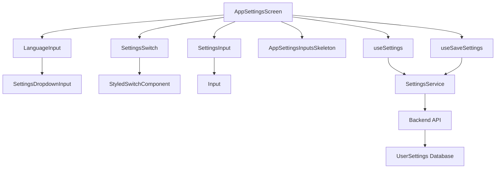

**Diagram sources**
- [app-settings.tsx](file://frontend/src/routes/app-settings.tsx)
- [settings-service.api.ts](file://frontend/src/settings-service/settings-service.api.ts)

**Section sources**
- [app-settings.tsx](file://frontend/src/routes/app-settings.tsx)
- [settings-service.api.ts](file://frontend/src/settings-service/settings-service.api.ts)

## Core Components

The App Settings component is composed of several specialized input components that provide a consistent user experience across different setting types. The main container component (AppSettingsScreen) manages the overall form state and coordinates interactions between individual input components. Each input component is designed to handle specific types of user preferences, from language selection to boolean toggles and text inputs.

The component architecture follows a pattern where the container component handles data fetching and mutation operations through React Query hooks, while child components focus on presentation and user interaction. This separation allows for better maintainability and testability of the codebase. The use of TypeScript ensures type safety throughout the component hierarchy, with well-defined interfaces for props and state.

**Section sources**
- [app-settings.tsx](file://frontend/src/routes/app-settings.tsx)
- [settings-dropdown-input.tsx](file://frontend/src/components/features/settings/settings-dropdown-input.tsx)
- [settings-input.tsx](file://frontend/src/components/features/settings/settings-input.tsx)
- [settings-switch.tsx](file://frontend/src/components/features/settings/settings-switch.tsx)

## Settings State Management

The App Settings component implements a sophisticated state management system using React Query to handle data fetching, caching, and mutations. The useSettings hook retrieves user preferences from the backend API and manages the local state representation, while the useSaveSettings hook handles the persistence of modified settings.

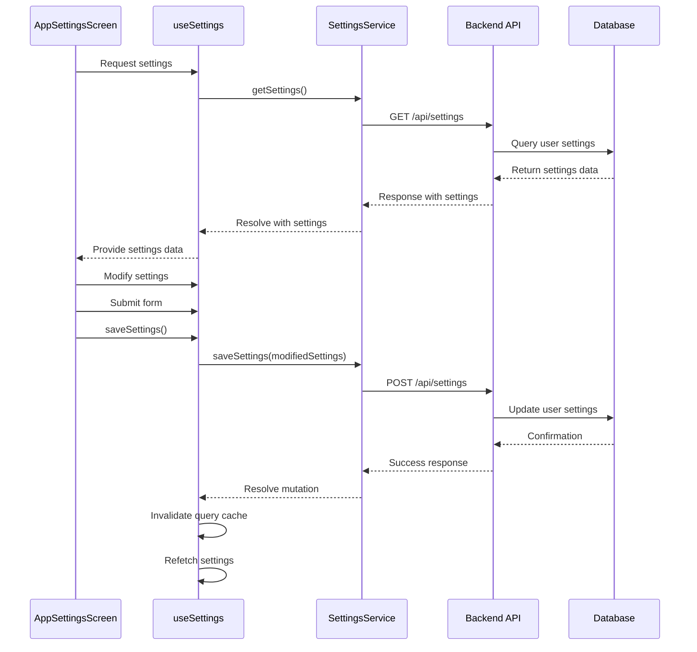

**Diagram sources**
- [use-settings.ts](file://frontend/src/hooks/query/use-settings.ts)
- [use-save-settings.ts](file://frontend/src/hooks/mutation/use-save-settings.ts)
- [settings-service.api.ts](file://frontend/src/settings-service/settings-service.api.ts)

**Section sources**
- [use-settings.ts](file://frontend/src/hooks/query/use-settings.ts)
- [use-save-settings.ts](file://frontend/src/hooks/mutation/use-save-settings.ts)

## Form Input Components

The App Settings component utilizes specialized input components for different types of user preferences. These components provide a consistent interface while handling specific input requirements for each setting type.

### Language Input Component

The LanguageInput component implements a dropdown selector for language preferences, using the SettingsDropdownInput as its base component. It integrates with the i18n system to display language options in their native representations.

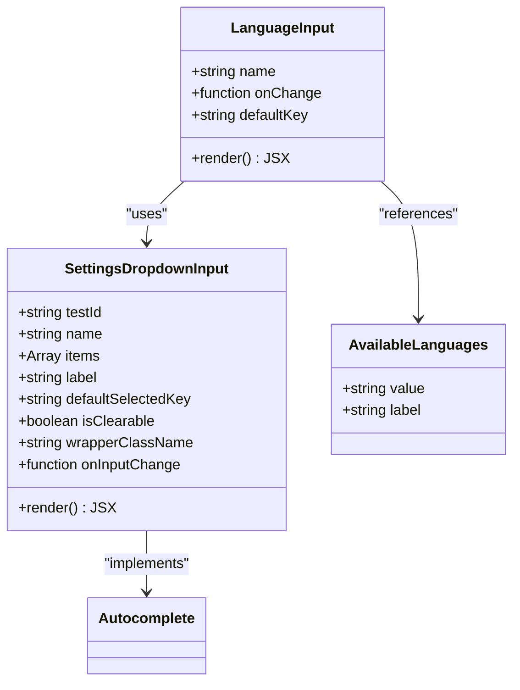

**Diagram sources**
- [language-input.tsx](file://frontend/src/components/features/settings/app-settings/language-input.tsx)
- [settings-dropdown-input.tsx](file://frontend/src/components/features/settings/settings-dropdown-input.tsx)

### Settings Input Component

The SettingsInput component provides a standardized text input field for settings that require free-form text entry, such as Git user information.

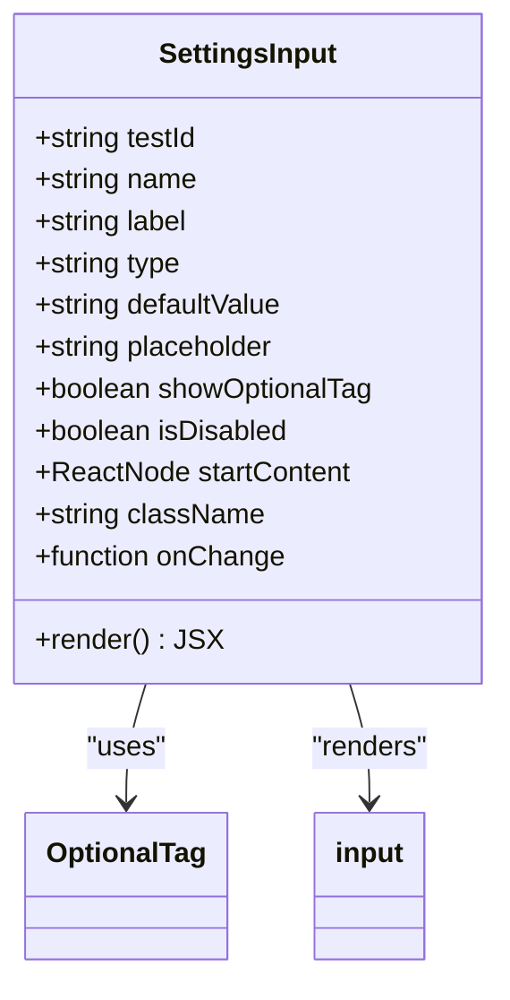

**Diagram sources**
- [settings-input.tsx](file://frontend/src/components/features/settings/settings-input.tsx)

### Settings Switch Component

The SettingsSwitch component implements toggle switches for boolean preferences such as analytics consent and sound notifications.

```mermaid
classDiagram
class SettingsSwitch {
+string testId
+string name
+function onToggle
+boolean defaultIsToggled
+boolean isToggled
+boolean isBeta
+boolean isDisabled
+render() JSX
}
class StyledSwitchComponent {
+boolean isToggled
+render() JSX
}
SettingsSwitch --> StyledSwitchComponent : "uses"
SettingsSwitch --> input[type=checkbox] : "renders"
```

**Diagram sources**
- [settings-switch.tsx](file://frontend/src/components/features/settings/settings-switch.tsx)
- [styled-switch-component.tsx](file://frontend/src/components/features/settings/styled-switch-component.tsx)

**Section sources**
- [language-input.tsx](file://frontend/src/components/features/settings/app-settings/language-input.tsx)
- [settings-dropdown-input.tsx](file://frontend/src/components/features/settings/settings-dropdown-input.tsx)
- [settings-input.tsx](file://frontend/src/components/features/settings/settings-input.tsx)
- [settings-switch.tsx](file://frontend/src/components/features/settings/settings-switch.tsx)

## Loading States and Skeleton Components

The App Settings component implements loading states using skeleton components to provide visual feedback during data fetching operations. The AppSettingsInputsSkeleton component displays placeholder elements that mimic the final UI layout, improving perceived performance and user experience.

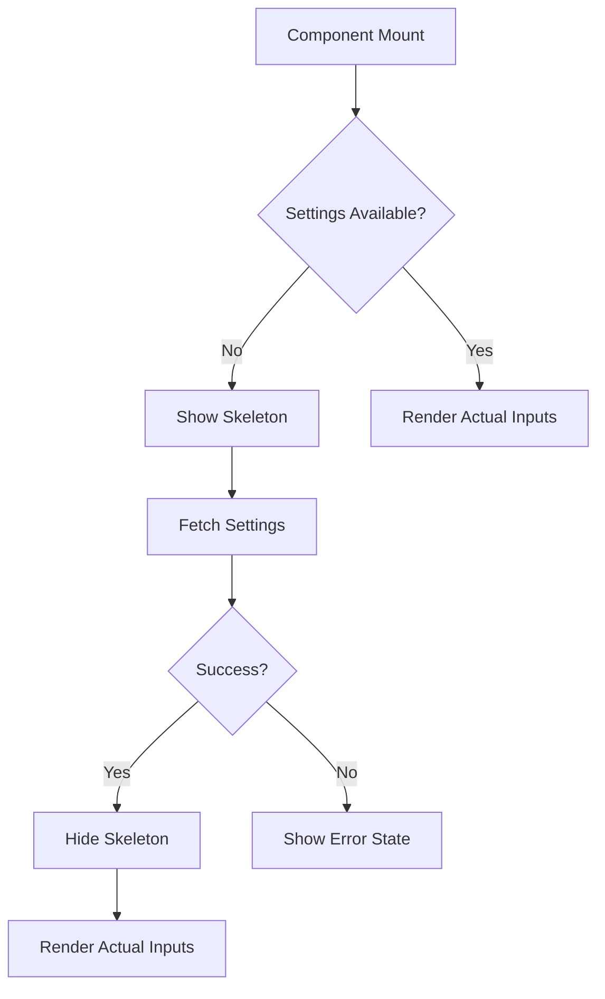

The skeleton implementation consists of reusable skeleton components for different input types:

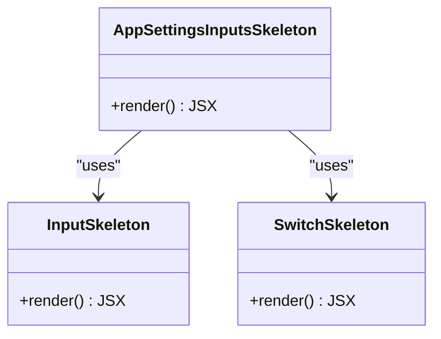

**Diagram sources**
- [app-settings-inputs-skeleton.tsx](file://frontend/src/components/features/settings/app-settings/app-settings-inputs-skeleton.tsx)

**Section sources**
- [app-settings-inputs-skeleton.tsx](file://frontend/src/components/features/settings/app-settings/app-settings-inputs-skeleton.tsx)

## Backend Settings Storage and Synchronization

The App Settings component synchronizes user preferences with the backend API, which persists settings in a database. The settings architecture includes both frontend and backend components that work together to ensure data consistency.

### Frontend-Backend Communication

The SettingsService class handles communication between the frontend and backend API, abstracting the HTTP operations required for settings management.

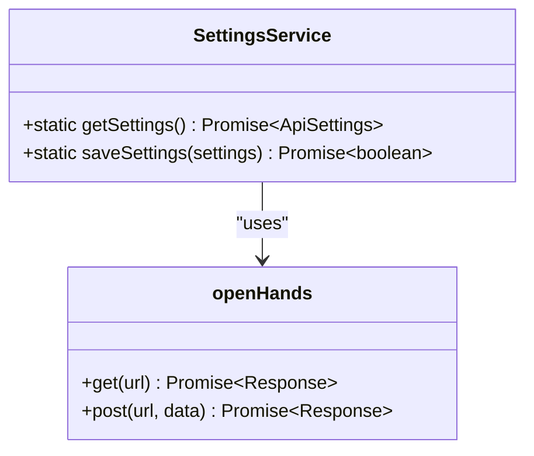

**Diagram sources**
- [settings-service.api.ts](file://frontend/src/settings-service/settings-service.api.ts)

### Backend Implementation

The backend settings storage is implemented in the enterprise/storage/user_settings.py file, which defines the data model and persistence logic for user preferences.

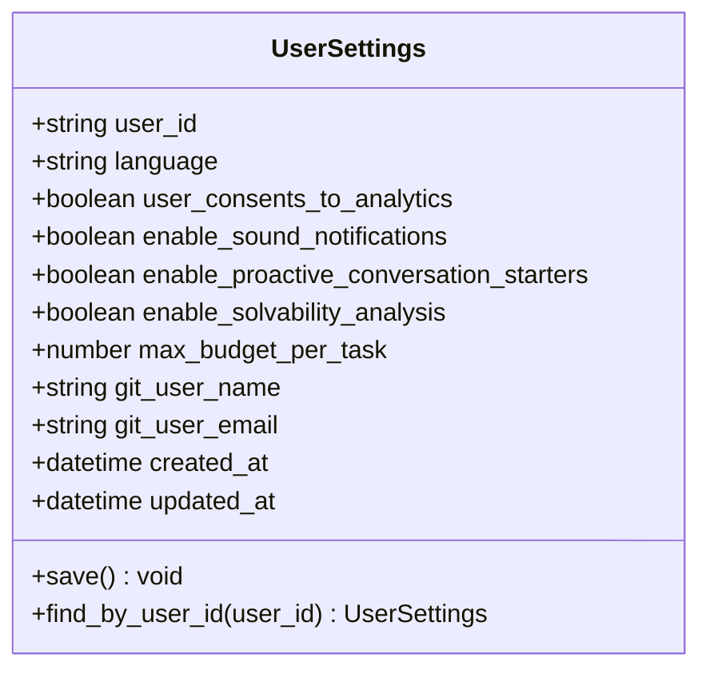

**Diagram sources**
- [user_settings.py](file://enterprise/storage/user_settings.py)

**Section sources**
- [settings-service.api.ts](file://frontend/src/settings-service/settings-service.api.ts)
- [user_settings.py](file://enterprise/storage/user_settings.py)

## Input Validation and Error Handling

The App Settings component implements comprehensive input validation and error handling to ensure data integrity and provide meaningful feedback to users.

### Form State Validation

The component tracks changes to settings and enables the submit button only when there are pending changes to save. This prevents unnecessary API calls when no changes have been made.

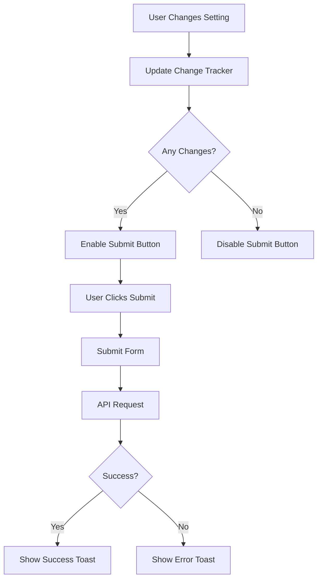

### Error Handling Patterns

The component uses a centralized error handling approach with dedicated utility functions for retrieving error messages from API responses.

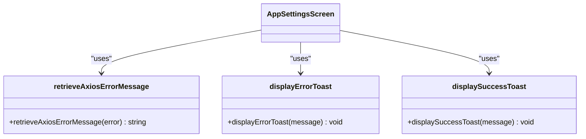

**Diagram sources**
- [retrieve-axios-error-message.ts](file://frontend/src/utils/retrieve-axios-error-message.ts)
- [custom-toast-handlers.ts](file://frontend/src/utils/custom-toast-handlers.ts)

**Section sources**
- [app-settings.tsx](file://frontend/src/routes/app-settings.tsx)
- [retrieve-axios-error-message.ts](file://frontend/src/utils/retrieve-axios-error-message.ts)

## Responsive Design and Accessibility

The App Settings component implements responsive design principles and accessibility features to ensure usability across different devices and for users with various needs.

### Responsive Layout

The component uses a flexible layout that adapts to different screen sizes, maintaining usability on both desktop and mobile devices.

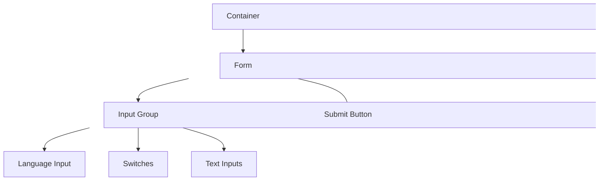

### Accessibility Features

The component includes several accessibility features:

- Proper labeling of form elements using the `label` element
- ARIA attributes for screen reader support
- Keyboard navigation support
- High contrast color scheme
- Semantic HTML structure

The SettingsInput and SettingsSwitch components use appropriate HTML elements and attributes to ensure accessibility:

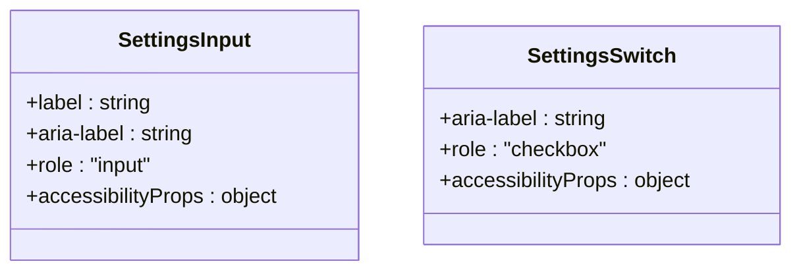

**Section sources**
- [settings-input.tsx](file://frontend/src/components/features/settings/settings-input.tsx)
- [settings-switch.tsx](file://frontend/src/components/features/settings/settings-switch.tsx)

## Conclusion

The App Settings component in OpenHands provides a robust and user-friendly interface for managing application preferences. The architecture combines modular frontend components with reliable backend persistence to create a seamless user experience. Key features include:

- Comprehensive language selection with i18n support
- Boolean toggle switches for feature preferences
- Text inputs for customizable settings
- Loading states with skeleton components
- Form state management with change tracking
- Input validation and error handling
- Responsive design for multiple device sizes
- Accessibility features for inclusive usability

The component's implementation follows modern React patterns with TypeScript, React Query for data management, and a clear separation of concerns between presentation and logic. The integration with the backend API ensures that user preferences are persisted and synchronized across sessions, providing a consistent experience regardless of the device or browser used.