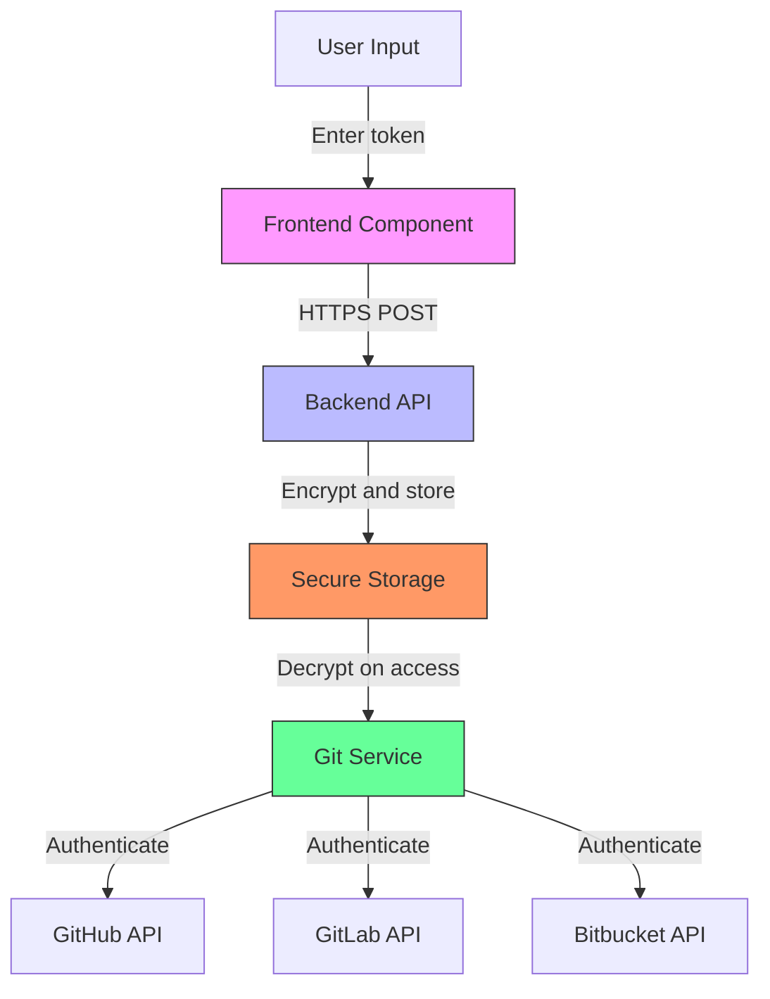
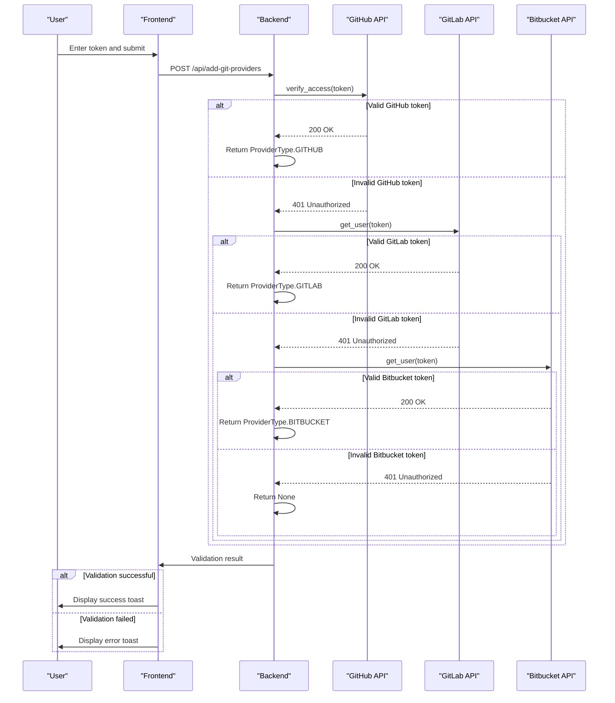
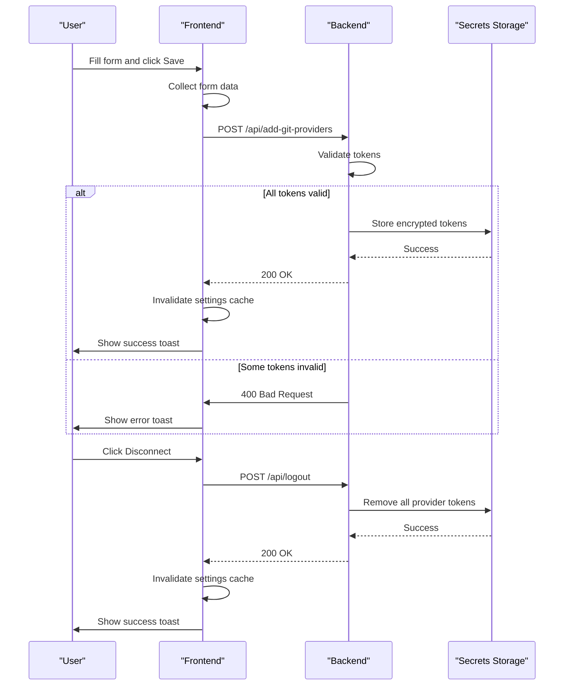

# Git Settings

<cite>
**Referenced Files in This Document**   
- [git-settings.tsx](file://frontend/src/routes/git-settings.tsx)
- [github-token-input.tsx](file://frontend/src/components/features/settings/git-settings/github-token-input.tsx)
- [gitlab-token-input.tsx](file://frontend/src/components/features/settings/git-settings/gitlab-token-input.tsx)
- [bitbucket-token-input.tsx](file://frontend/src/components/features/settings/git-settings/bitbucket-token-input.tsx)
- [use-add-git-providers.ts](file://frontend/src/hooks/mutation/use-add-git-providers.ts)
- [secrets-service.api.ts](file://frontend/src/api/secrets-service.ts)
- [utils.py](file://openhands/integrations/utils.py)
- [github_service.py](file://openhands/integrations/github/github_service.py)
- [gitlab_service.py](file://openhands/integrations/gitlab/gitlab_service.py)
- [bitbucket_service.py](file://openhands/integrations/bitbucket/bitbucket_service.py)
- [user_secrets.py](file://openhands/storage/data_models/user_secrets.py)
- [test_settings_store_functions.py](file://tests/unit/server/routes/test_settings_store_functions.py)
</cite>

## Table of Contents
1. [Introduction](#introduction)
2. [Git Provider Configuration Interface](#git-provider-configuration-interface)
3. [Token Input Components and Help Anchors](#token-input-components-and-help-anchors)
4. [Secure Credential Handling](#secure-credential-handling)
5. [Token Validation and Error States](#token-validation-and-error-states)
6. [Frontend-Backend Communication](#frontend-backend-communication)
7. [User Experience for Multiple Git Providers](#user-experience-for-multiple-git-providers)
8. [Handling Expired Credentials](#handling-expired-credentials)

## Introduction
The Git Settings component in OpenHands provides a comprehensive interface for users to configure and manage their Git repository integrations with GitHub, GitLab, and Bitbucket. This documentation details the implementation of the integration configuration system, focusing on the token input components, help anchors, repository configuration interface, secure credential handling, token validation, error states, and the communication flow between frontend and backend. The system is designed to provide a seamless user experience while maintaining robust security practices for handling sensitive authentication credentials.

## Git Provider Configuration Interface
The Git Settings interface allows users to connect and manage their code repositories across multiple Git providers. The configuration interface is implemented as a form-based component that supports GitHub, GitLab, and Bitbucket integrations. Users can input personal access tokens for each provider along with custom host configurations for self-hosted instances.

The interface conditionally renders provider-specific token inputs based on the application mode (SaaS vs. self-hosted), with self-hosted deployments showing all three provider options. For SaaS deployments, the interface may display external configuration buttons for GitHub repositories and Slack integration instead of direct token input fields.

The configuration form includes a submit button that saves the integration settings and a disconnect button that removes all configured Git tokens. The disconnect functionality is only enabled when at least one provider token is currently set. The interface also displays visual indicators showing which providers have active tokens, providing immediate feedback to users about their current configuration state.

**Section sources**
- [git-settings.tsx](file://frontend/src/routes/git-settings.tsx#L23-L235)

## Token Input Components and Help Anchors
The Git Settings component utilizes specialized token input components for each supported Git provider, providing a consistent user experience across different services. Each provider has its own dedicated input component (GitHubTokenInput, GitLabTokenInput, BitbucketTokenInput) that handles the specific requirements of that platform.

These input components are password-type fields that mask the token value for security. When a token is already configured, the field displays a placeholder like "<hidden>" instead of the actual token value. Each input field is accompanied by a host input field that allows users to specify custom domains for self-hosted Git instances (e.g., enterprise GitHub or GitLab deployments).

Visual status indicators are displayed next to configured tokens and hosts, using a KeyStatusIcon component to show whether credentials are currently set. This provides immediate visual feedback to users about their configuration status.

Each token input component is paired with a help anchor (e.g., GitHubTokenHelpAnchor) that guides users through the authentication setup process. These help anchors provide contextual assistance, likely linking to documentation or instructions for generating the appropriate personal access tokens with the required permissions for each Git provider.

**Section sources**
- [github-token-input.tsx](file://frontend/src/components/features/settings/git-settings/github-token-input.tsx#L8-L67)
- [gitlab-token-input.tsx](file://frontend/src/components/features/settings/git-settings/gitlab-token-input.tsx)
- [bitbucket-token-input.tsx](file://frontend/src/components/features/settings/git-settings/bitbucket-token-input.tsx)

## Secure Credential Handling
The Git Settings component implements robust security practices for handling sensitive authentication credentials. All Git provider tokens are stored as SecretStr objects using Pydantic's secret field type, which prevents the values from being accidentally exposed in logs, error messages, or API responses.

Tokens are encrypted at rest in the user's secret store, with the system using a FileSecretsStore for local deployments or appropriate secure storage mechanisms for SaaS deployments. The secret store handles the encryption and decryption of sensitive data, ensuring that tokens are never stored in plaintext.

When tokens are transmitted between the frontend and backend, they are sent over HTTPS using secure API endpoints. The frontend uses React Query's mutation hooks to securely send the token data to the backend, with appropriate error handling to prevent credential exposure in case of transmission failures.

The system also implements proper token cleanup when users disconnect their Git providers. The disconnect functionality removes all stored provider tokens from the user's secret store, ensuring that credentials are completely removed when no longer needed.

**Diagram sources **
- [user_secrets.py](file://openhands/storage/data_models/user_secrets.py#L52-L72)
- [secrets-service.api.ts](file://frontend/src/api/secrets-service.ts)

## Token Validation and Error States
The Git Settings component includes comprehensive token validation to ensure that entered credentials are valid and have the necessary permissions for the intended operations. The validation process occurs both on the frontend and backend to provide immediate feedback to users.

The backend implements a validate_provider_token function that determines whether a token is valid for GitHub, GitLab, or Bitbucket by attempting to authenticate with each service's API. The validation process tries each provider in sequence (GitHub first, then GitLab, then Bitbucket), returning the provider type if authentication succeeds or None if the token is invalid for all providers.

When a user submits their Git provider configuration, the system validates each token before storing it. If a token is invalid, the system returns an appropriate error message that is displayed to the user through the frontend's toast notification system. The frontend displays success notifications when tokens are saved successfully and error notifications when validation fails.

The system also handles edge cases such as empty tokens, expired tokens, and tokens with insufficient permissions. For empty tokens, the system preserves existing valid tokens while only updating the providers for which new tokens were provided.

**Diagram sources **
- [utils.py](file://openhands/integrations/utils.py#L10-L61)
- [test_settings_store_functions.py](file://tests/unit/server/routes/test_settings_store_functions.py#L60-L102)

## Frontend-Backend Communication
The Git Settings component implements a well-defined communication flow between the frontend and backend to test and save integration settings. The frontend uses React Query's mutation hooks to handle the asynchronous API calls, providing a clean separation between the UI logic and data fetching.

When a user submits their Git provider configuration, the frontend collects the token values and host settings from the form inputs and sends them to the backend via the /api/add-git-providers endpoint. This is handled by the useAddGitProviders hook, which calls the SecretsService.addGitProvider method with the provider tokens.

The backend processes the request by validating each token through the validate_provider_token function, which attempts to authenticate with each Git provider's API. If validation succeeds, the tokens are stored in the user's secret store, encrypted for security. The backend preserves existing valid tokens when new tokens are provided, ensuring that users don't lose access to providers they haven't modified.

After successfully saving the settings, the frontend invalidates the settings query cache to ensure the UI reflects the updated configuration. The system provides appropriate feedback to the user through toast notifications, indicating whether the save operation was successful or if errors occurred.

The communication flow also includes error handling for network issues, authentication failures, and validation errors, with descriptive error messages returned to the frontend for display to the user.

**Diagram sources **
- [use-add-git-providers.ts](file://frontend/src/hooks/mutation/use-add-git-providers.ts#L5-L21)
- [secrets-service.api.ts](file://frontend/src/api/secrets-service.ts)
- [git-settings.tsx](file://frontend/src/routes/git-settings.tsx#L57-L103)

## User Experience for Multiple Git Providers
The Git Settings component is designed to provide a seamless user experience when managing multiple Git providers. The interface allows users to configure tokens for GitHub, GitLab, and Bitbucket simultaneously, enabling integration with repositories across different platforms.

The form-based interface presents each provider's token input fields in a consistent layout, making it easy for users to understand and complete the configuration process. Visual indicators show which providers have active tokens, allowing users to quickly assess their current setup.

The system preserves existing valid tokens when users update their configuration, preventing accidental disconnection from providers they haven't modified. This behavior ensures that users can update one provider's token without affecting their access to other providers.

For SaaS deployments, the interface adapts to show external configuration options for GitHub repositories and Slack integration, providing a streamlined experience for common use cases. The conditional rendering of interface elements based on deployment type ensures that users see only the relevant configuration options for their environment.

The component also handles the display of custom host settings for self-hosted Git instances, allowing enterprise users to connect to their organization's internal GitHub, GitLab, or Bitbucket servers.

**Section sources**
- [git-settings.tsx](file://frontend/src/routes/git-settings.tsx#L52-L55)
- [settings.ts](file://frontend/src/types/settings.ts#L1-L73)

## Handling Expired Credentials
The Git Settings component includes mechanisms to handle expired credentials gracefully. When a token expires, the system detects authentication failures when attempting to access Git provider APIs and prompts the user to update their credentials.

The backend services for each Git provider implement token refresh logic where applicable, particularly in the SaaS environment where external token managers may be used. The SaaS-specific implementations of the Git service classes (e.g., SaaSGitHubService) integrate with the TokenManager to obtain fresh tokens when needed.

When a user attempts to perform an operation that requires Git access with an expired token, the system redirects them to the Git Settings page with an appropriate error message explaining that their credentials need to be updated. This provides a clear path for users to resolve authentication issues.

The interface makes it easy for users to update expired tokens by pre-filling the host settings when they return to the Git Settings page, requiring them only to enter a new token value. This reduces friction in the credential renewal process and helps maintain productivity.

**Section sources**
- [github_service.py](file://enterprise/integrations/github/github_service.py#L39-L73)
- [gitlab_service.py](file://enterprise/integrations/gitlab/gitlab_service.py)
- [bitbucket_service.py](file://enterprise/integrations/bitbucket/bitbucket_service.py)