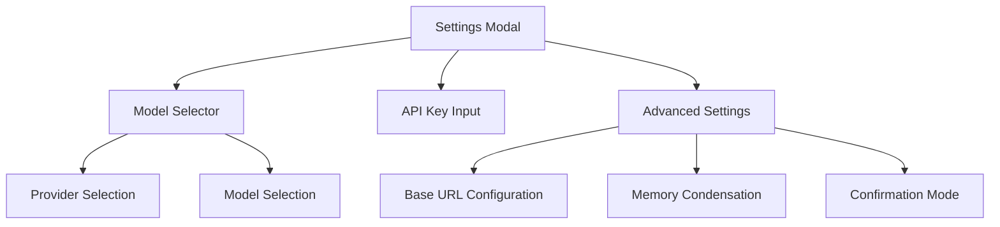
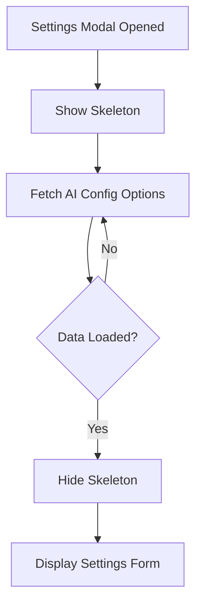
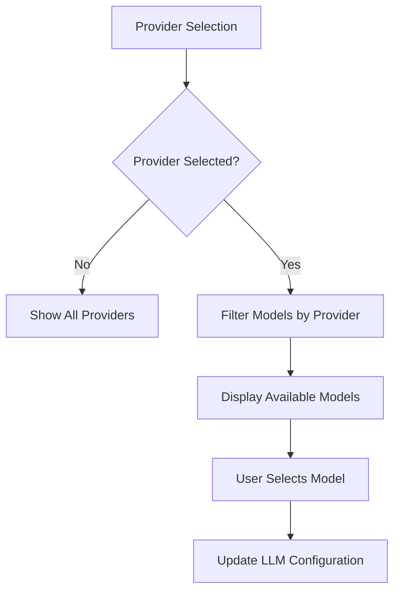
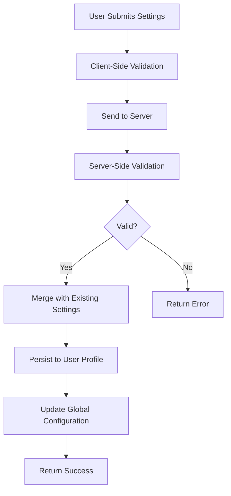
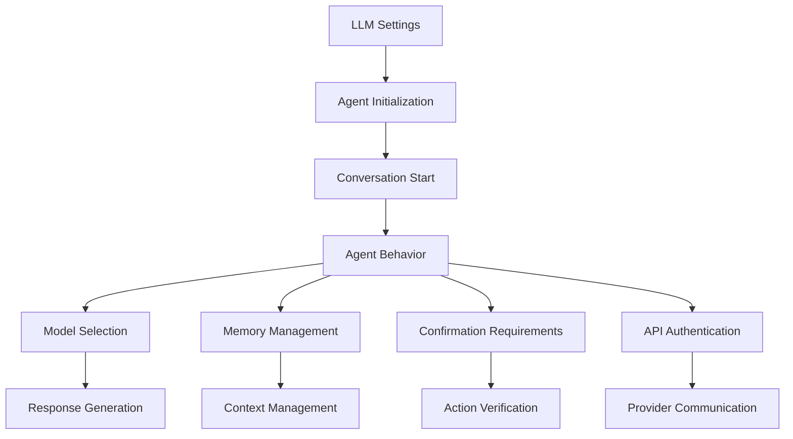

# LLM Settings

<cite>
**Referenced Files in This Document**   
- [settings.py](file://openhands/server/routes/settings.py)
- [settings.ts](file://frontend/src/types/settings.ts)
- [settings-form.tsx](file://frontend/src/components/shared/modals/settings/settings-form.tsx)
- [model-selector.tsx](file://frontend/src/components/shared/modals/settings/model-selector.tsx)
- [settings_store.py](file://openhands/storage/settings/settings_store.py)
- [settings_screen.py](file://openhands-cli/openhands_cli/tui/settings/settings_screen.py)
- [llm-settings-inputs-skeleton.tsx](file://frontend/src/components/features/settings/llm-settings/llm-settings-inputs-skeleton.tsx)
</cite>

## Table of Contents
1. [Introduction](#introduction)
2. [Configuration Interface](#configuration-interface)
3. [Inputs Skeleton and Loading States](#inputs-skeleton-and-loading-states)
4. [User Customization of LLM Parameters](#user-customization-of-llm-parameters)
5. [Provider Selection](#provider-selection)
6. [Settings Validation and Persistence](#settings-validation-and-persistence)
7. [Relationship with Agent System](#relationship-with-agent-system)
8. [Dynamic Configuration Updates](#dynamic-configuration-updates)
9. [Conclusion](#conclusion)

## Introduction
The LLM Settings component in OpenHands provides a comprehensive interface for configuring AI model preferences and provider settings. This documentation details the implementation of the configuration interface, the inputs skeleton that provides loading states, user customization options, validation and persistence mechanisms, and the relationship between these settings and the agent system's behavior during conversation execution.

**Section sources**
- [settings.py](file://openhands/server/routes/settings.py#L1-L212)
- [settings.ts](file://frontend/src/types/settings.ts#L1-L73)

## Configuration Interface
The LLM Settings configuration interface allows users to customize various aspects of the AI model behavior and provider settings. The interface is implemented as a modal dialog that presents users with options for selecting LLM providers, models, API keys, and other advanced settings.

The configuration interface is built using React components that provide a user-friendly way to modify settings. The main component, `SettingsForm`, orchestrates the display of various input elements including model selection, API key entry, and advanced configuration options.

**Diagram sources**
- [settings-form.tsx](file://frontend/src/components/shared/modals/settings/settings-form.tsx#L1-L140)
- [model-selector.tsx](file://frontend/src/components/shared/modals/settings/model-selector.tsx#L1-L222)

**Section sources**
- [settings-form.tsx](file://frontend/src/components/shared/modals/settings/settings-form.tsx#L1-L140)
- [model-selector.tsx](file://frontend/src/components/shared/modals/settings/model-selector.tsx#L1-L222)

## Inputs Skeleton and Loading States
The LLM Settings component implements a skeleton loading pattern to provide visual feedback during data loading. The skeleton components display placeholder elements that mimic the final UI layout before actual data is available.

The skeleton implementation consists of several components:
- `LlmSettingsInputsSkeleton`: Main skeleton component that coordinates the display of individual skeleton elements
- `InputSkeleton`: Displays skeleton placeholders for input fields
- `SwitchSkeleton`: Displays skeleton placeholders for toggle switches
- `SubtextSkeleton`: Displays skeleton placeholders for descriptive text

These skeleton components are used in the settings modal to provide a smooth user experience during the loading of AI configuration options. When the settings modal is opened, the skeleton is displayed immediately, and once the configuration data is loaded, the skeleton is replaced with the actual form elements.

**Diagram sources**
- [llm-settings-inputs-skeleton.tsx](file://frontend/src/components/features/settings/llm-settings/llm-settings-inputs-skeleton.tsx#L1-L21)
- [settings-modal.tsx](file://frontend/src/components/shared/modals/settings/settings-modal.tsx#L1-L59)

**Section sources**
- [llm-settings-inputs-skeleton.tsx](file://frontend/src/components/features/settings/llm-settings/llm-settings-inputs-skeleton.tsx#L1-L21)
- [input-skeleton.tsx](file://frontend/src/components/features/settings/input-skeleton.tsx#L1-L8)

## User Customization of LLM Parameters
Users can customize various LLM parameters through the settings interface. The customization options are divided into basic and advanced settings, allowing users to configure the AI model according to their needs.

Basic settings include:
- LLM provider selection
- Model selection from available options
- API key configuration

Advanced settings include:
- Custom model specification
- Base URL configuration for self-hosted models
- Memory condensation settings
- Confirmation mode configuration

The customization process is implemented through form elements that capture user input and validate it before persistence. The `extractSettings` function processes the form data and prepares it for storage, ensuring that the settings are properly formatted before being sent to the server.

**Section sources**
- [settings-utils.ts](file://frontend/src/utils/settings-utils.ts#L1-L30)
- [settings-form.tsx](file://frontend/src/components/shared/modals/settings/settings-form.tsx#L35-L69)

## Provider Selection
The provider selection functionality allows users to choose between different AI providers and their respective models. The implementation uses a two-step selection process where users first select a provider and then choose a model from the available options for that provider.

The provider selection is implemented using the `ModelSelector` component, which displays providers in two categories:
- Verified providers: Officially supported providers with tested models
- Other providers: Additional providers that may be available

When a user selects a provider, the model selection dropdown is updated to show only the models available for that provider. The component uses the `VERIFIED_PROVIDERS` and `VERIFIED_MODELS` constants to determine which providers and models to display in the verified section.

**Diagram sources**
- [model-selector.tsx](file://frontend/src/components/shared/modals/settings/model-selector.tsx#L1-L222)

**Section sources**
- [model-selector.tsx](file://frontend/src/components/shared/modals/settings/model-selector.tsx#L1-L222)
- [verified-models.ts](file://frontend/src/utils/verified-models.ts)

## Settings Validation and Persistence
The LLM settings are validated and persisted through a combination of client-side and server-side mechanisms. The validation ensures that settings are properly formatted and complete before being stored, while the persistence mechanism saves the settings to the user's profile for future sessions.

On the client side, form validation is performed using React hooks and form state management. The `useSaveSettings` hook handles the submission of settings to the server, with appropriate error handling and success callbacks.

On the server side, the `store_settings` endpoint validates the incoming settings and merges them with existing settings. The validation process includes:
- Checking provider tokens for validity
- Merging new settings with existing settings
- Preserving existing analytics consent if not provided
- Updating global configuration with new settings

The settings are persisted in the user's profile using the `SettingsStore` class, which handles the storage and retrieval of user settings. The store uses a database backend to ensure settings are preserved across sessions.

**Diagram sources**
- [settings.py](file://openhands/server/routes/settings.py#L133-L192)
- [settings_store.py](file://openhands/storage/settings/settings_store.py)

**Section sources**
- [settings.py](file://openhands/server/routes/settings.py#L133-L192)
- [use-save-settings.ts](file://frontend/src/hooks/mutation/use-save-settings.ts#L9-L38)

## Relationship with Agent System
The LLM settings have a direct impact on the agent system's behavior during conversation execution. When settings are updated, they affect various aspects of the agent's operation, including model selection, memory management, and confirmation requirements.

The agent system uses the configured LLM settings to initialize the conversation. When a new conversation is started, the agent loads the user's settings and configures itself accordingly. The settings influence:
- The LLM model used for generating responses
- The API key used for authentication with the LLM provider
- The base URL for LLM API requests
- Memory condensation behavior
- Confirmation mode requirements

When settings are changed during an active conversation, the changes take effect in subsequent interactions. However, some settings like the LLM model and API key require a new conversation to take full effect, as they are used to initialize the agent's LLM instance.

The relationship between settings and agent behavior is implemented through the agent initialization process, which reads the user's settings and configures the agent accordingly. The `setup_conversation` function uses the stored settings to create a conversation with the appropriate agent configuration.

**Diagram sources**
- [settings_screen.py](file://openhands-cli/openhands_cli/tui/settings/settings_screen.py#L42-L202)
- [setup.py](file://openhands-cli/openhands_cli/setup.py#L81-L116)

**Section sources**
- [settings_screen.py](file://openhands-cli/openhands_cli/tui/settings/settings_screen.py#L42-L202)
- [setup.py](file://openhands-cli/openhands_cli/setup.py#L81-L116)

## Dynamic Configuration Updates
Dynamic configuration updates allow users to modify LLM settings during an active session, with immediate or subsequent effects on agent behavior. The system supports both immediate updates for certain settings and delayed updates for others that require agent reinitialization.

For settings that can be updated immediately (such as confirmation mode and memory condensation), the changes take effect in the current conversation. The agent system listens for settings changes and updates its behavior accordingly.

For settings that require agent reinitialization (such as LLM model and API key), the system prompts the user to end the current conversation and start a new one with the updated settings. This ensures that the agent is properly configured with the new settings from the beginning of the conversation.

The dynamic update process is implemented through a combination of client-side state management and server-side event handling. When settings are updated, the client sends the new configuration to the server, which validates and persists the settings. The server then notifies the agent system of the changes, which updates its behavior accordingly.

**Section sources**
- [settings-form.tsx](file://frontend/src/components/shared/modals/settings/settings-form.tsx#L53-L67)
- [settings.py](file://openhands/server/routes/settings.py#L141-L186)

## Conclusion
The LLM Settings component in OpenHands provides a comprehensive and user-friendly interface for configuring AI model preferences and provider settings. The implementation includes a well-designed configuration interface, skeleton loading states for improved user experience, robust validation and persistence mechanisms, and tight integration with the agent system.

Key features of the LLM Settings component include:
- Intuitive provider and model selection
- Support for both basic and advanced configuration options
- Skeleton loading states for smooth user experience
- Comprehensive validation and persistence
- Dynamic updates that affect agent behavior
- Seamless integration with the agent system

The component effectively balances ease of use with powerful customization options, allowing users to tailor the AI behavior to their specific needs while maintaining a clean and intuitive interface.