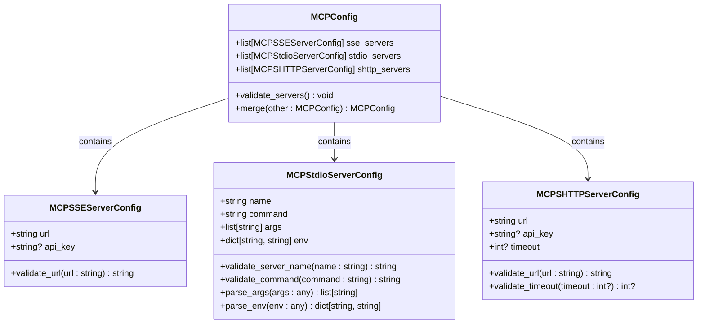
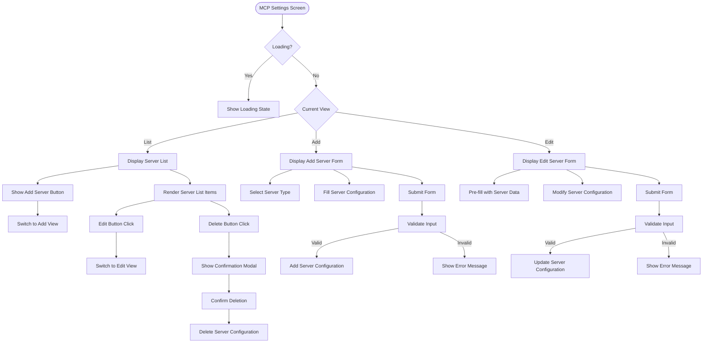
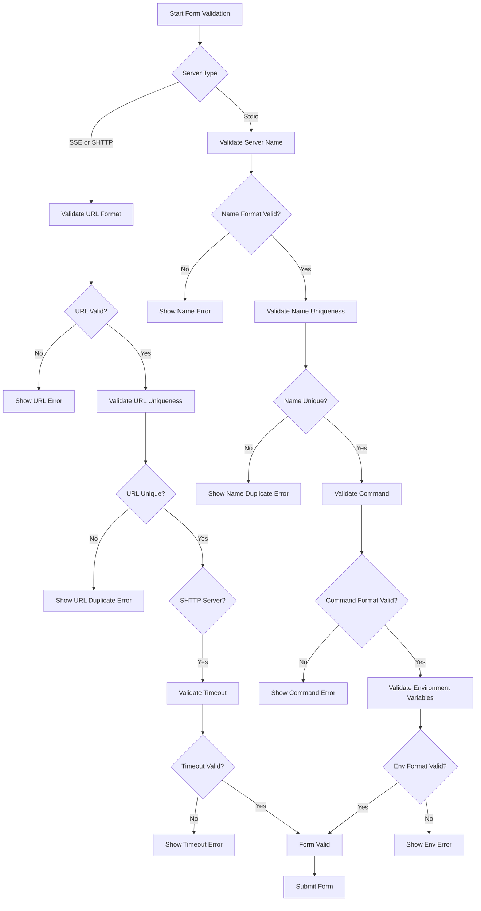
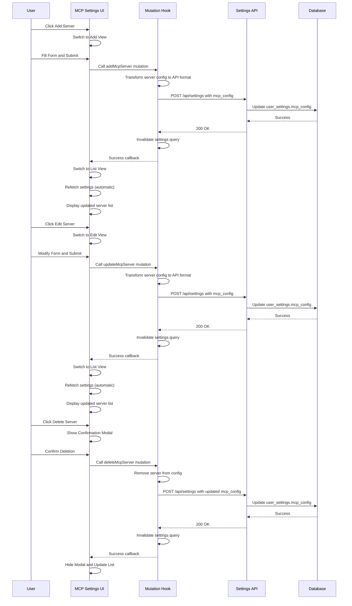
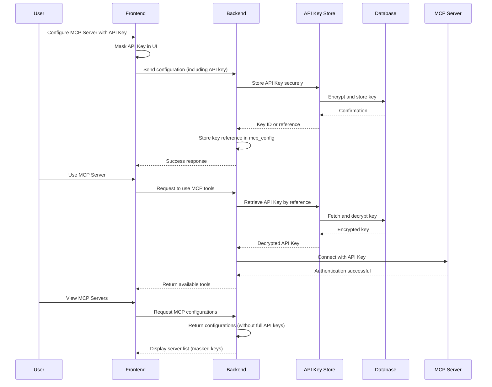
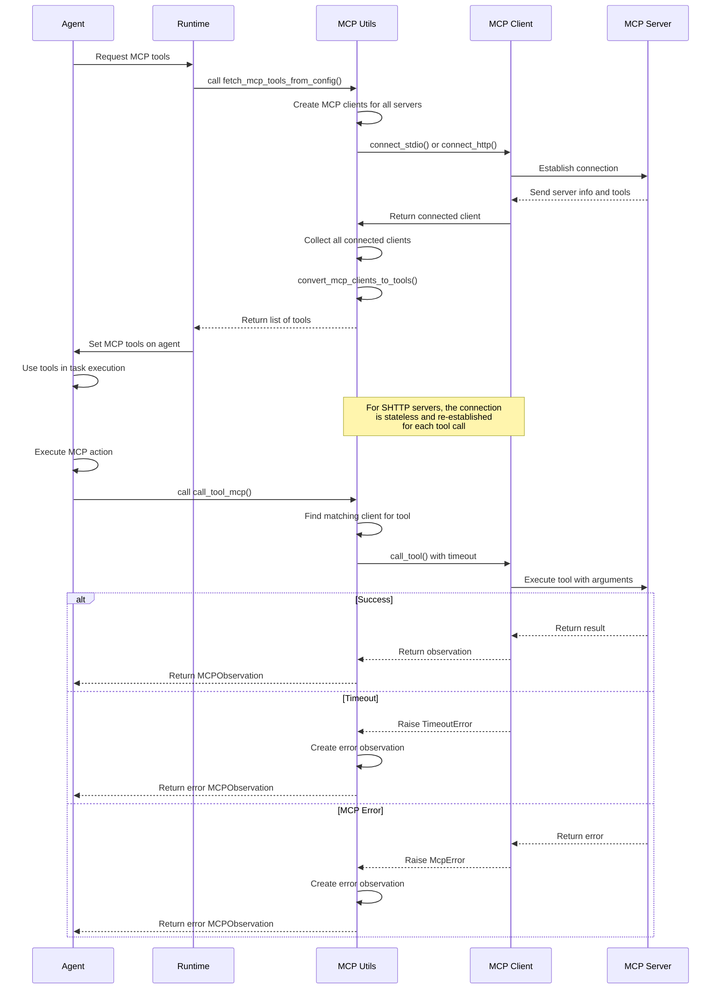

# MCP Settings

<cite>
**Referenced Files in This Document**   
- [mcp_config.py](file://openhands/core/config/mcp_config.py)
- [mcp-server-list.tsx](file://frontend/src/components/features/settings/mcp-settings/mcp-server-list.tsx)
- [mcp-server-list-item.tsx](file://frontend/src/components/features/settings/mcp-settings/mcp-server-list-item.tsx)
- [mcp-server-form.tsx](file://frontend/src/components/features/settings/mcp-settings/mcp-server-form.tsx)
- [mcp_settings.py](file://enterprise/storage/user_settings.py)
- [mcp_config.py](file://enterprise/server/mcp/mcp_config.py)
- [use-add-mcp-server.ts](file://frontend/src/hooks/mutation/use-add-mcp-server.ts)
- [use-update-mcp-server.ts](file://frontend/src/hooks/mutation/use-update-mcp-server.ts)
- [use-delete-mcp-server.ts](file://frontend/src/hooks/mutation/use-delete-mcp-server.ts)
- [settings-service.api.ts](file://frontend/src/settings-service/settings-service.api.ts)
- [mcp_patch.py](file://enterprise/server/routes/mcp_patch.py)
- [utils.py](file://openhands/mcp/utils.py)
- [client.py](file://openhands/mcp/client.py)
</cite>

## Table of Contents
1. [Introduction](#introduction)
2. [MCP Configuration Overview](#mcp-configuration-overview)
3. [Server Management Interface](#server-management-interface)
4. [Form Validation and Error Handling](#form-validation-and-error-handling)
5. [State Management and Persistence](#state-management-and-persistence)
6. [Security Considerations](#security-considerations)
7. [MCP Server Usage in Agent System](#mcp-server-usage-in-agent-system)
8. [Implementation Details](#implementation-details)

## Introduction

The MCP (Model Control Plane) Settings component provides a comprehensive interface for managing MCP server configurations within the OpenHands platform. This documentation details the implementation of the server list and list item components that display and manage connected MCP servers, the process for adding, editing, and removing MCP server configurations, and the integration of these configurations with the agent system during tool execution.

The MCP Settings interface enables users to configure various types of MCP servers (SSE, stdio, and SHTTP) with different connection methods and authentication mechanisms. The system supports both external MCP servers and local stdio-based servers, providing flexibility in how AI tools and services are integrated into the platform.

**Section sources**
- [mcp-server-list.tsx](file://frontend/src/components/features/settings/mcp-settings/mcp-server-list.tsx#L1-L38)
- [mcp-server-list-item.tsx](file://frontend/src/components/features/settings/mcp-settings/mcp-server-list-item.tsx#L1-L59)

## MCP Configuration Overview

The MCP configuration system is built around three primary server types: SSE (Server-Sent Events), stdio (standard input/output), and SHTTP (Streamable HTTP). Each server type serves different use cases and connection requirements.

The core configuration is defined by the `MCPConfig` class in the `mcp_config.py` file, which contains three main properties:
- `sse_servers`: List of MCPSSEServerConfig objects for servers using Server-Sent Events
- `stdio_servers`: List of MCPStdioServerConfig objects for servers using standard input/output
- `shttp_servers`: List of MCPSHTTPServerConfig objects for servers using Streamable HTTP

The configuration is stored in the user settings database as a JSON field named `mcp_config`, which was added through migration 036. This allows each user to maintain their own set of MCP server configurations.

**Diagram sources**
- [mcp_config.py](file://openhands/core/config/mcp_config.py#L222-L234)

**Section sources**
- [mcp_config.py](file://openhands/core/config/mcp_config.py#L222-L333)
- [user_settings.py](file://enterprise/storage/user_settings.py#L32)

## Server Management Interface

The MCP Settings interface provides a complete CRUD (Create, Read, Update, Delete) interface for managing MCP server configurations. The interface is implemented as a React component that transitions between different views: list view, add server view, and edit server view.

The server list component (`MCPServerList`) displays all configured MCP servers in a unified format, regardless of their type. Each server is rendered as a list item that shows the server type, name or URL, and action buttons for editing and deletion. When no servers are configured, the component displays an empty state message.

**Diagram sources**
- [mcp-server-list.tsx](file://frontend/src/components/features/settings/mcp-settings/mcp-server-list.tsx#L23-L37)
- [mcp-server-list-item.tsx](file://frontend/src/components/features/settings/mcp-settings/mcp-server-list-item.tsx#L17-L25)
- [mcp-settings.tsx](file://frontend/src/routes/mcp-settings.tsx#L29-L194)

**Section sources**
- [mcp-server-list.tsx](file://frontend/src/components/features/settings/mcp-settings/mcp-server-list.tsx#L23-L37)
- [mcp-server-list-item.tsx](file://frontend/src/components/features/settings/mcp-settings/mcp-server-list-item.tsx#L17-L59)
- [mcp-settings.tsx](file://frontend/src/routes/mcp-settings.tsx#L29-L194)

## Form Validation and Error Handling

The MCP server configuration form implements comprehensive validation to ensure that all server configurations are valid before being saved. The validation rules vary depending on the server type and specific fields.

For all server types, the form validates:
- URL format and protocol (must be http://, https://, ws://, or wss://)
- URL uniqueness across SSE and SHTTP server types
- Required fields are not empty

For stdio servers, additional validation includes:
- Server name format (only letters, numbers, hyphens, and underscores)
- Command format (single executable without spaces)
- Argument parsing using shell-like syntax (supporting quoted strings with spaces)
- Environment variable format (KEY=VALUE pairs, one per line)

For SHTTP servers, additional validation includes:
- Timeout value (must be positive and not exceed 3600 seconds)

**Diagram sources**
- [mcp-server-form.tsx](file://frontend/src/components/features/settings/mcp-settings/mcp-server-form.tsx#L51-L138)
- [mcp_config.py](file://openhands/core/config/mcp_config.py#L26-L43)

**Section sources**
- [mcp-server-form.tsx](file://frontend/src/components/features/settings/mcp-settings/mcp-server-form.tsx#L51-L138)
- [mcp_config.py](file://openhands/core/config/mcp_config.py#L26-L43)

## State Management and Persistence

The MCP Settings component implements a robust state management system that handles the lifecycle of server configurations from user input to persistent storage. The state transitions between list, add, and edit views are managed using React state hooks.

When a user adds or updates a server configuration, the changes are persisted through the settings service API. The mutation hooks (`useAddMcpServer`, `useUpdateMcpServer`, `useDeleteMcpServer`) handle the API calls and cache invalidation to ensure the UI reflects the updated state.

**Diagram sources**
- [use-add-mcp-server.ts](file://frontend/src/hooks/mutation/use-add-mcp-server.ts#L19-L69)
- [use-update-mcp-server.ts](file://frontend/src/hooks/mutation/use-update-mcp-server.ts#L19-L71)
- [use-delete-mcp-server.ts](file://frontend/src/hooks/mutation/use-delete-mcp-server.ts#L6-L37)
- [settings-service.api.ts](file://frontend/src/settings-service/settings-service.api.ts#L1-L28)

**Section sources**
- [use-add-mcp-server.ts](file://frontend/src/hooks/mutation/use-add-mcp-server.ts#L19-L69)
- [use-update-mcp-server.ts](file://frontend/src/hooks/mutation/use-update-mcp-server.ts#L19-L71)
- [use-delete-mcp-server.ts](file://frontend/src/hooks/mutation/use-delete-mcp-server.ts#L6-L37)
- [settings-service.api.ts](file://frontend/src/settings-service/settings-service.api.ts#L1-L28)

## Security Considerations

The MCP Settings system implements several security measures to protect user credentials and ensure secure connections to external MCP servers.

API keys are stored securely in the database and transmitted over HTTPS connections. The system uses a dedicated API key store to manage MCP API keys, which are provisioned automatically when needed. For SaaS deployments, the system creates a default MCP server configuration with an API key that is retrieved from the key store.

The system also includes timeout mechanisms to prevent hanging connections and potential denial-of-service issues. SHTTP servers have a configurable timeout (default 60 seconds, maximum 3600 seconds) that limits the duration of tool calls. The system handles timeout errors gracefully by returning appropriate error observations to the agent system.

**Diagram sources**
- [mcp_config.py](file://enterprise/server/mcp/mcp_config.py#L40-L54)
- [mcp_config.py](file://openhands/core/config/mcp_config.py#L210-L219)
- [utils.py](file://openhands/mcp/utils.py#L262-L277)

**Section sources**
- [mcp_config.py](file://enterprise/server/mcp/mcp_config.py#L40-L54)
- [mcp_config.py](file://openhands/core/config/mcp_config.py#L210-L219)
- [utils.py](file://openhands/mcp/utils.py#L262-L277)

## MCP Server Usage in Agent System

MCP server configurations are used by the agent system to discover and execute tools provided by external MCP servers. When a task is executed, the system creates MCP clients for each configured server and retrieves the available tools.

The process begins when the agent system calls `add_mcp_tools_to_agent`, which fetches the MCP configuration from the runtime and creates MCP clients for each server. The clients connect to their respective servers and retrieve the list of available tools, which are then converted to a format that can be used by the agent.

The system handles various error conditions gracefully, including connection failures, timeouts, and MCP protocol errors. When a tool call fails, the system returns an error observation to the agent rather than raising an exception, preventing the agent from stalling. This error handling is particularly important for timeout scenarios, where the agent would otherwise wait indefinitely for a response.

**Diagram sources**
- [utils.py](file://openhands/mcp/utils.py#L64-L154)
- [client.py](file://openhands/mcp/client.py#L83-L112)
- [utils.py](file://openhands/mcp/utils.py#L212-L287)

**Section sources**
- [utils.py](file://openhands/mcp/utils.py#L64-L154)
- [client.py](file://openhands/mcp/client.py#L83-L112)
- [utils.py](file://openhands/mcp/utils.py#L212-L287)

## Implementation Details

The MCP Settings implementation follows a clean separation of concerns between the frontend UI components, backend storage, and agent integration layers. The system is designed to be extensible, allowing for additional MCP server types and integration patterns.

Key implementation details include:

1. **Frontend Architecture**: The React components follow a container/presentation pattern, with the MCPSettingsScreen acting as a container that manages state and passes props to presentational components like MCPServerList and MCPServerForm.

2. **Backend Storage**: The MCP configuration is stored as a JSON field in the user_settings table, allowing for flexible schema evolution without requiring database migrations for configuration changes.

3. **Connection Management**: The system uses different connection strategies for different server types:
   - SSE servers maintain a persistent connection
   - SHTTP servers use stateless connections with configurable timeouts
   - Stdio servers connect via standard input/output pipes

4. **Error Collection**: The system includes an MCP error collector that logs and tracks connection and execution errors, providing visibility into MCP-related issues.

5. **Search Integration**: The system supports integration with search engines like Tavily through the MCP protocol, with configuration options to enable or disable this feature.

The implementation demonstrates a thoughtful approach to balancing flexibility, security, and usability in managing external tool integrations through the MCP protocol.

**Section sources**
- [mcp-server-list.tsx](file://frontend/src/components/features/settings/mcp-settings/mcp-server-list.tsx#L1-L38)
- [mcp-server-form.tsx](file://frontend/src/components/features/settings/mcp-settings/mcp-server-form.tsx#L1-L428)
- [mcp_config.py](file://openhands/core/config/mcp_config.py#L1-L384)
- [utils.py](file://openhands/mcp/utils.py#L1-L340)
- [mcp_patch.py](file://enterprise/server/routes/mcp_patch.py#L1-L33)