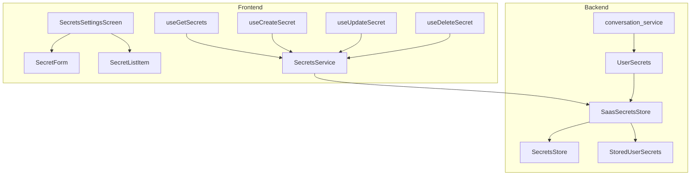
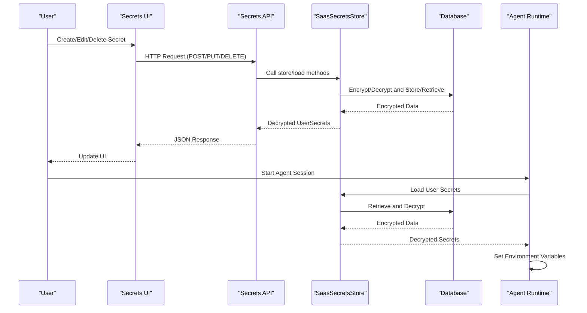
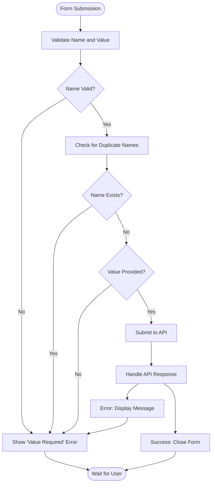
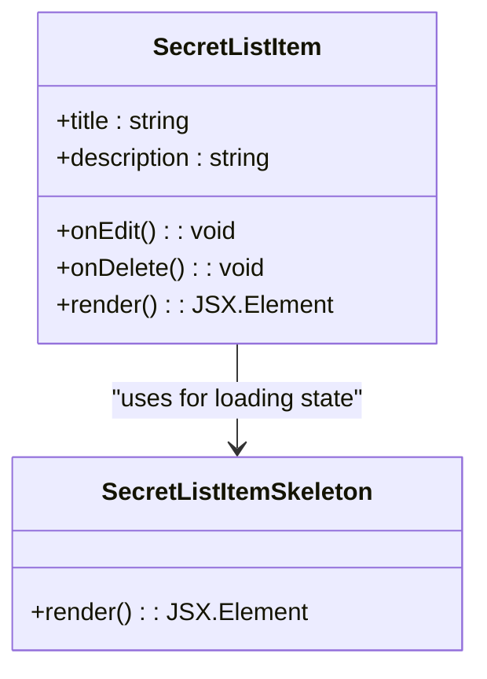
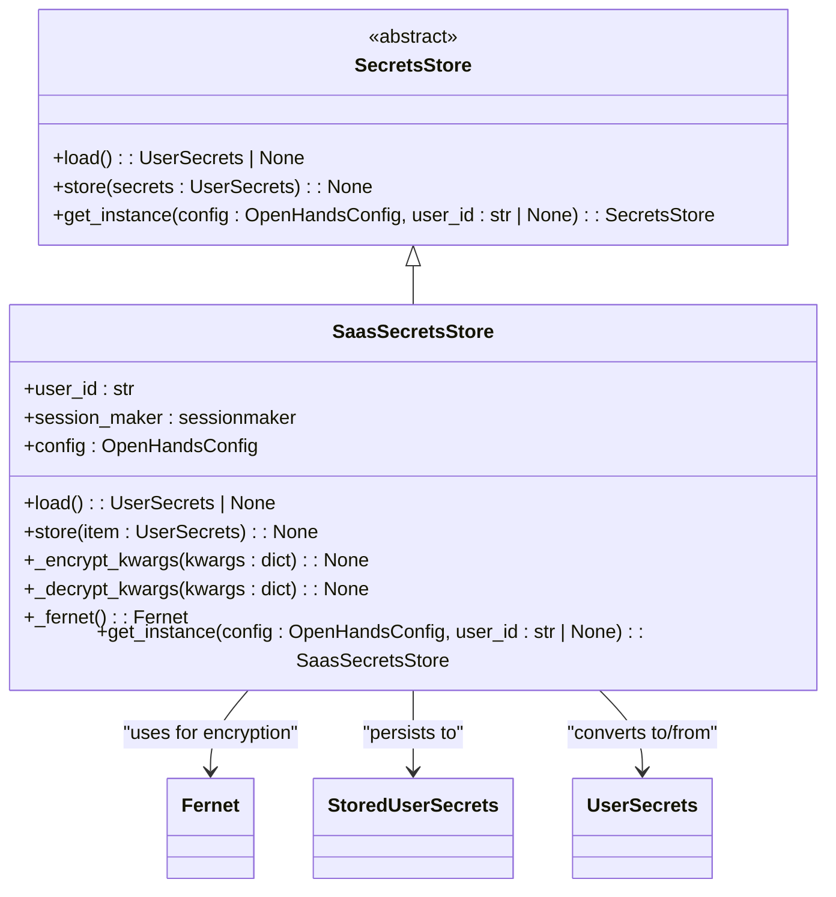
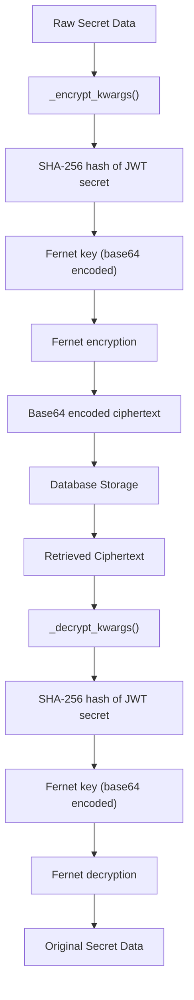
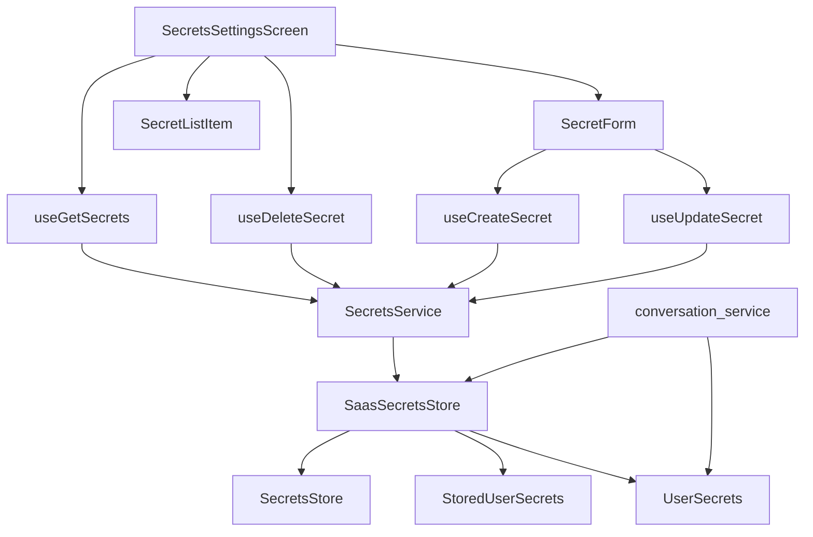

# Secrets Settings

<cite>
**Referenced Files in This Document**   
- [secrets-settings.tsx](file://frontend/src/routes/secrets-settings.tsx)
- [secret-form.tsx](file://frontend/src/components/features/settings/secrets-settings/secret-form.tsx)
- [secret-list-item.tsx](file://frontend/src/components/features/settings/secrets-settings/secret-list-item.tsx)
- [use-get-secrets.ts](file://frontend/src/hooks/query/use-get-secrets.ts)
- [use-create-secret.ts](file://frontend/src/hooks/mutation/use-create-secret.ts)
- [use-update-secret.ts](file://frontend/src/hooks/mutation/use-update-secret.ts)
- [use-delete-secret.ts](file://frontend/src/hooks/mutation/use-delete-secret.ts)
- [secrets-service.ts](file://frontend/src/api/secrets-service.ts)
- [saas_secrets_store.py](file://enterprise/storage/saas_secrets_store.py)
- [secrets_store.py](file://openhands/storage/secrets/secrets_store.py)
- [user_secrets.py](file://openhands/storage/data_models/user_secrets.py)
- [conversation_service.py](file://openhands/server/services/conversation_service.py)
</cite>

## Table of Contents
1. [Introduction](#introduction)
2. [Project Structure](#project-structure)
3. [Core Components](#core-components)
4. [Architecture Overview](#architecture-overview)
5. [Detailed Component Analysis](#detailed-component-analysis)
6. [Dependency Analysis](#dependency-analysis)
7. [Performance Considerations](#performance-considerations)
8. [Troubleshooting Guide](#troubleshooting-guide)
9. [Conclusion](#conclusion)

## Introduction
The Secrets Settings component in OpenHands provides a secure credential management system for handling user secrets. This documentation details the implementation of secure storage, encryption mechanisms, and access controls for sensitive information. The system enables users to create, view, and manage secrets through an intuitive interface while ensuring protection both in transit and at rest. Secrets are securely injected into agent workflows and runtime environments, with comprehensive audit logging and access control mechanisms in place.

## Project Structure
The secrets management system is organized across frontend and backend components, with clear separation between UI presentation, API services, and data storage layers. The frontend components handle user interaction through forms and lists, while the backend implements secure storage and encryption.

**Diagram sources**
- [secrets-settings.tsx](file://frontend/src/routes/secrets-settings.tsx)
- [saas_secrets_store.py](file://enterprise/storage/saas_secrets_store.py)
- [user_secrets.py](file://openhands/storage/data_models/user_secrets.py)

**Section sources**
- [secrets-settings.tsx](file://frontend/src/routes/secrets-settings.tsx)
- [saas_secrets_store.py](file://enterprise/storage/saas_secrets_store.py)

## Core Components
The Secrets Settings component consists of several key elements that work together to provide secure credential management. The system includes UI components for secret creation and management, API services for handling requests, and backend storage with encryption capabilities. The implementation follows a modular architecture that separates concerns between presentation, business logic, and data persistence.

**Section sources**
- [secrets-settings.tsx](file://frontend/src/routes/secrets-settings.tsx)
- [secret-form.tsx](file://frontend/src/components/features/settings/secrets-settings/secret-form.tsx)
- [secret-list-item.tsx](file://frontend/src/components/features/settings/secrets-settings/secret-list-item.tsx)
- [saas_secrets_store.py](file://enterprise/storage/saas_secrets_store.py)

## Architecture Overview
The secrets management architecture follows a layered approach with clear separation between frontend, API, and storage components. User interactions flow from the UI through API services to the encrypted storage layer, with secrets being securely retrieved and injected into runtime environments as needed.

**Diagram sources**
- [secrets-settings.tsx](file://frontend/src/routes/secrets-settings.tsx)
- [saas_secrets_store.py](file://enterprise/storage/saas_secrets_store.py)
- [conversation_service.py](file://openhands/server/services/conversation_service.py)

## Detailed Component Analysis

### Frontend Components
The frontend implementation provides a user-friendly interface for managing secrets through form-based creation and list-based management.

#### Secret Form Component
The SecretForm component handles both creation and editing of secrets with validation and error handling.

**Diagram sources**
- [secret-form.tsx](file://frontend/src/components/features/settings/secrets-settings/secret-form.tsx)

**Section sources**
- [secret-form.tsx](file://frontend/src/components/features/settings/secrets-settings/secret-form.tsx)

#### Secret List Item Component
The SecretListItem component displays individual secrets with edit and delete actions.

**Diagram sources**
- [secret-list-item.tsx](file://frontend/src/components/features/settings/secrets-settings/secret-list-item.tsx)

**Section sources**
- [secret-list-item.tsx](file://frontend/src/components/features/settings/secrets-settings/secret-list-item.tsx)

### Backend Components
The backend implementation provides secure storage and encryption for user secrets.

#### Secrets Storage Architecture
The secrets storage system uses an abstract base class with concrete implementations for different deployment models.

**Diagram sources**
- [secrets_store.py](file://openhands/storage/secrets/secrets_store.py)
- [saas_secrets_store.py](file://enterprise/storage/saas_secrets_store.py)
- [user_secrets.py](file://openhands/storage/data_models/user_secrets.py)

**Section sources**
- [secrets_store.py](file://openhands/storage/secrets/secrets_store.py)
- [saas_secrets_store.py](file://enterprise/storage/saas_secrets_store.py)

#### Encryption and Storage Mechanism
The system implements robust encryption using Fernet symmetric encryption with keys derived from the JWT secret.

**Diagram sources**
- [saas_secrets_store.py](file://enterprise/storage/saas_secrets_store.py)

**Section sources**
- [saas_secrets_store.py](file://enterprise/storage/saas_secrets_store.py)

## Dependency Analysis
The secrets management system has well-defined dependencies between components, ensuring loose coupling and clear responsibility boundaries.

**Diagram sources**
- [secrets-settings.tsx](file://frontend/src/routes/secrets-settings.tsx)
- [saas_secrets_store.py](file://enterprise/storage/saas_secrets_store.py)
- [conversation_service.py](file://openhands/server/services/conversation_service.py)

**Section sources**
- [secrets-settings.tsx](file://frontend/src/routes/secrets-settings.tsx)
- [saas_secrets_store.py](file://enterprise/storage/saas_secrets_store.py)
- [conversation_service.py](file://openhands/server/services/conversation_service.py)

## Performance Considerations
The secrets management system is designed for optimal performance with efficient database queries and caching mechanisms. The implementation uses optimistic updates in the frontend to provide immediate user feedback, while background operations handle the actual data persistence. Database queries are optimized to retrieve all secrets for a user in a single query, minimizing round trips. The encryption and decryption operations are performed efficiently using the Fernet symmetric encryption algorithm, which provides a good balance between security and performance.

**Section sources**
- [saas_secrets_store.py](file://enterprise/storage/saas_secrets_store.py)
- [secrets-settings.tsx](file://frontend/src/routes/secrets-settings.tsx)

## Troubleshooting Guide
When troubleshooting issues with the secrets management system, consider the following common scenarios:

1. **Secrets not appearing in the list**: Verify that the user ID is correctly passed to the SaasSecretsStore and that the database contains records for the user.
2. **Encryption/decryption failures**: Ensure the JWT secret is properly configured and consistent across application restarts.
3. **Permission issues**: Confirm that the user has appropriate access rights to view and modify secrets.
4. **Form validation errors**: Check that secret names do not contain spaces and are unique within the user's collection.
5. **API connectivity problems**: Verify that the frontend can reach the backend API endpoints and that authentication is working correctly.

**Section sources**
- [saas_secrets_store.py](file://enterprise/storage/saas_secrets_store.py)
- [secrets-service.ts](file://frontend/src/api/secrets-service.ts)
- [secrets-settings.tsx](file://frontend/src/routes/secrets-settings.tsx)

## Conclusion
The Secrets Settings component in OpenHands provides a comprehensive solution for secure credential management. The system combines a user-friendly interface with robust security measures, including end-to-end encryption and secure storage. The architecture follows best practices with clear separation of concerns and extensible design. Secrets are securely injected into agent workflows, enabling safe execution of tasks that require sensitive information. The implementation demonstrates a commitment to security, usability, and maintainability, making it a reliable component for managing sensitive data in the OpenHands platform.