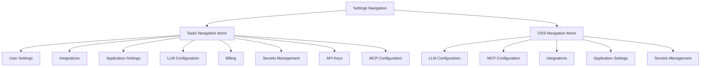
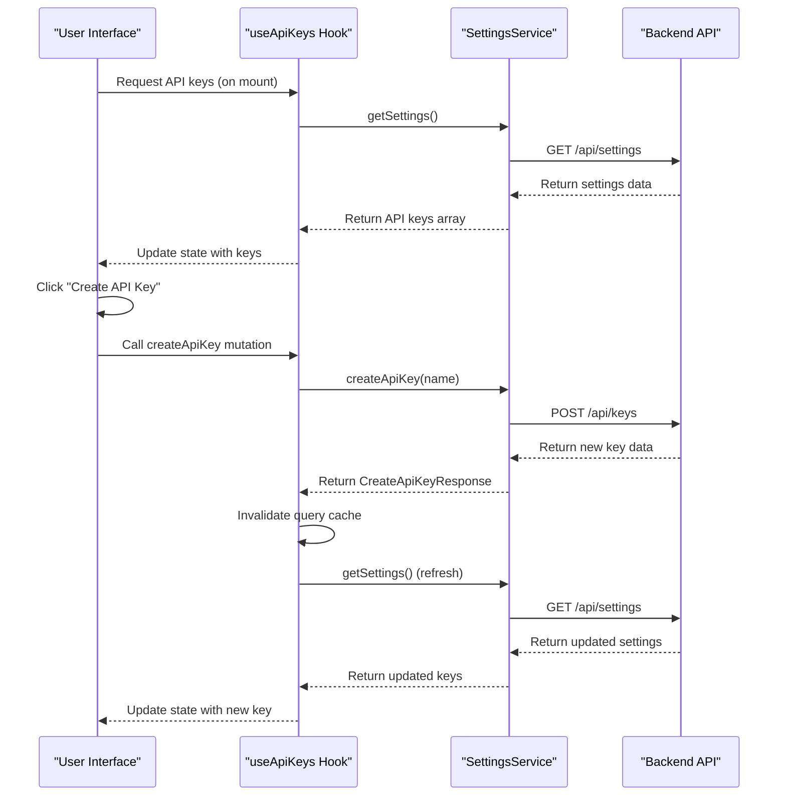
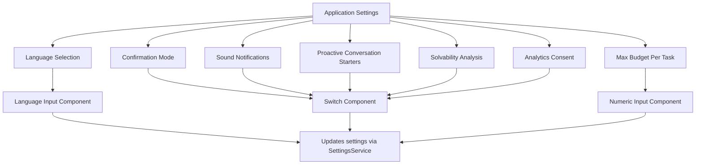
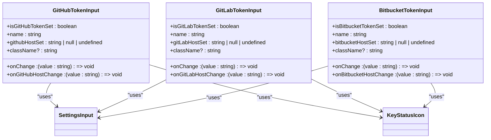
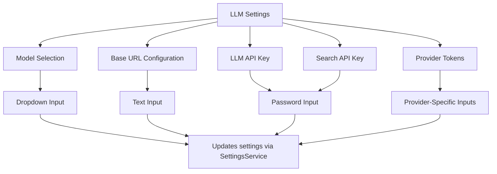
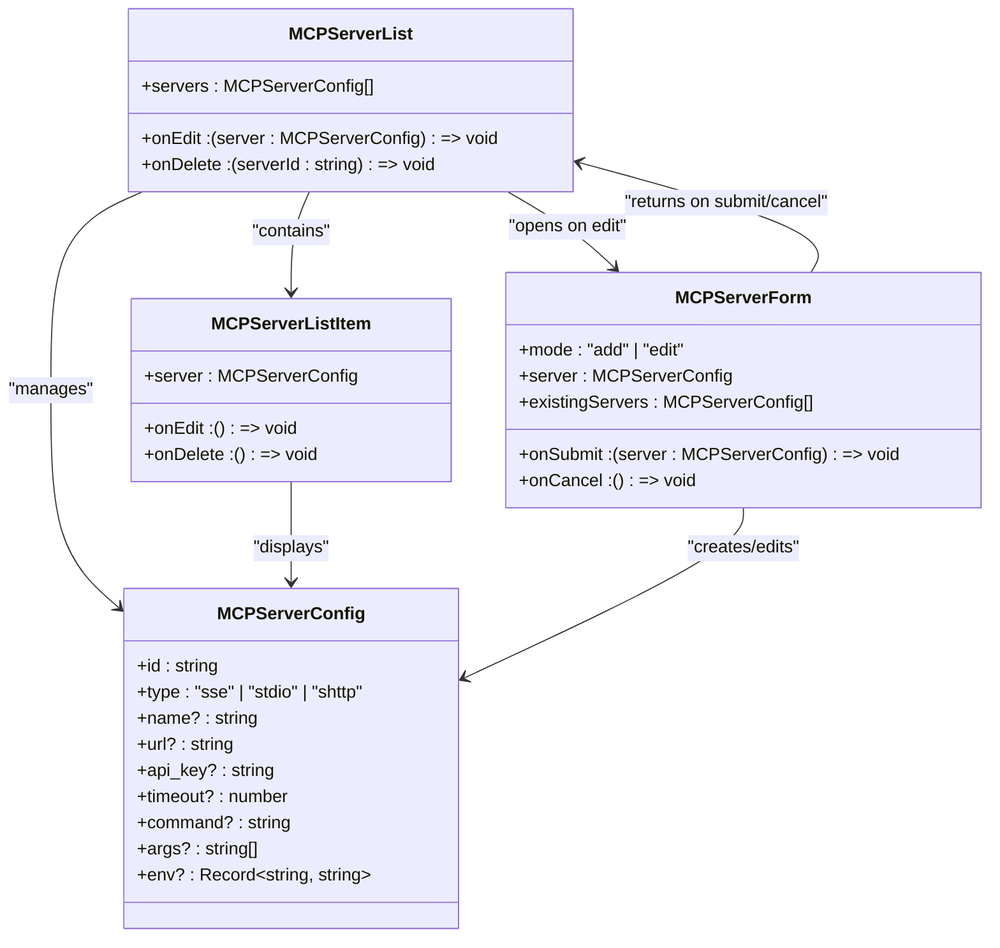
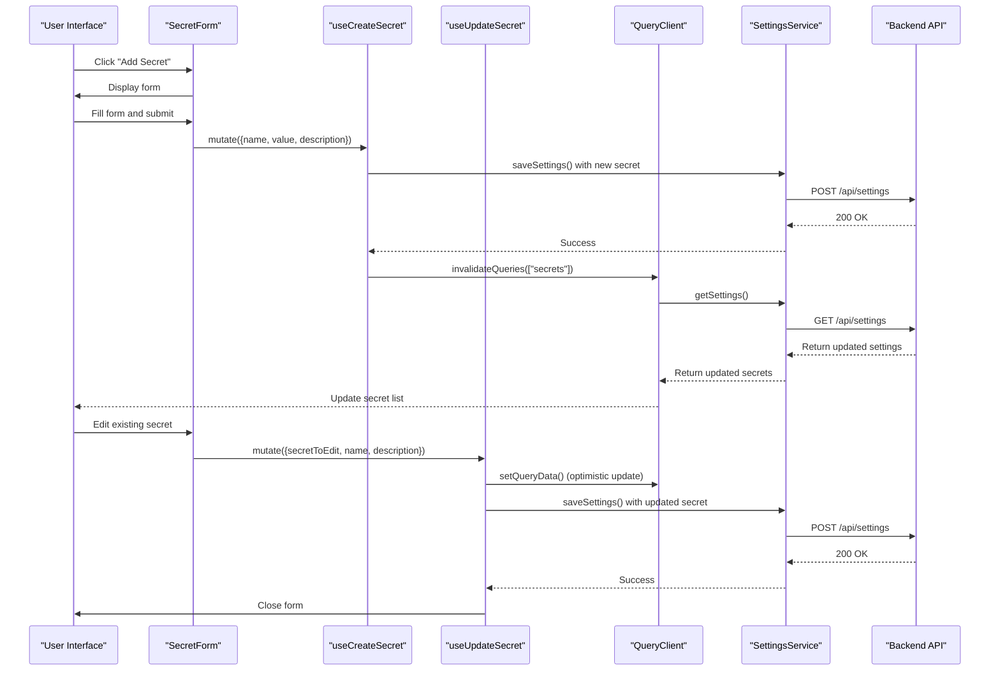
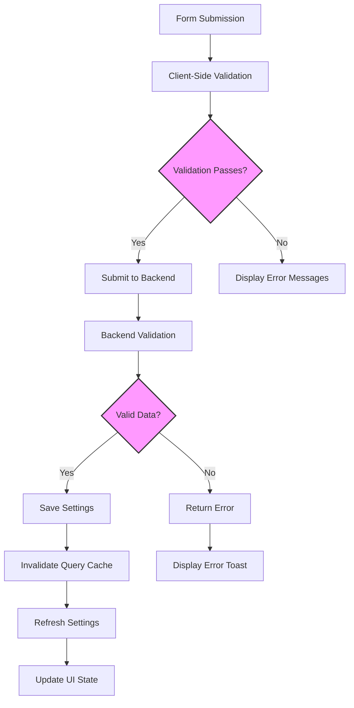
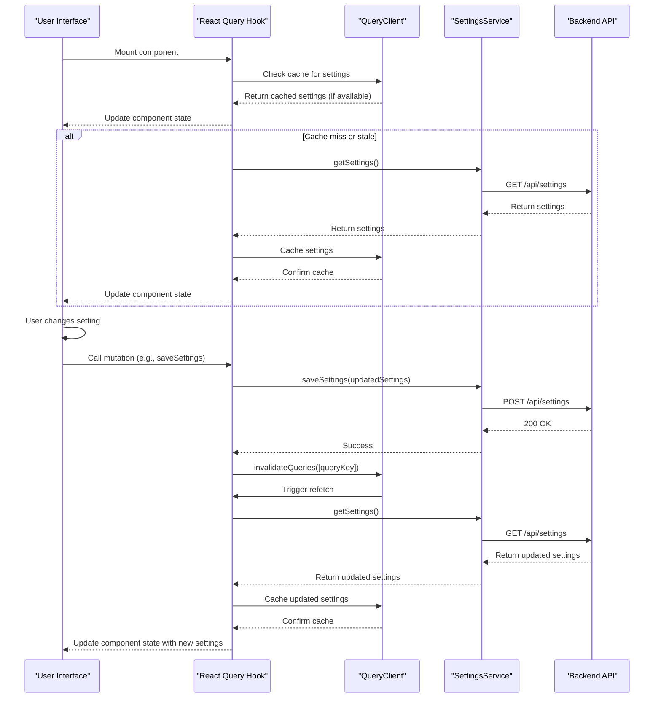

# Settings and Configuration Components

<cite>
**Referenced Files in This Document**   
- [settings-nav.tsx](file://frontend/src/constants/settings-nav.tsx)
- [settings-service.api.ts](file://frontend/src/settings-service/settings-service.api.ts)
- [settings.types.ts](file://frontend/src/settings-service/settings.types.ts)
- [api-keys-manager.tsx](file://frontend/src/components/features/settings/api-keys-manager.tsx)
- [app-settings-inputs-skeleton.tsx](file://frontend/src/components/features/settings/app-settings/app-settings-inputs-skeleton.tsx)
- [github-token-input.tsx](file://frontend/src/components/features/settings/git-settings/github-token-input.tsx)
- [llm-settings-inputs-skeleton.tsx](file://frontend/src/components/features/settings/llm-settings/llm-settings-inputs-skeleton.tsx)
- [mcp-server-list.tsx](file://frontend/src/components/features/settings/mcp-settings/mcp-server-list.tsx)
- [secret-form.tsx](file://frontend/src/components/features/settings/secrets-settings/secret-form.tsx)
- [settings-screen.tsx](file://frontend/src/routes/settings.tsx)
- [use-api-keys.ts](file://frontend/src/hooks/query/use-api-keys.ts)
- [api-keys.ts](file://frontend/src/api/api-keys.ts)
- [test_api_key_store.py](file://enterprise/tests/unit/test_api_key_store.py)
</cite>

## Table of Contents
1. [Introduction](#introduction)
2. [Settings Navigation and Layout](#settings-navigation-and-layout)
3. [Settings Service Architecture](#settings-service-architecture)
4. [API Keys Manager](#api-keys-manager)
5. [Application Settings](#application-settings)
6. [Git Settings](#git-settings)
7. [LLM Settings](#llm-settings)
8. [MCP Settings](#mcp-settings)
9. [Secrets Management](#secrets-management)
10. [Form Handling and Validation](#form-handling-and-validation)
11. [State Synchronization and Persistence](#state-synchronization-and-persistence)

## Introduction
The OpenHands platform provides a comprehensive settings and configuration system that enables users to customize application preferences, integrate with external services, configure AI models, manage tool integrations, and securely store credentials. This documentation details the architecture and implementation of the settings components, covering the navigation structure, individual settings sections, and the underlying mechanisms for form handling, validation, and state synchronization with the backend API.

## Settings Navigation and Layout

The settings navigation system organizes configuration options into logical categories accessible through a consistent sidebar layout. The navigation structure differs between SaaS and OSS (Open Source) versions of the application, providing tailored options for each deployment model.



**Diagram sources**
- [settings-nav.tsx](file://frontend/src/constants/settings-nav.tsx#L15-L84)

**Section sources**
- [settings-nav.tsx](file://frontend/src/constants/settings-nav.tsx#L1-L84)
- [settings-screen.tsx](file://frontend/src/routes/settings.tsx#L41-L80)

## Settings Service Architecture

The settings system is built around a centralized service architecture that handles communication between the frontend and backend. The SettingsService class provides methods for retrieving and saving user preferences, ensuring that only valid settings are persisted to the server.

```mermaid
classDiagram
class SettingsService {
+getSettings() : Promise~ApiSettings~
+saveSettings(settings : Partial~PostApiSettings~) : Promise~boolean~
}
class ApiSettings {
+llm_model : string
+llm_base_url : string
+agent : string
+language : string
+llm_api_key : string | null
+llm_api_key_set : boolean
+search_api_key_set : boolean
+confirmation_mode : boolean
+security_analyzer : string | null
+remote_runtime_resource_factor : number | null
+enable_default_condenser : boolean
+condenser_max_size : number | null
+enable_sound_notifications : boolean
+enable_proactive_conversation_starters : boolean
+enable_solvability_analysis : boolean
+user_consents_to_analytics : boolean | null
+search_api_key? : string
+provider_tokens_set : Partial~Record~Provider, string | null~~
+max_budget_per_task : number | null
+mcp_config? : MCPConfig
+email? : string
+email_verified? : boolean
+git_user_name? : string
+git_user_email? : string
}
class PostApiSettings {
+user_consents_to_analytics : boolean | null
+search_api_key? : string
+mcp_config? : MCPConfig
}
class MCPConfig {
+sse_servers : (string | { url : string; api_key? : string })[]
+stdio_servers : { name : string; command : string; args? : string[]; env? : Record~string, string~ }[]
+shttp_servers : (string | { url : string; api_key? : string })[]
}
SettingsService --> ApiSettings : "returns"
SettingsService --> PostApiSettings : "accepts"
ApiSettings --> MCPConfig : "contains"
PostApiSettings --> MCPConfig : "contains"
```

**Diagram sources**
- [settings-service.api.ts](file://frontend/src/settings-service/settings-service.api.ts#L7-L28)
- [settings.types.ts](file://frontend/src/settings-service/settings.types.ts#L3-L54)

**Section sources**
- [settings-service.api.ts](file://frontend/src/settings-service/settings-service.api.ts#L1-L29)
- [settings.types.ts](file://frontend/src/settings-service/settings.types.ts#L1-L54)

## API Keys Manager

The API Keys Manager component provides a complete interface for creating, viewing, and managing API keys with appropriate security considerations. It includes functionality for generating new keys, viewing existing keys with their metadata, and securely deleting keys when no longer needed.



**Diagram sources**
- [api-keys-manager.tsx](file://frontend/src/components/features/settings/api-keys-manager.tsx#L208-L320)
- [use-api-keys.ts](file://frontend/src/hooks/query/use-api-keys.ts#L7-L20)
- [api-keys.ts](file://frontend/src/api/api-keys.ts#L19-L48)

**Section sources**
- [api-keys-manager.tsx](file://frontend/src/components/features/settings/api-keys-manager.tsx#L134-L320)
- [use-api-keys.ts](file://frontend/src/hooks/query/use-api-keys.ts#L1-L20)
- [api-keys.ts](file://frontend/src/api/api-keys.ts#L1-L49)
- [test_api_key_store.py](file://enterprise/tests/unit/test_api_key_store.py#L152-L200)

## Application Settings

The Application Settings section allows users to configure general preferences that affect the overall behavior of the OpenHands platform. These settings include language selection, confirmation modes, sound notifications, and other user interface preferences.



**Diagram sources**
- [app-settings-inputs-skeleton.tsx](file://frontend/src/components/features/settings/app-settings/app-settings-inputs-skeleton.tsx#L4-L16)

**Section sources**
- [app-settings-inputs-skeleton.tsx](file://frontend/src/components/features/settings/app-settings/app-settings-inputs-skeleton.tsx#L1-L16)

## Git Settings

The Git Settings section enables users to configure integration with various Git providers including GitHub, GitLab, and Bitbucket. Users can set personal access tokens and host configurations to enable repository access and operations.



**Diagram sources**
- [github-token-input.tsx](file://frontend/src/components/features/settings/git-settings/github-token-input.tsx#L17-L68)

**Section sources**
- [github-token-input.tsx](file://frontend/src/components/features/settings/git-settings/github-token-input.tsx#L1-L68)

## LLM Settings

The LLM Settings section allows users to configure the language model parameters, including the model identifier, base URL for the LLM API, and API keys for authentication. This configuration enables users to customize the AI capabilities of the platform.



**Diagram sources**
- [llm-settings-inputs-skeleton.tsx](file://frontend/src/components/features/settings/llm-settings/llm-settings-inputs-skeleton.tsx#L5-L22)

**Section sources**
- [llm-settings-inputs-skeleton.tsx](file://frontend/src/components/features/settings/llm-settings/llm-settings-inputs-skeleton.tsx#L1-L22)

## MCP Settings

The MCP (Model Control Protocol) Settings section enables users to configure tool integrations through various server types including SSE (Server-Sent Events), SHTTP (Secure HTTP), and stdio servers. Users can add, edit, and delete server configurations with appropriate validation to prevent duplicate URLs.



**Diagram sources**
- [mcp-server-list.tsx](file://frontend/src/components/features/settings/mcp-settings/mcp-server-list.tsx#L23-L73)

**Section sources**
- [mcp-server-list.tsx](file://frontend/src/components/features/settings/mcp-settings/mcp-server-list.tsx#L1-L73)

## Secrets Management

The Secrets Management system provides secure storage and management of sensitive credentials and configuration values. Users can create, edit, and delete custom secrets with optional descriptions, ensuring that sensitive information is properly protected.



**Diagram sources**
- [secret-form.tsx](file://frontend/src/components/features/settings/secrets-settings/secret-form.tsx#L20-L204)

**Section sources**
- [secret-form.tsx](file://frontend/src/components/features/settings/secrets-settings/secret-form.tsx#L1-L204)

## Form Handling and Validation

The settings components implement comprehensive form handling and validation to ensure data integrity and provide a smooth user experience. Each settings section includes appropriate input components with validation rules and error handling.



**Section sources**
- [secret-form.tsx](file://frontend/src/components/features/settings/secrets-settings/secret-form.tsx#L100-L130)
- [mcp-server-form.validation.test.tsx](file://frontend/src/components/features/settings/mcp-settings/__tests__/mcp-server-form.validation.test.tsx#L53-L110)

## State Synchronization and Persistence

The settings system implements a robust state synchronization mechanism that ensures changes are properly persisted to the backend and propagated throughout the application. The system uses React Query for data fetching and caching, with automatic cache invalidation after mutations.



**Section sources**
- [settings-service.api.ts](file://frontend/src/settings-service/settings-service.api.ts#L11-L25)
- [use-api-keys.ts](file://frontend/src/hooks/query/use-api-keys.ts#L10-L16)
- [use-create-api-key.ts](file://frontend/src/hooks/mutation/use-create-api-key.ts#L8-L15)
- [use-delete-api-key.ts](file://frontend/src/hooks/mutation/use-delete-api-key.ts#L8-L16)