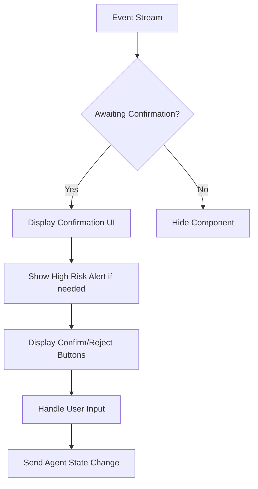
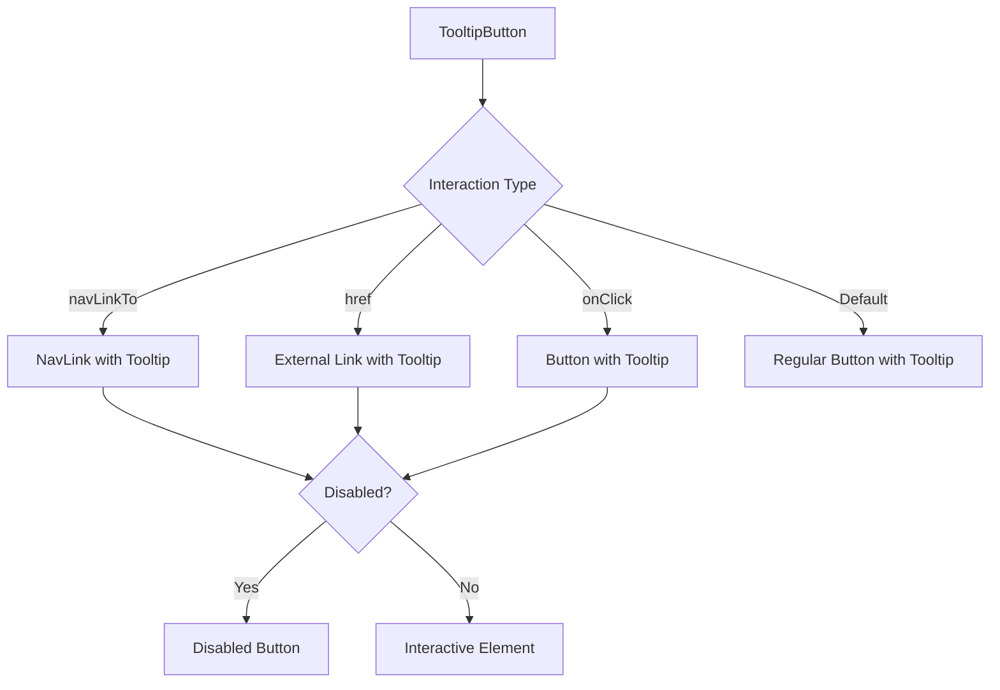

# Application Shared Components

<cite>
**Referenced Files in This Document**   
- [confirmation-buttons.tsx](file://frontend/src/components/shared/buttons/confirmation-buttons.tsx)
- [conversation-panel-button.tsx](file://frontend/src/components/shared/buttons/conversation-panel-button.tsx)
- [copy-to-clipboard-button.tsx](file://frontend/src/components/shared/buttons/copy-to-clipboard-button.tsx)
- [icon-button.tsx](file://frontend/src/components/shared/buttons/icon-button.tsx)
- [microagent-management-button.tsx](file://frontend/src/components/shared/buttons/microagent-management-button.tsx)
- [modal-button.tsx](file://frontend/src/components/shared/buttons/modal-button.tsx)
- [new-project-button.tsx](file://frontend/src/components/shared/buttons/new-project-button.tsx)
- [openhands-logo-button.tsx](file://frontend/src/components/shared/buttons/openhands-logo-button.tsx)
- [refresh-button.tsx](file://frontend/src/components/shared/buttons/refresh-button.tsx)
- [remove-button.tsx](file://frontend/src/components/shared/buttons/remove-button.tsx)
- [scroll-to-bottom-button.tsx](file://frontend/src/components/shared/buttons/scroll-to-bottom-button.tsx)
- [tooltip-button.tsx](file://frontend/src/components/shared/buttons/tooltip-button.tsx)
- [trajectory-action-button.tsx](file://frontend/src/components/shared/buttons/trajectory-action-button.tsx)
- [badge-input.tsx](file://frontend/src/components/shared/inputs/badge-input.tsx)
- [base-modal.tsx](file://frontend/src/components/shared/modals/base-modal/base-modal.tsx)
- [confirmation-modal.tsx](file://frontend/src/components/shared/modals/confirmation-modal.tsx)
- [settings-modal.tsx](file://frontend/src/components/shared/modals/settings/settings-modal.tsx)
- [modal-backdrop.tsx](file://frontend/src/components/shared/modals/modal-backdrop.tsx)
- [modal-body.tsx](file://frontend/src/components/shared/modals/modal-body.tsx)
- [action-tooltip.tsx](file://frontend/src/components/shared/action-tooltip.tsx)
- [badge.tsx](file://frontend/src/components/shared/badge.tsx)
- [git-provider-icon.tsx](file://frontend/src/components/shared/git-provider-icon.tsx)
- [loader.tsx](file://frontend/src/components/shared/loader.tsx)
- [loading-spinner.tsx](file://frontend/src/components/shared/loading-spinner.tsx)
- [risk-alert.tsx](file://frontend/src/components/shared/risk-alert.tsx)
</cite>

## Table of Contents
1. [Introduction](#introduction)
2. [Button Components](#button-components)
3. [Input Components](#input-components)
4. [Modal System](#modal-system)
5. [Shared Primitives](#shared-primitives)
6. [Component Integration and Usage](#component-integration-and-usage)
7. [Accessibility Implementation](#accessibility-implementation)
8. [Conclusion](#conclusion)

## Introduction
This document provides comprehensive documentation for the application-specific shared components in the OpenHands project. The shared components are designed to ensure consistency, reusability, and accessibility across the application. These components are organized into logical categories including buttons, inputs, modals, and shared primitives. The components leverage React with TypeScript and follow modern UI/UX principles to provide an intuitive user experience.

The shared components are located in the `frontend/src/components/shared` directory and are designed to be imported and used across various features of the application. They incorporate internationalization through react-i18next, proper accessibility attributes, and responsive design principles.

**Section sources**
- [confirmation-buttons.tsx](file://frontend/src/components/shared/buttons/confirmation-buttons.tsx)
- [conversation-panel-button.tsx](file://frontend/src/components/shared/buttons/conversation-panel-button.tsx)
- [copy-to-clipboard-button.tsx](file://frontend/src/components/shared/buttons/copy-to-clipboard-button.tsx)

## Button Components

### Confirmation Buttons
The ConfirmationButtons component provides a user interface for confirming or rejecting actions initiated by the agent. It monitors the event stream for actions that require user confirmation and displays appropriate buttons when such actions are detected. The component also implements keyboard shortcuts for improved accessibility: Shift+Cmd+Backspace to reject and Cmd+Enter to confirm.

**Diagram sources**
- [confirmation-buttons.tsx](file://frontend/src/components/shared/buttons/confirmation-buttons.tsx)

**Section sources**
- [confirmation-buttons.tsx](file://frontend/src/components/shared/buttons/confirmation-buttons.tsx)

### Conversation Panel Button
The ConversationPanelButton component toggles the visibility of the conversation panel sidebar. It uses a tooltip to provide context and changes its appearance based on whether the panel is currently open. The button displays a list icon and is styled differently when active to provide visual feedback to users.

**Section sources**
- [conversation-panel-button.tsx](file://frontend/src/components/shared/buttons/conversation-panel-button.tsx)

### Copy to Clipboard Button
The CopyToClipboardButton component provides functionality to copy content to the system clipboard. It has two states: "copy" and "copied", with corresponding icons (copy icon and checkmark icon). The button can be hidden or disabled based on props, and it provides appropriate aria-labels for accessibility.

**Section sources**
- [copy-to-clipboard-button.tsx](file://frontend/src/components/shared/buttons/copy-to-clipboard-button.tsx)

### Icon Button
The IconButton component is a generic button that displays an icon. It uses the @heroui/react Button component with a flat variant and is designed to be small and unobtrusive. The component accepts an icon element, click handler, aria-label, and optional test ID for testing purposes.

**Section sources**
- [icon-button.tsx](file://frontend/src/components/shared/buttons/icon-button.tsx)

### Microagent Management Button
The MicroagentManagementButton component provides navigation to the microagent management interface. It displays a robot icon and uses a tooltip to indicate its purpose. The button is disabled when the feature is not available, providing appropriate visual feedback.

**Section sources**
- [microagent-management-button.tsx](file://frontend/src/components/shared/buttons/microagent-management-button.tsx)

### Modal Button
The ModalButton component is designed for use within modal dialogs. It supports two variants: "default" with bold text and padding, and "text-like" with smaller, normal-weight text. The component can include an icon and supports different button types (button or submit). It also handles disabled states with reduced opacity.

**Section sources**
- [modal-button.tsx](file://frontend/src/components/shared/buttons/modal-button.tsx)

### New Project Button
The NewProjectButton component initiates a new project or conversation. It navigates to the root path when clicked and displays a plus icon. The button's color changes based on the current route, providing visual indication of the current location.

**Section sources**
- [new-project-button.tsx](file://frontend/src/components/shared/buttons/new-project-button.tsx)

### OpenHands Logo Button
The OpenHandsLogoButton component displays the OpenHands logo and serves as a navigation element back to the home page. It includes appropriate branding text for accessibility and uses a tooltip to identify its function.

**Section sources**
- [openhands-logo-button.tsx](file://frontend/src/components/shared/buttons/openhands-logo-button.tsx)

### Refresh Button
The RefreshButton component provides a simple refresh functionality with a refresh icon. It's a minimal button that can be used to reload content or refresh the current view.

**Section sources**
- [refresh-button.tsx](file://frontend/src/components/shared/buttons/refresh-button.tsx)

### Remove Button
The RemoveButton component displays a close icon within a circular button. It's designed for removing items and has a neutral gray background. The component accepts a click handler and optional className for customization.

**Section sources**
- [remove-button.tsx](file://frontend/src/components/shared/buttons/remove-button.tsx)

### Scroll to Bottom Button
The ScrollToBottomButton component allows users to quickly navigate to the bottom of a scrollable area. It uses an arrow icon rotated 180 degrees to indicate scrolling down and includes hover effects for better user feedback.

**Section sources**
- [scroll-to-bottom-button.tsx](file://frontend/src/components/shared/buttons/scroll-to-bottom-button.tsx)

### Tooltip Button
The TooltipButton component combines a button with a tooltip, providing contextual information when hovered. It supports multiple interaction types: regular buttons, navigation links (NavLink), and external links (href). The component handles disabled states appropriately and prevents navigation when disabled.

**Diagram sources**
- [tooltip-button.tsx](file://frontend/src/components/shared/buttons/tooltip-button.tsx)

**Section sources**
- [tooltip-button.tsx](file://frontend/src/components/shared/buttons/tooltip-button.tsx)

### Trajectory Action Button
The TrajectoryActionButton component (implementation not shown) is designed to handle actions related to trajectory management in the application. It likely provides controls for navigating or manipulating agent trajectories.

**Section sources**
- [trajectory-action-button.tsx](file://frontend/src/components/shared/buttons/trajectory-action-button.tsx)

## Input Components

### Badge Input
The BadgeInput component (located in inputs/badge-input.tsx) provides a specialized input field that displays values as badges. This component is likely used for tagging functionality or multi-select inputs where selected items are displayed as removable badges.

**Section sources**
- [badge-input.tsx](file://frontend/src/components/shared/inputs/badge-input.tsx)

## Modal System

### Base Modal
The BaseModal component serves as the foundation for all modal dialogs in the application. It includes header and footer content components and provides a structured layout for modal content. The base modal handles positioning, backdrop interaction, and basic accessibility features.

**Section sources**
- [base-modal.tsx](file://frontend/src/components/shared/modals/base-modal/base-modal.tsx)

### Confirmation Modals
The confirmation-modals directory contains specialized modal components for confirming user actions. These include base-modal.tsx and danger-modal.tsx, which provide different visual treatments for standard and high-risk operations respectively.

**Section sources**
- [base-modal.tsx](file://frontend/src/components/shared/modals/confirmation-modals/base-modal.tsx)
- [danger-modal.tsx](file://frontend/src/components/shared/modals/confirmation-modals/danger-modal.tsx)

### Settings Modal
The settings-modal.tsx component provides an interface for user settings management. It includes a model selector and settings form components, allowing users to configure various application preferences.

**Section sources**
- [settings-modal.tsx](file://frontend/src/components/shared/modals/settings/settings-modal.tsx)

### Modal Backdrop
The modal-backdrop.tsx component creates the overlay that appears behind modal dialogs. It handles click events outside the modal to close the dialog and provides visual dimming of the background content.

**Section sources**
- [modal-backdrop.tsx](file://frontend/src/components/shared/modals/modal-backdrop.tsx)

### Modal Body
The modal-body.tsx component defines the main content area of modal dialogs. It provides appropriate padding and scrolling behavior for modal content.

**Section sources**
- [modal-body.tsx](file://frontend/src/components/shared/modals/modal-body.tsx)

## Shared Primitives

### Action Tooltip
The action-tooltip.tsx component provides tooltip functionality for action buttons. It's used by various button components to display contextual information when users hover over interactive elements.

**Section sources**
- [action-tooltip.tsx](file://frontend/src/components/shared/action-tooltip.tsx)

### Badge
The badge.tsx component displays information badges with different visual styles. Badges are used to highlight status, counts, or other metadata in a compact format.

**Section sources**
- [badge.tsx](file://frontend/src/components/shared/badge.tsx)

### Git Provider Icon
The git-provider-icon.tsx component displays icons for different Git providers (GitHub, GitLab, etc.). It standardizes the visual representation of version control systems throughout the application.

**Section sources**
- [git-provider-icon.tsx](file://frontend/src/components/shared/git-provider-icon.tsx)

### Loader
The loader.tsx component provides a loading indicator for asynchronous operations. It gives users visual feedback when content is being fetched or processed.

**Section sources**
- [loader.tsx](file://frontend/src/components/shared/loader.tsx)

### Loading Spinner
The loading-spinner.tsx component displays a spinner animation during loading states. It's a more specific loading indicator that can be used in various contexts throughout the application.

**Section sources**
- [loading-spinner.tsx](file://frontend/src/components/shared/loading-spinner.tsx)

### Risk Alert
The risk-alert.tsx component displays warnings for high-risk operations. It includes a title, content, and severity level, with visual styling appropriate to the risk level. This component is used by the confirmation buttons when high-risk actions require user approval.

**Section sources**
- [risk-alert.tsx](file://frontend/src/components/shared/risk-alert.tsx)

## Component Integration and Usage
The shared components are designed to be imported and used across various features of the OpenHands application. They follow a consistent pattern of prop-based configuration and support internationalization through the i18n system. Components are typically imported using the "#/components/shared" alias for cleaner imports.

The button components are extensively used in the application's navigation, action confirmation, and content manipulation interfaces. Modal components provide consistent dialog experiences across different features, while shared primitives ensure visual consistency for common UI patterns.

## Accessibility Implementation
All shared components incorporate accessibility best practices:
- Proper aria-labels for screen readers
- Keyboard navigation support
- Focus management
- Semantic HTML elements
- Color contrast compliance
- Tooltip text for icon-only buttons
- Disabled state indicators

The components also support internationalization through the react-i18next library, with all visible text extracted to translation files using the I18nKey type for type safety.

## Conclusion
The shared components in OpenHands provide a comprehensive UI library that ensures consistency, accessibility, and reusability across the application. By centralizing common UI patterns in the shared directory, the codebase maintains a cohesive design language while enabling rapid development of new features. The components are well-documented, type-safe, and follow modern React best practices.