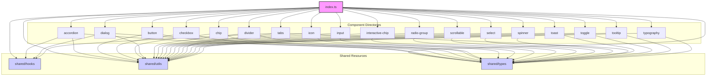
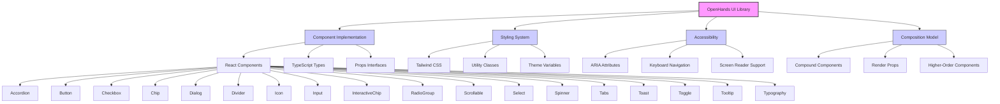
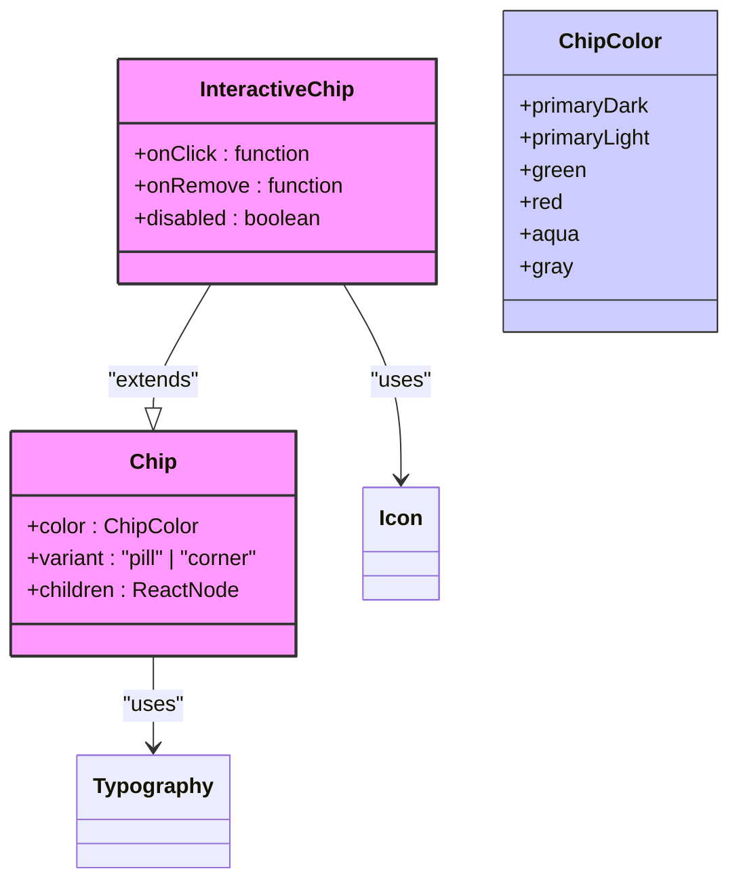
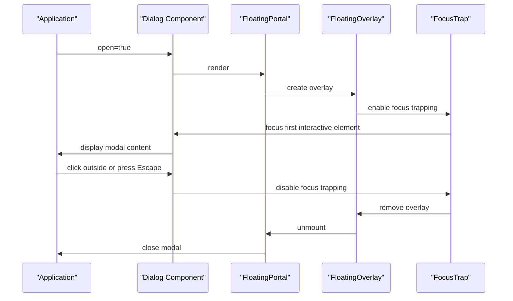
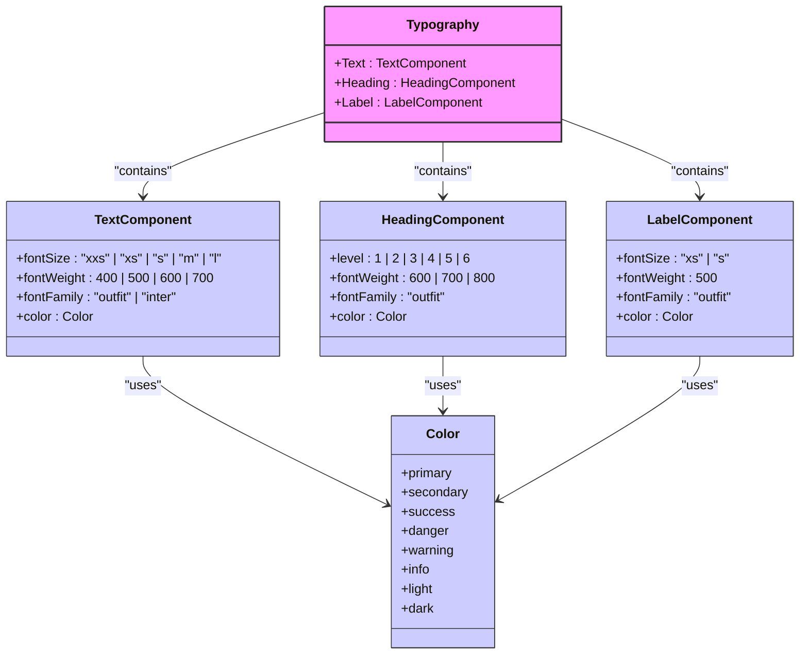

# OpenHands UI Component Library

<cite>
**Referenced Files in This Document**   
- [Accordion.tsx](file://openhands-ui/components/accordion/Accordion.tsx)
- [AccordionHeader.tsx](file://openhands-ui/components/accordion/components/AccordionHeader.tsx)
- [AccordionItem.tsx](file://openhands-ui/components/accordion/components/AccordionItem.tsx)
- [AccordionPanel.tsx](file://openhands-ui/components/accordion/components/AccordionPanel.tsx)
- [Button.tsx](file://openhands-ui/components/button/Button.tsx)
- [utils.ts](file://openhands-ui/components/button/utils.ts)
- [Checkbox.tsx](file://openhands-ui/components/checkbox/Checkbox.tsx)
- [Chip.tsx](file://openhands-ui/components/chip/Chip.tsx)
- [utils.ts](file://openhands-ui/components/chip/utils.ts)
- [Dialog.tsx](file://openhands-ui/components/dialog/Dialog.tsx)
- [Divider.tsx](file://openhands-ui/components/divider/Divider.tsx)
- [Icon.tsx](file://openhands-ui/components/icon/Icon.tsx)
- [Input.tsx](file://openhands-ui/components/input/Input.tsx)
- [InteractiveChip.tsx](file://openhands-ui/components/interactive-chip/InteractiveChip.tsx)
- [RadioGroup.tsx](file://openhands-ui/components/radio-group/RadioGroup.tsx)
- [RadioOption.tsx](file://openhands-ui/components/radio-group/RadioOption.tsx)
- [Scrollable.tsx](file://openhands-ui/components/scrollable/Scrollable.tsx)
- [Select.tsx](file://openhands-ui/components/select/Select.tsx)
- [Spinner.tsx](file://openhands-ui/components/spinner/Spinner.tsx)
- [Tabs.tsx](file://openhands-ui/components/tabs/Tabs.tsx)
- [Toast.tsx](file://openhands-ui/components/toast/Toast.tsx)
- [ToastManager.tsx](file://openhands-ui/components/toast/ToastManager.tsx)
- [Toggle.tsx](file://openhands-ui/components/toggle/Toggle.tsx)
- [Tooltip.tsx](file://openhands-ui/components/tooltip/Tooltip.tsx)
- [Typography.tsx](file://openhands-ui/components/typography/Typography.tsx)
- [BaseTypography.tsx](file://openhands-ui/components/typography/BaseTypography.tsx)
- [index.ts](file://openhands-ui/index.ts)
- [package.json](file://openhands-ui/package.json)
- [tailwind.config.js](file://frontend/tailwind.config.js)
</cite>

## Table of Contents
1. [Introduction](#introduction)
2. [Project Structure](#project-structure)
3. [Core Components](#core-components)
4. [Architecture Overview](#architecture-overview)
5. [Detailed Component Analysis](#detailed-component-analysis)
6. [Theming with Tailwind CSS](#theming-with-tailwind-css)
7. [Accessibility Features](#accessibility-features)
8. [Usage Guidelines](#usage-guidelines)
9. [Conclusion](#conclusion)

## Introduction
The OpenHands UI Component Library is a comprehensive collection of reusable React components designed to provide a consistent and accessible user interface across OpenHands applications. Built with TypeScript and styled using Tailwind CSS, this library offers a wide range of components from basic inputs to complex interactive elements. The components are designed with accessibility in mind, following ARIA guidelines and providing proper keyboard navigation. This documentation provides detailed information about each component, including their props, usage patterns, styling options, and accessibility features.

## Project Structure
The OpenHands UI component library follows a modular structure with components organized in dedicated directories. Each component has its own folder containing the main implementation file, storybook stories, and any subcomponents or utilities. The library exports all components through a central index file, making them easily importable. Shared utilities and types are located in the shared directory, promoting code reuse across components.



**Diagram sources**
- [index.ts](file://openhands-ui/index.ts)
- [shared/hooks](file://openhands-ui/shared/hooks)
- [shared/utils](file://openhands-ui/shared/utils)
- [shared/types](file://openhands-ui/shared/types)

**Section sources**
- [index.ts](file://openhands-ui/index.ts)
- [package.json](file://openhands-ui/package.json)

## Core Components
The OpenHands UI library provides a comprehensive set of components for building modern web interfaces. These components are designed to be accessible, themeable, and easy to use. The library includes interactive elements like buttons, checkboxes, and toggles; information display components like chips and typography; and complex composite components like accordions, dialogs, and tabs. Each component is built with accessibility in mind, following ARIA guidelines and providing proper keyboard navigation. The components are styled using Tailwind CSS utility classes, allowing for easy customization and theming.

**Section sources**
- [index.ts](file://openhands-ui/index.ts)
- [package.json](file://openhands-ui/package.json)

## Architecture Overview
The OpenHands UI component library follows a modular architecture with a clear separation of concerns. Components are organized in dedicated directories with their implementations, stories, and utilities. The library leverages Tailwind CSS for styling, using utility classes for consistent and maintainable styles. Shared utilities and types are centralized in the shared directory to promote code reuse. The components are designed to be composable, allowing developers to build complex interfaces from simple building blocks. The library uses React's composition model extensively, with components like Accordion exposing subcomponents as static properties.



**Diagram sources**
- [index.ts](file://openhands-ui/index.ts)
- [package.json](file://openhands-ui/package.json)

## Detailed Component Analysis

### Accordion Component Analysis
The Accordion component provides a collapsible container for content, allowing users to expand and collapse sections. It supports both single and multi-expansion modes through the type prop. The component is implemented as a compound component, exposing Accordion.Item as a static property. The AccordionItem component contains an AccordionHeader and AccordionPanel, providing a complete accordion item with header and content. The component uses data attributes for styling based on expansion state and provides proper ARIA attributes for accessibility.

```mermaid
classDiagram
class Accordion {
+expandedKeys : string[]
+type : "multi" | "single"
+setExpandedKeys(keys : string[]) : void
+children : ReactNode
}
class AccordionItem {
+icon : IconName
+expanded : boolean
+value : string
+label : ReactNode
+onExpandedChange(expanded : boolean) : void
}
class AccordionHeader {
+icon : IconName
+expanded : boolean
}
class AccordionPanel {
+expanded : boolean
}
Accordion --> AccordionItem : "contains"
AccordionItem --> AccordionHeader : "contains"
AccordionItem --> AccordionPanel : "contains"
AccordionHeader --> Icon : "uses"
AccordionHeader --> Typography : "uses"
AccordionPanel --> "Content" : "contains"
```

**Diagram sources**
- [Accordion.tsx](file://openhands-ui/components/accordion/Accordion.tsx)
- [AccordionItem.tsx](file://openhands-ui/components/accordion/components/AccordionItem.tsx)
- [AccordionHeader.tsx](file://openhands-ui/components/accordion/components/AccordionHeader.tsx)
- [AccordionPanel.tsx](file://openhands-ui/components/accordion/components/AccordionPanel.tsx)

**Section sources**
- [Accordion.tsx](file://openhands-ui/components/accordion/Accordion.tsx)
- [AccordionItem.tsx](file://openhands-ui/components/accordion/components/AccordionItem.tsx)

### Button Component Analysis
The Button component provides a styled button with multiple variants and sizes. It supports primary, secondary, and tertiary variants, each with distinct visual styles. The component can display start and end icons, and automatically adjusts text width when bolded. The button uses utility classes for styling and provides proper ARIA attributes for accessibility. The component's styles are defined in a utility file, making them easily maintainable and consistent across the library.

```mermaid
classDiagram
class Button {
+size : "small" | "large"
+variant : "primary" | "secondary" | "tertiary"
+start : ReactElement
+end : ReactElement
+children : ReactNode
}
class ButtonStyles {
+primary : ButtonStyle
+secondary : ButtonStyle
+tertiary : ButtonStyle
}
class ButtonStyle {
+button : string
+icon : string
+text : string
}
Button --> ButtonStyles : "uses"
ButtonStyles --> ButtonStyle : "contains"
Button --> Icon : "uses"
Button --> "Text" : "contains"
style Button fill : #f9f,stroke : #333,stroke-width : 2px
style ButtonStyles fill : #ccf,stroke : #333,stroke-width : 1px
style ButtonStyle fill : #ccf,stroke : #333,stroke-width : 1px
```

**Diagram sources**
- [Button.tsx](file://openhands-ui/components/button/Button.tsx)
- [utils.ts](file://openhands-ui/components/button/utils.ts)

**Section sources**
- [Button.tsx](file://openhands-ui/components/button/Button.tsx)
- [utils.ts](file://openhands-ui/components/button/utils.ts)

### Checkbox Component Analysis
The Checkbox component provides a styled checkbox input with a label. It uses a hidden native checkbox input for accessibility and state management, with a custom-styled div for visual representation. The component displays a check icon when checked and provides visual feedback for hover, focus, and disabled states. The label is properly associated with the input using htmlFor, ensuring accessibility. The component uses utility classes for styling and provides proper ARIA attributes.

```mermaid
classDiagram
class Checkbox {
+label : ReactNode
+labelClassName : string
+checked : boolean
+disabled : boolean
+onChange : function
}
Checkbox --> "Hidden Input" : "contains"
Checkbox --> "Custom Checkbox" : "contains"
Checkbox --> Typography : "uses"
Checkbox --> Icon : "uses"
class "Custom Checkbox" {
+border : light-neutral-500
+background : light-neutral-950
+checked : primary-500
+hover : light-neutral-900
+focus : light-neutral-900
}
"Custom Checkbox" --> Icon : "displays when checked"
style Checkbox fill : #f9f,stroke : #333,stroke-width : 2px
style "Custom Checkbox" fill : #ccf,stroke : #333,stroke-width : 1px
```

**Diagram sources**
- [Checkbox.tsx](file://openhands-ui/components/checkbox/Checkbox.tsx)

**Section sources**
- [Checkbox.tsx](file://openhands-ui/components/checkbox/Checkbox.tsx)

### Chip and InteractiveChip Component Analysis
The Chip component provides a compact way to display information or tags. It supports multiple colors and variants (pill and corner). The component uses utility classes for styling and provides consistent typography. The InteractiveChip extends the base Chip with interactive capabilities, allowing it to respond to user actions. Both components are designed to be lightweight and easily customizable.



**Diagram sources**
- [Chip.tsx](file://openhands-ui/components/chip/Chip.tsx)
- [utils.ts](file://openhands-ui/components/chip/utils.ts)
- [InteractiveChip.tsx](file://openhands-ui/components/interactive-chip/InteractiveChip.tsx)

**Section sources**
- [Chip.tsx](file://openhands-ui/components/chip/Chip.tsx)
- [utils.ts](file://openhands-ui/components/chip/utils.ts)
- [InteractiveChip.tsx](file://openhands-ui/components/interactive-chip/InteractiveChip.tsx)

### Dialog Component Analysis
The Dialog component provides a modal dialog for displaying content. It uses the Floating UI library for positioning and animations, and Focus Trap for managing focus within the dialog. The component is fully accessible, with proper ARIA attributes and keyboard navigation. It supports opening and closing through the open prop and onOpenChange callback. The dialog is rendered in a portal to ensure proper stacking and positioning.



**Diagram sources**
- [Dialog.tsx](file://openhands-ui/components/dialog/Dialog.tsx)

**Section sources**
- [Dialog.tsx](file://openhands-ui/components/dialog/Dialog.tsx)

### Select Component Analysis
The Select component provides a custom dropdown select input. It uses react-select under the hood for functionality and is styled with Tailwind CSS. The component supports custom dropdown indicators, placeholders, and single value displays. It provides proper accessibility features and keyboard navigation. The component is composed of multiple subcomponents that can be customized as needed.

```mermaid
classDiagram
class Select {
+options : Array
+value : any
+onChange : function
+isDisabled : boolean
+placeholder : string
}
class DropdownIndicator {
+isDisabled : boolean
+isFocused : boolean
}
class Option {
+data : any
+isSelected : boolean
+isFocused : boolean
}
class Placeholder {
+children : ReactNode
}
class SingleValue {
+data : any
}
Select --> DropdownIndicator : "uses"
Select --> Option : "renders"
Select --> Placeholder : "uses"
Select --> SingleValue : "uses"
Select --> "Input" : "extends"
style Select fill : #f9f,stroke : #333,stroke-width : 2px
style DropdownIndicator fill : #ccf,stroke : #333,stroke-width : 1px
style Option fill : #ccf,stroke : #333,stroke-width : 1px
style Placeholder fill : #ccf,stroke : #333,stroke-width : 1px
style SingleValue fill : #ccf,stroke : #333,stroke-width : 1px
```

**Diagram sources**
- [Select.tsx](file://openhands-ui/components/select/Select.tsx)
- [DropdownIndicator.tsx](file://openhands-ui/components/select/components/DropdownIndicator.tsx)
- [Option.tsx](file://openhands-ui/components/select/components/Option.tsx)
- [Placeholder.tsx](file://openhands-ui/components/select/components/Placeholder.tsx)
- [SingleValue.tsx](file://openhands-ui/components/select/components/SingleValue.tsx)

**Section sources**
- [Select.tsx](file://openhands-ui/components/select/Select.tsx)

### Tabs Component Analysis
The Tabs component provides a tabbed interface for organizing content. It supports horizontal scrolling when tabs overflow and provides visual indicators for the active tab. The component uses subcomponents for individual tab items and a scroller for overflow handling. It provides proper ARIA attributes for accessibility and supports keyboard navigation between tabs.

```mermaid
classDiagram
class Tabs {
+activeTab : string
+onTabChange : function
+children : ReactNode
}
class TabItem {
+value : string
+label : string
+isActive : boolean
}
class TabScroller {
+hasOverflow : boolean
+scrollPosition : number
+scrollTo : function
}
class useElementOverflow {
+ref : RefObject
+return : boolean
}
class useElementScroll {
+ref : RefObject
+return : ScrollState
}
Tabs --> TabItem : "contains"
Tabs --> TabScroller : "uses"
TabScroller --> useElementOverflow : "uses"
TabScroller --> useElementScroll : "uses"
Tabs --> "Content" : "displays based on active tab"
style Tabs fill : #f9f,stroke : #333,stroke-width : 2px
style TabItem fill : #ccf,stroke : #333,stroke-width : 1px
style TabScroller fill : #ccf,stroke : #333,stroke-width : 1px
style useElementOverflow fill : #ccf,stroke : #333,stroke-width : 1px
style useElementScroll fill : #ccf,stroke : #333,stroke-width : 1px
```

**Diagram sources**
- [Tabs.tsx](file://openhands-ui/components/tabs/Tabs.tsx)
- [TabItem.tsx](file://openhands-ui/components/tabs/components/TabItem.tsx)
- [TabScroller.tsx](file://openhands-ui/components/tabs/components/TabScroller.tsx)
- [use-element-overflow.tsx](file://openhands-ui/components/tabs/hooks/use-element-overflow.tsx)
- [use-element-scroll.tsx](file://openhands-ui/components/tabs/hooks/use-element-scroll.tsx)

**Section sources**
- [Tabs.tsx](file://openhands-ui/components/tabs/Tabs.tsx)

### Toast and Toast Manager Analysis
The Toast component provides temporary notifications to users. The ToastManager handles the creation, display, and removal of toast notifications. Toasts can have different types (success, error, info) and can be dismissed automatically or by user interaction. The system uses the Sonner library for animations and positioning.

```mermaid
classDiagram
class ToastManager {
+toasts : Array
+addToast : function
+removeToast : function
+updateToast : function
}
class Toast {
+id : string
+type : "success" | "error" | "info" | "warning"
+title : string
+description : string
+duration : number
+onDismiss : function
+isVisible : boolean
}
class toasterMessages {
+success : string
+error : string
+info : string
+warning : string
}
ToastManager --> Toast : "manages"
ToastManager --> toasterMessages : "uses"
Toast --> "Icon" : "displays based on type"
Toast --> "Close Button" : "contains"
style ToastManager fill : #f9f,stroke : #333,stroke-width : 2px
style Toast fill : #ccf,stroke : #333,stroke-width : 1px
style toasterMessages fill : #ccf,stroke : #333,stroke-width : 1px
```

**Diagram sources**
- [ToastManager.tsx](file://openhands-ui/components/toast/ToastManager.tsx)
- [Toast.tsx](file://openhands-ui/components/toast/Toast.tsx)

**Section sources**
- [ToastManager.tsx](file://openhands-ui/components/toast/ToastManager.tsx)
- [Toast.tsx](file://openhands-ui/components/toast/Toast.tsx)

### Typography Component Analysis
The Typography component provides consistent text styling across the application. It supports various text elements (paragraph, span, label) and typographic styles (headings, body text, captions). The component uses utility classes for font family, size, weight, and color, ensuring visual consistency.



**Diagram sources**
- [Typography.tsx](file://openhands-ui/components/typography/Typography.tsx)
- [BaseTypography.tsx](file://openhands-ui/components/typography/BaseTypography.tsx)

**Section sources**
- [Typography.tsx](file://openhands-ui/components/typography/Typography.tsx)
- [BaseTypography.tsx](file://openhands-ui/components/typography/BaseTypography.tsx)

## Theming with Tailwind CSS
The OpenHands UI component library uses Tailwind CSS for styling, providing a utility-first approach to CSS. The library leverages Tailwind's theme configuration to define color palettes, spacing, typography, and other design tokens. Components use utility classes for styling, making them easily customizable and maintainable. The theme is configured in the tailwind.config.js file, which defines the color palette, font families, spacing scale, and other design tokens used throughout the components.

```mermaid
graph TD
A[Tailwind CSS Theme] --> B[Colors]
A --> C[Spacing]
A --> D[Typography]
A --> E[Border Radius]
A --> F[Shadows]
B --> G[Primary: #006FEE]
B --> H[Secondary: #6B7280]
B --> I[Success: #10B981]
B --> J[Error: #EF4444]
B --> K[Warning: #F59E0B]
B --> L[Info: #3B82F6]
C --> M[Spacing Scale: 0.5rem increments]
C --> N[Padding: p-1 to p-12]
C --> O[Margin: m-1 to m-12]
D --> P[Font Families: Outfit, Inter]
D --> Q[Font Sizes: text-xs to text-4xl]
D --> R[Font Weights: font-normal to font-bold]
E --> S[Border Radius: rounded-none to rounded-full]
E --> T[Custom: rounded-2xl, rounded-4xl]
F --> U[Shadows: shadow-sm to shadow-xl]
style A fill:#f9f,stroke:#333,stroke-width:2px
style B fill:#ccf,stroke:#333,stroke-width:1px
style C fill:#ccf,stroke:#333,stroke-width:1px
style D fill:#ccf,stroke:#333,stroke-width:1px
style E fill:#ccf,stroke:#333,stroke-width:1px
style F fill:#ccf,stroke:#333,stroke-width:1px
```



**Diagram sources**
- [tailwind.config.js](file://frontend/tailwind.config.js)
- [tokens.css](file://openhands-ui/tokens.css)

**Section sources**
- [tailwind.config.js](file://frontend/tailwind.config.js)
- [tokens.css](file://openhands-ui/tokens.css)

## Accessibility Features
The OpenHands UI component library prioritizes accessibility, following WCAG guidelines and ARIA best practices. Components include proper semantic HTML, ARIA attributes, keyboard navigation, and screen reader support. The library uses focus trapping for modals, proper label associations for form elements, and appropriate ARIA roles and states for interactive components. All interactive elements are keyboard accessible, with visible focus indicators and logical tab order.

```mermaid
graph TD
A[Accessibility Features] --> B[Semantic HTML]
A --> C[ARIA Attributes]
A --> D[Keyboard Navigation]
A --> E[Screen Reader Support]
A --> F[Focus Management]
A --> G[Color Contrast]
B --> H[Proper heading hierarchy]
B --> I[Semantic elements: button, input, label]
B --> J[Landmarks: main, navigation, aside]
C --> K[aria-label, aria-labelledby]
C --> L[aria-describedby, aria-hidden]
C --> M[aria-expanded, aria-selected]
C --> N[aria-disabled, aria-current]
D --> O[Tab navigation]
D --> P[Arrow key navigation]
D --> Q[Enter/Space activation]
D --> R[Escape to close]
E --> S[Screen reader announcements]
E --> T[Descriptive labels]
E --> U[Status messages]
F --> V[Focus trapping in modals]
F --> W[Focus restoration]
F --> X[Visible focus indicators]
G --> Y[Sufficient color contrast]
G --> Z[Color blindness considerations]
style A fill:#f9f,stroke:#333,stroke-width:2px
style B fill:#ccf,stroke:#333,stroke-width:1px
style C fill:#ccf,stroke:#333,stroke-width:1px
style D fill:#ccf,stroke:#333,stroke-width:1px
style E fill:#ccf,stroke:#333,stroke-width:1px
style F fill:#ccf,stroke:#333,stroke-width:1px
style G fill:#ccf,stroke:#333,stroke-width:1px
```



**Diagram sources**
- [Button.tsx](file://openhands-ui/components/button/Button.tsx)
- [Checkbox.tsx](file://openhands-ui/components/checkbox/Checkbox.tsx)
- [Dialog.tsx](file://openhands-ui/components/dialog/Dialog.tsx)
- [Tabs.tsx](file://openhands-ui/components/tabs/Tabs.tsx)

**Section sources**
- [Button.tsx](file://openhands-ui/components/button/Button.tsx)
- [Checkbox.tsx](file://openhands-ui/components/checkbox/Checkbox.tsx)
- [Dialog.tsx](file://openhands-ui/components/dialog/Dialog.tsx)
- [Tabs.tsx](file://openhands-ui/components/tabs/Tabs.tsx)

## Usage Guidelines
When using the OpenHands UI component library, follow these guidelines to ensure consistent and accessible interfaces:

1. **Import Components**: Import components from the main index file:
```typescript
import { Button, Checkbox, Typography } from '@openhands/ui';
```

2. **Use Semantic Props**: Use the provided props to control component behavior and appearance:
```typescript
<Button variant="primary" size="large" start={<Icon icon="Plus" />}>
  Create New
</Button>
```

3. **Accessibility**: Ensure all interactive elements have proper labels and keyboard support:
```typescript
<Checkbox 
  label="Enable notifications" 
  checked={notificationsEnabled}
  onChange={handleToggleNotifications}
/>
```

4. **Theming**: Customize components using the provided theme tokens and utility classes:
```typescript
<div className="bg-light-neutral-900 text-light-neutral-15 p-4 rounded-2xl">
  <Typography.Heading level={3}>Section Title</Typography.Heading>
  <Typography.Text fontSize="m">Section content</Typography.Text>
</div>
```

5. **Composition**: Combine components to create complex interfaces:
```typescript
<Dialog open={showModal} onOpenChange={setShowModal}>
  <Typography.Heading level={2}>Confirmation</Typography.Heading>
  <Typography.Text fontSize="m">Are you sure you want to proceed?</Typography.Text>
  <div className="flex gap-4 mt-6">
    <Button variant="secondary" onClick={() => setShowModal(false)}>
      Cancel
    </Button>
    <Button variant="primary" onClick={handleConfirm}>
      Confirm
    </Button>
  </div>
</Dialog>
```

6. **Responsive Design**: Use Tailwind's responsive prefixes to adapt layouts:
```typescript
<div className="flex flex-col md:flex-row gap-4">
  <div className="w-full md:w-1/2">Content</div>
  <div className="w-full md:w-1/2">Sidebar</div>
</div>
```

7. **Performance**: Minimize re-renders by using memoization when appropriate:
```typescript
const MemoizedComponent = React.memo(({ items }) => {
  return items.map(item => <ListItem key={item.id} item={item} />);
});
```

**Section sources**
- [index.ts](file://openhands-ui/index.ts)
- [Button.tsx](file://openhands-ui/components/button/Button.tsx)
- [Checkbox.tsx](file://openhands-ui/components/checkbox/Checkbox.tsx)
- [Dialog.tsx](file://openhands-ui/components/dialog/Dialog.tsx)
- [Typography.tsx](file://openhands-ui/components/typography/Typography.tsx)

## Conclusion
The OpenHands UI component library provides a comprehensive set of accessible, themeable, and reusable components for building modern web interfaces. By following the usage guidelines and leveraging the library's features, developers can create consistent and accessible user experiences across OpenHands applications. The library's modular architecture and use of Tailwind CSS make it easy to customize and extend components to meet specific design requirements. With proper implementation and adherence to accessibility best practices, the OpenHands UI components can help create inclusive and user-friendly interfaces.