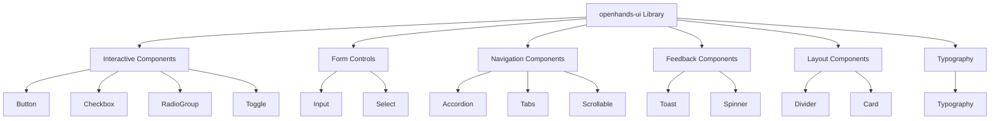
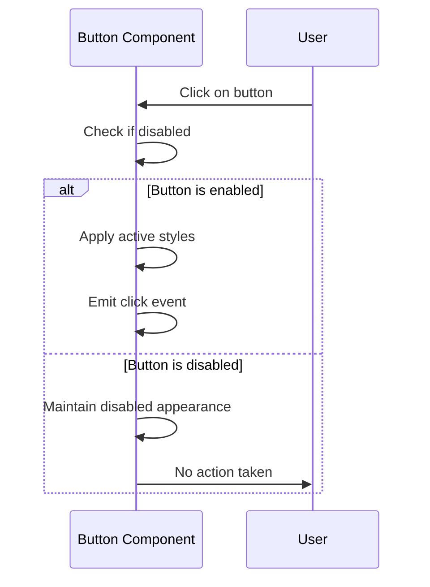
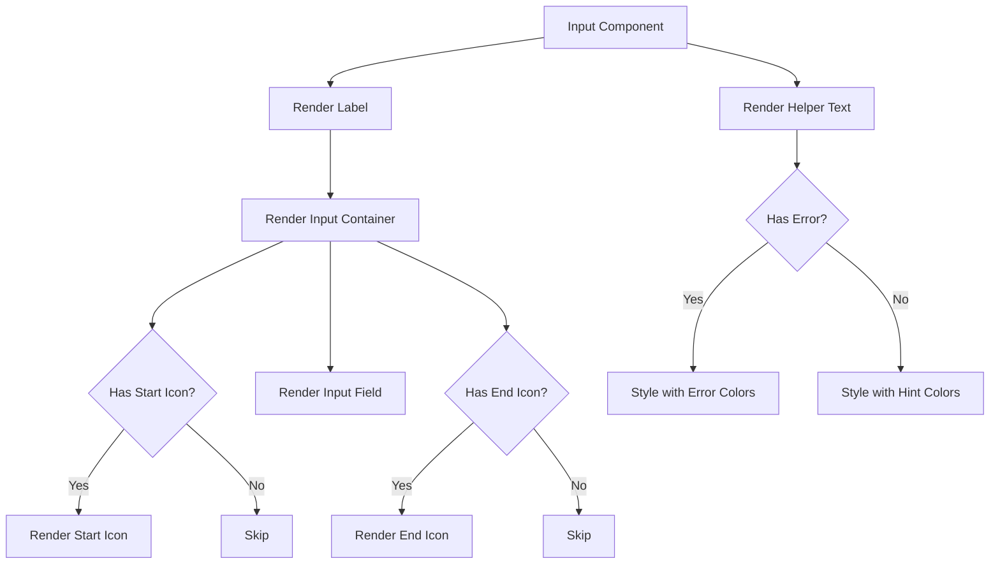
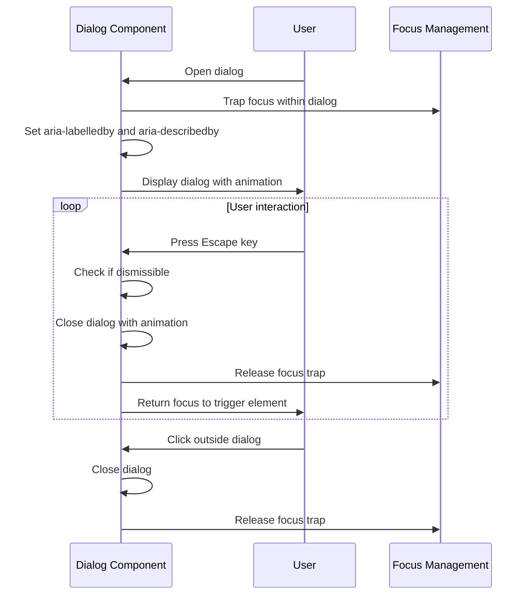
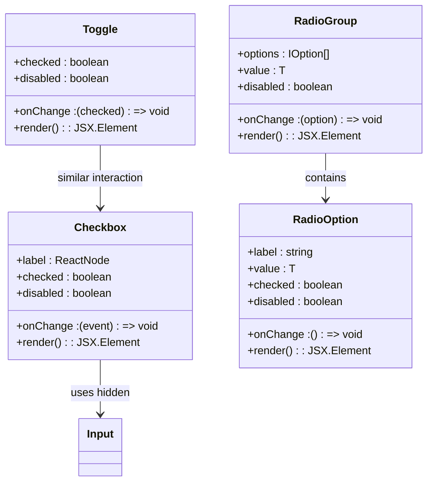
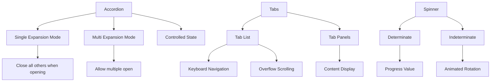
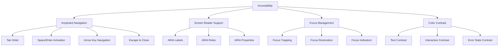

# Shared UI Components and Primitives

<cite>
**Referenced Files in This Document**   
- [Button.tsx](file://openhands-ui/components/button/Button.tsx)
- [Input.tsx](file://openhands-ui/components/input/Input.tsx)
- [Dialog.tsx](file://openhands-ui/components/dialog/Dialog.tsx)
- [Select.tsx](file://openhands-ui/components/select/Select.tsx)
- [Toast.tsx](file://openhands-ui/components/toast/Toast.tsx)
- [Checkbox.tsx](file://openhands-ui/components/checkbox/Checkbox.tsx)
- [RadioGroup.tsx](file://openhands-ui/components/radio-group/RadioGroup.tsx)
- [Accordion.tsx](file://openhands-ui/components/accordion/Accordion.tsx)
- [Chip.tsx](file://openhands-ui/components/chip/Chip.tsx)
- [Spinner.tsx](file://openhands-ui/components/spinner/Spinner.tsx)
- [card.tsx](file://frontend/src/ui/card.tsx)
- [context-menu.tsx](file://frontend/src/ui/context-menu.tsx)
- [types.ts](file://openhands-ui/shared/types.ts)
- [cn.ts](file://openhands-ui/shared/utils/cn.ts)
- [tokens.css](file://openhands-ui/tokens.css)
</cite>

## Table of Contents
1. [Introduction](#introduction)
2. [openhands-ui Component Library](#openhands-ui-component-library)
3. [Button Components](#button-components)
4. [Input Components and Form Controls](#input-components-and-form-controls)
5. [Modal System and Dialog Components](#modal-system-and-dialog-components)
6. [Form Components](#form-components)
7. [Display and Navigation Components](#display-and-navigation-components)
8. [Theming and Styling with Tailwind CSS](#theming-and-styling-with-tailwind-css)
9. [Accessibility Compliance](#accessibility-compliance)
10. [Usage Guidelines](#usage-guidelines)

## Introduction

The OpenHands UI ecosystem consists of a comprehensive library of reusable component primitives designed to ensure consistency, accessibility, and maintainability across the application. This documentation covers both the openhands-ui component library, which provides foundational UI elements, and the shared components used throughout the application.

The component system is built with React and TypeScript, leveraging Tailwind CSS for styling and following modern web development best practices. The design emphasizes accessibility, responsive behavior, and theming capabilities to support a consistent user experience across different features and contexts.

**Section sources**
- [README.md](file://openhands-ui/README.md)
- [package.json](file://openhands-ui/package.json)

## openhands-ui Component Library

The openhands-ui library is a standalone React component library that provides a collection of reusable UI primitives. It is designed to be consumed by various parts of the OpenHands application and can be installed as an npm package.

The library includes a wide range of components categorized into several groups:
- **Interactive components**: Button, Checkbox, RadioGroup, Toggle
- **Form controls**: Input, Select
- **Navigation and organization**: Accordion, Tabs, Scrollable
- **Feedback and status**: Toast, Spinner
- **Layout and structure**: Divider, Card
- **Typography**: Typography components for consistent text styling

The components are designed with accessibility in mind, following WAI-ARIA guidelines and ensuring proper keyboard navigation and screen reader support.



**Diagram sources**
- [README.md](file://openhands-ui/README.md)
- [package.json](file://openhands-ui/package.json)

**Section sources**
- [README.md](file://openhands-ui/README.md)
- [package.json](file://openhands-ui/package.json)

## Button Components

The Button component in the openhands-ui library provides a versatile and consistent way to create interactive buttons with multiple variants and sizes. The component supports various customization options including size, variant, and icon placement.

### Button Variants

The Button component supports three main variants:
- **Primary**: Used for primary actions, with a distinctive visual style to draw attention
- **Secondary**: Used for secondary actions, with a more subtle appearance
- **Tertiary**: Used for tertiary actions, typically with minimal visual styling

### Button Properties

The Button component accepts the following properties:

| Property | Type | Default | Description |
|---------|------|--------|-------------|
| size | "small" \| "large" | "small" | Controls the button size |
| variant | "primary" \| "secondary" \| "tertiary" | "primary" | Controls the visual style |
| start | ReactElement | undefined | Icon to display at the start of the button |
| end | ReactElement | undefined | Icon to display at the end of the button |
| disabled | boolean | false | Controls whether the button is interactive |
| className | string | undefined | Additional CSS classes to apply |
| testId | string | undefined | Test identifier for automated testing |

### Usage Patterns

Buttons can be used with or without icons, and the text content automatically adjusts its styling based on the button state. The component handles accessibility attributes automatically, including proper aria-disabled state management.



**Diagram sources**
- [Button.tsx](file://openhands-ui/components/button/Button.tsx)
- [utils.ts](file://openhands-ui/components/button/utils.ts)

**Section sources**
- [Button.tsx](file://openhands-ui/components/button/Button.tsx)
- [types.ts](file://openhands-ui/shared/types.ts)

## Input Components and Form Controls

The input components in the openhands-ui library provide a consistent and accessible way to collect user input through various form controls.

### Text Input

The Input component provides a styled text input field with support for labels, helper text, error states, and icons. Key features include:

- **Label support**: Each input has an associated label for accessibility
- **Error states**: Visual indication of validation errors with appropriate messaging
- **Hint text**: Optional helper text to guide users
- **Icon support**: Ability to add icons at the start or end of the input
- **Read-only mode**: Visual styling for non-editable inputs

The component uses Tailwind CSS classes to style the various states, with specific color schemes for normal, hover, focus, and error states.

### Select Component

The Select component is built on top of react-select and provides a customizable dropdown selection interface. It includes:

- **Searchable options**: Users can search through long lists of options
- **Custom styling**: Integrated with the application's design system
- **Error handling**: Visual feedback for invalid selections
- **Accessibility**: Proper keyboard navigation and screen reader support

The component accepts generic type parameters to ensure type safety when working with different option types.

### Usage Patterns

Input components follow a consistent pattern across the application:

1. Each input is wrapped in a label element for accessibility
2. The label text is displayed above the input field
3. Error messages are displayed below the input when validation fails
4. Icons are used to provide visual cues for input types or actions



**Diagram sources**
- [Input.tsx](file://openhands-ui/components/input/Input.tsx)
- [Select.tsx](file://openhands-ui/components/select/Select.tsx)

**Section sources**
- [Input.tsx](file://openhands-ui/components/input/Input.tsx)
- [Select.tsx](file://openhands-ui/components/select/Select.tsx)
- [types.ts](file://openhands-ui/shared/types.ts)

## Modal System and Dialog Components

The Dialog component provides a modal interface for presenting information and collecting user input. It is built with accessibility and user experience in mind, following best practices for modal dialogs.

### Dialog Features

The Dialog component includes the following features:

- **Overlay backdrop**: A semi-transparent overlay that dims the background content
- **Focus trapping**: Keyboard focus is trapped within the dialog while it is open
- **Escape key dismissal**: Users can close the dialog by pressing the Escape key
- **Click outside dismissal**: Clicking outside the dialog closes it
- **Animated transitions**: Smooth entrance and exit animations
- **Close button**: A visible close button in the top-right corner

### Implementation Details

The Dialog component uses Floating UI (formerly Popper.js) for positioning and focus management. It also integrates with focus-trap-react to ensure keyboard accessibility.

The component manages its own open/closed state through the open prop and onOpenChange callback, allowing for controlled or uncontrolled usage patterns.

### Accessibility Considerations

The dialog implementation follows WAI-ARIA guidelines for modal dialogs:

- The dialog element has appropriate ARIA roles and properties
- Focus is managed properly when the dialog opens and closes
- Screen readers announce the dialog opening and provide instructions for closing
- Keyboard navigation is constrained within the dialog while it is open



**Diagram sources**
- [Dialog.tsx](file://openhands-ui/components/dialog/Dialog.tsx)
- [types.ts](file://openhands-ui/shared/types.ts)

**Section sources**
- [Dialog.tsx](file://openhands-ui/components/dialog/Dialog.tsx)
- [types.ts](file://openhands-ui/shared/types.ts)

## Form Components

The openhands-ui library provides several components specifically designed for form creation and data collection.

### Checkbox Component

The Checkbox component provides a styled checkbox input with label support. Key features include:

- **Visual styling**: Custom checkbox appearance that replaces the browser default
- **Hover and focus states**: Visual feedback for interactive states
- **Disabled state**: Appropriate styling for non-interactive checkboxes
- **Accessibility**: Proper label association and keyboard navigation

The component uses a hidden native checkbox input for accessibility, with a custom-styled div that provides the visual representation.

### Radio Group Component

The RadioGroup component manages a set of radio buttons, ensuring that only one option can be selected at a time. It includes:

- **Controlled state management**: The selected value is managed by the parent component
- **Type safety**: Generic type parameter ensures type consistency
- **Accessibility**: Proper grouping and labeling of radio options

The RadioGroup component composes individual RadioOption components, which handle the visual representation and interaction for each option.

### Other Form Controls

Additional form controls include:
- **Toggle**: A switch-style toggle for boolean values
- **Chip**: Display tags or labels that can be selected
- **InteractiveChip**: Clickable chip component for selection interfaces



**Diagram sources**
- [Checkbox.tsx](file://openhands-ui/components/checkbox/Checkbox.tsx)
- [RadioGroup.tsx](file://openhands-ui/components/radio-group/RadioGroup.tsx)
- [RadioOption.tsx](file://openhands-ui/components/radio-group/RadioOption.tsx)
- [types.ts](file://openhands-ui/shared/types.ts)

**Section sources**
- [Checkbox.tsx](file://openhands-ui/components/checkbox/Checkbox.tsx)
- [RadioGroup.tsx](file://openhands-ui/components/radio-group/RadioGroup.tsx)
- [RadioOption.tsx](file://openhands-ui/components/radio-group/RadioOption.tsx)

## Display and Navigation Components

The openhands-ui library includes several components for organizing content and navigation.

### Accordion Component

The Accordion component allows content to be organized in collapsible sections. It supports both single and multi-expansion modes:

- **Single mode**: Only one section can be expanded at a time
- **Multi mode**: Multiple sections can be expanded simultaneously

The component uses a compound component pattern, where the Accordion container manages the state and the Accordion.Item components represent individual sections.

### Tabs Component

The Tabs component provides a tabbed interface for navigating between different content sections. It includes:

- **Horizontal scrolling**: For when there are more tabs than can fit in the container
- **Overflow indicators**: Visual cues when there is overflow
- **Keyboard navigation**: Support for navigating tabs with keyboard

### Other Display Components

Additional display components include:
- **Divider**: Visual separator between content sections
- **Chip**: Small label or tag component
- **Spinner**: Loading indicator with both determinate and indeterminate modes
- **Toast**: Temporary notification messages



**Diagram sources**
- [Accordion.tsx](file://openhands-ui/components/accordion/Accordion.tsx)
- [Tabs.tsx](file://openhands-ui/components/tabs/Tabs.tsx)
- [Spinner.tsx](file://openhands-ui/components/spinner/Spinner.tsx)
- [Divider.tsx](file://openhands-ui/components/divider/Divider.tsx)

**Section sources**
- [Accordion.tsx](file://openhands-ui/components/accordion/Accordion.tsx)
- [Tabs.tsx](file://openhands-ui/components/tabs/Tabs.tsx)
- [Spinner.tsx](file://openhands-ui/components/spinner/Spinner.tsx)
- [Divider.tsx](file://openhands-ui/components/divider/Divider.tsx)

## Theming and Styling with Tailwind CSS

The openhands-ui component library uses Tailwind CSS for styling, with a custom theme defined in the tokens.css file.

### Color System

The theme defines a comprehensive color palette with multiple shades for each color category:

- **Primary**: Main brand color with multiple shades
- **Light Neutral**: Background and border colors
- **Grey**: Secondary text and UI elements
- **Green**: Success and positive states
- **Aqua**: Informational states
- **Red**: Error and warning states

The colors are defined as CSS variables in the @theme block, allowing for easy theming and potential dark mode support.

### Typography System

The typography system includes a set of predefined font sizes and families:

- **Font families**: Outfit (primary), IBM Plex Mono (monospace)
- **Font sizes**: Multiple levels from xxs to xxxl
- **Text utilities**: Custom classes for consistent text styling

The typography utilities are defined in the @layer utilities block of tokens.css, making them available throughout the application.

### Utility Functions

The library includes several utility functions to support consistent styling:

- **cn()**: A utility function that combines clsx and tailwind-merge to handle Tailwind CSS class merging
- **invariant()**: A utility for runtime assertions and error checking
- **clone-icon**: A utility for cloning icon elements with additional props

```mermaid
graph TD
A[Tailwind CSS] --> B[Custom Theme]
B --> C[Color Variables]
B --> D[Typography Variables]
B --> E[Utility Classes]
C --> F[Primary Colors]
C --> G[Neutral Colors]
C --> H[Status Colors]
D --> I[Font Sizes]
D --> J[Font Families]
E --> K[tg-family-outfit]
E --> L[tg-xs, tg-s, tg-m, etc.]
M[Utility Functions] --> N[cn()]
M --> O[invariant()]
M --> P[clone-icon]
N --> Q[Merges Tailwind classes]
P --> R[Clones icon elements]
```

**Diagram sources**
- [tokens.css](file://openhands-ui/tokens.css)
- [cn.ts](file://openhands-ui/shared/utils/cn.ts)
- [clone-icon.ts](file://openhands-ui/shared/utils/clone-icon.ts)

**Section sources**
- [tokens.css](file://openhands-ui/tokens.css)
- [cn.ts](file://openhands-ui/shared/utils/cn.ts)
- [types.ts](file://openhands-ui/shared/types.ts)

## Accessibility Compliance

The openhands-ui component library prioritizes accessibility, following WCAG guidelines and WAI-ARIA specifications.

### Keyboard Navigation

All interactive components support keyboard navigation:
- **Tab navigation**: Components can be reached with the Tab key
- **Space/Enter**: Activate buttons, checkboxes, and other interactive elements
- **Arrow keys**: Navigate between radio options and tabs
- **Escape**: Close dialogs and other overlays

### Screen Reader Support

Components include appropriate ARIA attributes:
- **aria-label**: For elements without visible text
- **aria-labelledby**: To associate labels with their controls
- **aria-describedby**: To provide additional context
- **aria-disabled**: For disabled states
- **role**: To define the type of UI element

### Focus Management

The library implements proper focus management:
- **Focus trapping**: In modals and dialogs
- **Focus restoration**: Returning focus to the appropriate element after closing overlays
- **Visible focus indicators**: Clear visual indication of focused elements

### Color Contrast

The color palette is designed to meet WCAG contrast requirements:
- **Text on background**: Sufficient contrast for readability
- **Interactive elements**: Clear visual distinction in different states
- **Error states**: High contrast for visibility



**Diagram sources**
- [Button.tsx](file://openhands-ui/components/button/Button.tsx)
- [Input.tsx](file://openhands-ui/components/input/Input.tsx)
- [Dialog.tsx](file://openhands-ui/components/dialog/Dialog.tsx)
- [Checkbox.tsx](file://openhands-ui/components/checkbox/Checkbox.tsx)

**Section sources**
- [Button.tsx](file://openhands-ui/components/button/Button.tsx)
- [Input.tsx](file://openhands-ui/components/input/Input.tsx)
- [Dialog.tsx](file://openhands-ui/components/dialog/Dialog.tsx)
- [Checkbox.tsx](file://openhands-ui/components/checkbox/Checkbox.tsx)

## Usage Guidelines

This section provides guidance on when to use shared components versus feature-specific implementations.

### When to Use Shared Components

Use shared components from the openhands-ui library when:
- **Consistency is required**: Across different parts of the application
- **Standard interactions**: Implementing common UI patterns like buttons, inputs, and dialogs
- **Accessibility is critical**: The shared components have been vetted for accessibility compliance
- **Rapid development**: When you need to implement UI quickly without designing custom components

### When to Create Feature-Specific Components

Create feature-specific components when:
- **Unique design requirements**: The shared components cannot meet specific visual or interaction needs
- **Complex business logic**: The component needs to encapsulate complex domain-specific behavior
- **Performance optimization**: When a custom implementation can provide significant performance benefits
- **Specialized interactions**: For unique user interactions not covered by the shared library

### Best Practices

Follow these best practices when using shared components:
- **Use the appropriate variant**: Choose the right variant for the context (primary, secondary, etc.)
- **Provide meaningful labels**: Ensure all interactive elements have appropriate labels
- **Handle loading states**: Use the appropriate components (like Spinner) during asynchronous operations
- **Implement proper error handling**: Use the error states in input components for validation feedback
- **Test with keyboard navigation**: Ensure all components are fully accessible via keyboard

The shared component library is designed to be the default choice for UI implementation, with feature-specific components reserved for exceptional cases that cannot be addressed by the shared primitives.

**Section sources**
- [Button.tsx](file://openhands-ui/components/button/Button.tsx)
- [Input.tsx](file://openhands-ui/components/input/Input.tsx)
- [Dialog.tsx](file://openhands-ui/components/dialog/Dialog.tsx)
- [README.md](file://openhands-ui/README.md)