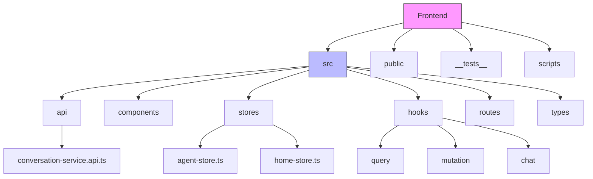
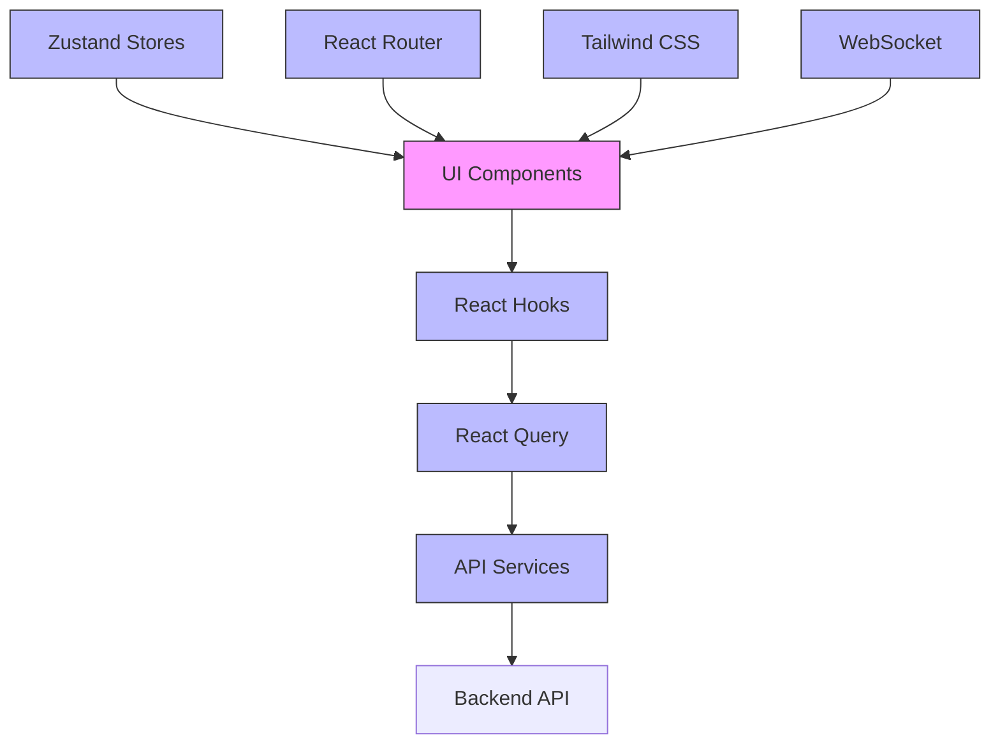
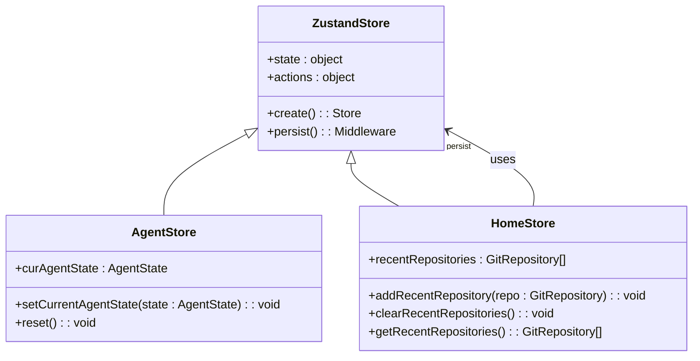
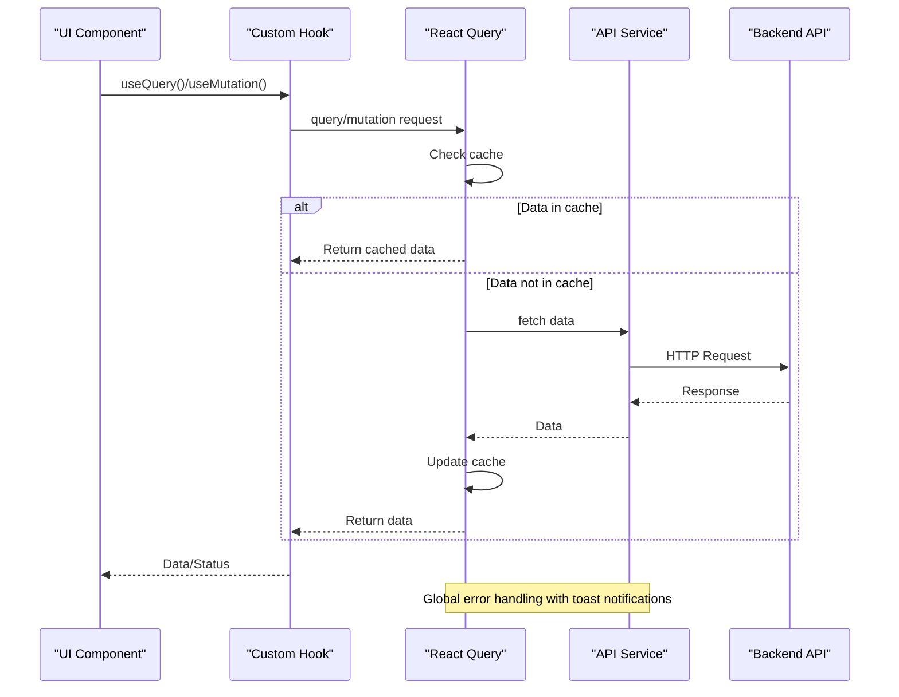
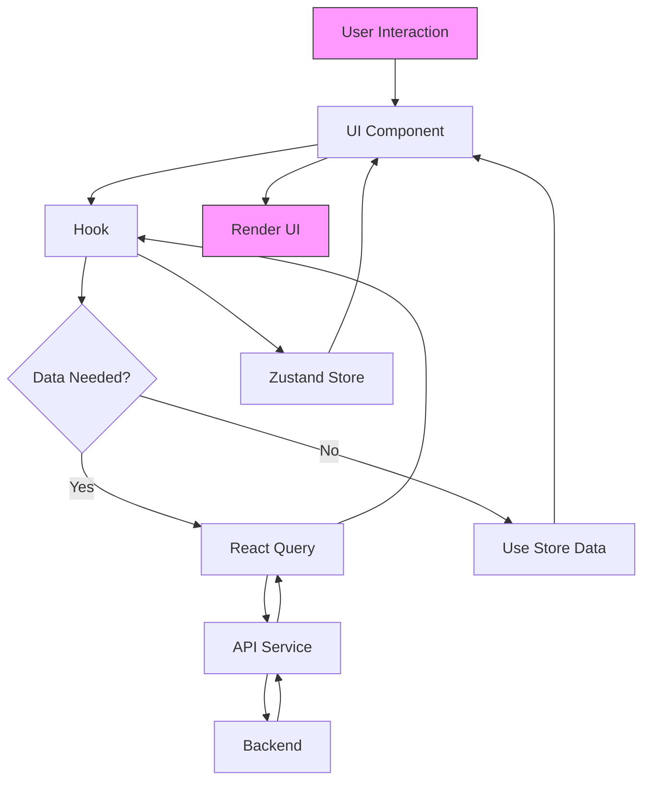
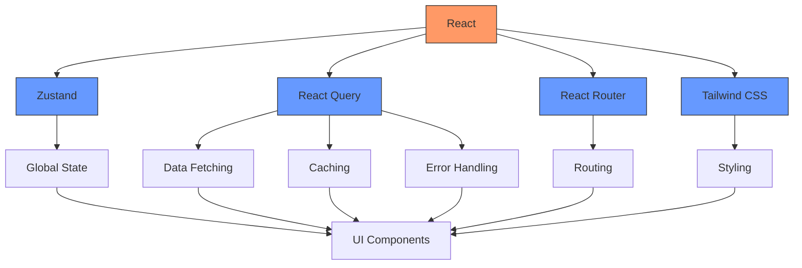

# Frontend Architecture

<cite>
**Referenced Files in This Document**   
- [package.json](file://frontend/package.json)
- [root.tsx](file://frontend/src/root.tsx)
- [routes.ts](file://frontend/src/routes.ts)
- [query-client-config.ts](file://frontend/src/query-client-config.ts)
- [tailwind.config.js](file://frontend/tailwind.config.js)
- [agent-store.ts](file://frontend/src/stores/agent-store.ts)
- [home-store.ts](file://frontend/src/stores/home-store.ts)
- [use-active-conversation.ts](file://frontend/src/hooks/query/use-active-conversation.ts)
- [use-create-conversation.ts](file://frontend/src/hooks/mutation/use-create-conversation.ts)
- [conversation-service.api.ts](file://frontend/src/api/conversation-service/conversation-service.api.ts)
</cite>

## Table of Contents
1. [Introduction](#introduction)
2. [Project Structure](#project-structure)
3. [Core Components](#core-components)
4. [Architecture Overview](#architecture-overview)
5. [Detailed Component Analysis](#detailed-component-analysis)
6. [Dependency Analysis](#dependency-analysis)
7. [Performance Considerations](#performance-considerations)
8. [Troubleshooting Guide](#troubleshooting-guide)
9. [Conclusion](#conclusion)

## Introduction
The OpenHands frontend architecture is built on React with a component-based design pattern, leveraging modern state management and data fetching techniques. This document provides a comprehensive overview of the frontend architecture, focusing on the React-based implementation, state management with Zustand, data fetching with React Query, and integration patterns with backend services. The architecture follows component-based principles with clear separation of concerns between UI components, state management, and service layers.

## Project Structure

**Diagram sources**
- [package.json](file://frontend/package.json)
- [src](file://frontend/src)

**Section sources**
- [package.json](file://frontend/package.json)
- [src](file://frontend/src)

## Core Components

The frontend architecture is organized around several core component categories:
- **Stores**: Zustand-based state management for global application state
- **Hooks**: Custom React hooks for data fetching, mutations, and UI logic
- **Services**: API service layer for backend communication
- **Components**: Reusable UI components organized by feature
- **Routes**: React Router-based routing configuration

The architecture follows a clear separation between presentation components and business logic, with hooks serving as the bridge between UI and data layers.

**Section sources**
- [agent-store.ts](file://frontend/src/stores/agent-store.ts)
- [home-store.ts](file://frontend/src/stores/home-store.ts)
- [use-active-conversation.ts](file://frontend/src/hooks/query/use-active-conversation.ts)
- [use-create-conversation.ts](file://frontend/src/hooks/mutation/use-create-conversation.ts)

## Architecture Overview

**Diagram sources**
- [root.tsx](file://frontend/src/root.tsx)
- [routes.ts](file://frontend/src/routes.ts)
- [query-client-config.ts](file://frontend/src/query-client-config.ts)
- [agent-store.ts](file://frontend/src/stores/agent-store.ts)

## Detailed Component Analysis

### State Management with Zustand

The frontend uses Zustand for state management, providing a lightweight and efficient solution for global state. Stores are created using the `create` function and follow a consistent pattern of state definition and action implementation.

**Diagram sources**
- [agent-store.ts](file://frontend/src/stores/agent-store.ts)
- [home-store.ts](file://frontend/src/stores/home-store.ts)

### Data Fetching with React Query

The architecture implements React Query for data fetching, caching, and synchronization. The QueryClient is configured with global error handling and toast notifications for user feedback.

**Diagram sources**
- [query-client-config.ts](file://frontend/src/query-client-config.ts)
- [use-active-conversation.ts](file://frontend/src/hooks/query/use-active-conversation.ts)
- [use-create-conversation.ts](file://frontend/src/hooks/mutation/use-create-conversation.ts)

### Component Interaction Patterns

The architecture follows a clear pattern of component interaction, with data flowing from services through hooks to UI components. The MVC pattern is implemented through the separation of concerns between views (components), controllers (hooks), and models (stores and services).

**Diagram sources**
- [agent-store.ts](file://frontend/src/stores/agent-store.ts)
- [use-active-conversation.ts](file://frontend/src/hooks/query/use-active-conversation.ts)
- [conversation-service.api.ts](file://frontend/src/api/conversation-service/conversation-service.api.ts)

## Dependency Analysis

**Diagram sources**
- [package.json](file://frontend/package.json)
- [root.tsx](file://frontend/src/root.tsx)
- [tailwind.config.js](file://frontend/tailwind.config.js)

## Performance Considerations

The architecture incorporates several performance optimizations:
- React Query's caching mechanism reduces unnecessary API calls
- Zustand's efficient state updates minimize re-renders
- Code splitting through React Router improves initial load time
- Tailwind CSS's utility-first approach enables efficient styling
- WebSocket connections for real-time updates reduce polling frequency

The implementation also includes debouncing, infinite scrolling, and lazy loading patterns to enhance user experience with large datasets.

## Troubleshooting Guide

Common issues and their solutions:
- **State not updating**: Check if Zustand store actions are properly called and state immutability is maintained
- **Data not fetching**: Verify React Query keys and API service endpoints
- **Routing issues**: Check route configuration in routes.ts and component imports
- **Styling problems**: Ensure Tailwind classes are properly applied and dark mode configuration is correct
- **Authentication errors**: Verify 401 error handling in query client configuration

**Section sources**
- [query-client-config.ts](file://frontend/src/query-client-config.ts)
- [agent-store.ts](file://frontend/src/stores/agent-store.ts)
- [routes.ts](file://frontend/src/routes.ts)

## Conclusion

The OpenHands frontend architecture demonstrates a modern React application design with clear separation of concerns, efficient state management, and robust data fetching capabilities. The combination of React, Zustand, React Query, and Tailwind CSS provides a solid foundation for building a responsive and maintainable user interface. The architecture supports scalability through modular component design and efficient data handling patterns, making it well-suited for the application's requirements.