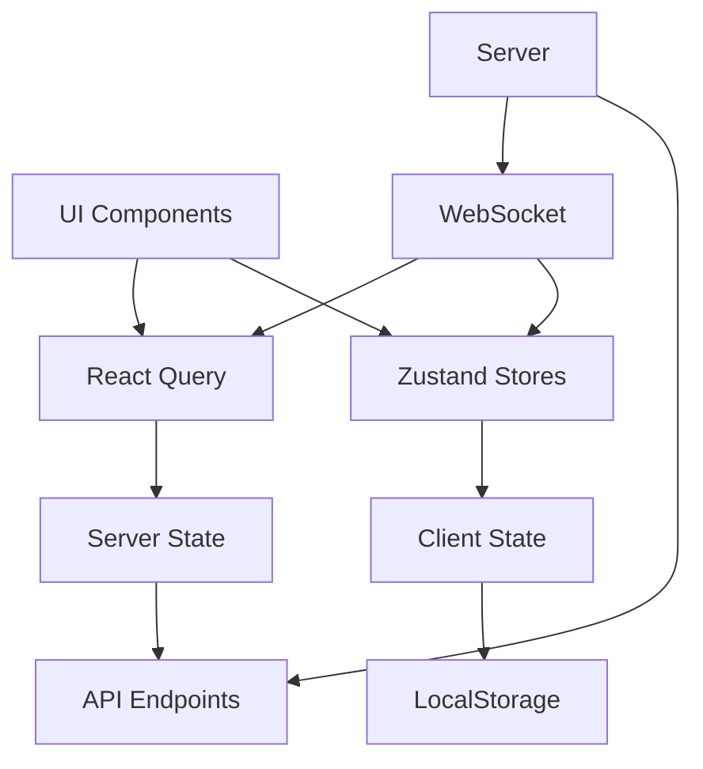
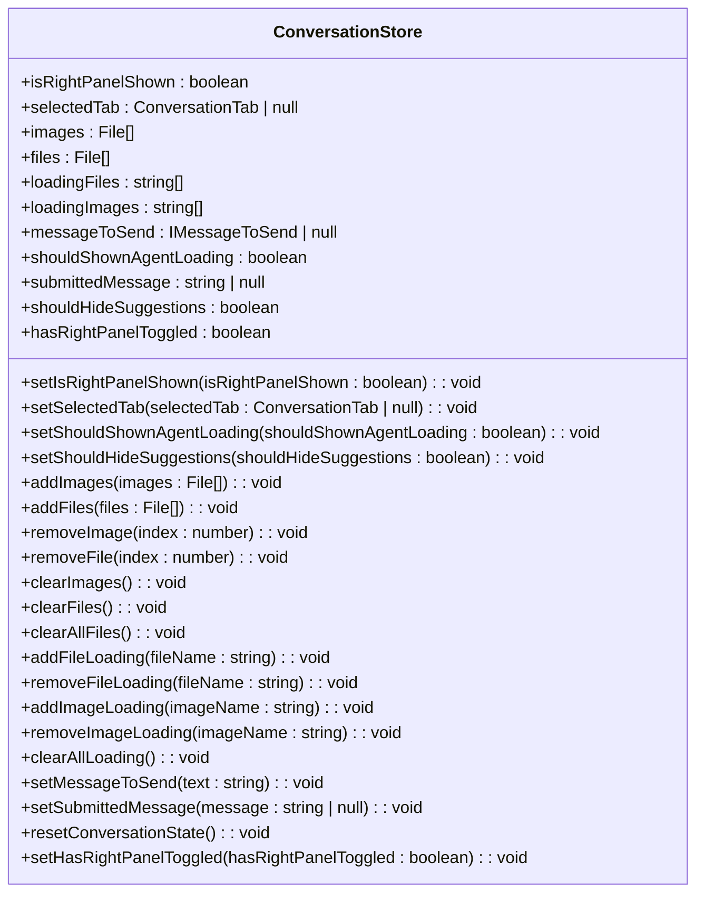
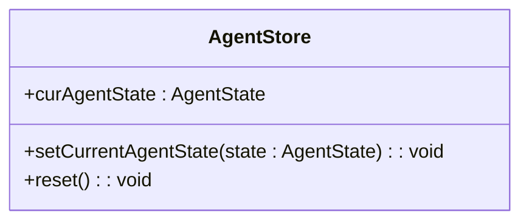
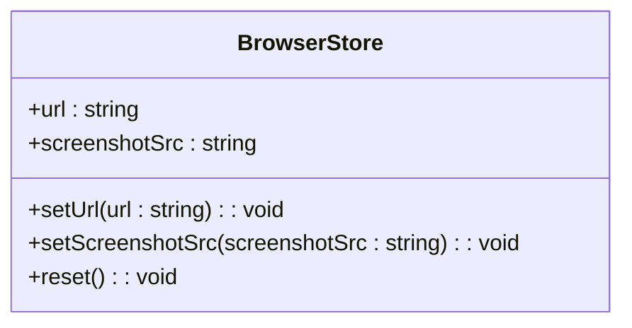
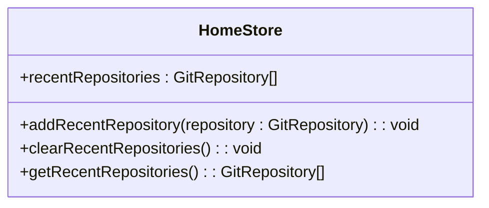
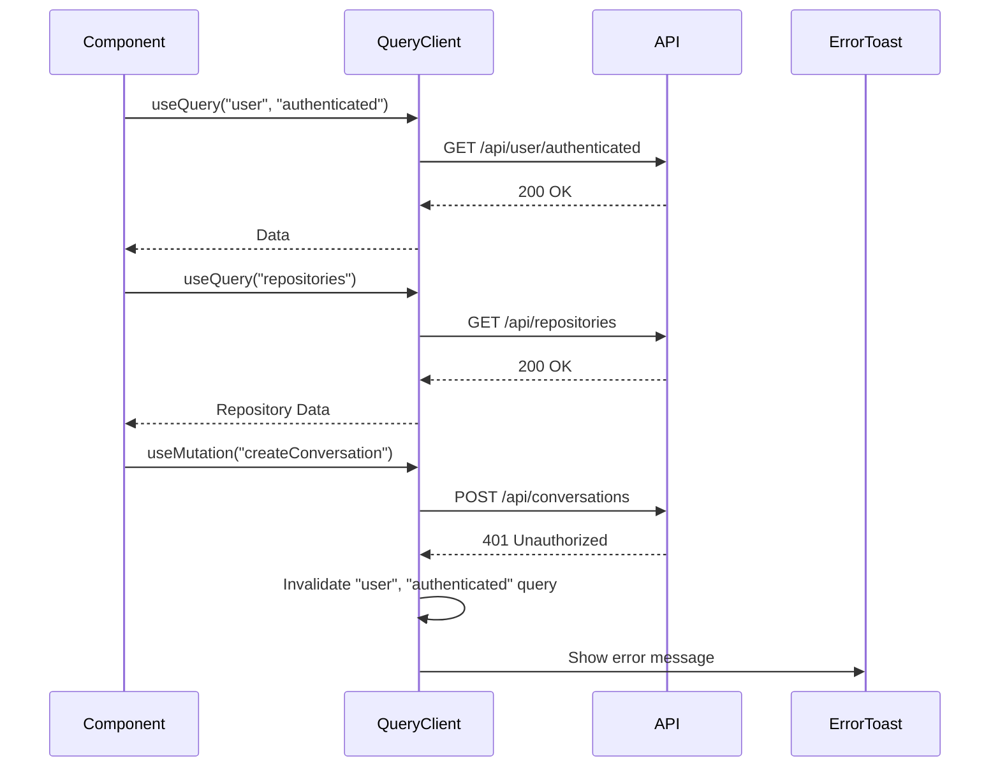
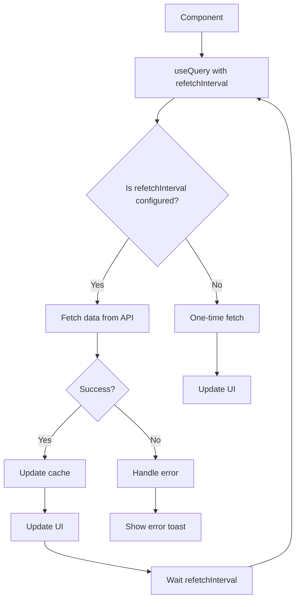
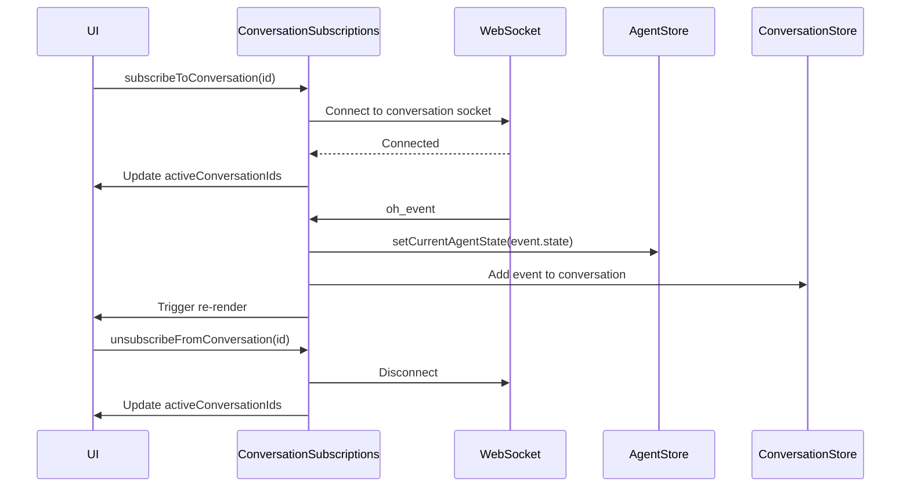
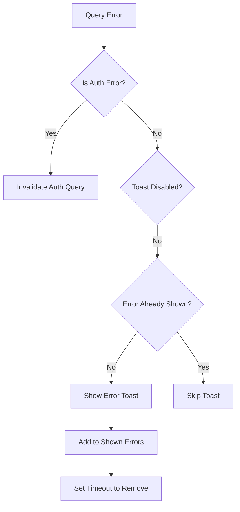
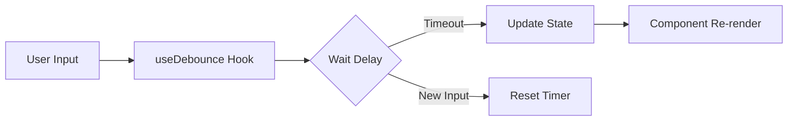

# State Management

<cite>
**Referenced Files in This Document**   
- [agent-store.ts](file://frontend/src/stores/agent-store.ts)
- [conversation-store.ts](file://frontend/src/state/conversation-store.ts)
- [browser-store.ts](file://frontend/src/stores/browser-store.ts)
- [home-store.ts](file://frontend/src/stores/home-store.ts)
- [query-client-config.ts](file://frontend/src/query-client-config.ts)
- [use-create-conversation-and-subscribe-multiple.ts](file://frontend/src/hooks/use-create-conversation-and-subscribe-multiple.ts)
- [conversation-subscriptions-provider.tsx](file://frontend/src/context/conversation-subscriptions-provider.tsx)
- [initial-query-store.ts](file://frontend/src/stores/initial-query-store.ts)
- [security-analyzer-store.ts](file://frontend/src/stores/security-analyzer-store.ts)
- [optimistic-user-message-store.ts](file://frontend/src/stores/optimistic-user-message-store.ts)
- [error-message-store.ts](file://frontend/src/stores/error-message-store.ts)
- [event-message-store.ts](file://frontend/src/stores/event-message-store.ts)
- [metrics-store.ts](file://frontend/src/stores/metrics-store.ts)
- [status-store.ts](file://frontend/src/state/status-store.ts)
</cite>

## Table of Contents
1. [Introduction](#introduction)
2. [State Management Architecture](#state-management-architecture)
3. [Zustand Stores](#zustand-stores)
4. [React Query Integration](#react-query-integration)
5. [Store Interactions and Data Synchronization](#store-interactions-and-data-synchronization)
6. [State Persistence](#state-persistence)
7. [Error Handling](#error-handling)
8. [Performance Optimization](#performance-optimization)
9. [Creating New State Stores](#creating-new-state-stores)
10. [Best Practices](#best-practices)

## Introduction

The OpenHands frontend implements a comprehensive state management system using Zustand for global client state and React Query for server state management. This documentation details the architecture, implementation patterns, and best practices for managing state in the application. The system is designed to handle complex interactions between user interface components, server communications, and real-time updates through WebSockets.

The state management approach combines the simplicity and flexibility of Zustand for client-side state with the powerful caching and synchronization capabilities of React Query for server state. This hybrid approach enables efficient data fetching, caching, and synchronization while maintaining a clean and predictable state management pattern across the application.

**Section sources**
- [agent-store.ts](file://frontend/src/stores/agent-store.ts)
- [conversation-store.ts](file://frontend/src/state/conversation-store.ts)
- [query-client-config.ts](file://frontend/src/query-client-config.ts)

## State Management Architecture

The OpenHands frontend state management system follows a hybrid architecture that combines Zustand for global client state management with React Query for server state management. This approach provides a clean separation of concerns between client-side UI state and server-derived data.

The architecture consists of multiple Zustand stores that manage different aspects of the application state, including conversation state, agent state, browser state, and user interface preferences. These stores are complemented by React Query's caching and data synchronization capabilities, which handle server state, data fetching, and automatic background updates.



**Diagram sources**
- [agent-store.ts](file://frontend/src/stores/agent-store.ts)
- [conversation-store.ts](file://frontend/src/state/conversation-store.ts)
- [query-client-config.ts](file://frontend/src/query-client-config.ts)

**Section sources**
- [agent-store.ts](file://frontend/src/stores/agent-store.ts)
- [conversation-store.ts](file://frontend/src/state/conversation-store.ts)
- [query-client-config.ts](file://frontend/src/query-client-config.ts)

## Zustand Stores

The application implements several specialized Zustand stores to manage different aspects of the client state. Each store follows a consistent pattern of defining state interfaces, action interfaces, and creating a store with the `create` function from Zustand.

### Conversation Store

The conversation store manages the state related to the conversation interface, including panel visibility, selected tabs, file uploads, and message composition. It uses the devtools middleware to enable state inspection and debugging.



**Diagram sources**
- [conversation-store.ts](file://frontend/src/state/conversation-store.ts)

**Section sources**
- [conversation-store.ts](file://frontend/src/state/conversation-store.ts)

### Agent Store

The agent store manages the state of the AI agent, tracking its current state (e.g., loading, running, error) and providing actions to update this state. This store is used to coordinate UI updates based on the agent's operational status.



**Diagram sources**
- [agent-store.ts](file://frontend/src/stores/agent-store.ts)

**Section sources**
- [agent-store.ts](file://frontend/src/stores/agent-store.ts)

### Browser Store

The browser store manages the state of the embedded browser interface, storing the current URL and screenshot data. This store enables the application to maintain the browser's state across component re-renders.



**Diagram sources**
- [browser-store.ts](file://frontend/src/stores/browser-store.ts)

**Section sources**
- [browser-store.ts](file://frontend/src/stores/browser-store.ts)

### Home Store

The home store manages the state of recently accessed repositories, with built-in persistence to localStorage using Zustand's persist middleware. This ensures that the user's recent repositories are preserved across sessions.



**Diagram sources**
- [home-store.ts](file://frontend/src/stores/home-store.ts)

**Section sources**
- [home-store.ts](file://frontend/src/stores/home-store.ts)

### Other Stores

The application includes several other specialized stores for specific use cases:

- **Initial Query Store**: Manages the initial query state, including files, prompts, and repository selection
- **Security Analyzer Store**: Tracks security analysis logs and risk assessments
- **Optimistic User Message Store**: Manages optimistic UI updates for user messages
- **Error Message Store**: Handles error message display and dismissal
- **Event Message Store**: Tracks submitted event IDs to prevent duplicate submissions
- **Metrics Store**: Stores cost and usage metrics from the agent
- **Status Store**: Manages status messages and notifications

**Section sources**
- [initial-query-store.ts](file://frontend/src/stores/initial-query-store.ts)
- [security-analyzer-store.ts](file://frontend/src/stores/security-analyzer-store.ts)
- [optimistic-user-message-store.ts](file://frontend/src/stores/optimistic-user-message-store.ts)
- [error-message-store.ts](file://frontend/src/stores/error-message-store.ts)
- [event-message-store.ts](file://frontend/src/stores/event-message-store.ts)
- [metrics-store.ts](file://frontend/src/stores/metrics-store.ts)
- [status-store.ts](file://frontend/src/state/status-store.ts)

## React Query Integration

React Query is used extensively throughout the application for managing server state, data fetching, caching, and synchronization. The query client is configured with custom error handling and caching strategies to provide a seamless user experience.

### Query Client Configuration

The query client is configured with error handlers that automatically handle authentication errors (401) by invalidating the user authentication query. It also implements a mechanism to prevent duplicate error toasts by tracking shown errors in a Set.



**Diagram sources**
- [query-client-config.ts](file://frontend/src/query-client-config.ts)

**Section sources**
- [query-client-config.ts](file://frontend/src/query-client-config.ts)

### Data Synchronization

The application uses React Query's refetchInterval feature to automatically synchronize data with the server. For example, active host status is periodically checked to ensure the UI reflects the current connection state.



**Diagram sources**
- [use-get-git-changes.ts](file://frontend/src/hooks/query/use-get-git-changes.ts)
- [use-active-host.test.tsx](file://frontend/__tests__/hooks/query/use-active-host.test.tsx)

**Section sources**
- [use-get-git-changes.ts](file://frontend/src/hooks/query/use-get-git-changes.ts)

## Store Interactions and Data Synchronization

The state management system implements sophisticated patterns for synchronizing data between different stores and between client and server state. This ensures consistency across the application and provides a responsive user experience.

### WebSocket Integration

The application uses WebSockets to receive real-time updates from the server, which are then distributed to the appropriate Zustand stores. The ConversationSubscriptionsProvider manages WebSocket connections for active conversations and routes events to the relevant stores.



**Diagram sources**
- [conversation-subscriptions-provider.tsx](file://frontend/src/context/conversation-subscriptions-provider.tsx)
- [use-create-conversation-and-subscribe-multiple.ts](file://frontend/src/hooks/use-create-conversation-and-subscribe-multiple.ts)

**Section sources**
- [conversation-subscriptions-provider.tsx](file://frontend/src/context/conversation-subscriptions-provider.tsx)
- [use-create-conversation-and-subscribe-multiple.ts](file://frontend/src/hooks/use-create-conversation-and-subscribe-multiple.ts)

### State Update Patterns

The application follows consistent patterns for updating state across different stores. Actions are defined as functions that use the `set` function from Zustand to update the store state. These actions handle both simple state updates and more complex operations that require state computation.

For example, the home store's `addRecentRepository` action removes any existing repository with the same ID before adding the new one, ensuring no duplicates in the recent repositories list. It also limits the list to the three most recent repositories.

**Section sources**
- [home-store.ts](file://frontend/src/stores/home-store.ts)
- [conversation-store.ts](file://frontend/src/state/conversation-store.ts)

## State Persistence

The application implements state persistence for selected stores using Zustand's persist middleware. This ensures that important user preferences and frequently accessed data are preserved across sessions.

### LocalStorage Persistence

The home store uses the persist middleware with localStorage to save the list of recent repositories. This allows users to quickly access their recently worked-on repositories even after closing and reopening the application.

```typescript
export const useHomeStore = create<HomeStore>()(
  persist(
    (set, get) => ({
      // store definition
    }),
    {
      name: "home-store",
      storage: createJSONStorage(() => localStorage),
    },
  ),
);
```

The conversation store also implements persistence for the right panel visibility state by reading from localStorage during initialization:

```typescript
const getInitialRightPanelState = (): boolean => {
  const stored = localStorage.getItem("conversation-right-panel-shown");
  return stored !== null ? JSON.parse(stored) : true;
};
```

**Section sources**
- [home-store.ts](file://frontend/src/stores/home-store.ts)
- [conversation-store.ts](file://frontend/src/state/conversation-store.ts)

## Error Handling

The state management system includes comprehensive error handling mechanisms to provide a robust user experience and prevent cascading failures.

### Global Error Handling

The React Query client is configured with global error handlers for both queries and mutations. These handlers automatically manage authentication errors by invalidating the user authentication query, which triggers a re-authentication flow if needed.

The error handling system also prevents duplicate error toasts by maintaining a Set of recently shown error messages. Each error message is displayed only once within a 3-second window, improving the user experience by reducing notification fatigue.



**Diagram sources**
- [query-client-config.ts](file://frontend/src/query-client-config.ts)

**Section sources**
- [query-client-config.ts](file://frontend/src/query-client-config.ts)

### Store-Specific Error Handling

Individual stores implement their own error handling as needed. For example, the security analyzer store manages confirmation states for potentially risky actions, allowing users to approve or reject actions before they are executed.

The error message store provides a simple mechanism for displaying and dismissing error messages in the UI, ensuring that error state is properly managed and doesn't persist longer than necessary.

**Section sources**
- [security-analyzer-store.ts](file://frontend/src/stores/security-analyzer-store.ts)
- [error-message-store.ts](file://frontend/src/stores/error-message-store.ts)

## Performance Optimization

The state management system incorporates several performance optimization techniques to ensure a responsive user interface and efficient state updates.

### Selective Re-renders

Zustand's subscription model ensures that components only re-render when the specific state they depend on changes. This prevents unnecessary re-renders when unrelated state is updated.

Components can subscribe to specific parts of a store using the selector pattern:

```typescript
const selectedTab = useConversationStore(state => state.selectedTab);
```

This way, the component will only re-render when the selectedTab value changes, not when other parts of the conversation store are updated.

### Optimistic Updates

The optimistic user message store implements optimistic UI updates, where the UI is updated immediately based on the expected outcome of an operation, before receiving confirmation from the server. This creates a more responsive user experience, especially for operations with network latency.

### Debouncing and Throttling

The application uses custom hooks like `useDebounce` to prevent excessive state updates from rapid user input. This is particularly important for search inputs and other frequently updated fields.



**Diagram sources**
- [use-debounce.ts](file://frontend/src/hooks/use-debounce.ts)

**Section sources**
- [use-debounce.ts](file://frontend/src/hooks/use-debounce.ts)

## Creating New State Stores

When creating new state stores in the application, follow these guidelines to maintain consistency with the existing architecture.

### Store Structure

New stores should follow the established pattern of separating state and actions into interfaces, then combining them into a single store type:

```typescript
interface MyState {
  // state properties
}

interface MyActions {
  // action functions
}

type MyStore = MyState & MyActions;
```

### Initialization and Actions

Define an initial state object and implement actions as functions that use the `set` parameter to update state. For complex state updates that depend on current state, pass a function to `set`:

```typescript
set((state) => ({
  // compute new state based on current state
}))
```

### Middleware Usage

Use appropriate middleware based on the store's requirements:

- Use `devtools` for stores that would benefit from state inspection during development
- Use `persist` for stores that need to persist data across sessions
- Avoid middleware when not needed to keep the store lightweight

### Naming Conventions

Follow the established naming conventions:
- Store files should be named `*-store.ts`
- Store hooks should be named `use*Store`
- State interfaces should be named `*State`
- Action interfaces should be named `*Actions`

**Section sources**
- [agent-store.ts](file://frontend/src/stores/agent-store.ts)
- [conversation-store.ts](file://frontend/src/state/conversation-store.ts)
- [home-store.ts](file://frontend/src/stores/home-store.ts)

## Best Practices

The following best practices should be followed when working with the state management system in the OpenHands frontend.

### State Colocation

Keep state as close to where it's used as possible. Only elevate state to a global store when it needs to be shared across multiple components or pages.

### Immutability

Always treat state as immutable. When updating state, create new objects or arrays rather than modifying existing ones. This ensures predictable state updates and proper re-renders.

### Action Granularity

Define focused, single-purpose actions rather than large, complex actions that do multiple things. This makes the store easier to test and debug.

### Error Boundaries

Wrap state-dependent components with error boundaries when appropriate, especially when the state is critical to the component's functionality.

### Testing

Write comprehensive tests for store actions and state transitions. The existing test setup includes utilities for resetting stores between tests, ensuring test isolation.

### Documentation

Document the purpose and usage of each store, including the types of state it manages and the actions available to modify that state.

**Section sources**
- [agent-store.ts](file://frontend/src/stores/agent-store.ts)
- [conversation-store.ts](file://frontend/src/state/conversation-store.ts)
- [query-client-config.ts](file://frontend/src/query-client-config.ts)
- [__mocks__/zustand.ts](file://frontend/__mocks__/zustand.ts)