# GitHub Integration

<cite>
**Referenced Files in This Document**   
- [github_service.py](file://enterprise/integrations/github/github_service.py)
- [github_types.py](file://enterprise/integrations/github/github_types.py)
- [queries.py](file://enterprise/integrations/github/queries.py)
- [github_proxy.py](file://enterprise/server/routes/github_proxy.py)
- [github_utils.py](file://enterprise/server/auth/github_utils.py)
- [token_manager.py](file://enterprise/server/auth/token_manager.py)
- [github_app_installation.py](file://enterprise/storage/github_app_installation.py)
- [event_webhook.py](file://enterprise/server/routes/event_webhook.py)
- [github.py](file://enterprise/server/routes/integration/github.py)
</cite>

## Table of Contents
1. [Introduction](#introduction)
2. [Architecture Overview](#architecture-overview)
3. [OAuth Authentication Flow](#oauth-authentication-flow)
4. [GitHub Service Client](#github-service-client)
5. [GraphQL Queries](#graphql-queries)
6. [Webhook Handling](#webhook-handling)
7. [Token Management](#token-management)
8. [Repository Connection](#repository-connection)
9. [Pull Request Management](#pull-request-management)
10. [Issue Tracking](#issue-tracking)
11. [Configuration Options](#configuration-options)
12. [Error Handling](#error-handling)
13. [Troubleshooting Guide](#troubleshooting-guide)

## Introduction

The GitHub Integration feature enables seamless connection between OpenHands and GitHub repositories, providing comprehensive functionality for code navigation, pull request management, and issue resolution. This integration allows users to authenticate with GitHub through OAuth, connect repositories via GitHub App installation, and perform various GitHub operations through a unified API abstraction layer.

The integration is designed to work in both OSS and Enterprise modes, with different authentication mechanisms. In Enterprise mode, it leverages Keycloak for OAuth authentication, storing tokens securely and managing token refresh automatically. The system supports connecting to repositories through GitHub App installations, allowing access to repositories without requiring individual user tokens for each repository.

Key capabilities include:
- OAuth-based authentication with GitHub
- Repository connection through GitHub App installation
- Pull request creation, review, and management
- Issue tracking and resolution
- Webhook handling for repository events
- GraphQL and REST API abstraction for GitHub operations
- Token management with automatic refresh

This documentation provides comprehensive details on the architecture, implementation, configuration, and usage of the GitHub Integration feature, making it accessible to both beginners and experienced developers.

## Architecture Overview

The GitHub Integration architecture consists of several interconnected components that work together to provide seamless GitHub functionality. The system is built around a service-oriented architecture with clear separation of concerns between authentication, service operations, and event handling.

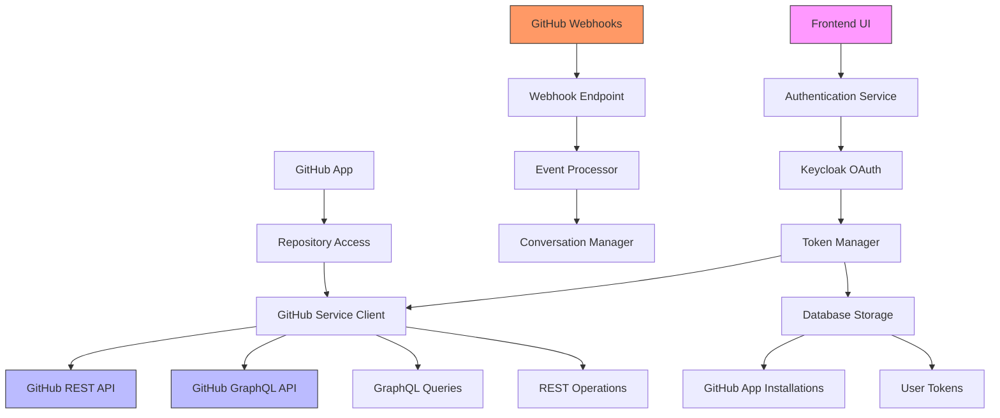

**Diagram sources**
- [github_service.py](file://enterprise/integrations/github/github_service.py)
- [token_manager.py](file://enterprise/server/auth/token_manager.py)
- [github.py](file://enterprise/server/routes/integration/github.py)

**Section sources**
- [github_service.py](file://enterprise/integrations/github/github_service.py)
- [token_manager.py](file://enterprise/server/auth/token_manager.py)

## OAuth Authentication Flow

The OAuth authentication flow enables users to securely connect their GitHub accounts to OpenHands using industry-standard OAuth 2.0 protocols. The flow begins when a user initiates authentication through the frontend UI, which redirects them to GitHub's authorization endpoint.

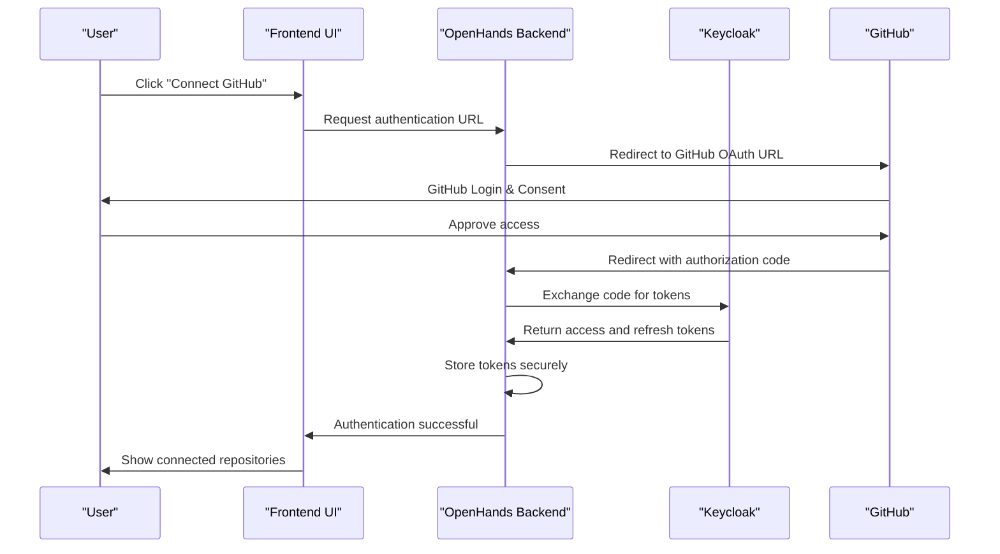

The authentication process involves several key components:
1. The frontend requests an authentication URL from the backend
2. The backend redirects the user to GitHub's authorization endpoint with appropriate parameters
3. After user consent, GitHub redirects back to the application with an authorization code
4. The backend exchanges this code for access and refresh tokens via Keycloak
5. Tokens are securely stored in the database, with access tokens encrypted
6. The user's session is established with appropriate authentication tokens

The system uses the authorization code grant type, which is the most secure OAuth flow for server-side applications. This ensures that access tokens are never exposed to the client-side application, reducing the risk of token leakage.

**Section sources**
- [github_proxy.py](file://enterprise/server/routes/github_proxy.py)
- [token_manager.py](file://enterprise/server/auth/token_manager.py)

## GitHub Service Client

The GitHub Service Client provides an abstraction layer for interacting with GitHub's REST and GraphQL APIs. It is implemented as a class hierarchy with mixins for different functional areas, allowing for modular and extensible design.

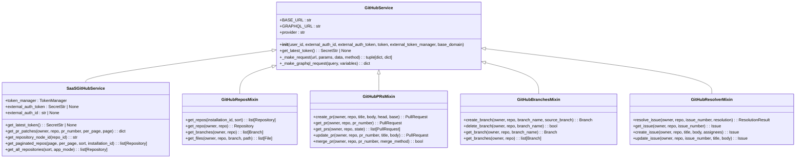

**Diagram sources**
- [github_service.py](file://enterprise/integrations/github/github_service.py)
- [github_types.py](file://enterprise/integrations/github/github_types.py)

**Section sources**
- [github_service.py](file://enterprise/integrations/github/github_service.py)

## GraphQL Queries

The GitHub Integration uses GraphQL queries to efficiently retrieve complex data from GitHub's API. GraphQL allows for precise data fetching, reducing over-fetching and under-fetching issues common with REST APIs.

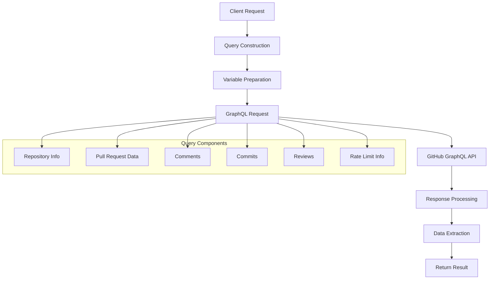

The primary GraphQL query used in the integration is `PR_QUERY_BY_NODE_ID`, which retrieves comprehensive pull request information including:

- Repository metadata (name, owner, languages)
- Pull request details (title, body, author, state, merge information)
- Comments with pagination support
- Commits with detailed commit information
- Reviews with comments and states
- Rate limit information for API usage monitoring

The query uses variables for dynamic data:
- `$nodeId`: Repository node ID for GraphQL queries
- `$pr_number`: Pull request number to retrieve
- `$comments_after`: Cursor for paginating comments
- `$commits_after`: Cursor for paginating commits
- `$reviews_after`: Cursor for paginating reviews

This approach allows for efficient data retrieval with a single request, minimizing API calls and improving performance. The integration handles pagination through cursor-based navigation, enabling retrieval of large datasets in manageable chunks.

**Section sources**
- [queries.py](file://enterprise/integrations/github/queries.py)

## Webhook Handling

The webhook handling system enables real-time processing of GitHub events, allowing OpenHands to respond to repository activities such as pull requests, issues, and commits. The system is designed to securely receive and process webhook payloads from GitHub.

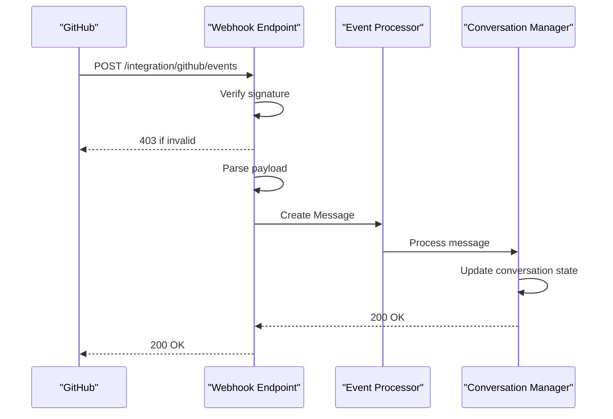

The webhook processing flow involves several critical steps:

1. **Signature Verification**: The system verifies the webhook signature using HMAC-SHA256 to ensure the request originates from GitHub and hasn't been tampered with. This uses the `GITHUB_APP_WEBHOOK_SECRET` configured in the environment.

2. **Payload Processing**: After successful verification, the JSON payload is parsed to extract relevant information, including the installation ID which identifies which GitHub App installation triggered the event.

3. **Message Creation**: A message object is created containing the payload and installation information, which is then passed to the `GithubManager` for processing.

4. **Event Handling**: The `GithubManager` processes the message based on the event type (e.g., pull_request, issue, push), updating the appropriate conversation state and triggering any necessary actions.

The system also includes safeguards such as configurable webhook enablement via the `GITHUB_WEBHOOKS_ENABLED` environment variable, allowing administrators to disable webhook processing when needed.

**Section sources**
- [github.py](file://enterprise/server/routes/integration/github.py)
- [github_manager.py](file://enterprise/integrations/github/github_manager.py)

## Token Management

The token management system securely handles GitHub access tokens, ensuring they are stored safely and refreshed automatically when they expire. This system is critical for maintaining uninterrupted access to GitHub repositories.

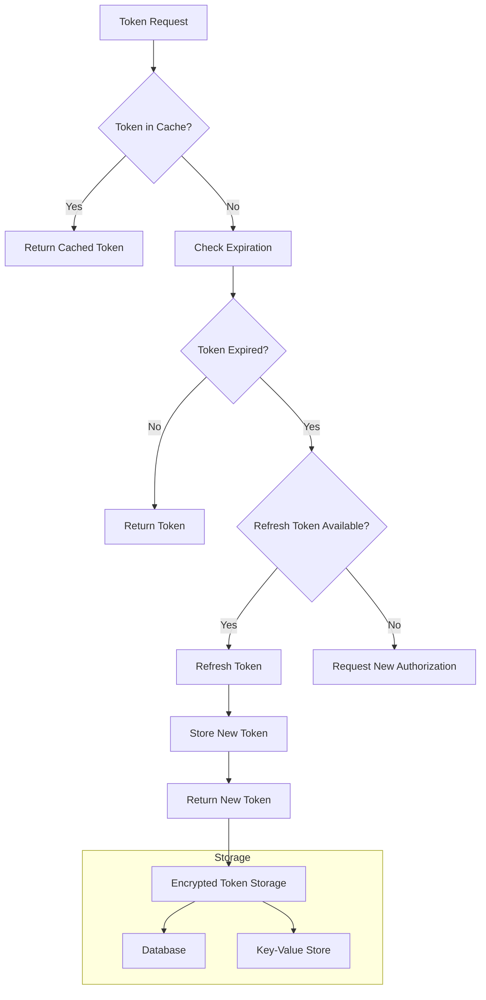

Key components of the token management system:

- **Token Storage**: Access tokens are encrypted using Fernet encryption before being stored in the database, ensuring they cannot be read if the database is compromised.

- **Token Refresh**: When a token is nearing expiration, the system automatically uses the refresh token to obtain a new access token without requiring user intervention.

- **Multiple Authentication Methods**: The system supports various authentication methods including:
  - External auth tokens
  - External auth IDs
  - User IDs
  - Direct access tokens

- **Secure Encryption**: The system uses Fernet encryption with a key derived from the JWT secret to encrypt tokens at rest.

The `TokenManager` class provides methods for:
- Storing and retrieving tokens securely
- Refreshing expired tokens
- Validating token status
- Converting between different token representations

This comprehensive token management approach ensures that users maintain access to their GitHub repositories while maintaining high security standards.

**Section sources**
- [token_manager.py](file://enterprise/server/auth/token_manager.py)

## Repository Connection

The repository connection process allows users to connect their GitHub repositories to OpenHands through GitHub App installation. This approach provides secure access to repositories without requiring personal access tokens.

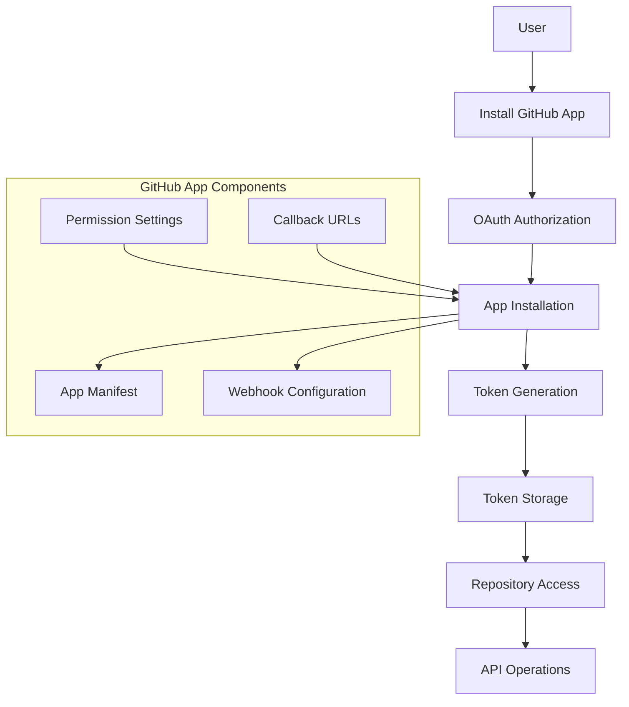

The connection process involves:

1. **App Installation**: Users install the OpenHands GitHub App on their account or organization, granting it the necessary permissions to access repositories.

2. **OAuth Flow**: During installation, GitHub initiates an OAuth flow that redirects to OpenHands' authentication endpoint, establishing the connection.

3. **Token Generation**: GitHub generates an installation token that provides access to the repositories the app was granted access to.

4. **Token Storage**: The installation token is securely stored in the database, encrypted using the system's encryption utilities.

5. **Repository Access**: With the installation token, OpenHands can access the connected repositories and perform operations on behalf of the user.

The system stores installation tokens in the `github_app_installations` table, which includes:
- Installation ID (unique identifier for the app installation)
- Encrypted token (the actual access token, encrypted at rest)
- Timestamps for creation and updates

This approach allows users to connect multiple repositories through a single app installation, simplifying the connection process while maintaining security.

**Section sources**
- [github_app_installation.py](file://enterprise/storage/github_app_installation.py)

## Pull Request Management

The pull request management system provides comprehensive functionality for creating, reviewing, and merging pull requests through the GitHub API. This enables seamless integration between OpenHands and GitHub's code review workflows.

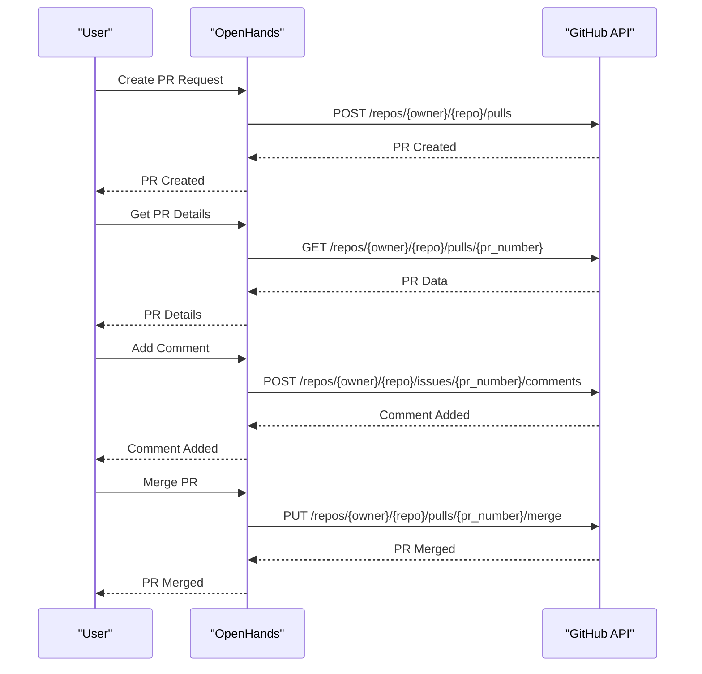

Key features of the pull request management system:

- **PR Creation**: Users can create pull requests with custom titles, descriptions, source and target branches.
- **PR Retrieval**: Detailed information about pull requests can be retrieved, including files changed, comments, and review status.
- **Comment Management**: Users can add comments to pull requests, either as general comments or inline comments on specific code changes.
- **PR Merging**: Approved pull requests can be merged using various merge methods (merge, squash, rebase).
- **Status Updates**: The system can update pull request titles and descriptions as needed.

The integration also supports advanced features like retrieving PR patches with pagination support through the `get_pr_patches` method, which allows retrieving file changes in chunks to handle large pull requests efficiently.

**Section sources**
- [github_service.py](file://enterprise/integrations/github/github_service.py)

## Issue Tracking

The issue tracking system enables users to manage GitHub issues directly from OpenHands, providing a seamless workflow for issue creation, tracking, and resolution. This integration connects OpenHands' task management capabilities with GitHub's issue tracking system.

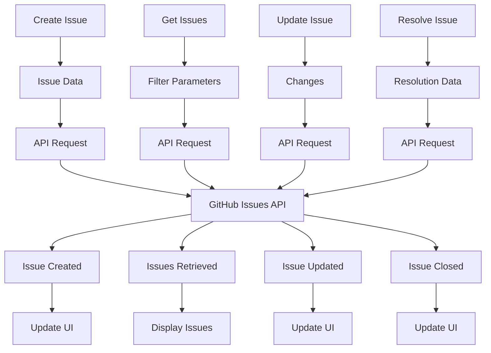

The issue tracking functionality includes:

- **Issue Creation**: Users can create new issues with titles, descriptions, and optional assignees.
- **Issue Retrieval**: The system can fetch issues with various filters (open, closed, assigned, etc.).
- **Issue Updates**: Existing issues can be updated with new titles, descriptions, or status changes.
- **Issue Resolution**: Issues can be closed with resolution notes, marking them as complete.

The system integrates with OpenHands' resolver functionality, allowing AI agents to automatically address issues by implementing fixes and creating pull requests. This creates a closed-loop system where issues can be identified, resolved, and verified automatically.

The integration also supports retrieving issue details including comments, assignees, labels, and milestone information, providing a comprehensive view of each issue's status and history.

**Section sources**
- [github_service.py](file://enterprise/integrations/github/github_service.py)

## Configuration Options

The GitHub Integration provides several configuration options that can be set through environment variables or system settings. These options allow administrators to customize the integration's behavior to meet specific requirements.

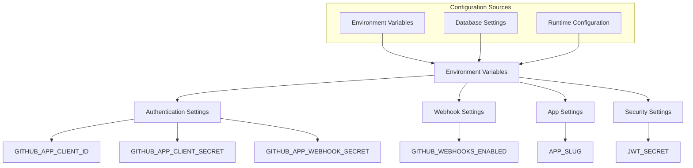

Key configuration options include:

- **GITHUB_APP_CLIENT_ID**: The client ID for the GitHub App, used in OAuth flows.
- **GITHUB_APP_CLIENT_SECRET**: The client secret for the GitHub App, used to authenticate OAuth requests.
- **GITHUB_APP_WEBHOOK_SECRET**: The shared secret used to verify webhook signatures, ensuring requests originate from GitHub.
- **GITHUB_WEBHOOKS_ENABLED**: A boolean flag to enable or disable webhook processing.
- **JWT_SECRET**: The secret key used for encrypting tokens and other sensitive data.
- **APP_SLUG**: The unique identifier for the GitHub App, used in installation URLs.

These configuration options are typically set during deployment and can be managed through environment variables or configuration files. The system validates these settings during startup to ensure all required configuration is present.

The integration also supports configuration through the OpenHands admin interface, allowing certain settings to be modified without requiring server restarts.

**Section sources**
- [config.py](file://enterprise/server/config.py)

## Error Handling

The GitHub Integration implements comprehensive error handling to manage various failure scenarios gracefully. This ensures the system remains stable and provides meaningful feedback when issues occur.

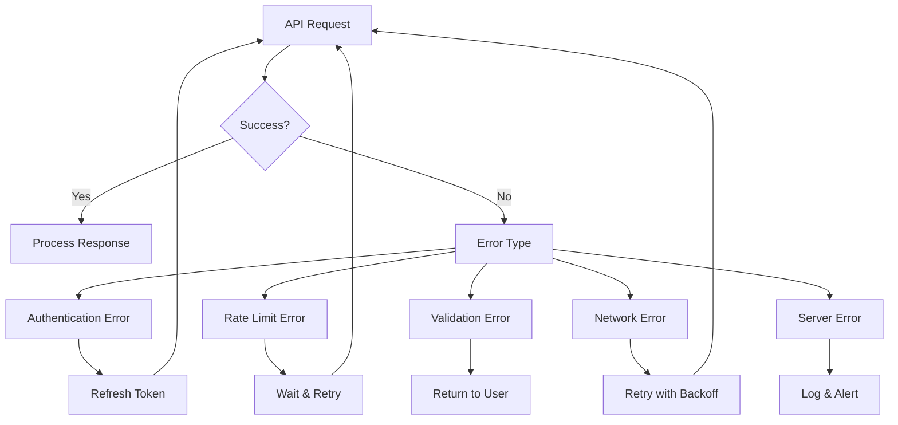

Key error handling patterns:

- **Authentication Errors**: When token expiration or invalidation is detected, the system attempts to refresh the token automatically before retrying the request.

- **Rate Limiting**: The system monitors GitHub's rate limit headers and implements exponential backoff when approaching rate limits to avoid being blocked.

- **Network Errors**: Transient network issues are handled with retry logic using exponential backoff to improve reliability.

- **Validation Errors**: Input validation errors are caught and returned to the user with descriptive messages to help correct the issue.

- **Repository Permission Errors**: When access to a repository is denied, the system provides clear guidance on how to resolve the issue, typically by reinstalling the GitHub App with appropriate permissions.

The system also includes comprehensive logging for all errors, capturing relevant context to aid in debugging and monitoring. This includes logging the request URL, status code, and error message while ensuring sensitive information like tokens is not logged.

**Section sources**
- [github_service.py](file://enterprise/integrations/github/github_service.py)
- [token_manager.py](file://enterprise/server/auth/token_manager.py)

## Troubleshooting Guide

This troubleshooting guide addresses common issues encountered with the GitHub Integration and provides solutions for resolving them.

### Token Expiration Issues

**Symptoms**: 
- Authentication failures
- "Invalid token" errors
- Unable to access repositories

**Solutions**:
1. Check if the GitHub App installation is still active in the user's GitHub account
2. Re-authenticate through the OAuth flow to obtain new tokens
3. Verify that the `GITHUB_APP_CLIENT_ID` and `GITHUB_APP_CLIENT_SECRET` are correctly configured
4. Check the token manager logs for refresh token errors

### Rate Limiting Problems

**Symptoms**:
- API requests failing with 403 status
- "Rate limit exceeded" messages
- Slow response times

**Solutions**:
1. Implement request batching to reduce the number of API calls
2. Add caching for frequently accessed data
3. Monitor the `X-RateLimit-Remaining` header and implement appropriate delays
4. Consider using GitHub App tokens instead of user tokens, as they have higher rate limits

### Repository Permission Errors

**Symptoms**:
- "Repository not found" errors
- "Access denied" messages
- Unable to see expected repositories

**Solutions**:
1. Verify that the GitHub App has been installed with access to the required repositories
2. Check that the repository permissions in the GitHub App settings include the necessary repositories
3. Reinstall the GitHub App, ensuring all required permissions are granted
4. Verify that the user has appropriate access to the repositories in GitHub

### Webhook Configuration Issues

**Symptoms**:
- Events not being received
- "Signature verification failed" errors
- Webhook delivery failures

**Solutions**:
1. Verify that the `GITHUB_APP_WEBHOOK_SECRET` matches between the GitHub App configuration and the OpenHands environment
2. Check that the webhook URL is correctly configured in the GitHub App settings
3. Ensure that the `GITHUB_WEBHOOKS_ENABLED` environment variable is set to true
4. Verify network connectivity between GitHub and the OpenHands instance

### OAuth Flow Problems

**Symptoms**:
- Redirect loops during authentication
- "Invalid state" errors
- Callback URL mismatches

**Solutions**:
1. Verify that the callback URLs are correctly registered in the GitHub App settings
2. Check that the JWT secret is consistent across all instances
3. Clear browser cookies and retry the authentication flow
4. Verify that the `KEYCLOAK_SERVER_URL` and related settings are correctly configured

**Section sources**
- [github_utils.py](file://enterprise/server/auth/github_utils.py)
- [token_manager.py](file://enterprise/server/auth/token_manager.py)
- [github.py](file://enterprise/server/routes/integration/github.py)