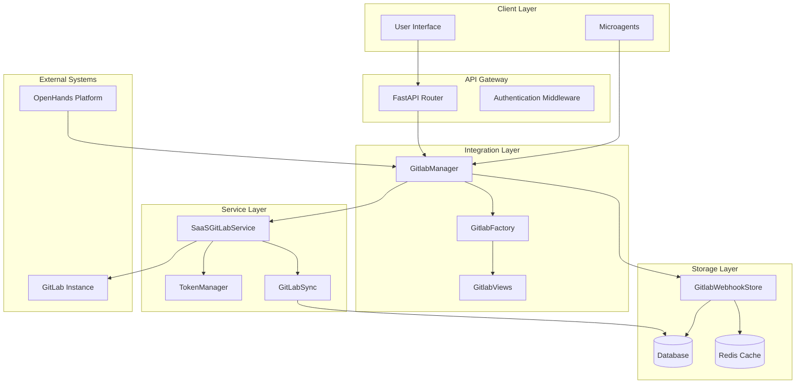
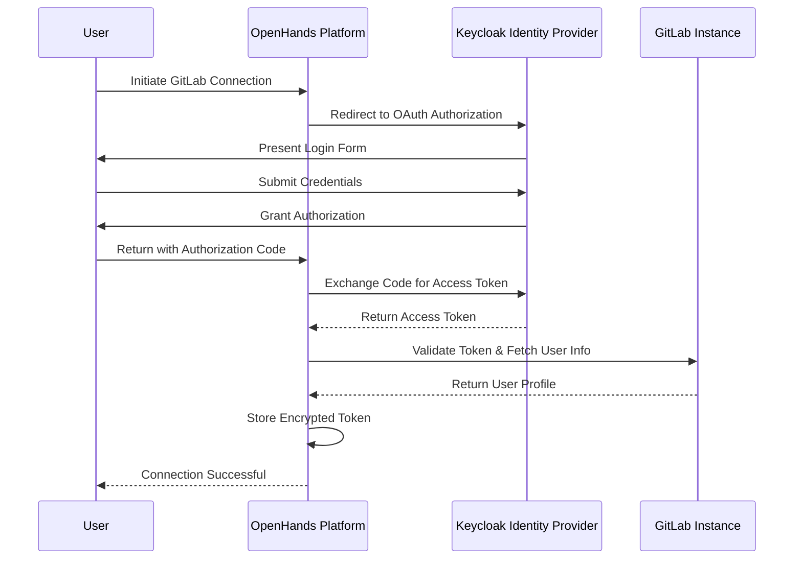
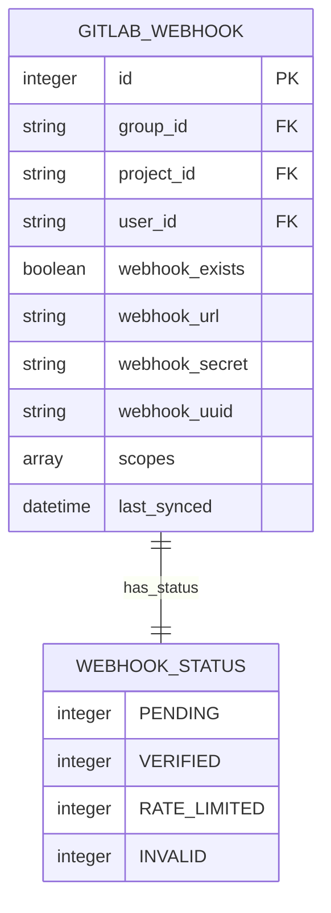
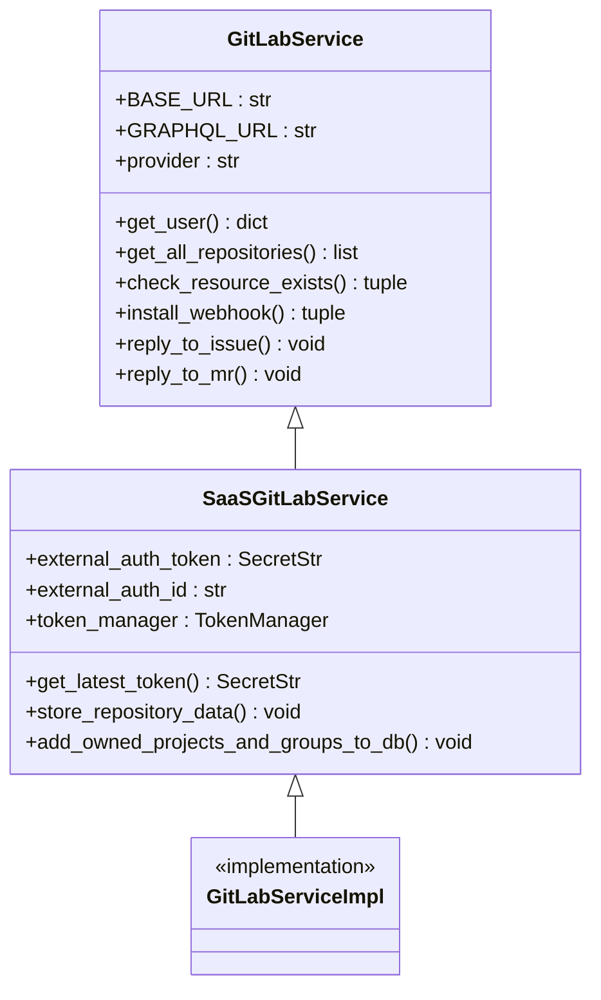
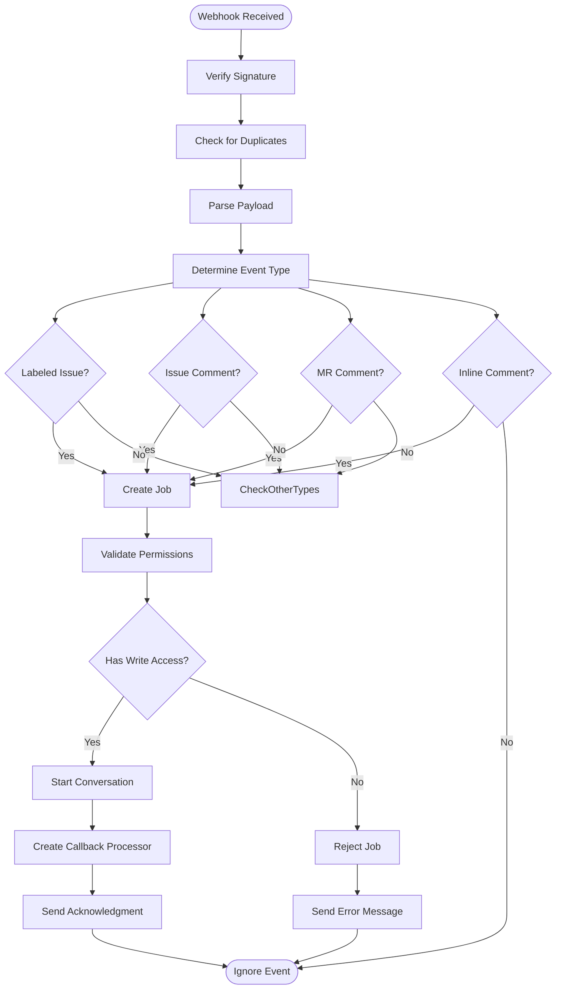
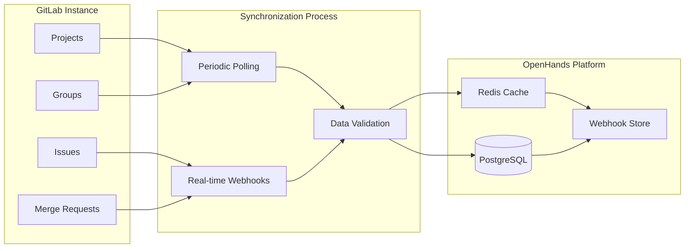
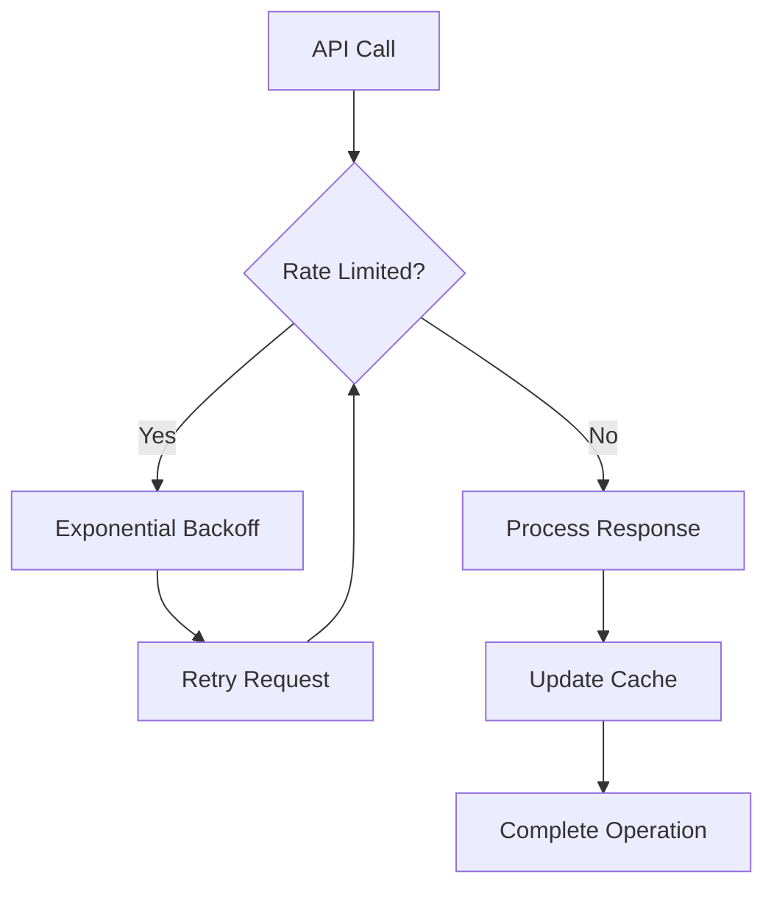
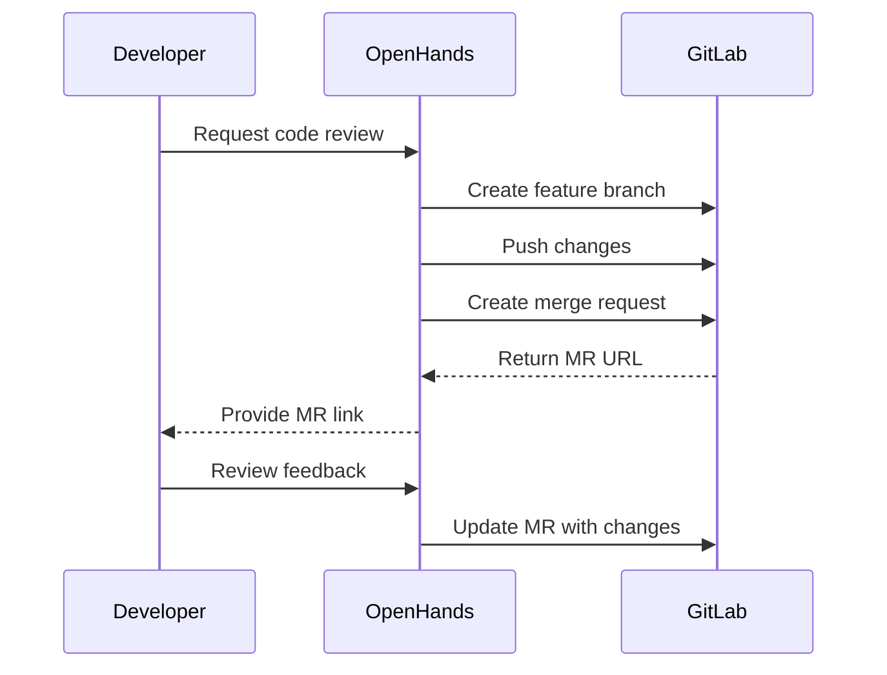

# GitLab Integration

<cite>
**Referenced Files in This Document**
- [gitlab_manager.py](file://enterprise/integrations/gitlab/gitlab_manager.py)
- [gitlab_service.py](file://enterprise/integrations/gitlab/gitlab_service.py)
- [gitlab_view.py](file://enterprise/integrations/gitlab/gitlab_view.py)
- [gitlab_sync.py](file://enterprise/server/auth/gitlab_sync.py)
- [gitlab.py](file://enterprise/server/routes/integration/gitlab.py)
- [gitlab_webhook.py](file://enterprise/storage/gitlab_webhook.py)
- [gitlab_webhook_store.py](file://enterprise/storage/gitlab_webhook_store.py)
- [gitlab_callback_processor.py](file://enterprise/conversation_callback_processor/gitlab_callback_processor.py)
- [gitlab.md](file://microagents/gitlab.md)
- [027_create_gitlab_webhook_table.py](file://enterprise/migrations/versions/027_create_gitlab_webhook_table.py)
- [032_add_status_column_to_gitlab_webhook.py](file://enterprise/migrations/versions/032_add_status_column_to_gitlab_webhook.py)
- [033_add_gitlab_webhook_uuid_column.py](file://enterprise/migrations/versions/033_add_gitlab_webhook_uuid_column.py)
</cite>

## Table of Contents
1. [Introduction](#introduction)
2. [Architecture Overview](#architecture-overview)
3. [OAuth Authentication](#oauth-authentication)
4. [Webhook Registration](#webhook-registration)
5. [REST API Integration](#rest-api-integration)
6. [Event Handling Mechanisms](#event-handling-mechanisms)
7. [Data Synchronization Patterns](#data-synchronization-patterns)
8. [Configuration Requirements](#configuration-requirements)
9. [Implementation Details](#implementation-details)
10. [Error Recovery Strategies](#error-recovery-strategies)
11. [Common Challenges and Solutions](#common-challenges-and-solutions)
12. [Practical Examples](#practical-examples)
13. [Troubleshooting Guide](#troubleshooting-guide)

## Introduction

The GitLab Integration feature enables seamless connectivity between OpenHands and GitLab repositories, providing comprehensive code review capabilities, merge request handling, and issue tracking functionality. This integration leverages OAuth authentication, webhook technology, and REST API communication to create a robust platform for collaborative development workflows.

The integration supports multiple GitLab resources including repositories, groups, issues, merge requests, and CI/CD pipelines. It provides automated event-driven processing, real-time synchronization, and intelligent conversation management for code-related activities.

## Architecture Overview

The GitLab Integration follows a layered architecture with clear separation of concerns:



**Diagram sources**
- [gitlab_manager.py](file://enterprise/integrations/gitlab/gitlab_manager.py#L31-L262)
- [gitlab.py](file://enterprise/server/routes/integration/gitlab.py#L14-L86)
- [gitlab_service.py](file://enterprise/integrations/gitlab/gitlab_service.py#L21-L530)

**Section sources**
- [gitlab_manager.py](file://enterprise/integrations/gitlab/gitlab_manager.py#L31-L262)
- [gitlab_service.py](file://enterprise/integrations/gitlab/gitlab_service.py#L21-L530)

## OAuth Authentication

The GitLab Integration implements OAuth 2.0 authentication with Keycloak as the identity provider. The authentication flow ensures secure access to GitLab resources while maintaining user privacy and compliance.

### Authentication Flow



### Token Management

The system employs a sophisticated token management strategy:

- **Encrypted Storage**: Access tokens are encrypted and stored securely in the database
- **Automatic Refresh**: Tokens are automatically refreshed when nearing expiration
- **Multi-Instance Support**: Supports both cloud and on-premise GitLab instances
- **Permission Scoping**: Tokens are scoped to specific GitLab resources and actions

**Section sources**
- [gitlab_service.py](file://enterprise/integrations/gitlab/gitlab_service.py#L47-L81)
- [gitlab_sync.py](file://enterprise/server/auth/gitlab_sync.py#L10-L32)

## Webhook Registration

The webhook system enables real-time event processing for GitLab activities. Webhooks are registered at both the project and group levels to capture comprehensive repository events.

### Webhook Configuration



**Diagram sources**
- [gitlab_webhook.py](file://enterprise/storage/gitlab_webhook.py#L15-L43)
- [027_create_gitlab_webhook_table.py](file://enterprise/migrations/versions/027_create_gitlab_webhook_table.py#L24-L37)

### Webhook Scopes

The integration supports various webhook scopes for different GitLab events:

| Scope | Description | Trigger Events |
|-------|-------------|----------------|
| `push_events` | Repository push notifications | Code commits, branch updates |
| `merge_requests_events` | Merge request activities | MR creation, approval, merge |
| `issues_events` | Issue tracking | Issue creation, updates, resolution |
| `pipeline_events` | CI/CD pipeline status | Pipeline start, success, failure |
| `confidential_issues_events` | Confidential issue events | Private issue activities |

**Section sources**
- [gitlab_service.py](file://enterprise/integrations/gitlab/gitlab_service.py#L405-L474)
- [gitlab_webhook.py](file://enterprise/storage/gitlab_webhook.py#L29-L30)

## REST API Integration

The REST API integration provides comprehensive GitLab API access with automatic rate limiting, error handling, and request optimization.

### API Service Architecture



**Diagram sources**
- [gitlab_service.py](file://enterprise/integrations/gitlab/gitlab_service.py#L21-L530)

### API Endpoints

The service exposes key GitLab API endpoints:

- **User Management**: `/users` - Retrieve user information and permissions
- **Repository Access**: `/projects` - List and manage repositories
- **Issue Tracking**: `/issues` - Create, update, and monitor issues
- **Merge Requests**: `/merge_requests` - Handle MR lifecycle
- **Webhook Management**: `/hooks` - Register and manage webhooks

**Section sources**
- [gitlab_service.py](file://enterprise/integrations/gitlab/gitlab_service.py#L21-L530)

## Event Handling Mechanisms

The event handling system processes GitLab webhooks and translates them into actionable tasks within the OpenHands platform.

### Event Processing Flow



**Diagram sources**
- [gitlab_manager.py](file://enterprise/integrations/gitlab/gitlab_manager.py#L74-L118)
- [gitlab.py](file://enterprise/server/routes/integration/gitlab.py#L35-L85)

### Supported Event Types

The system handles various GitLab event types:

| Event Type | Description | Action Taken |
|------------|-------------|--------------|
| `issue_label_added` | Issue labeled with OpenHands tag | Creates new conversation |
| `issue_comment` | Comment on issue mentioning OpenHands | Responds to comment |
| `merge_request_comment` | Comment on MR mentioning OpenHands | Creates MR conversation |
| `merge_request_inline_comment` | Inline code review comment | Creates inline review conversation |
| `push` | Code pushed to repository | Triggers CI/CD pipeline |
| `merge_request_approved` | MR approved | Updates conversation status |

**Section sources**
- [gitlab_view.py](file://enterprise/integrations/gitlab/gitlab_view.py#L240-L452)
- [gitlab_manager.py](file://enterprise/integrations/gitlab/gitlab_manager.py#L86-L118)

## Data Synchronization Patterns

The synchronization system maintains consistency between GitLab and OpenHands data through efficient caching and incremental updates.

### Synchronization Architecture



**Diagram sources**
- [gitlab_sync.py](file://enterprise/server/auth/gitlab_sync.py#L10-L32)
- [gitlab_webhook_store.py](file://enterprise/storage/gitlab_webhook_store.py#L15-L168)

### Repository Discovery

The system automatically discovers and registers repositories:

1. **Initial Discovery**: Fetch all user-accessible repositories
2. **Ownership Detection**: Identify personally owned repositories
3. **Webhook Registration**: Register webhooks for tracked resources
4. **Permission Validation**: Verify write access for each repository
5. **Incremental Updates**: Monitor changes and update metadata

**Section sources**
- [gitlab_service.py](file://enterprise/integrations/gitlab/gitlab_service.py#L171-L268)
- [gitlab_sync.py](file://enterprise/server/auth/gitlab_sync.py#L10-L32)

## Configuration Requirements

Proper configuration is essential for successful GitLab Integration deployment.

### Environment Variables

| Variable | Description | Required | Default |
|----------|-------------|----------|---------|
| `OPENHANDS_GITLAB_SERVICE_CLS` | Service implementation class | No | `openhands.integrations.gitlab.gitlab_service.GitLabService` |
| `GITLAB_BASE_DOMAIN` | GitLab instance URL | Yes | `gitlab.com` |
| `GITLAB_CLIENT_ID` | OAuth application client ID | Yes | - |
| `GITLAB_CLIENT_SECRET` | OAuth application secret | Yes | - |

### Database Schema

The integration requires specific database tables for webhook management:

```sql
CREATE TABLE gitlab_webhook (
    id SERIAL PRIMARY KEY,
    group_id VARCHAR NULL,
    project_id VARCHAR NULL,
    user_id VARCHAR NOT NULL,
    webhook_exists BOOLEAN NOT NULL,
    webhook_url VARCHAR NULL,
    webhook_secret VARCHAR NULL,
    webhook_uuid VARCHAR NULL,
    scopes TEXT[] NULL,
    last_synced TIMESTAMP WITH TIME ZONE DEFAULT CURRENT_TIMESTAMP
);

CREATE UNIQUE INDEX uq_gitlab_webhook_group_id ON gitlab_webhook (group_id);
CREATE UNIQUE INDEX uq_gitlab_webhook_project_id ON gitlab_webhook (project_id);
CREATE INDEX ix_gitlab_webhook_user_id ON gitlab_webhook (user_id);
CREATE INDEX ix_gitlab_webhook_group_id ON gitlab_webhook (group_id);
CREATE INDEX ix_gitlab_webhook_project_id ON gitlab_webhook (project_id);
```

**Section sources**
- [027_create_gitlab_webhook_table.py](file://enterprise/migrations/versions/027_create_gitlab_webhook_table.py#L24-L60)
- [gitlab_webhook.py](file://enterprise/storage/gitlab_webhook.py#L15-L43)

## Implementation Details

### GitLab Manager Service

The [`GitlabManager`](file://enterprise/integrations/gitlab/gitlab_manager.py#L31-L262) serves as the central orchestrator for GitLab integration activities:

- **Message Reception**: Processes incoming GitLab webhook messages
- **Permission Validation**: Verifies user access to target repositories
- **Job Creation**: Initiates conversations for code review tasks
- **Error Handling**: Manages failures gracefully with user feedback

### Service Layer Implementation

The [`SaaSGitLabService`](file://enterprise/integrations/gitlab/gitlab_service.py#L21-L530) provides the core GitLab API functionality:

- **Token Management**: Handles OAuth token acquisition and refresh
- **Rate Limiting**: Implements exponential backoff for API limits
- **Resource Validation**: Checks access permissions and resource existence
- **Webhook Operations**: Registers and manages GitLab webhooks

### View Factory Pattern

The [`GitlabFactory`](file://enterprise/integrations/gitlab/gitlab_view.py#L240-L452) creates appropriate view objects based on event types:

- **Issue Views**: Handle standard issue interactions
- **MR Views**: Manage merge request workflows
- **Inline Views**: Process code review comments
- **Comment Views**: Support threaded discussions

**Section sources**
- [gitlab_manager.py](file://enterprise/integrations/gitlab/gitlab_manager.py#L31-L262)
- [gitlab_service.py](file://enterprise/integrations/gitlab/gitlab_service.py#L21-L530)
- [gitlab_view.py](file://enterprise/integrations/gitlab/gitlab_view.py#L240-L452)

## Error Recovery Strategies

The integration implements comprehensive error handling and recovery mechanisms:

### Rate Limiting



### Error Categories

| Error Type | Cause | Recovery Strategy |
|------------|-------|-------------------|
| `RateLimitError` | API rate limits exceeded | Exponential backoff with jitter |
| `LLMAuthenticationError` | LLM API authentication failed | Prompt user to update credentials |
| `MissingSettingsError` | Required configuration missing | Guide user to settings page |
| `WebhookStatus.RATE_LIMITED` | Webhook installation blocked | Queue for retry with delay |
| `WebhookStatus.INVALID` | Invalid webhook configuration | Log error and notify admin |

### Duplicate Prevention

The system prevents duplicate event processing through Redis-based deduplication:

- **Hash-based Keys**: Unique keys generated from payload hashes
- **TTL Management**: Automatic cleanup after 60 seconds
- **Atomic Operations**: Thread-safe key creation with `NX` flag

**Section sources**
- [gitlab.py](file://enterprise/server/routes/integration/gitlab.py#L50-L67)
- [gitlab_manager.py](file://enterprise/integrations/gitlab/gitlab_manager.py#L256-L262)

## Common Challenges and Solutions

### Self-Signed Certificates

**Challenge**: On-premise GitLab instances often use self-signed certificates.

**Solution**: Configure certificate verification bypass for trusted instances:
```python
# In gitlab_service.py
if base_domain.startswith(('http://', 'https://')):
    self.BASE_URL = f'{base_domain}/api/v4'
else:
    self.BASE_URL = f'https://{base_domain}/api/v4'
```

### Permission Scopes

**Challenge**: Insufficient permissions prevent webhook installation.

**Solution**: Implement permission validation before webhook registration:
```python
# In gitlab_service.py
async def check_user_has_admin_access_to_resource(self, resource_type, resource_id):
    # Check if user has maintainer or owner access
    url = f'{self.BASE_URL}/{resource_type}/{resource_id}/members/all'
    response, _ = await self._make_request(url)
    # Validate access level >= 40 (Maintainer)
```

### Network Connectivity

**Challenge**: Firewall restrictions block webhook delivery.

**Solution**: Implement webhook verification and retry mechanisms:
- Verify webhook endpoint accessibility
- Log failed deliveries with detailed error information
- Provide manual webhook verification tools

**Section sources**
- [gitlab_service.py](file://enterprise/integrations/gitlab/gitlab_service.py#L62-L71)
- [gitlab_service.py](file://enterprise/integrations/gitlab/gitlab_service.py#L343-L403)

## Practical Examples

### Repository Linking

To link a GitLab repository with OpenHands:

1. **Configure OAuth Application**: Register OpenHands as a GitLab application
2. **Set Up Webhooks**: Enable webhook registration for the repository
3. **Grant Permissions**: Ensure adequate access levels for the user
4. **Verify Connection**: Test the integration with sample events

### Merge Request Creation

Automated merge request creation workflow:



### CI/CD Pipeline Monitoring

Pipeline monitoring integration:

1. **Webhook Registration**: Subscribe to pipeline events
2. **Status Tracking**: Monitor pipeline completion
3. **Failure Handling**: Notify developers of build failures
4. **Success Confirmation**: Report successful deployments

**Section sources**
- [gitlab.md](file://microagents/gitlab.md#L1-L35)
- [gitlab_manager.py](file://enterprise/integrations/gitlab/gitlab_manager.py#L167-L262)

## Troubleshooting Guide

### Common Issues

| Issue | Symptoms | Solution |
|-------|----------|----------|
| **Webhook Not Received** | Events not triggering conversations | Verify webhook URL and signature |
| **Permission Denied** | Access denied errors | Check user permissions in GitLab |
| **Rate Limiting** | API calls failing | Implement exponential backoff |
| **Token Expired** | Authentication failures | Refresh OAuth tokens |
| **Duplicate Events** | Multiple conversations for same event | Check Redis deduplication |

### Diagnostic Commands

Monitor webhook health:
```bash
# Check webhook registrations
SELECT * FROM gitlab_webhook WHERE user_id = 'user_id';

# Verify webhook status
SELECT COUNT(*) FROM gitlab_webhook WHERE webhook_exists = true;

# Monitor event processing
SELECT COUNT(*) FROM event_store WHERE source = 'gitlab';
```

### Logging and Monitoring

Enable detailed logging for troubleshooting:
```python
# In gitlab_manager.py
logger.info(f'[GitLab] Processing event: {event_type}')
logger.warning(f'[GitLab] Permission denied for user: {user_id}')
logger.exception(f'[GitLab] Error processing webhook: {error}')
```

**Section sources**
- [gitlab.py](file://enterprise/server/routes/integration/gitlab.py#L83-L85)
- [gitlab_manager.py](file://enterprise/integrations/gitlab/gitlab_manager.py#L256-L262)