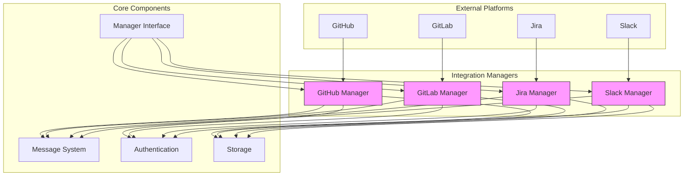
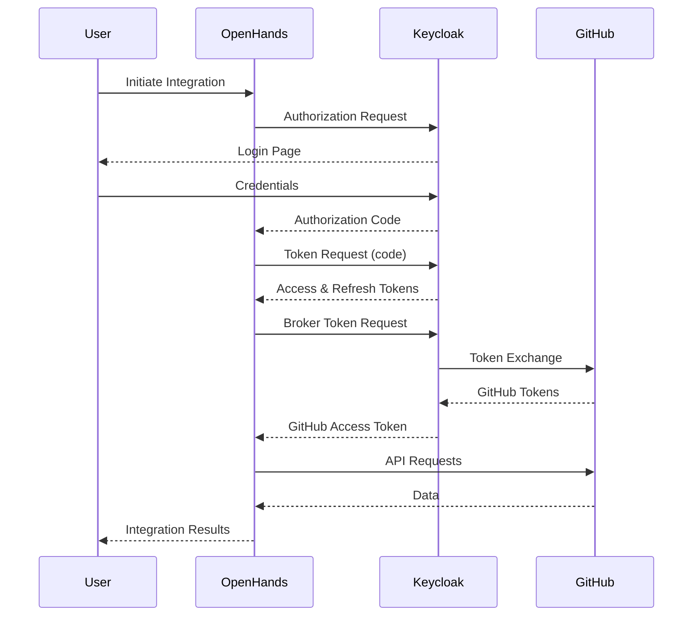
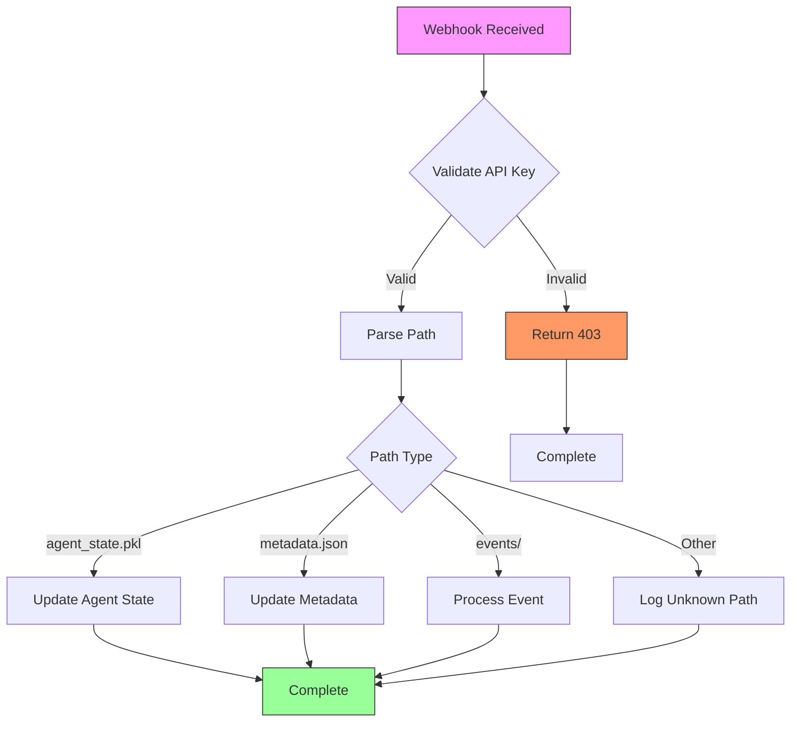
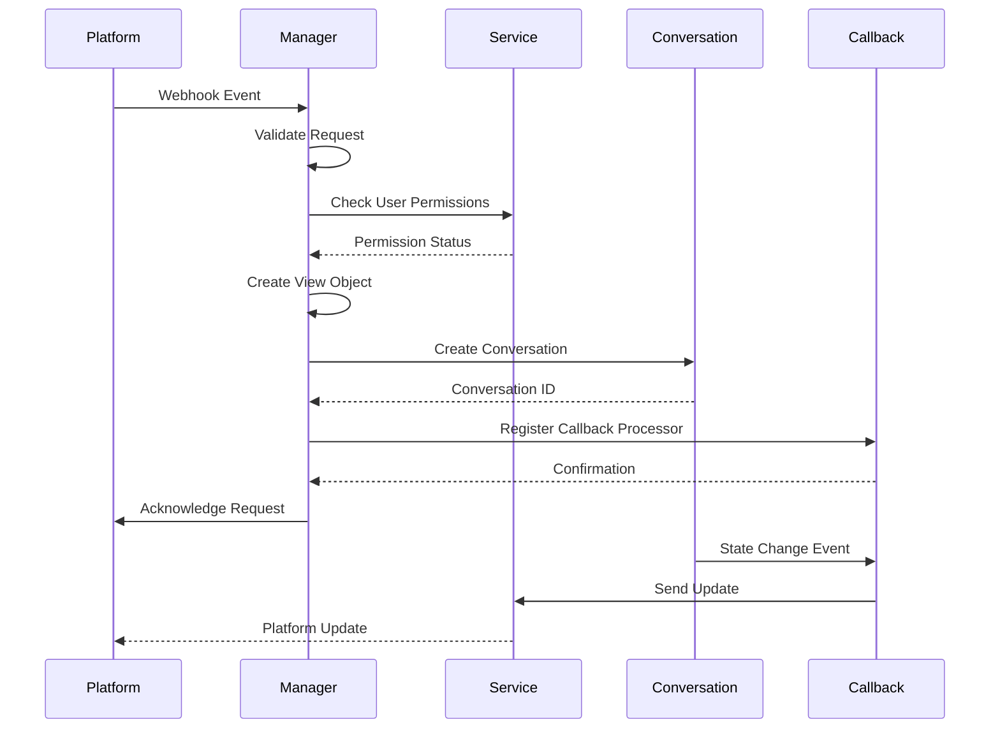

# Integrations

<cite>
**Referenced Files in This Document**   
- [manager.py](file://enterprise/integrations/manager.py)
- [models.py](file://enterprise/integrations/models.py)
- [types.py](file://enterprise/integrations/types.py)
- [github_service.py](file://enterprise/integrations/github/github_service.py)
- [gitlab_manager.py](file://enterprise/integrations/gitlab/gitlab_manager.py)
- [jira_view.py](file://enterprise/integrations/jira/jira_view.py)
- [slack_types.py](file://enterprise/integrations/slack/slack_types.py)
- [github_callback_processor.py](file://enterprise/server/conversation_callback_processor/github_callback_processor.py)
- [token_manager.py](file://enterprise/server/auth/token_manager.py)
- [jira_integration_store.py](file://enterprise/storage/jira_integration_store.py)
- [gitlab_webhook_store.py](file://enterprise/storage/gitlab_webhook_store.py)
- [event_webhook.py](file://enterprise/server/routes/event_webhook.py)
- [middleware.py](file://enterprise/server/middleware.py)
</cite>

## Table of Contents
1. [Introduction](#introduction)
2. [Architecture Overview](#architecture-overview)
3. [Core Components](#core-components)
4. [Authentication System](#authentication-system)
5. [Webhook Handling](#webhook-handling)
6. [API Abstraction Layers](#api-abstraction-layers)
7. [Component Interactions](#component-interactions)
8. [Infrastructure Requirements](#infrastructure-requirements)
9. [Scalability Considerations](#scalability-considerations)
10. [Deployment Topology](#deployment-topology)
11. [System Context Diagrams](#system-context-diagrams)
12. [Cross-Cutting Concerns](#cross-cutting-concerns)
13. [Technology Stack](#technology-stack)
14. [Conclusion](#conclusion)

## Introduction

The Integrations component in OpenHands provides a comprehensive system for connecting with multiple development platforms including GitHub, GitLab, Jira, Slack, and Linear. This architectural documentation details the design patterns, component interactions, and technical implementation of the integration system. The system enables seamless communication between OpenHands and external platforms through OAuth authentication, webhook handling, and API abstraction layers. The architecture supports asynchronous processing, secure token management, and event-driven workflows to facilitate automated agent interactions with development platforms.

**Section sources**
- [manager.py](file://enterprise/integrations/manager.py#L1-L31)
- [models.py](file://enterprise/integrations/models.py#L1-L53)

## Architecture Overview

The Integrations architecture follows a modular, service-oriented design with clear separation of concerns. The system is organized into several key layers: integration managers, service implementations, authentication systems, and storage components. Each integration platform (GitHub, GitLab, Jira, etc.) has dedicated manager classes that handle platform-specific logic while adhering to common interfaces. The architecture enables consistent handling of messages, authentication, and data synchronization across different platforms.

The core architectural pattern is based on the Manager abstract base class, which defines the contract for all integration managers. This pattern ensures consistent implementation of key operations like receiving messages, sending responses, and managing job lifecycles. The system uses a message-passing approach where integration events are encapsulated in Message objects that flow between components. This decoupled design allows for flexible extension and maintenance of individual integration implementations.

**Diagram sources**
- [manager.py](file://enterprise/integrations/manager.py#L6-L27)
- [models.py](file://enterprise/integrations/models.py#L8-L16)

## Core Components

The Integrations component consists of several core components that work together to enable platform connectivity. The Manager class serves as the abstract base class for all integration managers, defining the essential operations that each platform implementation must support. The Message class provides a standardized format for communication between OpenHands and external platforms, with a SourceType enum that identifies the origin of each message.

Each integration platform has a dedicated manager implementation that inherits from the base Manager class. These managers handle platform-specific logic while maintaining a consistent interface. The managers coordinate between the authentication system, storage layer, and external API clients to process integration events. The component design emphasizes separation of concerns, with distinct responsibilities for message handling, job management, and response generation.

The integration system also includes specialized view classes for each platform, which encapsulate the context and metadata needed to interact with specific resources (issues, pull requests, etc.). These view objects provide a consistent interface for creating conversations, sending messages, and managing integration state across different platforms.

**Section sources**
- [manager.py](file://enterprise/integrations/manager.py#L6-L31)
- [models.py](file://enterprise/integrations/models.py#L8-L53)
- [types.py](file://enterprise/integrations/types.py#L8-L52)

## Authentication System

The authentication system in OpenHands uses OAuth 2.0 with Keycloak as the identity provider to manage access to external platforms. The TokenManager class serves as the central component for handling authentication tokens, providing methods to retrieve, refresh, and store tokens for different identity providers. The system supports multiple authentication flows including authorization code, refresh token, and offline token mechanisms.

Token management follows a secure pattern where sensitive credentials are encrypted using Fernet encryption before storage. The system automatically handles token expiration and refresh, ensuring uninterrupted access to integrated platforms. For GitHub integration, the SaaSGitHubService class extends the base GitHubService to incorporate enterprise authentication features, including support for external authentication tokens and user IDs.

The authentication architecture includes retry mechanisms for handling transient connection errors with Keycloak, with exponential backoff strategies to prevent overwhelming the identity provider. The system also implements comprehensive error handling for authentication failures, providing clear feedback to users when credentials are missing or invalid.

**Diagram sources**
- [token_manager.py](file://enterprise/server/auth/token_manager.py#L77-L670)
- [github_service.py](file://enterprise/integrations/github/github_service.py#L13-L144)

## Webhook Handling

The webhook handling system in OpenHands processes incoming events from integrated platforms through dedicated routes and processors. The event_webhook.py module defines API endpoints that receive webhook payloads from external services, with specific handlers for batch operations and individual file writes. The system uses a background task pattern to process batched webhook requests asynchronously, ensuring responsive handling of high-volume events.

Webhook processing follows a structured workflow where incoming requests are authenticated using session API keys, parsed to extract conversation and subpath information, and routed to appropriate handlers based on the operation type and path. The system distinguishes between different types of webhook events, including agent state changes, conversation metadata updates, and event stream modifications.

For GitLab integration, the GitlabWebhookStore class manages webhook subscriptions and synchronization state. It provides methods to store, update, and delete webhook configurations, with support for both project-level and group-level webhooks. The store uses database transactions to ensure data consistency and includes timestamp tracking to prevent duplicate processing of webhook events.

**Diagram sources**
- [event_webhook.py](file://enterprise/server/routes/event_webhook.py#L1-L242)
- [gitlab_webhook_store.py](file://enterprise/storage/gitlab_webhook_store.py#L1-L231)

## API Abstraction Layers

The API abstraction layers in OpenHands provide a consistent interface for interacting with different development platforms while encapsulating platform-specific implementation details. The integration system uses service classes that abstract the underlying API clients, providing higher-level operations that are meaningful to the application logic. For example, the SaaSGitHubService class extends the base GitHubService to add enterprise-specific functionality while maintaining a consistent interface.

The abstraction layers follow a pattern of separating concerns between message handling, data retrieval, and business logic. Each integration manager uses its corresponding service implementation to perform API operations, but the manager itself focuses on coordination and workflow management. This separation allows for easier maintenance and extension of individual integration implementations.

The system also includes data model abstractions that standardize the representation of platform resources across different services. The Message class provides a common format for communication, while platform-specific view classes (like JiraViewInterface) define consistent interfaces for interacting with resources like issues and pull requests. These abstractions enable the core application logic to work with integration data in a platform-agnostic way.

**Section sources**
- [github_service.py](file://enterprise/integrations/github/github_service.py#L13-L144)
- [jira_view.py](file://enterprise/integrations/jira/jira_view.py#L27-L223)
- [slack_types.py](file://enterprise/integrations/slack/slack_types.py#L10-L49)

## Component Interactions

The integration components interact through well-defined interfaces and message-passing patterns. The primary interaction flow begins with an external platform sending a webhook event to OpenHands, which is processed by the corresponding integration manager. The manager validates the request, authenticates the user, and determines whether a job should be initiated based on the event content.

When a job is requested, the manager creates a platform-specific view object that encapsulates the context needed to interact with the external resource. This view is used to create a new conversation in OpenHands, with appropriate instructions and user messages. The conversation is then associated with a callback processor that will handle subsequent events and send updates back to the external platform.

The interaction between the conversation system and integration components is mediated through the event callback mechanism. When significant events occur in a conversation (such as state changes), registered callback processors are invoked to send updates to the corresponding external platform. This event-driven architecture ensures that integration status is kept synchronized without requiring constant polling.

**Diagram sources**
- [gitlab_manager.py](file://enterprise/integrations/gitlab/gitlab_manager.py#L31-L262)
- [github_callback_processor.py](file://enterprise/server/conversation_callback_processor/github_callback_processor.py#L27-L144)

## Infrastructure Requirements

The Integrations component has specific infrastructure requirements to support reliable and secure operation. The system requires a PostgreSQL database to store integration metadata, authentication tokens, and conversation state. The database schema includes tables for managing GitHub app installations, GitLab webhooks, Jira workspace configurations, and other integration-specific data.

The system depends on Redis for caching and message queuing, particularly for handling background tasks and event processing. The event webhook system uses background tasks to process batch operations asynchronously, requiring a task queue implementation that can handle high volumes of webhook events. The system also requires access to an SMTP server for sending email notifications related to integration events.

For authentication, the system requires connectivity to a Keycloak identity provider instance, which manages user identities and OAuth flows. The integration services need network access to external platforms (GitHub, GitLab, Jira, etc.) to make API calls and receive webhook events. The infrastructure must support HTTPS for secure communication with both external platforms and client applications.

The system also requires sufficient storage capacity for conversation data, event logs, and runtime artifacts. The storage requirements scale with the number of active conversations and integration events, with typical deployments requiring multiple gigabytes of storage for production workloads.

**Section sources**
- [jira_integration_store.py](file://enterprise/storage/jira_integration_store.py#L1-L251)
- [gitlab_webhook_store.py](file://enterprise/storage/gitlab_webhook_store.py#L1-L231)
- [token_manager.py](file://enterprise/server/auth/token_manager.py#L33-L37)

## Scalability Considerations

The Integrations architecture includes several scalability features to handle growing workloads. The system uses asynchronous processing for webhook handling and background tasks, allowing it to manage high volumes of integration events without blocking request threads. The event webhook system processes batch operations in the background, enabling efficient handling of multiple file operations from runtime environments.

The database access patterns are optimized for performance, with appropriate indexing on frequently queried fields like conversation IDs, user IDs, and integration keys. The system implements connection pooling for database access and uses efficient query patterns to minimize latency. For high-traffic integrations, the architecture supports horizontal scaling by deploying multiple instances of the integration services behind a load balancer.

The token management system includes caching mechanisms to reduce the frequency of database queries for authentication tokens. The system also implements rate limiting and retry strategies to handle API rate limits from external platforms, preventing service disruptions during peak usage periods. The event-driven architecture allows for independent scaling of different components based on their specific workload characteristics.

The system is designed to handle intermittent connectivity to external platforms by queuing events and retrying failed operations. This resilience ensures reliable operation even when external services experience temporary outages or rate limiting.

**Section sources**
- [event_webhook.py](file://enterprise/server/routes/event_webhook.py#L53-L144)
- [token_manager.py](file://enterprise/server/auth/token_manager.py#L146-L150)
- [gitlab_webhook_store.py](file://enterprise/storage/gitlab_webhook_store.py#L33-L78)

## Deployment Topology

The Integrations services are typically deployed as part of a larger OpenHands application cluster. The recommended deployment topology includes multiple instances of the integration services running behind a load balancer to ensure high availability and fault tolerance. Each service instance connects to a shared PostgreSQL database and Redis instance for data persistence and caching.

The deployment architecture follows a microservices pattern, with the integration components deployed separately from the core OpenHands services. This separation allows for independent scaling and maintenance of the integration layer. The services communicate with each other through well-defined API endpoints and message queues.

For production deployments, the system should be deployed in a containerized environment using Docker and orchestrated with Kubernetes or a similar container orchestration platform. This enables automated scaling, rolling updates, and self-healing capabilities. The containers should be configured with appropriate resource limits and health checks to ensure stable operation.

The deployment topology should include monitoring and logging infrastructure to track the health and performance of the integration services. Metrics should be collected for key indicators such as request latency, error rates, and throughput. Logs should be aggregated and analyzed to detect and troubleshoot issues quickly.

**Section sources**
- [containers/app/Dockerfile](file://containers/app/Dockerfile)
- [containers/dev/compose.yml](file://containers/dev/compose.yml)
- [kind/cluster.yaml](file://kind/cluster.yaml)

## System Context Diagrams

The integration workflow from authentication to data synchronization follows a well-defined sequence of steps. The process begins with user authentication through Keycloak, followed by token exchange to access external platforms. Once authenticated, the system can receive webhook events from integrated platforms and initiate conversations in response to user actions.

The data synchronization flow involves bidirectional communication between OpenHands and external platforms. When a user requests assistance through a platform integration, OpenHands creates a conversation and sends acknowledgment messages back to the platform. As the conversation progresses, updates are sent to keep the integration synchronized. When the conversation completes, the final results are sent back to the originating platform.

**Diagram sources**
- [token_manager.py](file://enterprise/server/auth/token_manager.py#L88-L111)
- [gitlab_manager.py](file://enterprise/integrations/gitlab/gitlab_manager.py#L74-L85)
- [github_callback_processor.py](file://enterprise/server/conversation_callback_processor/github_callback_processor.py#L38-L65)

## Cross-Cutting Concerns

The Integrations component addresses several cross-cutting concerns to ensure reliable and secure operation. Rate limiting is implemented at multiple levels, with the system respecting external platform API rate limits and implementing internal rate limiting to prevent abuse. The token manager includes retry mechanisms with exponential backoff to handle rate-limited API responses gracefully.

Error handling is comprehensive, with structured exception types for different failure modes including authentication errors, missing settings, and platform-specific issues. The system logs detailed error information while avoiding the exposure of sensitive data. For critical operations, the system implements retry logic with configurable backoff strategies to handle transient failures.

Data consistency is maintained through the use of database transactions for critical operations and careful management of distributed state. The system uses timestamp tracking and synchronization markers to prevent duplicate processing of webhook events. For sensitive data like authentication tokens, the system implements encryption at rest using Fernet encryption with keys derived from the application's JWT secret.

Security is a primary concern, with authentication tokens encrypted before storage and session management implemented through secure cookies with appropriate flags (HttpOnly, Secure). The system validates all incoming webhook requests and uses secure communication channels for all external connections.

**Section sources**
- [token_manager.py](file://enterprise/server/auth/token_manager.py#L146-L150)
- [middleware.py](file://enterprise/server/middleware.py#L1-L175)
- [github_callback_processor.py](file://enterprise/server/conversation_callback_processor/github_callback_processor.py#L140-L143)

## Technology Stack

The Integrations component is built using a modern Python technology stack with several key components. The core framework is FastAPI, which provides the web server and API routing capabilities. The system uses SQLAlchemy with async support for database access, with PostgreSQL as the primary database backend. For authentication, the system integrates with Keycloak as the identity provider, using OAuth 2.0 and OpenID Connect protocols.

The integration services use httpx for making asynchronous HTTP requests to external APIs, providing efficient handling of API calls with connection pooling and timeout management. For data serialization and validation, the system uses Pydantic models, ensuring type safety and data integrity throughout the application.

The system relies on several key Python packages for specific functionality: jwt for JSON Web Token handling, cryptography for encryption operations, and tenacity for retry logic. The template system uses Jinja2 for generating platform-specific messages and instructions. For distributed task processing, the system uses FastAPI's background tasks feature to handle asynchronous operations.

The deployment infrastructure is container-based, using Docker for packaging and Kubernetes for orchestration. The system uses Redis for caching and message queuing, and PostgreSQL for persistent storage. Monitoring and logging are implemented using standard Python logging with structured output for analysis.

**Section sources**
- [requirements.txt](file://pyproject.toml)
- [token_manager.py](file://enterprise/server/auth/token_manager.py#L8-L37)
- [event_webhook.py](file://enterprise/server/routes/event_webhook.py#L6-L14)

## Conclusion

The Integrations component in OpenHands provides a robust and extensible architecture for connecting with multiple development platforms. The system's modular design, with clear separation of concerns and well-defined interfaces, enables reliable integration with GitHub, GitLab, Jira, Slack, and other platforms. The authentication system securely manages access to external services using OAuth 2.0 with Keycloak as the identity provider.

The architecture supports asynchronous processing and event-driven workflows, ensuring responsive handling of integration events while maintaining data consistency. The system's scalability features, including background task processing and efficient database access patterns, enable it to handle growing workloads in production environments. Comprehensive error handling, rate limiting, and security measures ensure reliable and secure operation.

The technology stack leverages modern Python frameworks and libraries to provide a maintainable and performant implementation. The containerized deployment model supports flexible scaling and integration with modern DevOps practices. Overall, the Integrations component delivers a powerful platform for connecting OpenHands with the broader development ecosystem, enabling seamless automation and assistance across multiple tools and services.