# Jira Integration

<cite>
**Referenced Files in This Document**   
- [jira_types.py](file://enterprise/integrations/jira/jira_types.py)
- [jira_view.py](file://enterprise/integrations/jira/jira_view.py)
- [jira_dc_types.py](file://enterprise/integrations/jira_dc/jira_dc_types.py)
- [jira_dc_view.py](file://enterprise/integrations/jira_dc/jira_dc_view.py)
- [jira_callback_processor.py](file://enterprise/server/conversation_callback_processor/jira_callback_processor.py)
- [jira_dc_callback_processor.py](file://enterprise/server/conversation_callback_processor/jira_dc_callback_processor.py)
- [jira_integration_store.py](file://enterprise/storage/jira_integration_store.py)
- [jira_dc_integration_store.py](file://enterprise/storage/jira_dc_integration_store.py)
- [jira_workspace.py](file://enterprise/storage/jira_workspace.py)
- [jira_dc_workspace.py](file://enterprise/storage/jira_dc_workspace.py)
- [jira_user.py](file://enterprise/storage/jira_user.py)
- [jira_dc_user.py](file://enterprise/storage/jira_dc_user.py)
- [jira_conversation.py](file://enterprise/storage/jira_conversation.py)
- [jira_dc_conversation.py](file://enterprise/storage/jira_dc_conversation.py)
- [jira_manager.py](file://enterprise/integrations/jira/jira_manager.py)
- [jira_dc_manager.py](file://enterprise/integrations/jira_dc/jira_dc_manager.py)
- [constants.py](file://enterprise/server/auth/constants.py)
- [use-integration-status.ts](file://frontend/src/hooks/query/use-integration-status.ts)
- [use-configure-integration.ts](file://frontend/src/hooks/mutation/use-configure-integration.ts)
</cite>

## Table of Contents
1. [Introduction](#introduction)
2. [Architecture Overview](#architecture-overview)
3. [Core Components](#core-components)
4. [Authentication and Configuration](#authentication-and-configuration)
5. [Data Synchronization](#data-synchronization)
6. [Implementation Details](#implementation-details)
7. [Error Handling](#error-handling)
8. [Practical Examples](#practical-examples)
9. [Conclusion](#conclusion)

## Introduction

The Jira Integration feature in OpenHands provides a seamless bridge between development workflows and Jira project management, enabling bidirectional synchronization between code activities and Jira issues. This integration supports both Jira Cloud and Jira Data Center (DC) environments, allowing teams to maintain alignment between development progress and project tracking.

The integration enables developers to initiate conversations from Jira issues, track progress in real-time, and automatically synchronize status updates between pull requests and Jira tickets. By connecting OpenHands with Jira, teams can streamline their development workflow, reduce context switching, and maintain comprehensive audit trails of development activities directly within their Jira projects.

This documentation provides a comprehensive overview of the Jira Integration architecture, implementation details, configuration requirements, and practical usage scenarios.

**Section sources**
- [jira_types.py](file://enterprise/integrations/jira/jira_types.py#L1-L41)
- [jira_dc_types.py](file://enterprise/integrations/jira_dc/jira_dc_types.py#L1-L41)

## Architecture Overview

The Jira Integration architecture is designed to support both Jira Cloud and Jira Data Center deployments through parallel but distinct implementation paths. The system follows a modular design with clear separation between cloud and DC-specific components while maintaining consistent interfaces and patterns.

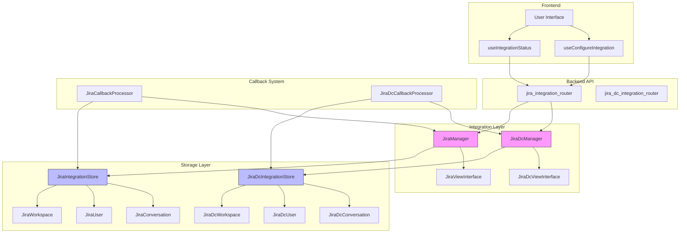

**Diagram sources **
- [jira_manager.py](file://enterprise/integrations/jira/jira_manager.py)
- [jira_dc_manager.py](file://enterprise/integrations/jira_dc/jira_dc_manager.py)
- [jira_integration_store.py](file://enterprise/storage/jira_integration_store.py)
- [jira_dc_integration_store.py](file://enterprise/storage/jira_dc_integration_store.py)

The architecture consists of several key layers:

1. **Frontend Layer**: Provides user interface components and React hooks for checking integration status and configuring Jira connections.

2. **API Router Layer**: Handles HTTP requests for Jira integration endpoints, routing them to the appropriate manager based on whether they target Jira Cloud or Jira Data Center.

3. **Integration Manager Layer**: Contains the core business logic for interacting with Jira APIs, with separate managers for Cloud (JiraManager) and Data Center (JiraDcManager) environments.

4. **View Layer**: Implements the factory pattern through JiraFactory and JiraDcFactory classes, creating appropriate view objects based on the context (new or existing conversation).

5. **Storage Layer**: Manages persistence of integration state, including workspace configurations, user mappings, and conversation-issue relationships.

6. **Callback System**: Handles asynchronous communication between OpenHands conversations and Jira issues, particularly for status updates and summaries.

The system supports bidirectional communication, allowing Jira issues to initiate conversations in OpenHands and OpenHands conversations to update Jira issues with progress summaries and status changes.

**Section sources**
- [jira_manager.py](file://enterprise/integrations/jira/jira_manager.py)
- [jira_dc_manager.py](file://enterprise/integrations/jira_dc/jira_dc_manager.py)
- [jira_integration_store.py](file://enterprise/storage/jira_integration_store.py)
- [jira_dc_integration_store.py](file://enterprise/storage/jira_dc_integration_store.py)

## Core Components

The Jira Integration consists of several core components that work together to provide seamless connectivity between OpenHands and Jira environments.

### Jira View Interface

The `JiraViewInterface` and `JiraDcViewInterface` serve as abstract base classes that define the contract for handling Jira interactions. These interfaces ensure consistent behavior across different types of Jira interactions while allowing for Cloud and DC-specific implementations.

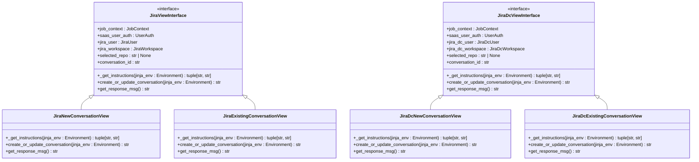

**Diagram sources **
- [jira_types.py](file://enterprise/integrations/jira/jira_types.py#L11-L41)
- [jira_view.py](file://enterprise/integrations/jira/jira_view.py#L28-L223)
- [jira_dc_types.py](file://enterprise/integrations/jira_dc/jira_dc_types.py#L11-L41)
- [jira_dc_view.py](file://enterprise/integrations/jira_dc/jira_dc_view.py#L31-L224)

The view classes implement different behaviors based on whether a conversation is being created for the first time or an existing conversation is being updated. The `JiraNewConversationView` handles the creation of new conversations with appropriate initialization instructions, while the `JiraExistingConversationView` manages updates to ongoing conversations.

### Integration Store

The integration store components provide data access and persistence for Jira integration state. These stores follow a consistent pattern across Cloud and DC implementations, with methods for creating, updating, and retrieving integration entities.

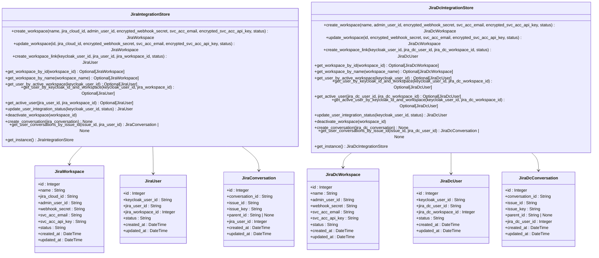

**Diagram sources **
- [jira_integration_store.py](file://enterprise/storage/jira_integration_store.py)
- [jira_dc_integration_store.py](file://enterprise/storage/jira_dc_integration_store.py)
- [jira_workspace.py](file://enterprise/storage/jira_workspace.py)
- [jira_dc_workspace.py](file://enterprise/storage/jira_dc_workspace.py)
- [jira_user.py](file://enterprise/storage/jira_user.py)
- [jira_dc_user.py](file://enterprise/storage/jira_dc_user.py)
- [jira_conversation.py](file://enterprise/storage/jira_conversation.py)
- [jira_dc_conversation.py](file://enterprise/storage/jira_dc_conversation.py)

The integration stores provide a comprehensive set of methods for managing the lifecycle of Jira integration entities, including workspace configuration, user linking, and conversation tracking.

**Section sources**
- [jira_integration_store.py](file://enterprise/storage/jira_integration_store.py#L1-L251)
- [jira_dc_integration_store.py](file://enterprise/storage/jira_dc_integration_store.py#L1-L263)
- [jira_workspace.py](file://enterprise/storage/jira_workspace.py#L1-L25)
- [jira_dc_workspace.py](file://enterprise/storage/jira_dc_workspace.py#L1-L24)

## Authentication and Configuration

The Jira Integration supports OAuth 2.0 authentication for both Jira Cloud and Data Center environments, with configuration managed through environment variables and API endpoints.

### Environment Configuration

The integration requires specific environment variables to be set for authentication and connection:

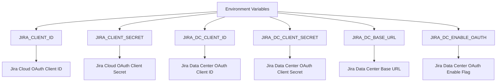

**Diagram sources **
- [constants.py](file://enterprise/server/auth/constants.py#L24-L31)

These environment variables are used to configure the OAuth 2.0 authentication flow for connecting to Jira instances. The Jira Cloud integration uses the standard Atlassian OAuth flow, while Jira Data Center supports both OAuth and service account authentication methods.

### Configuration Flow

The configuration process for connecting a Jira instance involves several steps:

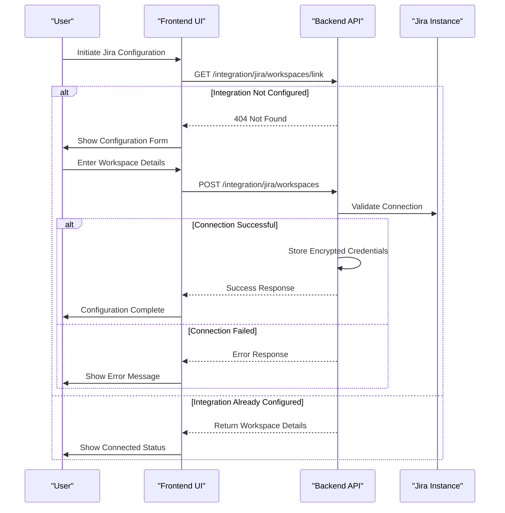

**Diagram sources **
- [use-integration-status.ts](file://frontend/src/hooks/query/use-integration-status.ts#L5-L22)
- [use-configure-integration.ts](file://frontend/src/hooks/mutation/use-configure-integration.ts#L18-L43)
- [jira_integration_router.py](file://enterprise/server/routes/integration/jira.py)

The configuration process begins with checking the current integration status. If no integration exists, the user is presented with a form to enter their Jira workspace details, including the workspace name, webhook secret, service account email, and API key. These credentials are securely stored in the database with sensitive information encrypted.

For Jira Cloud, the integration uses OAuth 2.0 with the client ID and secret configured in the environment variables. For Jira Data Center, the integration supports both OAuth and direct service account authentication, with the method determined by the `JIRA_DC_ENABLE_OAUTH` environment variable.

Once configured, the integration maintains a persistent connection to the Jira instance, allowing for real-time synchronization of issues and status updates.

**Section sources**
- [constants.py](file://enterprise/server/auth/constants.py#L24-L31)
- [use-integration-status.ts](file://frontend/src/hooks/query/use-integration-status.ts#L5-L22)
- [use-configure-integration.ts](file://frontend/src/hooks/mutation/use-configure-integration.ts#L18-L43)

## Data Synchronization

The Jira Integration provides bidirectional data synchronization between OpenHands conversations and Jira issues, ensuring that development progress is automatically reflected in project tracking and vice versa.

### Conversation Creation Flow

When a user initiates a conversation from a Jira issue, the system follows a specific flow to create and link the conversation:

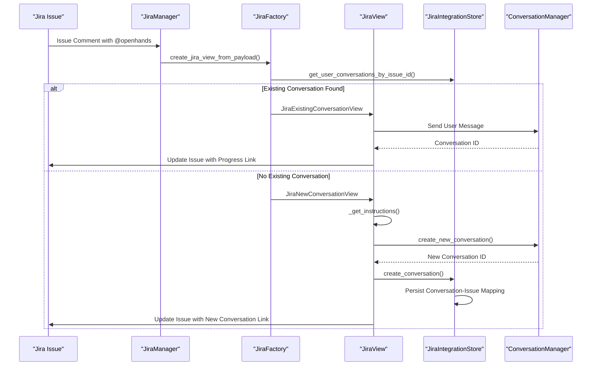

**Diagram sources **
- [jira_manager.py](file://enterprise/integrations/jira/jira_manager.py)
- [jira_view.py](file://enterprise/integrations/jira/jira_view.py#L187-L223)
- [jira_integration_store.py](file://enterprise/storage/jira_integration_store.py#L227-L246)
- [conversation_service.py](file://enterprise/server/services/conversation_service.py)

The conversation creation flow begins when a user mentions @openhands in a Jira issue comment. The JiraManager receives this event and uses the JiraFactory to determine whether to create a new conversation or update an existing one. The factory queries the JiraIntegrationStore to check for existing conversations linked to the issue.

If no existing conversation is found, a JiraNewConversationView is created, which generates appropriate instructions and creates a new conversation through the ConversationManager. The new conversation ID is then stored in the JiraIntegrationStore, creating a mapping between the conversation and the Jira issue. Finally, the Jira issue is updated with a link to the new conversation.

If an existing conversation is found, a JiraExistingConversationView is used to send the user's message to the existing conversation, allowing for continued discussion on the same topic.

### Status Synchronization

The integration automatically synchronizes conversation status back to Jira issues through callback processors that monitor conversation state changes:

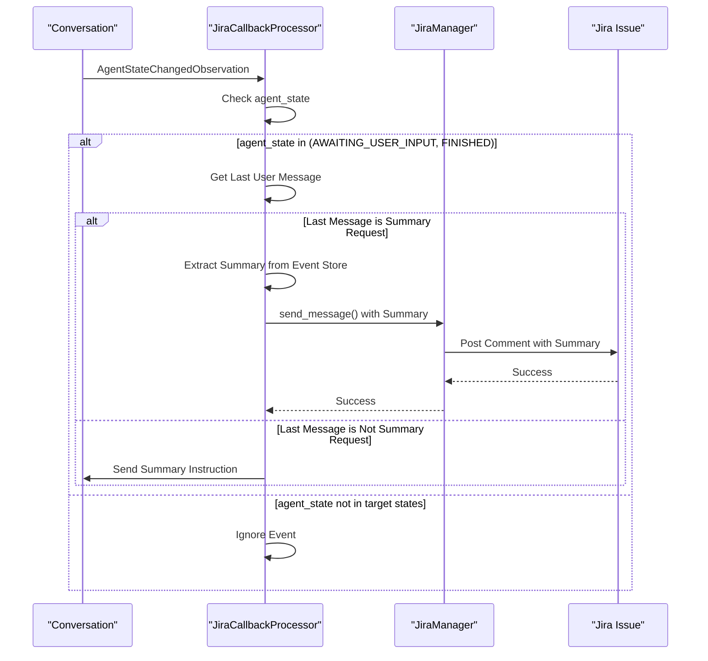

**Diagram sources **
- [jira_callback_processor.py](file://enterprise/server/conversation_callback_processor/jira_callback_processor.py#L28-L155)
- [jira_dc_callback_processor.py](file://enterprise/server/conversation_callback_processor/jira_dc_callback_processor.py#L27-L159)

The status synchronization process is triggered by agent state changes in conversations. When the agent state changes to AWAITING_USER_INPUT or FINISHED, the JiraCallbackProcessor is invoked. The processor first checks if the last user message was a summary request to prevent infinite loops.

If the last message was a summary request, the processor extracts the agent's response (which contains the summary) and sends it as a comment to the corresponding Jira issue. The summary is converted from Markdown to Jira Wiki Markup format using the `markdown_to_jira_markup` utility function.

If the last message was not a summary request, the processor sends a summary instruction to the conversation, prompting the agent to generate a summary of its work. This summary will then be captured in the next state change and sent back to Jira.

This bidirectional synchronization ensures that Jira issues always reflect the current status of development work, providing project managers and team members with up-to-date information without requiring manual updates.

**Section sources**
- [jira_callback_processor.py](file://enterprise/server/conversation_callback_processor/jira_callback_processor.py#L28-L155)
- [jira_dc_callback_processor.py](file://enterprise/server/conversation_callback_processor/jira_dc_callback_processor.py#L27-L159)
- [utils.py](file://enterprise/integrations/utils.py#L453-L558)

## Implementation Details

The Jira Integration implementation includes several key components that handle specific aspects of the integration, from data models to service clients.

### Data Models

The integration uses a consistent set of data models for both Jira Cloud and Jira Data Center, with parallel but separate implementations to accommodate differences between the platforms.

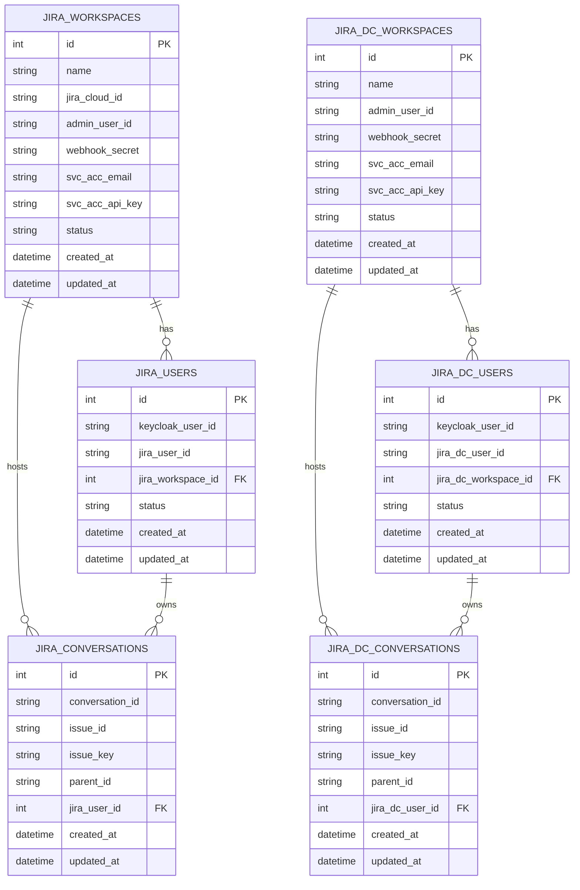

**Diagram sources **
- [jira_workspace.py](file://enterprise/storage/jira_workspace.py#L5-L25)
- [jira_user.py](file://enterprise/storage/jira_user.py)
- [jira_conversation.py](file://enterprise/storage/jira_conversation.py)
- [jira_dc_workspace.py](file://enterprise/storage/jira_dc_workspace.py#L5-L24)
- [jira_dc_user.py](file://enterprise/storage/jira_dc_user.py)
- [jira_dc_conversation.py](file://enterprise/storage/jira_dc_conversation.py)

The data model structure includes three main entity types for each platform (Cloud and DC):

1. **Workspaces**: Represent Jira instances with configuration details including authentication credentials and connection settings.

2. **Users**: Map OpenHands users (identified by Keycloak user ID) to Jira users, maintaining the integration status for each user-workspace combination.

3. **Conversations**: Link OpenHands conversations to Jira issues, preserving the bidirectional relationship between development work and project tracking.

The separation between Cloud and DC models allows for platform-specific fields while maintaining a consistent interface through the integration stores.

### Service Clients

The integration implements service clients for communicating with Jira APIs, with separate managers for Cloud and Data Center environments.

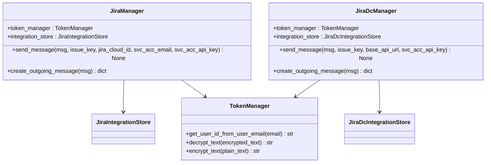

**Diagram sources **
- [jira_manager.py](file://enterprise/integrations/jira/jira_manager.py)
- [jira_dc_manager.py](file://enterprise/integrations/jira_dc/jira_dc_manager.py)
- [token_manager.py](file://enterprise/server/auth/token_manager.py)

The service clients handle the low-level communication with Jira APIs, abstracting the differences between Cloud and DC REST APIs. Both managers provide a `send_message` method that posts comments to Jira issues, but with different parameter requirements reflecting the API differences between the platforms.

The JiraManager for Cloud environments requires the Jira cloud ID, service account email, and API key to authenticate requests, while the JiraDcManager for Data Center environments uses the base API URL and API key. Both managers use the TokenManager to decrypt stored credentials before making API calls.

The `create_outgoing_message` method formats messages appropriately for the Jira API, handling any necessary transformations from OpenHands message format to Jira's expected format.

**Section sources**
- [jira_manager.py](file://enterprise/integrations/jira/jira_manager.py)
- [jira_dc_manager.py](file://enterprise/integrations/jira_dc/jira_dc_manager.py)
- [token_manager.py](file://enterprise/server/auth/token_manager.py)

## Error Handling

The Jira Integration includes comprehensive error handling for common scenarios such as connection timeouts, permission errors, and authentication failures.

### Error Types and Handling

The integration defines specific error handling strategies for different types of failures:

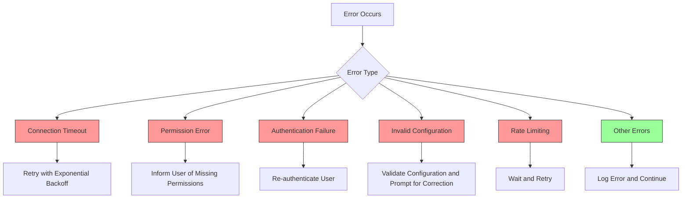

**Diagram sources **
- [jira_manager.py](file://enterprise/integrations/jira/jira_manager.py)
- [jira_dc_manager.py](file://enterprise/integrations/jira_dc/jira_dc_manager.py)
- [jira_callback_processor.py](file://enterprise/server/conversation_callback_processor/jira_callback_processor.py#L74-L76)
- [jira_dc_callback_processor.py](file://enterprise/server/conversation_callback_processor/jira_dc_callback_processor.py#L75-L77)

The error handling system categorizes errors into several types and applies appropriate recovery strategies:

1. **Connection Timeouts**: When a request to the Jira API times out, the system implements exponential backoff with retries to handle temporary network issues.

2. **Permission Errors**: If the service account lacks sufficient permissions to perform an action, the system logs the error and informs the user, suggesting they check their Jira permissions configuration.

3. **Authentication Failures**: When authentication fails (e.g., invalid credentials or expired tokens), the system triggers re-authentication flow to refresh credentials.

4. **Invalid Configuration**: For configuration errors such as incorrect workspace URLs or invalid API keys, the system validates the configuration and prompts the user to correct the settings.

5. **Rate Limiting**: When encountering rate limits from the Jira API, the system implements appropriate waiting periods before retrying requests.

6. **Other Errors**: For unexpected errors, the system logs detailed error information for debugging while attempting to continue operation.

### Exception Handling in Critical Paths

The integration uses structured exception handling in critical code paths to ensure robustness:

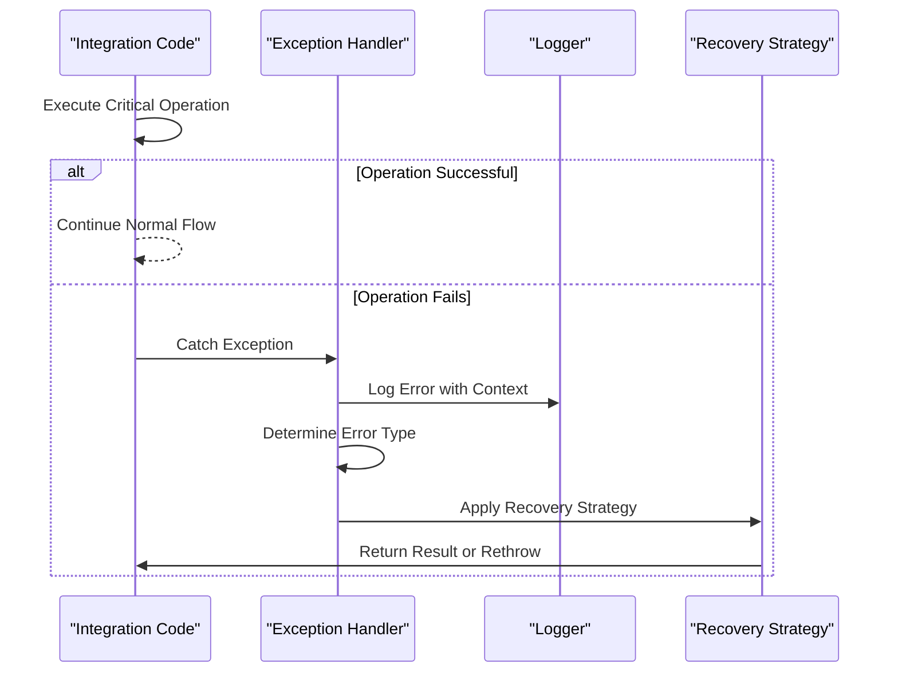

**Diagram sources **
- [jira_view.py](file://enterprise/integrations/jira/jira_view.py#L92-L96)
- [jira_dc_view.py](file://enterprise/integrations/jira_dc/jira_dc_view.py#L95-L99)
- [jira_callback_processor.py](file://enterprise/server/conversation_callback_processor/jira_callback_processor.py#L149-L154)
- [jira_dc_callback_processor.py](file://enterprise/server/conversation_callback_processor/jira_dc_callback_processor.py#L153-L158)

In critical paths such as conversation creation and status updates, the integration wraps operations in try-catch blocks to handle exceptions gracefully. When an error occurs, the system:

1. Logs the error with full context including the operation, parameters, and stack trace
2. Determines the error type to apply the appropriate recovery strategy
3. Attempts recovery according to the error type
4. Returns a meaningful result or rethrows the exception if recovery is not possible

The `StartingConvoException` is used specifically for errors that prevent conversation creation, providing clear error messages to users about what went wrong and how to resolve the issue.

**Section sources**
- [jira_view.py](file://enterprise/integrations/jira/jira_view.py#L37-L41)
- [jira_dc_view.py](file://enterprise/integrations/jira_dc/jira_dc_view.py#L37-L41)
- [jira_callback_processor.py](file://enterprise/server/conversation_callback_processor/jira_callback_processor.py#L149-L154)
- [jira_dc_callback_processor.py](file://enterprise/server/conversation_callback_processor/jira_dc_callback_processor.py#L153-L158)

## Practical Examples

The Jira Integration enables several practical use cases that enhance the development workflow by connecting code activities with project management.

### Issue Creation from Code Comments

Developers can initiate Jira issues directly from code comments by mentioning @openhands:

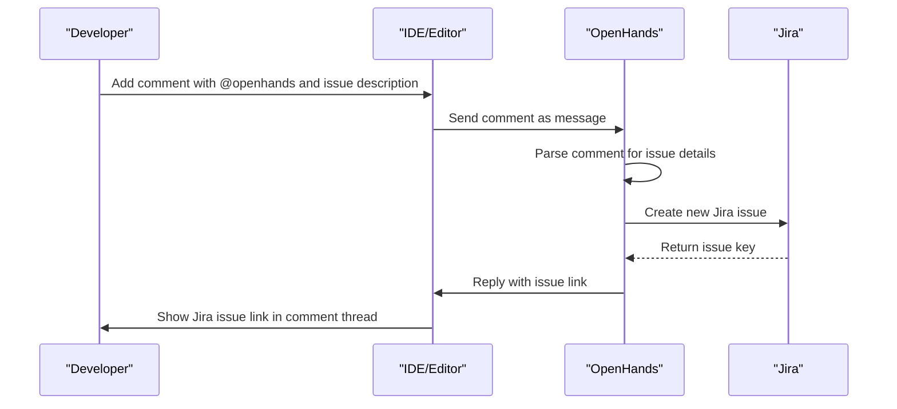

**Diagram sources **
- [jira_manager.py](file://enterprise/integrations/jira/jira_manager.py)
- [jira_view.py](file://enterprise/integrations/jira/jira_view.py)

When a developer adds a comment in their code that mentions @openhands followed by an issue description, OpenHands can automatically create a Jira issue. The system parses the comment to extract the issue title and description, creates the issue in the connected Jira project, and replies with a link to the newly created issue. This allows developers to capture ideas and bugs without leaving their coding environment.

### Status Synchronization Between PRs and Jira Tickets

The integration automatically updates Jira tickets when pull requests are created or updated:

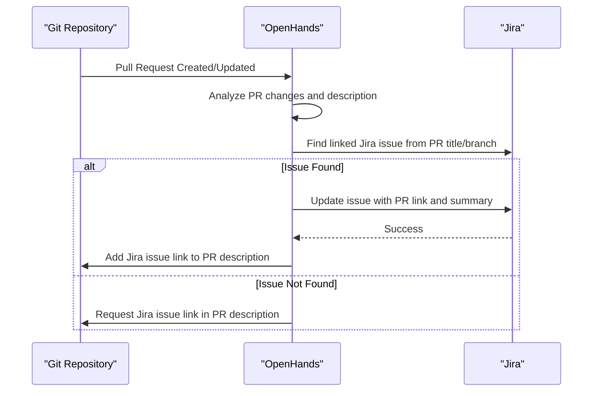

**Diagram sources **
- [jira_callback_processor.py](file://enterprise/server/conversation_callback_processor/jira_callback_processor.py)
- [jira_dc_callback_processor.py](file://enterprise/server/conversation_callback_processor/jira_dc_callback_processor.py)

When a pull request is created or updated, OpenHands analyzes the PR title, description, and branch name to identify any linked Jira issues (typically in the format PROJ-123). If a linked issue is found, the system updates the Jira ticket with a link to the pull request and a summary of the changes. It also adds the Jira issue link to the PR description for bidirectional linking. This ensures that project managers can easily track which code changes relate to specific issues.

### Sprint Planning Integration

The integration supports sprint planning by synchronizing task assignments and progress:

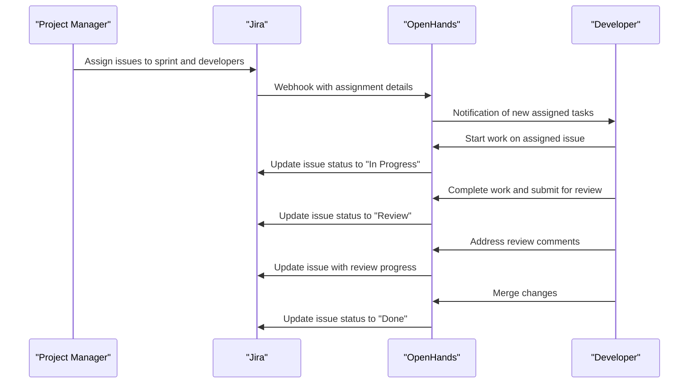

**Diagram sources **
- [jira_manager.py](file://enterprise/integrations/jira/jira_manager.py)
- [jira_callback_processor.py](file://enterprise/server/conversation_callback_processor/jira_callback_processor.py)

During sprint planning, project managers assign issues to team members in Jira. The integration listens for these assignment events and notifies developers of their new tasks. As developers work on the issues, the integration automatically updates the Jira issue status to reflect the current phase (In Progress, Review, Done). This provides real-time visibility into sprint progress without requiring manual status updates.

**Section sources**
- [jira_manager.py](file://enterprise/integrations/jira/jira_manager.py)
- [jira_callback_processor.py](file://enterprise/server/conversation_callback_processor/jira_callback_processor.py)
- [jira_dc_callback_processor.py](file://enterprise/server/conversation_callback_processor/jira_dc_callback_processor.py)

## Conclusion

The Jira Integration in OpenHands provides a robust bridge between development workflows and project management, enabling seamless synchronization between code activities and Jira issues. By supporting both Jira Cloud and Data Center environments, the integration accommodates diverse organizational needs while maintaining a consistent user experience.

The architecture follows a modular design with clear separation between components, making it maintainable and extensible. The bidirectional data synchronization ensures that development progress is automatically reflected in project tracking, reducing manual overhead and improving accuracy.

Key features of the integration include:
- OAuth 2.0 authentication for secure connections to Jira instances
- Bidirectional synchronization of conversation status and issue updates
- Automatic linking of pull requests to Jira issues
- Real-time notifications and progress tracking
- Comprehensive error handling for common failure scenarios

The integration enhances developer productivity by reducing context switching and providing a seamless workflow from issue creation to resolution. Project managers benefit from real-time visibility into development progress, while developers can focus on coding without interrupting their flow to update project management systems.

Future enhancements could include support for additional Jira features such as custom fields, advanced workflow transitions, and integration with Jira's advanced reporting capabilities.