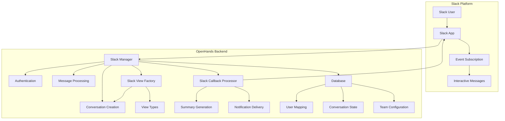
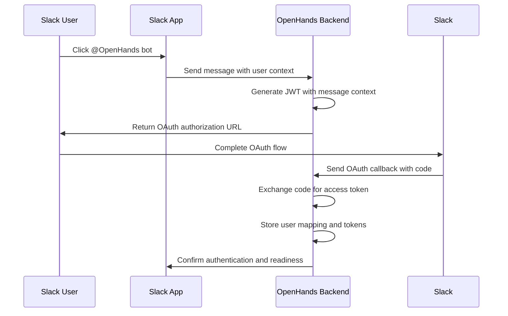
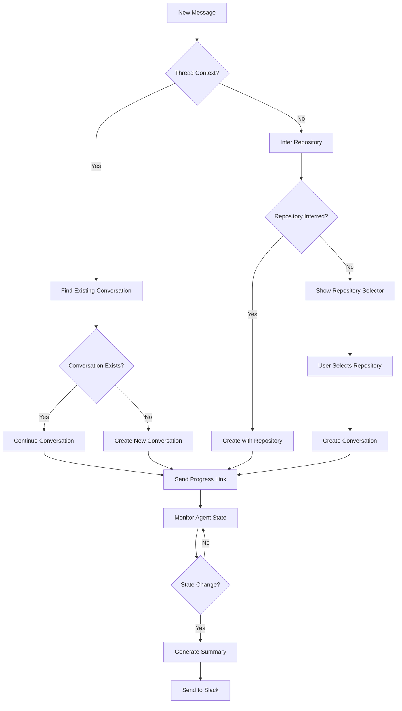
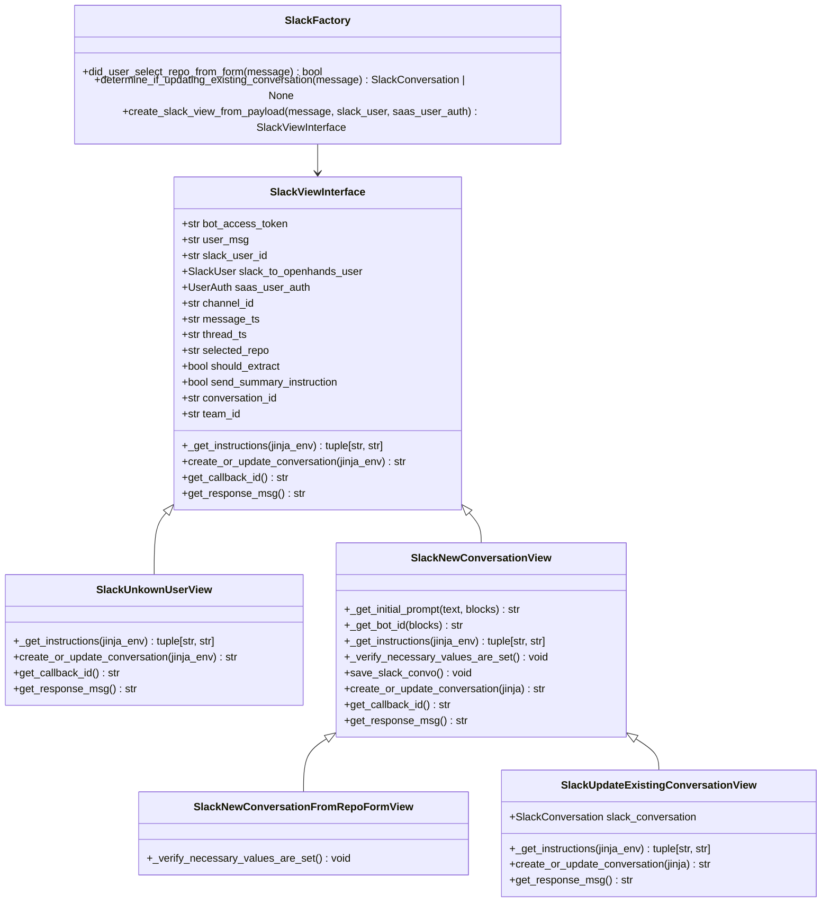

# Slack Integration

<cite>
**Referenced Files in This Document**   
- [slack_manager.py](file://enterprise/integrations/slack/slack_manager.py)
- [slack_view.py](file://enterprise/integrations/slack/slack_view.py)
- [slack_types.py](file://enterprise/integrations/slack/slack_types.py)
- [slack_callback_processor.py](file://enterprise/server/conversation_callback_processor/slack_callback_processor.py)
- [install-slack-app-anchor.tsx](file://frontend/src/components/features/settings/git-settings/install-slack-app-anchor.tsx)
- [039_add_user_token_to_slack_table.py](file://enterprise/migrations/versions/039_add_user_token_to_slack_table.py)
- [043_add_message_ts_column_to_slack_conversation.py](file://enterprise/migrations/versions/043_add_message_ts_column_to_slack_conversation.py)
- [045_create_slack_team_table.py](file://enterprise/migrations/versions/045_create_slack_team_table.py)
- [035_create_slack_users_table.py](file://enterprise/migrations/versions/035_create_slack_users_table.py)
- [041_create_slack_conversation_table.py](file://enterprise/migrations/versions/041_create_slack_conversation_table.py)
</cite>

## Table of Contents
1. [Introduction](#introduction)
2. [Architecture Overview](#architecture-overview)
3. [Core Components](#core-components)
4. [Slack App Configuration](#slack-app-configuration)
5. [Conversation Management](#conversation-management)
6. [Message Handling and Formatting](#message-handling-and-formatting)
7. [Interactive Message Payloads](#interactive-message-payloads)
8. [Common Issues and Solutions](#common-issues-and-solutions)
9. [Conclusion](#conclusion)

## Introduction

The Slack Integration feature enables seamless connection between OpenHands and Slack workspaces, facilitating conversational AI assistance, real-time notification delivery, and collaborative development workflows. This integration allows developers to initiate code reviews, receive pull request notifications, and collaborate on debugging sessions directly within Slack channels. The system leverages Slack's event subscription model and OAuth 2.0 authorization flow to securely authenticate users and manage conversations. By integrating with OpenHands' agent framework, the Slack integration provides a natural interface for AI-powered development assistance, enabling teams to leverage AI capabilities without leaving their primary communication platform.

**Section sources**
- [slack_manager.py](file://enterprise/integrations/slack/slack_manager.py#L1-L364)
- [slack_view.py](file://enterprise/integrations/slack/slack_view.py#L1-L436)

## Architecture Overview

The Slack integration architecture follows a modular design pattern with clear separation of concerns between authentication, message processing, conversation management, and callback handling. The system operates through a series of interconnected components that handle the complete lifecycle of Slack interactions, from initial user authentication to conversation summarization and notification delivery.

**Diagram sources **
- [slack_manager.py](file://enterprise/integrations/slack/slack_manager.py#L42-L364)
- [slack_view.py](file://enterprise/integrations/slack/slack_view.py#L310-L436)
- [slack_callback_processor.py](file://enterprise/server/conversation_callback_processor/slack_callback_processor.py#L28-L182)

**Section sources**
- [slack_manager.py](file://enterprise/integrations/slack/slack_manager.py#L1-L364)
- [slack_view.py](file://enterprise/integrations/slack/slack_view.py#L1-L436)
- [slack_callback_processor.py](file://enterprise/server/conversation_callback_processor/slack_callback_processor.py#L1-L182)

## Core Components

The Slack integration comprises several core components that work together to provide a seamless user experience. The SlackManager class serves as the central coordinator, handling authentication, message routing, and conversation initiation. It interacts with the Slack API through the Slack SDK, managing OAuth flows and token storage. The SlackViewFactory creates appropriate view objects based on the context of incoming messages, determining whether a new conversation should be created or an existing one updated. Different view types handle various scenarios, such as new conversations, follow-up messages in threads, and repository selection workflows.

The SlackCallbackProcessor plays a crucial role in the integration by subscribing to agent state changes and generating conversation summaries. When an agent completes its task or requires user input, the callback processor formats a summary message and sends it back to the original Slack thread, maintaining context and enabling natural conversation flow. The integration also includes comprehensive error handling for common issues like authentication failures, permission errors, and rate limiting, ensuring robust operation in various scenarios.

**Section sources**
- [slack_manager.py](file://enterprise/integrations/slack/slack_manager.py#L42-L364)
- [slack_view.py](file://enterprise/integrations/slack/slack_view.py#L36-L436)
- [slack_callback_processor.py](file://enterprise/server/conversation_callback_processor/slack_callback_processor.py#L28-L182)

## Slack App Configuration

Configuring the Slack app requires several steps to establish proper authentication and permissions. The integration uses OAuth 2.0 with the Slack authorization URL generator to authenticate users. The app must be configured with specific permission scopes including `app_mentions:read`, `channels:history`, `chat:write`, `groups:history`, `im:history`, `mpim:history`, and `users:read` to enable the required functionality. These scopes allow the app to read messages containing @mentions, access channel history for context, send messages, and retrieve user information.

The configuration process begins with the installation of the Slack app through a dedicated installation link that initiates the OAuth flow. During authentication, the system generates a JWT token containing user context information, which is then used to create the authorization URL. Once authenticated, the system stores the user's Slack ID mapped to their OpenHands account, enabling future interactions without re-authentication. The integration also supports multiple Slack workspaces through the SlackTeamStore, which maintains bot access tokens for each connected workspace.

**Diagram sources **
- [slack_manager.py](file://enterprise/integrations/slack/slack_manager.py#L35-L39)
- [install-slack-app-anchor.tsx](file://frontend/src/components/features/settings/git-settings/install-slack-app-anchor.tsx#L16)
- [slack_view.py](file://enterprise/integrations/slack/slack_view.py#L203-L206)

**Section sources**
- [slack_manager.py](file://enterprise/integrations/slack/slack_manager.py#L35-L39)
- [install-slack-app-anchor.tsx](file://frontend/src/components/features/settings/git-settings/install-slack-app-anchor.tsx#L1-L26)

## Conversation Management

The conversation management system in the Slack integration handles the complete lifecycle of AI-assisted development conversations. When a user initiates a conversation by mentioning the OpenHands bot, the system determines whether to create a new conversation or continue an existing one based on the message context. Conversations started in thread replies are automatically linked to the parent message, maintaining organizational context within Slack channels.

The integration supports repository context inference, automatically detecting repository references in user messages (e.g., "All-Hands-AI/OpenHands" or "deploy repo") to pre-select the appropriate codebase. When no repository is explicitly mentioned, the system presents an interactive repository selection form with the user's accessible repositories. This form appears as an ephemeral message to avoid cluttering the channel history.

Conversation state is persisted in the database through the SlackConversation model, which stores the mapping between Slack message threads and OpenHands conversation IDs. This enables the system to resume conversations when users reply to previous messages, maintaining continuity across interactions. The integration also handles conversation summarization through the callback processor, which monitors agent state changes and delivers concise summaries back to the Slack thread when appropriate.

**Diagram sources **
- [slack_manager.py](file://enterprise/integrations/slack/slack_manager.py#L244-L297)
- [slack_view.py](file://enterprise/integrations/slack/slack_view.py#L181-L208)
- [slack_callback_processor.py](file://enterprise/server/conversation_callback_processor/slack_callback_processor.py#L81-L182)

**Section sources**
- [slack_manager.py](file://enterprise/integrations/slack/slack_manager.py#L244-L297)
- [slack_view.py](file://enterprise/integrations/slack/slack_view.py#L181-L208)
- [041_create_slack_conversation_table.py](file://enterprise/migrations/versions/041_create_slack_conversation_table.py#L1-L38)

## Message Handling and Formatting

The message handling system processes incoming Slack messages and formats outgoing responses according to Slack's message API specifications. Incoming messages are parsed to extract the user's intent, mentioned repositories, and any attached files or images. The system handles both direct @mentions and messages in thread replies, with different processing logic for each context.

Outgoing messages are formatted using Slack's block kit API to provide rich, interactive responses. Progress updates include deep links to the OpenHands web interface where users can monitor the agent's activities in real-time. The system also supports ephemeral messages for interactive elements like repository selectors, ensuring that UI components don't clutter the main conversation history.

Code-related content is formatted with appropriate syntax highlighting and structure to enhance readability. When the agent produces code changes or analysis, the system formats these results using Slack's code block formatting with language-specific syntax highlighting. Error messages and debugging information are presented in a structured format that highlights critical information while maintaining context.

The integration also handles message truncation by summarizing lengthy outputs and providing links to view complete results in the OpenHands interface. This ensures that important information is accessible without overwhelming the Slack channel with excessive content.

**Section sources**
- [slack_manager.py](file://enterprise/integrations/slack/slack_manager.py#L220-L243)
- [slack_view.py](file://enterprise/integrations/slack/slack_view.py#L213-L217)
- [slack_callback_processor.py](file://enterprise/server/conversation_callback_processor/slack_callback_processor.py#L43-L72)

## Interactive Message Payloads

Interactive message payloads enable dynamic user interactions within the Slack interface. The integration uses Slack's interactive components to create repository selection forms, action buttons, and other UI elements that enhance the user experience. These interactive elements are implemented using Slack's block kit framework, which supports various component types including static selects, buttons, and input fields.

The repository selection form is a key interactive component that appears when a user initiates a conversation without specifying a repository. This form presents a dropdown menu of the user's accessible repositories, allowing them to select the appropriate codebase for the task. The form is implemented as an ephemeral message to keep the channel history clean while providing the necessary functionality.

Interactive payloads also support follow-up actions, such as continuing a conversation or modifying parameters. When users interact with these components, the system processes the payload to determine the appropriate action and updates the conversation state accordingly. The integration handles callback verification and state management to ensure secure and reliable operation of interactive elements.

**Diagram sources **
- [slack_types.py](file://enterprise/integrations/slack/slack_types.py#L10-L48)
- [slack_view.py](file://enterprise/integrations/slack/slack_view.py#L36-L436)

**Section sources**
- [slack_types.py](file://enterprise/integrations/slack/slack_types.py#L10-L48)
- [slack_view.py](file://enterprise/integrations/slack/slack_view.py#L36-L436)

## Common Issues and Solutions

The Slack integration addresses several common issues that may arise during usage. Message truncation is handled by summarizing lengthy outputs and providing deep links to the complete results in the OpenHands web interface. This ensures that users can access full context without overwhelming the Slack channel with excessive content.

Permission errors are managed through comprehensive authentication checks and user-friendly error messages. When a user lacks necessary permissions or has not completed authentication, the system provides a clear OAuth authorization link to complete the setup process. The integration also handles cases where users attempt to interact with conversations they didn't initiate, providing appropriate error messages and guidance.

Rate limiting is implemented to prevent abuse and ensure fair usage of resources. The system uses Redis-based rate limiting with configurable windows to control the frequency of operations. When rate limits are exceeded, the system returns appropriate HTTP 429 responses with retry-after headers, allowing clients to handle the situation gracefully.

Other common issues include:
- **Authentication failures**: Resolved by guiding users through the OAuth flow with contextual error messages
- **Repository access errors**: Handled by verifying repository permissions before initiating tasks
- **Conversation state conflicts**: Managed through thread-based conversation tracking and state validation
- **Token expiration**: Addressed by implementing token refresh mechanisms and re-authentication flows

**Section sources**
- [slack_manager.py](file://enterprise/integrations/slack/slack_manager.py#L341-L363)
- [rate_limit.py](file://enterprise/server/rate_limit.py#L50-L137)
- [slack_callback_processor.py](file://enterprise/server/conversation_callback_processor/slack_callback_processor.py#L78-L80)

## Conclusion

The Slack Integration feature provides a robust and seamless connection between OpenHands and Slack workspaces, enabling teams to leverage AI-powered development assistance within their primary communication platform. The architecture combines secure authentication, intelligent conversation management, and rich message formatting to create a natural and productive user experience. By supporting repository context inference, interactive components, and comprehensive error handling, the integration lowers the barrier to AI-assisted development while maintaining enterprise-grade security and reliability. The modular design allows for easy customization and extension, making it adaptable to various team workflows and development processes.