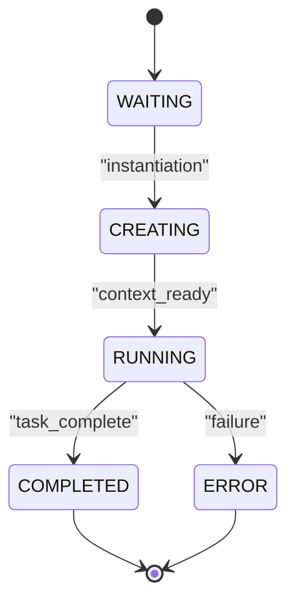
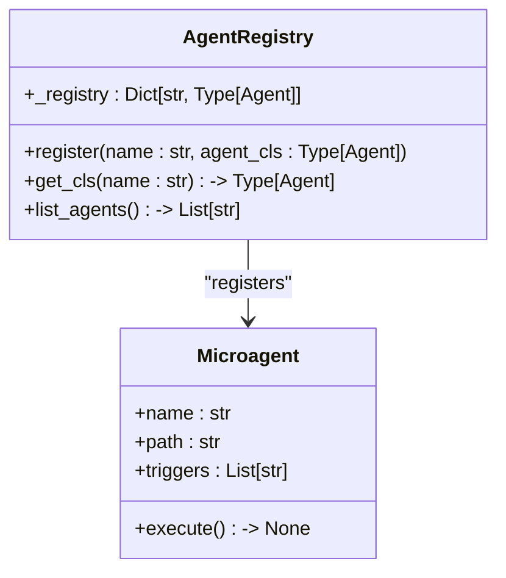
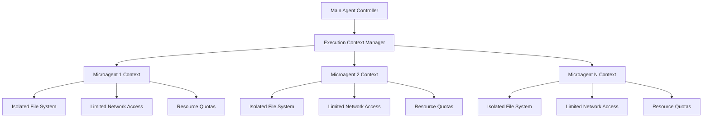
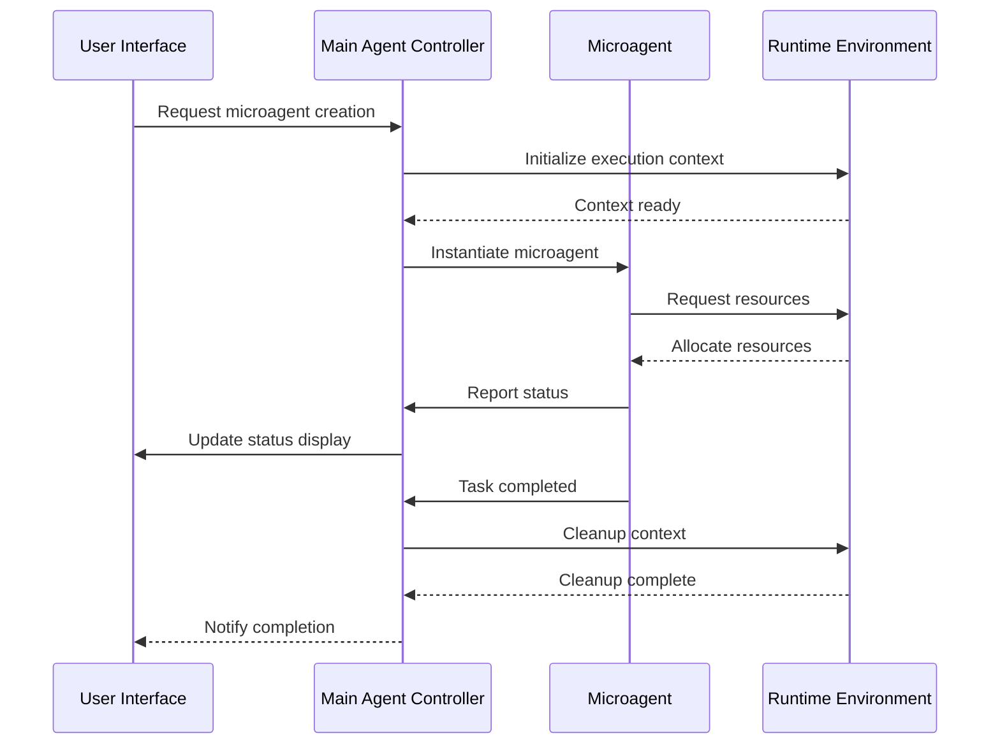
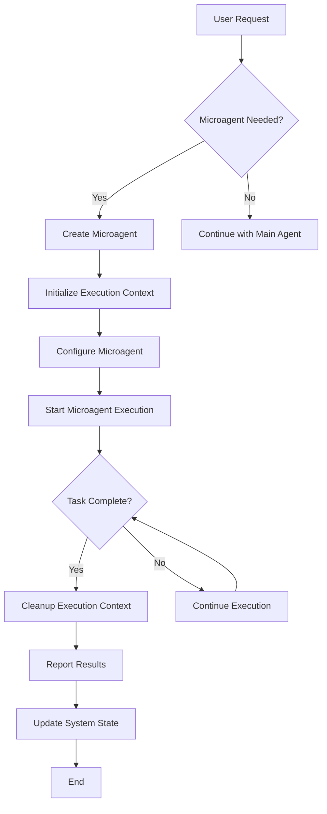
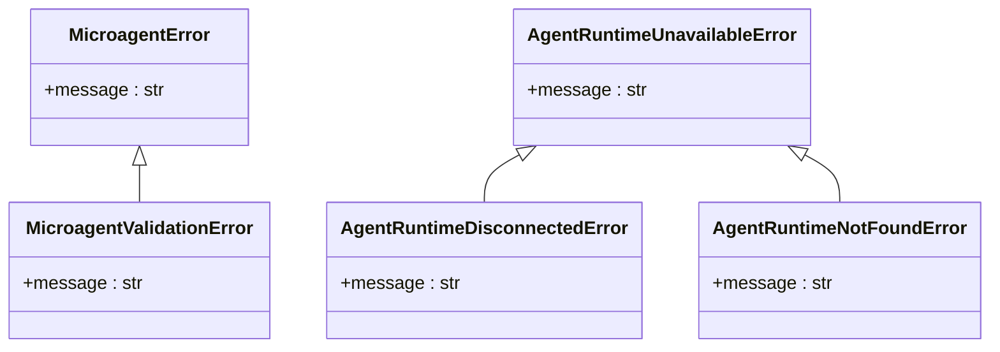

# Microagent Architecture

<cite>
**Referenced Files in This Document**   
- [microagent.py](file://openhands/microagent/microagent.py)
- [types.py](file://openhands/microagent/types.py)
- [exceptions.py](file://openhands/core/exceptions.py)
- [agent.py](file://openhands/controller/agent.py)
- [microagent-management-store.ts](file://frontend/src/state/microagent-management-store.ts)
- [microagent-status.ts](file://frontend/src/types/microagent-status.ts)
- [runtime_status.py](file://openhands/runtime/runtime_status.py)
</cite>

## Table of Contents
1. [Introduction](#introduction)
2. [Core Components](#core-components)
3. [Microagent Lifecycle Management](#microagent-lifecycle-management)
4. [Registration System](#registration-system)
5. [Execution Context Isolation](#execution-context-isolation)
6. [Component Interactions](#component-interactions)
7. [Infrastructure Requirements](#infrastructure-requirements)
8. [Scalability Considerations](#scalability-considerations)
9. [Deployment Topology](#deployment-topology)
10. [System Context Diagram](#system-context-diagram)
11. [Cross-Cutting Concerns](#cross-cutting-concerns)
12. [Technology Stack](#technology-stack)

## Introduction
The Microagent Architecture component in OpenHands provides a framework for creating specialized AI agents that can perform targeted tasks within a software development environment. These microagents operate as autonomous entities with specific capabilities, designed to handle discrete tasks such as code reviews, pull request management, and repository analysis. The architecture enables the creation of lightweight, focused agents that can be dynamically instantiated and managed within the broader agent ecosystem.

The microagent system is designed to provide execution context isolation, lifecycle management, and seamless integration with the main agent controller and runtime environment. This documentation details the architectural design, core components, and operational patterns that enable microagents to function effectively within the OpenHands platform.

## Core Components

The Microagent Architecture consists of several key components that work together to provide a robust framework for microagent execution. The core components include the Microagent class, the registration system, execution context management, and the lifecycle controller.

The architecture follows a modular design pattern where each microagent operates in an isolated execution context while maintaining communication channels with the main agent controller. This design enables concurrent operation of multiple microagents without interference, while allowing for coordinated task execution when needed.

**Section sources**
- [microagent.py](file://openhands/microagent/microagent.py)
- [types.py](file://openhands/microagent/types.py)
- [agent.py](file://openhands/controller/agent.py)

## Microagent Lifecycle Management

The microagent lifecycle consists of several distinct states that govern the agent's operation from initialization to cleanup. The lifecycle states include WAITING, CREATING, RUNNING, COMPLETED, and ERROR, which are tracked and managed by the lifecycle controller.

When a microagent is instantiated, it begins in the WAITING state until its execution context is prepared. The CREATING state indicates that the microagent's environment is being set up, including the initialization of the runtime and configuration of necessary resources. Once the execution context is ready, the microagent transitions to the RUNNING state where it performs its designated tasks.

The lifecycle management system ensures proper cleanup of resources when a microagent completes its task or encounters an error. This includes terminating the execution context, releasing allocated resources, and updating the system state to reflect the microagent's completion status.

**Diagram sources**
- [microagent.py](file://openhands/microagent/microagent.py)
- [microagent-status.ts](file://frontend/src/types/microagent-status.ts)

**Section sources**
- [microagent.py](file://openhands/microagent/microagent.py)
- [runtime_status.py](file://openhands/runtime/runtime_status.py)

## Registration System

The microagent registration system provides a centralized mechanism for managing available microagent types and their configurations. The system follows a registry pattern where microagent classes are registered with unique names, allowing for dynamic instantiation based on task requirements.

The registration process involves registering microagent classes with the agent registry, which maintains a mapping of names to class implementations. This enables the system to instantiate specific microagents based on their registered names, providing flexibility in microagent selection and deployment.

The registration system also handles version compatibility by maintaining metadata about each registered microagent, including supported features and required dependencies. This ensures that only compatible microagents are instantiated in a given environment.

**Diagram sources**
- [agent.py](file://openhands/controller/agent.py)
- [types.py](file://openhands/microagent/types.py)

**Section sources**
- [agent.py](file://openhands/controller/agent.py)
- [types.py](file://openhands/microagent/types.py)

## Execution Context Isolation

The execution context isolation mechanism ensures that each microagent operates in a secure and contained environment, preventing interference between concurrent microagents. The isolation is achieved through containerization and resource allocation policies that separate the execution contexts of different microagents.

Each microagent is assigned a dedicated runtime environment with controlled access to system resources, file systems, and network connectivity. This isolation prevents microagents from accessing or modifying data outside their designated scope, enhancing security and reliability.

The context isolation system also manages resource allocation, ensuring that microagents have access to the necessary computational resources while preventing resource exhaustion. This includes memory limits, CPU quotas, and storage constraints that are enforced by the runtime environment.

**Diagram sources**
- [microagent.py](file://openhands/microagent/microagent.py)
- [runtime_status.py](file://openhands/runtime/runtime_status.py)

**Section sources**
- [microagent.py](file://openhands/microagent/microagent.py)
- [runtime_status.py](file://openhands/runtime/runtime_status.py)

## Component Interactions

The microagent system interacts with several key components within the OpenHands architecture, including the main agent controller, runtime environment, and user interface. These interactions enable coordinated operation and information flow between the microagent and the broader system.

The main agent controller manages the lifecycle of microagents, handling their instantiation, monitoring, and cleanup. It communicates with microagents through a well-defined interface, sending commands and receiving status updates. The runtime environment provides the execution context for microagents, managing resources and enforcing isolation policies.

The user interface components interact with the microagent system to provide status updates and control mechanisms. This includes displaying microagent status indicators, managing microagent configurations, and presenting results from microagent operations.

**Diagram sources**
- [microagent.py](file://openhands/microagent/microagent.py)
- [agent.py](file://openhands/controller/agent.py)
- [runtime_status.py](file://openhands/runtime/runtime_status.py)
- [microagent-management-store.ts](file://frontend/src/state/microagent-management-store.ts)

**Section sources**
- [microagent.py](file://openhands/microagent/microagent.py)
- [agent.py](file://openhands/controller/agent.py)
- [runtime_status.py](file://openhands/runtime/runtime_status.py)
- [microagent-management-store.ts](file://frontend/src/state/microagent-management-store.ts)

## Infrastructure Requirements

The microagent architecture has specific infrastructure requirements to support its operation. These requirements include containerization support, resource allocation capabilities, and network connectivity for external service integration.

The system requires a container runtime environment to provide execution context isolation for microagents. This typically involves Docker or a similar containerization technology that can create isolated execution environments with controlled resource allocation.

Resource requirements include sufficient memory and CPU capacity to support concurrent microagent operations, as well as storage for microagent state and artifacts. The infrastructure must also support network connectivity for microagents that need to interact with external services such as version control systems or issue trackers.

Security requirements include isolation mechanisms to prevent microagents from accessing unauthorized resources, as well as monitoring and logging capabilities to track microagent activities.

**Section sources**
- [microagent.py](file://openhands/microagent/microagent.py)
- [runtime_status.py](file://openhands/runtime/runtime_status.py)

## Scalability Considerations

The microagent architecture is designed with scalability in mind, supporting concurrent operation of multiple microagents to handle increased workload. The scalability is achieved through several mechanisms, including efficient resource management, load balancing, and dynamic scaling.

Resource management policies ensure that microagents are allocated resources based on their requirements and priority, preventing resource exhaustion under heavy load. The system can dynamically adjust resource allocation based on current demand and available capacity.

Load balancing distributes microagent creation requests across available resources to prevent bottlenecks. The architecture supports horizontal scaling by allowing additional runtime environments to be added to the system as needed.

Performance monitoring and metrics collection enable the system to identify scaling requirements and adjust resources accordingly. This includes tracking microagent execution times, resource utilization, and success rates to optimize the scaling strategy.

**Section sources**
- [microagent.py](file://openhands/microagent/microagent.py)
- [runtime_status.py](file://openhands/runtime/runtime_status.py)

## Deployment Topology

The microagent system is deployed as part of the overall OpenHands architecture, integrating with the main agent controller and runtime environment. The deployment topology consists of several interconnected components that work together to provide microagent functionality.

The main deployment components include the microagent framework, runtime environments, and management interfaces. These components are typically deployed in a distributed architecture where runtime environments may be located on separate hosts or in cloud environments.

The deployment supports both centralized and distributed configurations, allowing microagents to be executed on the same host as the main controller or on remote execution nodes. This flexibility enables optimization of resource utilization and performance based on specific deployment requirements.

**Section sources**
- [microagent.py](file://openhands/microagent/microagent.py)
- [runtime_status.py](file://openhands/runtime/runtime_status.py)

## System Context Diagram

The system context diagram illustrates the workflow of a microagent from initialization to cleanup, showing the interactions between the microagent and other system components.

**Diagram sources**
- [microagent.py](file://openhands/microagent/microagent.py)
- [agent.py](file://openhands/controller/agent.py)
- [runtime_status.py](file://openhands/runtime/runtime_status.py)

## Cross-Cutting Concerns

The microagent architecture addresses several cross-cutting concerns that affect multiple aspects of the system. These concerns include error handling, resource management, and version compatibility.

Error handling is implemented through a comprehensive exception hierarchy that provides specific error types for different failure scenarios. The system includes retry mechanisms and fallback strategies to handle transient failures and ensure reliable operation.

Resource management ensures efficient utilization of system resources while preventing exhaustion. This includes memory management, connection pooling, and cleanup of temporary artifacts. The system implements resource quotas and monitoring to maintain stability under varying workloads.

Version compatibility is addressed through a metadata system that tracks microagent requirements and capabilities. This enables the system to select appropriate microagents based on the current environment and ensure compatibility between components.

**Diagram sources**
- [exceptions.py](file://openhands/core/exceptions.py)

**Section sources**
- [exceptions.py](file://openhands/core/exceptions.py)

## Technology Stack

The microagent architecture is built on a technology stack that includes Python for implementation, containerization for execution isolation, and asynchronous programming for efficient resource utilization.

The core framework is implemented in Python, leveraging its extensive ecosystem of libraries and tools for AI and software development tasks. The system uses asyncio for asynchronous operations, enabling efficient handling of concurrent microagents and I/O operations.

Containerization is provided by Docker or similar technologies, creating isolated execution environments for microagents. This ensures security and reliability by preventing interference between microagents and the host system.

The architecture integrates with various external services through APIs, including version control systems, issue trackers, and collaboration platforms. This enables microagents to perform tasks that require interaction with external systems.

Configuration and dependency management are handled through standard Python packaging tools and configuration files, ensuring consistent deployment and operation across different environments.

**Section sources**
- [microagent.py](file://openhands/microagent/microagent.py)
- [agent.py](file://openhands/controller/agent.py)
- [runtime_status.py](file://openhands/runtime/runtime_status.py)