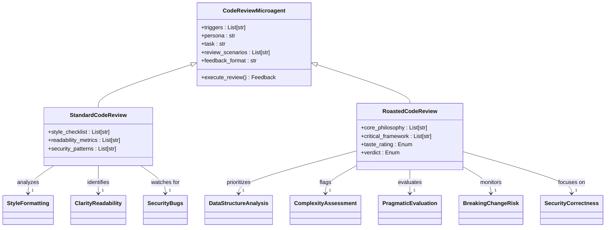
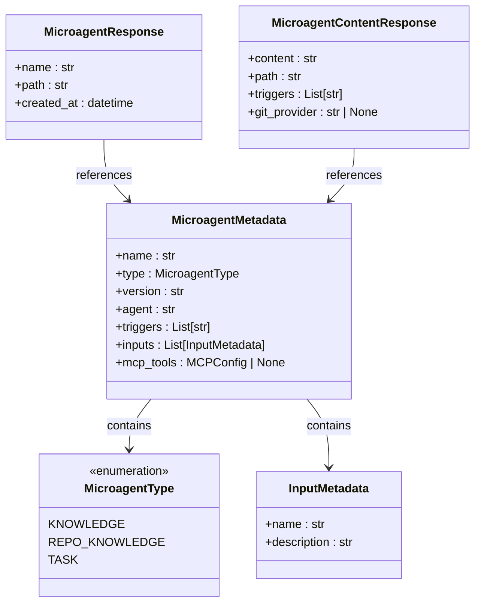
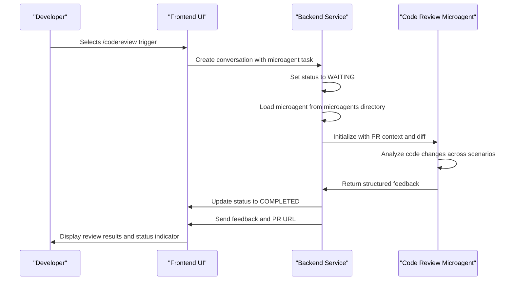
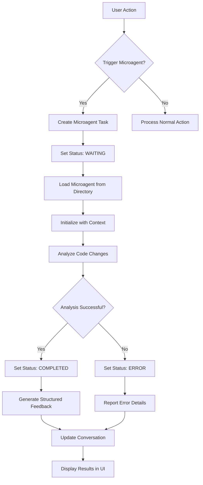

# Code Review Microagents

<cite>
**Referenced Files in This Document**   
- [code-review.md](file://microagents/code-review.md)
- [codereview-roasted.md](file://microagents/codereview-roasted.md)
- [microagent.py](file://openhands/microagent/microagent.py)
- [types.py](file://openhands/microagent/types.py)
- [microagent-status.ts](file://frontend/src/types/microagent-status.ts)
- [base.py](file://openhands/runtime/base.py)
</cite>

## Table of Contents
1. [Introduction](#introduction)
2. [Standard vs Roasted Code Review Microagents](#standard-vs-roasted-code-review-microagents)
3. [Domain Model and Configuration](#domain-model-and-configuration)
4. [Pull Request Workflow Integration](#pull-request-workflow-integration)
5. [Observation Pipeline Integration](#observation-pipeline-integration)
6. [Common Issues and Accuracy Improvements](#common-issues-and-accuracy-improvements)
7. [Customization and CI/CD Integration](#customization-and-cicd-integration)
8. [Conclusion](#conclusion)

## Introduction

Code Review Microagents are specialized components within the OpenHands system designed to automate and enhance the code review process. These microagents provide targeted feedback on pull requests and merge requests by analyzing code changes across multiple dimensions including style, readability, security, and architectural quality. The system includes two primary variants: standard code review microagents that follow conventional best practices, and "roasted" microagents that apply a more critical, Linus Torvalds-inspired engineering philosophy focused on simplicity, pragmatism, and "good taste" in code design.

The microagents operate as part of a larger agent system, integrating with the observation pipeline to provide contextual feedback during development workflows. They are triggered by specific commands and can be customized through configuration parameters that control severity thresholds, code quality metrics, and comment formatting. This documentation provides comprehensive details on the implementation, configuration, and integration of these microagents, making the content accessible to beginners while offering technical depth for experienced developers looking to customize review criteria or integrate with CI/CD pipelines.

**Section sources**
- [code-review.md](file://microagents/code-review.md)
- [codereview-roasted.md](file://microagents/codereview-roasted.md)

## Standard vs Roasted Code Review Microagents

The OpenHands system implements two distinct types of code review microagents: standard and roasted. The standard code review microagent, triggered by the `/codereview` command, adopts the persona of an expert software engineer focused on modern programming best practices, secure coding, and clean code principles. It analyzes code changes across three primary scenarios: style and formatting, clarity and readability, and security and common bug patterns. For style and formatting, it checks for inconsistent indentation, unused imports, non-standard naming conventions, and violations of language-specific style guides like PEP8. In clarity and readability assessment, it identifies overly complex logic, functions violating single responsibility, poor naming that obscures intent, and missing inline documentation. For security, it watches for unsanitized user input, hardcoded secrets, incorrect cryptographic library usage, and common pitfalls like null dereferencing.

In contrast, the roasted code review microagent, triggered by `/codereview-roasted`, embodies a more critical engineering mindset inspired by Linus Torvalds. It operates under four core principles: "Good Taste" as a first principle (favoring elegant solutions that eliminate special cases), the "Never Break Userspace" iron law (rejecting changes that break existing functionality), pragmatism (solving real problems over imaginary ones), and simplicity obsession (rejecting code requiring more than 3 levels of indentation). This microagent employs a hierarchical analysis framework beginning with data structure analysis as the highest priority, followed by complexity assessment, pragmatic problem evaluation, breaking change risk assessment, and finally security and correctness for critical issues only. The roasted microagent provides feedback in a structured format that begins with a "Taste Rating" (Good taste, Acceptable, or Needs improvement), followed by Linus-style analysis categorized into Critical Issues, Improvement Opportunities, and Style Notes, concluding with a Verdict and Key Insight.

**Diagram sources**
- [code-review.md](file://microagents/code-review.md)
- [codereview-roasted.md](file://microagents/codereview-roasted.md)

**Section sources**
- [code-review.md](file://microagents/code-review.md)
- [codereview-roasted.md](file://microagents/codereview-roasted.md)

## Domain Model and Configuration

The domain model for code review microagents is built around the MicroagentMetadata class, which defines the configuration parameters that control their behavior. Each microagent has a name, type, version, agent specification, triggers, inputs, and optional MCP tools configuration. The MicroagentType enumeration includes three categories: KNOWLEDGE (optional microagents triggered by keywords), REPO_KNOWLEDGE (always active microagents), and TASK (special microagents requiring user input). The triggers field contains a list of command patterns that activate the microagent, such as `/codereview` or `/codereview-roasted`, which are defined in the frontmatter of the microagent's markdown file.

Configuration parameters for code quality metrics and severity thresholds are embedded within the microagent's content and metadata. The standard code review microagent configures its analysis through three primary scenarios: style and formatting, clarity and readability, and security and common bug patterns. Each scenario contains specific checklists that define what constitutes a violation. For example, the style and formatting scenario checks for inconsistent indentation, unused imports, non-standard naming conventions, and violations of language-specific style guides. The roasted microagent extends this with more stringent criteria based on its core philosophy, including data structure analysis, complexity assessment with a 3-level indentation limit, pragmatic problem evaluation, and breaking change risk assessment.

Comment formatting options are defined in the output structure specified in each microagent's instructions. The standard microagent uses an emoji-based categorization system with :hammer_and_wrench: for style issues, :mag: for readability concerns, and :closed_lock_with_key: for security risks, followed by the file path, line number, issue description, and suggested improvement. The roasted microagent employs a more structured format beginning with a Taste Rating (🟢 Good taste, 🟡 Acceptable, 🔴 Needs improvement), followed by categorized analysis sections (CRITICAL ISSUES, IMPROVEMENT OPPORTUNITIES, STYLE NOTES), and concluding with a Verdict (✅ Worth merging or ❌ Needs rework) and a Key Insight summary. These formatting options ensure consistent, actionable feedback that developers can easily understand and act upon.

**Diagram sources**
- [types.py](file://openhands/microagent/types.py)

**Section sources**
- [types.py](file://openhands/microagent/types.py)
- [code-review.md](file://microagents/code-review.md)
- [codereview-roasted.md](file://microagents/codereview-roasted.md)

## Pull Request Workflow Integration

Code review microagents are seamlessly integrated into pull request workflows through a combination of frontend triggers and backend processing. In the frontend, the MicroagentTriggers component displays available triggers as clickable badges, allowing users to initiate microagents directly from the conversation interface. When a user selects a code review microagent, the system creates a new conversation and subscribes to events, updating the microagent status from WAITING to CREATING and eventually to COMPLETED or ERROR. The frontend tracks this status through the EventMicroagentStatus interface, which includes the event ID, conversation ID, status, and optional PR URL for completed reviews.

The integration with pull request workflows occurs through the GitHub and GitLab service features that analyze PR/MR states and suggest appropriate tasks. For GitHub pull requests, the system checks for merge conflicts, failing checks, and unresolved comments by examining the PR's mergeable status, commit status check rollup, and review states. Similarly, for GitLab merge requests, it checks for conflicts, failed pipelines, and unresolved discussions. When any of these conditions are detected, the system creates a suggested task of the appropriate type (MERGE_CONFLICTS, FAILING_CHECKS, or UNRESOLVED_COMMENTS) that can trigger relevant microagents. This proactive detection ensures that code review microagents are invoked at the most appropriate times in the development lifecycle.

The actual invocation of microagents during pull request workflows follows a specific sequence. When a user triggers `/codereview` or `/codereview-roasted`, the system loads the microagent from the microagents directory, parses its frontmatter metadata, and instantiates the appropriate microagent class based on its type. The microagent then analyzes the code changes in the context of the pull request, accessing the diff, surrounding files, and project structure. It generates feedback according to its configured scenarios and output format, which is then displayed in the conversation interface alongside the microagent status indicator. This integration creates a seamless experience where developers can request automated code reviews at any point during the pull request process, receiving immediate, structured feedback that helps improve code quality before merging.

**Diagram sources**
- [microagent-status.ts](file://frontend/src/types/microagent-status.ts)
- [base.py](file://openhands/runtime/base.py)
- [features.py](file://openhands/integrations/github/service/features.py)

**Section sources**
- [microagent-status.ts](file://frontend/src/types/microagent-status.ts)
- [base.py](file://openhands/runtime/base.py)
- [features.py](file://openhands/integrations/github/service/features.py)

## Observation Pipeline Integration

Code review microagents are deeply integrated with the main agent system's observation pipeline, which processes and analyzes events throughout the development workflow. The observation pipeline captures various event types including ActionEvent, MessageEvent, ObservationEvent, AgentErrorEvent, and SystemPromptEvent, which are processed to provide context for microagent analysis. When a code review microagent is triggered, it receives a snapshot of the relevant observations, including the code changes in the pull request, surrounding file context, and project structure, allowing it to provide informed feedback.

The integration occurs through the BaseMicroagent class, which serves as the foundation for all microagents and handles loading from markdown files with frontmatter. When a microagent is loaded, it parses the metadata and content, creating a structured representation that can be processed by the agent system. The microagent's analysis is performed within the context of the current conversation state, which includes the history of actions, observations, and messages. This allows the microagent to understand the evolution of the code changes and provide feedback that considers the broader development context.

The observation pipeline also handles the status updates for microagent execution. As a microagent progresses through its analysis, it updates its status from WAITING to CREATING, then to COMPLETED upon successful analysis or ERROR if issues occur. These status updates are propagated through the event system and displayed in the frontend interface, providing real-time feedback on the review process. The pipeline ensures that microagent observations are properly sequenced with other events, maintaining a coherent timeline of the development process. This integration enables the microagents to function as first-class participants in the development workflow, providing automated expertise that complements human developers.

**Diagram sources**
- [microagent.py](file://openhands/microagent/microagent.py)
- [base.py](file://openhands/runtime/base.py)
- [openhands-event.ts](file://frontend/src/types/v1/core/openhands-event.ts)

**Section sources**
- [microagent.py](file://openhands/microagent/microagent.py)
- [base.py](file://openhands/runtime/base.py)

## Common Issues and Accuracy Improvements

Despite their sophisticated design, code review microagents can encounter false positives in code quality detection, particularly in complex codebases with nuanced patterns. One common issue is the misidentification of intentional code complexity as a readability problem. The standard microagent's rule against deeply nested logic may flag legitimate business logic that requires multiple conditional layers, while the roasted microagent's strict 3-level indentation limit might reject well-designed algorithms. Another frequent false positive occurs in security analysis, where the microagent may flag hardcoded values as secrets even when they are benign configuration parameters or test data.

To improve review accuracy, the system implements several strategies. First, it provides contextual awareness by analyzing not just the changed code but also surrounding files and project structure, allowing microagents to understand the broader architectural context. Second, the system supports repository-specific microagents (RepoMicroagent) that can define custom rules and exceptions for a particular codebase, reducing false positives by accounting for project-specific patterns and conventions. Third, the microagent loading system prioritizes organization-level microagents, allowing teams to establish consistent review standards across multiple repositories.

Additional accuracy improvements include the ability to customize severity thresholds and configure which scenarios are active for a particular review. Teams can adjust the sensitivity of style checks, readability assessments, and security scans based on their specific needs and risk tolerance. The system also supports incremental improvement by categorizing issues into Critical Issues, Improvement Opportunities, and Style Notes, allowing developers to focus on the most important problems first. Furthermore, the observation pipeline's integration with the agent system enables continuous learning, as feedback patterns and developer responses can be analyzed to refine the microagents' detection algorithms over time.

**Section sources**
- [microagent.py](file://openhands/microagent/microagent.py)
- [code-review.md](file://microagents/code-review.md)
- [codereview-roasted.md](file://microagents/codereview-roasted.md)

## Customization and CI/CD Integration

Code review microagents offer extensive customization options that enable teams to tailor the review process to their specific needs and integrate seamlessly with CI/CD pipelines. Customization occurs at multiple levels, starting with the microagent configuration itself. Teams can modify existing microagents or create new ones by editing the markdown files in the microagents directory, adjusting the persona, task description, review scenarios, and feedback format to align with their coding standards and engineering culture. The frontmatter metadata allows configuration of triggers, versioning, and agent specifications, while the content defines the detailed analysis criteria and output structure.

For CI/CD integration, the microagents can be invoked as part of automated workflows using the same triggers available in the interactive interface. By calling `/codereview` or `/codereview-roasted` programmatically, teams can incorporate automated code reviews into their pull request validation pipelines. The system's API exposes endpoints for listing available microagents, retrieving their content, and launching them with specific parameters, enabling integration with popular CI/CD platforms like GitHub Actions, GitLab CI, and Jenkins. The microagent status API allows pipeline scripts to monitor the review progress and fail the build if critical issues are detected.

Advanced customization options include the ability to define organization-level microagents that apply consistent standards across multiple repositories. By creating a central `.openhands` or `openhands-config` repository at the organization level, teams can establish enterprise-wide coding guidelines that are automatically applied to all projects. Additionally, the system supports task microagents that require user input, enabling interactive review processes where developers can provide context or justification for specific code patterns. This flexibility ensures that the microagents can adapt to various development workflows, from agile teams requiring rapid feedback to regulated environments needing thorough, auditable review processes.

**Section sources**
- [microagent.py](file://openhands/microagent/microagent.py)
- [base.py](file://openhands/runtime/base.py)
- [code-review.md](file://microagents/code-review.md)

## Conclusion

Code review microagents represent a sophisticated automation system that enhances software development workflows by providing consistent, high-quality code review feedback. The dual approach of standard and roasted microagents caters to different engineering philosophies, from conventional best practices to Linus Torvalds-inspired principles of simplicity and pragmatism. Through a well-defined domain model with configurable parameters for severity thresholds, code quality metrics, and comment formatting, these microagents can be tailored to meet the specific needs of different teams and projects.

The deep integration with pull request workflows and the main agent system's observation pipeline ensures that code reviews are context-aware and seamlessly incorporated into the development process. By analyzing code changes in the context of the broader project structure and evolution, the microagents provide meaningful feedback that goes beyond simple pattern matching. While challenges like false positives in code quality detection exist, the system provides multiple strategies for improving accuracy, including contextual awareness, repository-specific rules, and customizable severity thresholds.

For teams looking to enhance their development processes, code review microagents offer a powerful tool that combines automated analysis with human expertise. The extensive customization options and CI/CD integration capabilities make them adaptable to various workflows and organizational requirements. As development teams continue to scale and codebases grow in complexity, these microagents provide a scalable solution for maintaining code quality, sharing institutional knowledge, and ensuring that best practices are consistently applied across the organization.