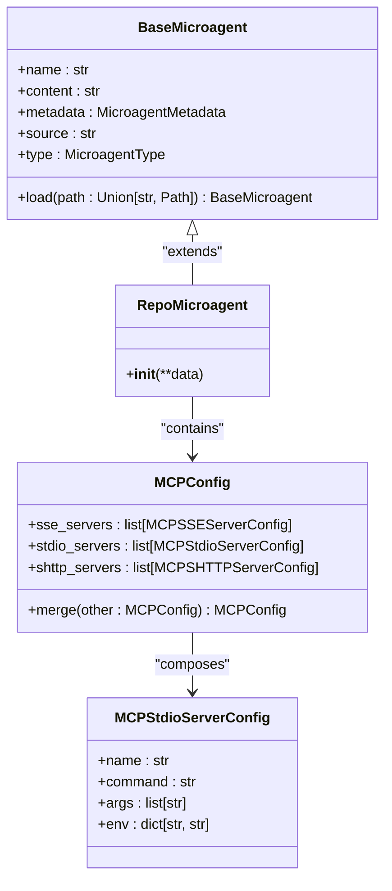
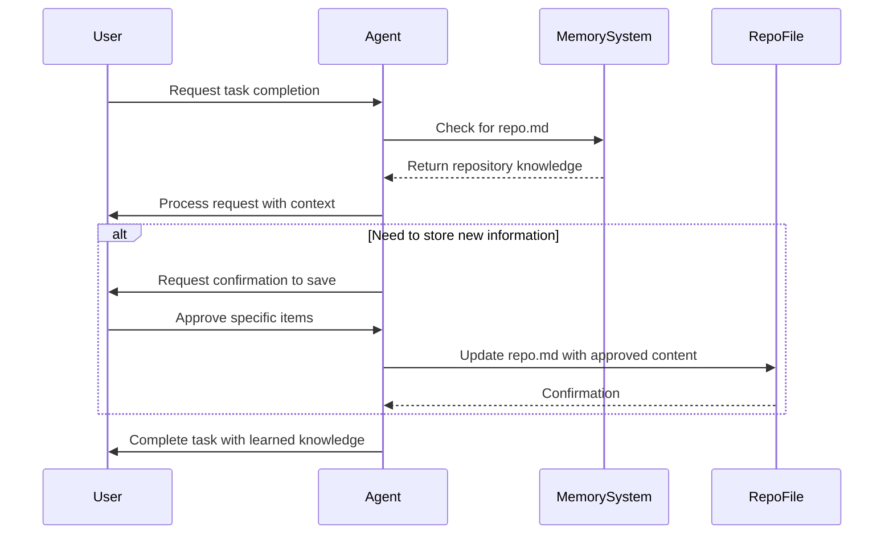
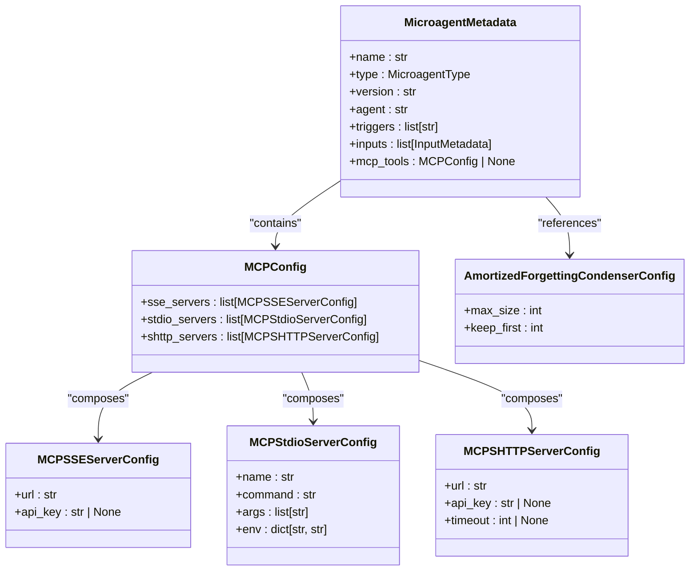
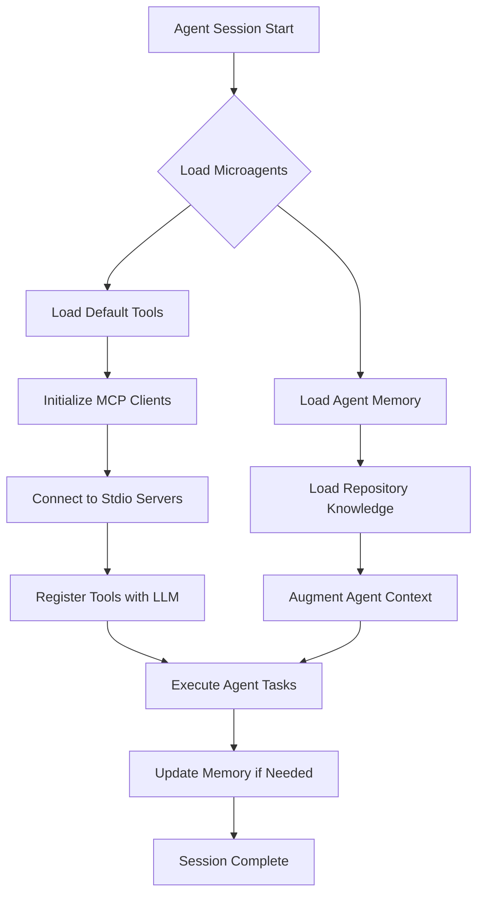
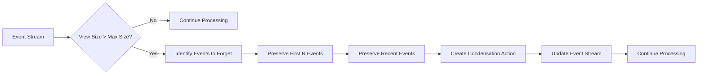
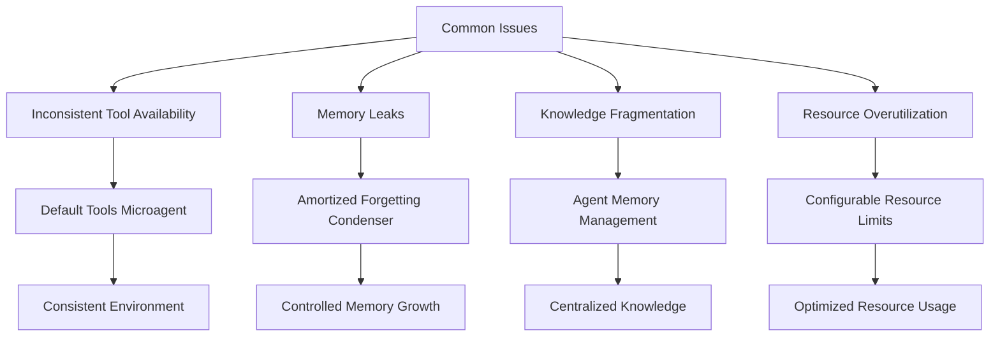
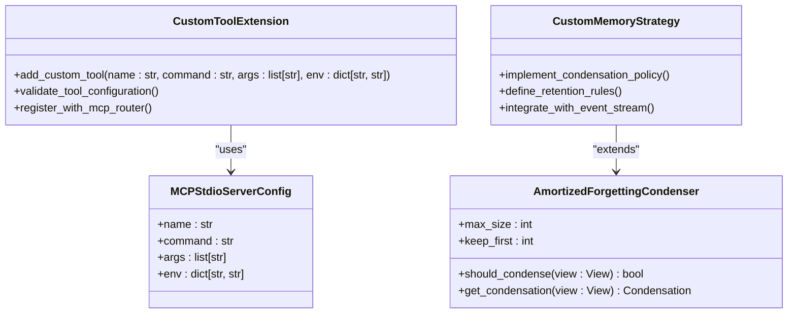

# Infrastructure Microagents

<cite>
**Referenced Files in This Document**   
- [default-tools.md](file://microagents/default-tools.md)
- [agent_memory.md](file://microagents/agent_memory.md)
- [types.py](file://openhands/microagent/types.py)
- [microagent.py](file://openhands/microagent/microagent.py)
- [mcp_config.py](file://openhands/core/config/mcp_config.py)
- [client.py](file://openhands/mcp/client.py)
- [amortized_forgetting_condenser.py](file://openhands/memory/condenser/impl/amortized_forgetting_condenser.py)
- [view.py](file://openhands/memory/view.py)
- [072_add_condenser_max_size_to_user_settings.py](file://enterprise/migrations/versions/072_add_condenser_max_size_to_user_settings.py)
- [036_add_mcp_config_to_user_settings.py](file://enterprise/migrations/versions/036_add_mcp_config_to_user_settings.py)
</cite>

## Table of Contents
1. [Introduction](#introduction)
2. [Default Tools Microagent](#default-tools-microagent)
3. [Agent Memory Management](#agent-memory-management)
4. [Domain Model and Configuration](#domain-model-and-configuration)
5. [Relationship with Core Agent System](#relationship-with-core-agent-system)
6. [Memory Management Strategies](#memory-management-strategies)
7. [Common Issues and Solutions](#common-issues-and-solutions)
8. [Extending Infrastructure Microagents](#extending-infrastructure-microagents)

## Introduction

Infrastructure microagents in OpenHands provide foundational capabilities that enable consistent behavior across different agent sessions and environments. These specialized components serve as the backbone of the agent system, offering essential services such as tool availability and memory management. Unlike domain-specific microagents that focus on particular knowledge areas, infrastructure microagents establish the core functionality upon which other microagents depend.

The two primary infrastructure microagents are the default tools microagent and the agent memory management microagent. The default tools microagent ensures that essential MCP (Message Control Protocol) tools are consistently available across all agent sessions, while the agent memory management microagent handles the retention, organization, and optimization of knowledge across interactions. Together, these components create a stable foundation that allows other microagents to operate reliably and predictably.

This documentation provides a comprehensive analysis of these infrastructure microagents, detailing their implementation, configuration options, and integration with the broader agent system. By understanding these foundational components, developers can effectively extend and optimize the agent's capabilities for various use cases.

## Default Tools Microagent

The default tools microagent is a specialized infrastructure component that ensures consistent availability of essential MCP tools across all agent sessions. Implemented as a repository microagent with the name "default-tools", this component automatically loads critical tooling that forms the foundation of the agent's capabilities.

The implementation is defined in the `default-tools.md` file, which specifies the microagent's configuration through YAML frontmatter. The microagent is configured with type "repo" indicating it's always activated, and includes MCP tool definitions for stdio servers. Specifically, it configures the "fetch" tool using the "uvx" command with the "mcp-server-fetch" argument, enabling the agent to retrieve external resources when needed.

**Diagram sources**
- [default-tools.md](file://microagents/default-tools.md)
- [types.py](file://openhands/microagent/types.py)
- [microagent.py](file://openhands/microagent/microagent.py)
- [mcp_config.py](file://openhands/core/config/mcp_config.py)

The default tools microagent plays a crucial role in maintaining consistency across agent sessions by ensuring that fundamental tools are always available. This eliminates the need for individual agents to configure basic tooling, creating a standardized environment where all agents have access to the same foundational capabilities. The microagent's implementation automatically adds tool descriptions for LLMs during tool calls, eliminating the need for redundant documentation within the microagent body.

**Section sources**
- [default-tools.md](file://microagents/default-tools.md)
- [types.py](file://openhands/microagent/types.py)
- [microagent.py](file://openhands/microagent/microagent.py)

## Agent Memory Management

The agent memory management microagent provides a systematic approach to storing and retrieving knowledge across agent sessions. Implemented in the `agent_memory.md` file, this infrastructure component enables agents to maintain repository-specific knowledge and best practices, ensuring consistency across interactions with the same codebase.

The memory management system operates through the `.openhands/microagents/repo.md` file located in each repository root. When this file exists, its contents are automatically added to the agent's context, providing immediate access to repository-specific guidelines and practices. The microagent establishes clear protocols for what information should be stored, focusing on general knowledge that benefits future tasks such as repository structure, common commands, code style preferences, and workflows.

**Diagram sources**
- [agent_memory.md](file://microagents/agent_memory.md)
- [microagent.py](file://openhands/microagent/microagent.py)
- [view.py](file://openhands/memory/view.py)

The memory management microagent enforces strict guidelines to maintain quality and relevance. It instructs agents to only log information helpful for future tasks, avoiding issue-specific details that lack broader applicability. When adding new information, the agent must first obtain user confirmation by listing the exact items to be saved, ensuring transparency and control over the knowledge base.

**Section sources**
- [agent_memory.md](file://microagents/agent_memory.md)
- [microagent.py](file://openhands/microagent/microagent.py)

## Domain Model and Configuration

The infrastructure microagents in OpenHands are built upon a well-defined domain model that supports flexible configuration and extensibility. The system's architecture centers around the MicroagentMetadata class, which defines the core properties for all microagents including name, type, version, agent association, triggers, inputs, and MCP tools configuration.

Configuration parameters for infrastructure microagents are designed to support both system-level defaults and user-specific overrides. The MCPConfig class provides a comprehensive structure for defining tool availability rules, with support for multiple server types including SSE, stdio, and SHTTP. Each server configuration includes validation rules to ensure proper formatting and functionality, such as URL validation for network servers and command validation for stdio servers.

**Diagram sources**
- [types.py](file://openhands/microagent/types.py)
- [mcp_config.py](file://openhands/core/config/mcp_config.py)
- [amortized_forgetting_condenser.py](file://openhands/memory/condenser/impl/amortized_forgetting_condenser.py)

Resource allocation settings are managed through user-specific configurations stored in the database. Migration scripts such as `072_add_condenser_max_size_to_user_settings.py` and `036_add_mcp_config_to_user_settings.py` demonstrate how these settings are persisted, with the condenser_max_size parameter controlling memory retention limits and mcp_config storing custom tool configurations. This approach allows for personalized resource management while maintaining system-wide defaults.

**Section sources**
- [types.py](file://openhands/microagent/types.py)
- [mcp_config.py](file://openhands/core/config/mcp_config.py)
- [072_add_condenser_max_size_to_user_settings.py](file://enterprise/migrations/versions/072_add_condenser_max_size_to_user_settings.py)
- [036_add_mcp_config_to_user_settings.py](file://enterprise/migrations/versions/036_add_mcp_config_to_user_settings.py)

## Relationship with Core Agent System

Infrastructure microagents are deeply integrated with the core agent system, serving as foundational components that enable higher-level functionality. The relationship between these microagents and the main agent system follows a dependency hierarchy where infrastructure components provide essential services that other agents rely upon.

The default tools microagent integrates with the MCP client system through the MCPConfig class, which orchestrates connections to various server types. When an agent session starts, the system loads the default tools configuration and establishes connections to specified stdio servers, making their tools immediately available for use. This integration ensures that all agents have consistent access to fundamental capabilities regardless of their specific task or domain.

**Diagram sources**
- [client.py](file://openhands/mcp/client.py)
- [microagent.py](file://openhands/microagent/microagent.py)
- [mcp_config.py](file://openhands/core/config/mcp_config.py)

The agent memory management microagent interacts with the core system through the event stream and view mechanisms. When a repository is accessed, the system checks for the presence of a repo.md file and incorporates its contents into the agent's context view. This integration allows the agent to leverage accumulated knowledge while ensuring that only relevant, approved information influences its behavior.

**Section sources**
- [client.py](file://openhands/mcp/client.py)
- [microagent.py](file://openhands/microagent/microagent.py)
- [view.py](file://openhands/memory/view.py)

## Memory Management Strategies

The infrastructure microagents implement sophisticated memory management strategies to optimize resource utilization and prevent memory leaks. The primary mechanism is the amortized forgetting condenser, which automatically manages memory retention based on configurable policies. This system ensures that agent memory remains efficient and focused on relevant information.

The condenser operates by monitoring the size of the event view and triggering condensation when a maximum size threshold is exceeded. The `AmortizedForgettingCondenser` class implements a strategy that preserves the first N events (keep_first parameter) while retaining a proportional number of recent events. This approach maintains context continuity while preventing unbounded memory growth.

**Diagram sources**
- [amortized_forgetting_condenser.py](file://openhands/memory/condenser/impl/amortized_forgetting_condenser.py)
- [view.py](file://openhands/memory/view.py)

Configuration of memory retention policies is handled through the `condenser_max_size` parameter in user settings, which can be customized for individual users or organizations. This parameter determines the threshold at which condensation occurs, allowing for fine-tuned control over memory usage. The system also supports keeping a configurable number of initial events to preserve important setup context.

**Section sources**
- [amortized_forgetting_condenser.py](file://openhands/memory/condenser/impl/amortized_forgetting_condenser.py)
- [view.py](file://openhands/memory/view.py)
- [072_add_condenser_max_size_to_user_settings.py](file://enterprise/migrations/versions/072_add_condenser_max_size_to_user_settings.py)

## Common Issues and Solutions

Infrastructure microagents address several common issues related to consistency, resource utilization, and knowledge management in agent systems. One primary challenge is ensuring consistent tool availability across different environments and sessions. The default tools microagent solves this by providing a standardized set of MCP tools that are automatically loaded, eliminating configuration drift between deployments.

Memory leaks represent another significant concern, particularly in long-running agent sessions. The amortized forgetting condenser mitigates this risk by implementing automatic memory management based on configurable size limits. When the event view exceeds the maximum size, the system automatically condenses the memory by removing intermediate events while preserving important initial and recent context.

**Diagram sources**
- [default-tools.md](file://microagents/default-tools.md)
- [amortized_forgetting_condenser.py](file://openhands/memory/condenser/impl/amortized_forgetting_condenser.py)
- [agent_memory.md](file://microagents/agent_memory.md)

Knowledge fragmentation across repositories is addressed through the agent memory management microagent, which establishes a standardized approach to storing and sharing repository-specific knowledge. By using the repo.md file as a central knowledge repository, the system ensures that valuable insights are preserved and accessible to all team members working on the same codebase.

**Section sources**
- [default-tools.md](file://microagents/default-tools.md)
- [agent_memory.md](file://microagents/agent_memory.md)
- [amortized_forgetting_condenser.py](file://openhands/memory/condenser/impl/amortized_forgetting_condenser.py)

## Extending Infrastructure Microagents

Extending the infrastructure microagents in OpenHands allows developers to customize and enhance the foundational capabilities of the agent system. The modular design supports both extending the default toolset and implementing custom memory management strategies.

To extend the default toolset, developers can add new MCP servers to the default-tools microagent configuration. This involves defining new stdio server configurations with appropriate commands, arguments, and environment variables. The MCPStdioServerConfig class provides validation for server names, commands, and arguments, ensuring that new tools are properly configured before deployment.

**Diagram sources**
- [mcp_config.py](file://openhands/core/config/mcp_config.py)
- [amortized_forgetting_condenser.py](file://openhands/memory/condenser/impl/amortized_forgetting_condenser.py)

For custom memory management strategies, developers can extend the condenser system by implementing new condensation policies. This involves creating classes that inherit from the base condenser and overriding the should_condense and get_condensation methods to implement custom logic. The system supports registering new condenser configurations, allowing for tailored memory management approaches based on specific use cases.

**Section sources**
- [mcp_config.py](file://openhands/core/config/mcp_config.py)
- [amortized_forgetting_condenser.py](file://openhands/memory/condenser/impl/amortized_forgetting_condenser.py)
- [microagent.py](file://openhands/microagent/microagent.py)