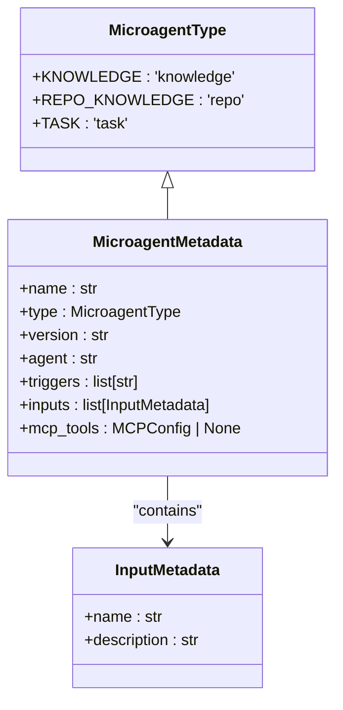
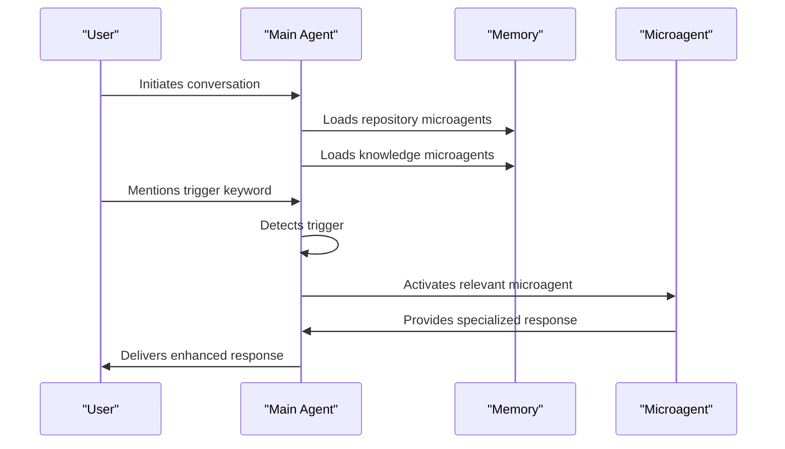

# Microagent Types

<cite>
**Referenced Files in This Document**   
- [microagents/README.md](file://microagents/README.md)
- [microagents/code-review.md](file://microagents/code-review.md)
- [microagents/update_pr_description.md](file://microagents/update_pr_description.md)
- [microagents/fix_test.md](file://microagents/fix_test.md)
- [microagents/security.md](file://microagents/security.md)
- [microagents/github.md](file://microagents/github.md)
- [microagents/gitlab.md](file://microagents/gitlab.md)
- [microagents/docker.md](file://microagents/docker.md)
- [microagents/npm.md](file://microagents/npm.md)
- [openhands/microagent/types.py](file://openhands/microagent/types.py)
- [openhands/controller/agent.py](file://openhands/controller/agent.py)
- [openhands/server/routes/conversation.py](file://openhands/server/routes/conversation.py)
- [openhands/microagent/__init__.py](file://openhands/microagent/__init__.py)
</cite>

## Table of Contents
1. [Introduction](#introduction)
2. [Microagent Types Overview](#microagent-types-overview)
3. [Knowledge Microagents](#knowledge-microagents)
4. [Repository Microagents](#repository-microagents)
5. [Task Microagents](#task-microagents)
6. [Specialized Microagents](#specialized-microagents)
7. [Microagent Implementation and Configuration](#microagent-implementation-and-configuration)
8. [Relationships with Main Agent System](#relationships-with-main-agent-system)
9. [Common Issues and Solutions](#common-issues-and-solutions)
10. [Best Practices](#best-practices)

## Introduction

Microagents in OpenHands are specialized components that enhance the system's capabilities by providing domain-specific knowledge and task-specific workflows. They serve as expert assistants that help developers with various aspects of software development, from code reviews to security analysis. This document provides a comprehensive overview of the different microagent types, their implementation details, trigger conditions, and specific use cases.

The microagent system in OpenHands is designed to be modular and extensible, allowing for the creation of specialized agents that can be triggered based on specific conditions or user requests. These microagents can be categorized into different types based on their functionality, activation mechanisms, and scope of operation.

**Section sources**
- [microagents/README.md](file://microagents/README.md)

## Microagent Types Overview

OpenHands supports three primary types of microagents, each serving a distinct purpose and operating under different conditions:

1. **Knowledge Microagents**: Trigger-based agents that provide specialized expertise when specific keywords are detected in conversations.
2. **Repository Microagents**: Always-active agents that contain repository-specific knowledge and guidelines.
3. **Task Microagents**: Specialized agents designed to perform specific tasks that require user input parameters.

These microagent types are defined in the `MicroagentType` enum in the `types.py` file, which specifies the different categories of microagents supported by the system.

**Diagram sources**
- [openhands/microagent/types.py](file://openhands/microagent/types.py)

**Section sources**
- [openhands/microagent/types.py](file://openhands/microagent/types.py)

## Knowledge Microagents

Knowledge microagents are trigger-based components that provide specialized expertise in specific domains such as programming languages, frameworks, or tools. These microagents are activated when specific keywords are detected in user conversations, allowing the system to provide contextually relevant guidance and best practices.

### Implementation Details

Knowledge microagents are implemented as markdown files with optional YAML frontmatter that defines their metadata. The frontmatter includes configuration parameters such as:

- **name**: The identifier for the microagent
- **type**: Set to 'knowledge' to indicate this is a knowledge microagent
- **version**: The version of the microagent
- **agent**: The agent class that will handle the microagent (typically CodeActAgent)
- **triggers**: A list of keywords that will activate the microagent
- **inputs**: Optional input parameters required by the microagent

The content of the microagent provides detailed guidance, best practices, and examples related to the specific domain.

### Trigger Conditions

Knowledge microagents are activated when any of their defined trigger keywords appear in the conversation. For example, the GitHub microagent is triggered by the keywords "github" or "git", while the security microagent responds to keywords like "security", "vulnerability", "authentication", "authorization", and "permissions".

### Use Cases

Knowledge microagents are particularly useful for:

- Providing language-specific best practices
- Offering framework-specific guidance
- Sharing tool usage patterns
- Addressing common problem solutions
- Delivering general development guidelines

For example, the `npm.md` microagent provides guidance on using npm to install packages, suggesting the use of the Unix "yes" command to pipe output and confirm actions when an interactive shell is not available.

**Section sources**
- [microagents/README.md](file://microagents/README.md)
- [microagents/npm.md](file://microagents/npm.md)
- [openhands/microagent/types.py](file://openhands/microagent/types.py)

## Repository Microagents

Repository microagents are always-active components that contain repository-specific knowledge and guidelines. Unlike knowledge microagents that are triggered by keywords, repository microagents are automatically loaded when working with a specific repository and provide continuous guidance throughout the development process.

### Implementation Details

Repository microagents are typically stored in the `.openhands/microagents/repo.md` file within a repository. They can include YAML frontmatter with metadata, but this is optional. When frontmatter is not provided, the file is loaded with default settings as a repository agent.

The content of repository microagents focuses on project-specific guidelines, team conventions, and workflow documentation. This includes:

- Repository structure details
- Testing and build procedures
- Environment requirements
- CI workflows and checks
- Code quality standards
- Team practices and conventions

### Activation and Loading

Repository microagents are automatically loaded when OpenHands works with a repository. The system follows a specific loading order:

1. Loads repository-specific instructions from `.openhands/microagents/repo.md` if present
2. Loads relevant knowledge agents based on keywords in conversations

This ensures that repository-specific guidelines take precedence while still allowing for the use of general knowledge agents when needed.

### Use Cases

Repository microagents are essential for:

- Enforcing team conventions and practices
- Documenting project-specific setup instructions
- Maintaining up-to-date team practices
- Ensuring consistency across development workflows
- Onboarding new team members to project standards

The repository agent for the OpenHands project itself serves as an example of how these microagents can be used to document team practices and project conventions.

**Section sources**
- [microagents/README.md](file://microagents/README.md)

## Task Microagents

Task microagents are specialized components designed to perform specific tasks that require user input parameters. These microagents are invoked through specific commands and are configured to accept input parameters that guide their execution.

### Implementation Details

Task microagents are defined with input parameters in their YAML frontmatter, specifying the required inputs for the task. Each input includes:

- **name**: The identifier for the input parameter
- **description**: A description of the input parameter
- **type**: The data type of the input parameter
- **validation**: Optional validation rules (e.g., pattern matching)

The microagent template uses these parameters in its instructions, typically through template variables (e.g., `{{ PR_URL }}`).

### Trigger Conditions

Task microagents are triggered by specific commands that match their defined triggers. For example, the `update_pr_description.md` microagent is triggered by the `/update_pr_description` command, while the `fix_test.md` microagent responds to the `/fix_test` command.

### Use Cases

Task microagents are particularly effective for automating common development tasks such as:

- Updating pull request descriptions
- Fixing failing tests
- Performing code reviews
- Addressing PR comments
- Managing repository operations

These microagents streamline repetitive tasks and ensure consistency in how they are performed across different projects and teams.

**Section sources**
- [microagents/README.md](file://microagents/README.md)
- [openhands/microagent/types.py](file://openhands/microagent/types.py)

## Specialized Microagents

OpenHands includes several specialized microagents designed for specific development tasks and technology domains. These microagents demonstrate the flexibility and extensibility of the microagent system.

### Code Review Microagent

The code review microagent (`code-review.md`) is designed to provide comprehensive feedback on code changes in pull requests or merge requests. It analyzes code for:

- Style and formatting issues
- Clarity and readability concerns
- Security vulnerabilities and common bug patterns

The microagent provides structured feedback with line numbers, explanations of issues, and concrete improvement suggestions. It follows a specific output format that includes emojis to categorize different types of feedback:

- :hammer_and_wrench: for style/formatting issues
- :mag: for readability concerns
- :closed_lock_with_key: for security risks

This microagent helps maintain code quality and educates developers on best practices through actionable feedback.

**Section sources**
- [microagents/code-review.md](file://microagents/code-review.md)

### PR Description Update Microagent

The PR description update microagent (`update_pr_description.md`) automates the process of updating pull request descriptions to better reflect the changes made in the code. It requires two input parameters:

- **PR_URL**: The URL of the pull request (validated with a regex pattern)
- **BRANCH_NAME**: The name of the branch associated with the pull request

The microagent checks the branch, analyzes the diff against the main branch, reads the existing PR description via the GitHub API, and updates it to be more reflective of the changes made. This ensures that PR descriptions remain accurate and informative throughout the development process.

**Section sources**
- [microagents/update_pr_description.md](file://microagents/update_pr_description.md)

### Test Fixing Microagent

The test fixing microagent (`fix_test.md`) is designed to help developers fix failing tests. It requires four input parameters:

- **BRANCH_NAME**: The branch to work on
- **TEST_COMMAND_TO_RUN**: The test command to execute
- **FUNCTION_TO_FIX**: The name of the function that needs to be fixed
- **FILE_FOR_FUNCTION**: The path to the file containing the function

The microagent checks out the specified branch, runs the test command, and attempts to fix the failing tests by modifying the specified function. Importantly, it does not modify the tests themselves, instead communicating with the user if it believes some tests are incorrect. This approach ensures that test integrity is maintained while still providing assistance with test failures.

**Section sources**
- [microagents/fix_test.md](file://microagents/fix_test.md)

### Security Analysis Microagent

The security analysis microagent (`security.md`) provides guidance on security best practices and helps identify potential security issues in code. It is triggered by keywords related to security, such as "security", "vulnerability", "authentication", "authorization", and "permissions".

The microagent emphasizes core security principles including:

- Using secure communication protocols
- Avoiding storage of sensitive data in code or version control
- Applying the principle of least privilege
- Validating and sanitizing all user inputs

It also provides guidance on common security checks, error handling, and secure configuration of services and APIs. This microagent helps developers maintain a security-first mindset throughout the development process.

**Section sources**
- [microagents/security.md](file://microagents/security.md)

### Technology-Specific Microagents

OpenHands includes several technology-specific microagents that provide guidance on using various tools and platforms:

#### GitHub Microagent

The GitHub microagent (`github.md`) provides instructions for interacting with GitHub repositories. It emphasizes using the GitHub API for operations and provides specific guidance on:

- Using the `GITHUB_TOKEN` environment variable for authentication
- Using the `create_pr` tool to open pull requests
- Handling authentication issues by updating the remote URL with the current token
- Following proper branching and PR workflows

#### GitLab Microagent

The GitLab microagent (`gitlab.md`) provides similar functionality for GitLab repositories, with specific instructions for:

- Using the `GITLAB_TOKEN` environment variable
- Using the `create_mr` tool to open merge requests
- Updating the remote URL with the current token for authentication
- Following GitLab-specific workflows

#### Docker Microagent

The Docker microagent (`docker.md`) provides guidance on using Docker in container environments, including:

- Starting the Docker daemon in the background
- Verifying Docker installation with the hello-world container
- Running Docker commands with appropriate permissions

These technology-specific microagents ensure that developers can effectively use various tools and platforms while following best practices and avoiding common pitfalls.

**Section sources**
- [microagents/github.md](file://microagents/github.md)
- [microagents/gitlab.md](file://microagents/gitlab.md)
- [microagents/docker.md](file://microagents/docker.md)

## Microagent Implementation and Configuration

The implementation and configuration of microagents in OpenHands follow a standardized pattern that ensures consistency and ease of use across different microagent types.

### Configuration Parameters

Microagents are configured using YAML frontmatter that defines their metadata and behavior. The key configuration parameters include:

- **name**: A unique identifier for the microagent
- **version**: The version of the microagent (following semantic versioning)
- **author**: The creator of the microagent
- **agent**: The agent class responsible for executing the microagent (typically CodeActAgent)
- **triggers**: A list of keywords that activate the microagent (for knowledge microagents)
- **inputs**: A list of input parameters required by the microagent (for task microagents)
- **type**: The type of microagent (knowledge, repo, or task)

### Domain Model

The domain model for microagents is defined in the `MicroagentMetadata` class in `types.py`. This class serves as the foundation for all microagent configurations and includes validation for the various parameters.

The `InputMetadata` class defines the structure for input parameters, including their name, description, type, and optional validation rules. This ensures that task microagents receive the necessary information to perform their functions correctly.

### Execution Requirements

Microagents have specific execution requirements based on their type and functionality:

- **Knowledge microagents**: Require keyword detection in conversations and access to relevant context
- **Repository microagents**: Require access to the repository structure and configuration
- **Task microagents**: Require specific input parameters and access to the necessary tools and APIs

The system ensures that these requirements are met before executing a microagent, providing appropriate error messages if requirements are not satisfied.

### Expected Outcomes

Each microagent is designed to produce specific outcomes based on its purpose:

- **Code review microagent**: Actionable feedback on code quality, readability, and security
- **PR description update microagent**: Updated PR descriptions that accurately reflect code changes
- **Test fixing microagent**: Fixed failing tests with minimal changes to the codebase
- **Security analysis microagent**: Identification of potential security issues and recommendations for mitigation

These outcomes are achieved through a combination of automated analysis and human-in-the-loop guidance, ensuring that the microagents provide valuable assistance while maintaining developer control over the codebase.

**Section sources**
- [openhands/microagent/types.py](file://openhands/microagent/types.py)
- [microagents/update_pr_description.md](file://microagents/update_pr_description.md)
- [microagents/fix_test.md](file://microagents/fix_test.md)

## Relationships with Main Agent System

Microagents are tightly integrated with the main agent system in OpenHands, forming a cohesive architecture that enhances the overall capabilities of the platform.

### Integration Architecture

The relationship between microagents and the main agent system is defined through several key components:

1. **Memory System**: The main agent's memory stores both repository microagents and knowledge microagents, making them available for use during conversations.

2. **Event System**: Microagents interact with the main agent through the event system, receiving and responding to events as needed.

3. **Configuration Management**: The main agent system manages the loading and configuration of microagents, ensuring they are properly initialized and available.

**Diagram sources**
- [openhands/controller/agent.py](file://openhands/controller/agent.py)
- [openhands/server/routes/conversation.py](file://openhands/server/routes/conversation.py)

### Agent Registration and Management

The main agent system manages microagents through a registration and management process. The `Agent` class in `agent.py` provides methods for registering, retrieving, and listing agents, ensuring that microagents are properly integrated into the system.

The `get_microagents` endpoint in `conversation.py` allows clients to retrieve information about all microagents associated with a conversation, including their name, type, content, triggers, inputs, and tools. This enables external systems to understand the capabilities available in a given conversation.

### Tool Integration

Microagents can provide additional MCP (Message Channel Protocol) tools that extend the capabilities of the main agent. These tools are integrated into the agent's tool list and can be used during execution. The `set_mcp_tools` method in the `Agent` class handles the integration of these tools, ensuring they are properly registered and available for use.

This integration allows microagents to extend the functionality of the main agent system, creating a flexible and extensible architecture that can adapt to different development needs and workflows.

**Section sources**
- [openhands/controller/agent.py](file://openhands/controller/agent.py)
- [openhands/server/routes/conversation.py](file://openhands/server/routes/conversation.py)
- [openhands/microagent/__init__.py](file://openhands/microagent/__init__.py)

## Common Issues and Solutions

While microagents provide significant benefits, they can encounter various issues during implementation and use. Understanding these common issues and their solutions is essential for effective microagent development and deployment.

### Configuration Issues

**Issue**: Incorrect YAML frontmatter formatting
**Solution**: Ensure proper YAML syntax with correct indentation and quoting of strings. Validate the configuration against the `MicroagentMetadata` schema.

**Issue**: Missing required parameters
**Solution**: Verify that all required parameters (name, type, version, agent) are included in the frontmatter. Use the `InputMetadata` class to validate input parameters for task microagents.

### Triggering Issues

**Issue**: Microagent not activating when expected
**Solution**: Verify that the trigger keywords are correctly defined and match the terms users are likely to use. Consider adding synonyms or related terms to improve detection.

**Issue**: Multiple microagents activating simultaneously
**Solution**: Use distinctive trigger keywords to minimize overlap. Implement priority rules or conflict resolution mechanisms when multiple microagents could be relevant.

### Execution Issues

**Issue**: Insufficient context for decision making
**Solution**: Ensure the microagent has access to all necessary context, such as code files, repository structure, and conversation history. Use the memory system to store and retrieve relevant information.

**Issue**: Overwriting user changes or preferences
**Solution**: Design microagents to provide recommendations rather than making direct changes, unless explicitly requested by the user. Implement confirmation steps for significant actions.

### Integration Issues

**Issue**: API authentication failures
**Solution**: Ensure proper handling of authentication tokens and credentials. Implement token refresh mechanisms and clear error messages for authentication issues.

**Issue**: Rate limiting with external services
**Solution**: Implement exponential backoff and retry mechanisms. Cache responses when appropriate and batch requests to minimize API calls.

### Performance Issues

**Issue**: Slow response times
**Solution**: Optimize microagent logic to minimize processing time. Implement caching for frequently accessed information and use efficient algorithms for analysis tasks.

**Issue**: Excessive resource consumption
**Solution**: Monitor resource usage and implement limits on processing time and memory consumption. Use streaming responses for large outputs to reduce memory footprint.

Addressing these common issues ensures that microagents provide reliable and efficient assistance to developers, enhancing productivity without introducing new problems.

**Section sources**
- [microagents/README.md](file://microagents/README.md)
- [microagents/github.md](file://microagents/github.md)
- [microagents/gitlab.md](file://microagents/gitlab.md)

## Best Practices

To maximize the effectiveness of microagents in OpenHands, follow these best practices for development, deployment, and usage.

### For Knowledge Microagents

1. **Choose distinctive triggers**: Select keywords that are specific to the domain and unlikely to appear in unrelated contexts.
2. **Focus on one area of expertise**: Keep knowledge microagents focused on a single topic to ensure depth and relevance.
3. **Include practical examples**: Provide concrete examples and code snippets to illustrate concepts and best practices.
4. **Use file patterns when relevant**: Specify file patterns or extensions when the guidance applies to specific file types.
5. **Keep knowledge general and reusable**: Design knowledge microagents to be applicable across multiple projects and contexts.

### For Repository Microagents

1. **Document clear setup instructions**: Provide comprehensive guidance on setting up the development environment.
2. **Include repository structure details**: Document the organization of files and directories to help new contributors navigate the codebase.
3. **Specify testing and build procedures**: Clearly outline the steps for running tests and building the project.
4. **List environment requirements**: Document all dependencies, versions, and configuration requirements.
5. **Document CI workflows and checks**: Explain the continuous integration process and any automated checks that run on pull requests.
6. **Include information about code quality standards**: Specify coding conventions, linting rules, and other quality requirements.
7. **Maintain up-to-date team practices**: Regularly update the repository agent to reflect current team practices and workflows.

### General Best Practices

1. **Test thoroughly**: Validate microagents with realistic scenarios to ensure they work as expected.
2. **Document limitations**: Clearly state any limitations or edge cases where the microagent may not work correctly.
3. **Provide clear error messages**: When issues occur, provide informative error messages that help users understand and resolve the problem.
4. **Respect user autonomy**: Design microagents to assist rather than dictate, allowing users to make final decisions about their code.
5. **Ensure security**: Avoid storing sensitive information in microagent configurations and follow security best practices when interacting with external services.

Following these best practices ensures that microagents provide valuable assistance while maintaining a positive user experience and high-quality outcomes.

**Section sources**
- [microagents/README.md](file://microagents/README.md)