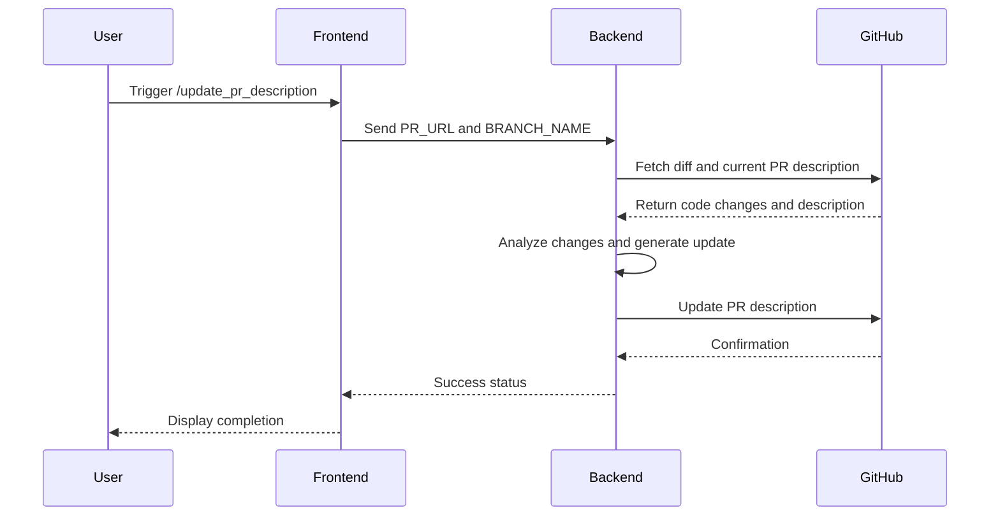
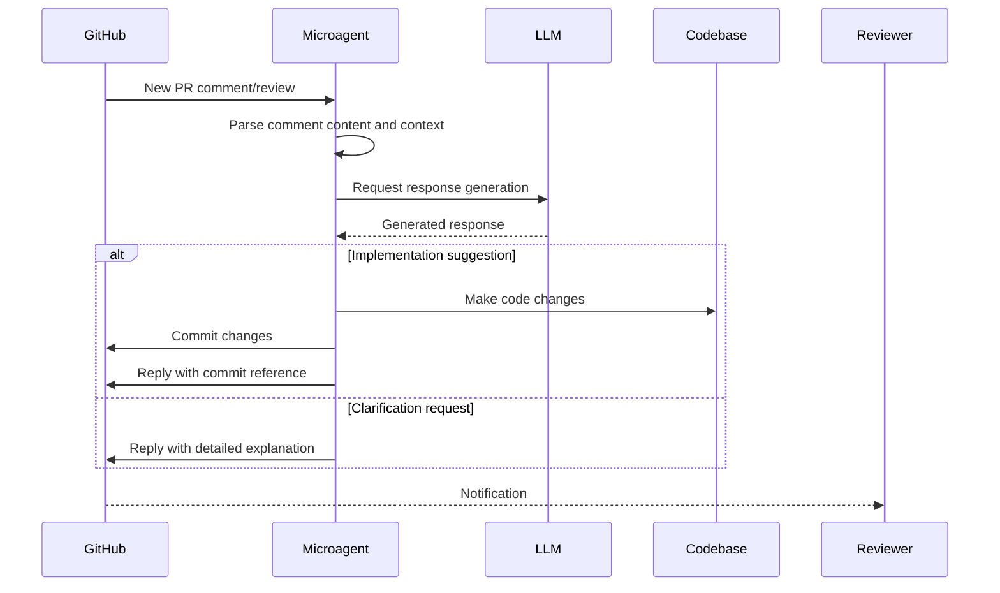
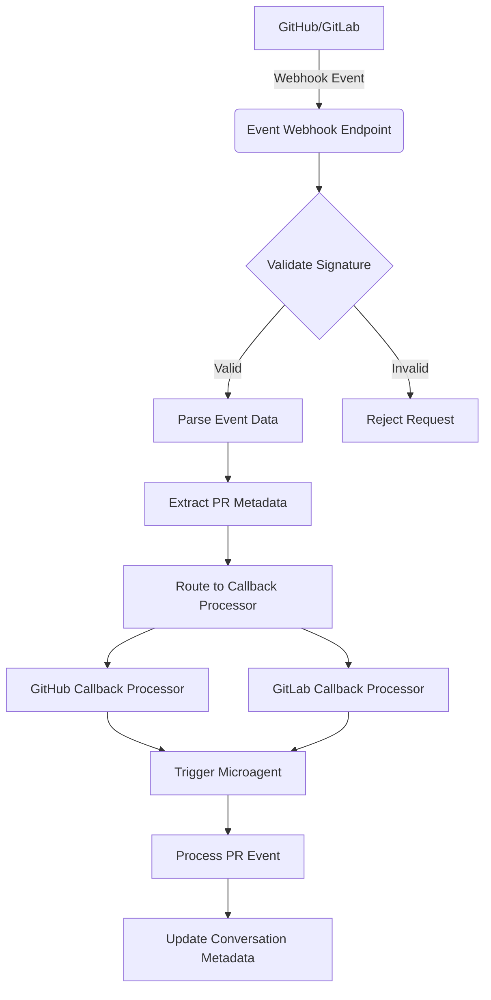
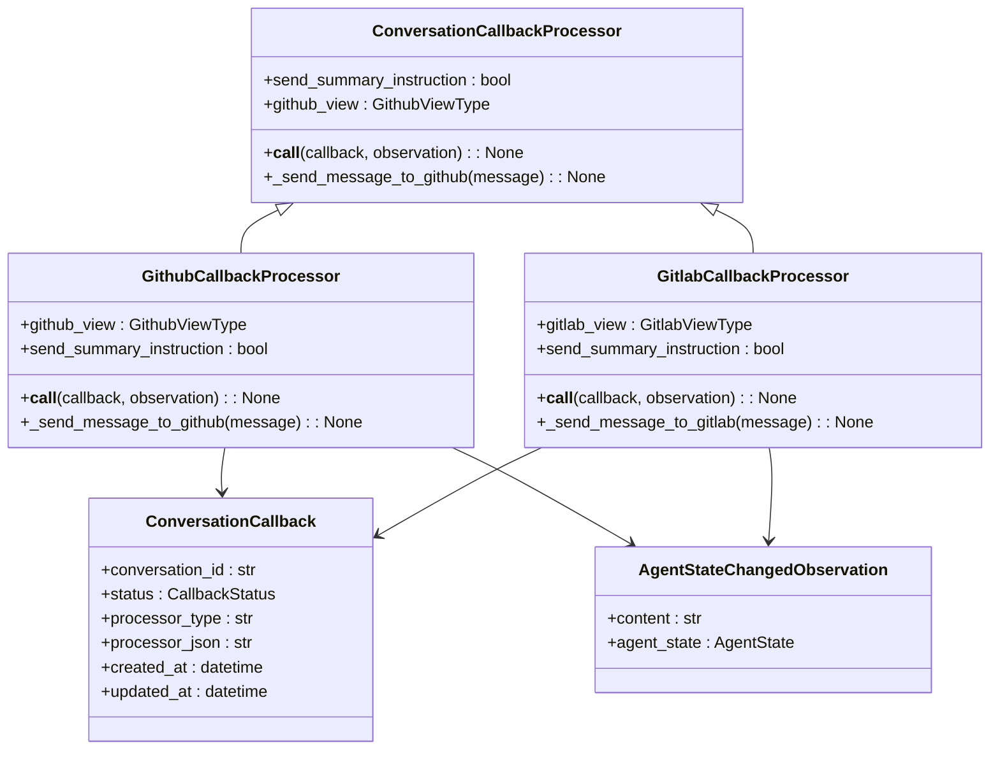

# PR Management Microagents

<cite>
**Referenced Files in This Document**   
- [update_pr_description.md](file://microagents/update_pr_description.md)
- [address_pr_comments.md](file://microagents/address_pr_comments.md)
- [github_callback_processor.py](file://enterprise/server/conversation_callback_processor/github_callback_processor.py)
- [gitlab_callback_processor.py](file://enterprise/server/conversation_callback_processor/gitlab_callback_processor.py)
- [mcp.py](file://openhands/server/routes/mcp.py)
- [microagent-status.ts](file://frontend/src/types/microagent-status.ts)
- [microagent-management-review-pr.tsx](file://frontend/src/components/features/microagent-management/microagent-management-review-pr.tsx)
- [proactive_conversation_store.py](file://enterprise/storage/proactive_conversation_store.py)
</cite>

## Table of Contents
1. [Introduction](#introduction)
2. [PR Description Updater Microagent](#pr-description-updater-microagent)
3. [PR Comment Responder Microagent](#pr-comment-responder-microagent)
4. [Domain Model and Configuration](#domain-model-and-configuration)
5. [Integration with GitHub/GitLab Webhooks](#integration-with-githubgitlab-webhooks)
6. [Event Callback Processor Relationship](#event-callback-processor-relationship)
7. [Common Issues and Solutions](#common-issues-and-solutions)
8. [Customization and Advanced Usage](#customization-and-advanced-usage)

## Introduction
The PR Management Microagents system in OpenHands provides automated assistance for pull request management through specialized microagents that handle PR description updates and comment responses. These microagents integrate with GitHub and GitLab platforms to streamline the code review process, automatically updating PR metadata and responding to comments based on predefined triggers and templates. The system is designed to reduce manual overhead in PR management while maintaining context and conversation continuity.

**Section sources**
- [update_pr_description.md](file://microagents/update_pr_description.md)
- [address_pr_comments.md](file://microagents/address_pr_comments.md)

## PR Description Updater Microagent
The PR Description Updater microagent automatically updates pull request descriptions based on code changes and PR metadata. This microagent is triggered by the `/update_pr_description` command and requires two inputs: the PR URL and the corresponding branch name. The microagent analyzes the diff between the feature branch and the main branch to understand the changes, then uses the GitHub API to read the existing PR description and update it with more accurate information reflecting the actual changes made.

The microagent follows a specific workflow: it first checks out the specified branch, analyzes the code changes, extracts key information about the modifications, and then formulates an updated PR description that better reflects the implementation details. This ensures that PR descriptions remain accurate and informative throughout the development process, even as the implementation evolves.

**Diagram sources**
- [update_pr_description.md](file://microagents/update_pr_description.md)
- [github_callback_processor.py](file://enterprise/server/conversation_callback_processor/github_callback_processor.py)

**Section sources**
- [update_pr_description.md](file://microagents/update_pr_description.md)

## PR Comment Responder Microagent
The PR Comment Responder microagent addresses comments and reviews on pull requests by analyzing the feedback and generating appropriate responses. Triggered by the `/address_pr_comments` command, this microagent requires the PR URL and branch name as inputs. It reads all comments and reviews on the PR, analyzes their content, and formulates responses that address the feedback, either by explaining implementation decisions or by making suggested changes.

The microagent processes comments in a structured manner: it first retrieves all comments and review threads from the PR, categorizes them by type and urgency, analyzes the context of each comment, and then generates responses that maintain the conversation context. For implementation suggestions, it can make code changes and create new commits. For clarification requests, it provides detailed explanations in comment responses.

**Diagram sources**
- [address_pr_comments.md](file://microagents/address_pr_comments.md)
- [github_callback_processor.py](file://enterprise/server/conversation_callback_processor/github_callback_processor.py)

**Section sources**
- [address_pr_comments.md](file://microagents/address_pr_comments.md)

## Domain Model and Configuration
The PR management microagents operate based on a well-defined domain model with specific configuration parameters that control their behavior. The core configuration includes template variables, monitoring intervals, and response generation rules that determine how the microagents interact with PRs.

Key configuration parameters include:
- **Template Variables**: Dynamic placeholders like `{{ PR_URL }}` and `{{ BRANCH_NAME }}` that are replaced with actual values when processing PRs
- **Comment Monitoring Intervals**: Configurable time intervals for checking new comments, balancing responsiveness with resource usage
- **Response Generation Rules**: Guidelines that determine the tone, length, and technical depth of generated responses
- **Approval Workflows**: Configuration for multi-stage review processes requiring multiple approvals

The system also includes validation patterns for input parameters, such as the regex pattern `^https://github.com/.+/.+/pull/[0-9]+$` for PR URLs, ensuring data integrity and preventing invalid inputs.

**Section sources**
- [update_pr_description.md](file://microagents/update_pr_description.md)
- [address_pr_comments.md](file://microagents/address_pr_comments.md)

## Integration with GitHub/GitLab Webhooks
The PR management microagents integrate with GitHub and GitLab through webhook-based event processing. When PR events occur (such as new comments, status changes, or merge requests), the platform sends webhook notifications to the OpenHands server, which then triggers the appropriate microagent based on the event type and content.

The integration follows a standardized flow: webhook events are received by the server's event webhook endpoint, validated for authenticity, parsed to extract relevant PR metadata, and routed to the appropriate callback processor. The GitHub and GitLab callback processors handle platform-specific event formats and authentication requirements, normalizing the data for processing by the microagents.

PR metadata, including PR numbers and repository information, is stored in the conversation metadata database, allowing microagents to maintain context across multiple interactions. The system uses JSON storage for PR numbers in the conversation metadata table, enabling multiple PRs to be associated with a single conversation when needed.

**Diagram sources**
- [github_callback_processor.py](file://enterprise/server/conversation_callback_processor/github_callback_processor.py)
- [gitlab_callback_processor.py](file://enterprise/server/conversation_callback_processor/gitlab_callback_processor.py)
- [mcp.py](file://openhands/server/routes/mcp.py)

**Section sources**
- [github_callback_processor.py](file://enterprise/server/conversation_callback_processor/github_callback_processor.py)
- [gitlab_callback_processor.py](file://enterprise/server/conversation_callback_processor/gitlab_callback_processor.py)
- [mcp.py](file://openhands/server/routes/mcp.py)

## Event Callback Processor Relationship
The PR management microagents are closely integrated with the main agent system's event callback processor, which serves as the central coordination point for handling PR-related events. The callback processor monitors agent state changes and triggers microagent actions when specific conditions are met, such as when an agent enters the `AWAITING_USER_INPUT` or `FINISHED` state.

The relationship between the microagents and the callback processor follows a publish-subscribe pattern: the main agent system publishes state change events, and the callback processor subscribes to these events, determining when to invoke microagents based on the current context. When a relevant state change occurs, the callback processor initiates a conversation summary process, which may trigger PR update actions.

The callback processor maintains state information about whether a summary instruction has been sent to a conversation, preventing duplicate processing. This state is persisted in the database, ensuring consistency across server restarts. The processor also handles error conditions gracefully, logging exceptions without interrupting the overall event processing flow.

**Diagram sources**
- [github_callback_processor.py](file://enterprise/server/conversation_callback_processor/github_callback_processor.py)
- [gitlab_callback_processor.py](file://enterprise/server/conversation_callback_processor/gitlab_callback_processor.py)

**Section sources**
- [github_callback_processor.py](file://enterprise/server/conversation_callback_processor/github_callback_processor.py)
- [gitlab_callback_processor.py](file://enterprise/server/conversation_callback_processor/gitlab_callback_processor.py)

## Common Issues and Solutions
The PR management microagents system addresses several common challenges in automated PR management, particularly around comment threading conflicts and context maintenance in multi-round discussions.

One key issue is comment threading conflicts, where multiple microagents or users respond to the same comment thread simultaneously, potentially creating conflicting responses. The system addresses this through a combination of rate limiting, thread locking in the database, and intelligent response coordination. When processing comment threads, the microagent first identifies the root comment and analyzes the entire thread history to maintain context consistency.

Another challenge is maintaining context in multi-round discussions, where the conversation evolves over multiple comments and responses. The microagents solve this by storing conversation context in the database and retrieving it for each interaction. The system also uses conversation summaries to condense lengthy discussion threads into key points, allowing the microagent to respond appropriately without losing track of the overall discussion direction.

The proactive conversation store implements row-level locking to ensure thread safety when multiple processes access the same database rows, preventing race conditions during concurrent PR events. This explicit transaction management with FOR UPDATE locking ensures data consistency in high-concurrency scenarios.

**Section sources**
- [proactive_conversation_store.py](file://enterprise/storage/proactive_conversation_store.py)
- [github_callback_processor.py](file://enterprise/server/conversation_callback_processor/github_callback_processor.py)

## Customization and Advanced Usage
The PR management microagents system provides extensive customization options for developers who want to tailor the behavior to their specific workflows. Customization is primarily achieved through response templates, approval workflows, and configuration parameters that can be adjusted based on project requirements.

Response templates can be customized to match team communication styles, with options to adjust formality, technical depth, and verbosity. The template variables system allows for dynamic content insertion, enabling personalized responses that reference specific code elements or project documentation.

Approval workflows can be configured to require multiple levels of review before certain actions are taken, such as merging PRs or making significant code changes. These workflows can be integrated with existing CI/CD pipelines and code quality tools to create comprehensive automated review processes.

For advanced usage, developers can extend the microagents by creating custom triggers based on specific comment patterns or PR metadata. The system's modular design allows for the addition of new microagents that can handle specialized PR management tasks, such as automated documentation updates or dependency version checks.

**Section sources**
- [update_pr_description.md](file://microagents/update_pr_description.md)
- [address_pr_comments.md](file://microagents/address_pr_comments.md)
- [microagent-status.ts](file://frontend/src/types/microagent-status.ts)