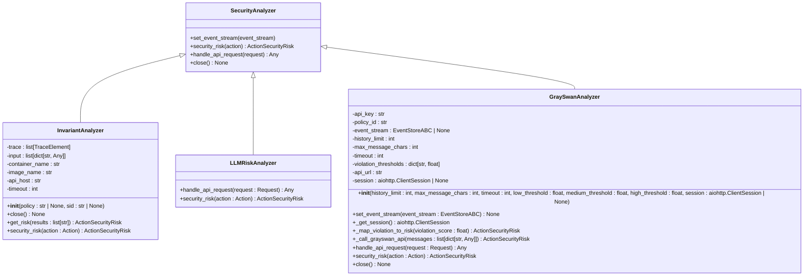
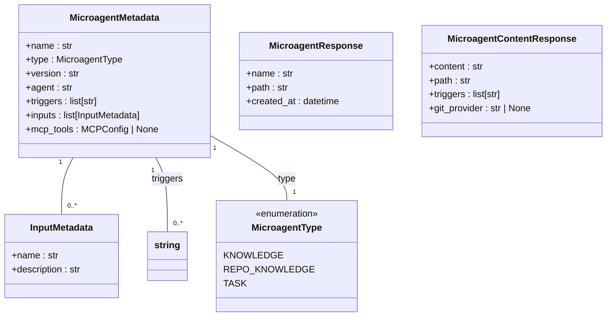
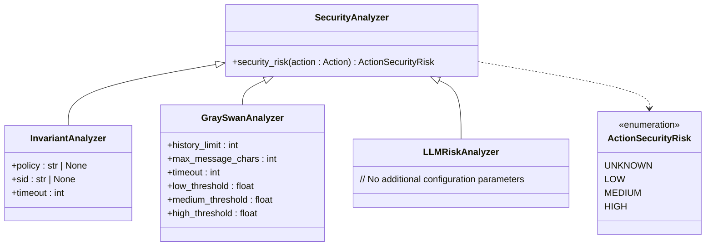
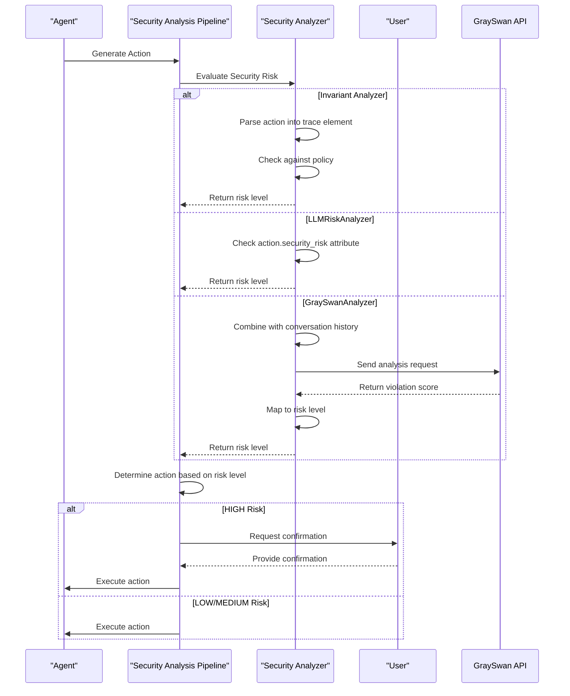
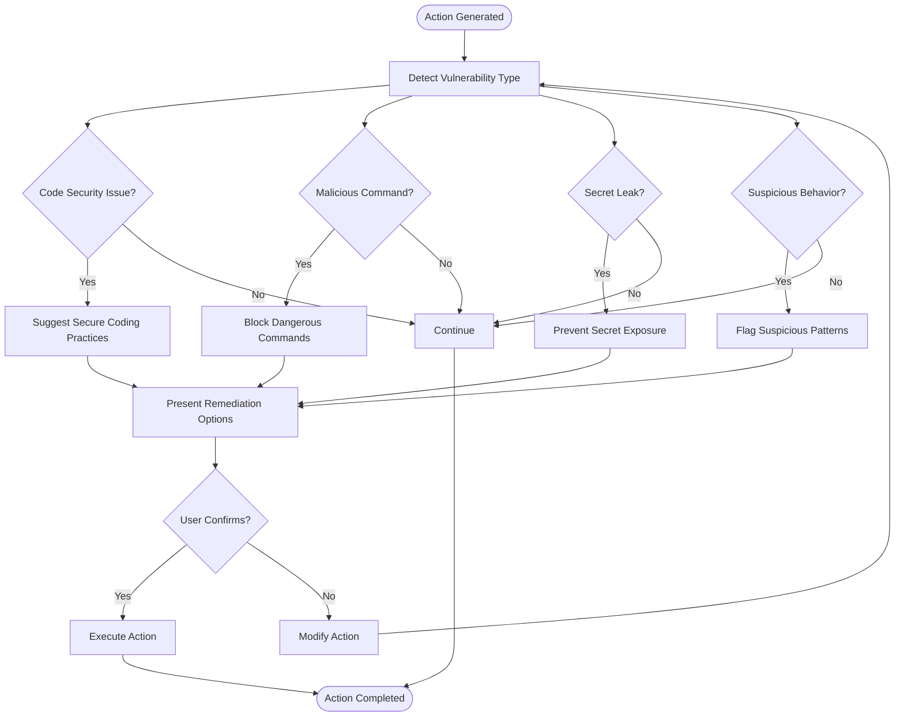
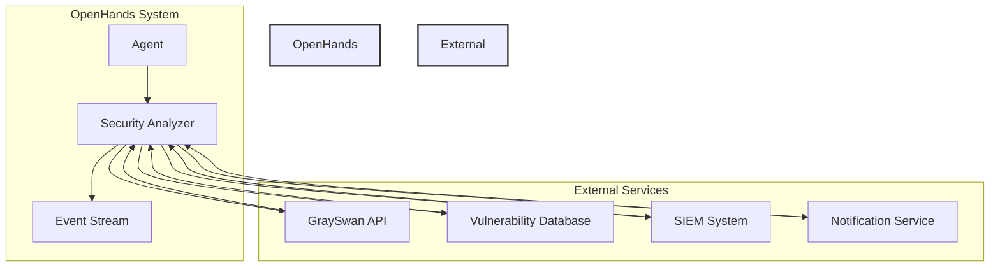
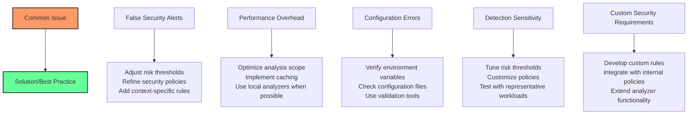

# Security Microagents

<cite>
**Referenced Files in This Document**   
- [analyzer.py](file://openhands/security/analyzer.py)
- [options.py](file://openhands/security/options.py)
- [invariant/analyzer.py](file://openhands/security/invariant/analyzer.py)
- [llm/analyzer.py](file://openhands/security/llm/analyzer.py)
- [grayswan/analyzer.py](file://openhands/security/grayswan/analyzer.py)
- [security.md](file://microagents/security.md)
- [types.py](file://openhands/microagent/types.py)
</cite>

## Table of Contents
1. [Introduction](#introduction)
2. [Security Analyzer Framework](#security-analyzer-framework)
3. [Security Microagent Implementation](#security-microagent-implementation)
4. [Domain Model and Configuration](#domain-model-and-configuration)
5. [Security Analysis Pipeline](#security-analysis-pipeline)
6. [Vulnerability Detection and Remediation](#vulnerability-detection-and-remediation)
7. [Integration with External Security Services](#integration-with-external-security-services)
8. [Common Issues and Solutions](#common-issues-and-solutions)
9. [Customization and Advanced Configuration](#customization-and-advanced-configuration)
10. [Conclusion](#conclusion)

## Introduction

Security microagents in OpenHands provide a comprehensive framework for monitoring and analyzing agent actions to prevent security breaches and unintended behaviors. These microagents operate as specialized security analyzers that evaluate actions for potential risks before execution. The system supports multiple security analysis approaches, including rule-based analysis with Invariant, LLM-based risk assessment, and external API integration with GraySwan. Security microagents are triggered by code changes, deployment events, and specific security-related keywords, providing real-time protection for coding agent operations.

The security framework is designed to be extensible, allowing integration with various vulnerability databases, risk scoring algorithms, and notification channels. It enables both automated security checks and human-in-the-loop confirmation for high-risk actions, balancing security with operational efficiency. This documentation provides detailed insights into the implementation, configuration, and customization of security microagents, making the system accessible to beginners while offering technical depth for experienced developers.

## Security Analyzer Framework

The Security Analyzer framework in OpenHands provides a structured approach to monitor and analyze agent actions for potential security risks. The framework is built around the `SecurityAnalyzer` base class, which serves as an abstract foundation for all security analysis implementations. This base class defines the core interface that all security analyzers must implement, ensuring consistency across different analysis approaches.

The framework supports three primary security analyzer types: Invariant, LLMRiskAnalyzer, and GraySwanAnalyzer. Each analyzer implements the same interface but uses different methodologies for risk assessment. The Invariant analyzer uses a rule-based approach with a dedicated Docker container running the Invariant server, while the LLMRiskAnalyzer relies on risk assessments provided by the language model itself. The GraySwanAnalyzer integrates with an external AI safety monitoring service through an API.

Security analyzers are integrated into the agent's event stream, allowing them to evaluate actions in real-time before execution. When an action is about to be executed, it passes through the security analyzer pipeline, which assesses its risk level and determines whether confirmation is required. This integration enables proactive security measures that prevent potentially harmful actions while allowing safe operations to proceed without interruption.

**Diagram sources**
- [analyzer.py](file://openhands/security/analyzer.py#L8-L38)
- [invariant/analyzer.py](file://openhands/security/invariant/analyzer.py#L15-L126)
- [llm/analyzer.py](file://openhands/security/llm/analyzer.py#L12-L43)
- [grayswan/analyzer.py](file://openhands/security/grayswan/analyzer.py#L18-L205)

**Section sources**
- [analyzer.py](file://openhands/security/analyzer.py#L8-L38)
- [options.py](file://openhands/security/options.py#L6-L10)

## Security Microagent Implementation

The security microagent implementation in OpenHands follows a modular architecture that enables flexible security analysis across different contexts and requirements. The implementation is centered around the microagent system, which allows for specialized security analysis triggered by specific events and conditions. Security microagents are defined as knowledge-type microagents with specific triggers related to security concerns such as "security", "vulnerability", "authentication", "authorization", and "permissions".

The implementation leverages the microagent framework to provide context-specific security guidance and analysis. When a user's query or task contains one of the security triggers, the security microagent is activated, providing relevant security best practices and considerations. This approach ensures that security concerns are addressed proactively, with the microagent offering guidance on secure coding practices, authentication mechanisms, and vulnerability mitigation strategies.

The security microagent system is integrated with the main agent's security analyzer pipeline, creating a multi-layered defense mechanism. While the security analyzer provides real-time action validation, the security microagent offers contextual guidance and recommendations. This dual approach combines automated security checks with human-readable security advice, enhancing both the security posture and developer awareness.

The implementation also supports different microagent types, including knowledge microagents that are triggered by keywords, repository microagents that are always active for specific repositories, and task microagents that require user input. This flexibility allows organizations to customize their security microagent strategy based on their specific needs and risk tolerance.

**Diagram sources**
- [types.py](file://openhands/microagent/types.py#L11-L60)

**Section sources**
- [security.md](file://microagents/security.md#L1-L35)
- [types.py](file://openhands/microagent/types.py#L11-L60)

## Domain Model and Configuration

The domain model for security microagents in OpenHands is designed to provide a comprehensive framework for security analysis and risk management. The model encompasses configuration parameters, risk assessment mechanisms, and integration points with external security services. At its core, the domain model defines the structure and behavior of security analyzers, including their configuration options, risk scoring algorithms, and interaction patterns with the agent system.

Configuration parameters for security microagents are defined through a combination of environment variables, configuration files, and runtime settings. The primary configuration mechanism is the `config.toml` file, which allows users to enable security analysis and select the appropriate security analyzer. Key configuration options include the security analyzer type, confirmation mode, and analyzer-specific settings such as API keys and policy IDs.

The risk scoring model in OpenHands defines three primary risk levels: LOW, MEDIUM, and HIGH. These levels are used consistently across all security analyzers to provide a standardized risk assessment framework. The risk scoring algorithm varies depending on the selected analyzer, with each implementation providing its own methodology for determining the appropriate risk level for an action.

Notification channels and integration points are configured through environment variables and API endpoints. For example, the GraySwan analyzer requires the `GRAYSWAN_API_KEY` environment variable for authentication and optionally supports a `GRAYSWAN_POLICY_ID` for custom policy configuration. These configuration parameters enable seamless integration with external security services while maintaining flexibility for different deployment scenarios.

The domain model also includes mechanisms for runtime configuration and policy management. Users can modify security policies and risk thresholds during operation, allowing for dynamic adjustment of security settings based on changing requirements or threat landscapes. This flexibility is particularly important in development environments where security requirements may vary between projects or phases of development.

**Diagram sources**
- [analyzer.py](file://openhands/security/analyzer.py#L5-L6)
- [invariant/analyzer.py](file://openhands/security/invariant/analyzer.py#L25-L36)
- [grayswan/analyzer.py](file://openhands/security/grayswan/analyzer.py#L21-L30)
- [llm/analyzer.py](file://openhands/security/llm/analyzer.py#L12-L13)

**Section sources**
- [analyzer.py](file://openhands/security/analyzer.py#L5-L6)
- [invariant/analyzer.py](file://openhands/security/invariant/analyzer.py#L25-L36)
- [grayswan/analyzer.py](file://openhands/security/grayswan/analyzer.py#L21-L30)
- [llm/analyzer.py](file://openhands/security/llm/analyzer.py#L12-L13)

## Security Analysis Pipeline

The security analysis pipeline in OpenHands provides a structured workflow for evaluating agent actions and mitigating potential security risks. The pipeline is integrated into the agent's event processing system, allowing for real-time security assessment of all actions before execution. When an action is generated by the agent, it enters the security analysis pipeline where it is evaluated by the configured security analyzer.

The pipeline begins with the agent generating an action based on the current task and context. This action is then passed to the security analyzer, which assesses its risk level using the selected analysis methodology. For the Invariant analyzer, this involves parsing the action into a trace element, checking it against the configured policy, and determining the appropriate risk level. For the GraySwan analyzer, the action is combined with recent conversation history and sent to the external API for analysis.

Based on the risk assessment, the pipeline determines the appropriate response. Actions with a LOW risk level are typically allowed to proceed automatically, while MEDIUM risk actions may require confirmation depending on the configuration. HIGH risk actions always require explicit user confirmation before execution, preventing potentially harmful operations. This tiered approach balances security with usability, minimizing interruptions for low-risk operations while providing strong protection against high-risk actions.

The pipeline also includes mechanisms for handling edge cases and errors. If a security analyzer fails to provide a risk assessment, the action is treated as UNKNOWN risk, which typically requires user confirmation. This fail-safe approach ensures that security is maintained even when individual components encounter issues. The pipeline is designed to be resilient and reliable, with proper error handling and logging to support troubleshooting and auditing.

**Diagram sources**
- [analyzer.py](file://openhands/security/analyzer.py#L21-L25)
- [invariant/analyzer.py](file://openhands/security/invariant/analyzer.py#L110-L126)
- [llm/analyzer.py](file://openhands/security/llm/analyzer.py#L19-L43)
- [grayswan/analyzer.py](file://openhands/security/grayswan/analyzer.py#L165-L196)

**Section sources**
- [analyzer.py](file://openhands/security/analyzer.py#L21-L25)
- [invariant/analyzer.py](file://openhands/security/invariant/analyzer.py#L110-L126)
- [llm/analyzer.py](file://openhands/security/llm/analyzer.py#L19-L43)
- [grayswan/analyzer.py](file://openhands/security/grayswan/analyzer.py#L165-L196)

## Vulnerability Detection and Remediation

The vulnerability detection and remediation capabilities in OpenHands security microagents provide comprehensive protection against common security issues in code and system operations. The detection mechanisms are implemented through the various security analyzers, each specializing in different types of vulnerabilities and risk patterns.

The Invariant analyzer focuses on rule-based detection of security issues, using a policy language to define acceptable and prohibited patterns in agent behavior. It can detect potential secret leaks by identifying patterns that resemble API keys, passwords, and other sensitive information. The analyzer also checks for security issues in Python code, such as improper input validation, insecure deserialization, and unsafe file operations. For bash commands, it identifies potentially malicious operations like unauthorized file access, system modifications, and network scanning.

The GraySwan analyzer extends vulnerability detection by leveraging external AI safety monitoring. It analyzes the conversation context and agent behavior to detect subtle security issues that might be missed by rule-based systems. This includes detecting indirect prompt injection attempts, identifying potentially harmful content generation, and recognizing patterns of behavior that could indicate security bypass attempts. The analyzer uses a violation scoring system that quantifies the severity of detected issues, allowing for consistent risk assessment across different types of vulnerabilities.

Remediation suggestions are provided through the security microagent system, which offers contextual guidance when security-related triggers are detected. For example, when a user asks about authentication, the security microagent provides best practices for implementing secure authentication mechanisms. When potential vulnerabilities are detected in code, the system can suggest specific remediation steps, such as using parameterized queries to prevent SQL injection or implementing proper input validation to prevent XSS attacks.

The remediation process is integrated with the agent's workflow, allowing for seamless implementation of security recommendations. When a high-risk action is detected, the system pauses execution and presents the user with information about the potential security issue and suggested alternatives. This interactive approach ensures that security concerns are addressed promptly while maintaining the flow of development work.

**Diagram sources**
- [invariant/analyzer.py](file://openhands/security/invariant/analyzer.py#L78-L87)
- [grayswan/analyzer.py](file://openhands/security/grayswan/analyzer.py#L78-L80)
- [security.md](file://microagents/security.md#L18-L35)

**Section sources**
- [invariant/analyzer.py](file://openhands/security/invariant/analyzer.py#L78-L87)
- [grayswan/analyzer.py](file://openhands/security/grayswan/analyzer.py#L78-L80)
- [security.md](file://microagents/security.md#L18-L35)

## Integration with External Security Services

OpenHands security microagents provide robust integration capabilities with external security services, extending the system's protection beyond local analysis. The most prominent integration is with GraySwan, an external AI safety monitoring service that provides advanced threat detection and risk assessment. This integration enables OpenHands to leverage specialized security expertise and continuously updated threat intelligence, enhancing the overall security posture.

The integration with GraySwan is implemented through a dedicated analyzer that communicates with the GraySwan Cygnal API. The analyzer sends conversation context and proposed actions to the external service, which returns a violation score indicating the level of security risk. This score is then mapped to OpenHands' risk levels (LOW, MEDIUM, HIGH) to determine the appropriate response. The integration requires authentication via the `GRAYSWAN_API_KEY` environment variable and optionally supports a custom policy ID through the `GRAYSWAN_POLICY_ID` variable.

The integration architecture follows a secure and resilient design pattern. Communication with external services uses HTTPS with proper authentication and encryption. The system includes timeout handling and error recovery mechanisms to ensure reliability even when the external service is temporarily unavailable. When the external service cannot be reached, the system falls back to a conservative approach, treating uncertain actions as high-risk to maintain security.

Beyond GraySwan, the security microagent framework is designed to support integration with other external security services. The modular architecture allows for the addition of new analyzers that can interface with vulnerability databases, threat intelligence feeds, and security information and event management (SIEM) systems. This extensibility enables organizations to incorporate their existing security infrastructure into the OpenHands environment, creating a unified security ecosystem.

The integration also supports notification channels for alerting security teams about potential issues. When high-risk actions are detected, the system can be configured to send alerts through various channels, including email, Slack, and security dashboards. This enables rapid response to security incidents and facilitates collaboration between development and security teams.

**Diagram sources**
- [grayswan/analyzer.py](file://openhands/security/grayswan/analyzer.py#L48-L63)
- [options.py](file://openhands/security/options.py#L9-L10)

**Section sources**
- [grayswan/analyzer.py](file://openhands/security/grayswan/analyzer.py#L48-L63)
- [options.py](file://openhands/security/options.py#L9-L10)

## Common Issues and Solutions

Security microagents in OpenHands may encounter several common issues that affect their effectiveness and usability. One of the most frequent issues is false security alerts, where legitimate actions are incorrectly flagged as high-risk. This can occur when the security policies are too restrictive or when the analyzer lacks sufficient context to accurately assess an action's risk. To address this, users can adjust the risk thresholds or refine the security policies to better match their specific use cases.

Another common issue is performance overhead, particularly with external service integrations like GraySwan. The security analysis process can introduce latency in agent responses, especially when network requests to external services are involved. This can be mitigated by optimizing the analysis scope, such as limiting the amount of conversation history sent for analysis or implementing caching mechanisms for frequently analyzed patterns.

Configuration errors are also a frequent source of issues. Missing or incorrect environment variables, such as the `GRAYSWAN_API_KEY`, can prevent security analyzers from functioning properly. The system provides clear error messages and logging to help diagnose these issues, but users should ensure that all required configuration parameters are correctly set before enabling security analysis.

Tuning detection sensitivity is crucial for balancing security and usability. The system provides several configuration options for adjusting sensitivity, including risk thresholds for the GraySwan analyzer and customizable policies for the Invariant analyzer. Users can experiment with different settings to find the optimal balance between security coverage and false positive rate.

For organizations with specific security requirements, the system supports custom rule development and integration with internal security policies. This allows for tailored security analysis that aligns with organizational standards and compliance requirements. The modular architecture makes it relatively straightforward to implement custom analyzers or extend existing ones to support specialized security checks.

**Diagram sources**
- [grayswan/analyzer.py](file://openhands/security/grayswan/analyzer.py#L26-L29)
- [invariant/analyzer.py](file://openhands/security/invariant/analyzer.py#L83-L87)

**Section sources**
- [grayswan/analyzer.py](file://openhands/security/grayswan/analyzer.py#L26-L29)
- [invariant/analyzer.py](file://openhands/security/invariant/analyzer.py#L83-L87)

## Customization and Advanced Configuration

OpenHands security microagents offer extensive customization and advanced configuration options to meet diverse security requirements. The system is designed to be highly flexible, allowing organizations to tailor the security analysis process to their specific needs, risk tolerance, and compliance requirements.

Custom security rules can be implemented through the Invariant analyzer's policy language, which provides a powerful framework for defining acceptable and prohibited patterns in agent behavior. Users can create custom policies that address specific security concerns, such as prohibiting certain types of file operations, restricting network access to approved domains, or enforcing coding standards for security-critical applications. The policy language supports complex conditions and logical operators, enabling sophisticated rule definitions.

Integration with external vulnerability scanners is supported through the modular analyzer architecture. Organizations can develop custom analyzers that interface with their preferred vulnerability scanning tools, incorporating the results into the security analysis pipeline. This allows for comprehensive security assessment that combines real-time agent monitoring with deep code analysis from specialized tools.

Advanced configuration options include fine-grained control over risk thresholds, analysis scope, and confirmation policies. For example, the GraySwan analyzer allows users to configure separate thresholds for low, medium, and high risk levels, enabling precise tuning of the sensitivity. The system also supports different confirmation modes, from fully automated (never confirm) to fully manual (always confirm), with security-based confirmation as the default middle ground.

The microagent system itself is highly customizable, allowing organizations to create specialized security microagents for specific domains or technologies. These custom microagents can be configured with unique triggers, knowledge bases, and response templates, providing targeted security guidance for different types of development work. The system supports both repository-specific microagents and global knowledge microagents, enabling flexible deployment strategies.

```mermaid
graph TD
Customization[Customization Options] --> Rules["Custom Security Rules"]
Customization --> Integration["External Scanner Integration"]
Customization --> Configuration["Advanced Configuration"]
Customization --> Microagents["Custom Microagents"]
Rules --> InvariantPolicy["Invariant Policy Language"]
Rules --> CustomAnalyzers["Custom Analyzer Development"]
Integration --> APIIntegration["API-based Integration"]
Integration --> PluginArchitecture["Plugin Architecture"]
Configuration --> RiskThresholds["Risk Threshold Tuning"]
Configuration --> ConfirmationModes["Confirmation Mode Selection"]
Configuration --> AnalysisScope["Analysis Scope Configuration"]
Microagents --> DomainSpecific["Domain-specific Microagents"]
Microagents --> TechnologySpecific["Technology-specific Microagents"]
Microagents --> RepositorySpecific["Repository-specific Microagents"]
style Customization fill:#f9f,stroke:#333,stroke-width:2px
style Rules fill:#bbf,stroke:#333,stroke-width:2px
style Integration fill:#bbf,stroke:#333,stroke-width:2px
style Configuration fill:#bbf,stroke:#333,stroke-width:2px
style Microagents fill:#bbf,stroke:#333,stroke-width:2px
```

**Diagram sources**
- [invariant/analyzer.py](file://openhands/security/invariant/analyzer.py#L83-L87)
- [grayswan/analyzer.py](file://openhands/security/grayswan/analyzer.py#L26-L29)
- [types.py](file://openhands/microagent/types.py#L11-L17)

**Section sources**
- [invariant/analyzer.py](file://openhands/security/invariant/analyzer.py#L83-L87)
- [grayswan/analyzer.py](file://openhands/security/grayswan/analyzer.py#L26-L29)
- [types.py](file://openhands/microagent/types.py#L11-L17)

## Conclusion

The security microagents in OpenHands provide a comprehensive and flexible framework for ensuring the safe operation of coding agents. By combining multiple analysis approaches, including rule-based analysis, LLM risk assessment, and external service integration, the system offers robust protection against a wide range of security threats. The modular architecture allows for easy customization and extension, enabling organizations to tailor the security analysis process to their specific requirements.

The implementation effectively balances security with usability, using tiered risk assessment to minimize interruptions for low-risk operations while providing strong protection against high-risk actions. The integration of contextual security guidance through microagents enhances developer awareness and promotes secure coding practices. This dual approach of automated security checks and educational guidance creates a comprehensive security ecosystem that protects both the system and the development process.

For beginners, the system provides clear configuration options and intuitive interfaces for managing security settings. For experienced developers, the extensible architecture and advanced configuration options enable sophisticated security strategies and integration with existing security infrastructure. The ability to customize security rules, integrate with external vulnerability scanners, and develop specialized microagents makes OpenHands a powerful platform for secure AI-assisted development.

As coding agents continue to evolve and take on more complex tasks, the importance of robust security measures will only increase. The security microagent framework in OpenHands represents a significant step forward in this domain, providing a scalable and adaptable solution for securing AI-powered development workflows. By proactively addressing security concerns and empowering developers with security knowledge, OpenHands helps create a safer and more trustworthy environment for AI-assisted software development.