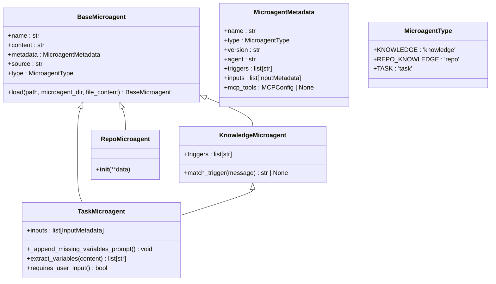
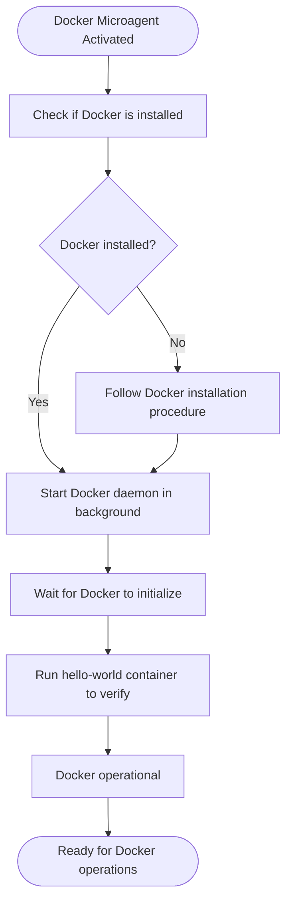
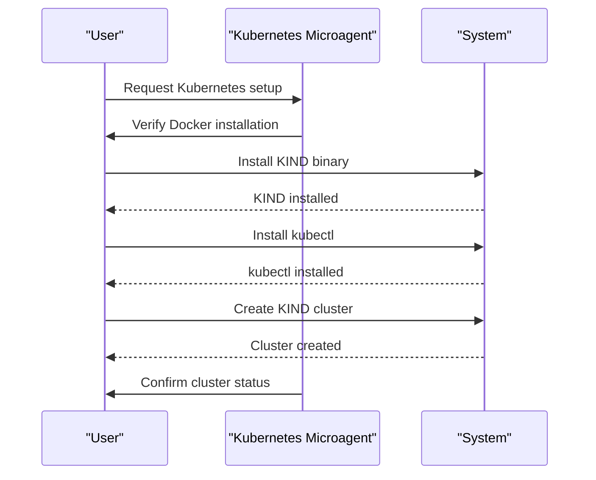
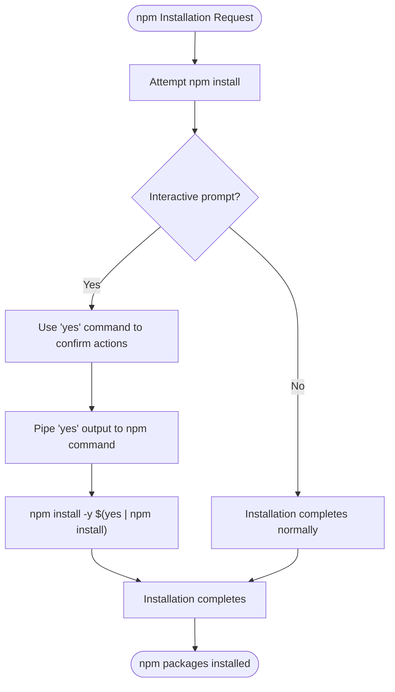
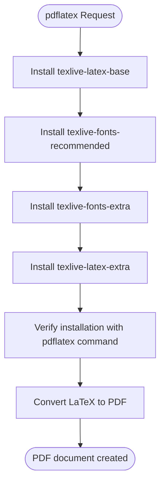
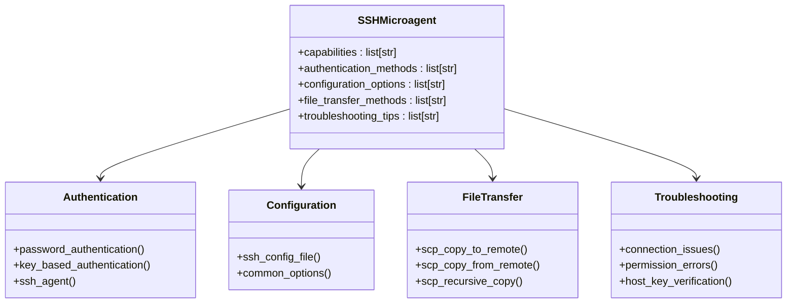
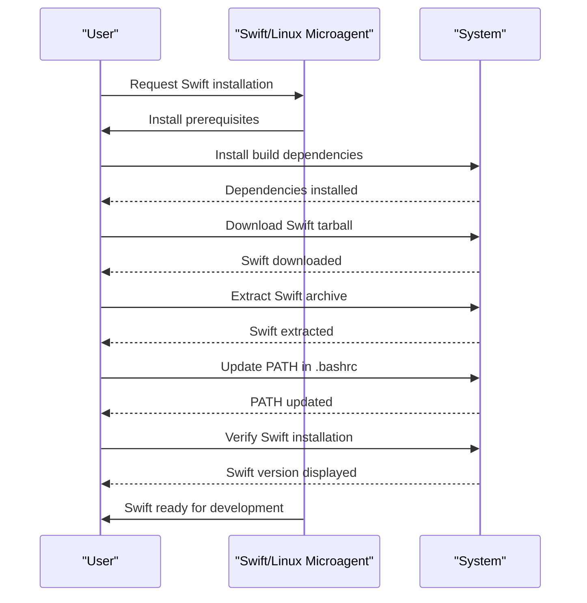
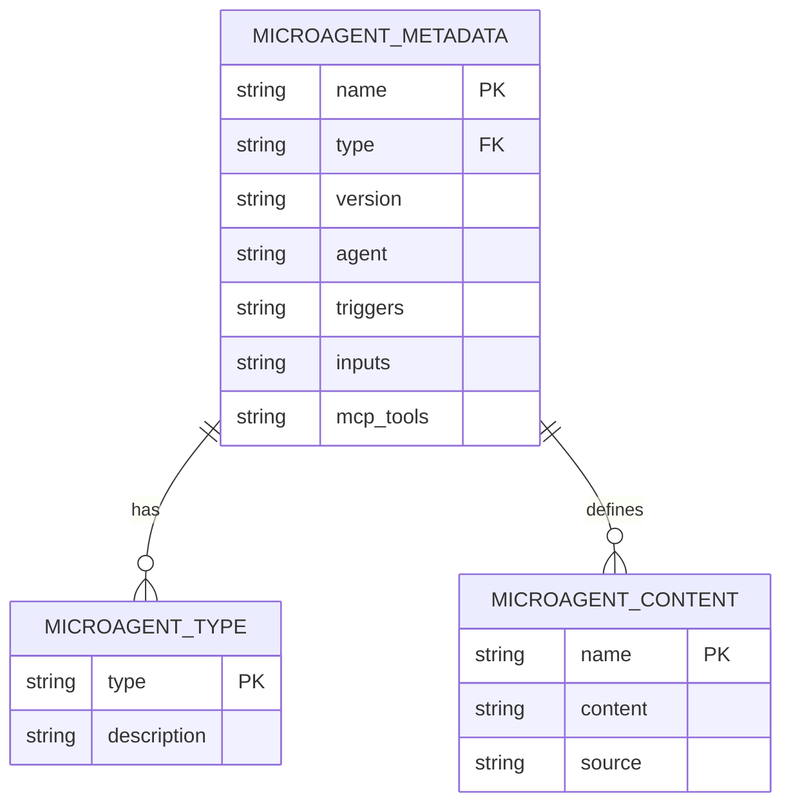
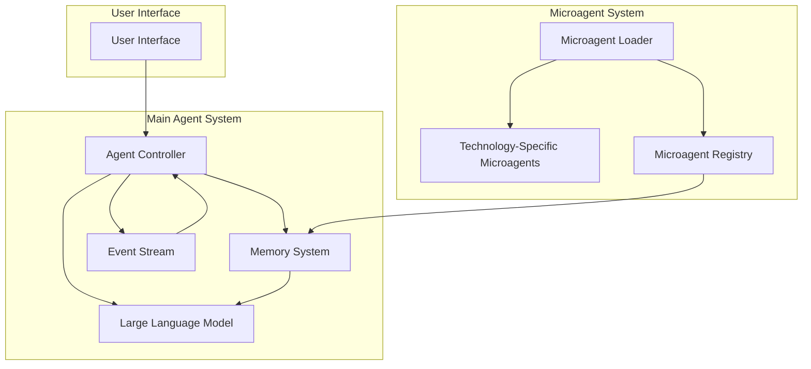

# Technology-Specific Microagents

<cite>
**Referenced Files in This Document**   
- [docker.md](file://microagents/docker.md)
- [kubernetes.md](file://microagents/kubernetes.md)
- [npm.md](file://microagents/npm.md)
- [pdflatex.md](file://microagents/pdflatex.md)
- [ssh.md](file://microagents/ssh.md)
- [swift-linux.md](file://microagents/swift-linux.md)
- [microagent.py](file://openhands/microagent/microagent.py)
- [types.py](file://openhands/microagent/types.py)
- [README.md](file://microagents/README.md)
</cite>

## Table of Contents
1. [Introduction](#introduction)
2. [Microagent Architecture and Runtime Integration](#microagent-architecture-and-runtime-integration)
3. [Docker Microagent](#docker-microagent)
4. [Kubernetes Microagent](#kubernetes-microagent)
5. [npm Microagent](#npm-microagent)
6. [pdflatex Microagent](#pdflatex-microagent)
7. [SSH Microagent](#ssh-microagent)
8. [Swift/Linux Microagent](#swiftlinux-microagent)
9. [Domain Model and Configuration Parameters](#domain-model-and-configuration-parameters)
10. [Relationship with Main Agent System](#relationship-with-main-agent-system)
11. [Common Issues and Solutions](#common-issues-and-solutions)
12. [Extending Support to Additional Technologies](#extending-support-to-additional-technologies)

## Introduction

Technology-Specific Microagents in OpenHands are specialized knowledge modules designed to provide domain-specific expertise for various development tools and environments. These microagents enhance the agent system by offering targeted guidance and automation for specific technologies, enabling more effective assistance with complex development tasks. The microagent system is designed to be extensible, allowing for the addition of new technology-specific agents as needed.

The microagent framework supports two primary types: Knowledge Microagents, which are triggered by keywords in conversations, and Repository Microagents, which provide project-specific guidance. This document focuses on the implementation details of technology-specific Knowledge Microagents for Docker, Kubernetes, npm, pdflatex, SSH, and Swift/Linux environments, detailing their trigger conditions, operational requirements, and integration with the main agent system.

**Section sources**
- [README.md](file://microagents/README.md#L1-L138)

## Microagent Architecture and Runtime Integration

The microagent system in OpenHands is built on a modular architecture that allows for dynamic loading and execution of technology-specific knowledge modules. The core components of this system are defined in the `microagent` package, which provides the base classes and loading mechanisms for all microagents.

**Diagram sources**
- [microagent.py](file://openhands/microagent/microagent.py#L17-L342)
- [types.py](file://openhands/microagent/types.py#L11-L60)

The microagent loading process begins with the `load_microagents_from_dir` function, which scans a specified directory for markdown files containing microagent definitions. Each microagent is defined in a markdown file with YAML frontmatter that specifies its metadata, including name, type, version, associated agent class, and triggers. The system automatically categorizes microagents based on their metadata and trigger configurations, creating instances of the appropriate subclass (`KnowledgeMicroagent`, `RepoMicroagent`, or `TaskMicroagent`).

When a user interacts with the agent system, the runtime evaluates the conversation context against the triggers defined in available knowledge microagents. If a trigger keyword is detected in the user's message, the corresponding microagent is activated, and its content is incorporated into the agent's context for generating responses. This allows the agent to provide specialized guidance relevant to the technology being discussed.

The integration between microagents and the main agent system is facilitated through the event stream and memory management components. Microagents are loaded into the agent's memory during initialization, and their content is made available to the LLM (Large Language Model) when generating responses. This architecture enables seamless access to technology-specific knowledge without requiring changes to the core agent logic.

**Section sources**
- [microagent.py](file://openhands/microagent/microagent.py#L1-L342)
- [types.py](file://openhands/microagent/types.py#L1-L60)

## Docker Microagent

The Docker Microagent provides specialized knowledge for working with Docker in containerized environments. This microagent is designed to assist with common Docker operations, particularly in scenarios where Docker needs to be started and managed within a container environment.

**Diagram sources**
- [docker.md](file://microagents/docker.md#L1-L32)

The Docker Microagent is triggered by keywords such as "docker" and "container" in user conversations. When activated, it provides guidance on starting the Docker daemon in container environments using the `dockerd` command with appropriate redirection of logs. The microagent emphasizes the importance of running Docker with sufficient privileges (using `sudo`) and waiting for initialization before attempting to run containers.

A key aspect of the Docker Microagent's functionality is its focus on verification. After starting the Docker daemon, it recommends running the `hello-world` container to confirm that Docker is functioning correctly. This verification step helps prevent issues that might arise from attempting to use Docker before it has fully initialized.

The microagent's implementation follows the standard knowledge microagent pattern, with its metadata defined in YAML frontmatter and its operational guidance provided in markdown format. This structure allows for easy updates and extensions to the Docker-related knowledge as new best practices emerge.

**Section sources**
- [docker.md](file://microagents/docker.md#L1-L32)

## Kubernetes Microagent

The Kubernetes Microagent specializes in local Kubernetes development using KIND (Kubernetes IN Docker). This microagent provides comprehensive guidance for setting up and managing local Kubernetes clusters, making it easier for developers to work with Kubernetes in development environments.

**Diagram sources**
- [kubernetes.md](file://microagents/kubernetes.md#L1-L51)

The Kubernetes Microagent is triggered by keywords such as "kubernetes", "k8s", and "kube" in user conversations. It provides step-by-step instructions for installing KIND and kubectl, the essential tools for local Kubernetes development. The installation process involves downloading the KIND binary from the official repository, making it executable, and moving it to a directory in the system's PATH.

For kubectl installation, the microagent guides users through downloading the binary from the Kubernetes release repository, making it executable, and adding it to the system's PATH. Once both tools are installed, the microagent provides the simple command `kind create cluster` to create a basic local Kubernetes cluster.

The microagent emphasizes the prerequisite of having Docker installed before proceeding with KIND installation, highlighting the dependency relationship between these technologies. This guidance helps prevent common setup issues that might arise from missing dependencies.

**Section sources**
- [kubernetes.md](file://microagents/kubernetes.md#L1-L51)

## npm Microagent

The npm Microagent addresses challenges related to package installation using npm, particularly in non-interactive environments. This microagent provides a practical solution for handling interactive prompts during package installation.

**Diagram sources**
- [npm.md](file://microagents/npm.md#L1-L12)

The npm Microagent is triggered by the keyword "npm" in user conversations. Its primary function is to address the challenge of using npm in environments where interactive shells are not available or difficult to use. When installing packages with npm, users may encounter prompts that require confirmation, which can be problematic in automated or non-interactive contexts.

The microagent provides a solution using the Unix "yes" command, which continuously outputs "y" followed by a newline. By piping the output of the "yes" command to npm, users can automatically confirm any prompts that appear during package installation. This approach allows for unattended npm package installation, making it particularly useful in CI/CD pipelines and automated development environments.

The simplicity of the npm Microagent reflects the focused nature of its guidance, addressing a specific but common pain point in JavaScript/Node.js development workflows.

**Section sources**
- [npm.md](file://microagents/npm.md#L1-L12)

## pdflatex Microagent

The pdflatex Microagent provides guidance for installing and using pdflatex, a tool for converting LaTeX sources to PDF format. This microagent is particularly valuable for researchers and academic writers who use LaTeX for document preparation.

**Diagram sources**
- [pdflatex.md](file://microagents/pdflatex.md#L1-L37)

The pdflatex Microagent is triggered by the keyword "pdflatex" in user conversations. It provides a comprehensive installation guide for LaTeX on Debian-based Linux systems using the apt package manager. The installation process is broken down into several steps to ensure a complete and functional LaTeX environment.

First, the microagent recommends installing the base LaTeX package (`texlive-latex-base`). Then, it suggests installing additional font packages (`texlive-fonts-recommended` and `texlive-fonts-extra`) to avoid font-related errors when compiling LaTeX documents. Finally, it recommends installing extra LaTeX packages (`texlive-latex-extra`) for enhanced functionality.

After installation, the microagent provides guidance on using pdflatex to convert LaTeX source files to PDF format with the simple command `pdflatex latex_source_name.tex`. This straightforward workflow enables users to quickly generate professional-quality PDF documents from LaTeX sources.

The microagent also includes a reference link to an external guide for additional information, demonstrating how microagents can complement internal knowledge with external resources.

**Section sources**
- [pdflatex.md](file://microagents/pdflatex.md#L1-L37)

## SSH Microagent

The SSH Microagent provides comprehensive capabilities for establishing and managing SSH connections to remote machines. This microagent covers various aspects of SSH usage, from basic connections to advanced configuration and troubleshooting.

**Diagram sources**
- [ssh.md](file://microagents/ssh.md#L1-L138)

The SSH Microagent is triggered by a variety of keywords related to remote connections, including "ssh", "remote server", "remote machine", "remote host", "remote connection", "secure shell", and "ssh keys". This broad trigger set ensures that the microagent is activated whenever SSH-related topics are discussed.

The microagent covers several key areas of SSH usage:

1. **Authentication Methods**: It provides guidance on both password authentication and key-based authentication, including commands for generating SSH key pairs, copying public keys to remote servers, and connecting using private keys.

2. **SSH Configuration**: The microagent explains how to create and use SSH config files to simplify connections by defining aliases, hostnames, usernames, and key files. This reduces the need to remember complex connection parameters.

3. **Common Options**: It documents frequently used SSH options for port specification, X11 forwarding, port forwarding, background execution, and verbose output for debugging.

4. **File Transfer**: The microagent covers SCP (Secure Copy Protocol) commands for transferring files between local and remote machines, including recursive directory copying.

5. **SSH Agent**: It explains how to use the SSH agent for managing private keys and avoiding repeated password entry.

6. **Troubleshooting**: The microagent provides solutions for common SSH issues, such as service status checks, port verification, connection debugging, permission fixes, and host key management.

7. **Secure Key Management**: It emphasizes proper file permissions for SSH keys and directories to ensure security.

The comprehensive nature of the SSH Microagent makes it a valuable resource for both beginners learning SSH and experienced users who need quick reference for advanced features.

**Section sources**
- [ssh.md](file://microagents/ssh.md#L1-L138)

## Swift/Linux Microagent

The Swift/Linux Microagent provides detailed instructions for installing Swift on Debian Linux systems, specifically targeting Debian 12 (Bookworm). This microagent is designed to support non-UI development tasks with Swift on Linux platforms.

**Diagram sources**
- [swift-linux.md](file://microagents/swift-linux.md#L1-L84)

The Swift/Linux Microagent is triggered by keywords such as "swift-linux", "swift-debian", and "swift-installation" in user conversations. It provides a step-by-step guide for installing Swift on Debian 12, beginning with the installation of prerequisite dependencies.

The installation process starts with installing essential build tools and libraries using apt-get, including gcc, git, libcurl4-openssl-dev, libicu-dev, and other dependencies required for Swift development. The microagent provides a comprehensive list of these dependencies, ensuring that users have all necessary components before proceeding.

Next, the microagent guides users through downloading the Swift binary tarball from the official Swift.org download page. It provides the URL pattern for finding the appropriate Swift version for Debian 12, making it easy to locate the correct download.

After downloading the tarball, users are instructed to extract the archive and add the Swift binary directory to their PATH by modifying the ~/.bashrc file. The microagent emphasizes the importance of updating the version number in the PATH to match the downloaded Swift version.

Finally, the microagent provides the command `swift --version` to verify that Swift has been correctly installed and is accessible from the command line.

The Swift/Linux Microagent also includes important notes about installation location, recommending that Swift be installed in the /workspace directory but outside of git repositories to avoid committing the Swift binaries.

**Section sources**
- [swift-linux.md](file://microagents/swift-linux.md#L1-L84)

## Domain Model and Configuration Parameters

The microagent system in OpenHands is built on a well-defined domain model that standardizes the structure and behavior of technology-specific microagents. This model ensures consistency across different microagents while allowing for technology-specific customization.

**Diagram sources**
- [types.py](file://openhands/microagent/types.py#L11-L60)
- [microagent.py](file://openhands/microagent/microagent.py#L17-L342)

The core of the domain model is the `MicroagentMetadata` class, which defines the standard properties for all microagents:

- **name**: A unique identifier for the microagent
- **type**: The category of microagent (knowledge, repo, or task)
- **version**: The version of the microagent
- **agent**: The agent class associated with the microagent
- **triggers**: Keywords that activate knowledge microagents
- **inputs**: Parameters required for task microagents
- **mcp_tools**: Configuration for MCP (Message Channel Protocol) tools

The `MicroagentType` enum defines the three types of microagents:
- **KNOWLEDGE**: Optional microagents triggered by keywords in conversations
- **REPO_KNOWLEDGE**: Always active microagents for repository-specific knowledge
- **TASK**: Special microagents that require user input

Each microagent is implemented as a markdown file with YAML frontmatter that specifies its metadata. The content of the microagent provides the detailed guidance and instructions for the specific technology. This structure separates the metadata (which controls the microagent's behavior in the system) from the content (which provides the actual knowledge to users).

The configuration parameters in the YAML frontmatter allow for flexible customization of microagent behavior. For example, the triggers parameter determines when a knowledge microagent is activated, while the agent parameter specifies which agent class should handle the microagent's execution.

This domain model enables a consistent approach to creating and managing technology-specific microagents while accommodating the unique requirements of different technologies.

**Section sources**
- [types.py](file://openhands/microagent/types.py#L1-L60)
- [microagent.py](file://openhands/microagent/microagent.py#L1-L342)

## Relationship with Main Agent System

The technology-specific microagents are tightly integrated with the main OpenHands agent system, forming a cohesive architecture that combines general AI capabilities with specialized domain knowledge.

**Diagram sources**
- [microagent.py](file://openhands/microagent/microagent.py#L277-L342)
- [types.py](file://openhands/microagent/types.py#L1-L60)

The integration process begins when the agent system initializes. During startup, the microagent loader scans designated directories for microagent files and loads them into the system. Knowledge microagents are registered in the microagent registry with their trigger keywords, while repository microagents are loaded directly into the agent's memory.

When a user interacts with the system, the agent controller processes the input and checks for trigger keywords that match registered knowledge microagents. If a match is found, the corresponding microagent's content is retrieved from the registry and incorporated into the context provided to the LLM. This allows the LLM to generate responses that incorporate the specialized knowledge from the microagent.

The memory system plays a crucial role in this integration, storing both the microagent content and the conversation history. This enables the agent to maintain context across multiple interactions and provide coherent, knowledge-rich responses.

The event stream facilitates communication between components, allowing the agent controller to coordinate actions between the main system and microagents. For example, when a microagent provides guidance on executing a command, the agent controller can use the event stream to send the appropriate action to the runtime environment.

This architecture ensures that technology-specific knowledge is seamlessly integrated with the general capabilities of the main agent system, creating a powerful combination of broad AI intelligence and specialized domain expertise.

**Section sources**
- [microagent.py](file://openhands/microagent/microagent.py#L277-L342)
- [types.py](file://openhands/microagent/types.py#L1-L60)

## Common Issues and Solutions

While technology-specific microagents enhance the capabilities of the OpenHands system, they can encounter various issues related to environment compatibility, dependency management, and configuration. Understanding these common issues and their solutions is essential for effective use of microagents.

```mermaid
flowchart TD
A([Common Issues]) --> B["Environment Compatibility"]
A --> C["Dependency Management"]
A --> D["Configuration Errors"]
A --> E["Trigger Conflicts"]
B --> B1["Missing system dependencies"]
B --> B2["Incompatible system versions"]
B --> B3["Permission issues"]
C --> C1["Missing package dependencies"]
C --> C2["Version conflicts"]
C --> C3["Repository access issues"]
D --> D1["Incorrect configuration syntax"]
D --> D2["Missing configuration files"]
D --> D3["Permission restrictions"]
E --> E1["Overlapping trigger keywords"]
E --> E2["Ambiguous triggers"]
E --> E3["Trigger priority issues"]
B1 --> Solution1["Install required dependencies"]
B2 --> Solution2["Use compatible versions"]
B3 --> Solution3["Use appropriate privileges"]
C1 --> Solution4["Install missing dependencies"]
C2 --> Solution5["Resolve version conflicts"]
C3 --> Solution6["Configure repository access"]
D1 --> Solution7["Validate configuration syntax"]
D2 --> Solution8["Create missing files"]
D3 --> Solution9["Adjust file permissions"]
E1 --> Solution10["Refine trigger keywords"]
E2 --> Solution11["Use more specific triggers"]
E3 --> Solution12["Define trigger priorities"]
```

**Diagram sources**
- [docker.md](file://microagents/docker.md#L1-L32)
- [kubernetes.md](file://microagents/kubernetes.md#L1-L51)
- [ssh.md](file://microagents/ssh.md#L1-L138)

One common issue is environment compatibility, where the microagent's recommended commands or procedures are not compatible with the user's system. For example, the Docker Microagent assumes the presence of certain system utilities and may not work correctly in minimal container environments. The solution is to verify system compatibility before following microagent guidance and install any missing dependencies.

Dependency management issues can arise when microagents recommend installing packages that have conflicting dependencies or when required repositories are not accessible. The Swift/Linux Microagent addresses this by providing a comprehensive list of build dependencies, reducing the likelihood of missing components.

Configuration errors are another common issue, particularly with complex tools like SSH. The SSH Microagent includes guidance on proper file permissions for SSH keys and configuration files, helping users avoid security-related errors.

Trigger conflicts can occur when multiple microagents have overlapping trigger keywords, leading to unintended activation. The microagent system addresses this by allowing for specific and distinctive triggers, as seen in the Swift/Linux Microagent's use of "swift-linux" and "swift-debian" rather than just "swift".

Understanding these common issues and their solutions enables users to effectively leverage technology-specific microagents while avoiding potential pitfalls.

**Section sources**
- [docker.md](file://microagents/docker.md#L1-L32)
- [kubernetes.md](file://microagents/kubernetes.md#L1-L51)
- [ssh.md](file://microagents/ssh.md#L1-L138)

## Extending Support to Additional Technologies

The microagent framework in OpenHands is designed to be extensible, allowing developers to add support for additional technologies beyond those currently implemented. This extensibility is a key feature that enables the system to adapt to new tools and environments as they emerge.

To create a new technology-specific microagent, developers should follow these steps:

1. Create a new markdown file in the microagents directory with a descriptive name
2. Add YAML frontmatter with appropriate metadata, including name, type, version, agent, and triggers
3. Provide comprehensive content covering installation, configuration, usage, and troubleshooting for the technology
4. Test the microagent thoroughly in relevant environments
5. Submit the microagent as a pull request to the OpenHands repository

When designing new microagents, it's important to consider the specific needs of the target technology. For example, a microagent for a container orchestration tool like Docker Swarm or Nomad would need to cover cluster management, service deployment, and scaling operations. A microagent for a programming language like Rust would need to address cargo package management, build profiles, and cross-compilation.

Performance optimization for specific toolchains can be achieved by focusing the microagent's content on the most common and challenging aspects of the technology. For example, a microagent for a machine learning framework might emphasize GPU configuration, distributed training, and model optimization techniques.

The modular design of the microagent system makes it easy to add new technologies without affecting existing functionality. Each microagent operates independently, activated only when its specific triggers are detected in user conversations. This ensures that adding new microagents does not increase the cognitive load on the system or create conflicts with existing knowledge.

By following the established patterns and best practices demonstrated in the existing microagents, developers can create high-quality, useful additions that enhance the capabilities of the OpenHands system for specific technologies and use cases.

**Section sources**
- [README.md](file://microagents/README.md#L88-L133)
- [types.py](file://openhands/microagent/types.py#L1-L60)
- [microagent.py](file://openhands/microagent/microagent.py#L1-L342)