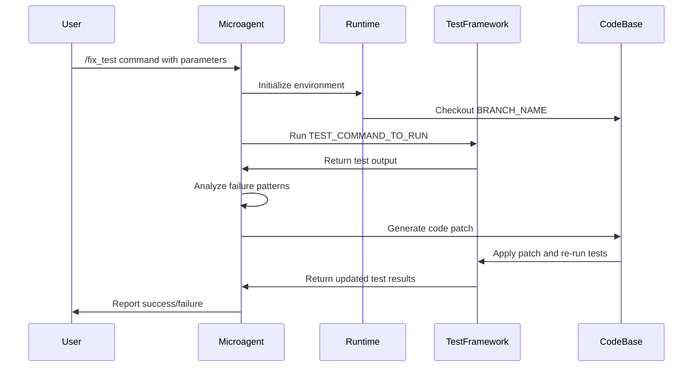
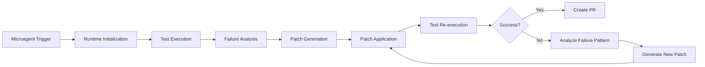

# Testing Microagents

<cite>
**Referenced Files in This Document**   
- [fix_test.md](file://microagents/fix_test.md)
- [update_test.md](file://microagents/update_test.md)
- [README.md](file://microagents/README.md)
- [patch.py](file://openhands/resolver/patching/patch.py)
- [issue_handler_factory.py](file://openhands/resolver/issue_handler_factory.py)
- [resolve_issue.py](file://openhands/resolver/resolve_issue.py)
- [testgeneval/scripts/eval/summarize_outputs.py](file://evaluation/benchmarks/testgeneval/scripts/eval/summarize_outputs.py)
</cite>

## Table of Contents
1. [Introduction](#introduction)
2. [Core Testing Microagents](#core-testing-microagents)
3. [Domain Model and Configuration](#domain-model-and-configuration)
4. [Implementation Details](#implementation-details)
5. [Code Modification Pipeline Integration](#code-modification-pipeline-integration)
6. [Error Pattern Recognition](#error-pattern-recognition)
7. [Common Issues and Solutions](#common-issues-and-solutions)
8. [Extending Testing Microagents](#extending-testing-microagents)
9. [Conclusion](#conclusion)

## Introduction

Testing Microagents in OpenHands are specialized AI assistants designed to automate test-related tasks, including fixing failing tests and updating test suites to match current implementations. These microagents operate within OpenHands' agent system, leveraging domain-specific knowledge to address test failures efficiently. The two primary testing microagents are the test fixer (`fix_test`) and code formatter (`update_test`), which work in complementary ways to maintain code quality and test reliability.

The test fixer microagent focuses on resolving test failures by modifying the implementation code while preserving test integrity, while the code formatter microagent updates test cases to align with current implementation behavior. Both microagents are triggered through specific commands and operate within a well-defined domain model that includes configuration parameters for test framework detection, error pattern matching, and formatting guidelines.

**Section sources**
- [README.md](file://microagents/README.md#L1-L32)

## Core Testing Microagents

The OpenHands framework includes two primary testing microagents: the test fixer and the code formatter. These microagents are implemented as specialized prompts with defined triggers and input parameters that guide their behavior in test-related scenarios.

The **test fixer microagent** (`fix_test.md`) is designed to address failing tests by modifying the implementation code. It is triggered by the `/fix_test` command and requires specific inputs including the target branch name, test command to run, function to fix, and the file path containing the function. The microagent's primary directive is to fix tests by modifying the implementation code while explicitly preserving the test cases themselves.

The **code formatter microagent** (`update_test.md`) serves the complementary purpose of updating test cases when the implementation is correct but tests are failing. Triggered by the `/update_test` command, this microagent receives similar inputs but operates under the assumption that the current implementation is correct and the tests need to be updated to pass with the existing codebase.

Both microagents follow a consistent pattern of operation: checking out the specified branch, running the provided test command, analyzing the test output, and generating appropriate corrective actions. They are designed to work within the OpenHands agent framework, leveraging the CodeActAgent to perform their tasks.

```mermaid
flowchart TD
A[/fix_test command] --> B{Test Failure}
B --> C[Analyze test output]
C --> D[Identify failing function]
D --> E[Modify implementation code]
E --> F[Run tests again]
F --> G{Tests pass?}
G --> |Yes| H[Create PR]
G --> |No| I[Analyze failure pattern]
I --> J[Generate new fix]
J --> F
K[/update_test command] --> L{Implementation correct?}
L --> M[Analyze test output]
M --> N[Identify test discrepancies]
N --> O[Update test cases]
O --> P[Run tests again]
P --> Q{Tests pass?}
Q --> |Yes| R[Create PR]
Q --> |No| S[Analyze failure pattern]
S --> T[Generate new test update]
T --> P
```

**Diagram sources**
- [fix_test.md](file://microagents/fix_test.md#L1-L24)
- [update_test.md](file://microagents/update_test.md#L1-L20)

**Section sources**
- [fix_test.md](file://microagents/fix_test.md#L1-L24)
- [update_test.md](file://microagents/update_test.md#L1-L20)

## Domain Model and Configuration

The testing microagents operate within a well-defined domain model that includes configuration parameters for test framework detection, error pattern matching rules, and formatting style guides. This domain model enables the microagents to adapt to different testing environments and frameworks while maintaining consistent behavior.

Key configuration parameters include:
- **BRANCH_NAME**: Specifies the branch on which the microagent should operate
- **TEST_COMMAND_TO_RUN**: Defines the test command to execute (e.g., `pytest tests/unit/test_bash_parsing.py`)
- **FUNCTION_TO_FIX**: Identifies the specific function that needs to be addressed
- **FILE_FOR_FUNCTION**: Specifies the file path containing the function to be fixed

The domain model also incorporates test framework detection capabilities, allowing the microagents to identify and work with various testing frameworks such as pytest, unittest, and others. This detection is based on file patterns, configuration files, and command-line invocation patterns that are characteristic of different testing frameworks.

Error pattern matching rules are implemented through regular expressions and heuristic analysis of test output. These rules help the microagents identify common failure patterns such as assertion errors, import errors, syntax errors, and timeout failures. The pattern matching system is extensible, allowing for the addition of custom error patterns for specific projects or frameworks.

Formatting style guides are integrated into the code formatter microagent, ensuring that updated test cases adhere to project-specific coding standards. These guides can include rules for naming conventions, code structure, documentation requirements, and other style considerations.

**Section sources**
- [fix_test.md](file://microagents/fix_test.md#L9-L16)
- [update_test.md](file://microagents/update_test.md#L9-L12)

## Implementation Details

The implementation of testing microagents follows a structured approach that begins with trigger detection and proceeds through test analysis, code modification, and validation. When a user invokes a testing microagent through a command like `/fix_test`, the system initializes the microagent with the provided parameters and establishes a runtime environment for test execution.

The microagent first checks out the specified branch and runs the provided test command within an isolated environment. The test output is then analyzed to identify the nature and location of failures. For the test fixer microagent, this analysis focuses on determining whether the failure is due to incorrect implementation logic, missing functionality, or interface mismatches.

The code modification process leverages the patching system in OpenHands, which is responsible for generating and applying code changes. The patching system uses diff-based analysis to create precise modifications that address the identified issues while minimizing collateral changes. This approach ensures that only the necessary code is modified, preserving the integrity of the surrounding codebase.

For the code formatter microagent, the implementation focuses on updating test cases to match the current implementation. This may involve modifying assertions, adjusting test data, or reworking test structure to accommodate changes in the implementation API. The microagent ensures that test updates maintain the original test intent while adapting to the current code behavior.



**Diagram sources**
- [fix_test.md](file://microagents/fix_test.md#L19-L23)
- [patch.py](file://openhands/resolver/patching/patch.py#L1-L800)

**Section sources**
- [fix_test.md](file://microagents/fix_test.md#L19-L23)
- [patch.py](file://openhands/resolver/patching/patch.py#L1-L800)

## Code Modification Pipeline Integration

Testing microagents are tightly integrated with the main agent system's code modification pipeline, which handles the end-to-end process of code analysis, modification, and validation. This integration enables seamless coordination between the microagents and the broader agent system, ensuring that test fixes and updates are applied consistently and safely.

The code modification pipeline begins with the microagent receiving a trigger command and associated parameters. It then initializes a runtime environment and connects to the codebase through the agent system's sandbox. The pipeline uses a series of well-defined steps to process test failures:

1. **Environment Setup**: The pipeline establishes an isolated runtime environment with access to the codebase and testing tools
2. **Test Execution**: The specified test command is executed, and the output is captured for analysis
3. **Failure Analysis**: The test output is parsed to identify failure patterns and their locations
4. **Patch Generation**: Based on the analysis, the system generates a code patch using diff-based techniques
5. **Patch Validation**: The patch is applied, and tests are re-run to verify the fix
6. **Result Reporting**: The outcome is reported back to the user, with details of the changes made

The integration with the main agent system allows testing microagents to leverage shared components such as the event system, state management, and tool integration. This shared infrastructure ensures consistency across different microagents and enables features like audit logging, change tracking, and collaboration support.



**Diagram sources**
- [resolve_issue.py](file://openhands/resolver/resolve_issue.py#L1-L136)
- [issue_handler_factory.py](file://openhands/resolver/issue_handler_factory.py#L1-L111)

**Section sources**
- [resolve_issue.py](file://openhands/resolver/resolve_issue.py#L1-L136)
- [issue_handler_factory.py](file://openhands/resolver/issue_handler_factory.py#L1-L111)

## Error Pattern Recognition

The testing microagents employ sophisticated error pattern recognition techniques to identify and categorize test failures. This recognition system is based on analyzing test output and matching patterns against a comprehensive set of known failure types.

The error pattern recognition process begins with parsing the raw test output, which typically includes stack traces, error messages, and test status indicators. The system uses regular expressions and heuristic analysis to extract relevant information such as error type, location, and context. Common error patterns include:

- **SyntaxError**: Indicates incorrect Python syntax in the code
- **IndentationError**: Identifies improper indentation in Python code
- **AssertionError**: Shows that a test assertion has failed
- **ImportError**: Reveals issues with module imports
- **AttributeError**: Indicates missing or incorrect attributes
- **TypeError**: Shows type-related issues in function calls or operations

The pattern recognition system is extensible, allowing for the addition of custom error patterns for specific projects or frameworks. This extensibility is achieved through a modular design that separates pattern definitions from the core recognition engine. Project-specific error patterns can be defined in repository instructions, enabling the microagents to adapt to unique testing environments.

The system also incorporates context-aware analysis, considering factors such as the test framework being used, the programming language, and the specific module being tested. This contextual awareness improves the accuracy of error classification and enables more targeted fixes.

**Section sources**
- [testgeneval/scripts/eval/summarize_outputs.py](file://evaluation/benchmarks/testgeneval/scripts/eval/summarize_outputs.py#L76-L88)
- [fix_test.md](file://microagents/fix_test.md#L22-L23)

## Common Issues and Solutions

Testing microagents may encounter several common issues during operation, with infinite test failure loops being one of the most significant challenges. An infinite loop occurs when a microagent repeatedly applies fixes that fail to resolve the underlying issue, causing the test to fail repeatedly and triggering additional fix attempts.

To address infinite loops, the system implements several safeguards:
- **Iteration limits**: The microagent is configured with a maximum number of fix attempts before terminating
- **Change tracking**: The system monitors the nature of changes being made to detect repetitive patterns
- **Failure pattern analysis**: The system analyzes whether successive failures share the same root cause
- **Human intervention triggers**: When certain conditions are met, the system prompts for human review

Another common issue is over-modification, where the microagent makes unnecessary changes to code beyond what is required to fix the test. This is mitigated through:
- **Minimal change principle**: The patching system aims to make the smallest possible changes
- **Diff-based analysis**: Changes are generated using precise diff operations
- **Scope restriction**: The microagent focuses on the specific function or module mentioned in the parameters

Validation of test fixes before application is critical to ensure code quality. The system employs several validation strategies:
- **Pre-application testing**: Patches are tested in isolated environments before being applied to the main codebase
- **Regression testing**: After applying a fix, all relevant tests are run to ensure no new issues are introduced
- **Code review simulation**: The system checks for adherence to coding standards and best practices
- **Impact analysis**: The potential impact of changes is assessed before implementation

**Section sources**
- [testgeneval/scripts/eval/summarize_outputs.py](file://evaluation/benchmarks/testgeneval/scripts/eval/summarize_outputs.py#L76-L120)
- [fix_test.md](file://microagents/fix_test.md#L23)

## Extending Testing Microagents

The testing microagent framework is designed to be extensible, allowing developers to enhance error pattern recognition and integrate with custom testing frameworks. Extension points include adding new error patterns, supporting additional test frameworks, and customizing the fix generation process.

To extend error pattern recognition, developers can:
- Define new regular expressions for identifying custom error messages
- Implement heuristic rules for context-specific failure patterns
- Add project-specific error classifications in repository instructions
- Create pattern hierarchies that account for framework-specific variations

Integration with custom testing frameworks involves:
- Defining framework-specific test command templates
- Implementing output parsers for framework-specific test formats
- Creating framework-specific error pattern definitions
- Adding framework-specific configuration detection

The extension system supports both global additions (available to all users) and repository-specific extensions (private to individual projects). Global extensions are contributed to the main OpenHands repository, while repository-specific extensions are maintained in the `.openhands/microagents/` directory of individual projects.

Developers can also extend the microagents by:
- Creating new microagent types for specialized testing scenarios
- Adding custom validation rules for specific codebases
- Implementing framework-specific best practices
- Integrating with project-specific CI/CD workflows

**Section sources**
- [README.md](file://microagents/README.md#L88-L138)
- [issue_handler_factory.py](file://openhands/resolver/issue_handler_factory.py#L1-L111)

## Conclusion

Testing microagents in OpenHands provide a powerful framework for automating test-related tasks, combining specialized knowledge with robust code modification capabilities. The test fixer and code formatter microagents work together to maintain code quality by addressing test failures through targeted code changes and test updates.

These microagents operate within a well-defined domain model that includes comprehensive configuration parameters, error pattern recognition rules, and integration with the main agent system's code modification pipeline. Their implementation leverages diff-based patching, context-aware analysis, and validation safeguards to ensure reliable and safe code modifications.

The system addresses common challenges such as infinite test failure loops through iteration limits, change tracking, and human intervention triggers. It also provides extensibility points for enhancing error pattern recognition and integrating with custom testing frameworks, making it adaptable to diverse development environments.

By automating routine test maintenance tasks, testing microagents free developers to focus on higher-level design and architectural concerns, while ensuring that code quality is maintained through automated testing and validation.

**Section sources**
- [README.md](file://microagents/README.md#L1-L138)
- [fix_test.md](file://microagents/fix_test.md#L1-L24)
- [update_test.md](file://microagents/update_test.md#L1-L20)