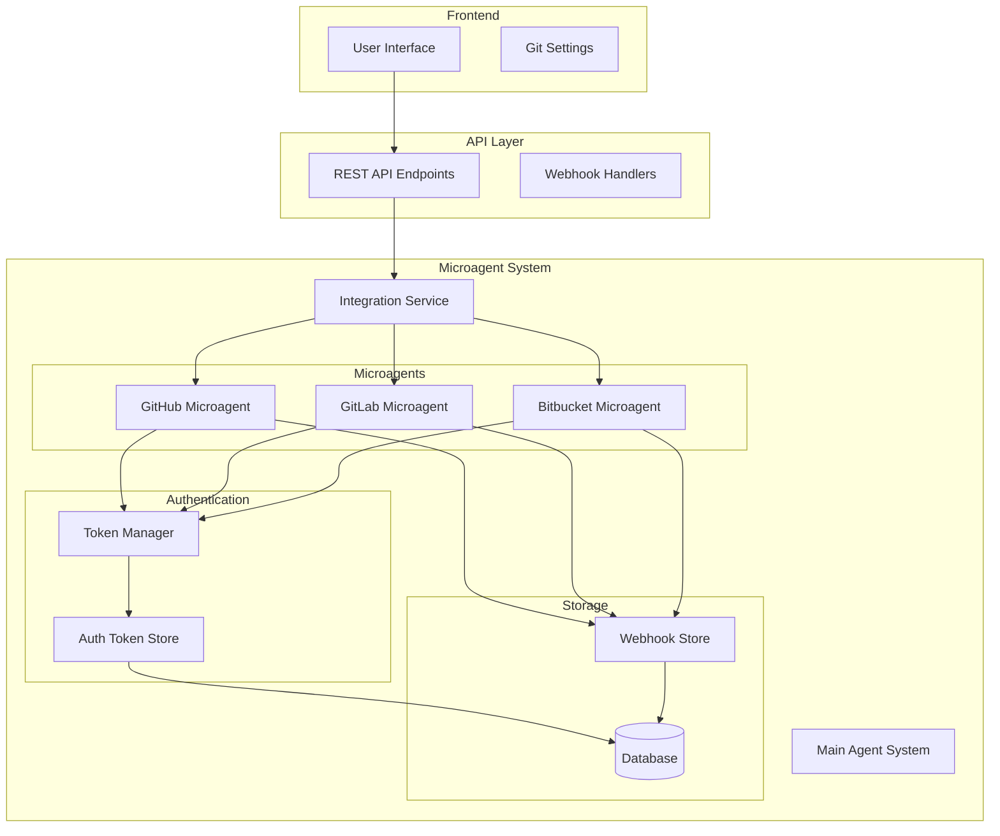
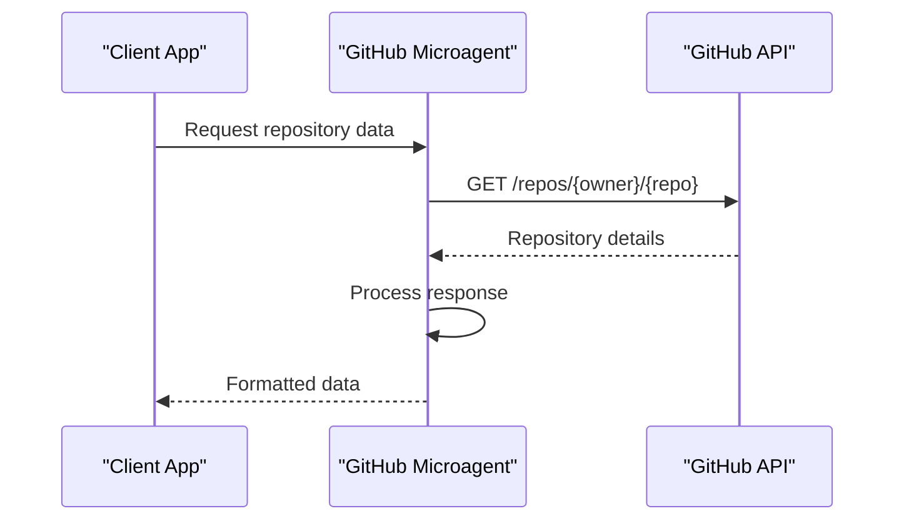
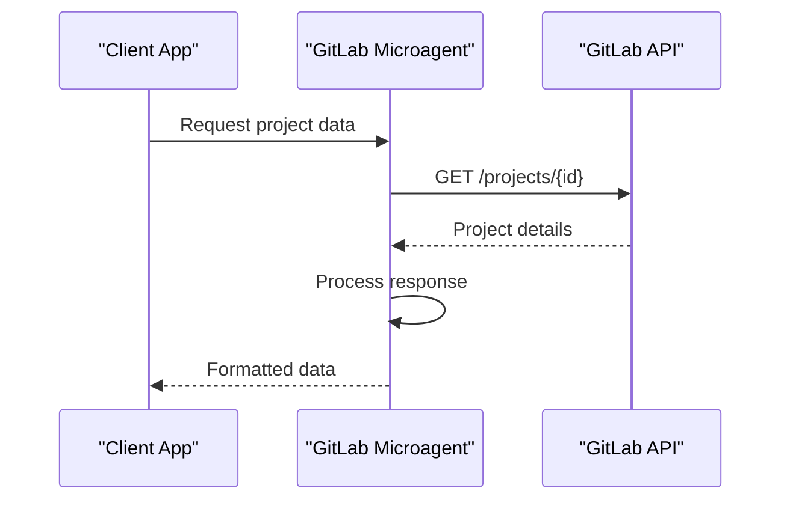
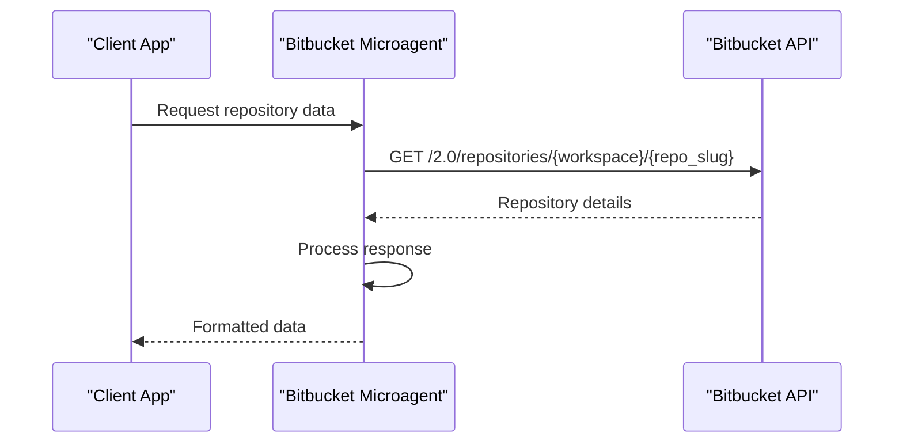
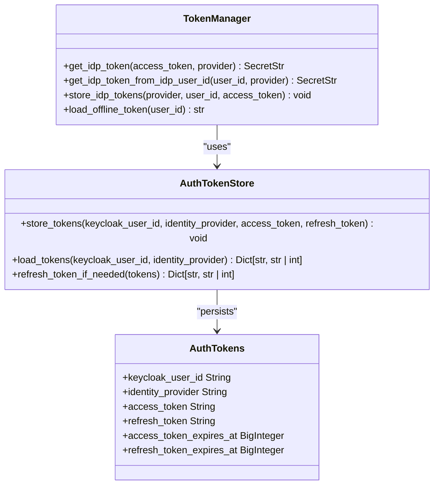
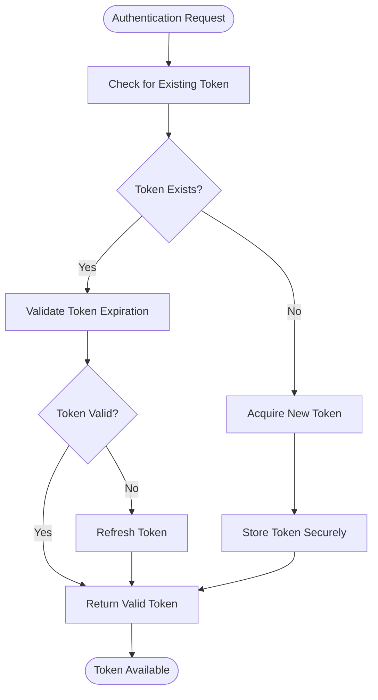
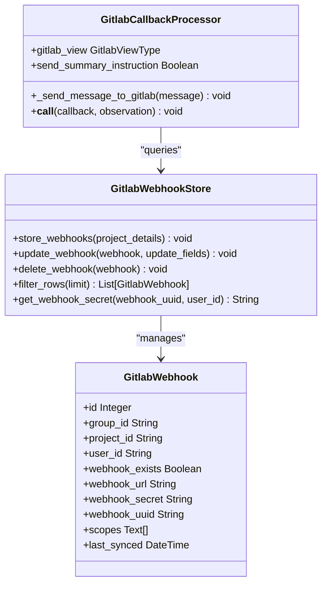
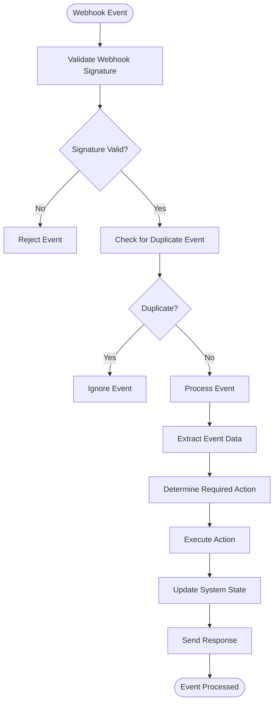
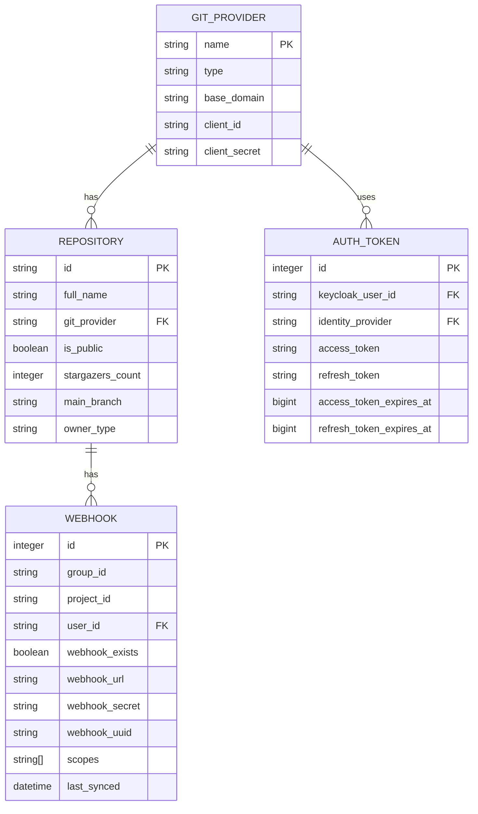
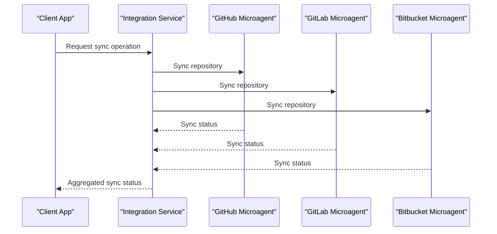

# Version Control Microagents

<cite>
**Referenced Files in This Document**   
- [github.md](file://microagents/github.md)
- [gitlab.md](file://microagents/gitlab.md)
- [bitbucket.md](file://microagents/bitbucket.md)
- [github_service.py](file://enterprise/integrations/github/github_service.py)
- [gitlab_manager.py](file://enterprise/integrations/gitlab/gitlab_manager.py)
- [bitbucket_service.py](file://enterprise/integrations/bitbucket/bitbucket_service.py)
- [github_callback_processor.py](file://enterprise/server/conversation_callback_processor/github_callback_processor.py)
- [gitlab_callback_processor.py](file://enterprise/server/conversation_callback_processor/gitlab_callback_processor.py)
- [gitlab_webhook.py](file://enterprise/storage/gitlab_webhook.py)
- [gitlab_webhook_store.py](file://enterprise/storage/gitlab_webhook_store.py)
- [service_types.py](file://openhands/integrations/service_types.py)
- [auth_tokens.py](file://enterprise/storage/auth_tokens.py)
- [auth_token_store.py](file://enterprise/storage/auth_token_store.py)
</cite>

## Table of Contents
1. [Introduction](#introduction)
2. [Architecture Overview](#architecture-overview)
3. [Core Components](#core-components)
4. [API Integration Patterns](#api-integration-patterns)
5. [Authentication Mechanisms](#authentication-mechanisms)
6. [Event Handling Capabilities](#event-handling-capabilities)
7. [Domain Model](#domain-model)
8. [Cross-Platform Synchronization](#cross-platform-synchronization)
9. [Common Issues and Solutions](#common-issues-and-solutions)
10. [Conclusion](#conclusion)

## Introduction

Version Control Microagents are specialized components within the OpenHands system that enable seamless integration with popular version control platforms including GitHub, GitLab, and Bitbucket. These microagents serve as intelligent intermediaries between the main agent system and external version control systems, facilitating automated workflows, repository management, and collaborative development processes.

The microagent system is designed to provide developers with enhanced automation capabilities while maintaining platform-specific nuances and requirements. Each microagent is tailored to its respective platform, implementing specific API integration patterns, authentication mechanisms, and event handling capabilities that align with the unique characteristics of GitHub, GitLab, and Bitbucket.

This documentation provides a comprehensive analysis of the microagent implementation, focusing on the technical details that enable cross-platform repository management and workflow automation. The content is structured to be accessible to beginners while providing sufficient technical depth for experienced developers who wish to customize workflows or implement advanced integration scenarios.

## Architecture Overview

The Version Control Microagents architecture follows a modular design pattern with clear separation of concerns between platform-specific implementations and shared functionality. The system is organized into distinct layers that handle authentication, API communication, event processing, and state management.



**Diagram sources**
- [github_service.py](file://enterprise/integrations/github/github_service.py)
- [gitlab_manager.py](file://enterprise/integrations/gitlab/gitlab_manager.py)
- [bitbucket_service.py](file://enterprise/integrations/bitbucket/bitbucket_service.py)
- [auth_token_store.py](file://enterprise/storage/auth_token_store.py)
- [gitlab_webhook_store.py](file://enterprise/storage/gitlab_webhook_store.py)

The architecture demonstrates how the microagents interact with the main agent system through the integration service, which coordinates communication between components. Each microagent maintains its own configuration and state while sharing common authentication and storage infrastructure.

## Core Components

The Version Control Microagents system consists of several core components that work together to provide seamless integration with version control platforms. These components include platform-specific microagents, authentication managers, webhook handlers, and callback processors.

The microagents are implemented as specialized classes that inherit from base service classes while adding platform-specific functionality. Each microagent follows a consistent interface defined by the `GitService` protocol, ensuring uniform behavior across different platforms while allowing for implementation-specific extensions.

The system employs a mixin-based architecture for code reuse, where common functionality is organized into mixins that can be combined to create complete service implementations. This approach allows for flexible composition of features while maintaining separation of concerns.

**Section sources**
- [github_service.py](file://enterprise/integrations/github/github_service.py)
- [gitlab_manager.py](file://enterprise/integrations/gitlab/gitlab_manager.py)
- [bitbucket_service.py](file://enterprise/integrations/bitbucket/bitbucket_service.py)
- [service_types.py](file://openhands/integrations/service_types.py)

## API Integration Patterns

The Version Control Microagents implement platform-specific API integration patterns that leverage the native APIs of GitHub, GitLab, and Bitbucket. Each microagent follows a consistent approach to API communication while adapting to the unique characteristics of its respective platform.

### GitHub Integration

The GitHub microagent uses REST API endpoints with proper authentication headers to interact with GitHub's API. It implements pagination support for retrieving large datasets and handles rate limiting through appropriate error handling and retry mechanisms.



**Diagram sources**
- [github_service.py](file://enterprise/integrations/github/github_service.py)

### GitLab Integration

The GitLab microagent follows GitLab's API conventions, including the use of project IDs and namespace-based routing. It implements batch operations for efficiency and handles GitLab-specific features such as groups and subgroups.



**Diagram sources**
- [gitlab_manager.py](file://enterprise/integrations/gitlab/gitlab_manager.py)

### Bitbucket Integration

The Bitbucket microagent implements Bitbucket's API patterns, including workspace-based organization and repository naming conventions. It handles Bitbucket-specific authentication requirements and API rate limits.



**Diagram sources**
- [bitbucket_service.py](file://enterprise/integrations/bitbucket/bitbucket_service.py)

## Authentication Mechanisms

The Version Control Microagents employ a sophisticated authentication system that securely manages credentials for different version control platforms. The system uses token-based authentication with refresh mechanisms to maintain persistent access while ensuring security.

### Token Management Architecture

The authentication system is built around a token manager that handles the lifecycle of access tokens for different providers. It implements secure storage, retrieval, and refresh operations for GitHub, GitLab, and Bitbucket tokens.



**Diagram sources**
- [auth_token_store.py](file://enterprise/storage/auth_token_store.py)
- [auth_tokens.py](file://enterprise/storage/auth_tokens.py)

### Authentication Flow

The authentication process follows a standardized flow across all microagents, with platform-specific variations for token acquisition and validation.



**Section sources**
- [github_service.py](file://enterprise/integrations/github/github_service.py#L39-L73)
- [gitlab_manager.py](file://enterprise/integrations/gitlab/gitlab_manager.py#L187-L195)
- [bitbucket_service.py](file://enterprise/integrations/bitbucket/bitbucket_service.py#L35-L70)

## Event Handling Capabilities

The Version Control Microagents implement comprehensive event handling capabilities that enable real-time synchronization with version control platforms. The system uses webhook-based event processing to respond to repository changes and user interactions.

### Webhook Processing Architecture

The event handling system is built around a webhook processing pipeline that receives, validates, and processes events from version control platforms.



**Diagram sources**
- [gitlab_webhook.py](file://enterprise/storage/gitlab_webhook.py)
- [gitlab_webhook_store.py](file://enterprise/storage/gitlab_webhook_store.py)
- [gitlab_callback_processor.py](file://enterprise/server/conversation_callback_processor/gitlab_callback_processor.py)

### Event Processing Flow

The event processing flow follows a standardized pattern across all microagents, with platform-specific variations for event validation and processing.



**Section sources**
- [github_callback_processor.py](file://enterprise/server/conversation_callback_processor/github_callback_processor.py)
- [gitlab_callback_processor.py](file://enterprise/server/conversation_callback_processor/gitlab_callback_processor.py)

## Domain Model

The Version Control Microagents system implements a comprehensive domain model that represents the key entities and relationships involved in version control integration. The model includes configuration parameters, repository metadata, and synchronization rules.

### Configuration Parameters

The domain model includes several key configuration parameters that control the behavior of the microagents:

- **Webhook Endpoints**: URLs where version control platforms send event notifications
- **Repository Permissions**: Access levels required for different operations
- **Merge Strategy Rules**: Configuration for handling merge conflicts and pull request workflows



**Diagram sources**
- [service_types.py](file://openhands/integrations/service_types.py)
- [gitlab_webhook.py](file://enterprise/storage/gitlab_webhook.py)
- [auth_tokens.py](file://enterprise/storage/auth_tokens.py)

### Microagent Configuration

The microagents are configured through markdown files that define their behavior and triggers. These configuration files follow a standardized format with platform-specific variations.

```yaml
---
name: github
type: knowledge
version: 1.0.0
agent: CodeActAgent
triggers:
- github
- git
---
```

The configuration includes environment variables for API access, instructions for repository operations, and guidelines for pull request management. Each microagent has its own configuration file that specifies platform-specific requirements and best practices.

**Section sources**
- [github.md](file://microagents/github.md)
- [gitlab.md](file://microagents/gitlab.md)
- [bitbucket.md](file://microagents/bitbucket.md)

## Cross-Platform Synchronization

The Version Control Microagents system implements robust synchronization capabilities that enable consistent behavior across different version control platforms. The system handles platform-specific differences while providing a unified interface for repository management.

### Synchronization Patterns

The synchronization system follows several key patterns to ensure consistency across platforms:

1. **Unified API Interface**: A common interface for all microagents that abstracts platform-specific differences
2. **Event-Driven Updates**: Real-time synchronization through webhook events
3. **Periodic Polling**: Fallback mechanism for platforms with limited webhook capabilities
4. **Conflict Resolution**: Strategies for handling merge conflicts and concurrent modifications



**Section sources**
- [github_service.py](file://enterprise/integrations/github/github_service.py)
- [gitlab_manager.py](file://enterprise/integrations/gitlab/gitlab_manager.py)
- [bitbucket_service.py](file://enterprise/integrations/bitbucket/bitbucket_service.py)

## Common Issues and Solutions

The Version Control Microagents system addresses several common challenges in cross-platform repository management, particularly around API rate limiting and synchronization consistency.

### API Rate Limiting

API rate limiting is a common issue when integrating with version control platforms. The system implements several strategies to handle rate limits effectively:

- **Rate Limit Detection**: Monitoring API responses for rate limit headers and error codes
- **Exponential Backoff**: Implementing exponential backoff for retry attempts
- **Request Batching**: Combining multiple operations into single API calls when possible
- **Caching**: Caching responses to reduce redundant API calls

The system also implements proactive rate limit management by tracking usage patterns and adjusting request frequency accordingly.

### Synchronization Challenges

Maintaining synchronization across multiple platforms presents several challenges:

- **Event Ordering**: Ensuring events are processed in the correct order
- **Conflict Resolution**: Handling concurrent modifications from different platforms
- **Data Consistency**: Maintaining consistent state across platforms
- **Error Recovery**: Recovering from failed synchronization attempts

The system addresses these challenges through transactional operations, idempotent processing, and comprehensive error handling.

**Section sources**
- [github_service.py](file://enterprise/integrations/github/github_service.py)
- [gitlab_manager.py](file://enterprise/integrations/gitlab/gitlab_manager.py)
- [bitbucket_service.py](file://enterprise/integrations/bitbucket/bitbucket_service.py)

## Conclusion

The Version Control Microagents system provides a robust and flexible framework for integrating with GitHub, GitLab, and Bitbucket. By implementing platform-specific API integration patterns, secure authentication mechanisms, and comprehensive event handling capabilities, the system enables seamless cross-platform repository management and workflow automation.

The architecture demonstrates a thoughtful balance between platform-specific optimizations and unified interface design, making it accessible to beginners while providing sufficient technical depth for experienced developers. The system's modular design allows for easy customization and extension, enabling developers to implement advanced integration scenarios and tailor workflows to their specific needs.

Through careful attention to common issues such as API rate limiting and synchronization consistency, the microagents provide a reliable foundation for automated development workflows. The comprehensive domain model and configuration system ensure that the microagents can adapt to different organizational requirements and development practices.