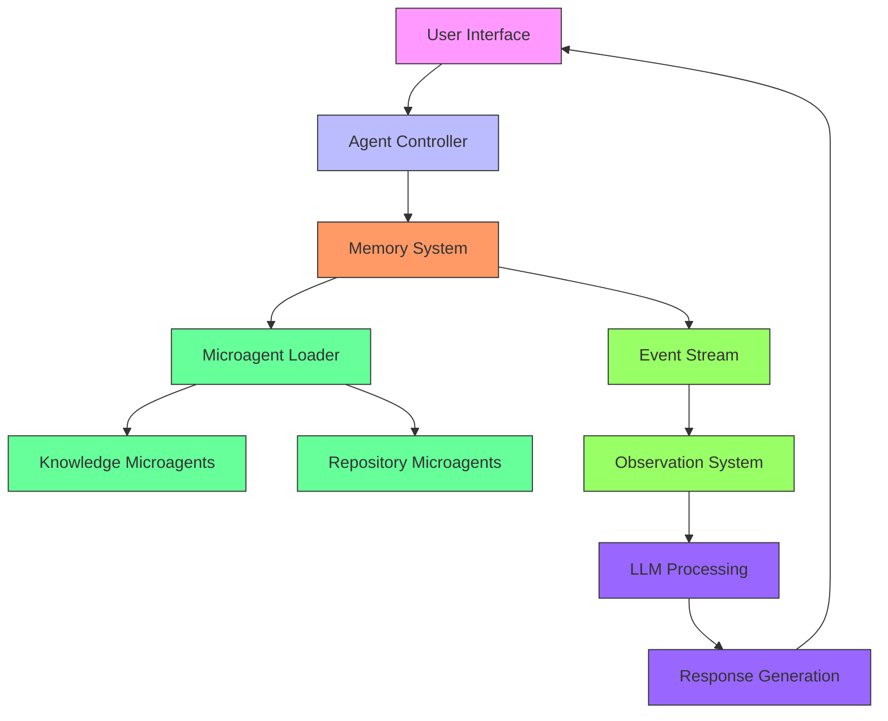
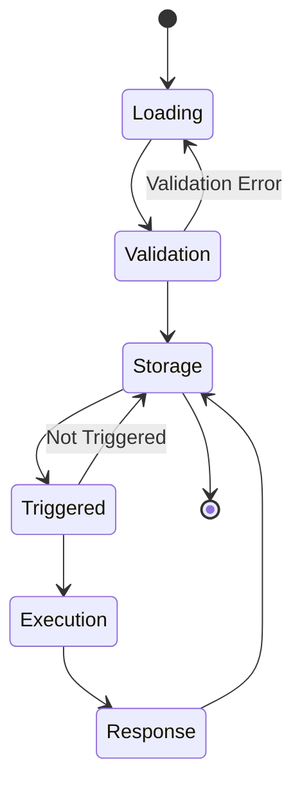
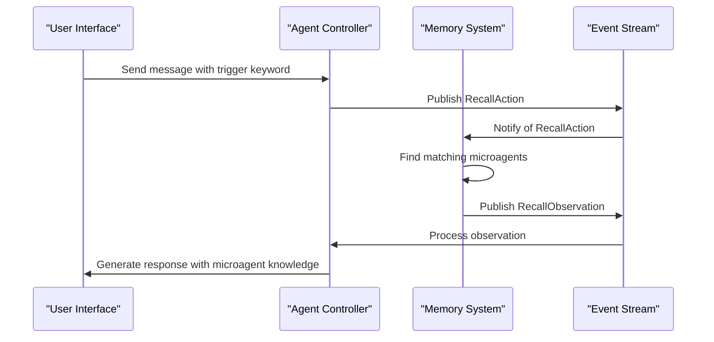
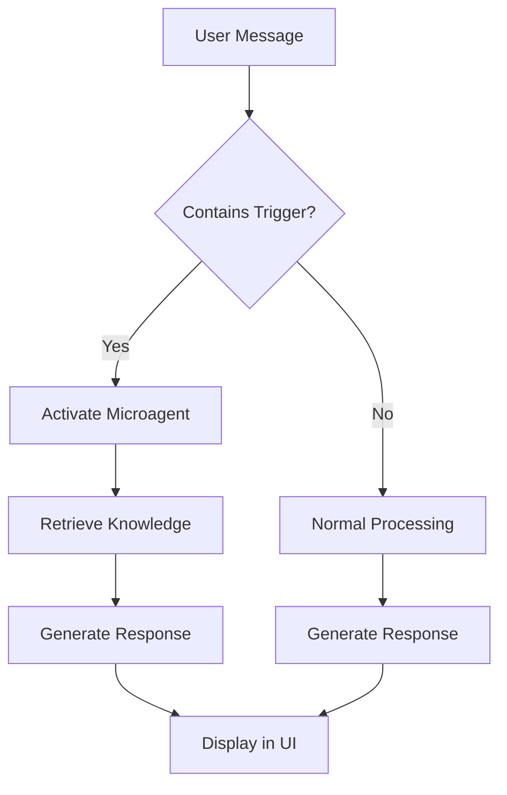
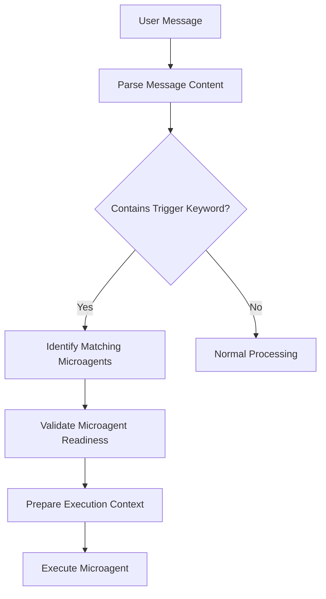
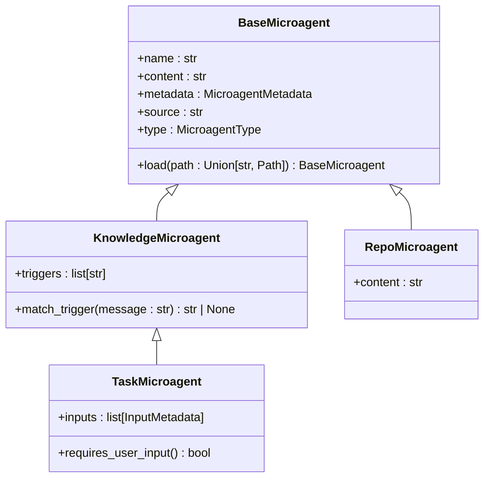

# Microagents System

<cite>
**Referenced Files in This Document**   
- [microagents/README.md](file://microagents/README.md)
- [microagents/code-review.md](file://microagents/code-review.md)
- [openhands/microagent/microagent.py](file://openhands/microagent/microagent.py)
- [openhands/microagent/types.py](file://openhands/microagent/types.py)
- [openhands/memory/memory.py](file://openhands/memory/memory.py)
- [openhands/events/observation/agent.py](file://openhands/events/observation/agent.py)
- [frontend/src/types/microagent-status.ts](file://frontend/src/types/microagent-status.ts)
</cite>

## Table of Contents
1. [Introduction](#introduction)
2. [Architecture Overview](#architecture-overview)
3. [Microagent Types and Lifecycle](#microagent-types-and-lifecycle)
4. [Trigger Conditions and Execution Context](#trigger-conditions-and-execution-context)
5. [Component Interactions](#component-interactions)
6. [Infrastructure Requirements and Deployment Topology](#infrastructure-requirements-and-deployment-topology)
7. [System Context and Workflow](#system-context-and-workflow)
8. [Cross-Cutting Concerns](#cross-cutting-concerns)
9. [Technology Stack](#technology-stack)
10. [Conclusion](#conclusion)

## Introduction

The Microagents System is a specialized component within the OpenHands framework designed to enhance developer productivity through domain-specific knowledge and task automation. Microagents are specialized prompts that provide expert guidance, automate common tasks, and ensure consistent practices across projects. They are designed to excel in specific areas such as Git operations, code review processes, and testing practices.

Microagents operate as modular, reusable components that can be triggered by specific keywords or commands in conversations. They provide actionable feedback and guidance without modifying code directly. The system supports two primary types of microagents: Knowledge Agents that provide specialized expertise triggered by keywords, and Repository Agents that contain repository-specific guidelines automatically loaded when working with a particular repository.

This documentation provides a comprehensive architectural overview of the Microagents System, detailing its design patterns, component interactions, infrastructure requirements, and operational workflows.

**Section sources**
- [microagents/README.md](file://microagents/README.md#L3-L138)

## Architecture Overview

The Microagents System follows a modular architecture with clear separation of concerns between microagent definition, loading, triggering, and execution. The system is designed to be extensible, allowing for the addition of new microagents without modifying the core framework.



**Diagram sources**
- [openhands/microagent/microagent.py](file://openhands/microagent/microagent.py#L1-L342)
- [openhands/memory/memory.py](file://openhands/memory/memory.py#L1-L388)

## Microagent Types and Lifecycle

The Microagents System supports three distinct types of microagents, each with specific characteristics and use cases. The lifecycle of a microagent involves loading, validation, storage, and eventual execution when triggered by appropriate conditions.

### Knowledge Agents

Knowledge Agents provide specialized expertise that is triggered by keywords in conversations. These agents help with language best practices, framework guidelines, common patterns, and tool usage. They are context-aware and can be applied across multiple projects.

Key characteristics:
- **Trigger-based**: Activated by specific keywords in conversations
- **Context-aware**: Provide relevant advice based on file types and content
- **Reusable**: Knowledge can be applied across multiple projects
- **Versioned**: Support multiple versions of tools and frameworks

### Repository Agents

Repository Agents provide repository-specific knowledge and guidelines. These agents are loaded from `.openhands/microagents/repo.md` files within repositories and contain private, repository-specific instructions that are automatically loaded when working with that repository.

Key features:
- **Project-specific**: Contains guidelines unique to the repository
- **Team-focused**: Enforces team conventions and practices
- **Always active**: Automatically loaded for the repository
- **Locally maintained**: Updated with the project

### Task Microagents

Task Microagents are a special type of Knowledge Agent that requires user input before execution. These microagents are triggered by a special format (`/{agent_name}`) and will prompt the user for any required inputs before proceeding with the task.

The lifecycle of a microagent includes:
1. **Loading**: Microagents are loaded from designated directories
2. **Validation**: Metadata is validated and type is inferred
3. **Storage**: Loaded microagents are stored in memory
4. **Execution**: Triggered when appropriate conditions are met
5. **Response**: Feedback is provided to the user interface



**Diagram sources**
- [openhands/microagent/types.py](file://openhands/microagent/types.py#L1-L60)
- [openhands/microagent/microagent.py](file://openhands/microagent/microagent.py#L174-L276)

**Section sources**
- [microagents/README.md](file://microagents/README.md#L50-L85)
- [openhands/microagent/types.py](file://openhands/microagent/types.py#L11-L17)

## Trigger Conditions and Execution Context

Microagents are activated based on specific trigger conditions that determine when and how they execute. The triggering mechanism is designed to be flexible and context-aware, allowing microagents to respond appropriately to user interactions.

### Trigger Mechanisms

Knowledge Agents are triggered by specific keywords in user or agent messages. The system performs a case-insensitive search for trigger words within the message content. When a match is found, the corresponding microagent is activated and its knowledge is incorporated into the response.

```python
def match_trigger(self, message: str) -> str | None:
    """Match a trigger in the message.
    
    It returns the first trigger that matches the message.
    """
    message = message.lower()
    for trigger in self.triggers:
        if trigger.lower() in message:
            return trigger
    return None
```

Task Microagents are triggered by a special command format: `/{agent_name}`. This explicit invocation pattern allows users to directly request specific microagent functionality.

### Execution Context

Microagents execute within the context of the current conversation and repository state. The execution context includes:

- **Repository information**: Name, directory path, and branch
- **Runtime environment**: Available hosts and configuration
- **Conversation history**: Previous interactions and decisions
- **User preferences**: Custom settings and configurations

The system ensures that microagents have access to relevant context information while maintaining isolation between different microagent executions. This context-aware execution enables microagents to provide targeted, relevant feedback based on the current development environment and task requirements.

**Section sources**
- [openhands/microagent/microagent.py](file://openhands/microagent/microagent.py#L189-L199)
- [openhands/memory/memory.py](file://openhands/memory/memory.py#L114-L132)

## Component Interactions

The Microagents System interacts with several core components of the OpenHands framework, creating a cohesive ecosystem for intelligent development assistance. These interactions enable seamless integration between microagents, the main agent system, and the user interface.

### Memory System Integration

The Memory system plays a crucial role in microagent operation, serving as the central hub for microagent storage and retrieval. When a RecallAction is detected in the event stream, the Memory system processes it and publishes the appropriate observations.



**Diagram sources**
- [openhands/memory/memory.py](file://openhands/memory/memory.py#L86-L137)
- [openhands/events/observation/agent.py](file://openhands/events/observation/agent.py#L62-L139)

### Event Stream Communication

Microagents communicate through the Event Stream system, which provides a publish-subscribe mechanism for asynchronous communication. When a microagent is triggered, it generates a RecallObservation containing the microagent knowledge, which is then processed by the agent controller.

The event flow follows this pattern:
1. User sends a message containing a trigger keyword
2. Agent Controller creates a RecallAction and publishes it to the Event Stream
3. Memory System receives the RecallAction and identifies matching microagents
4. Memory System creates a RecallObservation with the microagent knowledge
5. RecallObservation is published to the Event Stream
6. Agent Controller processes the observation and generates a response

### User Interface Integration

The user interface provides several components for interacting with microagents, including status indicators, trigger displays, and management interfaces. The frontend components track microagent status and provide visual feedback to users.

Key UI components:
- **Microagent Status Indicator**: Shows the current status of microagent execution
- **Trigger Display**: Lists available triggers for each microagent
- **Management Interface**: Allows users to view and manage microagents



**Diagram sources**
- [frontend/src/types/microagent-status.ts](file://frontend/src/types/microagent-status.ts#L1-L13)
- [openhands/events/observation/agent.py](file://openhands/events/observation/agent.py#L48-L60)

**Section sources**
- [openhands/memory/memory.py](file://openhands/memory/memory.py#L86-L137)
- [frontend/src/components/features/chat/event-message-components/microagent-status-wrapper.tsx](file://frontend/src/components/features/chat/event-message-components/microagent-status-wrapper.tsx#L1-L33)

## Infrastructure Requirements and Deployment Topology

The Microagents System has specific infrastructure requirements to ensure reliable operation and optimal performance. The deployment topology is designed to support both local development and enterprise-scale deployments.

### Resource Requirements

The system requires the following resources:
- **Storage**: Persistent storage for microagent definitions and user configurations
- **Memory**: Sufficient RAM to store loaded microagents and conversation context
- **Processing**: Adequate CPU resources for real-time trigger detection and response generation
- **Network**: Connectivity for remote repository access and API integrations

### Deployment Topology

The Microagents System can be deployed in several configurations:

#### Local Development Environment
In a local development setup, microagents are stored in the user's home directory (`~/.openhands/microagents/`) and loaded when the OpenHands application starts. This configuration is ideal for individual developers who want to customize their microagent experience.

#### Enterprise Deployment
In enterprise environments, microagents can be deployed through a centralized server that manages microagent distribution and updates. The enterprise server can enforce organizational standards and provide curated microagent collections.

#### Repository-Scoped Deployment
Microagents can also be deployed at the repository level, with repository-specific agents stored in `.openhands/microagents/repo.md`. This approach ensures that team-specific guidelines and practices are automatically available when working with a particular repository.

### Scalability Considerations

The system is designed with scalability in mind:
- **Horizontal Scaling**: Multiple instances can be deployed behind a load balancer
- **Caching**: Frequently used microagents can be cached to reduce load times
- **Modular Design**: New microagents can be added without affecting existing functionality
- **Asynchronous Processing**: Non-critical operations are handled asynchronously to maintain responsiveness

**Section sources**
- [openhands/memory/memory.py](file://openhands/memory/memory.py#L33-L38)
- [microagents/README.md](file://microagents/README.md#L28-L41)

## System Context and Workflow

The Microagents System operates within a comprehensive workflow that spans from detection to execution and reporting. This workflow ensures that microagents provide timely, relevant assistance throughout the development process.

### Detection Phase

The detection phase begins when a user sends a message to the agent system. The system analyzes the message content for trigger keywords associated with available microagents.



**Diagram sources**
- [openhands/microagent/microagent.py](file://openhands/microagent/microagent.py#L189-L199)
- [openhands/memory/memory.py](file://openhands/memory/memory.py#L114-L132)

### Execution Phase

During the execution phase, the identified microagents are activated and their knowledge is incorporated into the response generation process. The system retrieves the microagent content and formats it according to the specified response structure.

For Task Microagents, the execution phase includes an additional step of collecting user input before proceeding with the task. The system prompts the user for any required variables and validates the input before continuing.

### Reporting Phase

The reporting phase delivers the microagent's feedback to the user through the interface. The response follows a structured format that includes line numbers, issue explanations, and concrete improvement suggestions.

The system also tracks microagent status through a state machine with the following states:
- **WAITING**: Microagent is queued for execution
- **CREATING**: Microagent is being initialized
- **COMPLETED**: Microagent has finished execution
- **ERROR**: An error occurred during execution

This status information is displayed in the user interface, providing transparency into the microagent's operation.

**Section sources**
- [microagents/code-review.md](file://microagents/code-review.md#L1-L55)
- [frontend/src/types/microagent-status.ts](file://frontend/src/types/microagent-status.ts#L1-L6)

## Cross-Cutting Concerns

The Microagents System addresses several cross-cutting concerns to ensure robust, reliable operation in diverse development environments.

### Resource Usage

The system is designed to minimize resource consumption while maintaining responsiveness. Microagents are loaded into memory only when needed, and unused agents can be unloaded to free resources. The system also implements efficient string matching algorithms to quickly identify trigger keywords without excessive CPU usage.

### Conflict Resolution

When multiple microagents are triggered by the same message, the system employs a conflict resolution strategy that prioritizes more specific triggers over general ones. If conflicts cannot be automatically resolved, the system may prompt the user to select the appropriate microagent.

### User Control

Users have extensive control over microagent behavior:
- **Enable/Disable**: Users can enable or disable specific microagents
- **Priority Settings**: Users can set priorities for conflicting microagents
- **Customization**: Users can modify microagent content and triggers
- **Repository Overrides**: Repository-specific agents take precedence over global agents

The system also provides a management interface where users can view, edit, and organize their microagents, ensuring that users maintain control over the assistance they receive.

**Section sources**
- [microagents/README.md](file://microagents/README.md#L106-L125)
- [frontend/src/state/microagent-management-store.ts](file://frontend/src/state/microagent-management-store.ts#L1-L76)

## Technology Stack

The Microagents System is built on a modern technology stack that enables flexible, extensible functionality.

### Microagent Framework

The core microagent framework is implemented in Python and leverages several key technologies:
- **Pydantic**: For data validation and settings management
- **frontmatter**: For parsing YAML frontmatter in markdown files
- **dataclasses**: For structured data representation
- **asyncio**: For asynchronous event processing

The framework follows object-oriented design principles with a clear class hierarchy:
- **BaseMicroagent**: Abstract base class for all microagents
- **KnowledgeMicroagent**: Specialized class for trigger-based agents
- **RepoMicroagent**: Specialized class for repository-specific agents
- **TaskMicroagent**: Specialized class for input-requiring agents

### Configuration System

Microagents use a flexible configuration system based on YAML frontmatter in markdown files. This allows for rich metadata specification while maintaining human-readable content.

Example configuration:
```yaml
---
triggers:
- /codereview
---
```

The configuration system supports the following metadata fields:
- **name**: Unique identifier for the microagent
- **type**: Agent type (knowledge, repo, or task)
- **version**: Version number for the agent
- **agent**: Default agent to use for execution
- **triggers**: List of trigger keywords
- **inputs**: Required input parameters for task agents

### Supporting Utilities

The system includes several supporting utilities:
- **File Loading**: Robust file loading with error handling
- **Path Resolution**: Intelligent path resolution for nested directories
- **Validation**: Comprehensive validation of microagent metadata
- **Error Handling**: Graceful error handling with detailed messages

These utilities ensure that microagents are loaded reliably and operate consistently across different environments.



**Diagram sources**
- [openhands/microagent/types.py](file://openhands/microagent/types.py#L11-L37)
- [openhands/microagent/microagent.py](file://openhands/microagent/microagent.py#L17-L276)

**Section sources**
- [openhands/microagent/types.py](file://openhands/microagent/types.py#L1-L60)
- [openhands/microagent/microagent.py](file://openhands/microagent/microagent.py#L1-L342)

## Conclusion

The Microagents System represents a sophisticated approach to enhancing developer productivity through specialized, context-aware assistance. By providing domain-specific knowledge and automating common tasks, microagents help developers focus on high-value activities while maintaining consistent practices across projects.

The system's modular architecture, flexible triggering mechanism, and seamless integration with the OpenHands framework create a powerful ecosystem for intelligent development assistance. With support for both general knowledge agents and repository-specific guidelines, the system adapts to different development contexts and team requirements.

Future enhancements could include machine learning-based trigger prediction, collaborative microagent development, and enhanced analytics for microagent effectiveness. The extensible design ensures that the system can evolve to meet emerging development challenges while maintaining its core principles of usability, reliability, and user control.