# Docker Execution

<cite>
**Referenced Files in This Document**   
- [Dockerfile](file://containers/app/Dockerfile)
- [build.sh](file://containers/build.sh)
- [docker_runtime.py](file://openhands/runtime/impl/docker/docker_runtime.py)
- [sandbox_config.py](file://openhands/core/config/sandbox_config.py)
- [base.py](file://openhands/runtime/base.py)
</cite>

## Table of Contents
1. [Introduction](#introduction)
2. [Container Image Building Process](#container-image-building-process)
3. [Container Lifecycle Management](#container-lifecycle-management)
4. [Resource Allocation Strategies](#resource-allocation-strategies)
5. [Integration with Core Agent System](#integration-with-core-agent-system)
6. [File System Synchronization](#file-system-synchronization)
7. [Network Configuration](#network-configuration)
8. [Volume Mounting](#volume-mounting)
9. [Security Policies](#security-policies)
10. [Infrastructure Requirements](#infrastructure-requirements)
11. [Scalability Considerations](#scalability-considerations)
12. [Performance Optimization](#performance-optimization)
13. [Configuration Options](#configuration-options)

## Introduction
The Docker Execution backend provides a containerized runtime environment for isolated execution of agent actions within Docker containers. This architecture enables secure, reproducible, and scalable execution of agent tasks by leveraging Docker's containerization technology. The system integrates with the core agent framework to provide a robust execution environment that supports various development and deployment scenarios.

The Docker runtime serves as the default execution environment in OpenHands, offering container isolation for security while maintaining direct access to local system resources. It supports multiple runtime implementations including Docker, Remote, Modal, and Runloop, with Docker being the primary choice for local execution and development.

**Section sources**
- [README.md](file://openhands/runtime/README.md#L1-L162)

## Container Image Building Process
The container image building process in the Docker Execution backend follows a multi-stage approach using Docker's build capabilities. The process begins with the base container image, which by default is `nikolaik/python-nodejs:python3.12-nodejs22`, and builds upon it to create the runtime container image.

The image building process is orchestrated through the `build_runtime_image` function, which takes several parameters including the base container image, runtime builder, platform specification, extra dependencies, and build arguments. The process involves:

1. **Base Image Selection**: The system uses a configurable base container image, with a default value set in the sandbox configuration.
2. **Dependency Installation**: Extra dependencies can be specified through the `runtime_extra_deps` configuration parameter.
3. **Build Caching**: The system implements build caching to optimize subsequent builds, reducing build times significantly.
4. **Multi-platform Support**: The build process supports multiple platforms (linux/amd64, linux/arm64) for cross-platform compatibility.

The build process is managed by the `DockerRuntimeBuilder` class, which implements the `RuntimeBuilder` interface. The builder handles the actual Docker build commands and manages the build context. The `build.sh` script in the containers directory provides a command-line interface for building images with various options including push, load, and tag suffixes.

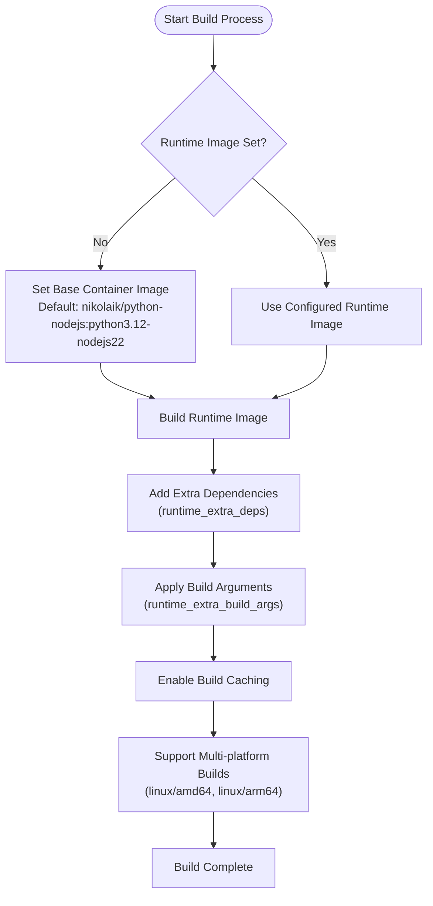

**Diagram sources **
- [docker_runtime.py](file://openhands/runtime/impl/docker/docker_runtime.py#L233-L249)
- [sandbox_config.py](file://openhands/core/config/sandbox_config.py#L120-L123)

**Section sources**
- [docker_runtime.py](file://openhands/runtime/impl/docker/docker_runtime.py#L233-L249)
- [sandbox_config.py](file://openhands/core/config/sandbox_config.py#L120-L123)
- [build.sh](file://containers/build.sh#L1-L183)

## Container Lifecycle Management
Container lifecycle management in the Docker Execution backend is handled through the `DockerRuntime` class, which manages the complete lifecycle of Docker containers from creation to destruction. The lifecycle management process includes container initialization, starting, pausing, resuming, and cleanup.

The container lifecycle begins with the `connect` method, which either attaches to an existing container or creates a new one. When creating a new container, the process involves:

1. **Container Initialization**: The `init_container` method prepares the container configuration including port mappings, environment variables, and volume mounts.
2. **Container Creation**: The Docker client creates the container with the specified configuration.
3. **Container Starting**: The container is started and the system waits for it to become ready.
4. **Environment Setup**: Initial environment variables and plugins are configured.

The system provides methods for pausing and resuming containers. The `pause` method stops the container while preserving its state, and the `resume` method starts the container again. This allows for efficient resource management when containers are not actively being used.

Container cleanup is handled by the `close` method, which removes containers based on the `keep_runtime_alive` and `rm_all_containers` configuration parameters. When `keep_runtime_alive` is false, containers are removed when the runtime is closed, ensuring resource cleanup.

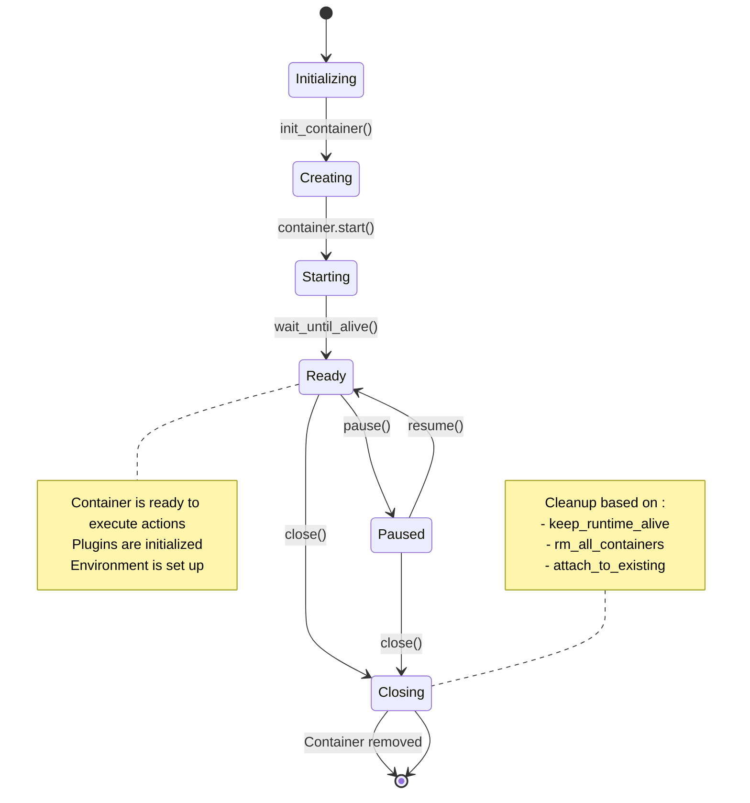

**Diagram sources **
- [docker_runtime.py](file://openhands/runtime/impl/docker/docker_runtime.py#L170-L215)
- [docker_runtime.py](file://openhands/runtime/impl/docker/docker_runtime.py#L593-L613)

**Section sources**
- [docker_runtime.py](file://openhands/runtime/impl/docker/docker_runtime.py#L170-L215)
- [docker_runtime.py](file://openhands/runtime/impl/docker/docker_runtime.py#L593-L613)

## Resource Allocation Strategies
The Docker Execution backend implements comprehensive resource allocation strategies to manage CPU, memory, and network resources for containers. These strategies ensure efficient resource utilization while preventing resource exhaustion.

The system allocates resources through Docker's native resource constraints, which are configured through the `docker_runtime_kwargs` parameter in the sandbox configuration. Key resource allocation parameters include:

- **CPU Constraints**: Configured through `cpu_period` and `cpu_quota` parameters, allowing precise control over CPU time allocation.
- **Memory Limits**: Configured through `mem_limit` and `memswap_limit` parameters, preventing containers from consuming excessive memory.
- **Port Allocation**: The system uses predefined port ranges for different services:
  - Execution server: 30000-39999
  - VSCode: 40000-49999
  - Application ports: 50000-59999

The resource allocation process includes port conflict prevention through file-based locking mechanisms. The `_find_available_port_with_lock` method ensures that multiple workers cannot allocate the same port simultaneously, preventing port conflicts in concurrent environments.

For GPU resources, the system supports GPU acceleration through the `enable_gpu` configuration parameter. When enabled, the runtime requests GPU devices from Docker, allowing containers to access GPU resources for compute-intensive tasks.

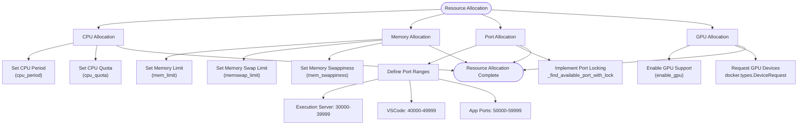

**Diagram sources **
- [docker_runtime.py](file://openhands/runtime/impl/docker/docker_runtime.py#L45-L55)
- [docker_runtime.py](file://openhands/runtime/impl/docker/docker_runtime.py#L643-L688)
- [test_runtime_resource.py](file://tests/runtime/test_runtime_resource.py#L41-L115)

**Section sources**
- [docker_runtime.py](file://openhands/runtime/impl/docker/docker_runtime.py#L45-L55)
- [docker_runtime.py](file://openhands/runtime/impl/docker/docker_runtime.py#L643-L688)
- [test_runtime_resource.py](file://tests/runtime/test_runtime_resource.py#L41-L115)

## Integration with Core Agent System
The Docker Execution backend integrates seamlessly with the core agent system through a well-defined interface and event-driven architecture. The integration enables the agent to execute actions within the isolated container environment while maintaining communication with the core system.

The integration is facilitated by the `Runtime` class, which serves as the primary interface between the agent and the external environment. This class handles various operations including bash command execution, browser interactions, filesystem operations, and environment variable management.

Key integration points include:

1. **Event Stream Subscription**: The runtime subscribes to the event stream to receive actions from the agent. When an action is received, it is forwarded to the action execution server running inside the container.
2. **Action Execution**: Different types of actions are executed through specific methods:
   - Bash commands using the `run` method
   - IPython cells using the `run_ipython` method
   - File operations using `read` and `write` methods
   - Web browsing using `browse` and `browse_interactive` methods
3. **Observation Generation**: After action execution, observations are generated and added to the event stream for the agent to process.
4. **Plugin Integration**: Plugins like Jupyter and AgentSkills are initialized and integrated into the runtime environment.

The integration also supports environment variable management, allowing dynamic addition of environment variables to both IPython and Bash environments. This enables the agent to configure the execution environment as needed for different tasks.

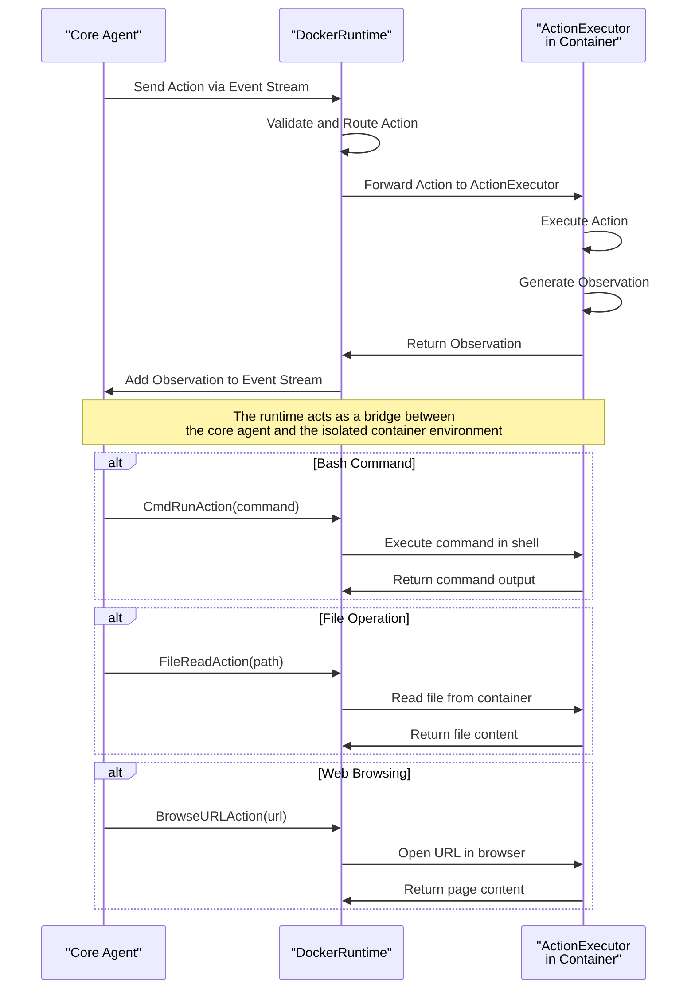

**Diagram sources **
- [base.py](file://openhands/runtime/base.py#L321-L408)
- [docker_runtime.py](file://openhands/runtime/impl/docker/docker_runtime.py#L75-L86)

**Section sources**
- [base.py](file://openhands/runtime/base.py#L321-L408)
- [docker_runtime.py](file://openhands/runtime/impl/docker/docker_runtime.py#L75-L86)

## File System Synchronization
File system synchronization between the host and container is a critical aspect of the Docker Execution backend, enabling seamless data exchange between the host system and the isolated container environment. The system implements robust file synchronization through Docker volume mounting and file operations.

The primary mechanism for file system synchronization is volume mounting, configured through the `sandbox.volumes` parameter. This parameter accepts a comma-delimited list of mount specifications in the format `host_path:container_path:mode`, where mode can be `rw` (read-write) or `ro` (read-only).

The file synchronization process includes:

1. **Volume Processing**: The `_process_volumes` method parses the volume specifications and creates a dictionary mapping host paths to container bind mounts with their modes.
2. **Legacy Mounting**: For backward compatibility, the system supports legacy mounting parameters `workspace_mount_path` and `workspace_mount_path_in_sandbox`.
3. **Overlay Mounts**: The system supports overlay mounts with copy-on-write semantics, allowing multiple containers to share a read-only base layer while maintaining isolated writable layers.

The runtime also provides direct file operations through methods like `read`, `write`, and `list_files`, which interact with the container's file system. These methods enable the agent to read and write files within the container environment.

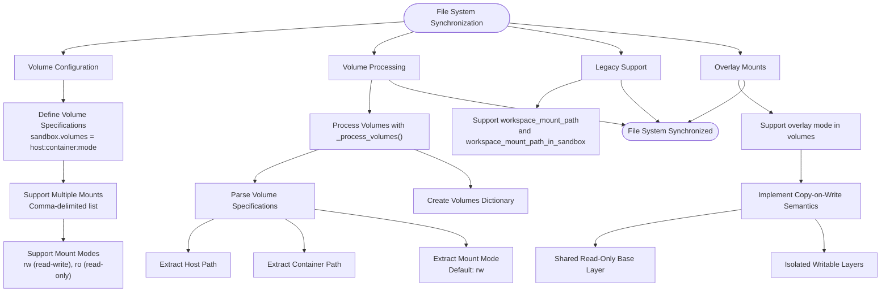

**Diagram sources **
- [docker_runtime.py](file://openhands/runtime/impl/docker/docker_runtime.py#L261-L323)
- [test_docker_runtime.py](file://tests/unit/runtime/impl/test_docker_runtime.py#L80-L173)

**Section sources**
- [docker_runtime.py](file://openhands/runtime/impl/docker/docker_runtime.py#L261-L323)
- [test_docker_runtime.py](file://tests/unit/runtime/impl/test_docker_runtime.py#L80-L173)

## Network Configuration
The network configuration in the Docker Execution backend is designed to provide flexible connectivity options while maintaining security and isolation. The system supports multiple network modes and port mapping strategies to accommodate different deployment scenarios.

Key network configuration features include:

1. **Host Network Mode**: When `use_host_network` is enabled, the container shares the host's network stack, allowing direct access to host services. This mode is useful for development and debugging but should be used with caution in production environments.
2. **Port Mapping**: The system implements port mapping to expose container services to the host. The `init_container` method configures port mappings for:
   - Execution server (default: 30000-39999)
   - VSCode server (default: 40000-49999)
   - Application ports (default: 50000-59999)
3. **Binding Address**: The `runtime_binding_address` parameter specifies which network interface Docker should bind the runtime ports to, allowing control over network accessibility.
4. **Additional Networks**: The `additional_networks` parameter allows connecting containers to additional Docker networks, enabling communication with other services.

The network configuration also includes support for Docker named volumes and overlay networks, providing advanced networking capabilities for complex deployment scenarios.

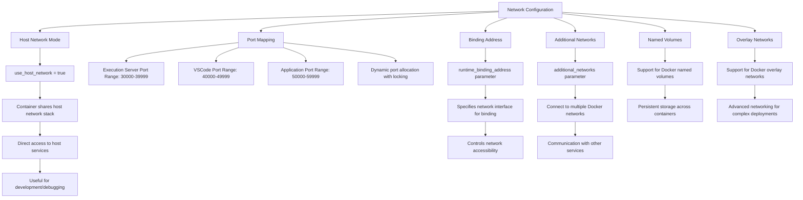

**Diagram sources **
- [docker_runtime.py](file://openhands/runtime/impl/docker/docker_runtime.py#L421-L458)
- [sandbox_config.py](file://openhands/core/config/sandbox_config.py#L22-L25)

**Section sources**
- [docker_runtime.py](file://openhands/runtime/impl/docker/docker_runtime.py#L421-L458)
- [sandbox_config.py](file://openhands/core/config/sandbox_config.py#L22-L25)

## Volume Mounting
Volume mounting in the Docker Execution backend provides a flexible mechanism for sharing data between the host and container environments. The system supports multiple volume mounting strategies to accommodate different use cases and requirements.

The volume mounting system is configured through the `sandbox.volumes` parameter, which accepts a comma-delimited list of mount specifications. Each specification follows the format `host_path:container_path:mode`, where:

- `host_path`: The path on the host system
- `container_path`: The path inside the container
- `mode`: The mount mode (`rw` for read-write, `ro` for read-only)

The system supports several volume mounting features:

1. **Multiple Mounts**: Multiple volume mounts can be specified in a single configuration, separated by commas.
2. **Default Mode**: When no mode is specified, the default mode is `rw` (read-write).
3. **Named Volumes**: The system supports Docker named volumes for persistent storage that persists beyond container lifecycle.
4. **Overlay Mounts**: Special support for overlay mounts with copy-on-write semantics, allowing multiple containers to share a read-only base layer.

The volume mounting process is handled by the `_process_volumes` method, which parses the volume specifications and creates a dictionary mapping host paths to container bind mounts with their modes. This dictionary is then passed to the Docker container creation process.

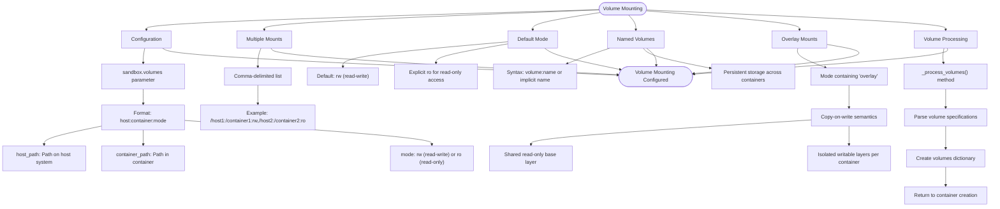

**Diagram sources **
- [docker_runtime.py](file://openhands/runtime/impl/docker/docker_runtime.py#L261-L323)
- [test_docker_runtime.py](file://tests/unit/runtime/impl/test_docker_runtime.py#L103-L154)

**Section sources**
- [docker_runtime.py](file://openhands/runtime/impl/docker/docker_runtime.py#L261-L323)
- [test_docker_runtime.py](file://tests/unit/runtime/impl/test_docker_runtime.py#L103-L154)

## Security Policies
The Docker Execution backend implements comprehensive security policies to ensure safe execution of agent actions within containerized environments. These policies address various security aspects including container isolation, privilege management, and environment hardening.

Key security policies include:

1. **Container Isolation**: The system leverages Docker's containerization technology to provide strong isolation between the host system and the execution environment. Each agent session runs in a separate container with its own filesystem, network, and process space.
2. **User Privileges**: The runtime creates a dedicated user (`openhands`) with a specific user ID (42420) to run processes within the container. This user is added to the sudo group with passwordless sudo access, allowing necessary administrative operations while maintaining separation from the root user.
3. **File System Permissions**: The system sets appropriate file permissions (770) on critical directories to prevent unauthorized access while allowing necessary operations.
4. **Environment Variables**: Sensitive environment variables are managed through the `SANDBOX_ENV_` prefix, allowing controlled exposure of environment variables to the container environment.
5. **Security Analyzer**: The system integrates with security analyzers like Invariant to detect and prevent potentially harmful actions.

The security policies are configured through various parameters in the sandbox configuration, including `enable_gpu`, `cuda_visible_devices`, and `docker_runtime_kwargs`, which allow fine-grained control over container capabilities and resource access.

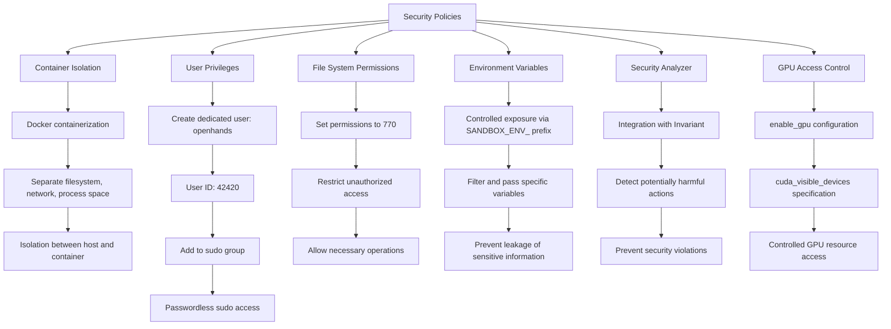

**Diagram sources **
- [Dockerfile](file://containers/app/Dockerfile#L38-L67)
- [docker_runtime.py](file://openhands/runtime/impl/docker/docker_runtime.py#L496-L511)
- [analyzer.py](file://openhands/security/invariant/analyzer.py#L37-L108)

**Section sources**
- [Dockerfile](file://containers/app/Dockerfile#L38-L67)
- [docker_runtime.py](file://openhands/runtime/impl/docker/docker_runtime.py#L496-L511)
- [analyzer.py](file://openhands/security/invariant/analyzer.py#L37-L108)

## Infrastructure Requirements
The Docker Execution backend has specific infrastructure requirements to ensure proper operation and optimal performance. These requirements cover the Docker daemon, image registry, and host system specifications.

### Docker Daemon Requirements
The system requires a properly configured Docker daemon with the following specifications:

1. **Docker Version**: The system is compatible with Docker Engine version 18.09 and later, ensuring access to modern Docker features including BuildKit and multi-platform builds.
2. **Docker Socket Access**: The runtime requires access to the Docker socket (`/var/run/docker.sock`) to manage containers programmatically. This is typically mounted into the container with read-write permissions.
3. **BuildKit Support**: The system leverages BuildKit for efficient image building with advanced caching capabilities.
4. **GPU Support**: For GPU-accelerated workloads, the Docker daemon must be configured with NVIDIA Container Toolkit to enable GPU access within containers.

### Image Registry Requirements
The system interacts with container image registries for pulling base images and pushing custom runtime images:

1. **Registry Authentication**: The system supports authentication with private registries through Docker credentials.
2. **Image Caching**: The build process implements registry-based caching to optimize image builds.
3. **Multi-platform Support**: The registry should support multi-platform images to accommodate different host architectures.

### Host System Requirements
The host system should meet the following specifications:

1. **Operating System**: Linux, macOS, or Windows with WSL2 for optimal compatibility.
2. **Resource Allocation**: Sufficient CPU, memory, and storage resources to support concurrent container execution.
3. **Network Configuration**: Proper network configuration to allow container networking and external connectivity.

```mermaid
graph TD
A[Infrastructure Requirements] --> B[Docker Daemon]
B --> C[Docker Engine >= 18.09]
C --> D[Access to /var/run/docker.sock]
D --> E[BuildKit enabled]
E --> F[NVIDIA Container Toolkit for GPU]
A --> G[Image Registry]
G --> H[Support for private registries]
H --> I[Authentication via Docker credentials]
I --> J[Registry-based caching]
J --> K[Multi-platform image support]
A --> L[Host System]
L --> M[Operating System: Linux, macOS, Windows with WSL2]
M --> N[Resource Allocation: CPU, Memory, Storage]
N --> O[Network Configuration: Container networking]
O --> P[External connectivity]
A --> Q[Development Tools]
Q --> R[Docker Desktop (macOS/Windows)]
R --> S[Docker CLI]
S --> T[Container management tools]
```

**Diagram sources **
- [gui_launcher.py](file://openhands/cli/gui_launcher.py#L135-L136)
- [analyzer.py](file://openhands/security/invariant/analyzer.py#L37-L44)
- [build.sh](file://containers/build.sh#L168-L176)

**Section sources**
- [gui_launcher.py](file://openhands/cli/gui_launcher.py#L135-L136)
- [analyzer.py](file://openhands/security/invariant/analyzer.py#L37-L44)
- [build.sh](file://containers/build.sh#L168-L176)

## Scalability Considerations
The Docker Execution backend incorporates several scalability considerations to support multiple concurrent containers and efficient resource utilization in production environments.

### Concurrent Container Management
The system is designed to handle multiple concurrent containers through:

1. **Session Isolation**: Each agent session runs in a separate container with a unique session ID, ensuring complete isolation between sessions.
2. **Resource Allocation**: The system implements resource constraints (CPU, memory) to prevent any single container from consuming excessive resources.
3. **Port Management**: Dynamic port allocation with file-based locking prevents port conflicts when multiple containers are running simultaneously.

### Container Lifecycle Optimization
The system optimizes container lifecycle management for scalability:

1. **Keep Runtime Alive**: The `keep_runtime_alive` configuration parameter allows containers to persist after use, reducing startup overhead for subsequent tasks.
2. **Container Reuse**: The `attach_to_existing` parameter enables attaching to existing containers, avoiding the cost of container creation.
3. **Batch Operations**: The system supports batch operations for managing multiple containers efficiently.

### Resource Pooling
The architecture supports resource pooling strategies:

1. **Shared Base Images**: Containers share common base images, reducing storage requirements.
2. **Layer Caching**: Docker's layer caching mechanism minimizes image pull times for frequently used images.
3. **Connection Pooling**: The system maintains connections to the Docker daemon to reduce connection overhead.

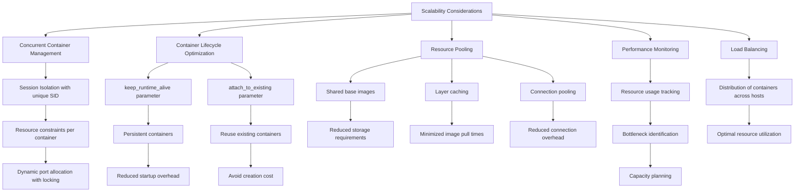

**Diagram sources **
- [docker_runtime.py](file://openhands/runtime/impl/docker/docker_runtime.py#L35-L36)
- [docker_runtime.py](file://openhands/runtime/impl/docker/docker_runtime.py#L593-L613)
- [test_docker_runtime.py](file://tests/unit/runtime/impl/test_docker_runtime.py#L49-L78)

**Section sources**
- [docker_runtime.py](file://openhands/runtime/impl/docker/docker_runtime.py#L35-L36)
- [docker_runtime.py](file://openhands/runtime/impl/docker/docker_runtime.py#L593-L613)
- [test_docker_runtime.py](file://tests/unit/runtime/impl/test_docker_runtime.py#L49-L78)

## Performance Optimization
The Docker Execution backend implements several performance optimization strategies to enhance execution speed and resource efficiency. These optimizations focus on container caching, build optimization, and runtime efficiency.

### Container Caching
The system leverages Docker's caching mechanisms to minimize container creation time:

1. **Layer Caching**: Docker images are built with multiple layers, each of which is cached independently. This allows reuse of unchanged layers across builds.
2. **Registry-based Caching**: The build process uses registry-based caching with `--cache-to` and `--cache-from` parameters to share cache between builds.
3. **Local Caching**: The system maintains a local cache of frequently used images to reduce download times.

### Build Optimization
The image building process is optimized for speed and efficiency:

1. **Multi-stage Builds**: The Dockerfile uses multi-stage builds to separate build dependencies from runtime dependencies, reducing final image size.
2. **Parallel Builds**: The build process supports parallel execution of multiple build steps.
3. **BuildKit Features**: The system leverages BuildKit features like inline caching and distributed caching.

### Runtime Efficiency
The runtime environment is optimized for efficient execution:

1. **Connection Reuse**: The system maintains persistent connections to the Docker daemon to reduce connection overhead.
2. **Asynchronous Operations**: The runtime uses asynchronous programming (asyncio) for non-blocking operations.
3. **Resource Pre-allocation**: Ports and other resources are pre-allocated to reduce runtime overhead.

```mermaid
flowchart TD
Start([Performance Optimization]) --> ContainerCaching["Container Caching"]
ContainerCaching --> LayerCaching["Docker Layer Caching"]
LayerCaching --> IndependentLayers["Independent layer caching"]
LayerCaching --> ReuseUnchanged["Reuse unchanged layers"]
ContainerCaching --> RegistryCaching["Registry-based Caching"]
RegistryCaching --> CacheTo["--cache-to parameter"]
RegistryCaching --> CacheFrom["--cache-from parameter"]
RegistryCaching --> SharedCache["Shared cache between builds"]
ContainerCaching --> LocalCaching["Local Caching"]
LocalCaching --> FrequentImages["Cache frequently used images"]
LocalCaching --> ReducedDownloads["Reduced download times"]
Start --> BuildOptimization["Build Optimization"]
BuildOptimization --> MultiStage["Multi-stage Builds"]
MultiStage --> SeparateDependencies["Separate build and runtime dependencies"]
MultiStage --> ReducedSize["Reduced final image size"]
BuildOptimization --> ParallelBuilds["Parallel Builds"]
ParallelBuilds --> ConcurrentSteps["Concurrent build steps"]
ParallelBuilds --> FasterBuilds["Faster overall build time"]
BuildOptimization --> BuildKit["BuildKit Features"]
BuildKit --> InlineCaching["Inline caching"]
BuildKit --> DistributedCaching["Distributed caching"]
Start --> RuntimeEfficiency["Runtime Efficiency"]
RuntimeEfficiency --> ConnectionReuse["Connection Reuse"]
ConnectionReuse --> PersistentConnections["Persistent Docker connections"]
ConnectionReuse --> ReducedOverhead["Reduced connection overhead"]
RuntimeEfficiency --> AsyncOperations["Asynchronous Operations"]
AsyncOperations --> NonBlocking["Non-blocking operations"]
AsyncOperations --> ImprovedThroughput["Improved throughput"]
RuntimeEfficiency --> ResourcePreallocation["Resource Pre-allocation"]
ResourcePreallocation --> PreallocatedPorts["Pre-allocated ports"]
ResourcePreallocation --> ReducedRuntimeOverhead["Reduced runtime overhead"]
ContainerCaching --> Complete
BuildOptimization --> Complete
RuntimeEfficiency --> Complete
Complete([Performance Optimized])
```

**Diagram sources **
- [build.sh](file://containers/build.sh#L127-L130)
- [Dockerfile](file://containers/app/Dockerfile#L1-L96)
- [docker_runtime.py](file://openhands/runtime/impl/docker/docker_runtime.py#L17-L28)

**Section sources**
- [build.sh](file://containers/build.sh#L127-L130)
- [Dockerfile](file://containers/app/Dockerfile#L1-L96)
- [docker_runtime.py](file://openhands/runtime/impl/docker/docker_runtime.py#L17-L28)

## Configuration Options
The Docker Execution backend provides extensive configuration options to customize container images, resource limits, and environment variables. These options are exposed through the sandbox configuration and can be set via environment variables or configuration files.

### Container Image Configuration
The system allows customization of container images through:

1. **Base Container Image**: The `base_container_image` parameter specifies the base image for the runtime container.
2. **Runtime Container Image**: The `runtime_container_image` parameter specifies the complete runtime image to use.
3. **Extra Dependencies**: The `runtime_extra_deps` parameter allows adding additional dependencies to the runtime image.
4. **Build Arguments**: The `runtime_extra_build_args` parameter enables passing additional arguments to the Docker build process.

### Resource Limit Configuration
Resource limits can be configured through:

1. **CPU Limits**: Configured via `docker_runtime_kwargs` with `cpu_period` and `cpu_quota`.
2. **Memory Limits**: Configured via `docker_runtime_kwargs` with `mem_limit` and `memswap_limit`.
3. **GPU Access**: Enabled via `enable_gpu` and configured via `cuda_visible_devices`.

### Environment Variable Configuration
Environment variables are managed through:

1. **SANDBOX_ENV_ Prefix**: Environment variables prefixed with `SANDBOX_ENV_` are automatically exposed to the container.
2. **Runtime Startup Variables**: The `runtime_startup_env_vars` parameter allows specifying environment variables to set at runtime startup.
3. **Direct Environment Variables**: Environment variables can be passed directly to the container through the configuration.

```mermaid
graph TD
A[Configuration Options] --> B[Container Image Configuration]
B --> C[base_container_image]
C --> D[Default: nikolaik/python-nodejs:python3.12-nodejs22]
B --> E[runtime_container_image]
E --> F[Complete runtime image]
B --> G[runtime_extra_deps]
G --> H[Additional dependencies]
B --> I[runtime_extra_build_args]
I --> J[Additional build arguments]
A --> K[Resource Limit Configuration]
K --> L[docker_runtime_kwargs]
L --> M[cpu_period, cpu_quota]
L --> N[mem_limit, memswap_limit]
L --> O[mem_swappiness, oom_kill_disable]
K --> P[enable_gpu]
P --> Q[Enable GPU access]
K --> R[cuda_visible_devices]
R --> S[Specify GPU devices]
A --> T[Environment Variable Configuration]
T --> U[SANDBOX_ENV_ prefix]
U --> V[Automatic exposure to container]
T --> W[runtime_startup_env_vars]
W --> X[Variables set at startup]
T --> Y[Direct environment variables]
Y --> Z[Passed through configuration]
A --> AA[Network Configuration]
AA --> AB[use_host_network]
AB --> AC[Use host network mode]
AA --> AD[runtime_binding_address]
AD --> AE[Binding address for ports]
AA --> AF[additional_networks]
AF --> AG[Additional Docker networks]
A --> AH[Behavior Configuration]
AH --> AI[keep_runtime_alive]
AI --> AJ[Persist containers after use]
AH --> AK[rm_all_containers]
AK --> AL[Remove all containers on close]
AH --> AM[attach_to_existing]
AM --> AN[Attach to existing containers]
```

**Diagram sources **
- [sandbox_config.py](file://openhands/core/config/sandbox_config.py#L8-L27)
- [docker_runtime.py](file://openhands/runtime/impl/docker/docker_runtime.py#L134-L135)
- [test_env_vars.py](file://tests/runtime/test_env_vars.py#L18-L31)

**Section sources**
- [sandbox_config.py](file://openhands/core/config/sandbox_config.py#L8-L27)
- [docker_runtime.py](file://openhands/runtime/impl/docker/docker_runtime.py#L134-L135)
- [test_env_vars.py](file://tests/runtime/test_env_vars.py#L18-L31)