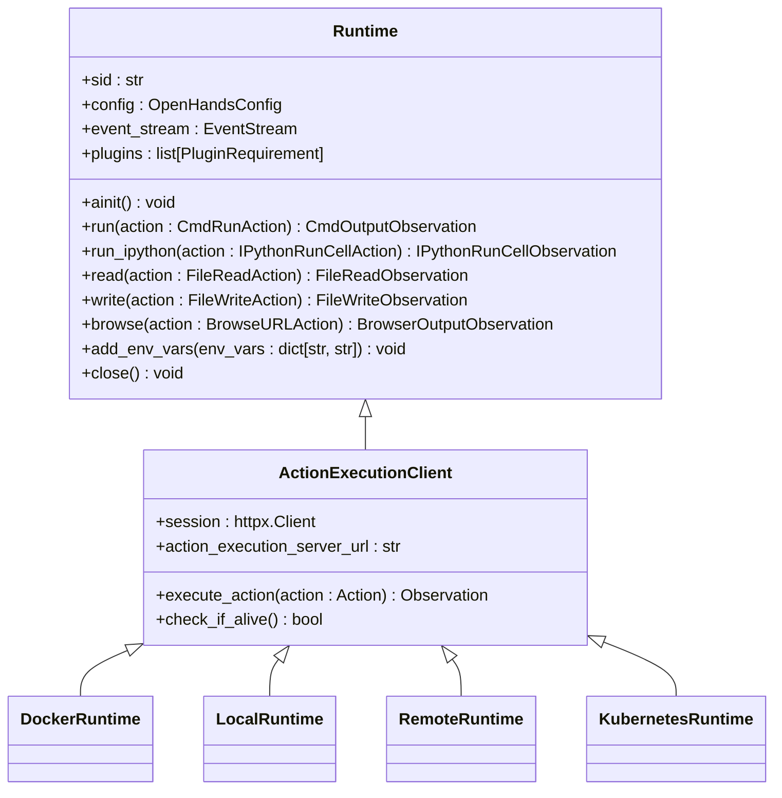
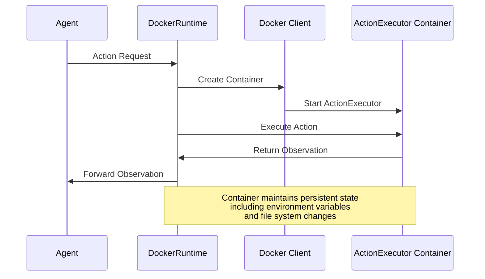
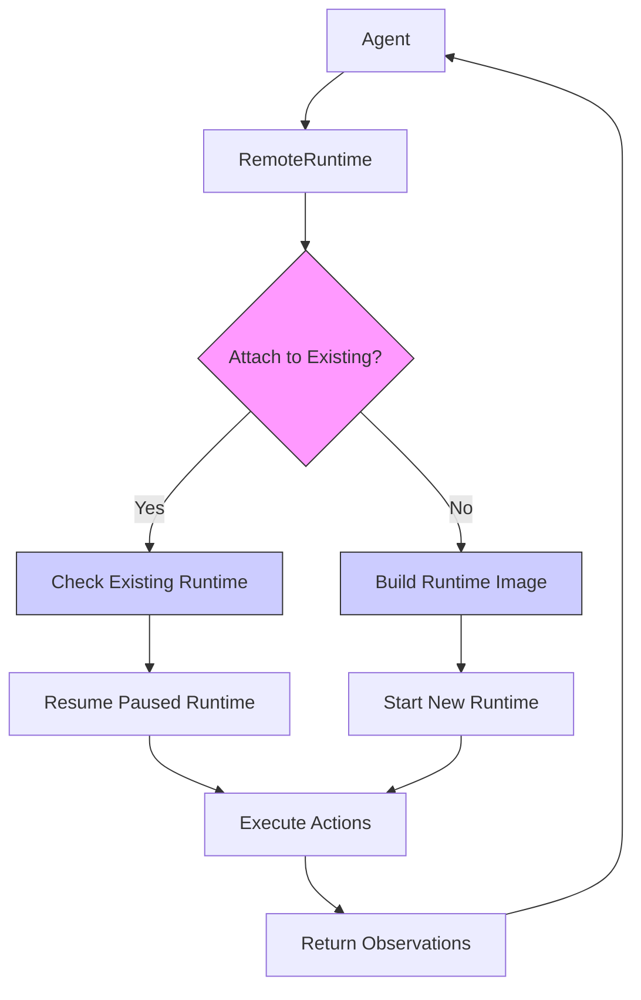
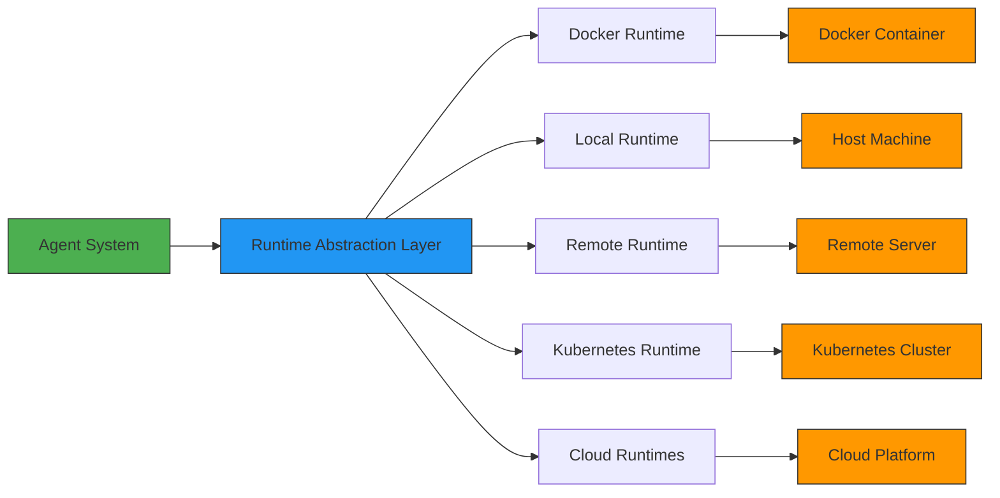

# Execution Backends

<cite>
**Referenced Files in This Document**   
- [openhands/runtime/README.md](file://openhands/runtime/README.md)
- [openhands/runtime/base.py](file://openhands/runtime/base.py)
- [openhands/runtime/impl/docker/docker_runtime.py](file://openhands/runtime/impl/docker/docker_runtime.py)
- [openhands/runtime/impl/local/local_runtime.py](file://openhands/runtime/impl/local/local_runtime.py)
- [openhands/runtime/impl/remote/remote_runtime.py](file://openhands/runtime/impl/remote/remote_runtime.py)
- [openhands/core/config/sandbox_config.py](file://openhands/core/config/sandbox_config.py)
- [third_party/runtime/impl/e2b/__init__.py](file://third_party/runtime/impl/e2b/__init__.py)
- [third_party/runtime/impl/modal/__init__.py](file://third_party/runtime/impl/modal/__init__.py)
- [third_party/runtime/impl/daytona/__init__.py](file://third_party/runtime/impl/daytona/__init__.py)
- [third_party/runtime/impl/runloop/__init__.py](file://third_party/runtime/impl/runloop/__init__.py)
- [kind/cluster.yaml](file://kind/cluster.yaml)
- [kind/manifests/deployment.yaml](file://kind/manifests/deployment.yaml)
</cite>

## Table of Contents
1. [Introduction](#introduction)
2. [Runtime Abstraction Layer](#runtime-abstraction-layer)
3. [Local Execution Backends](#local-execution-backends)
   - [Docker Runtime](#docker-runtime)
   - [Local Runtime](#local-runtime)
4. [Remote Execution Backends](#remote-execution-backends)
   - [Remote Runtime](#remote-runtime)
   - [Kubernetes Runtime](#kubernetes-runtime)
5. [Cloud-Based Execution Backends](#cloud-based-execution-backends)
   - [E2B Runtime](#e2b-runtime)
   - [Modal Runtime](#modal-runtime)
   - [Daytona Runtime](#daytona-runtime)
   - [RunPod Runtime](#runpod-runtime)
6. [Configuration and Initialization](#configuration-and-initialization)
7. [System Context and Data Flow](#system-context-and-data-flow)
8. [Cross-Cutting Concerns](#cross-cutting-concerns)
9. [Conclusion](#conclusion)

## Introduction

The Execution Backends component in OpenHands provides a flexible architecture for executing agent actions across various runtime environments. This documentation details the high-level design of multiple execution backend options including local, Docker, remote, and cloud-based runtimes. The system is designed to support diverse deployment scenarios from local development to scalable cloud deployments, with a focus on security, isolation, and performance.

The architecture follows a runtime abstraction pattern where a common interface allows the core agent system to interact with different execution environments through a consistent API. This enables seamless switching between backends based on requirements for isolation, resource availability, and deployment topology. The design supports both containerized and non-containerized execution, with options for local development, distributed computing, and cloud-based services.

**Section sources**
- [openhands/runtime/README.md](file://openhands/runtime/README.md#L1-L162)

## Runtime Abstraction Layer

The Runtime Abstraction Layer serves as the foundation for OpenHands' execution backend architecture, providing a unified interface for agent interactions with various execution environments. This layer defines the `Runtime` class as the primary interface that handles operations including bash sandbox execution, browser interactions, filesystem operations, environment variable management, and plugin integration.

The abstraction layer implements a plugin architecture that allows for extensibility and customization of runtime capabilities. Key features include asynchronous initialization for setting up environment variables, action execution methods for different action types (run, read, write, browse), and abstract methods for file operations that are implemented by concrete backend classes. The layer also manages security analysis through integration with security analyzers that can be configured based on the deployment environment.

This design enables the core agent system to remain agnostic of the underlying execution environment while providing consistent behavior across different backends. The abstraction handles the lifecycle of actions, routing them to appropriate execution methods and generating observations that are added to the event stream for agent processing.



**Diagram sources**
- [openhands/runtime/base.py](file://openhands/runtime/base.py#L90-L800)
- [openhands/runtime/impl/action_execution/action_execution_client.py](file://openhands/runtime/impl/action_execution/action_execution_client.py)

## Local Execution Backends

### Docker Runtime

The Docker Runtime is the default execution backend in OpenHands, designed for local execution using Docker containers. It creates and manages a Docker container for each session, executing actions within the isolated container environment. This approach provides container isolation for security while supporting direct file system access and local resource management.

Key implementation details include the use of Docker BuildKit for building runtime images with improved performance and caching capabilities. The runtime supports GPU acceleration through NVIDIA Docker with configurable CUDA visible devices. It implements port locking mechanisms to prevent race conditions when allocating ports for execution servers, VSCode integration, and application ports.

The Docker Runtime handles image building through the `DockerRuntimeBuilder` class, which validates Docker server version requirements and manages buildx capabilities. It supports both local image building and pulling from remote registries, with configurable timeout and retry mechanisms. The runtime also implements overlay mounts for read-only lower directories with per-container copy-on-write upper/work layers, enabling efficient resource sharing while maintaining isolation.



**Diagram sources**
- [openhands/runtime/impl/docker/docker_runtime.py](file://openhands/runtime/impl/docker/docker_runtime.py#L75-L765)
- [openhands/runtime/builder/docker.py](file://openhands/runtime/builder/docker.py#L16-L422)

### Local Runtime

The Local Runtime provides direct execution on the host machine without containerization. It runs the action_execution_server directly on the host system, eliminating Docker container overhead for maximum performance. This backend is ideal for development and testing scenarios where Docker is not available or desired.

The implementation creates a server process that listens for action requests and executes them in the local environment. It supports warm server pre-warming to reduce startup latency, where servers are pre-initialized and kept ready for immediate use. The runtime manages server processes through a global dictionary that tracks running servers by session ID, allowing for efficient resource reuse.

A key feature is the support for temporary workspace directories that are automatically cleaned up when sessions end. The runtime also implements dependency checking to ensure required components like Jupyter and libtmux are properly installed before execution. For Windows compatibility, the implementation includes special handling for environment variable management using PowerShell commands.

**Important**: This runtime provides no isolation as it runs directly on the host machine with the same permissions as the user running OpenHands. For secure execution with proper isolation, the Docker Runtime should be used instead.

**Section sources**
- [openhands/runtime/impl/local/local_runtime.py](file://openhands/runtime/impl/local/local_runtime.py#L123-L822)

## Remote Execution Backends

### Remote Runtime

The Remote Runtime enables execution in distributed environments through a custom HTTP API for creating, pausing, resuming, and stopping runtimes. It connects to a remote server running the ActionExecutor, executing actions by sending requests to the remote client. This backend is ideal for production environments, scalability, and scenarios where local resource constraints are a concern.

The implementation uses a builder pattern with `RemoteRuntimeBuilder` to manage remote runtime lifecycle operations. It supports building runtime images on remote servers and starting containers with configurable resource allocation. The runtime implements sophisticated retry mechanisms with exponential backoff for handling network errors and temporary unavailability, ensuring robust operation in distributed environments.

Key features include support for different runtime classes (gVisor for enhanced security isolation or sysbox for Docker-in-Docker capabilities), configurable resource scaling factors (1x, 2x, 4x, 8x), and session persistence with pause/resume functionality. The runtime also handles authentication through API keys and session tokens, providing secure access to remote execution environments.



**Diagram sources**
- [openhands/runtime/impl/remote/remote_runtime.py](file://openhands/runtime/impl/remote/remote_runtime.py#L39-L615)

### Kubernetes Runtime

The Kubernetes Runtime provides container orchestration capabilities using Kubernetes clusters, with support for KIND (Kubernetes IN Docker) for local development. It enables scalable, resilient execution environments with advanced resource management, networking, and storage capabilities.

The implementation leverages Kubernetes manifests for deploying infrastructure components including development pods, ingress controllers, and RBAC configurations. It supports extensive configuration options for Kubernetes deployments, including namespace specification, persistent volume configuration, ingress and networking settings, runtime Pod Security settings, and resource limits and requests.

For local development, the runtime integrates with KIND to create local Kubernetes clusters with pre-configured networking and port mappings. The deployment includes an Ubuntu development pod for runtime execution, Nginx ingress controller for HTTP routing, and RBAC configurations for proper permissions. The setup also incorporates mirrord for development workflow enhancement.

Key infrastructure requirements include Kubernetes cluster access, proper RBAC permissions, and container registry access for runtime images. The deployment topology supports horizontal scaling of runtime pods based on workload demands, with load balancing and service discovery capabilities provided by Kubernetes.

```mermaid
graph TB
subgraph "Kubernetes Cluster"
subgraph "Control Plane"
API[API Server]
ETCD[etcd]
Scheduler[Kube Scheduler]
Controller[Kube Controller Manager]
end
subgraph "Worker Nodes"
Node1[Worker Node 1]
Node2[Worker Node 2]
Node3[Worker Node 3]
end
subgraph "Runtime Pods"
Pod1[Runtime Pod 1]
Pod2[Runtime Pod 2]
Pod3[Runtime Pod 3]
end
API < --> ETCD
API < --> Scheduler
API < --> Controller
API < --> Node1
API < --> Node2
API < --> Node3
Node1 < --> Pod1
Node2 < --> Pod2
Node3 < --> Pod3
end
User[User] --> Ingress[Nginx Ingress]
Ingress --> API
API --> Pod1
API --> Pod2
API --> Pod3
style Pod1 fill:#f96,stroke:#333
style Pod2 fill:#f96,stroke:#333
style Pod3 fill:#f96,stroke:#333
```

**Diagram sources**
- [kind/cluster.yaml](file://kind/cluster.yaml#L1-L9)
- [kind/manifests/deployment.yaml](file://kind/manifests/deployment.yaml#L1-L19)

## Cloud-Based Execution Backends

### E2B Runtime

The E2B Runtime provides cloud-based execution through the E2B platform, offering secure, isolated environments for agent operations. This backend reads configuration directly from environment variables, specifically requiring the E2B_API_KEY for authentication.

The implementation leverages E2B's cloud infrastructure to create ephemeral, secure environments for executing agent actions. These environments provide strong isolation guarantees while maintaining high performance and low latency. The runtime integrates with E2B's API to manage environment lifecycle, including creation, execution, and cleanup.

Key advantages include automatic scaling, reduced local resource usage, and potential for improved security through cloud-based isolation. The backend is particularly suitable for parallel evaluation scenarios and production deployments where resource flexibility and scalability are critical requirements.

**Section sources**
- [third_party/runtime/impl/e2b/__init__.py](file://third_party/runtime/impl/e2b/__init__.py#L1-L6)

### Modal Runtime

The Modal Runtime enables execution on the Modal cloud platform, providing serverless computing capabilities for agent operations. This backend reads configuration from environment variables including MODAL_TOKEN_ID and MODAL_TOKEN_SECRET for authentication.

The implementation leverages Modal's serverless architecture to provide on-demand execution environments that automatically scale based on workload. This approach eliminates the need for infrastructure management while providing high availability and fault tolerance. The runtime integrates with Modal's API to deploy and manage functions that execute agent actions.

Benefits include cost efficiency through pay-per-use pricing, automatic scaling from zero to handle variable workloads, and reduced operational overhead. The backend is ideal for scenarios with unpredictable or bursty workloads where traditional infrastructure provisioning would be inefficient.

**Section sources**
- [third_party/runtime/impl/modal/__init__.py](file://third_party/runtime/impl/modal/__init__.py#L1-L7)

### Daytona Runtime

The Daytona Runtime provides cloud-based execution through the Daytona platform, offering development environment as a service. This backend reads configuration from environment variables including DAYTONA_API_KEY, DAYTONA_API_URL, and DAYTONA_TARGET.

The implementation leverages Daytona's cloud infrastructure to create and manage development environments in specific target regions (defaulting to 'eu'). This enables geographically distributed execution with low network latency for users in different regions. The runtime integrates with Daytona's API to provision environments with specific configurations and resource allocations.

Key features include region targeting for optimized network performance, API endpoint configuration for custom deployments, and API key-based authentication for secure access. The backend is suitable for distributed teams and global deployments where regional performance optimization is important.

**Section sources**
- [third_party/runtime/impl/daytona/__init__.py](file://third_party/runtime/impl/daytona/__init__.py#L1-L8)

### RunPod Runtime

The RunPod Runtime enables execution on the RunPod cloud platform, providing GPU-accelerated computing resources for agent operations. This backend reads configuration from the RUNLOOP_API_KEY environment variable for authentication.

The implementation leverages RunPod's infrastructure to provide access to powerful GPU resources for computationally intensive tasks. This is particularly beneficial for AI/ML workloads and other operations that benefit from parallel processing capabilities. The runtime integrates with RunPod's API to manage GPU instance lifecycle and resource allocation.

Advantages include access to high-performance computing resources, flexible GPU configuration options, and scalable infrastructure that can handle demanding workloads. The backend is ideal for scenarios requiring significant computational power, such as large-scale model training or complex data processing tasks.

**Section sources**
- [third_party/runtime/impl/runloop/__init__.py](file://third_party/runtime/impl/runloop/__init__.py#L1-L6)

## Configuration and Initialization

The configuration and initialization process for execution backends in OpenHands is managed through the `SandboxConfig` class, which defines comprehensive settings for all runtime types. The configuration system supports environment variable overrides, allowing for flexible deployment across different environments.

Key configuration parameters include:
- **remote_runtime_api_url**: The hostname for the Remote Runtime API
- **local_runtime_url**: The default hostname for the local runtime
- **base_container_image**: The base container image for building runtime images
- **runtime_container_image**: The specific runtime container image to use
- **timeout**: Timeout for default sandbox action execution
- **remote_runtime_init_timeout**: Timeout for remote runtime startup
- **enable_gpu**: Flag to enable GPU acceleration
- **volumes**: Volume mounts configuration for file system access
- **trusted_dirs**: List of directories trusted for CLI execution

The initialization process follows a consistent pattern across backends:
1. Configuration validation and default value assignment
2. Authentication setup (API keys, tokens)
3. Resource allocation and port binding
4. Environment variable setup
5. Plugin initialization
6. Runtime server startup and health checking
7. Connection establishment and readiness verification

Each backend implements specific initialization logic based on its requirements, but all follow the same high-level workflow to ensure consistent behavior. The system supports both synchronous and asynchronous initialization methods, with retry mechanisms for handling transient failures during startup.

**Section sources**
- [openhands/core/config/sandbox_config.py](file://openhands/core/config/sandbox_config.py#L1-L124)

## System Context and Data Flow

The system context for OpenHands execution backends involves a clear separation between the agent system and execution environments. Agent actions are routed to different execution backends through the runtime abstraction layer, which handles the translation between high-level actions and backend-specific execution commands.

The data flow follows a consistent pattern:
1. The agent generates an action based on its decision-making process
2. The action is sent to the runtime abstraction layer
3. The specific backend implementation translates the action into execution commands
4. Commands are executed in the target environment (local, containerized, or cloud-based)
5. Observations are generated from the execution results
6. Observations are returned to the agent through the event stream
7. The agent processes observations and plans next actions

Network considerations include handling of network latency between the agent and execution environments, particularly for remote and cloud-based backends. The system implements retry mechanisms and timeout configurations to handle network-related issues. For local execution, network latency is minimal, while remote execution may require careful configuration of timeout values based on expected network conditions.

Resource provisioning is handled differently across backends:
- Local Runtime: Direct access to host resources
- Docker Runtime: Containerized resource limits and isolation
- Kubernetes Runtime: Orchestration with configurable resource requests and limits
- Cloud-based Runtimes: Platform-specific resource allocation (e.g., GPU instances, serverless functions)

Environment consistency is maintained through container images and configuration management, ensuring that the execution environment remains predictable across different runs and deployment scenarios.



**Diagram sources**
- [openhands/runtime/README.md](file://openhands/runtime/README.md#L102-L145)
- [openhands/runtime/base.py](file://openhands/runtime/base.py#L90-L800)

## Cross-Cutting Concerns

Several cross-cutting concerns are addressed consistently across all execution backends in OpenHands:

**Network Latency**: The system implements configurable timeout values and retry mechanisms to handle network latency, particularly important for remote and cloud-based backends. The `remote_runtime_api_timeout` and `remote_runtime_init_timeout` parameters allow tuning based on expected network conditions.

**Resource Provisioning**: Each backend provides mechanisms for resource management:
- Docker Runtime: Container resource limits and GPU allocation
- Kubernetes Runtime: Configurable resource requests and limits
- Cloud-based Runtimes: Platform-specific resource scaling options
- Local Runtime: Direct access to host resources

**Environment Consistency**: The system ensures consistent execution environments through:
- Container images with predefined configurations
- Environment variable management
- Plugin initialization
- Volume mounting for file system access
- Configuration validation

**Security**: Security considerations are addressed through:
- Container isolation in Docker and Kubernetes runtimes
- API key authentication for remote and cloud-based backends
- Environment variable sanitization
- Security analyzer integration
- Trusted directory configuration

**Scalability**: The architecture supports scalability through:
- Stateless design enabling horizontal scaling
- Kubernetes orchestration for containerized workloads
- Serverless execution models for cloud-based backends
- Warm server pre-warming for reduced startup latency

**Error Handling**: Comprehensive error handling is implemented with:
- Retry mechanisms for transient failures
- Graceful degradation when resources are unavailable
- Detailed logging for troubleshooting
- Session persistence and recovery capabilities

These cross-cutting concerns are addressed through both shared infrastructure and backend-specific implementations, ensuring a robust and reliable execution environment across all deployment scenarios.

**Section sources**
- [openhands/runtime/README.md](file://openhands/runtime/README.md#L94-L101)
- [openhands/core/config/sandbox_config.py](file://openhands/core/config/sandbox_config.py#L1-L124)

## Conclusion

The Execution Backends architecture in OpenHands provides a comprehensive solution for executing agent actions across diverse environments, from local development to scalable cloud deployments. The runtime abstraction layer enables seamless integration of multiple backend types while maintaining a consistent interface for the core agent system.

Key architectural strengths include:
- **Flexibility**: Support for multiple execution environments from local to cloud-based
- **Security**: Container isolation and authentication mechanisms across backends
- **Scalability**: Kubernetes orchestration and serverless execution models
- **Performance**: Optimized for both low-latency local execution and distributed computing
- **Extensibility**: Plugin architecture and configurable runtime options

The system effectively addresses cross-cutting concerns such as network latency, resource provisioning, and environment consistency through a combination of shared infrastructure and backend-specific optimizations. This enables reliable operation across diverse deployment scenarios while maintaining high performance and security standards.

For production deployments, the choice of execution backend should be based on specific requirements for isolation, resource availability, scalability, and operational complexity. The Docker Runtime provides an excellent balance of security and performance for most use cases, while cloud-based backends offer advantages for specific scenarios requiring specialized resources or global distribution.

[No sources needed since this section summarizes without analyzing specific files]