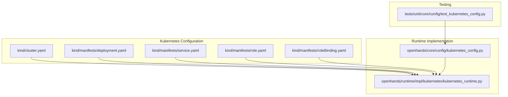
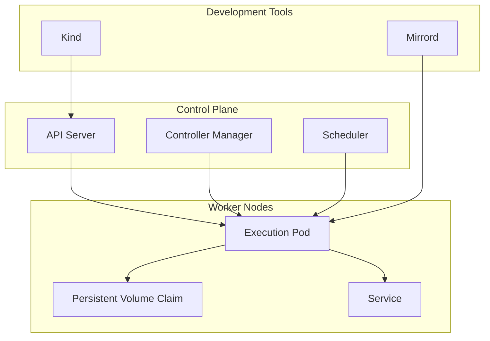
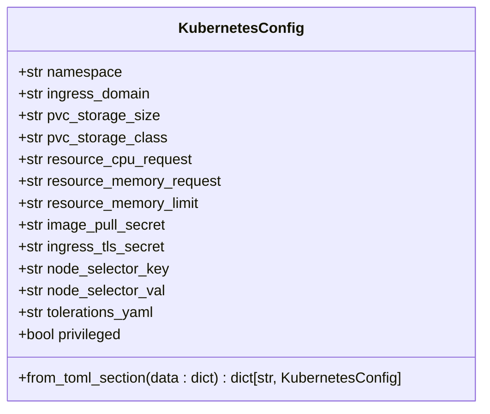
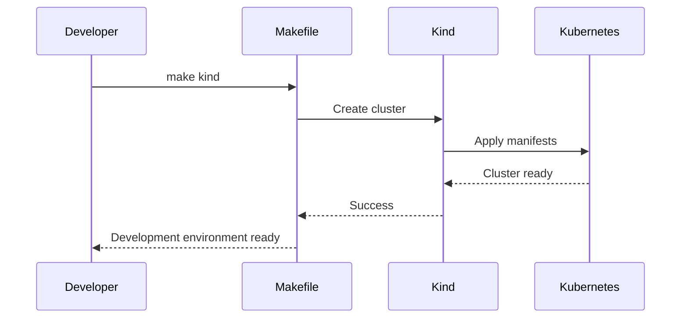
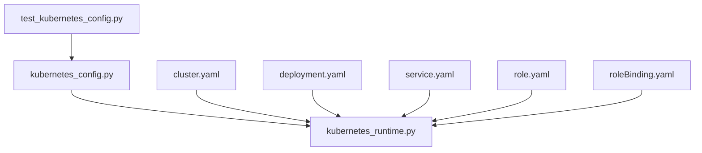

# Kubernetes Execution

<cite>
**Referenced Files in This Document**   
- [kubernetes_config.py](file://openhands/core/config/kubernetes_config.py)
- [kubernetes_runtime.py](file://openhands/runtime/impl/kubernetes/kubernetes_runtime.py)
- [cluster.yaml](file://kind/cluster.yaml)
- [deployment.yaml](file://kind/manifests/deployment.yaml)
- [service.yaml](file://kind/manifests/service.yaml)
- [role.yaml](file://kind/manifests/role.yaml)
- [roleBinding.yaml](file://kind/manifests/roleBinding.yaml)
- [test_kubernetes_config.py](file://tests/unit/core/config/test_kubernetes_config.py)
</cite>

## Table of Contents
1. [Introduction](#introduction)
2. [Project Structure](#project-structure)
3. [Core Components](#core-components)
4. [Architecture Overview](#architecture-overview)
5. [Detailed Component Analysis](#detailed-component-analysis)
6. [Dependency Analysis](#dependency-analysis)
7. [Performance Considerations](#performance-considerations)
8. [Troubleshooting Guide](#troubleshooting-guide)
9. [Conclusion](#conclusion)

## Introduction
The Kubernetes Execution backend in OpenHands provides a robust infrastructure for orchestrating agent execution within Kubernetes clusters. This documentation details the architecture, configuration, and operational aspects of the Kubernetes runtime, with a focus on local development using Kind (Kubernetes IN Docker). The system enables scalable, isolated execution environments for AI agents, leveraging Kubernetes' container orchestration capabilities to manage the lifecycle of execution pods, resource allocation, and service networking.

## Project Structure

**Diagram sources**
- [cluster.yaml](file://kind/cluster.yaml)
- [deployment.yaml](file://kind/manifests/deployment.yaml)
- [service.yaml](file://kind/manifests/service.yaml)
- [role.yaml](file://kind/manifests/role.yaml)
- [roleBinding.yaml](file://kind/manifests/roleBinding.yaml)
- [kubernetes_config.py](file://openhands/core/config/kubernetes_config.py)
- [kubernetes_runtime.py](file://openhands/runtime/impl/kubernetes/kubernetes_runtime.py)
- [test_kubernetes_config.py](file://tests/unit/core/config/test_kubernetes_config.py)

**Section sources**
- [cluster.yaml](file://kind/cluster.yaml)
- [deployment.yaml](file://kind/manifests/deployment.yaml)
- [service.yaml](file://kind/manifests/service.yaml)
- [role.yaml](file://kind/manifests/role.yaml)
- [roleBinding.yaml](file://kind/manifests/roleBinding.yaml)

## Core Components

The Kubernetes Execution backend consists of several core components that work together to provide a seamless execution environment for AI agents. The system is designed to be highly configurable, allowing for customization of pod templates, resource limits, and network policies. The Kubernetes runtime integrates with the core agent system through a well-defined API, enabling the management of execution pods' lifecycle, from creation to termination.

**Section sources**
- [kubernetes_config.py](file://openhands/core/config/kubernetes_config.py)
- [kubernetes_runtime.py](file://openhands/runtime/impl/kubernetes/kubernetes_runtime.py)

## Architecture Overview

**Diagram sources**
- [cluster.yaml](file://kind/cluster.yaml)
- [deployment.yaml](file://kind/manifests/deployment.yaml)
- [service.yaml](file://kind/manifests/service.yaml)

## Detailed Component Analysis

### Kubernetes Configuration Analysis

The Kubernetes configuration is defined in the `kubernetes_config.py` file, which provides a Pydantic model for validating and managing Kubernetes-specific settings. This configuration includes parameters for namespace, ingress domain, persistent volume claims, resource requests and limits, image pull secrets, and node selectors. The configuration is designed to be flexible, allowing for both default values and custom overrides.

**Diagram sources**
- [kubernetes_config.py](file://openhands/core/config/kubernetes_config.py)

**Section sources**
- [kubernetes_config.py](file://openhands/core/config/kubernetes_config.py)

### Kubernetes Runtime Implementation Analysis

The Kubernetes runtime implementation is located in the `kubernetes_runtime.py` file, which contains the logic for creating, managing, and destroying execution pods. The runtime leverages the Kubernetes API to interact with the cluster, ensuring that pods are created with the appropriate configuration and resources. The implementation includes error handling for common issues such as resource constraints and network connectivity.

**Section sources**
- [kubernetes_runtime.py](file://openhands/runtime/impl/kubernetes/kubernetes_runtime.py)

### Local Development Setup Analysis

The local development setup is facilitated by Kind, which allows for the creation of a local Kubernetes cluster using Docker containers. The `cluster.yaml` file defines the cluster configuration, including the control plane node and port mappings. The manifests in the `kind/manifests` directory provide the necessary Kubernetes resources for the development environment, including deployments, services, and RBAC configurations.

**Diagram sources**
- [cluster.yaml](file://kind/cluster.yaml)
- [deployment.yaml](file://kind/manifests/deployment.yaml)
- [service.yaml](file://kind/manifests/service.yaml)
- [role.yaml](file://kind/manifests/role.yaml)
- [roleBinding.yaml](file://kind/manifests/roleBinding.yaml)

**Section sources**
- [cluster.yaml](file://kind/cluster.yaml)
- [deployment.yaml](file://kind/manifests/deployment.yaml)
- [service.yaml](file://kind/manifests/service.yaml)
- [role.yaml](file://kind/manifests/role.yaml)
- [roleBinding.yaml](file://kind/manifests/roleBinding.yaml)

## Dependency Analysis

**Diagram sources**
- [kubernetes_config.py](file://openhands/core/config/kubernetes_config.py)
- [kubernetes_runtime.py](file://openhands/runtime/impl/kubernetes/kubernetes_runtime.py)
- [cluster.yaml](file://kind/cluster.yaml)
- [deployment.yaml](file://kind/manifests/deployment.yaml)
- [service.yaml](file://kind/manifests/service.yaml)
- [role.yaml](file://kind/manifests/role.yaml)
- [roleBinding.yaml](file://kind/manifests/roleBinding.yaml)
- [test_kubernetes_config.py](file://tests/unit/core/config/test_kubernetes_config.py)

**Section sources**
- [kubernetes_config.py](file://openhands/core/config/kubernetes_config.py)
- [kubernetes_runtime.py](file://openhands/runtime/impl/kubernetes/kubernetes_runtime.py)
- [cluster.yaml](file://kind/cluster.yaml)
- [deployment.yaml](file://kind/manifests/deployment.yaml)
- [service.yaml](file://kind/manifests/service.yaml)
- [role.yaml](file://kind/manifests/role.yaml)
- [roleBinding.yaml](file://kind/manifests/roleBinding.yaml)
- [test_kubernetes_config.py](file://tests/unit/core/config/test_kubernetes_config.py)

## Performance Considerations

The Kubernetes Execution backend is designed to handle resource-intensive workloads by leveraging Kubernetes' resource management capabilities. The system allows for the configuration of CPU and memory requests and limits, ensuring that execution pods have the necessary resources to perform their tasks. Additionally, the use of persistent volume claims provides a reliable storage solution for data that needs to persist across pod restarts.

## Troubleshooting Guide

When encountering issues with the Kubernetes Execution backend, the following steps can help diagnose and resolve common problems:

1. Verify that the Kind cluster is running and accessible.
2. Check the Kubernetes manifests for any configuration errors.
3. Ensure that the necessary Docker images are available and correctly tagged.
4. Review the logs from the execution pods for any error messages.
5. Validate that the Kubernetes API server is reachable and responsive.

**Section sources**
- [cluster.yaml](file://kind/cluster.yaml)
- [deployment.yaml](file://kind/manifests/deployment.yaml)
- [service.yaml](file://kind/manifests/service.yaml)
- [role.yaml](file://kind/manifests/role.yaml)
- [roleBinding.yaml](file://kind/manifests/roleBinding.yaml)

## Conclusion

The Kubernetes Execution backend in OpenHands provides a powerful and flexible platform for running AI agents in a containerized environment. By leveraging Kubernetes' orchestration capabilities, the system ensures that agents can execute their tasks in isolated, scalable, and secure environments. The use of Kind for local development simplifies the setup process, making it easy for developers to get started with the platform. With its comprehensive configuration options and robust error handling, the Kubernetes Execution backend is well-suited for both development and production use cases.