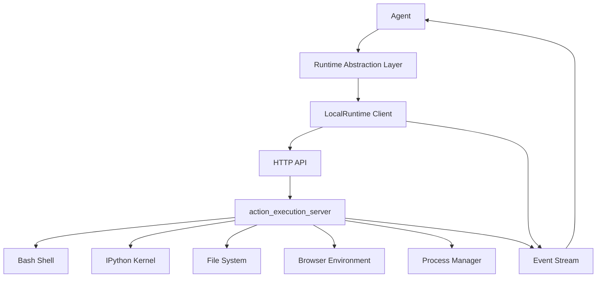
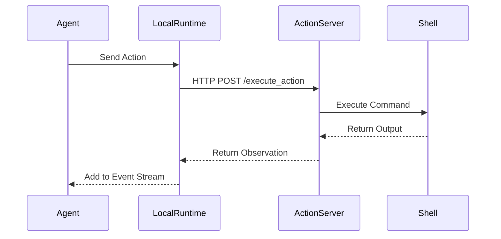
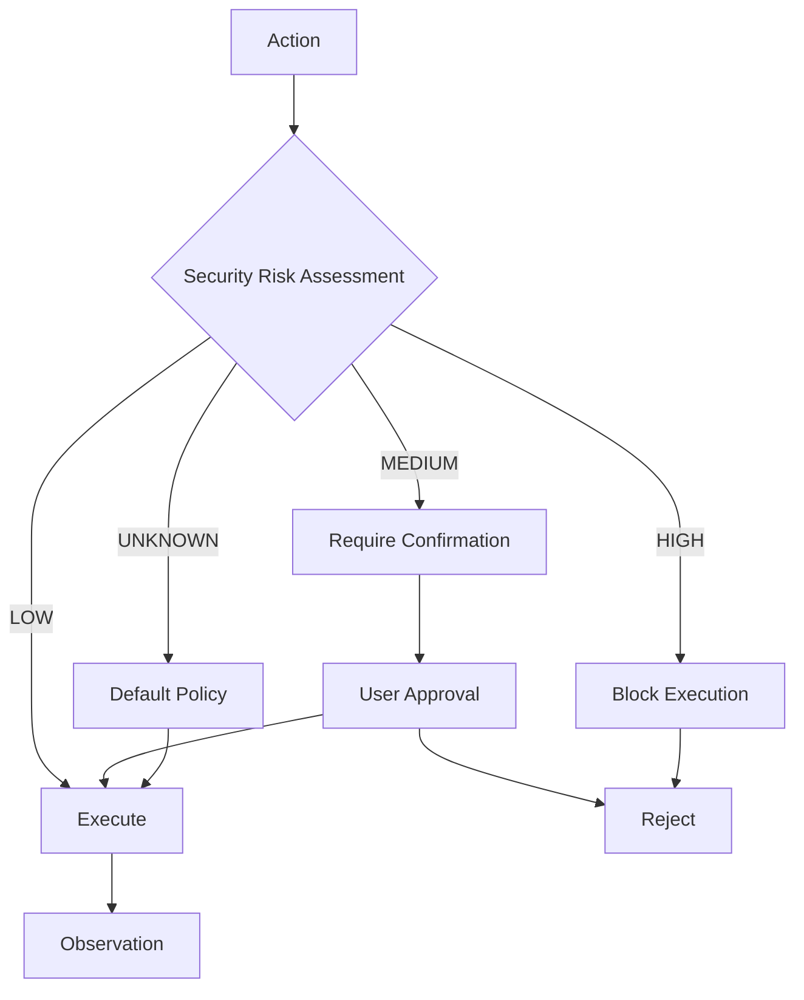

# Local Execution

<cite>
**Referenced Files in This Document**   
- [base.py](file://openhands/runtime/base.py)
- [local_runtime.py](file://openhands/runtime/impl/local/local_runtime.py)
- [analyzer.py](file://openhands/security/analyzer.py)
- [sandbox_config.py](file://openhands/core/config/sandbox_config.py)
</cite>

## Table of Contents
1. [Introduction](#introduction)
2. [Architecture Overview](#architecture-overview)
3. [Initialization Process](#initialization-process)
4. [Command Execution Model](#command-execution-model)
5. [File System Access Patterns](#file-system-access-patterns)
6. [Process Management](#process-management)
7. [Security Considerations](#security-considerations)
8. [Configuration Options](#configuration-options)
9. [Performance Optimization](#performance-optimization)
10. [Cross-Platform Compatibility](#cross-platform-compatibility)

## Introduction

The Local Execution backend in OpenHands provides a direct execution environment on the host machine, enabling agent actions to run without containerization overhead. This runtime implementation is designed for development, testing, and scenarios where Docker is unavailable or undesirable. The LocalRuntime executes the action_execution_server directly on the host, providing the fastest execution speed with direct access to local system resources.

Unlike the Docker Runtime which provides container isolation, the Local Runtime runs with the same permissions as the user executing OpenHands, making it suitable for controlled environments. The runtime architecture follows a client-server model where actions are sent via HTTP to a locally running action_execution_server, which executes them and returns observations. This design enables efficient command execution while maintaining integration with the core agent system through the runtime abstraction layer.

## Architecture Overview

The Local Execution backend follows a modular architecture with clear separation between the runtime client and server components. The system is built around the Runtime abstraction layer that provides a consistent interface for agent interactions with the external environment.

**Diagram sources**
- [base.py](file://openhands/runtime/base.py#L90-L120)
- [local_runtime.py](file://openhands/runtime/impl/local/local_runtime.py#L123-L133)

**Section sources**
- [base.py](file://openhands/runtime/base.py#L1-L1206)
- [local_runtime.py](file://openhands/runtime/impl/local/local_runtime.py#L1-L822)

## Initialization Process

The Local Execution backend initialization process begins with the creation of a LocalRuntime instance that connects to or starts an action_execution_server on the host machine. During initialization, the runtime sets up the workspace directory, which can be either a temporary directory or a specified base path. If no workspace base is configured, a temporary directory is created using Python's tempfile module with a prefix indicating the session ID.

The initialization process includes several key steps: environment variable setup, plugin initialization, and server connection management. Environment variables are added to both the IPython shell and the bash environment using export commands. For IPython, Python code is executed to set os.environ values, while for bash, export commands are run and added to ~/.bashrc for persistence. The runtime also handles git configuration setup, including user.name and user.email settings.

A notable feature of the initialization process is the warm server mechanism, which pre-creates server instances to reduce startup latency. The system maintains a pool of warm servers that can be quickly assigned to new sessions, improving performance in high-throughput scenarios. The number of warm servers is controlled by environment variables INITIAL_NUM_WARM_SERVERS and DESIRED_NUM_WARM_SERVERS.

**Section sources**
- [local_runtime.py](file://openhands/runtime/impl/local/local_runtime.py#L217-L393)
- [base.py](file://openhands/runtime/base.py#L211-L221)

## Command Execution Model

The Local Execution backend implements a robust command execution model that handles various action types through a unified interface. The core of this model is the execute_action method, which sends actions to the action_execution_server via HTTP POST requests and receives observations in response. Each action is serialized to JSON format before transmission, ensuring consistent data exchange between components.

The command execution process follows a strict sequence: action validation, execution, observation generation, and event stream integration. When a command action is received, the runtime first validates its parameters and security risk level. The action is then executed in the appropriate environment - bash commands in the shell, IPython cells in the Jupyter kernel, and file operations through dedicated handlers. After execution, an observation is generated containing the command output, exit code, and metadata.

Long-running commands are handled with special considerations. Commands that may run indefinitely should be executed in the background with output redirection to files. For commands with extended execution times, the timeout parameter can be set to an appropriate value. If a command hits the soft timeout (indicated by exit code -1), subsequent actions with empty commands can retrieve additional logs or send input to the running process.

**Diagram sources**
- [local_runtime.py](file://openhands/runtime/impl/local/local_runtime.py#L434-L477)
- [base.py](file://openhands/runtime/base.py#L369-L407)

## File System Access Patterns

The Local Execution backend provides comprehensive file system access through a set of standardized operations. File operations are abstracted through the Runtime interface, allowing for consistent implementation across different runtime types. The primary file operations include reading, writing, copying, and listing files, all of which are implemented to work seamlessly with the local file system.

File read operations are handled by the read method, which resolves the file path relative to the workspace and returns the file content. The system includes safeguards to prevent access to paths outside the designated workspace, raising PermissionError for unauthorized access attempts. File write operations use the write method, which creates or overwrites files in the workspace directory. The implementation ensures proper handling of file paths and permissions.

A key feature of the file system access model is the copy_to and copy_from methods, which facilitate file transfer between the host and the runtime environment. These methods use zip file compression for efficient data transfer and support both single files and recursive directory copying. The system also provides utilities for resolving file paths between the sandbox environment and the host system, ensuring consistent path handling across different execution contexts.

**Section sources**
- [base.py](file://openhands/runtime/base.py#L98-L99)
- [utils/files.py](file://openhands/runtime/utils/files.py#L43-L86)

## Process Management

Process management in the Local Execution backend is implemented through a combination of shell commands and direct process control. The runtime uses subprocess.Popen to manage the action_execution_server process, with careful handling of process lifecycle events. Each server instance runs in its own process with dedicated ports for HTTP communication, VSCode integration, and application hosting.

The system implements a sophisticated process tracking mechanism using global dictionaries to maintain references to running servers and warm servers. When a server process is created, it is registered in the _RUNNING_SERVERS dictionary with its session ID as the key. This allows for efficient process reuse and connection management. The runtime also monitors process health, automatically detecting and handling process termination.

For resource-intensive tasks, the runtime provides mechanisms to control process execution. Commands can be marked as blocking or non-blocking, with appropriate timeout settings. The system also supports sending control signals to running processes, such as Ctrl+C (C-c), Ctrl+D (C-d), or Ctrl+Z (C-z) to interrupt or suspend execution. This capability enables interactive command handling and graceful process termination.

**Section sources**
- [local_runtime.py](file://openhands/runtime/impl/local/local_runtime.py#L63-L66)
- [local_runtime.py](file://openhands/runtime/impl/local/local_runtime.py#L687-L695)

## Security Considerations

The Local Execution backend presents significant security implications due to its direct execution on the host machine without container isolation. All actions are executed with the same permissions as the user running OpenHands, making it critical to use this runtime only in controlled environments. The system includes several security safeguards to mitigate potential risks.

A key security component is the SecurityAnalyzer framework, which evaluates agent actions for security risks before execution. The framework supports multiple analyzer implementations, including Invariant, LLM, and GraySwan analyzers, each providing different approaches to risk assessment. Actions are classified with security risk levels (LOW, MEDIUM, HIGH, UNKNOWN), allowing for policy-based execution control.

Additional security measures include environment variable management that prevents leakage of sensitive information, git configuration safeguards that prevent unauthorized repository access, and file system access controls that restrict operations to the designated workspace. The system also supports runtime-specific security configurations through the security.analyzer setting, allowing users to select appropriate security policies based on their environment.

Despite these safeguards, the documentation explicitly warns that the Local Runtime provides no isolation and should not be used in production environments or with untrusted code. For secure execution, the Docker Runtime is recommended as it provides proper container isolation.

**Diagram sources**
- [analyzer.py](file://openhands/security/analyzer.py#L8-L37)
- [base.py](file://openhands/runtime/base.py#L195-L205)

## Configuration Options

The Local Execution backend offers extensive configuration options through the SandboxConfig class, allowing users to customize the runtime environment to their specific needs. Configuration is primarily managed through environment variables and configuration files, with sensible defaults for most settings.

Key configuration options include:
- **local_runtime_url**: Specifies the hostname for the local runtime (default: http://localhost)
- **runtime_startup_env_vars**: Dictionary of environment variables to set at runtime launch
- **workspace_base**: Path to the base workspace directory
- **timeout**: Timeout for default sandbox action execution (default: 120 seconds)
- **vscode_port**: Port to use for VSCode integration (random if not specified)

The system also supports advanced configuration through environment variables such as INITIAL_NUM_WARM_SERVERS and DESIRED_NUM_WARM_SERVERS, which control the warm server pool size. The RUNTIME_URL and RUNTIME_URL_PATTERN variables allow for custom URL configurations in different deployment scenarios.

Configuration can be overridden at runtime through the OpenHandsConfig object, enabling dynamic environment customization. The system validates configuration settings using Pydantic models, ensuring type safety and proper error handling for invalid configurations.

**Section sources**
- [sandbox_config.py](file://openhands/core/config/sandbox_config.py#L8-L124)
- [local_runtime.py](file://openhands/runtime/impl/local/local_runtime.py#L135-L200)

## Performance Optimization

The Local Execution backend includes several performance optimization features designed to maximize execution speed and resource efficiency. The most significant optimization is the elimination of containerization overhead, resulting in the fastest possible execution speed among all runtime options.

The warm server mechanism is a key performance feature, pre-creating server instances to reduce startup latency. By maintaining a pool of ready-to-use servers, the system can quickly assign resources to new sessions without the overhead of server initialization. The number of warm servers can be tuned based on workload requirements, balancing memory usage against startup performance.

Resource management is optimized through efficient process handling and connection pooling. The runtime reuses server processes when possible, reducing the overhead of process creation and teardown. The system also implements connection pooling for HTTP requests to the action_execution_server, minimizing network overhead.

For resource-intensive tasks, the runtime provides configuration options to optimize resource allocation. The remote_runtime_resource_factor setting can scale resource allocation, while the enable_gpu option allows for GPU acceleration when available. The system also supports custom Docker runtime arguments through docker_runtime_kwargs, enabling fine-tuned resource configuration.

**Section sources**
- [local_runtime.py](file://openhands/runtime/impl/local/local_runtime.py#L381-L393)
- [sandbox_config.py](file://openhands/core/config/sandbox_config.py#L39-L41)

## Cross-Platform Compatibility

The Local Execution backend is designed with cross-platform compatibility in mind, supporting Linux, macOS, and Windows operating systems. The implementation includes platform-specific adaptations to ensure consistent behavior across different environments.

For Windows systems, the runtime detects the platform and adjusts its behavior accordingly. PowerShell is used instead of bash for environment variable management, with appropriate syntax adjustments. The system also provides warnings about limited tmux functionality on Windows, recommending WSL or Docker runtime for full feature support.

The codebase uses cross-platform compatible libraries and APIs, such as os.path for path manipulation and subprocess for process management. Environment variable handling is normalized across platforms, with automatic detection of platform-specific conventions. The system also handles line ending differences and file permission variations between operating systems.

Platform detection is implemented through sys.platform checks, allowing the runtime to adapt its behavior based on the underlying operating system. This ensures that commands and file operations work correctly regardless of the host environment, while providing appropriate warnings and recommendations for optimal configuration on each platform.

**Section sources**
- [local_runtime.py](file://openhands/runtime/impl/local/local_runtime.py#L149-L154)
- [local_runtime.py](file://openhands/runtime/impl/local/local_runtime.py#L264-L265)