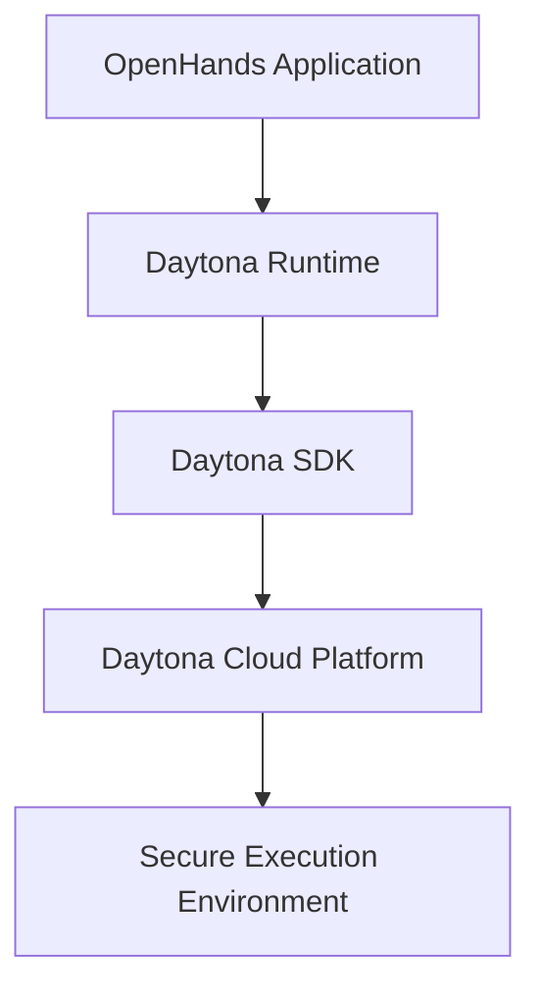
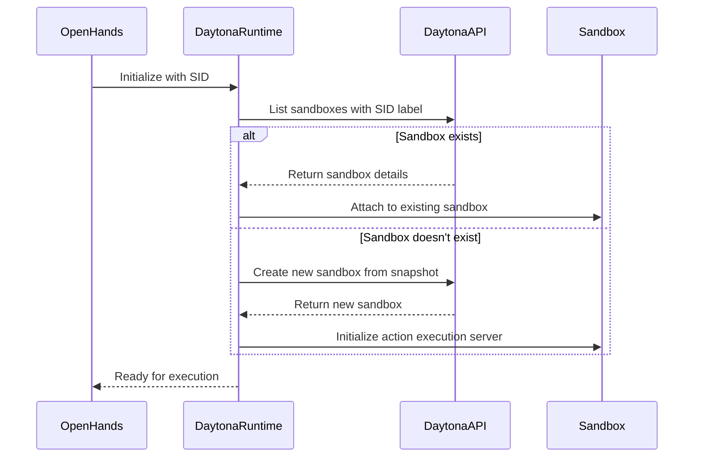
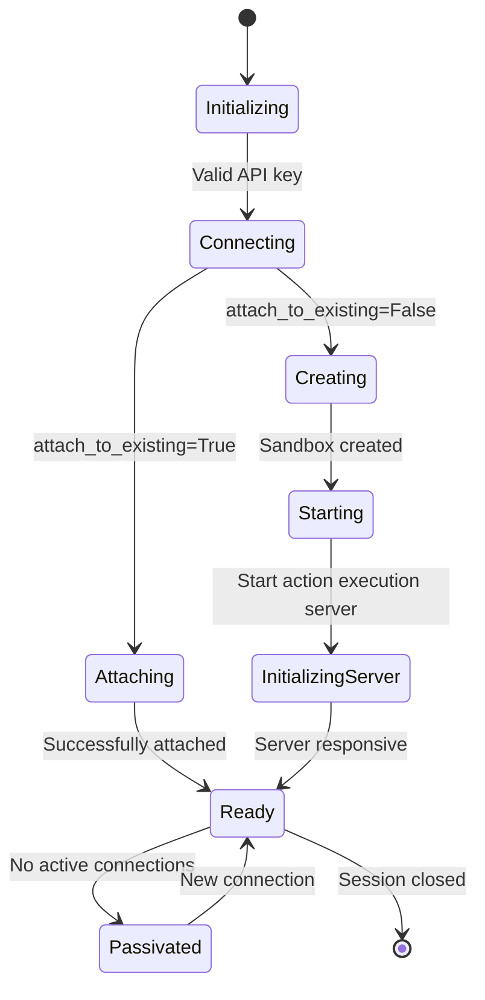
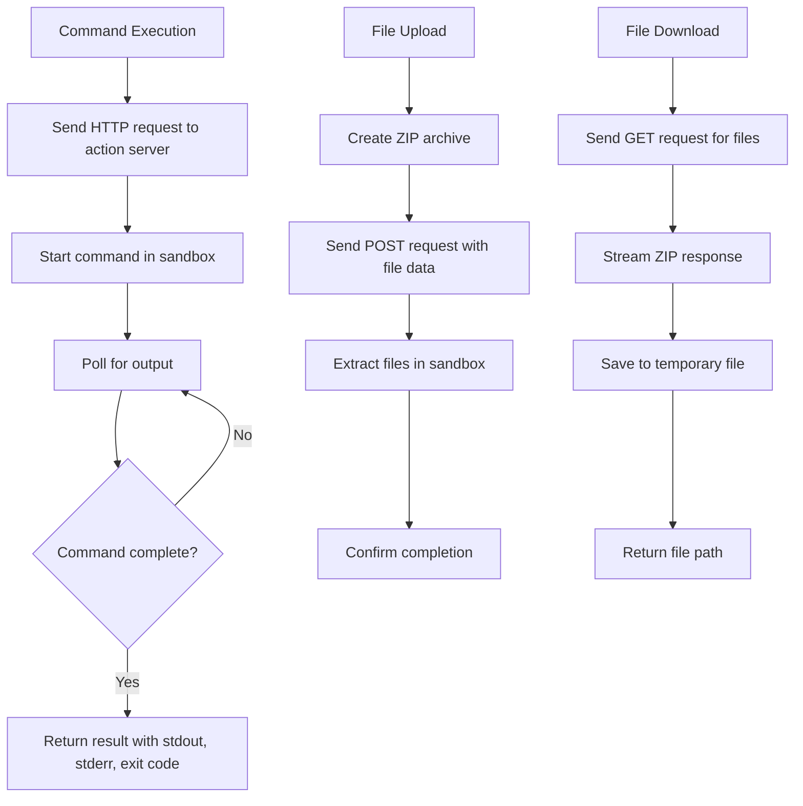
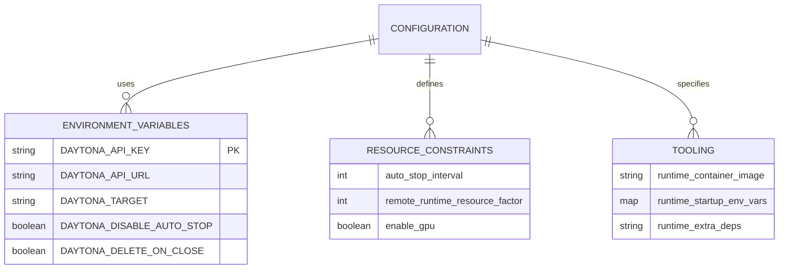

# Daytona Execution

<cite>
**Referenced Files in This Document**   
- [daytona_runtime.py](file://third_party/runtime/impl/daytona/daytona_runtime.py)
- [README.md](file://third_party/runtime/impl/daytona/README.md)
- [async_remote_workspace.py](file://openhands/app_server/utils/async_remote_workspace.py)
- [openhands_config.py](file://openhands/core/config/openhands_config.py)
- [action_execution_client.py](file://openhands/runtime/impl/action_execution/action_execution_client.py)
- [listen_socket.py](file://openhands/server/listen_socket.py)
- [session/README.md](file://openhands/server/session/README.md)
</cite>

## Table of Contents
1. [Introduction](#introduction)
2. [Integration Pattern with Daytona Cloud Environments](#integration-pattern-with-daytona-cloud-environments)
3. [Workspace Provisioning and Connection Protocols](#workspace-provisioning-and-connection-protocols)
4. [Agent Session Establishment and Maintenance](#agent-session-establishment-and-maintenance)
5. [Data Exchange Mechanism Between OpenHands and Daytona](#data-exchange-mechanism-between-openhands-and-daytona)
6. [Configuration Options for Runtime Environments](#configuration-options-for-runtime-environments)
7. [Benefits of Using Daytona for Persistent Development Environments](#benefits-of-using-daytona-for-persistent-development-environments)
8. [Setup Instructions for API Authentication and Workspace Initialization](#setup-instructions-for-api-authentication-and-workspace-initialization)
9. [Limitations and Known Issues](#limitations-and-known-issues)
10. [Conclusion](#conclusion)

## Introduction
Daytona provides a secure and elastic infrastructure for running AI-generated code, offering all necessary features for AI agents to interact with codebases. The OpenHands platform integrates with Daytona through a dedicated runtime implementation that enables programmatic management of development environments and code execution. This document details the integration pattern, workspace provisioning, agent session management, data exchange mechanisms, configuration options, benefits, setup procedures, and limitations of using Daytona as a remote execution backend for OpenHands.

## Integration Pattern with Daytona Cloud Environments
The integration between OpenHands and Daytona is achieved through the Daytona SDK, which provides official Python and TypeScript interfaces. The OpenHands runtime implementation for Daytona acts as a bridge between the OpenHands application and the Daytona platform, enabling seamless execution of AI-generated code in secure cloud environments.

The Daytona runtime in OpenHands is implemented as a specialized DockerRuntime that utilizes Daytona Sandboxes as execution environments. This implementation reads configuration directly from environment variables and uses the Daytona API to manage sandboxes programmatically. The integration allows OpenHands to leverage Daytona's infrastructure for running AI agents, providing a secure and scalable environment for code execution.



**Diagram sources**
- [daytona_runtime.py](file://third_party/runtime/impl/daytona/daytona_runtime.py)
- [README.md](file://third_party/runtime/impl/daytona/README.md)

**Section sources**
- [daytona_runtime.py](file://third_party/runtime/impl/daytona/daytona_runtime.py)
- [README.md](file://third_party/runtime/impl/daytona/README.md)

## Workspace Provisioning and Connection Protocols
Workspace provisioning in the Daytona integration follows a structured process that begins with API authentication and culminates in a fully initialized development environment. The process is initiated by setting the DAYTONA_API_KEY environment variable, which authenticates the OpenHands instance with the Daytona platform.

When a new session is created, the Daytona runtime checks for an existing sandbox with the session ID (SID) label. If no existing sandbox is found, a new one is created from a snapshot specified in the runtime configuration. The sandbox creation process includes setting environment variables, labels, and auto-stop intervals. The runtime supports both attaching to existing sandboxes and creating new ones, providing flexibility for different use cases.

Connection protocols are implemented through HTTP requests to the Daytona API, with the runtime constructing URLs for accessing services within the sandbox. The integration uses persistent connections to maintain session state and ensure reliable communication between OpenHands and the Daytona environment.



**Diagram sources**
- [daytona_runtime.py](file://third_party/runtime/impl/daytona/daytona_runtime.py)
- [README.md](file://third_party/runtime/impl/daytona/README.md)

**Section sources**
- [daytona_runtime.py](file://third_party/runtime/impl/daytona/daytona_runtime.py)
- [README.md](file://third_party/runtime/impl/daytona/README.md)

## Agent Session Establishment and Maintenance
Agent sessions in the Daytona integration are established through a multi-step initialization process that ensures the runtime environment is properly configured before execution begins. The session lifecycle is managed by the DaytonaRuntime class, which inherits from ActionExecutionClient and implements the necessary methods for session management.

When establishing a session, the runtime first checks if it should attach to an existing sandbox or create a new one based on the attach_to_existing parameter. If attaching to an existing sandbox, the runtime retrieves the sandbox using the session ID as a label. If creating a new sandbox, the runtime configures it with the appropriate settings, including environment variables, labels, and auto-stop intervals.

Session maintenance is handled through periodic health checks and automatic reconnection logic. The runtime implements retry mechanisms with exponential backoff to handle transient network issues, ensuring that sessions remain stable even in the face of temporary connectivity problems. The integration also supports passivation of sessions when they are no longer active, allowing for efficient resource management.



**Diagram sources**
- [daytona_runtime.py](file://third_party/runtime/impl/daytona/daytona_runtime.py)
- [action_execution_client.py](file://openhands/runtime/impl/action_execution/action_execution_client.py)

**Section sources**
- [daytona_runtime.py](file://third_party/runtime/impl/daytona/daytona_runtime.py)
- [action_execution_client.py](file://openhands/runtime/impl/action_execution/action_execution_client.py)

## Data Exchange Mechanism Between OpenHands and Daytona
The data exchange mechanism between OpenHands and Daytona is built on HTTP-based communication with the action execution server running inside the Daytona sandbox. This mechanism enables command execution, output streaming, and file transfer capabilities that are essential for AI agent operations.

Command execution is implemented through the execute_command method in the AsyncRemoteWorkspace class, which sends HTTP requests to the action execution server to run bash commands. The method polls for output until the command completes or times out, capturing stdout, stderr, and exit codes. This approach allows for real-time monitoring of command execution and proper handling of long-running processes.

Output streaming is achieved through continuous polling of the command execution endpoint, with the runtime aggregating output parts and returning them as a complete result. This ensures that users receive immediate feedback from executed commands, even for processes that take extended periods to complete.

File transfer capabilities are implemented through dedicated endpoints for uploading and downloading files. The copy_to method packages files into a ZIP archive and uploads them to the sandbox, while the copy_from method downloads files from the sandbox as a ZIP stream. This bidirectional file transfer mechanism enables seamless data exchange between the local environment and the remote Daytona workspace.



**Diagram sources**
- [async_remote_workspace.py](file://openhands/app_server/utils/async_remote_workspace.py)
- [action_execution_client.py](file://openhands/runtime/impl/action_execution/action_execution_client.py)

**Section sources**
- [async_remote_workspace.py](file://openhands/app_server/utils/async_remote_workspace.py)
- [action_execution_client.py](file://openhands/runtime/impl/action_execution/action_execution_client.py)

## Configuration Options for Runtime Environments
The Daytona runtime in OpenHands provides several configuration options for specifying runtime environments, resource constraints, and pre-installed tooling. These options are primarily controlled through environment variables and configuration parameters passed to the runtime constructor.

Key configuration options include:
- DAYTONA_API_KEY: Required API key for authenticating with the Daytona platform
- DAYTONA_API_URL: Optional API URL endpoint (defaults to https://app.daytona.io/api)
- DAYTONA_TARGET: Optional target region (defaults to 'eu', can be set to 'us')
- DAYTONA_DISABLE_AUTO_STOP: Flag to disable automatic sandbox shutdown after 60 minutes
- DAYTONA_DELETE_ON_CLOSE: Flag to delete the sandbox when the runtime is closed

Resource constraints are managed through the sandbox creation parameters, including the auto_stop_interval which determines when inactive sandboxes are automatically stopped. The runtime also supports scaling resource allocation through the remote_runtime_resource_factor configuration option, which can be set to 1, 2, 4, or 8 to adjust resource allocation.

Pre-installed tooling is specified through the runtime_container_image configuration, which defines the snapshot used to create the sandbox. This allows users to select from different base images with various pre-installed tools and dependencies. Additional environment variables can be passed to the sandbox during creation, enabling customization of the runtime environment.



**Diagram sources**
- [daytona_runtime.py](file://third_party/runtime/impl/daytona/daytona_runtime.py)
- [openhands_config.py](file://openhands/core/config/openhands_config.py)

**Section sources**
- [daytona_runtime.py](file://third_party/runtime/impl/daytona/daytona_runtime.py)
- [openhands_config.py](file://openhands/core/config/openhands_config.py)

## Benefits of Using Daytona for Persistent Development Environments
Using Daytona as a remote execution backend offers several significant benefits for persistent development environments and collaborative coding scenarios. These advantages stem from Daytona's cloud-native architecture and its integration with OpenHands' AI agent capabilities.

One of the primary benefits is persistence. Daytona sandboxes maintain their state between sessions, allowing developers to resume work exactly where they left off. This persistence is particularly valuable for AI agents that need to maintain context across multiple interactions, as it eliminates the need to reinitialize environments and reload data.

Collaborative coding is enhanced through Daytona's shared environment capabilities. Multiple users can access the same development environment simultaneously, enabling real-time collaboration on code changes. This is particularly useful for pair programming, code reviews, and team-based development projects.

Security is another key advantage, as Daytona provides isolated execution environments that protect both the host system and the code being developed. The platform's secure infrastructure ensures that AI-generated code runs in a controlled environment with appropriate access restrictions.

Scalability is inherent in the cloud-based model, allowing resources to be dynamically allocated based on demand. This elasticity ensures that compute-intensive tasks can be handled efficiently without requiring local hardware upgrades.

Finally, the integration simplifies setup and configuration, as the Daytona runtime handles environment provisioning automatically. This reduces the overhead associated with configuring development environments and allows teams to focus on coding rather than infrastructure management.

**Section sources**
- [README.md](file://third_party/runtime/impl/daytona/README.md)
- [daytona_runtime.py](file://third_party/runtime/impl/daytona/daytona_runtime.py)

## Setup Instructions for API Authentication and Workspace Initialization
Setting up the Daytona integration requires several steps to authenticate with the Daytona platform and initialize workspaces for use with OpenHands. The process begins with obtaining an API key from the Daytona dashboard and configuring it as an environment variable.

To retrieve the API key:
1. Visit the [Daytona Dashboard](https://app.daytona.io/dashboard/keys)
2. Click "Create Key"
3. Enter a name for the key and confirm creation
4. Copy the generated API key

The API key must be set as an environment variable before starting OpenHands:
- For Mac/Linux: `export DAYTONA_API_KEY="<your-api-key>"`
- For Windows PowerShell: `$env:DAYTONA_API_KEY="<your-api-key>"`

Once the API key is configured, OpenHands can be started using Docker with the appropriate environment variables:
```bash
docker run -it --rm --pull=always \
    -e SANDBOX_RUNTIME_CONTAINER_IMAGE=docker.all-hands.dev/all-hands-ai/runtime:${OPENHANDS_VERSION}-nikolaik \
    -e LOG_ALL_EVENTS=true \
    -e RUNTIME=daytona \
    -e DAYTONA_API_KEY=${DAYTONA_API_KEY} \
    -v ~/.openhands:/.openhands \
    -p 3000:3000 \
    --name openhands-app \
    docker.all-hands.dev/all-hands-ai/openhands:${OPENHANDS_VERSION}
```

Alternatively, OpenHands can be run locally without Docker by setting the RUNTIME and DAYTONA_API_KEY environment variables:
- For Mac/Linux: 
```bash
export RUNTIME="daytona"
export DAYTONA_API_KEY="<your-api-key>"
```
- For Windows PowerShell:
```powershell
$env:RUNTIME="daytona"
$env:DAYTONA_API_KEY="<your-api-key>"
```

The Daytona target region can be specified by setting the DAYTONA_TARGET environment variable to "us" for the US region instead of the default EU region.

**Section sources**
- [README.md](file://third_party/runtime/impl/daytona/README.md)
- [daytona_runtime.py](file://third_party/runtime/impl/daytona/daytona_runtime.py)

## Limitations and Known Issues
While the Daytona integration provides powerful capabilities for remote execution, there are several limitations and known issues to consider when using it as a backend for OpenHands.

One significant limitation is the lack of support for workspace mounting. The Daytona runtime does not support the workspace_base configuration option, as bind mounting into a workspace is not supported by the Daytona platform. This means that local file synchronization must be handled through alternative methods such as file upload/download operations.

Network connectivity requirements are another consideration, as the integration depends on stable internet connectivity to maintain communication between OpenHands and the Daytona platform. Intermittent connectivity can lead to session disruptions, although the runtime includes retry mechanisms to handle transient network issues.

Resource constraints are managed by Daytona's auto-stop feature, which terminates inactive sandboxes after 60 minutes by default. While this can be disabled, it means that long-running processes may be interrupted if they exceed the auto-stop interval.

Authentication dependencies represent another potential limitation, as the integration requires a valid DAYTONA_API_KEY to function. If the API key is revoked or expires, all Daytona-based sessions will fail to initialize.

Performance considerations include the overhead of HTTP-based communication between OpenHands and the action execution server, which may introduce latency compared to local execution. Additionally, file transfer operations are limited by network bandwidth, which can impact the efficiency of large file transfers.

Finally, the integration is subject to Daytona platform limitations and service availability, meaning that any downtime or maintenance on the Daytona side will directly impact the ability to create and use Daytona-based workspaces.

**Section sources**
- [daytona_runtime.py](file://third_party/runtime/impl/daytona/daytona_runtime.py)
- [README.md](file://third_party/runtime/impl/daytona/README.md)

## Conclusion
The Daytona execution backend provides a robust and secure infrastructure for running AI-generated code within OpenHands. Through its integration with the Daytona platform, OpenHands gains access to persistent, scalable, and collaborative development environments that enhance the capabilities of AI agents. The implementation leverages the Daytona SDK to manage sandboxes programmatically, enabling seamless workspace provisioning, agent session management, and data exchange.

While the integration offers significant benefits in terms of persistence, security, and collaboration, users should be aware of its limitations, particularly regarding workspace mounting and network dependencies. The configuration options provide flexibility in managing resources and pre-installed tooling, while the setup process is streamlined through environment variable configuration.

As AI-assisted development continues to evolve, the Daytona integration represents a powerful approach to remote execution that balances security, performance, and usability. By leveraging cloud-native infrastructure, it enables developers and AI agents to work in sophisticated environments without the constraints of local hardware or configuration overhead.

**Section sources**
- [daytona_runtime.py](file://third_party/runtime/impl/daytona/daytona_runtime.py)
- [README.md](file://third_party/runtime/impl/daytona/README.md)