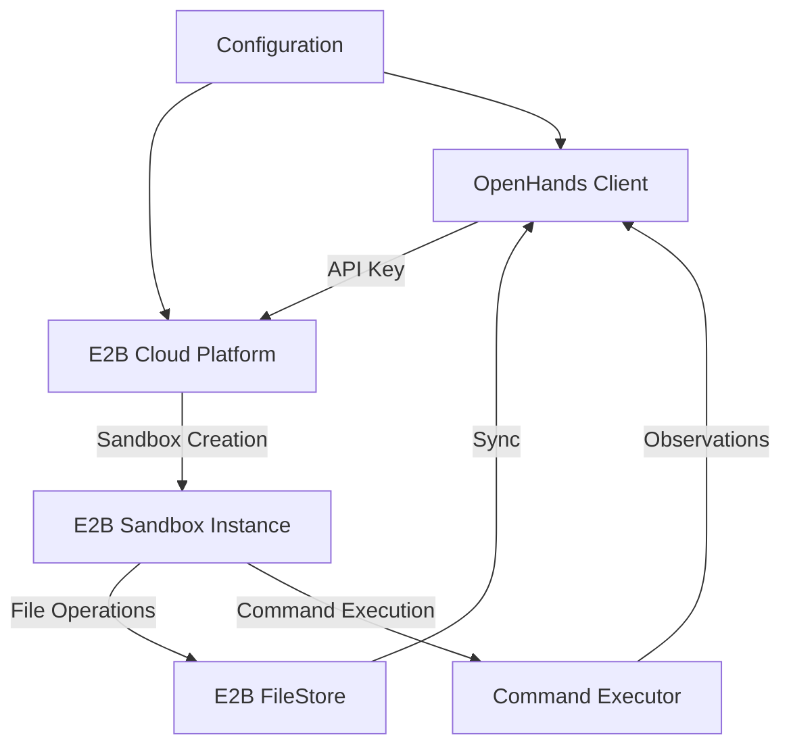
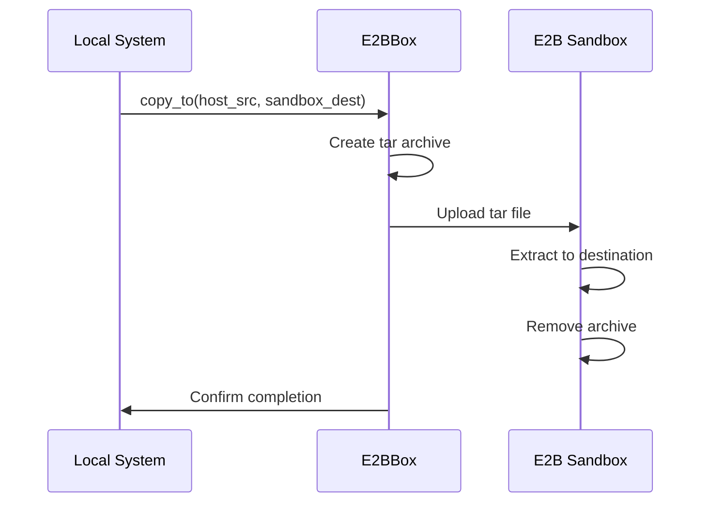
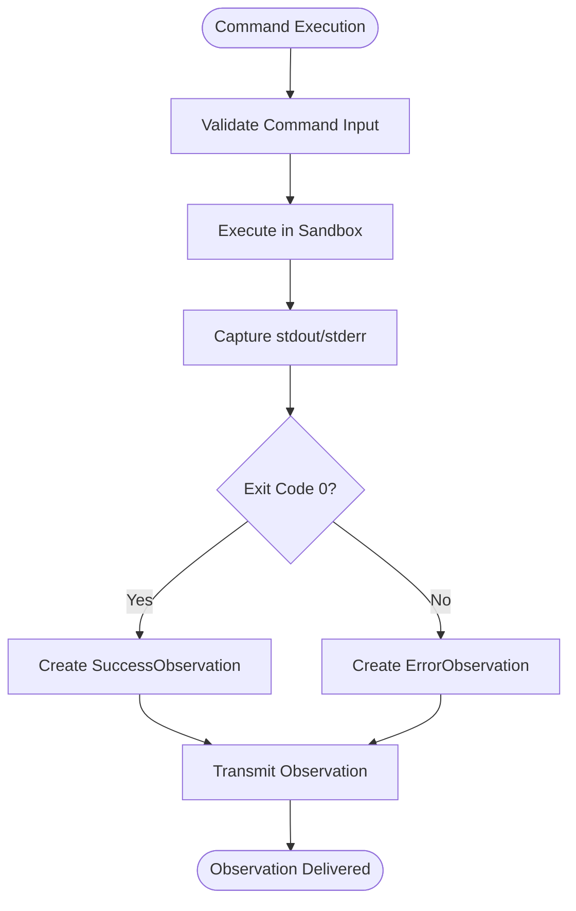

# E2B Execution

<cite>
**Referenced Files in This Document**   
- [E2BBox](file://third_party/runtime/impl/e2b/sandbox.py)
- [E2BFileStore](file://third_party/runtime/impl/e2b/filestore.py)
- [SandboxConfig](file://openhands/core/config/sandbox_config.py)
- [e2b.toml](file://third_party/containers/e2b-sandbox/e2b.toml)
- [Dockerfile](file://third_party/containers/e2b-sandbox/Dockerfile)
- [README.md](file://third_party/runtime/impl/e2b/README.md)
</cite>

## Table of Contents
1. [Introduction](#introduction)
2. [Architecture Overview](#architecture-overview)
3. [Sandbox Isolation and Resource Allocation](#sandbox-isolation-and-resource-allocation)
4. [Authentication and Session Management](#authentication-and-session-management)
5. [File Operations and Synchronization](#file-operations-and-synchronization)
6. [Command Execution and Observation Flow](#command-execution-and-observation-flow)
7. [Configuration Parameters](#configuration-parameters)
8. [Troubleshooting Guide](#troubleshooting-guide)
9. [Security Considerations and Rate Limiting](#security-considerations-and-rate-limiting)

## Introduction
The E2B remote execution backend provides a secure, isolated environment for running AI-generated code and agent tasks. This documentation details the architecture, configuration, and operational aspects of the E2B sandbox environment within the OpenHands framework. The system enables safe execution of code in cloud-based sandboxes with comprehensive isolation, resource management, and security controls.

## Architecture Overview

**Diagram sources**
- [E2BBox](file://third_party/runtime/impl/e2b/sandbox.py)
- [E2BFileStore](file://third_party/runtime/impl/e2b/filestore.py)

**Section sources**
- [E2BBox](file://third_party/runtime/impl/e2b/sandbox.py)
- [README.md](file://third_party/runtime/impl/e2b/README.md)

## Sandbox Isolation and Resource Allocation
The E2B sandbox environment provides strong isolation through containerization technology, ensuring that each execution environment is completely separated from others. The sandbox runs on Ubuntu 24.04 base image with essential development tools pre-installed including Python, Node.js, Git, and various text editors. Each sandbox operates with a dedicated user account in the /home/user directory, preventing cross-sandbox access.

Resource allocation is controlled through configuration parameters that determine the computational resources available to each sandbox instance. The system supports GPU acceleration when enabled through the configuration, allowing for compute-intensive tasks. Network access is available within the sandbox, but all outbound connections are monitored and can be restricted based on security policies.

The sandbox environment is ephemeral by design, with instances being created on-demand and destroyed after use to prevent persistence of state between sessions. This ephemeral nature enhances security by eliminating the risk of data leakage between different execution contexts.

**Section sources**
- [Dockerfile](file://third_party/containers/e2b-sandbox/Dockerfile)
- [SandboxConfig](file://openhands/core/config/sandbox_config.py)

## Authentication and Session Management
Authentication to the E2B platform is managed through API keys, which must be provided as an environment variable (E2B_API_KEY) when initializing the runtime. The authentication mechanism follows a zero-trust model, requiring valid credentials for all interactions with the sandbox environment.

Session creation occurs when a new E2BBox instance is initialized, either by creating a new sandbox or connecting to an existing one. The session lifecycle is managed through the following states:
- Initialization: The sandbox is created with the specified configuration
- Active: The sandbox accepts and executes commands
- Closed: The sandbox is terminated and resources are released

Sessions can be resumed by connecting to an existing sandbox using its ID, allowing for continuation of work across multiple interactions. The system automatically handles session cleanup when a sandbox is no longer needed, ensuring efficient resource utilization.

**Section sources**
- [E2BBox](file://third_party/runtime/impl/e2b/sandbox.py)
- [__init__.py](file://third_party/runtime/impl/e2b/__init__.py)

## File Operations and Synchronization
File operations between the local system and E2B sandbox are synchronized through the filestore interface. The E2BFileStore class implements the FileStore protocol, providing methods for reading, writing, listing, and deleting files within the sandbox environment.

File synchronization occurs through a tar-based transfer mechanism:
1. Local files or directories are archived into a tar file
2. The tar file is uploaded to the sandbox using the E2B API
3. The archive is extracted to the specified destination within the sandbox
4. The temporary archive is removed from both local and remote systems

The copy_to method handles both individual files and recursive directory copying, automatically creating destination directories as needed. All file operations are performed with appropriate permissions to ensure the sandbox user can access the transferred files.

**Diagram sources**
- [E2BBox](file://third_party/runtime/impl/e2b/sandbox.py)
- [E2BFileStore](file://third_party/runtime/impl/e2b/filestore.py)

**Section sources**
- [E2BBox](file://third_party/runtime/impl/e2b/sandbox.py)
- [E2BFileStore](file://third_party/runtime/impl/e2b/filestore.py)

## Command Execution and Observation Flow
Agent commands are executed within the E2B environment through the execute method of the E2BBox class. The execution flow follows these steps:
1. Commands are passed to the sandbox's command runner
2. The command executes within the sandbox environment
3. Output (stdout and stderr) is captured along with the exit code
4. Results are returned to the calling application

Observations are captured and transmitted back through a structured process:
- Command output observations include both stdout and stderr
- File operations generate read/write observations
- Errors are captured as ErrorObservation objects
- Success states are recorded as SuccessObservation objects

The observation flow is designed to provide comprehensive feedback about the execution environment, enabling agents to make informed decisions based on the results of their actions. Observations are serialized and transmitted back to the client for processing and decision-making.

**Diagram sources**
- [E2BBox](file://third_party/runtime/impl/e2b/sandbox.py)
- [agent.py](file://openhands/agenthub/dummy_agent/agent.py)

**Section sources**
- [E2BBox](file://third_party/runtime/impl/e2b/sandbox.py)
- [agent.py](file://openhands/agenthub/dummy_agent/agent.py)

## Configuration Parameters
The E2B sandbox can be customized through various configuration parameters that control its behavior and capabilities:

**Core Configuration Parameters**
- **E2B_API_KEY**: Authentication key for E2B platform access
- **E2B_DOMAIN**: Custom domain for E2B API endpoint
- **timeout**: Command execution timeout in seconds (default: 120)
- **base_container_image**: Base image for the sandbox environment
- **runtime_container_image**: Specific runtime image to use
- **remote_runtime_resource_factor**: Resource scaling factor (1, 2, 4, or 8)

**Sandbox Customization Options**
- **initialize_plugins**: Whether to initialize plugins in the sandbox
- **enable_gpu**: Enable GPU acceleration for the sandbox
- **trusted_dirs**: Local directories that can be accessed by the sandbox
- **volumes**: Volume mounts for persistent storage
- **runtime_startup_env_vars**: Environment variables for the runtime

**Persistent Storage Configuration**
Persistent storage can be configured through volume mounting, allowing specific directories to maintain state between sandbox sessions. The volumes parameter accepts mount specifications in the format 'host_path:container_path[:mode]', enabling both read-write and read-only access to local directories.

Custom sandbox images can be created using the E2B CLI with a Dockerfile, allowing for tailored environments with specific tools and dependencies pre-installed. The e2b.toml configuration file specifies the template name and Dockerfile to use for custom sandbox creation.

**Section sources**
- [SandboxConfig](file://openhands/core/config/sandbox_config.py)
- [e2b.toml](file://third_party/containers/e2b-sandbox/e2b.toml)
- [Dockerfile](file://third_party/containers/e2b-sandbox/Dockerfile)

## Troubleshooting Guide
This section addresses common issues encountered when working with the E2B remote execution backend.

**Connection Failures**
- **Symptom**: "E2B_API_KEY environment variable is required"
- **Solution**: Ensure the E2B_API_KEY environment variable is set before initializing the runtime
- **Symptom**: Connection timeouts to the E2B API
- **Solution**: Verify network connectivity and check if a custom E2B domain is correctly configured

**File Synchronization Errors**
- **Symptom**: "Failed to extract archive to destination"
- **Solution**: Verify that the destination directory has appropriate permissions and sufficient disk space
- **Symptom**: File not found after copy operation
- **Solution**: Check that the correct path is used, noting that paths are relative to /home/user by default

**Performance Bottlenecks**
- **Symptom**: Slow command execution
- **Solution**: Increase the remote_runtime_resource_factor to allocate more resources
- **Symptom**: Frequent timeouts
- **Solution**: Increase the timeout parameter value or optimize the commands being executed

**Debugging Tips**
- Use the E2B CLI to list and connect to running sandboxes for direct inspection
- Enable verbose logging to capture detailed information about sandbox operations
- Test commands in a local environment before executing in the sandbox

**Section sources**
- [E2BBox](file://third_party/runtime/impl/e2b/sandbox.py)
- [README.md](file://third_party/runtime/impl/e2b/README.md)

## Security Considerations and Rate Limiting
The E2B platform implements multiple security measures to protect both the execution environment and the host system:

**Security Features**
- Code execution occurs in isolated containers with no access to the host system
- Network access is monitored and can be restricted based on security policies
- All file operations are confined to the sandbox environment
- API key authentication ensures only authorized users can create sandboxes

**Rate Limiting**
The E2B platform imposes rate limits to prevent abuse and ensure fair resource allocation:
- API request rate limits based on account tier
- Concurrent sandbox limits per API key
- Resource usage quotas for compute and storage

**Best Practices**
- Rotate API keys periodically and store them securely
- Use the principle of least privilege when configuring sandbox permissions
- Monitor sandbox usage and set appropriate timeouts to prevent resource exhaustion
- Regularly update custom sandbox images to include security patches

The combination of strong isolation, authentication controls, and rate limiting creates a secure environment for executing untrusted code while protecting the underlying infrastructure.

**Section sources**
- [E2BBox](file://third_party/runtime/impl/e2b/sandbox.py)
- [__init__.py](file://third_party/runtime/impl/e2b/__init__.py)
- [README.md](file://third_party/runtime/impl/e2b/README.md)