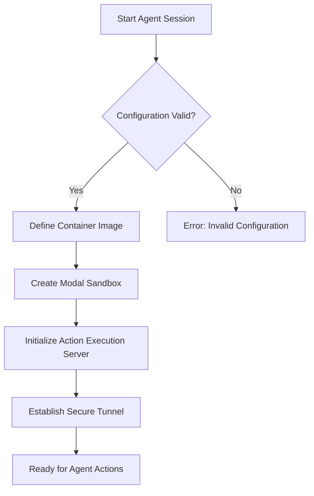
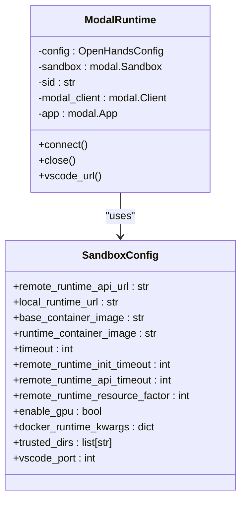
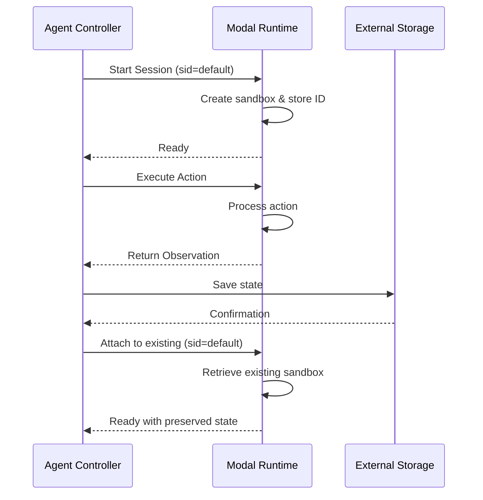
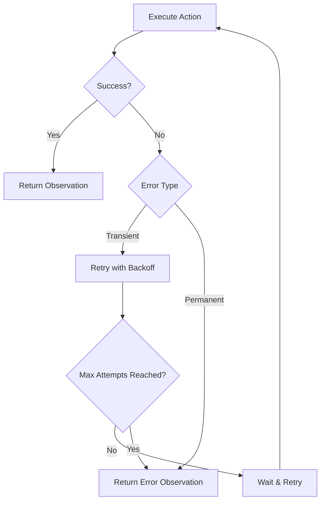

# Modal Execution

<cite>
**Referenced Files in This Document**   
- [modal_runtime.py](file://third_party/runtime/impl/modal/modal_runtime.py)
- [__init__.py](file://third_party/runtime/impl/modal/__init__.py)
- [sandbox_config.py](file://openhands/core/config/sandbox_config.py)
</cite>

## Table of Contents
1. [Introduction](#introduction)
2. [Serverless Computing Model](#serverless-computing-model)
3. [Function Deployment Process](#function-deployment-process)
4. [Container Image Specifications](#container-image-specifications)
5. [Execution Environment Configuration](#execution-environment-configuration)
6. [Request-Response Pattern](#request-response-pattern)
7. [State Management](#state-management)
8. [Authentication and Organization Configuration](#authentication-and-organization-configuration)
9. [Cost Optimization](#cost-optimization)
10. [Error Handling](#error-handling)

## Introduction
The Modal remote execution backend provides a serverless computing platform for running OpenHands agents in isolated environments. This documentation details the integration between Modal and the OpenHands agent system, covering the architecture, configuration, and operational aspects of this integration. The Modal runtime enables scalable, ephemeral execution of agent tasks while maintaining security and isolation.

## Serverless Computing Model
The Modal execution backend employs a serverless computing model where agent runtimes are provisioned on-demand and automatically scaled based on workload. Each agent execution occurs within an isolated Modal sandbox environment that is created when needed and terminated after completion. This model provides several key benefits:

- **Ephemeral environments**: Each agent session runs in a fresh, isolated container that is destroyed after use
- **Automatic scaling**: Modal automatically manages the underlying infrastructure, scaling resources up or down based on demand
- **Pay-per-use pricing**: Users are charged only for the compute resources consumed during execution
- **Zero maintenance**: Modal handles all infrastructure management, including updates, security patches, and monitoring

The serverless model aligns with the OpenHands agent architecture by providing temporary execution environments that can be customized for specific tasks while ensuring isolation between different agent sessions.

**Section sources**
- [modal_runtime.py](file://third_party/runtime/impl/modal/modal_runtime.py#L31-L299)

## Function Deployment Process
The function deployment process for the Modal backend involves several key steps that transform the agent configuration into a running execution environment. When an agent session is initiated, the following deployment sequence occurs:

1. **Configuration validation**: The system validates the Modal API credentials and runtime configuration
2. **Image definition**: A container image is defined based on either a custom runtime image or a base image with additional dependencies
3. **Sandbox creation**: A Modal sandbox is created with the specified configuration, including environment variables and startup commands
4. **Service initialization**: The action execution server is started within the sandbox and made available via a secure tunnel

The deployment process is managed by the `ModalRuntime` class, which handles the lifecycle of the execution environment from creation to termination. The system supports both fresh deployments and attachment to existing runtimes, allowing for session persistence when needed.

**Diagram sources **
- [modal_runtime.py](file://third_party/runtime/impl/modal/modal_runtime.py#L121-L167)
- [modal_runtime.py](file://third_party/runtime/impl/modal/modal_runtime.py#L220-L264)

**Section sources**
- [modal_runtime.py](file://third_party/runtime/impl/modal/modal_runtime.py#L121-L264)

## Container Image Specifications
The Modal execution environment uses container images that can be customized through various configuration options. The system supports two approaches for specifying the container image:

1. **Custom runtime image**: A pre-built container image specified by the `runtime_container_image` configuration parameter
2. **Base image with extensions**: A base container image (specified by `base_container_image`) that is extended with additional dependencies and configurations

The default base image is `nikolaik/python-nodejs:python3.12-nodejs22`, which provides Python 3.12 and Node.js 22. When using a base image, the system automatically generates a Dockerfile that incorporates any specified extra dependencies and applies necessary configurations for the OpenHands environment.

Key container specifications include:
- **Image source**: Can be a public or private registry image
- **Extra dependencies**: Additional packages or tools installed via shell commands
- **Platform specification**: Target platform for the container (e.g., amd64, arm64)
- **Build arguments**: Additional arguments passed to the container build process

The container image is responsible for providing the execution environment where the agent's actions are performed, including access to necessary tools, libraries, and system utilities.

**Section sources**
- [modal_runtime.py](file://third_party/runtime/impl/modal/modal_runtime.py#L181-L214)
- [sandbox_config.py](file://openhands/core/config/sandbox_config.py#L14-L15)

## Execution Environment Configuration
The execution environment for Modal runtimes is configured through a combination of environment variables, resource settings, and runtime parameters. The configuration process involves several key components:

**Environment Variables**: The runtime sets essential environment variables including:
- `port`: The port for the action execution server
- `PYTHONUNBUFFERED`: Ensures Python output is immediately visible
- `VSCODE_PORT`: The port for VSCode integration
- `DEBUG`: Enables debug mode when configured

**Resource Configuration**: The environment can be customized with various resource settings:
- **Resource factor**: Scales CPU and memory allocation (1x, 2x, 4x, or 8x)
- **GPU support**: Enables GPU access for compute-intensive tasks
- **Network configuration**: Specifies network interfaces and additional networks

**Runtime Parameters**: Additional configuration options include:
- **Timeout settings**: Controls for initialization and API request timeouts
- **Plugin initialization**: Configuration for optional runtime plugins
- **Volume mounts**: Directory mappings between host and container

The configuration is managed through the `SandboxConfig` class, which validates and applies settings before runtime creation. This ensures that the execution environment meets the requirements of the specific agent task while maintaining security and performance standards.

**Diagram sources **
- [modal_runtime.py](file://third_party/runtime/impl/modal/modal_runtime.py#L48-L299)
- [sandbox_config.py](file://openhands/core/config/sandbox_config.py#L8-L124)

**Section sources**
- [modal_runtime.py](file://third_party/runtime/impl/modal/modal_runtime.py#L228-L237)
- [sandbox_config.py](file://openhands/core/config/sandbox_config.py#L8-L124)

## Request-Response Pattern
The Modal execution backend uses a request-response pattern to transmit agent actions and receive observations. This communication flow follows a synchronous HTTP-based protocol where the agent controller sends actions to the execution environment and waits for the resulting observations.

The request-response cycle operates as follows:
1. The agent controller sends an action (e.g., command execution, file operation) to the action execution server
2. The server processes the action within the sandbox environment
3. The server returns an observation containing the result of the action
4. The agent controller receives the observation and updates the agent state

Each action is transmitted as an HTTP request to the `/execute_action` endpoint, with the action serialized in the request body. The response contains the observation, which may include output content, exit codes, file contents, or error information. The pattern ensures reliable communication between the agent controller and the execution environment while maintaining clear separation of concerns.

The system implements retry logic for transient network errors, with configurable timeout and retry parameters to handle temporary connectivity issues. This ensures robust communication even in unstable network conditions.

**Section sources**
- [modal_runtime.py](file://third_party/runtime/impl/modal/modal_runtime.py#L168-L180)

## State Management
Given Modal's ephemeral nature, state management between invocations requires specific strategies to maintain context across agent sessions. The system employs several approaches to preserve state while working within the constraints of serverless execution:

**Session Persistence**: The runtime supports attaching to existing sandboxes through session IDs, allowing agents to resume work in the same environment. This is controlled by the `attach_to_existing` parameter and the `MODAL_RUNTIME_IDS` dictionary that tracks active runtime instances.

**External Storage**: For persistent data that must survive beyond a single session, the system relies on external storage mechanisms:
- **Event stream**: Maintains the sequence of actions and observations
- **File storage**: Persists files in external storage systems
- **Database**: Stores structured data and metadata

**Context Caching**: The system implements caching for frequently accessed resources, such as VSCode URLs, to reduce initialization time for subsequent requests. The `vscode_url` property includes built-in caching to avoid repeated tunnel creation.

**State Serialization**: Agent state is serialized and stored externally, allowing reconstruction of the agent's context when needed. This includes the action history, file system state, and any relevant execution context.

These strategies enable the agent system to maintain continuity across invocations while leveraging the benefits of ephemeral execution environments.

**Diagram sources **
- [modal_runtime.py](file://third_party/runtime/impl/modal/modal_runtime.py#L132-L139)
- [modal_runtime.py](file://third_party/runtime/impl/modal/modal_runtime.py#L274-L298)

**Section sources**
- [modal_runtime.py](file://third_party/runtime/impl/modal/modal_runtime.py#L28-L29)
- [modal_runtime.py](file://third_party/runtime/impl/modal/modal_runtime.py#L132-L139)
- [modal_runtime.py](file://third_party/runtime/impl/modal/modal_runtime.py#L274-L298)

## Authentication and Organization Configuration
Authentication for the Modal execution backend is handled through API tokens that provide secure access to the Modal platform. The system requires two environment variables for authentication:

- **MODAL_TOKEN_ID**: The API token ID for authentication
- **MODAL_TOKEN_SECRET**: The API token secret for authentication

These credentials are validated at runtime initialization, and the system raises a `ValueError` if either token is missing. The authentication process uses Modal's client library to establish a secure connection to the Modal API, ensuring that all operations are properly authorized.

For organization-specific deployment configurations, the system supports various customization options:
- **Custom container images**: Organizations can specify private container images with pre-installed tools and configurations
- **Resource allocation**: The `remote_runtime_resource_factor` parameter allows organizations to scale resources based on their needs
- **Network configuration**: Organizations can specify additional network connections and binding addresses
- **Trusted directories**: The `trusted_dirs` parameter defines directories that are trusted for execution

These configuration options enable organizations to tailor the execution environment to their specific requirements while maintaining security and compliance standards.

**Section sources**
- [__init__.py](file://third_party/runtime/impl/modal/__init__.py#L3-L6)
- [modal_runtime.py](file://third_party/runtime/impl/modal/modal_runtime.py#L61-L72)

## Cost Optimization
Optimizing execution costs in the Modal environment involves strategic configuration of timeout settings and resource allocation. The system provides several mechanisms to control costs while maintaining performance:

**Function Timeout Settings**: The runtime implements multiple timeout controls:
- **Initialization timeout**: Configured via `remote_runtime_init_timeout` (default: 180 seconds)
- **API request timeout**: Configured via `remote_runtime_api_timeout` (default: 180 seconds)
- **Action timeout**: Configured via `timeout` parameter (default: 120 seconds)

These timeouts prevent runaway processes from incurring excessive costs and ensure that resources are released promptly when tasks complete or fail.

**Resource Allocation**: The system allows fine-grained control over resource usage:
- **Resource factor**: The `remote_runtime_resource_factor` parameter scales resources by factors of 1, 2, 4, or 8, allowing cost-performance tradeoffs
- **GPU allocation**: The `enable_gpu` parameter controls GPU usage, which significantly impacts costs
- **Container size**: Base and runtime container images can be optimized for minimal footprint

**Lifecycle Management**: Cost optimization also involves managing the runtime lifecycle:
- **Ephemeral environments**: Containers are terminated after use, preventing idle costs
- **Session persistence**: The `attach_to_existing` feature allows reuse of existing environments, reducing startup costs
- **Close delay**: The `close_delay` parameter controls how long environments remain available after completion

By carefully configuring these parameters, organizations can achieve optimal cost efficiency while meeting their performance requirements.

**Section sources**
- [sandbox_config.py](file://openhands/core/config/sandbox_config.py#L17-L19)
- [sandbox_config.py](file://openhands/core/config/sandbox_config.py#L81-L84)
- [sandbox_config.py](file://openhands/core/config/sandbox_config.py#L85-L86)

## Error Handling
The Modal execution backend implements comprehensive error handling patterns to address transient failures and cold start delays. The system employs several strategies to ensure reliability and resilience:

**Transient Failure Handling**: The system uses the Tenacity library to implement retry logic for recoverable errors:
- **Connection errors**: Automatic retries for network connectivity issues
- **Timeout handling**: Configurable retry policies with exponential backoff
- **Rate limiting**: Handling of API rate limits through strategic retry delays

The retry configuration includes:
- Up to 5 attempts for sandbox initialization with exponential backoff
- 120-second timeout for waiting for the container to become alive
- Custom stop conditions that respect application shutdown signals

**Cold Start Mitigation**: To address cold start delays inherent in serverless environments:
- **Pre-warming**: The system includes a 20-second wait after container startup to ensure readiness
- **Connection pooling**: Reuse of existing sandboxes when possible through session attachment
- **Health checking**: Active monitoring of container health before processing requests

**Error Propagation**: The system ensures that errors are properly propagated and logged:
- **Structured error reporting**: Errors are returned as observations with clear diagnostic information
- **Comprehensive logging**: Detailed logs are maintained for debugging and monitoring
- **Graceful degradation**: The system attempts to recover from errors when possible, falling back to alternative strategies

These error handling patterns ensure that the Modal execution backend remains reliable and responsive, even in the face of infrastructure challenges.

**Diagram sources **
- [modal_runtime.py](file://third_party/runtime/impl/modal/modal_runtime.py#L172-L177)
- [modal_runtime.py](file://third_party/runtime/impl/modal/modal_runtime.py#L216-L219)

**Section sources**
- [modal_runtime.py](file://third_party/runtime/impl/modal/modal_runtime.py#L172-L177)
- [modal_runtime.py](file://third_party/runtime/impl/modal/modal_runtime.py#L216-L219)
- [modal_runtime.py](file://third_party/runtime/impl/modal/modal_runtime.py#L153-L154)