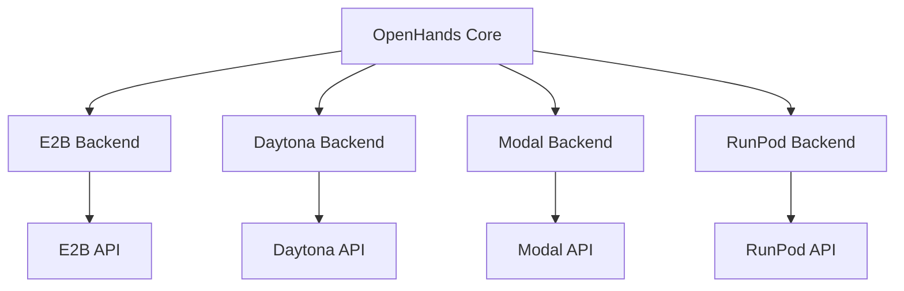
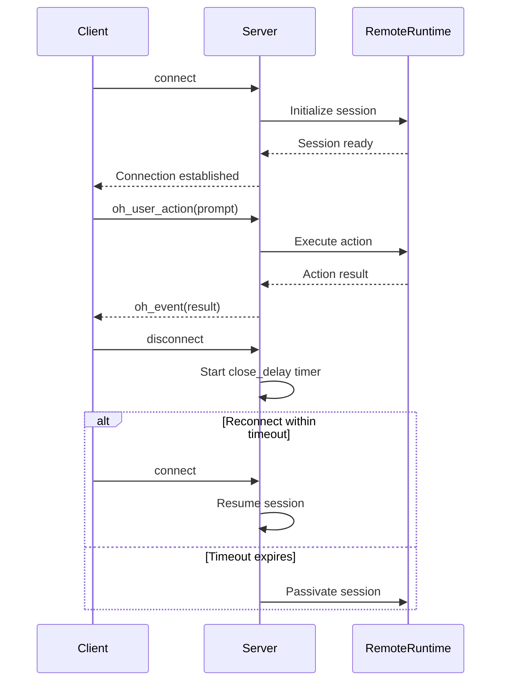
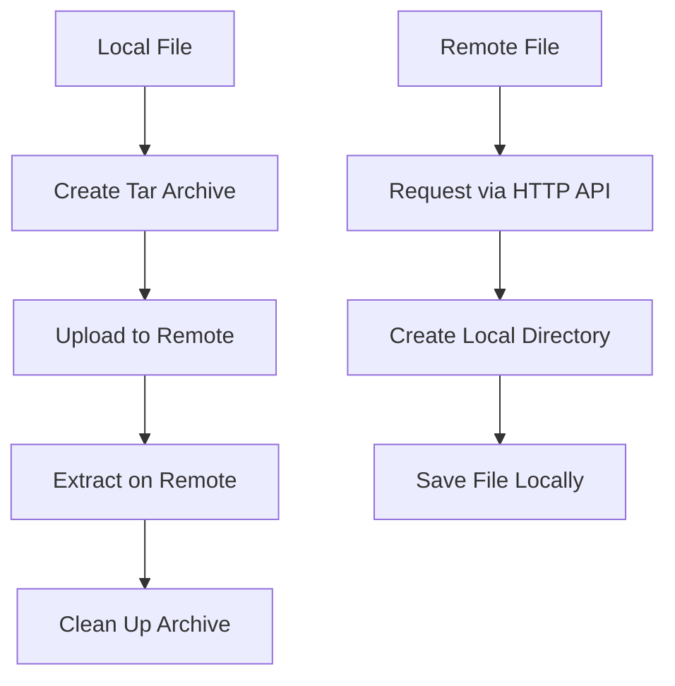

# Remote Execution

<cite>
**Referenced Files in This Document**   
- [sandbox.py](file://third_party/runtime/impl/e2b/sandbox.py)
- [sandbox_config.py](file://openhands/core/config/sandbox_config.py)
- [async_remote_workspace.py](file://openhands/app_server/utils/async_remote_workspace.py)
- [README.md](file://third_party/containers/e2b-sandbox/README.md)
- [__init__.py](file://third_party/runtime/impl/modal/__init__.py)
- [__init__.py](file://third_party/runtime/impl/daytona/__init__.py)
- [__init__.py](file://third_party/runtime/impl/runloop/__init__.py)
- [session/README.md](file://openhands/app_server/session/README.md)
</cite>

## Table of Contents
1. [Introduction](#introduction)
2. [Remote Execution Providers](#remote-execution-providers)
3. [Connection Protocols and Authentication](#connection-protocols-and-authentication)
4. [Session Management](#session-management)
5. [Agent Action Execution](#agent-action-execution)
6. [File Synchronization](#file-synchronization)
7. [Network Latency and Fault Tolerance](#network-latency-and-fault-tolerance)
8. [Infrastructure Requirements](#infrastructure-requirements)
9. [Configuration Options](#configuration-options)
10. [Scalability and Cost Implications](#scalability-and-cost-implications)

## Introduction

The OpenHands platform supports remote execution backends that enable secure, isolated execution of agent actions in cloud-based environments. These backends provide containerized execution environments through various cloud providers, allowing agents to perform complex tasks requiring computational resources beyond local capabilities. The system is designed to support multiple remote execution providers including E2B, Daytona, Modal, and RunPod, each offering different capabilities and infrastructure configurations.

The remote execution architecture follows a client-server model where the core OpenHands system communicates with remote runtime environments through standardized APIs. This design enables seamless integration of different cloud providers while maintaining consistent interfaces for agent operations, file management, and session control.

**Section sources**
- [sandbox.py](file://third_party/runtime/impl/e2b/sandbox.py#L13-L153)
- [README.md](file://third_party/containers/e2b-sandbox/README.md#L1-L16)

## Remote Execution Providers

OpenHands supports multiple remote execution providers, each with specific implementation details and configuration requirements. The primary providers include E2B, Daytona, Modal, and RunPod, each offering unique capabilities for cloud-based code execution.

### E2B Implementation

E2B provides secure cloud environments (sandboxes) specifically designed for running AI-generated code and agents. The implementation uses the E2B Python SDK to manage sandbox lifecycle operations including creation, connection, and destruction. Each sandbox runs in an isolated environment with predefined resource allocations and security constraints.

The E2B backend reads configuration from environment variables, with `E2B_API_KEY` being required for authentication. An optional `E2B_DOMAIN` variable allows specifying a custom API endpoint. The implementation supports both creating new sandboxes and connecting to existing ones through the E2B SDK's `create()` and `connect()` methods respectively.

### Daytona Implementation

Daytona offers cloud-based development environments with API-driven management. The Daytona backend requires `DAYTONA_API_KEY` for authentication, with optional configuration through `DAYTONA_API_URL` (defaulting to https://app.daytona.io/api) and `DAYTONA_TARGET` (defaulting to 'eu' region). This provider focuses on providing persistent development environments that can be shared across team members.

### Modal Implementation

Modal provides serverless infrastructure for running Python applications at scale. The Modal backend requires two authentication tokens: `MODAL_TOKEN_ID` and `MODAL_TOKEN_SECRET`. This provider is optimized for short-lived, high-concurrency workloads, making it suitable for bursty agent execution patterns.

### RunPod Implementation

RunPod offers GPU-accelerated cloud containers with flexible resource provisioning. The RunPod backend requires `RUNLOOP_API_KEY` for authentication and is designed for compute-intensive tasks that benefit from GPU acceleration. This provider is particularly useful for machine learning workloads and other GPU-dependent operations.

**Diagram sources**
- [sandbox.py](file://third_party/runtime/impl/e2b/sandbox.py#L13-L153)
- [__init__.py](file://third_party/runtime/impl/modal/__init__.py#L1-L6)
- [__init__.py](file://third_party/runtime/impl/daytona/__init__.py#L1-L7)
- [__init__.py](file://third_party/runtime/impl/runloop/__init__.py#L1-L5)

**Section sources**
- [sandbox.py](file://third_party/runtime/impl/e2b/sandbox.py#L13-L153)
- [__init__.py](file://third_party/runtime/impl/modal/__init__.py#L1-L6)
- [__init__.py](file://third_party/runtime/impl/daytona/__init__.py#L1-L7)
- [__init__.py](file://third_party/runtime/impl/runloop/__init__.py#L1-L5)

## Connection Protocols and Authentication

The remote execution backends use API-based communication protocols with provider-specific authentication mechanisms. All connections are secured through API key-based authentication, with credentials stored in environment variables to prevent exposure in configuration files.

Each provider implements a consistent interface for connection management, abstracting the underlying API differences. The connection process follows a standardized pattern: authentication validation, session initialization, and capability negotiation. Authentication credentials are validated at initialization time, with appropriate error handling for invalid or missing credentials.

The system uses environment variables as the primary mechanism for storing authentication credentials, following security best practices by avoiding hard-coded secrets. This approach allows for secure credential management through environment configuration and secret management systems.

**Section sources**
- [sandbox.py](file://third_party/runtime/impl/e2b/sandbox.py#L27-L32)
- [__init__.py](file://third_party/runtime/impl/modal/__init__.py#L4-L5)
- [__init__.py](file://third_party/runtime/impl/daytona/__init__.py#L4-L6)
- [__init__.py](file://third_party/runtime/impl/runloop/__init__.py#L4-L5)

## Session Management

Session management in OpenHands follows a WebSocket-based protocol for real-time communication between the client and server. Socket.IO is used as the underlying transport mechanism, providing reliable event delivery and automatic reconnection capabilities in case of network interruptions.

Each session may have zero or more connections associated with it. When a session loses all connections, it enters a passivation state after a configurable delay period determined by `config.sandbox.close_delay`. This allows for session recovery if the client reconnects within the timeout window. Sessions can be resumed, paused, or deleted through dedicated service interfaces that manage the lifecycle of remote execution environments.

The session management system handles three primary events:
- `connect`: Triggered when a new client connection is established
- `oh_user_action`: Triggered when a client sends an action (such as a prompt for the agent)
- `disconnect`: Triggered when a client disconnects from the server

This event-driven architecture enables robust session handling with automatic recovery from transient network issues.

**Diagram sources**
- [session/README.md](file://openhands/app_server/session/README.md#L4-L19)
- [sandbox.py](file://third_party/runtime/impl/e2b/sandbox.py#L51-L59)

**Section sources**
- [session/README.md](file://openhands/app_server/session/README.md#L4-L19)
- [sandbox.py](file://third_party/runtime/impl/e2b/sandbox.py#L51-L59)

## Agent Action Execution

Agent actions are transmitted to remote execution environments through a standardized command execution interface. The system supports various action types including command execution, file operations, and interactive browsing. Each action is serialized and sent to the remote runtime for execution, with results returned to the core system for processing.

Command execution follows a request-response pattern with timeout handling. The `execute()` method sends commands to the remote environment and returns both exit codes and output streams. Timeouts are handled gracefully, with appropriate error messages returned when commands exceed their allotted execution time.

The action execution pipeline includes:
1. Action serialization and transmission
2. Remote execution in the sandboxed environment
3. Result collection and serialization
4. Transmission back to the core system
5. Observation creation and event dispatch

This architecture ensures that all agent actions are executed in isolated environments, maintaining system security while providing comprehensive feedback on execution results.

**Section sources**
- [sandbox.py](file://third_party/runtime/impl/e2b/sandbox.py#L92-L110)
- [async_remote_workspace.py](file://openhands/app_server/utils/async_remote_workspace.py#L109-L142)

## File Synchronization

File synchronization between the local system and remote execution environments is implemented through a tar-based transfer mechanism. Files and directories are archived locally, uploaded to the remote environment, and extracted at the destination path. This approach ensures reliable transfer of file hierarchies while maintaining file permissions and structure.

The `copy_to()` method handles file uploads by:
1. Creating a tar archive of the source file or directory
2. Uploading the archive to the remote environment
3. Extracting the archive at the destination path
4. Cleaning up temporary files

For file downloads, the system uses HTTP-based retrieval through the remote API. The `file_download()` method requests files from the remote system and saves them locally, ensuring the destination directory exists before writing.

The file synchronization system includes error handling for network interruptions and storage limitations, with retry mechanisms for transient failures. This ensures reliable file transfer even in unstable network conditions.

**Diagram sources**
- [sandbox.py](file://third_party/runtime/impl/e2b/sandbox.py#L112-L138)
- [async_remote_workspace.py](file://openhands/app_server/utils/async_remote_workspace.py#L151-L236)

**Section sources**
- [sandbox.py](file://third_party/runtime/impl/e2b/sandbox.py#L112-L138)
- [async_remote_workspace.py](file://openhands/app_server/utils/async_remote_workspace.py#L151-L236)

## Network Latency and Fault Tolerance

The remote execution system incorporates several mechanisms to handle network latency and ensure fault tolerance. Command execution includes configurable timeouts with default values set in the sandbox configuration. The system implements retry logic for recoverable errors such as connection timeouts, with exponential backoff patterns to prevent overwhelming remote services.

For network-sensitive operations, the system uses asynchronous processing to avoid blocking the main execution thread. HTTP requests to remote APIs include timeout parameters to prevent indefinite waiting. The `remote_runtime_enable_retries` configuration option controls whether retry logic is enabled for API requests.

The fault tolerance system includes:
- Connection retry with exponential backoff
- Timeout handling for long-running operations
- Graceful degradation when remote services are unavailable
- Local caching of frequently accessed resources
- Error logging and monitoring for troubleshooting

These mechanisms ensure reliable operation even in suboptimal network conditions, maintaining system responsiveness and user experience.

**Section sources**
- [sandbox_config.py](file://openhands/core/config/sandbox_config.py#L63-L64)
- [async_remote_workspace.py](file://openhands/app_server/utils/async_remote_workspace.py#L116-L120)

## Infrastructure Requirements

Each remote execution provider has specific infrastructure requirements and resource provisioning options. The system supports configurable resource allocation through the `remote_runtime_resource_factor` setting, which can be set to 1, 2, 4, or 8 to scale resources proportionally.

E2B environments require a base container image specified by `base_container_image`, with default value 'nikolaik/python-nodejs:python3.12-nodejs22'. Additional dependencies can be installed through the `runtime_extra_deps` configuration option, which accepts shell commands to be executed during container setup.

GPU support is available through the `enable_gpu` configuration option, which provisions GPU-accelerated instances when supported by the provider. The `docker_runtime_kwargs` configuration allows passing additional parameters to the Docker runtime for advanced resource control.

All remote execution environments are designed to be ephemeral, with automatic cleanup after session termination. This ensures efficient resource utilization and cost management.

**Section sources**
- [sandbox_config.py](file://openhands/core/config/sandbox_config.py#L85-L87)
- [sandbox.py](file://third_party/runtime/impl/e2b/sandbox.py#L56-L58)

## Configuration Options

The remote execution system provides extensive configuration options for customizing backend behavior. Configuration is managed through the `SandboxConfig` class, which exposes parameters for all aspects of remote execution.

Key configuration options include:
- `remote_runtime_api_url`: API endpoint for remote runtime services
- `timeout`: Default timeout for sandbox actions
- `remote_runtime_init_timeout`: Timeout for runtime initialization
- `remote_runtime_api_timeout`: Timeout for API requests
- `remote_runtime_enable_retries`: Enable retry logic for API requests
- `remote_runtime_resource_factor`: Scale factor for resource allocation
- `enable_gpu`: Enable GPU acceleration
- `runtime_startup_env_vars`: Environment variables for runtime initialization

Providers can be selected and configured through environment variables, allowing for easy switching between different backends without code changes. Resource provisioning and performance tuning can be adjusted through configuration parameters to optimize cost-performance tradeoffs.

**Section sources**
- [sandbox_config.py](file://openhands/core/config/sandbox_config.py#L49-L97)

## Scalability and Cost Implications

The remote execution architecture is designed for horizontal scalability, allowing multiple concurrent sessions across different providers. The system can distribute workloads across providers based on availability, cost, and performance characteristics.

Cost implications vary by provider and usage patterns. E2B and Daytona typically charge based on active session time, while Modal uses a serverless pricing model based on execution duration and resource usage. RunPod pricing depends on instance type and duration, with GPU instances commanding premium rates.

The system includes cost optimization features:
- Automatic session passivation after inactivity
- Configurable resource scaling to match workload requirements
- Support for spot instances where available
- Usage monitoring and reporting

Scalability benefits include:
- Ability to handle bursty workloads through on-demand provisioning
- Geographic distribution through provider regions
- Parallel execution of independent tasks
- Resource isolation between concurrent sessions

These features enable efficient scaling from individual developer use to enterprise-level deployment, with cost controls to manage budget constraints.

**Section sources**
- [sandbox_config.py](file://openhands/core/config/sandbox_config.py#L81-L84)
- [session/README.md](file://openhands/app_server/session/README.md#L18-L19)