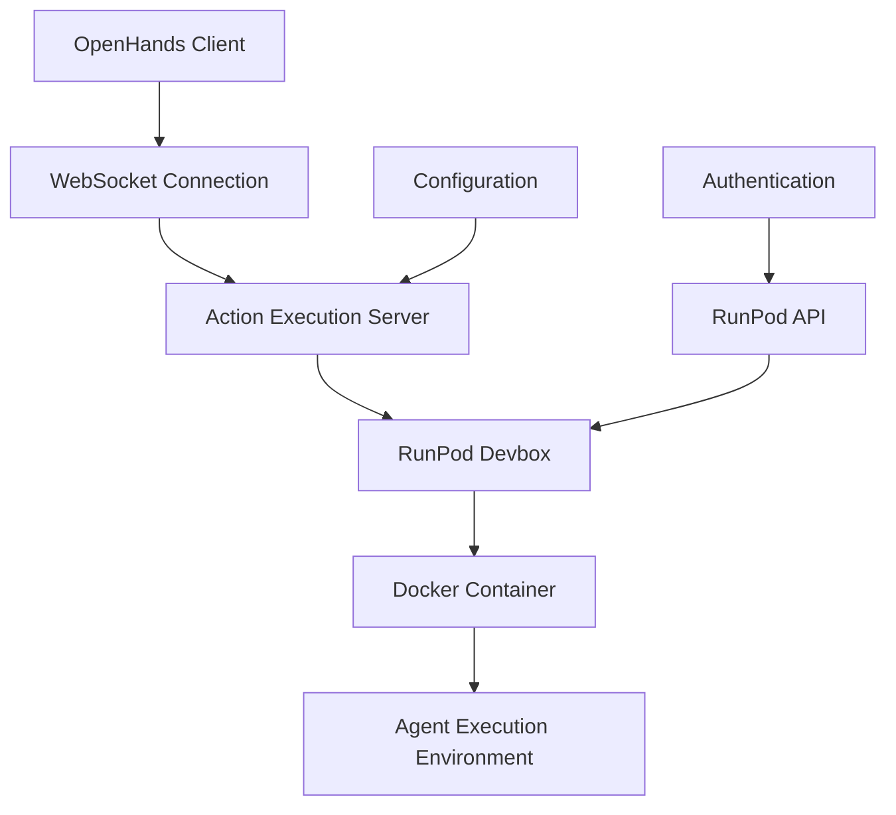
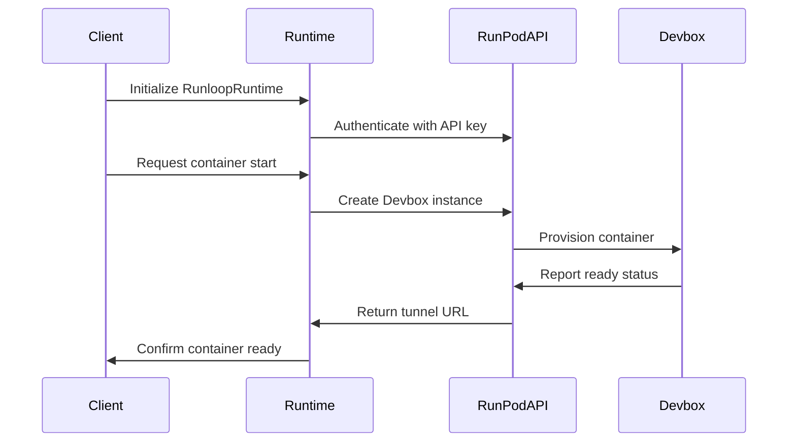
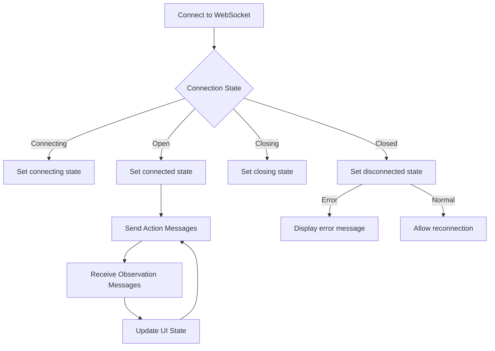
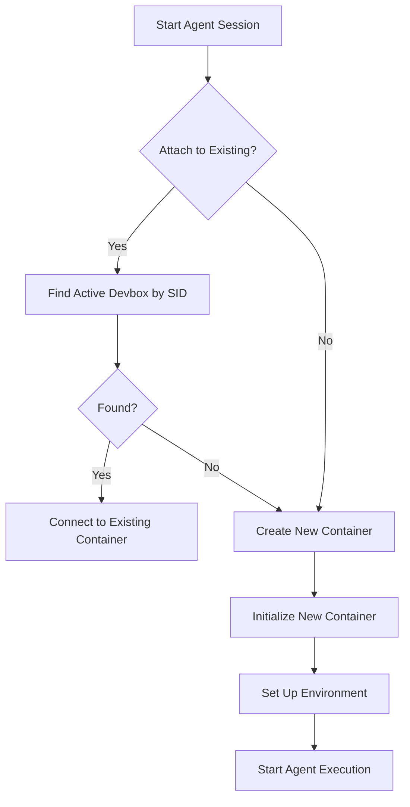
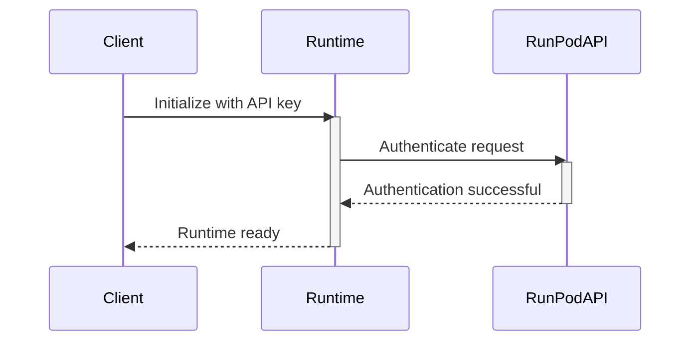
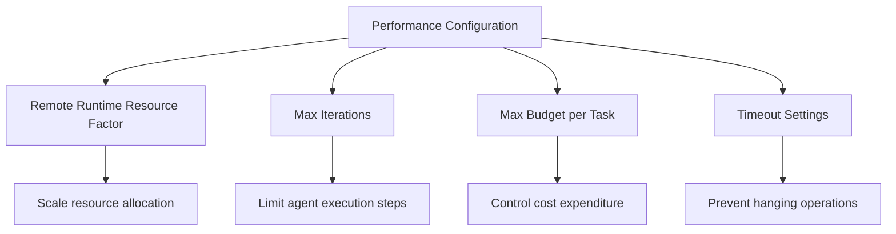

# RunPod Execution

<cite>
**Referenced Files in This Document**   
- [runloop_runtime.py](file://third_party/runtime/impl/runloop/runloop_runtime.py)
- [README.md](file://third_party/runtime/impl/runloop/README.md)
- [action_execution_client.py](file://openhands/runtime/impl/action_execution/action_execution_client.py)
- [use-websocket.ts](file://frontend/src/hooks/use-websocket.ts)
- [conversation-websocket-context.tsx](file://frontend/src/contexts/conversation-websocket-context.tsx)
- [config.py](file://openhands/core/config/__init__.py)
- [settings.py](file://openhands/storage/data_models/settings.py)
</cite>

## Table of Contents
1. [Introduction](#introduction)
2. [Architecture Overview](#architecture-overview)
3. [Container Orchestration](#container-orchestration)
4. [WebSocket Communication Protocol](#websocket-communication-protocol)
5. [Container Provisioning](#container-provisioning)
6. [Agent State Management](#agent-state-management)
7. [Authentication Mechanisms](#authentication-mechanisms)
8. [Performance Configuration](#performance-configuration)
9. [Troubleshooting Guide](#troubleshooting-guide)

## Introduction
The RunPod execution backend provides a secure and scalable environment for agent execution through container orchestration. This documentation details the architecture and operational aspects of the RunPod (RunLoop) system, focusing on how containers are managed, how communication is established, and how various configuration options affect performance and reliability.

## Architecture Overview
The RunPod execution system follows a client-server architecture where the OpenHands application connects to remote execution environments (Devboxes) orchestrated by RunPod. The architecture consists of several key components:



**Diagram sources**
- [runloop_runtime.py](file://third_party/runtime/impl/runloop/runloop_runtime.py#L25-L206)
- [action_execution_client.py](file://openhands/runtime/impl/action_execution/action_execution_client.py#L61-L494)

The system enables remote agent execution by creating isolated container environments that can be accessed through a secure WebSocket connection. The Action Execution Server acts as an intermediary between the client and the container, handling all commands and observations.

## Container Orchestration
The RunPod runtime orchestrates containers through the RunPod API, managing the lifecycle of Devbox instances that serve as agent execution environments. The orchestration process involves several key steps:

1. **Initialization**: The RunloopRuntime class initializes with configuration parameters and establishes a connection to the RunPod API using the provided API key.
2. **Container Creation**: When a new session is started, the system creates a Devbox instance with specified resource requirements and environment configuration.
3. **Connection Management**: The system establishes a tunnel to the Devbox, enabling communication with the action execution server running inside the container.
4. **Lifecycle Control**: The runtime manages the container's lifecycle, including startup, execution, and shutdown.

The container orchestration is implemented in the RunloopRuntime class, which extends the ActionExecutionClient base class to provide RunPod-specific functionality.



**Diagram sources**
- [runloop_runtime.py](file://third_party/runtime/impl/runloop/runloop_runtime.py#L31-L164)
- [action_execution_client.py](file://openhands/runtime/impl/action_execution/action_execution_client.py#L61-L494)

**Section sources**
- [runloop_runtime.py](file://third_party/runtime/impl/runloop/runloop_runtime.py#L25-L206)

## WebSocket Communication Protocol
The communication between OpenHands and RunPod instances occurs through a WebSocket-based protocol that enables real-time interaction. The protocol facilitates bidirectional communication for sending actions and receiving observations.

The WebSocket connection is established using the useWebSocket hook in the frontend, which manages the connection lifecycle and message handling:



**Diagram sources**
- [use-websocket.ts](file://frontend/src/hooks/use-websocket.ts#L3-L85)
- [conversation-websocket-context.tsx](file://frontend/src/contexts/conversation-websocket-context.tsx#L82-L156)

The WebSocket protocol supports three main message types:
- **Action Messages**: Commands sent from the client to the agent environment
- **Observation Messages**: Responses and results from the agent environment
- **Status Messages**: Connection and execution status updates

The frontend implementation ensures reliable connection management by handling various WebSocket events:
- **onOpen**: Triggered when the connection is successfully established
- **onMessage**: Handles incoming messages from the server
- **onClose**: Manages connection closure, distinguishing between normal and error conditions
- **onError**: Handles connection errors and notifies the user

**Section sources**
- [use-websocket.ts](file://frontend/src/hooks/use-websocket.ts#L3-L85)
- [conversation-websocket-context.tsx](file://frontend/src/contexts/conversation-websocket-context.tsx#L82-L156)

## Container Provisioning
The container provisioning process in the RunPod execution backend involves several configuration aspects that determine the characteristics of the execution environment.

### Image Selection
The container image is selected through configuration parameters that specify the base image for the Devbox. The RunPod runtime uses a prebuilt "openhands" image by default, which contains the necessary tools and dependencies for agent execution.

### GPU Allocation
GPU resources can be allocated to containers through configuration settings. When GPU support is enabled, the system configures the container to access available GPU resources, allowing agents to perform compute-intensive tasks that benefit from hardware acceleration.

### Persistent Storage Configuration
Persistent storage is configured through environment variables that specify volume mounts. The workspace directory on the host system is mounted to the container's workspace path, enabling file persistence across sessions.

The provisioning process is controlled by the launch parameters specified when creating a Devbox instance:

```python
launch_parameters=LaunchParameters(
    available_ports=[self._sandbox_port, self._vscode_port],
    resource_size_request="LARGE",
    launch_commands=[
        f"mkdir -p {self.config.workspace_mount_path_in_sandbox}"
    ],
)
```

This configuration specifies:
- **Available ports**: Exposes the sandbox and VSCode ports
- **Resource size**: Requests a LARGE resource allocation
- **Launch commands**: Executes commands during container startup

**Section sources**
- [runloop_runtime.py](file://third_party/runtime/impl/runloop/runloop_runtime.py#L118-L124)
- [config.py](file://openhands/core/config/__init__.py#L1-L60)

## Agent State Management
Agent state is maintained across multiple interactions with the same RunPod instance through several mechanisms:

1. **Session Identification**: Each agent session is identified by a session ID (sid), which is used to associate the agent with its execution environment.
2. **State Persistence**: The container environment retains its state between interactions, preserving file system changes, installed packages, and running processes.
3. **Connection Reuse**: When attaching to an existing container, the agent can continue from the previous state rather than starting fresh.

The RunloopRuntime class supports both new container creation and attachment to existing containers:



**Diagram sources**
- [runloop_runtime.py](file://third_party/runtime/impl/runloop/runloop_runtime.py#L132-L142)

When a container is created, the system sets up the initial environment and installs required plugins. Subsequent interactions with the same session ID can either attach to this existing container or create a new one, depending on the configuration.

The state management system also handles environment variables, which are preserved across interactions when using the same container instance. This allows agents to maintain configuration settings and authentication tokens between sessions.

**Section sources**
- [runloop_runtime.py](file://third_party/runtime/impl/runloop/runloop_runtime.py#L132-L164)

## Authentication Mechanisms
The RunPod execution backend uses API key-based authentication to secure access to the RunPod service and identify workspaces.

### RunPod API Keys
Authentication with the RunPod API requires a valid API key, which must be provided as an environment variable:

```python
runloop_api_key = os.getenv("RUNLOOP_API_KEY")
if not runloop_api_key:
    raise ValueError(
        "RUNLOOP_API_KEY environment variable is required for Runloop runtime"
    )
```

The API key is used to authenticate all requests to the RunPod API, ensuring that only authorized clients can create and manage Devbox instances.

### Workspace Identifiers
Workspaces are identified through session IDs (sid) that are passed to the RunloopRuntime constructor. These identifiers are used to:
- Name Devbox instances
- Create container names
- Associate containers with specific user sessions

The authentication system also integrates with the OpenHands configuration system, which can store additional authentication credentials for various services that agents may need to access.



**Diagram sources**
- [runloop_runtime.py](file://third_party/runtime/impl/runloop/runloop_runtime.py#L44-L49)

**Section sources**
- [runloop_runtime.py](file://third_party/runtime/impl/runloop/runloop_runtime.py#L44-L49)
- [settings.py](file://openhands/storage/data_models/settings.py#L127-L158)

## Performance Configuration
The RunPod execution backend provides several configuration options for performance tuning, allowing users to optimize resource allocation and execution behavior.

### Instance Sizing
Instance size is configured through the resource_size_request parameter in the launch configuration. The available options include:
- SMALL
- MEDIUM
- LARGE
- XLARGE

Larger instances provide more CPU and memory resources, enabling faster execution of compute-intensive tasks.

### Network Bandwidth
Network performance is optimized through the use of stable tunnel URLs provided by the RunPod API. The system creates dedicated tunnels for both the sandbox server and VSCode interface, ensuring consistent network performance.

### Auto-scaling Policies
While the current implementation focuses on single-instance execution, the architecture supports potential auto-scaling through:
- Configuration of resource limits
- Monitoring of container performance
- Dynamic instance creation based on workload

Performance-related settings are also available through the OpenHands configuration system:



**Diagram sources**
- [settings.py](file://openhands/storage/data_models/settings.py#L127-L158)

The remote_runtime_resource_factor setting allows users to scale resource allocation for remote runtimes, while max_budget_per_task helps control costs by setting spending limits for agent operations.

**Section sources**
- [settings.py](file://openhands/storage/data_models/settings.py#L127-L158)
- [server_config.py](file://openhands/server/config/server_config.py#L35-L61)

## Troubleshooting Guide
This section provides guidance for diagnosing and resolving common issues with the RunPod execution backend.

### Container Startup Failures
Container startup failures can occur due to several reasons:

1. **Missing API Key**: Ensure the RUNLOOP_API_KEY environment variable is set
2. **Authentication Issues**: Verify the API key is valid and has appropriate permissions
3. **Resource Limits**: Check if the requested resource size exceeds available quotas

To diagnose startup failures, check the following:
- Verify the API key is correctly configured
- Check the RunPod dashboard for container status
- Review logs for error messages related to container creation

### Network Timeouts
Network timeouts may occur during WebSocket communication or HTTP requests to the action execution server. Common causes include:

1. **Unstable Internet Connection**: Ensure a stable network connection
2. **Firewall Restrictions**: Verify that WebSocket connections are allowed
3. **Server Overload**: Check if the container is under heavy load

The system implements retry logic with exponential backoff to handle transient network issues:

```python
@tenacity.retry(
    stop=tenacity.stop_after_delay(120) | stop_if_should_exit(),
    wait=tenacity.wait_fixed(1),
    reraise=(ConnectionRefusedError,),
)
def _wait_until_alive(self):
    super().check_if_alive()
```

### Resource Exhaustion
Resource exhaustion can occur when containers exceed their allocated CPU, memory, or storage limits. Symptoms include:
- Slow execution performance
- Command timeouts
- Process termination

To address resource exhaustion:
1. Increase the resource_size_request parameter
2. Monitor memory usage and optimize agent operations
3. Implement proper cleanup of temporary files

The system provides configuration options to manage resource usage, such as setting maximum memory limits and controlling the number of execution iterations.

**Section sources**
- [runloop_runtime.py](file://third_party/runtime/impl/runloop/runloop_runtime.py#L166-L173)
- [test_runtime_resource.py](file://tests/runtime/test_runtime_resource.py#L41-L115)
- [use-websocket.ts](file://frontend/src/hooks/use-websocket.ts#L44-L55)